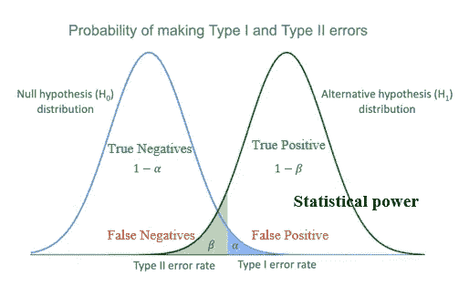
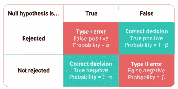
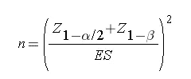
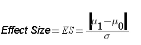

# 面向数据科学家的功耗分析

> 原文：<https://towardsdatascience.com/power-analysis-17636d3f059b>

## 确定统计分析所需的样本量

克劳迪奥·施瓦兹在 [Unsplash](https://unsplash.com?utm_source=medium&utm_medium=referral) 上的照片

功效分析是每个数据科学家和统计学家都应该熟悉的统计方法之一。

功率分析的主要目标或用途是:

1.  确定一个统计检验是否有足够的概率(或功效)在有效应的情况下找到一个效应(真阳性)？
2.  假设我们有显著性水平、效应大小和统计功效，估计实验所需的样本量。

确定正确的(或最少的)样本对于任何统计测试或实验都是至关重要的。使用人口数据几乎是不可能的，收集人口数据也很昂贵；在这种情况下，我们从总体中随机收集样本，以代表基本的统计测量或分布，用于统计测试或建模——既经济又实用。

假设检验(图片由作者提供)

通常，统计检验或建模涉及假设检验，以确定两组是否显著不同(真实效果或无效果)。该假设包括:

*   零假设
*   另一假设

零假设是指没有找到足够的证据来验证替代假设。替代假设是指有足够的证据支持替代假设。例如，与安慰剂相比，药物的效果。同样，功效分析是这样一个概念，即当效果实际上是正面的时，通过假设计算预测正面效果的概率。

另一个合适的例子是垃圾邮件的检测。零假设将声明垃圾邮件和非垃圾邮件之间没有区别(都属于同一类别)，这两个组之间缺乏统计意义。另一种假设是垃圾邮件和非垃圾邮件之间存在显著差异。

假设检验(图片由作者提供)

*   真阳性:有效果时发现效果的概率。
*   真阴性:没有效果时发现不了效果的概率。
*   假阳性(I 型错误)):在没有效果的情况下发现效果的概率。错误地拒绝零假设或接受替代假设。I 类误差表示为α*(*α)，也称为显著性水平。默认情况下，它被设置为 0.05%—当它为真时，有 5%的机会错误地拒绝零假设。
*   假阴性(第二类错误):当有效应时，发现不了效应的概率。错误地接受零假设或拒绝替代假设。第二类误差表示为β*(*β)，1-β称为统计功效。默认情况下，它被设置为 0.20% —当假设为假时，有 20%的机会错误地接受零假设。

***统计功效也被称为真正*** 而功效取决于β的值(ⅱ型误差)。β取决于各种因素，这些因素也决定了实验的功效，这将在下一节详细讨论。对于一组固定的数据，第一类和第二类误差成反比——第一类误差的增加导致第二类误差的减少，反之亦然。有多种方法可以减少这两种误差，但需要改变数据量或采样技术，这将在下一节讨论。

# 影响实验功效的因素:

有 4 个主要因素影响实验的功效

*   **显著性水平(alpha):** 显著性水平越高，功效越高。较高的显著性水平增加了第一类错误概率，降低了第二类错误概率(意味着较高的功效)。
*   **样本量:**样本量的增加会导致分布的标准差减小。对于零假设中提出的相同限制，类型 II 错误的概率降低，并且实验的功效增加。请注意，第一类错误的概率也随着样本量的增加而降低。**这是一个实验唯一可控的参数。**
*   **可变性:**当所收集数据的方差较低时，可以观察到与大样本量相似的效果。第一类误差和第二类误差都减小了，实验的功效增加了。
*   **效应大小:**效应大小是样本或总体之间结果的差异。效应大小取决于两个样本的平均值和样本的方差。它是两个样本的平均值之差与样本标准差之比。当效应大小高时，实验的功效也高。

# 样本量的确定:

不可能用总体来进行推断和实验。因此，知道进行统计实验或建模需要多少数据是很重要的。这就是电源分析发挥作用的地方。利用检验的功效、统计显著性和效应大小，我们可以确定检验所需的最小数据量。

数据的最小大小[1]

效果大小[1]

*n* 是达到所需功率或更大功率的试验所需的最小数据。

> 示例:
> 
> 一名研究人员假设，在没有糖尿病的人群中，每天喝至少两杯咖啡的人的空腹血糖(冠心病的一个风险因素)较高。一项横断面研究计划评估每天至少喝两杯咖啡的人的平均空腹血糖水平。据报道，没有糖尿病的人的平均空腹血糖水平为 95.0 毫克/分升，标准偏差为 9.8 毫克/分升。7 如果每天至少喝两杯咖啡的人的平均血糖水平为 100 毫克/分升，这在临床上将具有重要意义。应该招募多少患者参与研究，以确保检测的功效为 80%来检测这种差异？将使用显著性水平为 5%的双边检验。[1]
> 
> 效果大小= 0.51，n = 30

# 参考资料:

1.  [https://SPH web . bumc . bu . edu/otlt/mph-modules/bs/bs 704 _ power/bs 704 _ power _ print . html](https://sphweb.bumc.bu.edu/otlt/mph-modules/bs/bs704_power/bs704_power_print.html)