# Power BI 聚合——终极指南

> 原文：<https://towardsdatascience.com/power-bi-aggregations-the-ultimate-guide-abd38fee0e78>

## 聚合是 Power BI 中最强大的特性之一！了解如何利用这一特性来提高您的 Power BI 解决方案的性能！

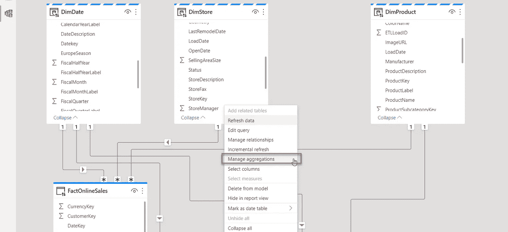

作者图片

在[上一篇文章](https://medium.com/p/f4ab9fceb28c)中，在解释复合模型特性时，我们为另一个极其重要和强大的概念——聚合——打下了坚实的基础！这是因为在许多场景中，尤其是在企业级模型中，聚合是复合模型的自然“成分”。

然而，由于复合模型特性也可以在不涉及聚合的情况下得到利用，我认为将这两个概念分开放在不同的文章中是有意义的。

在我们解释聚合如何在 Power BI 中工作并查看一些具体的用例之前，让我们首先回答以下问题:

# 为什么我们首先需要聚合？模型中有两个具有相同数据的表有什么好处？

在我们阐明这两点之前，重要的是要记住在 Power BI 中有两种不同类型的聚合。

*   ***用户定义的聚合*** 直到几个月前还是 Power BI 中唯一的聚合类型。在这里，您负责定义和管理聚合，尽管 Power BI 稍后会在执行查询时自动识别聚合。
*   ***自动聚合*** 是 Power BI 中较新的特性之一，最近刚刚作为通用特性发布。启用自动聚合功能后，您可以喝杯咖啡，坐下来放松一下，因为机器学习算法将收集您报告中最常运行的查询的数据，并自动构建聚合来支持这些查询。

这两种类型之间的重要区别是许可限制，当然，除了自动聚合之外，您不需要做任何事情，只需在您的租户中打开该功能。虽然用户定义的聚合可用于高级版和专业版，但目前自动聚合需要高级版许可证。

从现在开始，我们将只讨论用户定义的聚合，请记住这一点。

好了，下面是对聚合以及它们在 Power BI 中的工作方式的简短解释。场景是这样的:您有一个非常大的事实表，它可能包含数亿甚至数十亿行。那么，如何处理如此大量数据的分析请求呢？

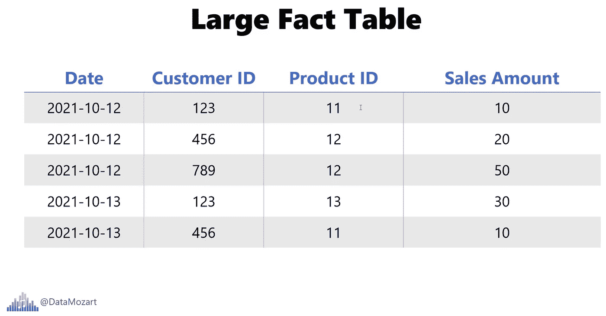

作者图片

您只需创建聚合表！在现实中，这是一种非常罕见的情况，或者说这是一种例外而不是规则，分析要求是将单个交易或单个记录视为最低级别的细节。在大多数情况下，您希望对汇总数据进行分析:比如，我们在某一天有多少收入？或者，产品 X 的总销售额是多少？进一步说，顾客 X 总共花了多少钱？

此外，您可以聚合多个属性的数据(这是通常的情况),并汇总特定日期、客户和产品的数据。

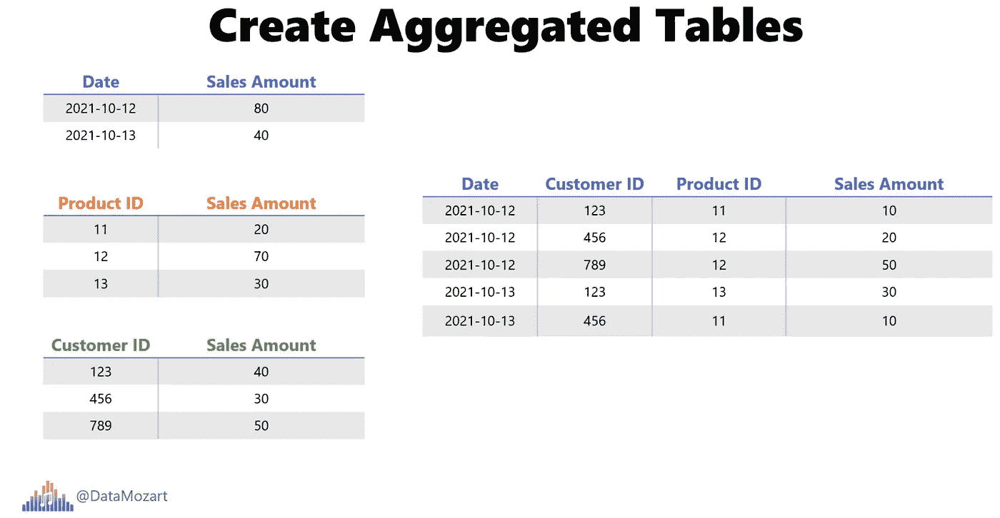

作者图片

如果您想知道聚集数据有什么意义，那么，最终目标是通过预先准备数据来减少行数，从而减少整个数据模型的大小。

因此，如果我需要查看客户 X 在今年第一季度在产品 Y 上花费的总销售额，我可以利用已经预先汇总的数据。

# 关键“成分”——让 Power BI“意识到”聚合！

好了，这是故事的一面。现在更有趣的部分来了。创建聚合本身并不足以加快 Power BI 报告的速度，您需要让 Power BI 知道聚合！

在我们进一步讨论之前，有一点需要注意:只有当原始事实表使用 DirectQuery 存储模式时，聚合意识才会起作用。我们将很快解释如何设计和管理聚合，以及如何为表设置适当的存储模式。此时，只需记住原始事实表应该处于 DirectQuery 模式。

# 让我们开始构建我们的聚合吧！

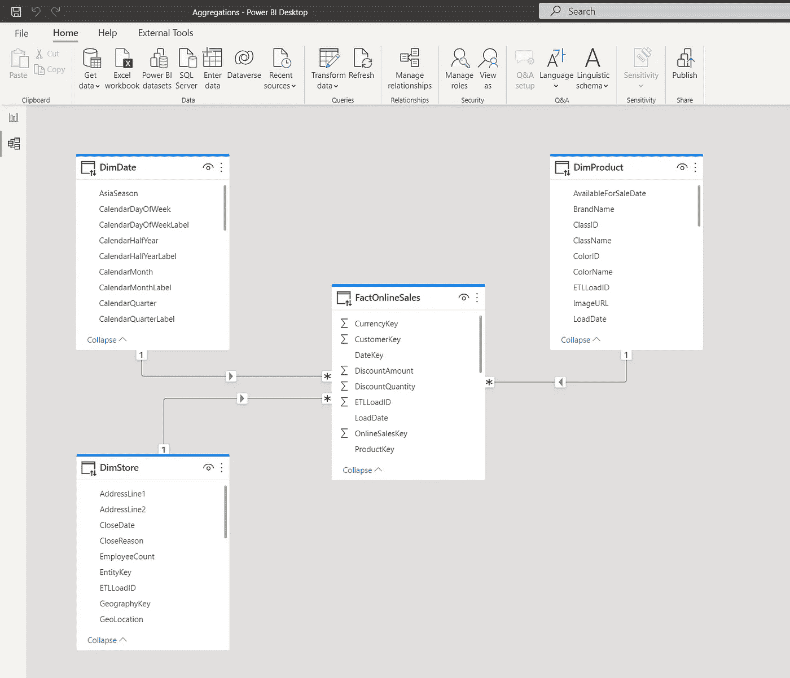

作者图片

如上图所示，我们的模型相当简单，由一个事实表(FactOnlineSales)和三个维度(DimDate、DimStore 和 DimProduct)组成。所有表当前都使用 DirectQuery 存储模式。

让我们创建另外两个表，我们将使用它们作为聚合表:第一个表将根据日期和产品对数据进行分组，而另一个表将使用日期和商店进行分组:

```
/*Table 1: Agg Data per Date & Product */
SELECT DateKey
       ,ProductKey
       ,SUM(SalesAmount) AS SalesAmount
       ,SUM(SalesQuantity) AS SalesQuantity 
FROM FactOnlineSales 
GROUP BY DateKey
        ,ProductKey/*Table 2: Agg Data per Date & Store */
SELECT DateKey
       ,StoreKey
       ,SUM(SalesAmount) AS SalesAmount
       ,SUM(SalesQuantity) AS SalesQuantity 
FROM FactOnlineSales 
GROUP BY DateKey
        ,StoreKey
```

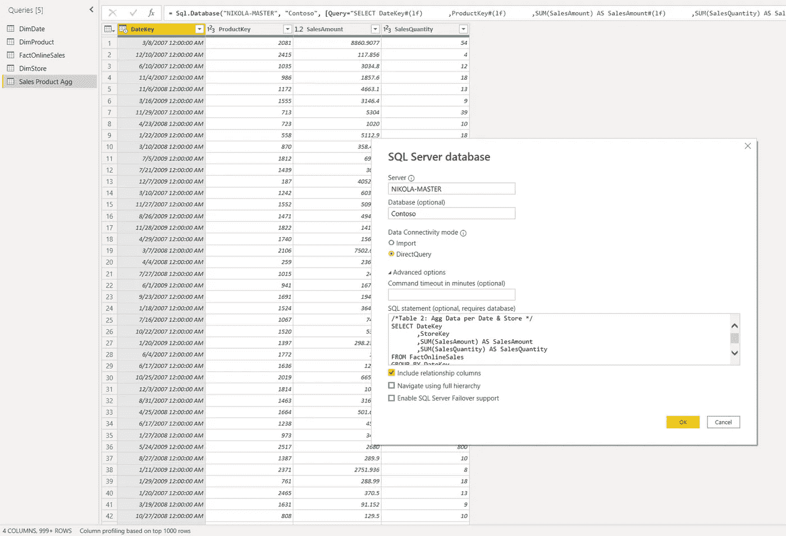

作者图片

我已经将这些查询分别重命名为销售产品 Agg 和销售商店 Agg，并关闭了超级查询编辑器。

由于我们希望大多数查询(这些查询检索按日期和/或产品/商店汇总的数据)获得最佳性能，我将把新创建的聚合表的存储模式从 DirectQuery 切换到 Import:

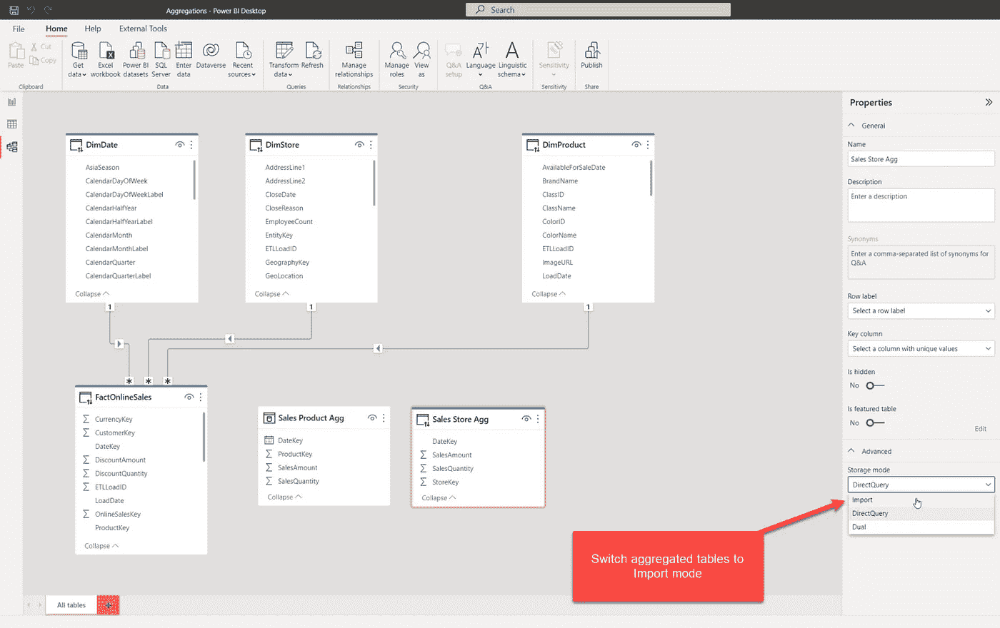

作者图片

现在，这些表被加载到缓存中，但是它们仍然没有连接到我们现有的维度表。让我们创建维度和聚合表之间的关系:

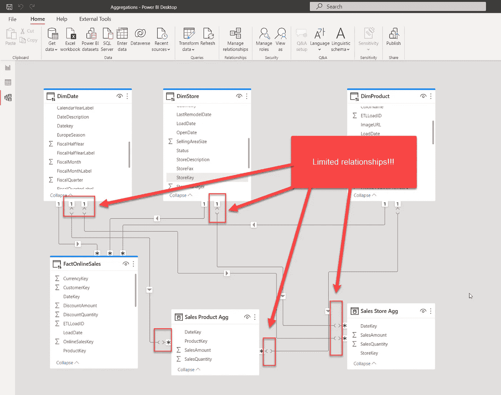

作者图片

在我们继续之前，让我停下来解释一下当我们建立关系时发生了什么。如果您还记得我们以前的文章，我提到过在 Power BI 中有两种类型的关系:常规的和有限的。这一点很重要:每当来自不同源组的表之间存在关系时(导入模式是一个源组，DirectQuery 是另一个源组)，您将拥有有限的关系！尽管有种种限制和约束。

但是，我有好消息告诉你！如果我将维度表的存储模式切换到 Dual，这意味着它们也将被加载到高速缓存中，并且根据查询时哪个事实表提供数据，维度表将表现为导入模式(如果查询的目标是导入模式事实表)或 DirectQuery(如果查询从 DirectQuery 中的原始事实表检索数据):

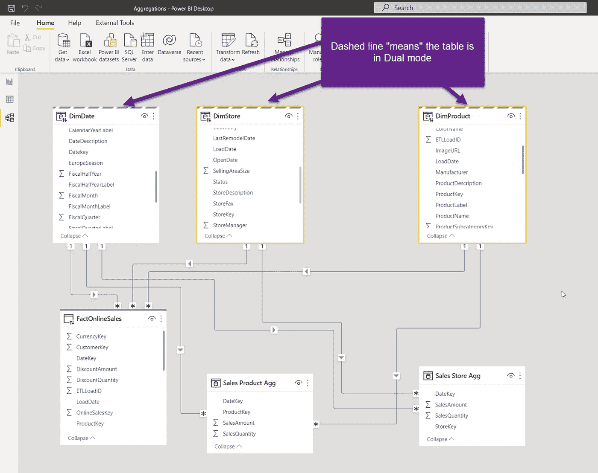

作者图片

正如你可能注意到的，不再有有限的关系，这太棒了！

总而言之，我们的模型配置如下:

*   原始 FactOnlineSales 表(包含所有详细数据)— DirectQuery
*   维度表(DimDate、DimProduct、dim store)-Dual
*   汇总表(销售产品汇总和销售商店汇总)—导入

厉害！现在我们有了聚合表，查询应该运行得更快了，对吗？哔！不对！

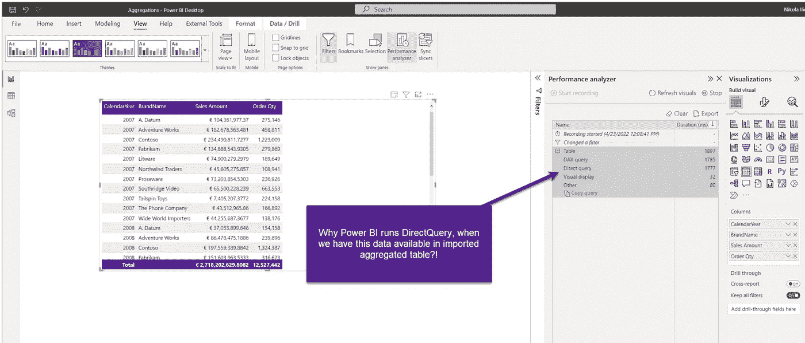

作者图片

Table visual 正好包含我们在销售产品 Agg 表中预聚合的这些列——那么，Power BI 究竟为什么运行 DirectQuery 而不是从导入的表中获取数据呢？这是一个公平的问题！

还记得我在开始时告诉你，我们需要让 Power BI ***知道聚合表的*** ，这样它就可以在查询中使用了。

让我们回到 Power BI Desktop，这样做:

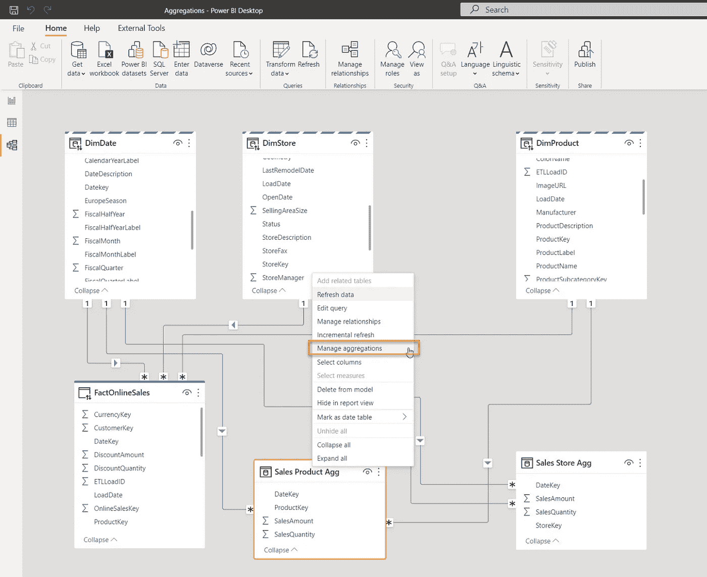

作者图片

右键单击销售产品聚合表，然后选择管理聚合选项:

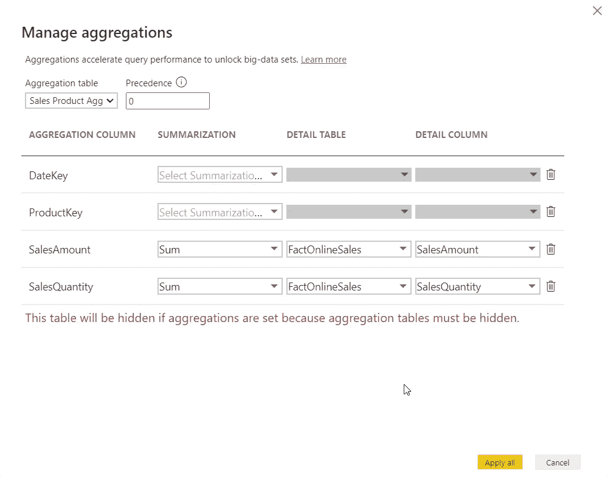

作者图片

这里有一些重要的说明:为了让聚合工作，原始事实表和聚合表中的列之间的*数据类型必须匹配*！在我的例子中，我必须将聚合表中 SalesAmount 列的数据类型从“十进制数”更改为“固定十进制数”。

此外，您会看到以红色书写的消息:这意味着，一旦您创建了一个聚合表，它将对最终用户隐藏！我对第二个聚合表(Store)应用了完全相同的步骤，现在这些表被隐藏了:

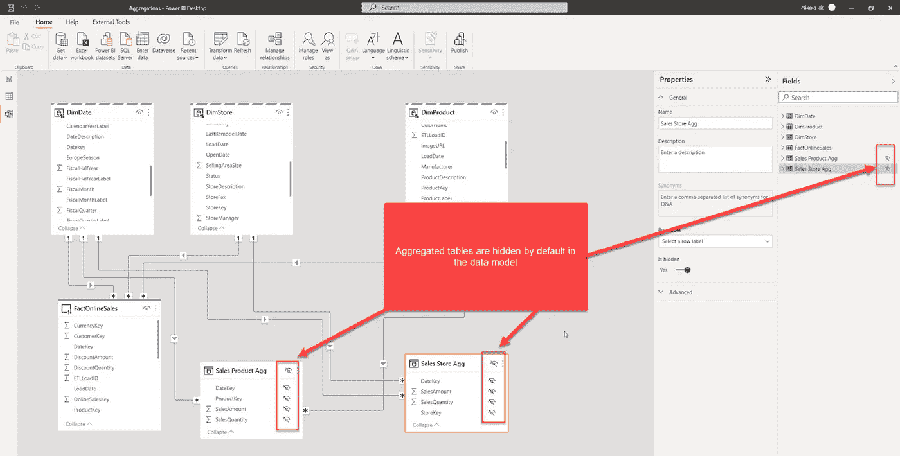

作者图片

现在让我们返回并刷新我们的报告页面，看看是否发生了变化:

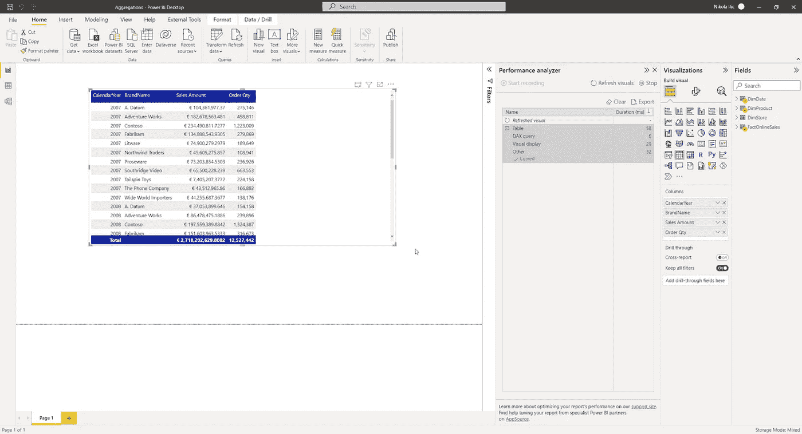

作者图片

不错！这一次没有使用 DirectQuery，呈现这个视觉效果几乎需要 2 秒钟，而这次只花了 58 毫秒！此外，如果我抓取查询并转到 DAX Studio 查看发生了什么…

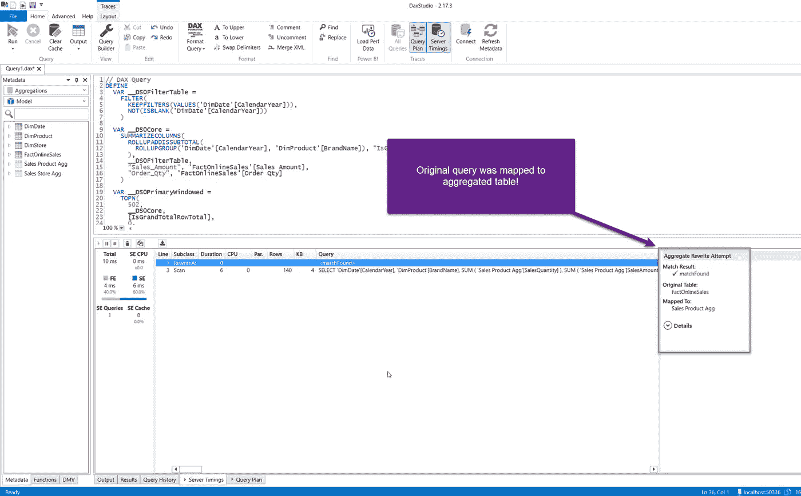

作者图片

如您所见，原始查询被映射到导入模式下的聚集表，消息“Match found”清楚地表明可视化数据来自销售产品聚集表！尽管我们的用户甚至不知道这个表在模型中存在！

即使在这个相对较小的数据集上，性能上的差异也是巨大的！

# 多个聚合表

现在，您可能想知道为什么我创建了两个不同的聚合表。好吧，假设我有一个显示各种商店数据的查询，也是按日期维度分组的。在 DirectQuery 模式下，不必扫描 1260 万行，引擎可以很容易地从缓存中，从只有几千行的表中提供数字！

本质上，您可以在数据模型中创建多个聚合表——不仅仅是组合两个分组属性(就像我们在这里使用的 Date+Product 或 Date+Store ),而是包括附加属性(例如，在一个聚合表中包括 Date 以及 Product 和 Store)。这样，您将增加表的粒度，但是如果您的视觉需要显示产品和商店的数字，您将只能从缓存中检索结果！

在我们的示例中，由于我没有包含产品和商店的预聚合数据，如果我在表中包含一个商店，我将失去拥有聚合表的好处:

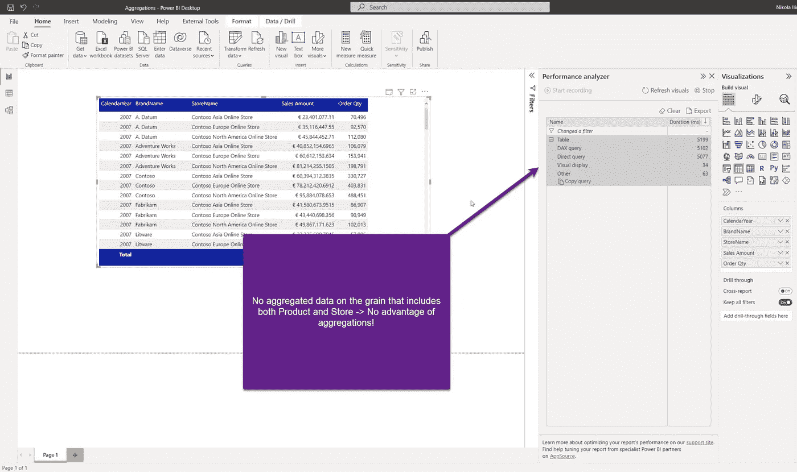

作者图片

因此，为了利用聚合，您需要按照视觉要求在完全相同的粒度级别上定义它们！

# 聚合优先级

使用聚合时，还有一个更重要的属性需要理解——优先级！当“管理聚合”对话框打开时，有一个设置聚合优先级的选项:

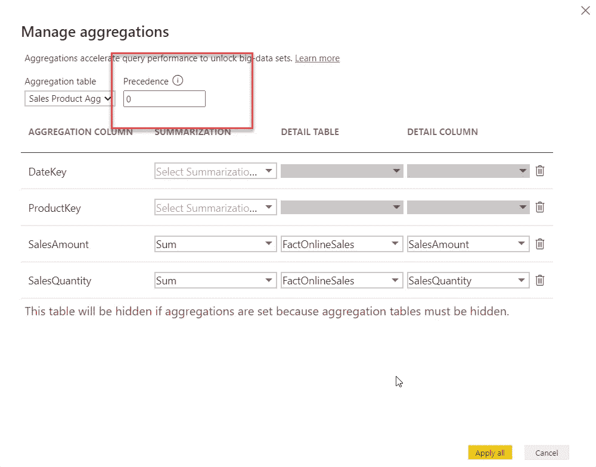

作者图片

这个值“指示”Power BI 在多个不同的聚合可以满足查询的情况下使用哪个聚合表！默认情况下，它设置为 0，但您可以更改该值。数字越大，该聚合的优先级越高。

为什么这很重要？好吧，想象一个场景，你有一个有十亿行的主事实表。而且，您可以在不同的粒度上创建多个聚合表:

1.  汇总表 1:按日期级别对数据进行分组—有大约 2000 行(5 年的日期)
2.  汇总表 2:按日期和产品级别对数据进行分组—大约有 100，000 行(5 年的日期 x 50 个产品)
3.  汇总表 3:按日期、产品和商店级别对数据进行分组——约有 5，000，000 行(100，000 行来自以前的 grain x 50 家商店)

现在，让我们假设报表可视化只显示日期级别的聚合数据。你怎么看:扫描表 1 (2.000 行)好还是表 3(500 万行)好？相信你知道答案:)理论上从两个表都可以满足查询，那么为什么要依赖幂 BI 的任意选择呢？！

相反，当您创建多个具有不同粒度级别的聚合表时，请确保设置优先级值，使粒度较低的表获得优先级！

# 结论

聚合是 Power BI 中最强大的特性之一，尤其是在具有大型数据集的场景中！尽管复合模型特性和聚合可以彼此独立使用，但这两者通常会协同使用，以在性能和拥有所有可用数据细节之间提供最佳平衡！

感谢阅读！

[预订 DP-500 培训！](https://data-mozart.com/shop/)

[订阅，不要错过任何媒体上的故事！](https://datamozart.medium.com/membership)