# power BI——您需要了解的所有重要滤波器

> 原文：<https://towardsdatascience.com/power-bi-all-the-important-filters-you-need-to-know-583fec7c0f8c>

## …当然还有例子！


哈尔·盖特伍德在 [Unsplash](https://unsplash.com?utm_source=medium&utm_medium=referral) 上拍摄的照片

Power BI 是一个基于表之间的关系和连接的工具。

它使用 DAX 来构建度量，在度量中，需要一个过滤上下文来实现正确的计算。

**本文将为您提供主要的过滤器功能和示例，以便您可以快速将其投入使用！**

首先，这是一张数据表。

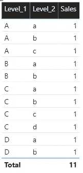

作者图片

这是一个简单的表格，我称之为[Table_Sample_Filters]，但它将非常有助于帮助您了解过滤函数是如何工作的。

在这张表中，有一个层次结构。在级别 1 中，大写字母和级别 2 是下一个级别。为了便于解释，sales 列都是 1。

现在过滤器起作用了。

# 保持过滤器

这是一个重要的问题，你可能会用得最多。

在这里，这个函数对您指定的列的值进行“过滤”。

这里我在列[Level_2]上保留了一个等于“a”的过滤器

```
KEEPFILTERS = 
CALCULATE (   [Table_Sample_Sales_Measure],
    KEEPFILTERS ( Table_Sample_Filters[Level_2] = "a" )
)
```

这些是结果。

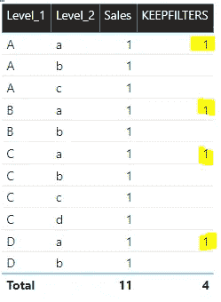

作者图片

您也可以组合它，使[Level _ 1]等于“A ”,或者[Level_2]等于“A”

如果你想把这个语句变成 AND，那么你可以用' && '代替' || '作为运算符

```
KEEPFILTERS_OR =
CALCULATE (   [Table_Sample_Sales_Measure],
    KEEPFILTERS ( Table_Sample_Filters[Level_2] = "a"
        || Table_Sample_Filters[Level_1] = "D" )
)
```

这是结果。

现在这里包括一个用黄色突出显示的附加结果。

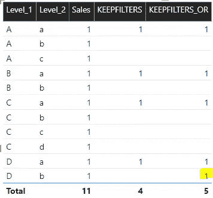

作者图片

# 移除过滤器

这是另一个你可能会用到的方法，它需要一些思考。

在你遇到的每个表中，都有行。

让我们再次参考我们的桌子。


作者图片

这里对于第一行，[ Level_1]等于‘A’，[Level_2]等于‘A’，销售额为‘1’。

在 Power BI 中，如果去掉列【Level_2】，会发生什么？

这就是将要发生的事情。

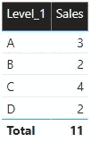

作者图片

移除[Level_2]将提供累计至[Level_1]的销售汇总。

这正是 REMOVEFILTER 所做的。

```
REMOVEFILTERS =
CALCULATE (    [Table_Sample_Sales_Measure],
    REMOVEFILTERS ( Table_Sample_Filters[Level_2] )
)
```

在这个画面中，你会看到正在发生的事情。

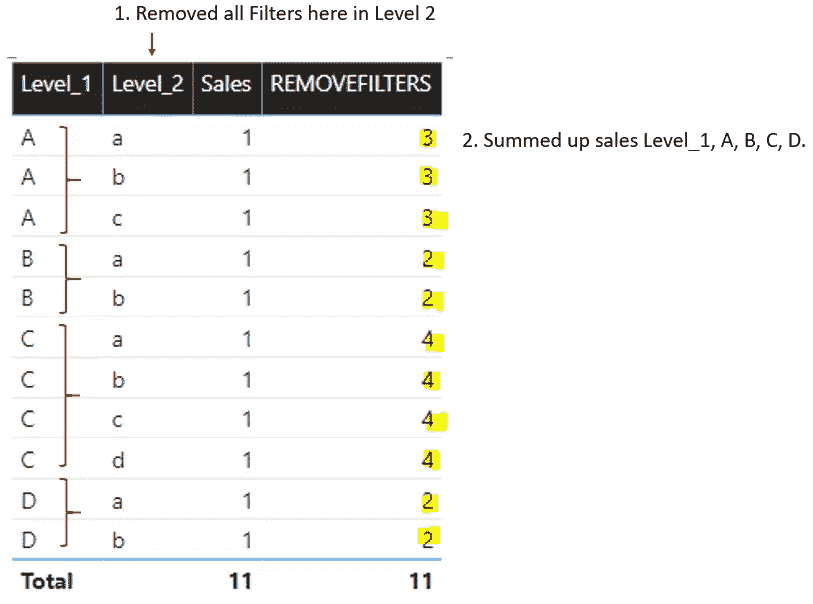

作者图片

REMOVEFILTERS 删除了[Level_2]中的筛选器，取而代之的是按[Level_1]和 A、B、C、d 的类别来汇总总数。

**由于该表中的每一行都有一个 Level_1 类别，REMOVEFILTERS 返回多个总计。**

如果我移除桌面上的[Level_2],它会将我们带回之前看到的画面。

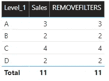

作者图片

# 所有例外

ALLEXCEPT 函数遵循与 remove filters 相同的逻辑。

此处的 ALLEXCEPT 表示删除除您指定的列之外的所有列上的筛选器。

```
ALLEXCEPT =
CALCULATE (
    [Table_Sample_Sales_Measure],
    ALLEXCEPT ( Table_Sample_Filters, Table_Sample_Filters[Level_1] )
)
```

这将是结果。

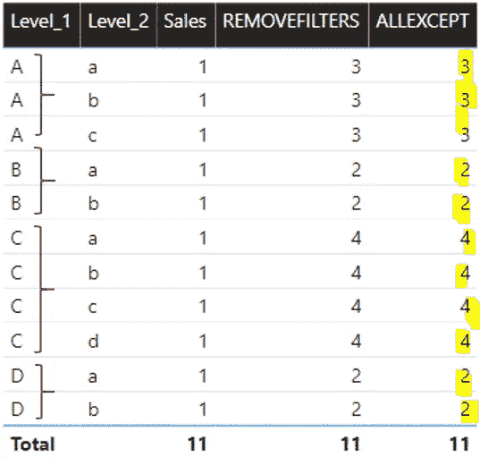

作者图片

在这里的度量中，它类似于在[Level_1]中进行“分组”。

这个功能帮助我摆脱了很多困境。

# 全部

在这里，它使所有应用于视觉的滤镜对滤镜“免疫”。这就是为什么它叫全部。

```
ALL_Measure = 
CALCULATE ( [Table_Sample_Sales_Measure], 
ALL ( Table_Sample_Filters ) )
```

在这里，我筛选了[Level_1]中的视觉“A ”,无论我做什么，ALL 度量都将返回 11，这是整个表的总和。

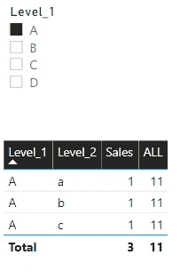

作者图片

当我过滤掉 B 的时候

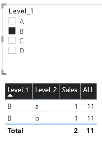

作者图片

现在 ALL 有了其他参数，您可以只对一列使用它。它显示为删除该列的过滤器。

它的作用与 Level_2 的 REMOVEFILTER 相同。

```
ALL_Level_2 = 
CALCULATE (
    [Table_Sample_Sales_Measure],
    ALL ( Table_Sample_Filters[Level_2] )
)
```

这是结果。

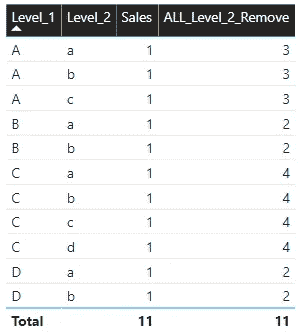

作者图片

# 全部选定

这里，过滤器取决于所选择的内容。因此 ALL-SELECTED☺

这里我选择[Level_1]等于“A”

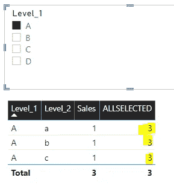

作者图片

在这里，我选择[Level_1]等于“A”和“B”

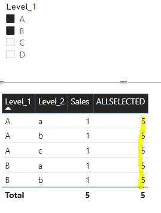

作者图片

注意所有基于用户选择的更改？

这就是 ALLSELECTED 所做的，如果用作分母，它会特别有用。

这些功能将带你走很长的路。

现在，如果您希望返回一个用于报告目的的表，将 CALCULATE 交换为 CALCULATETABLE，您将返回一个虚拟表。

如果你需要更多关于如何建立数据模型的细节，这里有一篇[文章](/power-bi-modelling-bcd4431f49f9)教你如何建立一个数据模型。这是另一个帮助你建立它的[附加工具](/power-bi-modelling-tips-and-tricks-9726e1d9085b)。

希望这篇文章对您有所帮助，祝您在数据之旅中好运！