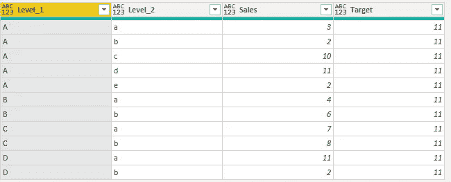
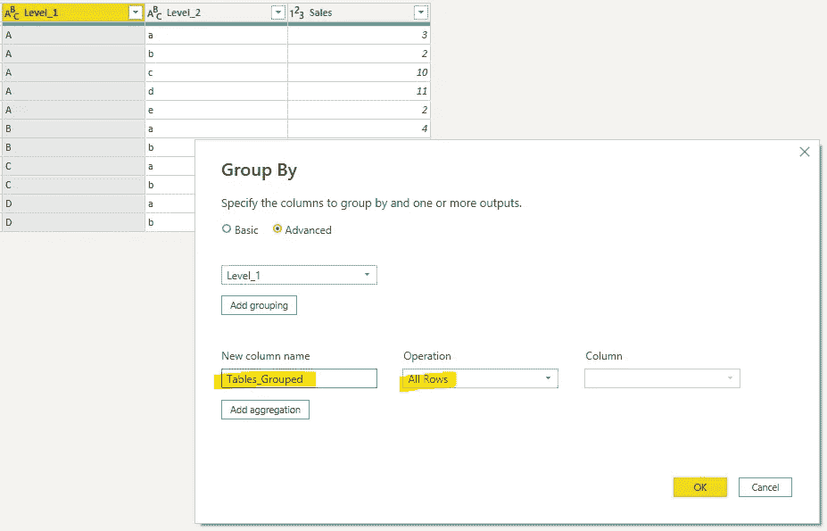
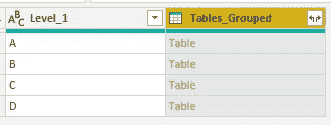
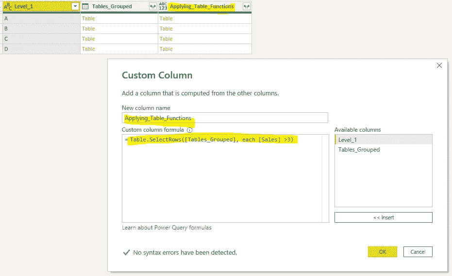
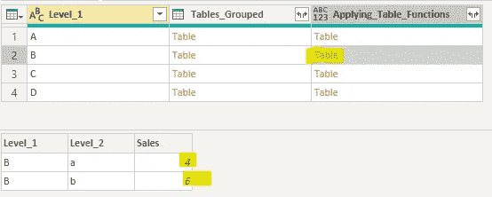
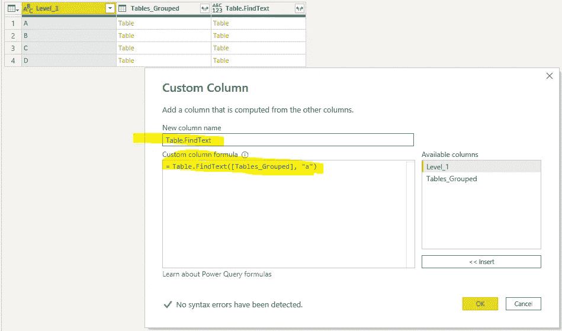
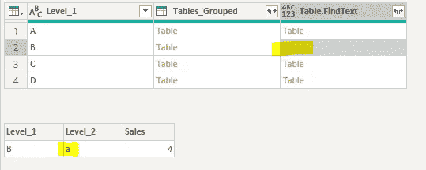
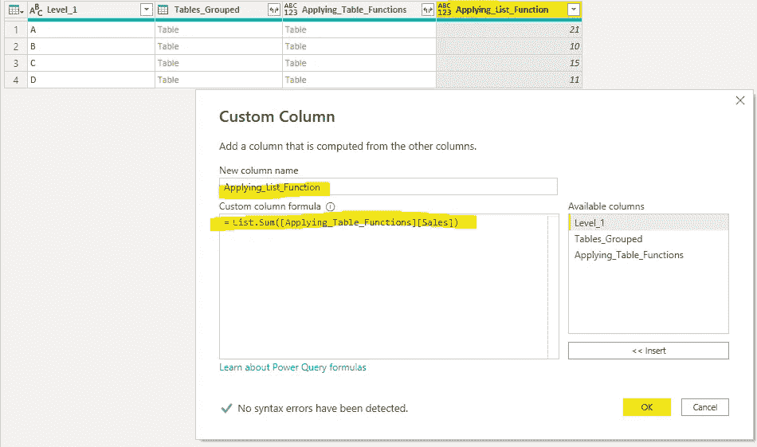
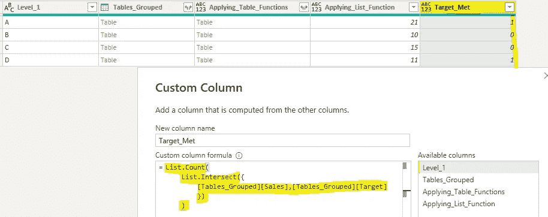
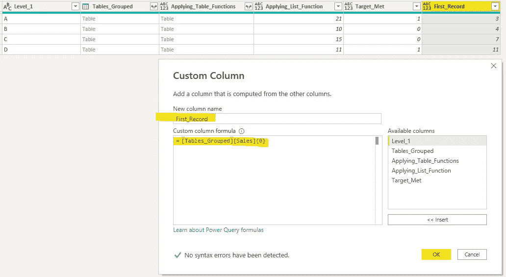

# 电力 BI —表格、清单和记录

> 原文：<https://towardsdatascience.com/power-bi-table-lists-and-records-4731fa6f0081>

## …使用这些数据类型协助数据建模

杰克·亨特在 [Unsplash](https://unsplash.com?utm_source=medium&utm_medium=referral) 上的照片

电力查询是一个非常强大的工具。不仅因为您可以进行转换，还因为它使用了 3 种主要的数据类型。

一旦你知道如何使用这三种数据类型，你会更加喜欢 power query。

那么这三种数据类型是什么呢？它们是表格、列表和记录。

在微软网站上，它为你提供了非常全面的每种类型的可用功能，但是将你的数据转换成这些数据类型可能会造成混乱。

让我们看看如何获得这些数据类型并应用一个函数，这样您就可以在日常工作中这样做了。

如何转换您的数据以便获得这些数据类型？

# 使用分组依据获取数据类型

在 Power Query 中，您可以对数据进行分组，并使用 all 行返回一列表。

这是我们正在使用的数据。

作者图片

让我们使用 group by 并将 Level_1 分组在一起。

作者图片

一旦我开始对数据进行分组，Power Query 就会返回一列表。

作者图片

这是获得表数据类型的一种方法。

需要注意的一件重要事情是，这些列是按照所有行的 Level_1 进行分组的。没有任何聚合应用于它。

现在你能用这列表格做什么呢？

# 将表格函数应用于表格

在具有表数据类型的[Tables_Grouped]列中，您现在可以将表函数应用于这些分组表中的每一个。

在这里，我添加了一个名为“应用 _ 表格 _ 函数”的新列，并使用了*表格。SelectRows* 选择[Sales]超过 3 的行。

作者图片

这是你悬停在桌子上的结果。

作者图片

这里的数据预览显示，在 Level_1 = B 分组数据中，只有大于 3 的销售额被捕获。因此有了 4 和 6。

让我们试试另一个例子，添加一个名为“Table”的新列。FindText "并使用*表。FindText*

作者图片

这是结果。

作者图片

“桌子在这里。FindText”找到包含字母“a”的行，并返回一个表。

这是在 Power Query 中使用表的一种方式。列表怎么样？

# 将列表函数应用于列表

您可以使用[表格][列]作为格式在超级查询中获取列表。一旦你在那里，你可以应用列表函数。

这里我用的是*列表。Sum* 获得 Level_1 分组中每笔销售额的总和。

作者图片

让我们再举一个例子。你一定会喜欢这些名单的。

比方说，我想从 target 列中了解达到的计数目标。

这里我们可以使用*列表。相交*用于演示目的。你当然可以使用*列表。选择大于 11 的*。

作者图片

如果这里有一个数字 11 的交叉点。会算的。

列表还有一些更复杂的用法，我无法在这里介绍，但是对于绝大多数情况，一旦您将数据类型添加到列表中，列表函数就可以工作了。

有几个怪癖不会在本文中讨论，比如在计算中使用变量，但是它们将在以后讨论。

微软网站上还有许多其他的列表功能。要点是一旦你知道如何得到列表数据类型，你现在可以应用这些函数。

# 记录

很多时候，您会发现列表和表格数据类型是您将使用的主要数据类型。记录数据类型不常用。

要访问单个记录，可以使用{}大括号。

作者图片

超级查询是零索引的，所以这样做将返回列表的第一条记录。

概括一下，

这里的关键是这个。

**【表格】【列】{记录}**

使用“分组依据”和“所有行”来获取表格格式。这样做将返回表。**【表】**

使用另一个[]括号来引用表中的列。这将返回一个列表。**【专栏】**

返回列表时，使用{}括号返回列表中的项目。**{记录}**

只要记住这一点，就可以用 Power Query 做很多繁重的工作。

探索它，玩它，测试它。

如果您知道如何清理表格并将其转换成几乎任何您想要的形状，使用列表函数提取，您已经赢得了 80%的数据建模战！剩下的就是将表放入星型模式中！