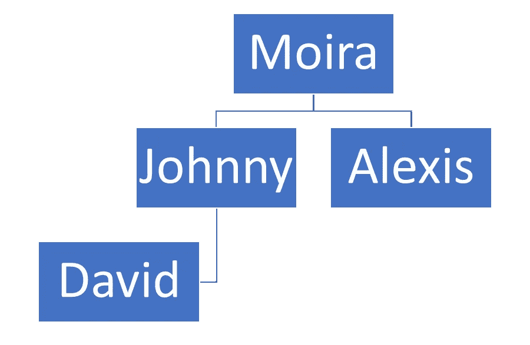
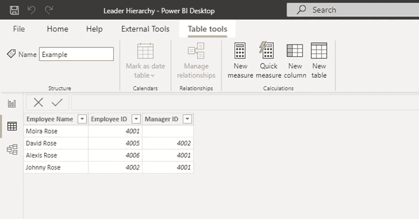
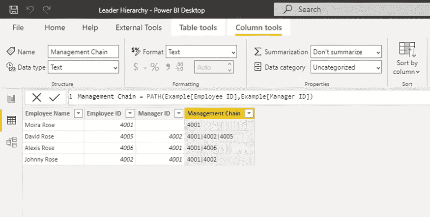
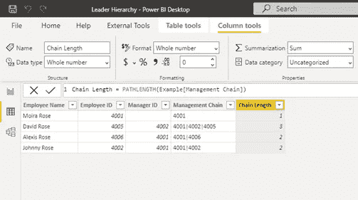
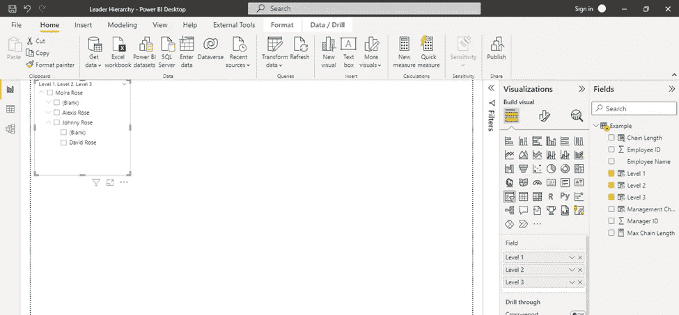

# Power BI 提示和技巧:按经理层级过滤

> 原文：<https://towardsdatascience.com/power-bi-tips-tricks-filter-by-manager-hierarchy-14e9a490b4d9>

## 在 Power BI 中创建一个切片器，根据经理的控制范围进行过滤。

作者图片

# 问题简介

在 Power BI 中创建仪表板时，通常会有一个请求，要求查看领导控制范围内的数据。这意味着我们需要使用管理器层次结构创建一个切片器。因为我们不仅要包括经理的直接下属，还要包括他们的直接下属的报告(等等)，所以我们需要采取一些额外的步骤。

# 过程

1.  创建一个包含员工 ID 和经理 ID 的文件
2.  使用 PATH()函数确定员工的管理链
3.  确定管理链的长度
4.  为链中的每个级别创建一列
5.  添加切片器

# 1.创建文件

您的文件至少需要包含员工姓名、员工 ID 和经理 ID。

有几件事要记住:

*   员工 ID 在每一行中应该是唯一的值
*   每个经理 ID 需要有一行(每个经理也应该作为雇员出现在文件中)
*   层次结构顶部的人员(例如，CEO)应该有一个空白的经理 ID 列

作者图片

# 2.识别管理链

使用 PATH()函数创建一个列来标识每个员工的管理链(他们的经理、他们经理的经理等)。)到层级的顶端。

作者图片

Moira 的管理链中只有她自己，因为她处于领导层级的顶端，而 David 的管理链中有三个人，因为他(1)向 Johnny (2)报告，Johnny 向 Moira (3)报告。

# 3.确定管理链的长度

虽然这是一个小数据集，我们可以清楚地确定最长管理链的长度(3 ),但对于较大的数据集，这要困难得多。幸运的是，我们可以使用 PATHLENGTH()函数来计算它。

作者图片

我们这样做是为了确定需要添加多少列，以便组织的每个级别都有一个列。在我们的数据集中，有三个级别，所以我们要添加三列。

要查找最大路径长度，您可以按链长列对数据进行排序，或者创建一个度量值*“最大链长=最大(示例[链长])”*

您还可以限制列的数量，以便只能筛选组织中的特定级别。例如，如果您只想筛选 CEO 以下的两个级别，那么您只需创建三列。要点是，您不必为组织中的每个级别创建一个列，如果您愿意，可以限制它。

# 4.为每个级别创建一列

现在，您将为要筛选的每个级别添加一列。您可以对每个列使用相同的 DAX，只需更新 Lvlnumber 变量以匹配您所在的级别。例如，对于层次结构的第一级，Lvlnumber 将是 1，对于层次结构的第二级，Lvlnumber 将是 2，依此类推。

> level 1 =
> var Lvlnumber = 1
> var lvl key = path item(Example[管理链]，lvl number，INTEGER)
> var lvl Name = lookup value(Example[员工姓名]，Example[员工 ID]，lvl key)
> var Result = lvl Name
> 返回结果

作者图片

*事实:DAX 正在寻找给定级别的员工 ID，在本例中是 1。因此，它获取管理链中的第一个员工 ID 4001，然后查找该员工的姓名 Moira Rose。*

# 5.添加切片器

最后，您已经准备好为您的经理层次结构创建切片器。在“报表”视图中，添加一个切片器视图，然后添加您创建的希望能够作为筛选依据的每个级别列。

作者图片

旁注，每个级别中的“(空白)”包括该个人。例如，约翰尼下面的“(空白)”包括约翰尼。这是一个有用的功能，您可以为领导过滤数据，但取消选中(空白)则领导看不到他们自己的数据。

现在你知道了！您现在可以通过领导者的控制范围来过滤您的数据。

如果你喜欢阅读这样的故事，并想支持我成为一名作家，可以考虑报名成为一名媒体成员。这是 5 美元一个月，我赚一小笔佣金，如果你使用我的推荐链接。

<https://jeagleson.medium.com/membership>  

詹娜·伊格尔森(Jenna eagle son) *我的背景是工业组织心理学，我已经在人物分析中找到了自己的家。数据使我的作品变得生动。我主要使用 Power BI，但偶尔也会使用 Tableau 和其他工具。我很想听到更多关于你的旅程！在*[*Linkedin*](https://www.linkedin.com/in/jenna-eagleson/)*或*[*Twitter*](https://twitter.com/JennaEagleson)*上联系我。*