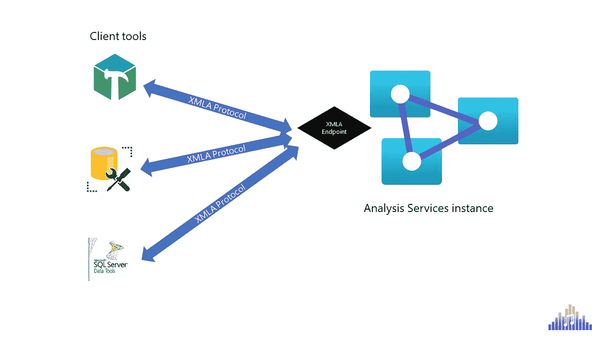
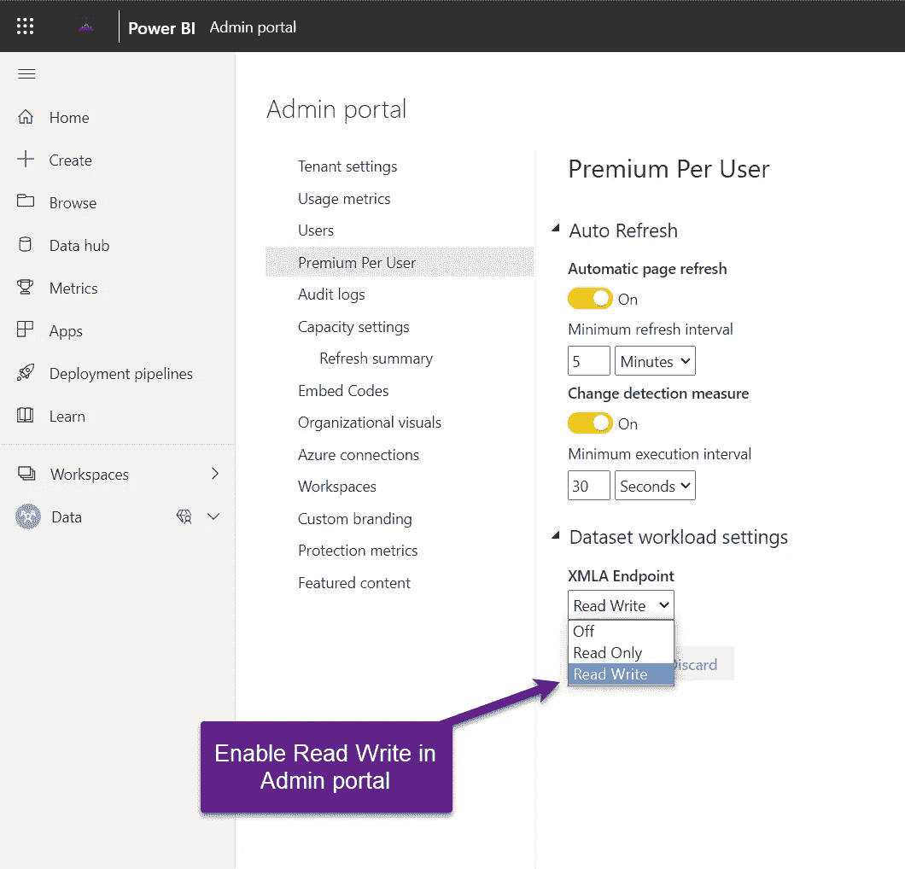
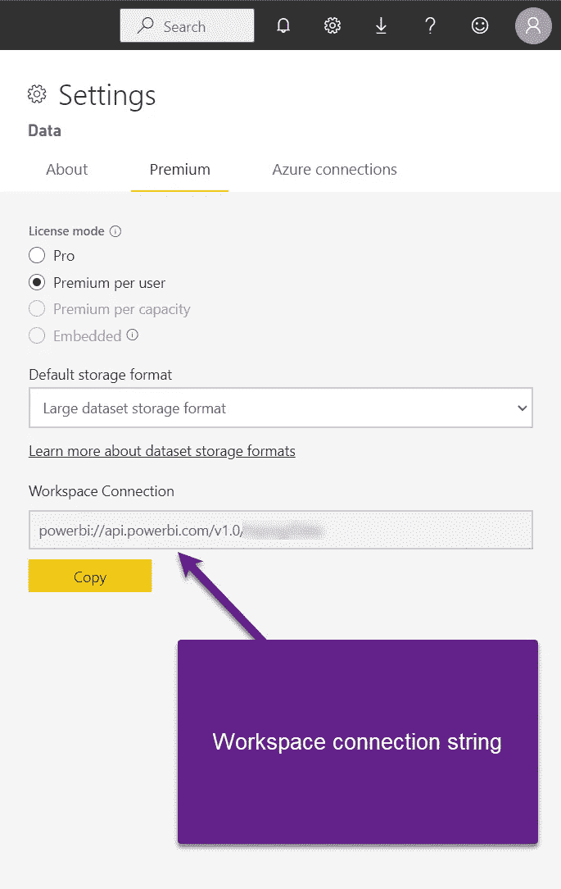
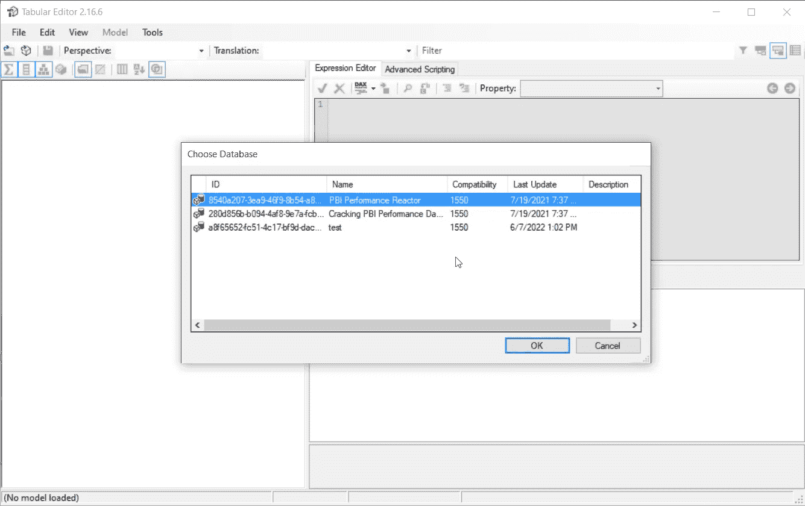
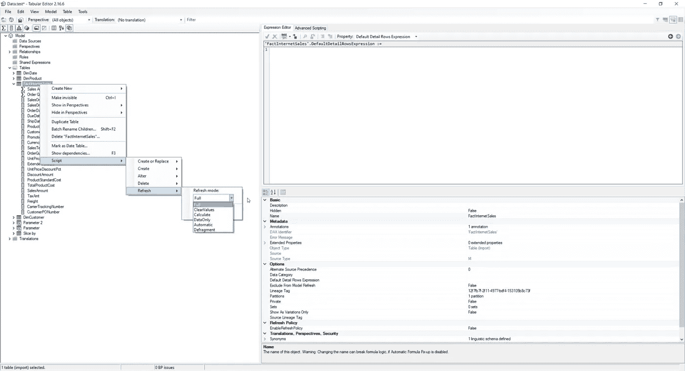
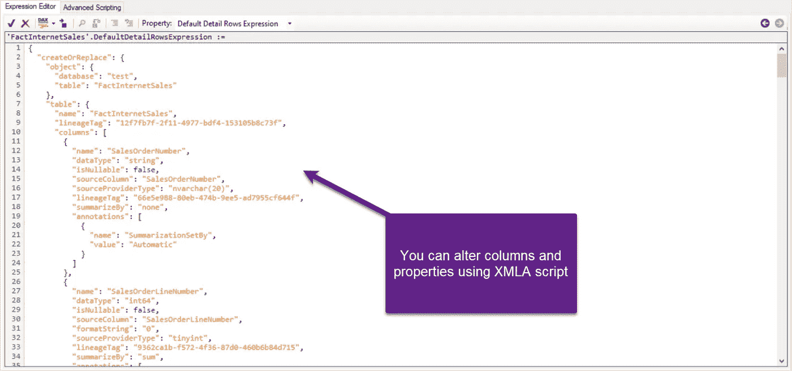

# Power BI XMLA 端点，非神秘化

> 原文：<https://towardsdatascience.com/power-bi-xmla-endpoints-demystified-ebfd3c8772e6>

## 在 Power BI 的发展过程中有许多改变游戏规则的因素。XMLA 端点可用性一直是前三名之一。

由 Isaac Smith 在 Unsplash 上拍摄的照片

在微软 Power BI 作为独立产品的发展过程中(2015 年)，从 BI 分析领域的一个害羞的挑战者到不可否认的领导者，有许多“游戏规则改变者”——这些功能带来了革命而不是发展！[复合模型](https://data-mozart.com/mastering-dp-500-exam-design-and-build-composite-models/)、数据流、人工智能视觉、[混合表](https://data-mozart.com/hybrid-tables-in-power-bi-the-ultimate-guide/)、[书签](https://data-mozart.com/bookmarks-in-power-bi-what-this-data-mean/)……应有尽有！

然而，真正开启了一个全新的可能性世界的特性之一是——使用 XMLA endpoint 访问底层的 Power BI 数据集，但这一特性在有经验的 Power BI 实践者社区之外可能仍然“不为人知”!

虽然很多人[认为 Power BI 是一个数据可视化工具](https://medium.com/p/85db9e2d745b)，但是我不得不承认 ***Power BI 首先是一个数据建模工具*** ！这就是为什么理解什么是 XMLA 端点以及为什么应该关注它们是极其重要的。

# XMLA 是什么？

让我们从基础开始。你可能听说过 XML，但是现在到底什么是 XMLA？！不要害怕——这只是——XML for Analysis！与其引用 XMLA 枯燥的定义，不如让我来说明这个“东西”是如何工作的…

作者图片

简单地说，Analysis Services 的实例“公开”了一个端点，然后可以由各种客户端工具使用，如表格编辑器、SSMS、Azure Data Studio、SQL Server 数据工具等。与 Analysis Services 实例“对话”。如果你想知道——好的，Nikola，能够与 AS 实例“交谈”有什么特别之处……嗯，就像在常规的现实生活交谈中，你可以指导某人做什么，这同样适用于与 Analysis Services 实例的“交谈”:使用客户端工具，你可以读取 AS 实例的内容，但更重要的是，你还可以操作存储在 Analysis Services 实例中的 TOM(表格对象模型),并修改其默认行为！

# 历史课——SSAS 公司

如果您认为 XMLA endpoint 是某种全新的、强大的双独占特性，那就大错特错了！对于我们这些曾经和 SSAS 多维一起工作的人来说，使用 XMLA 是一个众所周知的概念。所以，这是分析服务和 XMLA 之间的长期关系…现在，你可能会问自己:为什么他坚持重复“分析服务”，“分析服务”？我是一名 Power BI 开发人员，我有兴趣了解这个“XMLA 东西”在 Power BI 中是如何工作的！

有道理，所以我们来解释一下这个。当您打开 Power BI Desktop 来创建一个解决方案时(我特意使用了 word solution 来代替报告)，Power BI 将启动一个 Analysis Services 的本地实例(您又开始使用 Analysis Services 了！)在幕后存储您在解决方案中使用的数据—当然，假设您对数据使用导入模式。一旦完成，您将部署您的解决方案到 Power BI 服务——您可能会注意到两个工件被一起部署——报告和数据集。

## Power BI 数据集只不过是 Analysis Services 实例中的一个数据库！

类似地，Power BI workspace 就是一个 Analysis Services 实例，负责管理所有不同的数据库(Power BI 数据集)。

# 为什么 XMLA 端点可用性对 Power BI 很重要？

好了，我们已经解释了什么是 XMLA 以及它与 Power BI 的关系。现在，让我们试着理解为什么拥有这个特性真的会改变游戏规则！

在 XMLA endpoint avail ability for Power BI 解决方案出现之前，通常的开发流程如下所示:

您在 Power BI Desktop 中创建一个解决方案，一旦完成，您就可以将其部署到服务中。如果必须应用一些更改，您应该在 Power BI 桌面中再次获取该文件，进行所需的更改，然后再次发布它。

而且，在 XMLA 端点可用之前，这是一种“全有或全无”的方法——如果不重新处理整个数据集，就不可能更改一个表！但是，我们可以以某种方式接受这一点…但是，某些数据模型属性完全无法从 Power BI 桌面访问，并且没有办法改变它们的默认行为。

现在，让我们想象这样一个场景:您有一个巨大的 Power BI 报告，有 20 个表，您只需要对其中一个表进行微小的更改。通过利用 XMLA 端点，您可以只重新处理您修改过的表，而不是重新处理整个模型！

在我向您展示如何做到这一点之前，需要提前完成 Power BI 租户的一些设置。首先，在编写的时候， ***XMLA 读/写需要某种高级许可*** ，要么是按容量，要么是按用户。

作者图片

启用后，我将获取我的高级工作区的连接字符串:

作者图片

我现在将打开一个客户端工具，在这个例子中，我将使用表格编辑器 2(免费版)，但你也可以使用 SSMS，并获得相同的结果。一旦我连接到 Analysis Services 实例(不要忘记，Power BI 工作区就是 Analysis Services 的实例)，我将能够选择一个我想要连接的数据库(Power BI 数据集):

作者图片

我选第三个，叫测试。一旦连接到数据库，我就可以访问大量的属性，不仅仅是在模型级别，还可以在单个表级别。

假设我想在我的 FactInternetSales 表中创建一个新的度量，但是我不想处理整个数据模型，而只想处理我已经更改的表:

作者图片

您可以选择不同的刷新模式。解释刷新模式超出了本文的范围，但是我建议您查看[表格编辑器文档](https://docs.tabulareditor.com/onboarding/refresh-preview-query.html)中的详细信息。这将只触发所选表的重新处理，而不是整个数据模型！

显然，通过能够使用脚本来细粒度地刷新数据，您甚至可以通过利用 PowerShell、Azure 函数等来进一步增强整个过程。

想象一下这样的场景:您有一个包含大量历史数据的表，但您不想每次都刷新整个表。您可以将表分成多个分区(再次使用 XMLA endpoint)，然后为最新的分区设置增量刷新，同时不再重新加载旧的分区！

# 何时使用 XMLA 端点？

说实话，可能性真的是无限的！除了我之前展示的在更细粒度级别进行处理的示例之外，您还可以使用 XMLA 端点来查询数据、添加新列或以编程方式修改现有列:

作者图片

您还可以切换 Power BI 报告的数据源，或者添加一个明确的数据源定义，如这里的[所述](https://powerbi.microsoft.com/en-my/blog/using-xmla-endpoints-to-change-data-sources-in-a-power-bi-dataset/)。

此外，您从表格编辑器执行的所有操作，比如定义[对象级安全](https://data-mozart.com/mastering-dp-500-exam-design-row-level-and-object-level-security-in-power-bi/)、[计算组](https://data-mozart.com/mastering-dp-500-exam-creating-calculation-groups/)，创建[分区](https://medium.com/p/bfe07d480275)，透视图等。都是通过 XMLA 端点完成的！

显然，可能性是无限的，可能可以写一整本书，涵盖使用 XMLA 端点和 Power BI 时所有可用的用例…

***重要提示:*** 请记住，一旦您通过 XMLA 端点进行了更改，并将 Power BI 解决方案的更新“版本”部署到服务中，您**将无法再**下载 pbix 文件！因此，请始终保留文件的备份版本，以防您需要应用一些额外的修改。

# 结论

在 Power BI 的发展过程中有许多“游戏规则改变者”。他们中有些人没有辜负他们的高期望，有些人没有。但是，如果你问我，为 Power BI 数据集启用 XMLA endpoint 可能是迄今为止改变游戏规则的三大因素之一！即使它(仍然)只是高级功能，即使它在部署修改版本后对 pbix 下载有严重限制，这仍然是赋予您根据您的需求定制 Power BI 数据集的巨大能力的功能之一。

感谢阅读！

[预订 DP-500 培训！](https://data-mozart.com/shop/)

[成为会员，阅读 Medium 上的每一个故事！](https://datamozart.medium.com/membership)