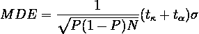
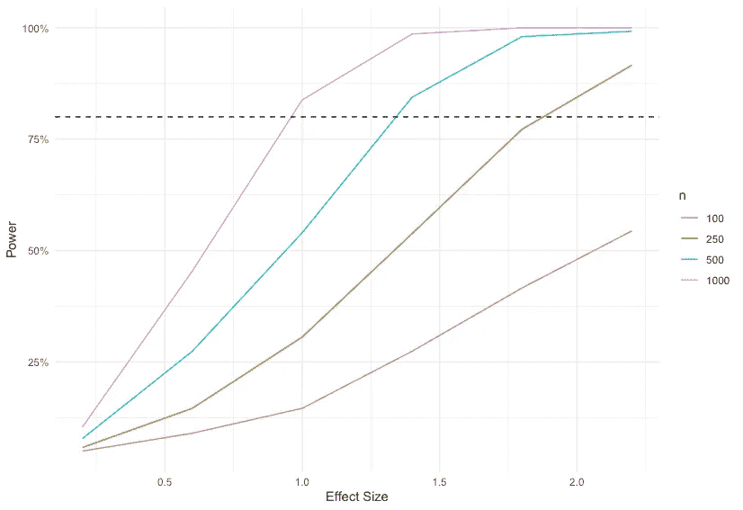

# 通过仿真进行功耗计算

> 原文：<https://towardsdatascience.com/power-calculations-with-simulation-49d2f959161c>

# 通过仿真进行功耗计算

## 用 R 中的例子来说明


由 [Unsplash](https://unsplash.com/?utm_source=unsplash&utm_medium=referral&utm_content=creditCopyText) 上的 [mk. s](https://unsplash.com/@mk__s?utm_source=unsplash&utm_medium=referral&utm_content=creditCopyText) 拍摄的照片

# 介绍

功效计算是实验设计中的一个必要步骤。它在估计检测给定效应所需的样本量，或者在给定固定样本量和其他设计参数的情况下，我们可能期望的最小检测效应方面起着关键作用。在本文中，我将通过 r。

设计的力量在于，对于给定的效应大小和给定的统计显著性水平，我们能够拒绝零效应假设的概率(Duflo 等人，2007)。换句话说，功效是在一个治疗效果存在时(即零假设为假时)，正确拒绝零假设的概率。

# 基本功率计算的组件

我认为理解功耗计算的最简单方法是使用最小可检测效应(MDE)的封闭公式:



*   **MDE** :给定我们的设计参数，我们可以从零区分的最小效应大小，我们可以检测的效应大小越小，我们的统计能力就越强。
*   **P:** 将样本的比例分配到治疗组。
*   **检验的显著性水平或大小(α):** 概率 I 型错误或假阳性:当无效假设为真时，拒绝无效的无效假设(即，当无效时，断定治疗有效)。它通常设置为 5%。
*   **功效(1-κ):** κ是第二类错误或假阴性的概率:当零假设为假时，未能拒绝零假设(即当存在一个时，未能检测到效应)。通常设置为 0.8。
*   **N:** 样本量
*   ***σ:*** 结果变量的标准差

从等式中我们可以了解到几个关系:

*   它还隐含地定义了实现所需功率水平所需的样本大小 N。
*   增加样本量会降低 MDE 并提高功效。
*   降低结果方差(潜在人群中的变化较小)会降低 MDE 并增加功效。
*   在力量和大小之间有一个权衡。当α增加时，对于给定的功率水平，MDE 增加。在错误地得出治疗有效而治疗无效的概率和错误地得出治疗无效的概率之间存在权衡。
*   治疗臂之间的等分通常使功率最大化。

接下来，我们将这些东西放入 R:

运行上面的代码将返回下面的结果。它表明，偏离 50/50 治疗/控制分配增加了 MDE，增加样本量大大降低了 MDE，正如我们所预期的。我用`runif()`来创建从均匀分布中抽取的随机变量，我们可以看到，std。当我使用同一个`runif(100,0,5)`从一个从 0 到 5、随`runif(1000,0,1)`减少、随`runif(10,0,8).`增加的均匀分布中产生 100 个随机均匀分布时，偏差不变。当方差减少时，MDE 减少。

它还表明，如果我们希望能够以 80%的功效检测到效应大小≥0.25(80%的机会检测到该效应)，给定结果变量分布，我们需要 1000 的样本大小。如果我们只收集了 100 个单位的样本，我们将无法区分一个效应<0.8 from zero even if it is.

```
baseline: sample size: 100 std dev: 1.424976 MDE: 0.8023922decrease treatment allocation to 20%: sample size: 100 std dev: 1.424976 MDE is bigger: 1.00299increase treatment allocation to 70%: sample size: 100 std dev: 1.424976 MDE is bigger: 1.00299decrease outcome variable variance: sample size: 100 std dev: 0.2874839 MDE is smaller: 0.1618798increase outcome variable variance: sample size: 100 std dev: 2.35792 MDE is bigger: 1.327725increase sample size: sample size: 1000 std dev: 1.424976 MDE is smaller: 0.2526117decrease sample size: sample size: 10 std dev: 1.424976 MDE is bigger: 2.67033
```

# Power Calculation using Simulation

The basic idea of a simulated power analysis is to construct some data either through simulation or existing historical data, pre-set the sample size and effect size (or any other parameters we would like to test), use an analytical method such as regression, run it a bunch of times so wen can see the sampling variation of the power.

The code below does the following: I assumed a list of sample size and effect size I would like to try, created random variable X from a uniform distribution and Y by adding additional random noise to effect*X, ran a simple linear regression and got the probability of correctly rejecting the null when null is false at a significance level of 5% , then I ran the same process 500 times to get the sampling variation of the statistical power from which I calculated the mean of it.

At the end of the program, I created the graph below that shows **对于一个给定的功率水平，例如虚线标记的 80%,最小可检测大小或最小样本大小。**例如，为了能够在 80%的功率下检测到 1.0–1.5 的效果大小(80%的情况下我们可以发现这种效果)，我们需要至少 500 个样本。给定 250 个样本，我们只能检测到效果> ~1.8。换句话说，我们需要一个大于 1.8 的效应，才能有 80%的机会找到有意义的结果。如果我们认为影响实际上不可能那么大，我们需要调整我们的实验设计——增加样本，使用更精确的估计方法。



最后，这里列出了功耗分析的一些好参考:

艾希、苏珊和圭多·伊本斯。2017."随机实验的计量经济学."野外实验手册，73–140。

《社会研究随机实验的核心分析》《社会研究方法圣人手册》(2008):115–133 页。

杜弗洛、埃丝特、雷切尔·格伦纳斯特和迈克尔·克雷默。2007."在发展经济学研究中使用随机化:工具包."发展经济学手册，3895-3962。

吉尔曼，安德鲁和珍妮弗·希尔。2006.使用回归和多级/层次模型的*数据分析中的“样本大小和功效计算”，*437–454。剑桥大学出版社:英国剑桥。[http://www . stat . Columbia . edu/Gelman/stuff _ for _ blog/chap 20 . pdf](http://www.stat.columbia.edu/gelman/stuff_for_blog/chap20.pdf)。

List、John A、Azeem M. Shaikh 和 Yang Xu。2019."实验经济学中的多重假设检验."实验经济学，22:773–793。

麦康奈尔、布兰登和马科斯·维拉-埃尔南德斯。2015."超越简单的样本量计算:从业者指南."住区中心联工作文件 W15/17。【https://ifs.org.uk/publications/7844】T4。

奥兹勒，伯克。"什么时候你应该分配更多的单位到一个研究组？"世界银行发展影响(博客)，2021 年 6 月 21 日。https://blogs . world bank . org/impact evaluations/when-you-should-assign-more-units-study-arm？CID = WBW _ AL _ BlogNotification _ EN _ EXT。最后一次访问时间是 2021 年 8 月 3 日。

尼克·亨廷顿·克莱因。“电源分析模拟”，2021 年 12 月。[https://nickch-k . github . io/econometrics slides/Week _ 08/Power _ simulations . html](https://nickch-k.github.io/EconometricsSlides/Week_08/Power_Simulations.html)