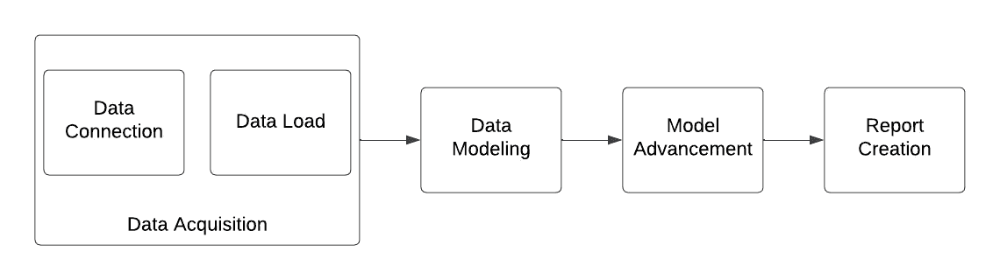
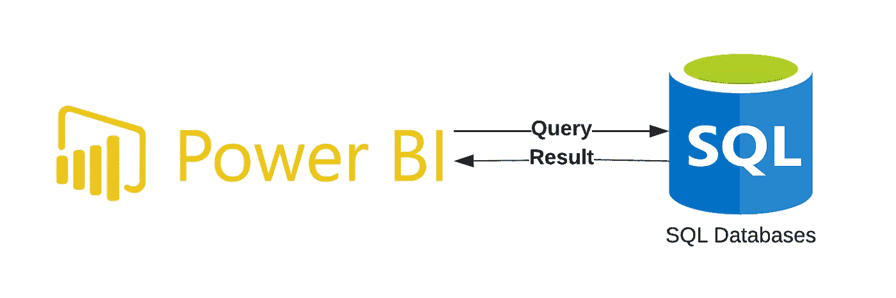
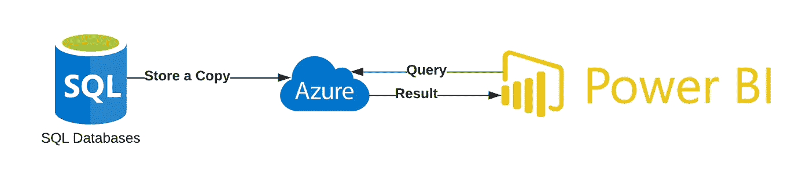
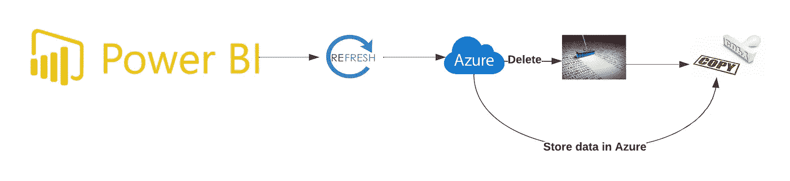
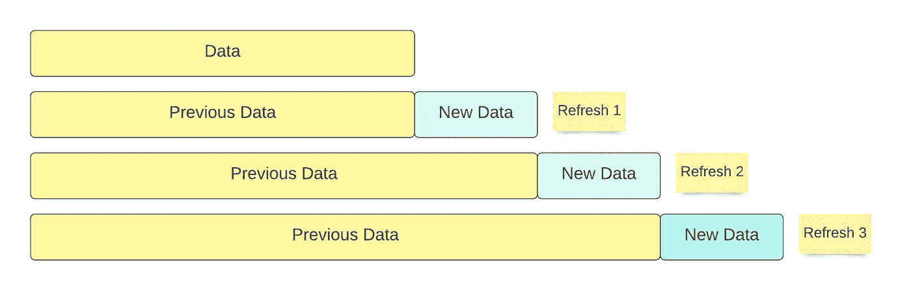

# 专业人员使用的 PowerBI 性能改进策略

> 原文：<https://towardsdatascience.com/powerbi-performance-improvement-strategies-used-by-professionals-48b1a0b504fd>

## 提高 PowerBI 性能的技巧(第 1 部分)

[活动发起人](https://unsplash.com/@campaign_creators?utm_source=medium&utm_medium=referral)在 [Unsplash](https://unsplash.com?utm_source=medium&utm_medium=referral) 上的照片

创建报告很简单。谁都可以做。然而，将专业人士与其他人区分开来的是报告的表现。在提交报告时，性能至关重要。提高 Power BI 的性能有几个好处。首先，它可以使工具响应更快、更容易使用，从而提高用户满意度和生产率。其次，更快的性能可以支持更复杂和数据密集型的操作，从而实现更高级的分析和洞察。总的来说，提高 Power BI 的性能有助于确保该工具在支持用户需求及其数据分析任务方面有效且高效。

在我们开始之前，让我们回顾一下 Power BI 快速总结。Power BI 是一个数据分析和可视化平台，可以收集、分析和可视化来自各种来源的数据。它包括用于数据获取、清理和转换的工具，以及一系列可用于从数据中获得洞察力的预置可视化和仪表板。Power BI 还提供了与各种数据源的连接，包括数据库、云服务和 web APIs，这使得集成来自多个来源的数据并在单个平台上进行分析变得非常容易。借助 Power BI，用户可以收集、清理和转换数据，创建交互式可视化和仪表盘，并与组织中的其他人分享他们的见解。

让我们开始吧。我将报告创建过程分为四个步骤。它们如下:

*   **数据采集:**将数据导入 PowerBI
*   **数据建模:**建立数据表之间的关系映射
*   **模型推进:**如果需要，创建度量和新列
*   **报告创建(添加可视化):**将所有可视化内容放在一起

这篇文章将关注第一个部分，即数据采集。包括数据连接和数据加载。我们将探讨数据连接中的连接类型、直接查询和导入模式。在数据加载部分，我们将探讨完全加载和增量加载之间的区别，以及数据连接和 Dat 加载的推荐做法。

*** *注意:**数据建模、模型改进和报告创建的性能改进将在后续文章中发布。

报告生成流程

# 1.数据采集

将数据导入 PowerBI 称为数据采集。我将数据采集过程分为两个逻辑分区。首先，**创建一个与数据源的连接**，然后定义 powerBI 将如何**在刷新时将数据**加载到系统中。

## 1.1:数据连接的类型

可以通过两种方式在 powerBI 中获取数据:

**一、直接查询**

直接查询是您的仪表板在运行时直接查询数据源的方法。每个过滤器和与报告的交互都会引发进一步的查询。

直接查询图

**使用直接查询的好处:**

*   它使您能够与数据实时交互，确保您始终拥有最新的信息。这在处理大量不断变化的数据集时尤其方便。
*   您可以连接到广泛的数据源。这包括关系数据库、大数据源，甚至是流数据。

**使用 DirectQuery 时要考虑的事项(性能方面):**

-后端源响应查询结果所用的时间决定了所需的视觉刷新时间，因为所有 DirectQuery 请求都被转发到源数据库。使用 DirectQuery 进行可视化时，建议的响应时间(返回请求的数据)少于 5 秒。

数据源快速响应是非常重要的。如果我必须在 SQL 数据库上进行直接查询，我总是从编写 SQL 查询开始，以获得特定表的总行数。如果耗时超过五秒，我会考虑数据库性能调优。这里有两种优化性能的方法。

*   **使用索引:
    -** 索引是数据库性能调优的一个重要方面，因为它们允许数据库系统快速发现并从表中获取数据，这大大提高了查询效率。数据库可能会快速搜索索引并发现表
    中的相关行，而不是扫描整个表——但是，在某些情况下，索引可能不会提高数据库性能，甚至可能会对性能产生负面影响。例如，如果查询与索引列无关，则不会使用索引，查询将必须扫描整个数据库以检索必要的数据。如果一个索引包含太多的行，它可能不会提供太多的性能提升，因为数据库仍然必须扫描大量的行来识别相关数据。
*   **联接类型:
    -** 联接是数据库性能调优的重要组成部分，因为它们会极大地影响使用多个表的查询的性能。
    -有几种不同类型的表连接，包括内部连接、外部连接和交叉连接。内部联接是最常见的，它返回在两个表中都有匹配值的行。另一方面，外部联接返回一个表中的所有行和另一个表中的匹配行。交叉联接返回两个表中行的所有可能组合。通过优化表的连接方式，可以提高这些查询的效率和性能。
*   **创建查询计划:**
    ——查询计划是对数据库系统执行 SQL 查询所要采取的动作的详细描述。它描述了操作的顺序、要使用的数据结构和算法，以及关于如何进行查询的其他参数。查询计划是数据库性能调优的一个重要部分，因为它们提供了有关查询将如何运行的信息，并且可以帮助发现需要改进的地方。
    -查询计划性能调优经常涉及改变查询、数据库设计或数据库配置，以提高查询性能。这可能包括优化索引的使用、更改模式以优化数据访问，或者使用其他方法来提高查询效率。
    -理解和分析查询计划是数据库性能调优的重要组成部分，因为它有助于保证高效地执行查询。
*   **查询提示** :
    -查询提示是在 SQL 查询中使用的指令，用于向数据库系统提供关于如何执行查询的附加信息或指令。查询提示可以用来影响查询策略，从而影响查询的性能。当数据库优化器无法为查询选择最佳计划，而用户希望为系统提供进一步的指导时，通常会使用查询提示。
    -例如，查询提示可用于识别某个用于查询的索引，或指定如何处理查询。
    -使用查询提示进行性能调优是提高单个查询性能的有效技术，但是必须小心处理。过度使用查询提示会导致复杂而脆弱的查询，难以维护和理解，并且在不同的情况下可能无法很好地执行。
    -一般来说，查询提示 ***应该只作为最后的手段使用*** ，毕竟其他的性能调优策略已经探索出来了。

**二。进口**

导入会复制数据源并创建快照。无论何时请求数据，它都直接与存储的数据一起使用，而不是连接到直接的数据源。

导入模式图

**使用导入的好处:**

*   因为数据被缓存，所以性能比直接查询好。
*   完全支持所有 DAX 表达式。

**使用导入模式时的注意事项:**

*   没有刷新，数据就不是实时的。
*   根据导入数据的大小，需要大量内存和磁盘空间。在您的计算机上(实施期间)，在云/本地服务器上(发布时)。
*   PowerBI 文件大小限制为 1 GB 如果文件较大，请升级到高级许可证，允许 50 GB 的数据。

**总而言之**，

> 如果数据大小适中，导入模式是最好的，但是在数据刷新之前，您将无法访问最新的数据。在这种情况下，DirectQuery 是最好的选择，但是您必须确保您的数据源性能良好。

克劳迪奥·施瓦茨在 [Unsplash](https://unsplash.com?utm_source=medium&utm_medium=referral) 上拍摄的照片

## 1.2:数据加载

对于报告来说，数据加载过程至关重要。典型的场景是从云中加载大型数据集，然后从数据源加载到报表中。

powerBI 中的数据源可以是 Excel 电子表格(例如)、JSON 文件(例如)或任何类型的输入文件，如 XML、CSV 等。必须使用 Power BI“主页”选项卡中“数据源”窗格上的“加载数据源”按钮将此数据源加载到 Power BI 中；这是创建数据集的第一步。此步骤需要一些时间，如果您没有访问允许加载的数据源的权限，则可能需要额外的步骤。

确保使用有效的方法将数据加载到报告中。这将有助于提高整体性能。powerBI 中有两种主要的负载类型。

**一、满载**

这是 powerBI 中的默认负载类型。满载意味着每次检索完整的数据集并丢弃以前的数据。这可能有点麻烦，尤其是如果您想要生成一个不限于数据集的特定子集的报告。满负荷可能不适用于所有数据集，但它将适用于它们！

导入模式的满负荷

如果数据量很小且数据变化频率很高，则首选满载，但是，如果数据量很大，则成本会很高，因为每次都会完全擦除和加载数据。这就是增量加载的用处所在。

**二。增量负载**

假设你有五年前的数据。只有最近的数据更改，其他数据保持不变。在这种情况下，增量负载是理想的选择。它只刷新最近的数据，不刷新以前的数据。

当您应用增量负载时，它会在您的数据上创建一个动态分区。由于这种分区，对数据的读取操作变得更快，从而提高了性能。该分区将需要定期刷新的数据与刷新频率较低的数据分开。

因为，增量加载有助于减少刷新数据集所需的时间和资源，并且可以提高 PowerBI 报告的响应速度。下图显示了增量加载的刷新周期。

增量负载

若要使用增量加载，首先需要确定数据集中的哪些列包含将用于确定哪些记录是新的或更新的信息。这通常是时间戳或唯一标识符。然后，您可以配置 PowerBI，只加载这些列中的值大于上一次加载的最大值的记录。

例如，假设您有一个包含客户订单的数据集，并且您希望使用增量加载来只加载新订单。您可以使用订单日期作为列来确定哪些记录是新的。在第一次加载时，PowerBI 将加载数据集中的所有订单。在后续装载中，PowerBI 将只装载日期晚于前一次装载的最大日期的订单。

**一言以蔽之**，

> 如果数据很小并且不经常更改，请使用满载。但是，如果您有大量数据，并且大部分历史记录没有更改，增量刷新是最佳选择。增量刷新将减少加载时间，从而提高性能。

在本文中，我们探讨了提高 PowerBI 报告性能的数据获取注意事项。我们讨论了数据连接，包括导入模式和直接查询，以及数据加载，包括完全加载和增量加载。在下面的帖子中，我们将讨论在开发数据模型以获得最佳性能时需要考虑的因素。

如果您喜欢这篇文章，并且想阅读本系列的下一部分，请关注我，以便在文章发布时收到通知。你也可以通过[点击这里](https://medium.com/@salehas222/subscribe)订阅 Medium，在你方便的时候阅读这样有趣的文章。

**形象学分**

所有图片，除非特别注明，均为作者所有。