# 每个数据科学家都应该知道的强大的一句话

> 原文：<https://towardsdatascience.com/powerful-one-liners-in-pandas-every-data-scientist-should-know-737e721b81b6>

## 使用熊猫可以在一行中完成的事情

照片由[克里斯汀玛丽](https://unsplash.com/@24k?utm_source=medium&utm_medium=referral)在 [Unsplash](https://unsplash.com?utm_source=medium&utm_medium=referral) 上拍摄

训练数据驱动的机器学习模型从未像今天这样简单。例如，假设你正在训练一个普通的神经网络。这里，针对隐藏层的数量及其维度调整架构、调整超参数或更改损失函数都可以通过对模型定义或其优化器进行轻微修改来完成。

一方面，这是有利的，因为它减少了从零开始花费时间设计架构的繁重工作。然而，这往往导致机器学习从业者/研究人员忽视了数据可视化和分析的重要性——导致他们直接训练深度模型，而没有对他们的数据建立清晰的理解。

因此，在这篇文章中，我想向您介绍一些专门针对使用 Pandas 的表格数据的重要而强大的一行程序，这将帮助您更好地理解您的数据，并最终(希望)帮助您设计和构建更好的机器学习模型。

# 资料组

在这篇文章中，我将使用一个由一千名员工组成的虚拟数据集进行实验，这个数据集是我自己用 Python 创建的。下图概述了我们正在试验的数据集。

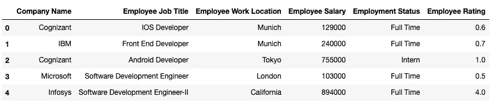

数据框的前五行(图片由作者提供)

下面的代码块演示了我的实现:

# 熊猫的俏皮话

接下来，让我们讨论熊猫中可用的一些流行功能，以便对可用数据进行有意义的理解。

## **# 1n-系列中的最大值**

假设我们想从找出这个数据集中薪酬最高的前 n 个角色开始。你可以在 Pandas 中使用`[nlargest()](https://pandas.pydata.org/docs/reference/api/pandas.DataFrame.nlargest.html)`方法来实现。该方法返回列中具有最大**值的前`n`行，按降序排序。**

请注意，`nlargest()`返回整个数据帧，也就是说，该函数还返回未指定排序的列。但是，它们不用于对数据帧进行排序。下面的代码片段描述了在我们的数据帧上使用`nlargest()`方法。

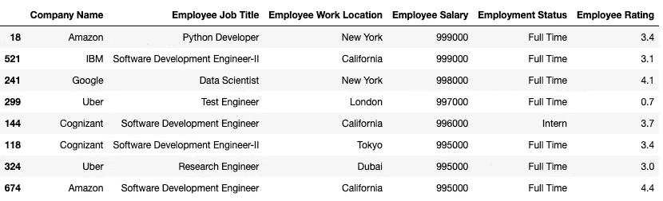

nlargest 方法的输出(图片由作者提供)

当存在重复值时，我们需要指定在最终输出中需要哪些特定的行。这是使用`keep`参数完成的，该参数可以取以下值:

1.  `keep = "first"`:优先考虑第一个出现的**。**
2.  `keep = "last"`:优先处理最后一次发生的**。**
3.  `keep = "all"`:不删除任何重复项，即使这意味着选择超过 *n* 个项目(如上图所示)。

人们经常误认为`nlargest()`正好等同于使用如下的`sort_values()`方法:

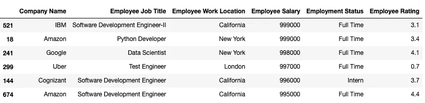

sort_values 方法的输出(图片由作者提供)

然而，`nlargest()`中使用的`keep`参数使一切都不同了。考虑到上面的例子，带有`keep=”all"`的`nlargest()`也会返回潜在的重复项。另一方面，这在`sort_values()`方法的情况下是做不到的。

## # 2n-系列中的最小值

类似于上面讨论的`nlargest()`方法，您可以在 Pandas 中使用`nsmallest()`方法找到对应于最低 n 值的行。该方法返回列中具有最小**值的前`n`行，按升序排列。这里传递的参数与在`nlargest()`方法中指定的参数相同。下面的代码片段描述了在我们的数据帧上使用`nsmallest()`方法。**

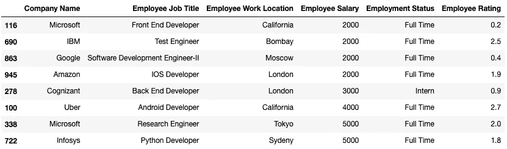

nsmallest 方法的输出(图片由作者提供)

## #3 交叉表

Crosstab 允许您计算两个(或更多)列/系列的交叉列表，并默认返回每个组合的频率。换句话说，`[crosstab()](https://pandas.pydata.org/docs/reference/api/pandas.crosstab.html)`接受一个列/列表，将其唯一值显示为索引，然后接受另一个列/列表，将其唯一值显示为列标题。单个单元格中的值是使用聚合函数计算的。默认情况下，它们表示同现频率。

比方说，我们希望计算每家公司内每个地点的员工人数。这可以通过以下方式完成:

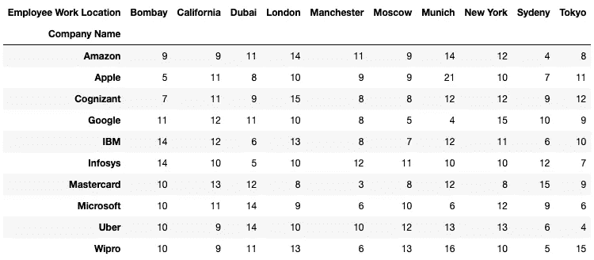

计算共现频率的交叉表输出(图片由作者提供)

由于很难解释交叉表中的数值(并使其更具视觉吸引力)，我们可以从如下所示的交叉表中生成一个热图:

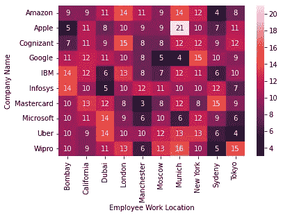

描绘同现数据框架的热图(图片由作者提供)

如果您希望在组成索引和列标题的列之外的其他列上计算聚合，可以通过将聚合列传递给`crosstab()`的`values`参数来实现，如下所示:

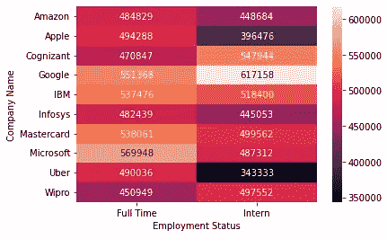

描述平均工资的热图(图片由作者提供)

## #4 数据透视表

数据透视表是 Excel 中常用的数据分析工具。与上面讨论的交叉表类似，Pandas 中的数据透视表提供了一种交叉制表的方法。

虽然它们有许多相似之处，并且在熊猫的上下文中概念上是相同的，但是有一些实现上的差异使它们不同(此处进一步阅读)。下面的代码片段演示了如何使用`[pivot_table()](https://pandas.pydata.org/docs/reference/api/pandas.pivot_table.html)`方法来查找“公司名称”和“位置”之间的共现频率:

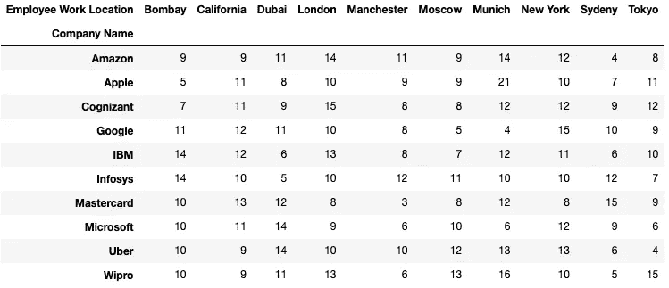

计算共现频率的数据透视表的输出(图片由作者提供)

与我们在 Crosstab 中所做的类似，我们可以创建一个热图，使其在视觉上更具吸引力，并且更容易理解。如代码片段所示，这可以生成以下热图:

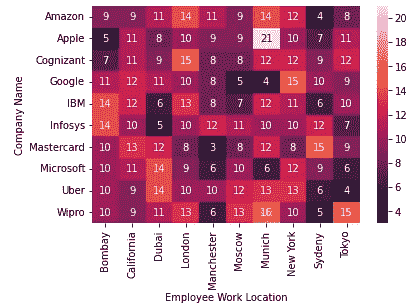

描绘同现数据框架的热图(图片由作者提供)

## #5 处理重复数据

除了常规的数据分析之外，适当地处理数据中的重复值在构建数据管道中也起着至关重要的作用。数据中有副本的一个主要警告是，它们会占用不必要的存储空间，并通过获取资源来降低计算速度。此外，重复数据会扭曲分析结果，导致我们得出错误的见解。因此，删除或处理数据中的重复项极其重要。

首先，让我们看看如何在数据帧中标记重复值。为此，我们将在熊猫身上使用`[duplicated()](https://pandas.pydata.org/docs/reference/api/pandas.DataFrame.duplicated.html)`方法。这将返回一个指示重复行的布尔序列。出于演示的目的，我将只使用 10 行原始 salary 数据集的随机样本，其中最后两行是有意复制的。下图显示了采样的行。

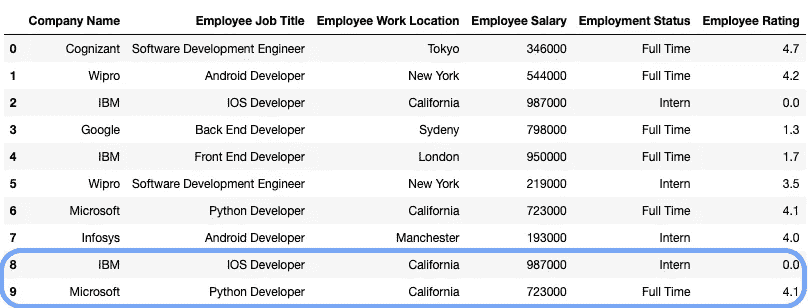

带有副本的数据帧(图片由作者提供)

*   **标记重复的行**

Pandas 允许您根据重复的所有列(或列的子集)为行分配布尔标签。这可以使用熊猫的`[duplicated()](https://pandas.pydata.org/docs/reference/api/pandas.DataFrame.duplicated.html)`方法来完成，如下所示:

当有重复值时，`keep`用于指示标记哪些具体的重复值。

1.  `keep = "first"`:(默认)将所有重复标记为`True`，第一个**出现的**除外。
2.  `keep = "last"`:将所有重复标记为`True`，最后一个出现的**除外。**
3.  `keep = False`:将所有重复标记为`True`。

您可以过滤所有只出现一次的行，方法是将布尔序列作为过滤熊猫数据帧的标志，如下所示:

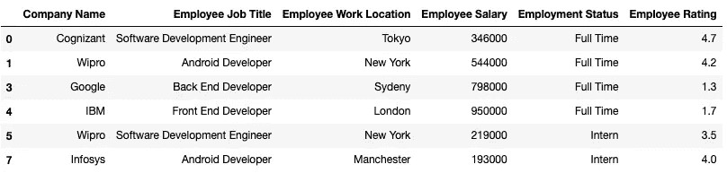

无重复的过滤数据帧(图片由作者提供)

要检查列子集上的重复项，请将列列表作为`duplicated()`方法的`subset`参数传递，如下所示:

如下所示，使用上述布尔序列过滤数据帧，输出代码后的数据帧:

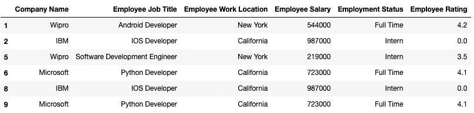

考虑两列的重复数据的过滤数据帧(图片由作者提供)

*   **删除重复项**

除了使用上面讨论的布尔标签来标记潜在的重复之外，可能还需要去除重复。重申一下，我特别为“处理重复数据”一节引用的数据只有十行。如下所示:

带有副本的数据帧(图片由作者提供)

您可以使用如下所示的`drop_duplicates()`方法，根据所有列中的值或列的子集来删除重复的行:

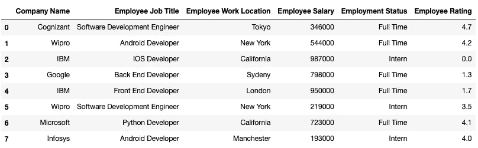

删除重复行后的数据帧(作者图片)

与`duplicated()`类似，`keep`参数用于指示您想要保留哪些特定的副本。

1.  `keep = "first"`:(默认)删除除第一个出现的**之外的所有重复。**
2.  `keep = "last"`:删除除最后一次出现的**之外的所有重复。**
3.  `keep = False`:删除所有重复项。

要根据列子集中的值删除重复项，请将列列表作为`subset`参数传递给`drop_duplicates()`方法:

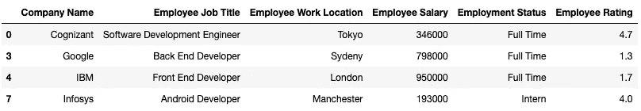

删除重复行后的数据帧，考虑两列(图片由作者提供)

总之，在这篇文章中，我介绍了 Pandas 中一些流行的方法，用于表格数据的有效数据分析。虽然这篇文章将有助于您熟悉这些方法的语法，但我强烈建议您自己下载一个数据集，并在 jupyter 笔记本上进行实验。

此外，没有比参考熊猫官方文件更好的地方了[这里](https://pandas.pydata.org/docs/)获得熊猫各种有效方法的基础和实用知识。Pandas 的官方文档提供了一个函数接受的每个参数的详细解释，以及一个实际的例子，在我看来，这是获得初级和高级 Pandas 专业知识的一个很好的方法。

附注:我在这篇文章中只能介绍五种方法。我将很快在另一个帖子中发布下一组有效数据分析的 Pandas 方法:)。同时，如果你喜欢读这篇文章，我相信你也会喜欢下面的文章:

</20-of-pandas-functions-that-data-scientists-use-80-of-the-time-a4ff1b694707>  <https://medium.com/@avi_chawla/top-ai-resources-you-must-follow-if-you-are-into-ai-19f657697c41>  

感谢阅读。