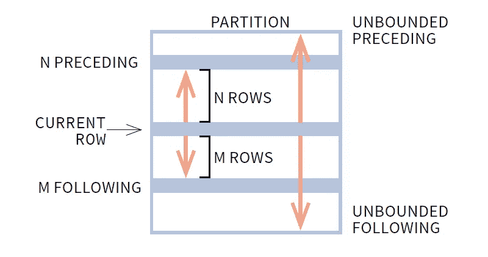

# 您可能不知道的强大的 SQL 查询

> 原文：<https://towardsdatascience.com/powerful-sql-queries-that-you-might-not-know-c9953ea4bf20>

## 一些可以将您的 SQL 带到另一个层次的查询和技术


[博伊图梅洛·菲特拉](https://unsplash.com/@writecodenow?utm_source=medium&utm_medium=referral)在 [Unsplash](https://unsplash.com?utm_source=medium&utm_medium=referral) 拍摄的照片

当我大学毕业时，我对 SQL 非常有信心。会有多难呢？只是选择、连接和分组。窗口函数一开始有点难以理解，但我认为这是它所能达到的最大挑战。我不知道有一个残酷的世界在等着我。SQL 的世界是巨大的，如果你没有在实践中使用它来解决现实世界的问题，你就不能 100%理解其中的一些条款和概念。

成为一名分析工程师意味着 SQL 现在已经成为我的日常语言(也许比英语用得更多？！).下面我分享一些 SQL 查询和技术，这些是我在解决了一些实际问题后学到的，我觉得它们是对你的 SQL 库的很好的补充。

*注意，我主要研究雪花方言。查询也可以存在于不同的方言中，但是具有不同的语法，或者在某些方言中根本不被支持。务必事先检查文档。*

# **晋级**

假设您有一个客户下订单的表。每个客户可能有多个订单。现在您想从每个客户那里获得最新的订单。

| date | customer _ id | order _ id | price |
|--|-|-|
| 2022-01-01 | 001 | 123 | 100 |
| 2022-01-02 | 002 | 432 | 250 |
| 2022-01-03 | 002 | 212 | 350 |
| 2022-01-04

一个简单的窗口函数和 CTE 可以做到这一点:

```
with order_order as
(
select
    date,
    customer_id,
    order_id,
    price,
    row_number() over (partition by customer_id order by date desc)    
    as order_of_orders
from customer_order_table 
)
select
     *
from order_order
where order_of_orders = 1
; Results:
| date       | customer_id | order_id | price |
|------------|-------------|----------|-------|
| 2022-01-03 | 002         | 212      | 350   |
| 2022-01-06 | 005         | 982      | 300   |
| 2022-01-07 | 001         | 109      | 120   |
```

尽管这样做很好，但这不是编写这个查询的最佳方式。这就是`qualify`派上用场的地方。

> **QUALIFY** 子句过滤窗口函数的结果。限定具有窗口功能的 does，就像具有的**对由**分组的**所做的那样。因此，在执行顺序中，QUALIFY 是在窗口函数之后计算的。
> 来源:[雪花文档](https://docs.snowflake.com/en/sql-reference/constructs/qualify.html)**

```
select
    date,
    customer_id,
    order_id,
    price
from customer_order_table
qualify row_number() over (partition by customer_id order by date desc) = 1
;Results:
| date       | customer_id | order_id | price |
|------------|-------------|----------|-------|
| 2022-01-03 | 002         | 212      | 350   |
| 2022-01-06 | 005         | 982      | 300   |
| 2022-01-07 | 001         | 109      | 120   |
```

在回答像获取每个类别的最大 XXX 值这样的问题时，QUALIFY 特别有用。

# **阵列**

当您希望将多个值作为一个数组放入一个单元格中时，Array 非常有用。我发现最有用的数组函数是`array_agg`、`array_size`和`array_contains`。

例如，我们有一个 order_item 表，它列出了每个订单项目的品牌、类别和销售价格。

```
| brand  | order_item_number | category   | sales |
| ------ | ------------------| ---------- | ----- |
| Levi's |  A123879320931    | jeans      | 30    |
| Uniqlo |  A123879320932    | t-shirts   | 120   |
| Uniqlo |  A123879320933    | shirts     | 150   |
| COS    |  A123879320934    | trousers   | 347   |
| Levi's |  A123879320935    | jacket     | 672   |
| Arket  |  A123879320936    | jacket     | 40    |
| Uniqlo |  A123879320937    | vest       | 65    |
| COS    |  A123879320938    | shirts     | 78    |
| COS    |  A123879320939    | vest       | 100   |
```

## 数组 _ 聚集

`ARRAY_AGG` [返回输入值并将它们旋转到一个数组中。](https://docs.snowflake.com/en/sql-reference/functions/array_agg.html)例如，今天你想知道每个品牌在网站上都有哪些品类。你可以做一个简单的`group by`作为

```
select
    brand,
    category
from order_item
group by brand, category
order by brand, category
;Results:| brand  | category   | 
| ------ | ---------- | 
| Arket  | jacket     |
| COS    | shirts     |
| COS    | trousers   | 
| COS    | vest       |
| Levi's | jacket     |
| Levi's | jeans      |
| Uniqlo | shirts     |
| Uniqlo | t-shirts   | 
| Uniqlo | vest       |
```

这种方法的问题是，如果每个品牌有很多类别，行数将变得非常多，以至于很难检查每个品牌。而且也不容易看到一个品牌的所有品类。这两个问题都可以通过使用`array_agg`并在函数中指定 distinct 来解决:

```
select
   brand,
   array_agg(distinct category) as all_categories
from order_item
group by brand
order by brand
;Results:| brand  | all_categories               | 
| ------ | ---------------------------- | 
| Arket  | ['jacket']                   |
| COS    | ['shirts','trousers','vest'] |
| Levi's | ['jacket','jeans']           |
| Uniqlo | ['shirts','t-shirts','vest'] |
```

通过将这些值转换成一个数组，现在检查每一项就容易多了。它还为使用其他数组函数来回答带有简单子句的更复杂的问题提供了机会。

## 数组大小

`array_size`函数将一个数组或变量作为输入，并返回数组/变量中的项数([文档](https://docs.snowflake.com/en/sql-reference/functions/array_size.html))。通过使用它，我们可以很容易地回答诸如“*每个品牌有多少个类别”这样的问题。*

```
select
   brand,
   array_agg(distinct category) as all_categories,
   array_size(all_categories) as no_of_cat
from order_item
group by brand
order by brand
;Results:| brand  | all_categories               | no_of_cat |
| ------ | ---------------------------  | --------- |
| Arket  | ['jacket']                   | 1         |
| COS    | ['shirts','trousers','vest'] | 3         |
| Levi's | ['jacket','jeans']           | 2         |
| Uniqlo | ['shirts','t-shirts','vest'] | 3         |
```

## 数组包含

`ARRAY_CONTAINS`检查一个 ***变量*** 是否包含在一个数组中，并返回一个布尔值。请注意，您需要首先将您想要检查的项目转换为变量([文档](https://docs.snowflake.com/en/sql-reference/functions/array_contains.html))。语法:`*array_contains(variant, array)*` *问:什么品牌有外套？*

```
select
   brand,
   array_agg(distinct category) as all_categories,
   array_size(all_categories) as no_of_cat,
   array_contains('jacket'::variant,all_categories) as has_jacket
from order_item
group by brand
order by brand
;Results:| brand  | all_categories               | no_of_cat | has_jacket |
| ------ | ---------------------------  | --------- | ---------- |
| Arket  | ['jacket']                   | 1         | true       |
| COS    | ['shirts','trousers','vest'] | 3         | false      |
| Levi's | ['jacket','jeans']           | 2         | true       |
| Uniqlo | ['shirts','t-shirts','vest'] | 3         | false      |
```

# **其中 1=1**

从技术上讲，这不是一个查询，而更像是一个约定或技巧。如果您没有深入研究 SQL，这可能不太直观。我花了一段时间才真正理解为什么工程师总是加一个`1=1`或者`true`作为第一个 where 子句。

假设您有一组 where 子句，您希望在不同的条件下应用它们。诸如

```
select
     *
from XXX_table
where 
  (if condition A) clause 1 
  (if condition B) and clause 2 
  (if condition C) and clause 3
;
```

在这种情况下，如果不满足条件 A，子句 1 将为空，查询中的 where 子句将变为`where *and* clause 2 and clause 3`，这将导致语法错误。为了防止错误发生，通常在开头添加一个`1=1`，因此它变成了

```
select
     *
from XXX_table
where 1=1
    (if condition A) and clause 1 
    (if condition B) and clause 2 
    (if condition C) and clause 3
;
```

因为`1=1`总是为真，即使所有的条件都不满足，查询仍然会工作。

另一个原因是让开发查询更加顺畅。在开发 SQL 查询时，我们经常需要更改 where 子句来测试不同的场景。在普通的 where 子句中，如

```
where 
    clause 1 
    and clause 2 
    and clause 3
```

如果我们要对第 1 条进行注释，那么我们也需要删除第 2 条中的“and”。通过在开头使用`1=1`或`true`，所有的子句都将有一个‘and’，所以当注释掉任何 where 子句时，我们不需要担心其他事情。

```
where 1=1
   -- and clause 1
   and clause 2
   and clause 3
```

此外，它更美观，因为您可以将所有 where 子句排成一行。好吧，我承认这有点强迫症，但是一直在你的 where 子句开头加`1=1`或者`true`是个好习惯。

# **自然加入**

自然联接假定不同表中同名的列是联接键。因此，您不需要指定连接键，只需`select * from table_a natural join table_b`。与其他联接不同，如果没有在 select 中指定列，自然联接将只包括一次公共列，即联接键。如果未指定，自然联接将作为内部联接执行，但是，它也可以与外部联接组合。你不能使用`natural join table_b **on** ...`，因为当你使用自然连接时，连接键已经被隐含了。
*来源:* [*雪花加入*](https://docs.snowflake.com/en/sql-reference/constructs/join.html)

示例:

```
table_a:| id | name  |
|----|-------|
| 1  | Jenny |
| 2  | Jeff  |
| 3  | Brian |table_b:| id | age |
|----|-----|
| 1  | 30  |
| 2  | 21  |
| 4  | 50  | select
    *
from table_a
natural join table_b
;Results:
| id | name  | age |
|----|-------|-----|
| 1  | Jenny | 30  |
| 2  | Jeff  | 21  | select
    *
from table_a
natural outer join table_b
;Results:
| id | name  | age  |
|----|-------|------|
| 1  | Jenny | 30   |
| 2  | Jeff  | 21   |
| 3  | Brian | null |
| 4  | null  | 50   |
```

在以下情况下，您应该考虑使用自然联接:

1.  多个表中有许多同名的公共列，它们都被用作连接键。
2.  您不希望为了避免多次输出相同的列而在 select 中键入所有的公共列。

# 总流量

计算运行总数是你可以从涉众那里得到的一个非常普遍的需求。当我第一次接近这个问题时，我花了很多时间思考如何使用窗口函数和 LAG/LEAD 来完成工作。直到我了解到一个简单的加窗函数就能解决问题。让我们再次以此表为例:

```
| name  | date       | sales |
| ----- | -----------| ----- |
| James | 2021-01-01 | 30    |
| Nina  | 2021-01-02 | 120   |
| Mike  | 2021-01-02 | 150   |
| James | 2021-01-03 | 347   |
| James | 2021-01-05 | 672   |
| Mike  | 2021-01-03 | 40    |
| Nina  | 2021-01-05 | 65    |
| Mike  | 2021-01-08 | 78    |
| Mike  | 2021-01-09 | 100   |
```

要计算每个人的运行总数，按日期排序，只需将这个要求放在`over`子句中，并使用`sum()`作为聚合函数。

```
select
    name,
    date,
    sales,
    sum(sales) over (partition by name order by date) as running_sum
from TABLE_NAME
;Results:| name  | date       | sales | running_sum |
| ----- | -----------| ----- | ----------- |
| James | 2021-01-01 | 30    |30           |
| James | 2021-01-03 | 347   |377          |
| James | 2021-01-05 | 672   |1,049        |
| Mike  | 2021-01-02 | 150   |150          |
| Mike  | 2021-01-03 | 40    |190          |
| Mike  | 2021-01-08 | 78    |268          |
| Mike  | 2021-01-09 | 100   |368          |
| Nina  | 2021-01-02 | 120   |120          |
| Nina  | 2021-01-05 | 54    |274          |
```

您也可以使用相同的逻辑来计算移动平均值。

```
select
    name,
    date,
    sales,
    sum(sales) over (partition by name order by date) as running_sum,
    avg(sales) over (partition by name order by date) as running_avg
from TABLE_NAME
;Results:| name  | date       | sales | running_sum | running_avg |
| ----- | -----------| ----- | ----------- | ----------- |
| James | 2021-01-01 | 30    |30           | 30          |
| James | 2021-01-03 | 347   |377          | 188         |
| James | 2021-01-05 | 672   |1,049        | 350         |
| Mike  | 2021-01-02 | 150   |150          | 150         |
| Mike  | 2021-01-03 | 40    |190          | 95          |
| Mike  | 2021-01-08 | 78    |268          | 89          |
| Mike  | 2021-01-09 | 100   |368          | 92          |
| Nina  | 2021-01-02 | 120   |120          | 120         |
| Nina  | 2021-01-05 | 54    |274          | 137         |
```

# 预付款:移动平均线

获得最近 n 天的平均值，即移动平均线，是人们喜欢问的另一个流行问题。通过查看过去 n 天的平均值，而不是只查看每天的数字，我们可以更好地了解趋势，减少偏差。这是防止异常值影响结果的好方法。例如，如果在几天的低病例数后，新冠肺炎病例数有一天出现高峰，仅从高峰来看，情况可能很糟糕。但看看最近的 7 天平均线，峰值会被平均掉，数字会更好地反映当前的情况。

SQL 中的移动平均并不难。一开始这可能有点令人生畏，但是一旦你理解了它背后的概念，它就是一个非常强大的工具。我们使用`rows between n preceding and n following`来指定我们想要用来计算平均值的窗口。您也可以使用`CURRENT ROW`来确定当前行，使用`UNBOUNDED`来不设置边界。



来源: [SQL 窗口函数备忘单](https://learnsql.com/blog/sql-window-functions-cheat-sheet/)

让我们用这个表来看看一些实际的代码示例。

```
table_daily_sales:| date       | sales |
|------------|-------|
| 2022-01-01 | 100   |
| 2022-01-02 | 300   |
| 2022-01-03 | 210   |
| 2022-01-04 | 250   |
| 2022-01-05 | 400   |
| 2022-01-06 | 1200  |
| 2022-01-07 | 220   |
```

如果我们想计算过去 3 天(包括今天)的移动平均值，我们希望在窗口中显示今天(当前行)、昨天和前天。

```
select
   date,
   sales,
   avg(sales) over (order by date 
       rows between 2 preceding and current row) as moving_avg
from table_daily_sales
;Results:
| date       | sales | moving_avg |
|------------|-------|------------|
| 2022-01-01 | 100   | 100        | =(100)/1
| 2022-01-02 | 300   | 200        | =(100+300)/2
| 2022-01-03 | 210   | 203        | =(100+300+210)/3
| 2022-01-04 | 250   | 253        | =(250+210+300)/3
| 2022-01-05 | 400   | 286        | =(400+250+210)/3
| 2022-01-06 | 1200  | 616        | =(1200+400+250)/3
| 2022-01-07 | 220   | 606        | =(220+1200+400)/3
```

注意，前几行会相应地改变分母，因为之前没有足够的日期。也许你认为今天还没有结束，所以我们应该只包括从 4 天前到昨天。这很简单，只需根据您想要的逻辑更改您的窗口:

`order by date rows between 3 preceding and current row -1`

使用`UNBOUNDED`允许您不设置边界:

`order by date rows between UNBOUNDED preceding and current row`将给出从表格的最早日期直到当前行。

SQL 还有很多东西要学，就像我说的世界是巨大的。你觉得哪个最有用？你有什么“隐藏的宝石”SQL 查询想分享吗？评论一下，让我知道！