# 用最先进的嵌入技术支持计算机视觉中的语义相似性搜索

> 原文：<https://towardsdatascience.com/powering-semantic-similarity-search-in-computer-vision-with-state-of-the-art-embeddings-f6c183fff134>

# 用最先进的嵌入技术支持计算机视觉中的语义相似性搜索

## 执行图像到图像和文本到图像相似性搜索的最简单方法

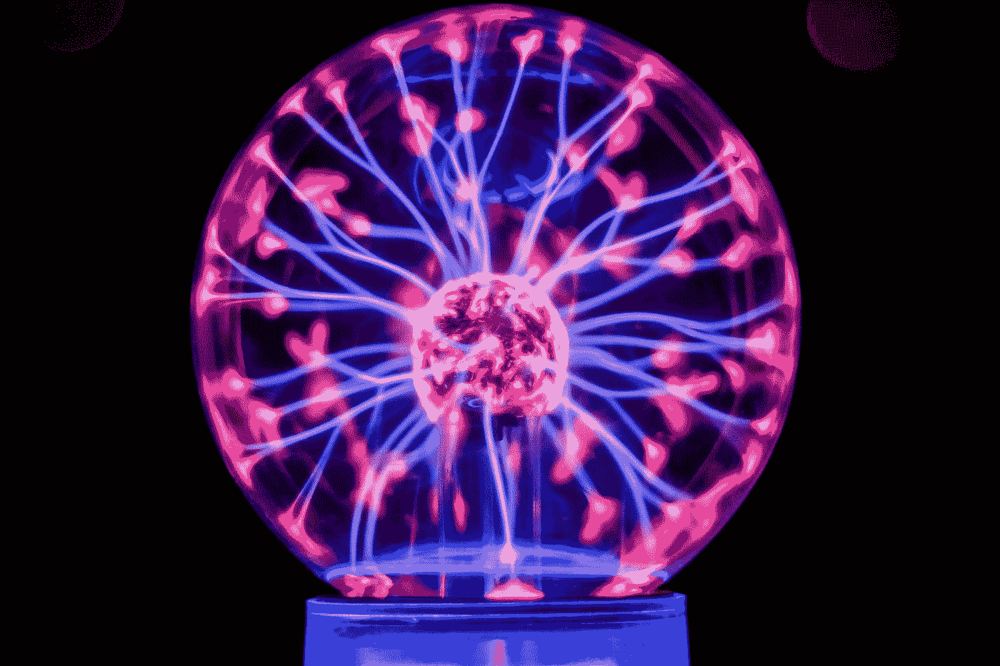

厉害的力量！由[狮式战斗机·珀奇克](https://unsplash.com/@laviperchik?utm_source=medium&utm_medium=referral)在 [Unsplash](https://unsplash.com?utm_source=medium&utm_medium=referral) 上拍摄的照片

自从人类文明诞生以来，多达 90%的数据是在过去两年中产生的！随着社交媒体和物联网(IoT)等数字技术的激增，以及 5G 等速度更快的无线通信技术的发展，数据创建率不断提高。然而，大多数新创建的数据都是“[非结构化的](https://www.researchgate.net/publication/322058724_Unified_concept-based_multimedia_information_retrieval_technique)，如文本、图像、音频和视频[来源](https://www.researchgate.net/figure/The-Massive-Growth-in-Unstructured-Data-Source-IDC-The-Digital-Universe-Dec-2012_fig12_322058724)。

非结构化数据之所以得名，是因为它没有固有的结构，不像表格那样由行和列组成。相反，非结构化数据包含几种可能格式之一的信息。例如，电子商务图像、客户评论、社交媒体帖子、监控视频、语音命令等。，是丰富的信息源，不遵循传统的表格数据格式。

人工智能(AI)和机器学习(ML)技术的最新进展创造了一种通过使用“嵌入”以可扩展的方式从非结构化数据源中提取有用信息的方法。将非结构化数据转换为嵌入数据，并将其存储在向量数据库中，如 [Milvus](https://milvus.io/) 已经实现了几个优秀的应用程序，这在几年前是不可想象的。一些示例应用是[视觉图像搜索](https://arxiv.org/abs/2102.04674)、[语义文本搜索](https://arxiv.org/abs/1908.10084)、[推荐引擎](https://github.com/spotify/annoy)、[对抗错误信息](https://ai.facebook.com/blog/using-ai-to-detect-covid-19-misinformation-and-exploitative-content/)、[药物发现](https://blog.milvus.io/milvus-in-action-chemical-structure-similarity-search-33130767162a)等。！

在本帖中，我们将讨论以下内容。点击链接，跳转到以下部分:

1.  [什么是嵌入](https://medium.com/p/f6c183fff134#2b04)
2.  [用 Kaggle API 加载一些数据](https://medium.com/p/f6c183fff134#06bc)
3.  [拉平原始像素值](https://medium.com/p/f6c183fff134#df1d)
4.  [针对分类目标](https://medium.com/p/f6c183fff134#7a4b)预训练的卷积神经网络:Towhee by Zilliz
5.  [用度量学习目标](https://medium.com/p/f6c183fff134#ed6c)预训练的卷积神经网络:谷歌的 SimCLR
6.  [用度量学习目标](https://medium.com/p/f6c183fff134#f3c6)预训练的图像-文本多模态神经网络:由 OpenAI 剪辑
7.  [结论](https://medium.com/p/f6c183fff134#79aa)

在这篇文章中，我们将使用 Kaggle 提供的 Digikala 产品颜色分类数据集[在这里](https://www.kaggle.com/masouduut94/digikala-color-classification)构建一个简单的基于图像的电子商务相似产品搜索服务。数据集是在 GPL 2 许可下授权的。

# 什么是嵌入

我们的计算机不能像人类那样直接理解图像或文本。但是，计算机擅长理解数字！因此，为了帮助我们的计算机理解图像或文本的内容，我们需要将它们转换成数字表示。例如，如果我们考虑图像用例，我们本质上是将图像的上下文和场景“编码”或“嵌入”到一系列矢量形式的数字中。

> *“嵌入”向量是我们图像数据的数字表示，以便我们的计算机可以理解我们图像的上下文和场景。*

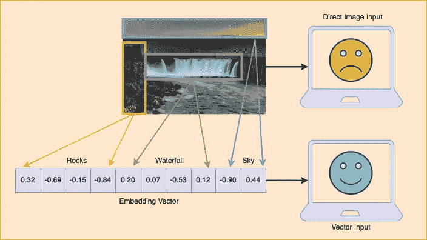

计算机不能直接理解图像，但是它们可以很好地理解数字！作者图片

几个 Python 库允许我们从图像中生成嵌入。一般来说，我们可以将这些库分为两大类。

1.  **提供具有预训练模型的现成 API 的库:**对于许多涉及日常物品图像的现实世界问题，我们可能不需要训练任何模型。相反，我们可以依赖全球研究人员开源的许多高质量的预训练模型。研究人员已经训练这些模型从 [ImageNet](https://paperswithcode.com/dataset/imagenet) 数据集中识别和聚类几个日常物体。
2.  **允许我们训练和微调我们的模型的库:**顾名思义，对于这些模型，我们可以从零开始带来我们的数据和训练模型，或者专门针对我们的用例微调预训练的模型。如果预先训练的模型没有为我们的问题领域提供良好的嵌入，我们只需要沿着这条路走下去。

让我们在这篇文章中看看其中的几个库。但是首先，让我们加载一些图像数据来定性地评估我们在相似性搜索应用程序中的嵌入。

# 加载一些数据

我们首先需要加载一些图像数据来测试各种嵌入策略。在这篇文章中，让我们使用来自 Kaggle 的 Digikala 产品颜色分类数据集[这里](https://www.kaggle.com/masouduut94/digikala-color-classification)。该数据集包含超过 6K 个电子商务产品的图像，非常适合测试基于电子商务图像的类似产品搜索服务。

## 步骤 1:设置 Kaggle 环境

1.  在[kaggle.com](http://kaggle.com)上创建账户
2.  单击您的个人资料图片，然后从下拉菜单中单击“帐户”。
3.  向下滚动到“API”部分。
4.  单击下图所示的“创建新的 API 令牌”按钮，下载一个新的令牌，作为一个 JSON 文件，其中包含用户名和 API 密钥。
5.  如果您使用的是 macOS 或 Linux，将 JSON 文件复制到`~/.kaggle/`目录。在 Windows 系统上，转到您的根目录，然后转到`.kaggle`文件夹，并将下载的文件复制到该文件夹。如果`.kaggle`目录不存在，请创建它并将 JSON 文件复制到其中。

创建一个新的 Kaggle API 令牌。图片作者。

## 步骤 2:从 Kaggle 下载数据

我们将使用 Anaconda 来管理这个项目的虚拟环境。你可以从[这里](https://www.anaconda.com/products/individual)安装 Anaconda。一旦您下载并安装了 Anaconda，我们就可以设置一个名为`semantic_similarity`的新环境，安装必要的库，如`kaggle`和`pandas`，并通过在终端窗口中运行以下命令从[kaggle.com](http://kaggle.com)下载整个数据集。如果不想使用 Anaconda，也可以使用 python 的`venv`为这个项目创建和管理一个虚拟环境。

作者代码

该数据包含各种电子商务产品的 6K 多张图片。在下图中，我们可以看到数据集中的一些样本图像。正如您所注意到的，数据集包含各种时尚产品，如男装、女装、包、珠宝、手表等。

数据集中可用的示例产品。作者使用来自拥有 GPL 2 许可证的 [Digikala 产品颜色分类数据集](https://www.kaggle.com/masouduut94/digikala-color-classification)的图像合成图像。

## 步骤 3:将所有图像从每个文件夹移动到父文件夹

让我们在`semantic_similarity/notebooks`目录中创建一个新的 jupyter 笔记本来测试各种嵌入策略。首先，让我们导入必要的库。

作者代码

下载的图像位于几个子文件夹中。让我们将它们全部移动到主父目录中，这样我们就可以很容易地获得它们的所有路径。

来自[堆栈溢出](https://stackoverflow.com/questions/8428954/move-child-folder-contents-to-parent-folder-in-python)的代码，由作者修改

## 步骤 4:将图像路径加载到熊猫数据帧中

接下来，让我们将所有图像文件路径的列表加载到 pandas 数据帧中。

作者代码

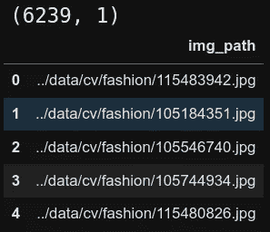

数据帧中的前 5 行。作者图片

# 生成嵌入的策略

计算机视觉技术的最新进展开辟了许多将图像转换成数字嵌入的方法。让我们来看看其中的几个。点击链接跳转到相关部分。

1.  [拉平原始像素值](https://medium.com/p/f6c183fff134#df1d)
2.  [根据分类目标预先训练的卷积神经网络](https://medium.com/p/f6c183fff134#7a4b)
3.  [用度量学习目标预训练的卷积神经网络](https://medium.com/p/f6c183fff134#ed6c)
4.  [用度量学习目标预训练的图文多模态神经网络](https://medium.com/p/f6c183fff134#f3c6)

# 拉平原始像素值

彩色图像由三维像素阵列组成。第一维是图像的高度，第二维是图像的宽度，最后第三维是颜色通道，统称为 RGB，包含红色、绿色和蓝色，如下图所示。每个像素的值是 0 到 255 之间的整数，255 是可能的最高亮度。

因此,( 0，0，0)的 RGB 值是全黑或纯黑像素，而(255，255，255)是全饱和纯白像素。我们图像中可见的所有其他颜色都是由 RGB 这三个基本值的各种组合构成的。在 [RapidTables 网站](https://www.rapidtables.com/web/color/RGB_Color.html)上的 RGB 颜色代码表允许你选择任何颜色来查看它的 RGB 值，一定要试试！

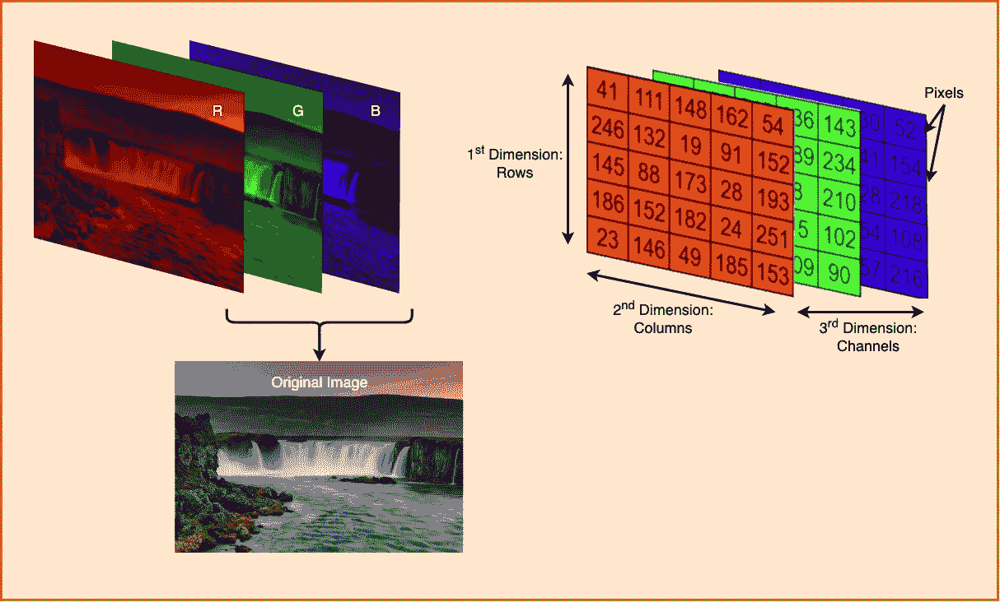

彩色图像由 3 个通道组成，一个用于红色，一个用于绿色，一个用于蓝色。作者图片

假设图像是 3D 数组格式的一系列数字，使用`reshape`操作将它们转换成 1D 向量是很简单的，如下图所示。我们也可以通过将每个像素的值除以 255 来归一化 0 到 1 之间的像素。我们将在代码中这样做。

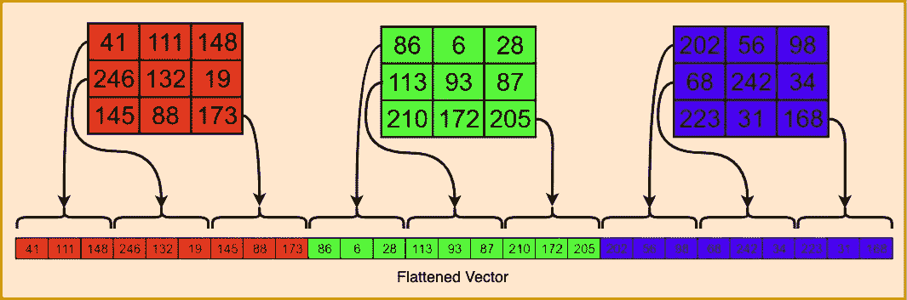

拼合会将 3D 数组转换为 1D 矢量。作者图片

作者代码

## 这种方法的问题

尽管这种方法易于理解并且易于实现，但是这种将图像“嵌入”到矢量中的方法有一些严重的缺点。

1.  **巨大的矢量:**我们从 Kaggle 下载的图像尺寸非常小[224 x 224 x 3]，对应于[高 x 宽 x 通道]，将这个 3D 数组转换为 1D 矢量的结果是一个大小为 150，528 的矢量！对于如此小的图像来说，这是一个巨大的矢量！在我们整个数据集上生成这个向量时，我的计算机崩溃了好几次。我最后只在一个较小的子集(1K 行)上运行它来说明这种方法。
2.  **带有大量空白(白色)空间的稀疏向量:**视觉检查我们时尚数据集中的图像，我们注意到图片中有大片白色区域。因此，这个 150，528 元素向量的许多元素只是值 255(对于白色),并没有添加任何与图像中的对象相关的信息。换句话说，这种“嵌入”方案不能有效地编码图像的对象，而是包括许多无用的空白。
3.  **缺乏局部结构:**最后，直接展平一幅图像，失去了画面的所有局部结构。例如，我们通过眼睛、耳朵、鼻子和嘴巴的相对位置来识别人脸的图像。这些是各种“特征”级别的信息，如果我们一次只看一行像素，我们会完全忽略这些信息。这种损失的影响是颠倒的脸将具有与正面朝上的脸非常不同的平坦嵌入，即使两者都是同一张人脸的照片！

随着基于卷积神经网络 [CNN](https://en.wikipedia.org/wiki/Convolutional_neural_network) 和[变换器](https://en.wikipedia.org/wiki/Transformer_(machine_learning_model))架构的新型神经网络架构的出现，我们已经基本克服了这些问题。这篇文章的其余部分深入探讨了使用这些神经网络将我们的图像转换成嵌入图像的方法。

# 基于分类目标预训练的卷积神经网络

也许最著名的计算机视觉任务之一是将图像分类成不同的类别。通常，对于这项任务，我们将使用 CNN 模型，如 [ResNet](https://arxiv.org/abs/1512.03385v1) 作为编码器，将图像转换为向量，然后将该向量通过多层感知器(MLP)模型来确定图像的类别，如下图所示。研究人员将使用交叉熵损失来训练这种 CNN + MLP 模型，以准确地对图像类别进行分类。

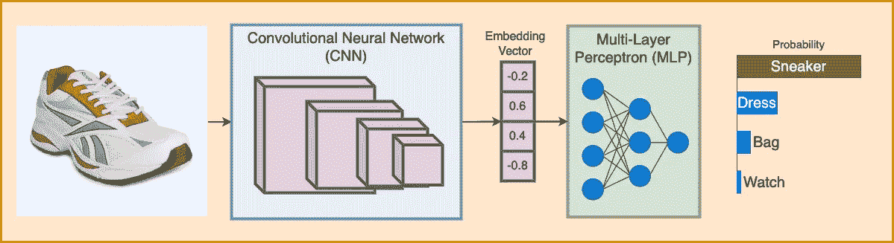

图像分类管道。CNN 将图像转换为嵌入向量。MLP 用这个向量来预测图片的类别。图片作者。

这种方法提供了最先进的精确度，甚至超过了大多数人的能力。在训练了这样的模型之后，我们可以省去 MLP 层，直接将 CNN 编码器的输出作为每个输入图像的嵌入向量。

在现实中，我们不需要为许多现实世界的问题从头训练我们自己的 CNN 模型。相反，我们直接下载并使用已经训练好的模型来识别日常对象，如 [ImageNet](https://paperswithcode.com/dataset/imagenet) 数据集中的那些类别。`Towhee`是一个 python 库，使用这些预先训练好的模型快速生成嵌入。让我们来看看如何做到这一点。

## Towhee 管道

[Towhee](https://hub.towhee.io/) 是一个 python 库，提供了极其易用的嵌入生成管道。我们可以使用 towhee 将一个图像转换成一个嵌入，只需要不到五行的代码！首先，让我们在终端窗口中使用`pip`安装`towhee`。

作者代码

接下来，在 Jupyter 笔记本单元格中，让我们导入库并实例化一个管道对象。

作者代码

接下来，让我们在一行代码中使用管道将图像转换为嵌入内容！嵌入管道的输出有几个额外的维度，我们可以用`np.squeeze`去掉。

作者代码

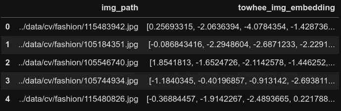

数据帧的前 5 行用于嵌入创建。作者图片

在我们继续之前，让我们创建一个助手函数，它接受嵌入列的名称、用作查询图像的数据框的索引以及要搜索的相似图像的`k`数量。该函数计算查询图像的嵌入和数据帧中所有其他图像的嵌入之间的[余弦相似度](https://scikit-learn.org/stable/modules/metrics.html#cosine-similarity)，以找到顶部`k`最相似的图像并显示它们。

作者代码

我们现在可以通过从数据帧中查询随机图像，并使用上面的辅助函数显示`k`最相似的图像，来测试 towhee 的嵌入质量。如下所示，对于我们运行的每个查询，towhee 嵌入都非常准确，以便从包含几个不同产品(如服装、手表、包和配饰)的整个图像集中找到相似的图片！考虑到我们只用三行代码就生成了这些嵌入，这就更令人印象深刻了！

作者代码

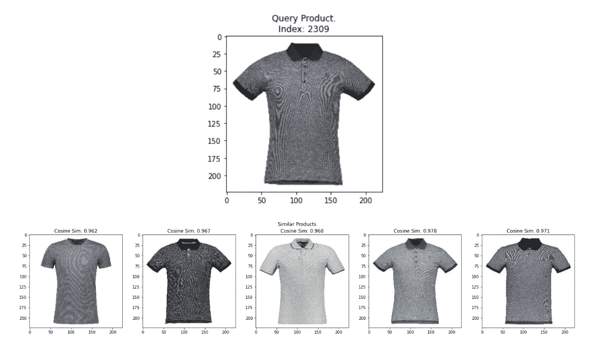

随机查询图片和来自 towhee 嵌入的前 5 个最相似的图片。作者使用具有 GPL 2 许可证的 [Digikala 产品颜色分类数据集](https://www.kaggle.com/masouduut94/digikala-color-classification)中的图像制作图片。

从结果中，我们可以得出结论，towhee 是快速生成相似性搜索应用程序的嵌入的一个很好的起点。然而，我们没有明确地训练这些模型来确保相似的图像具有彼此相同的嵌入。因此，在相似性搜索的上下文中，来自这种模型的嵌入可能不是对所有用例都是最准确的。你现在可能会问的自然问题是，*“有没有一种方法可以训练模型，使得相似的图像具有彼此相似的嵌入？”*谢天谢地，有！

# 用度量学习目标预训练的卷积神经网络

进入[度量学习](https://paperswithcode.com/task/metric-learning?page=6)，这是生成嵌入的最有前途的方法之一，尤其是对于相似性搜索应用。在最基本的层面上，在度量学习中，

1.  我们使用诸如 CNN 或 Transformer 网络之类的神经网络来将图像转换成嵌入。
2.  我们构建这些嵌入，使得语义相似的图像彼此聚集得更近，而不相似的图像则相距更远。

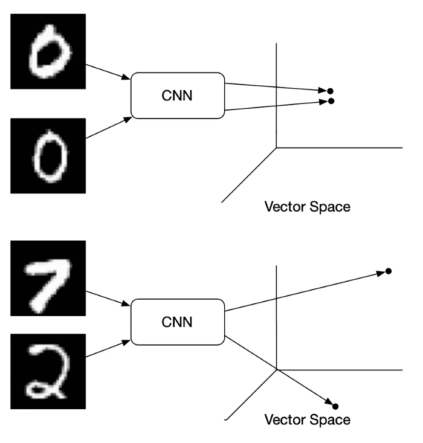

向量空间中的手写数字图像示例。图片来源:[媒体博文](/contrastive-loss-explaned-159f2d4a87ec)作者[布莱恩·威廉斯](https://medium.com/@rantlab?source=post_page-----159f2d4a87ec-----------------------------------)。经允许重新发布。

训练度量学习模型需要数据处理方式和模型训练方式的创新。

1.  **数据:**在度量学习中，对于每个称为“锚”图像的源图像，我们需要至少一个称为“正”的相似图像我们也可以合并一个不同的第三个图像，称为“负”，以改善嵌入表示。在最近针对每个源图像的[度量学习](http://arxiv.org/abs/2002.05709)方法中，我们使用各种数据扩充综合生成一个“锚”和一个“正面”图像，如下图所示。由于两个图像都是同一源图像的变体，因此将它们标记为锚定阳性对是合乎逻辑的。另一方面，我们通过拍摄同一批图像中除“锚”以外的所有图像，合成生成“底片”。
2.  **模型:**度量学习模型大多有一个[连体网络架构](https://www.cs.cmu.edu/~rsalakhu/papers/oneshot1.pdf)。锚定图像、正图像和负图像依次通过相同的模型来生成嵌入，然后我们使用特殊的损失函数来比较这些嵌入。这样的损失函数之一被称为[对比损失](http://yann.lecun.com/exdb/publis/pdf/hadsell-chopra-lecun-06.pdf)，其中模型的目标是将锚图像和正图像的嵌入移动得更近，使得它们之间的距离接近 0。相反，该模型旨在将锚和负嵌入彼此远离，使得它们之间的距离很大。

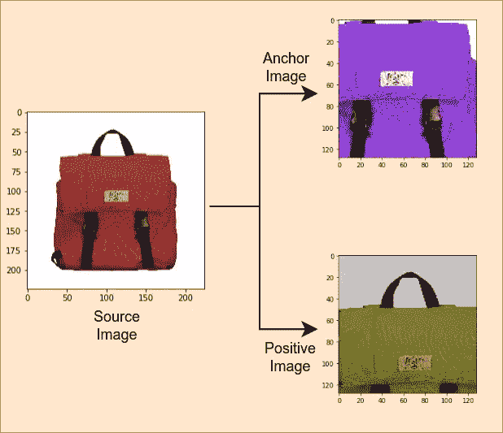

锚点和正片都是同一源图像的增强版本。图片由作者使用具有 GPL 2 许可证的 [Digikala 产品颜色分类数据集](https://www.kaggle.com/masouduut94/digikala-color-classification)中的图片制作。受谷歌人工智能博客的启发

在用这种方法训练模型之后，我们可以通过使用诸如余弦距离之类的度量以数学方式计算它们的嵌入向量之间的距离来找到任意两个图像之间的相似性。如这篇[中型博客文章](/9-distance-measures-in-data-science-918109d069fa)所示，存在几种距离度量，余弦距离常用于比较嵌入。

## SimCLR:简单对比学习

[SimCLR](http://arxiv.org/abs/2002.05709) 代表视觉表征对比学习的简单框架。这是使用一种称为对比学习的度量学习来生成图像嵌入的流行方法之一。在对比学习中，对比损失函数比较两个嵌入是相似的(0)还是不相似的(1)。

SimCLR 的伟大之处在于它是一个简单的自我监督算法(我们不需要图像类的任何标签！)实现了与一些监督方法相当的性能，如下图所示！

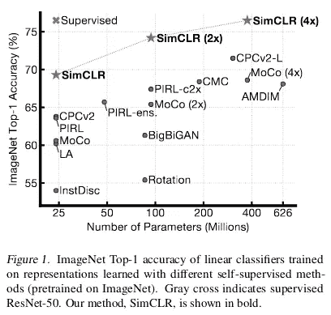

自监督 SimCLR 4X 实现了与完全监督 ResNet50 相似的精度！图片来源:[arxiv.org 的 SimCLR 论文](http://arxiv.org/abs/2002.05709)

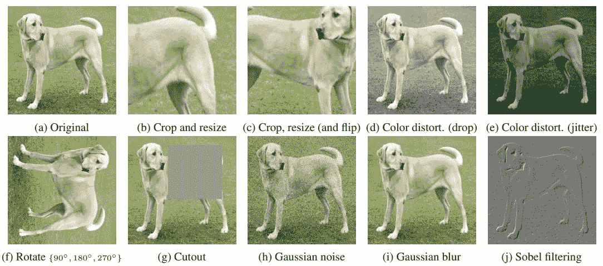

可能的图像数据增强的例子。图片来源:[arxiv.org 的 SimCLR 论文](http://arxiv.org/abs/2002.05709)

SimCLR 的基本思想如下。

1.  给定一幅图像，创建同一幅图像的两个增强版本。这些增强可以是裁剪和调整大小、颜色失真、旋转、添加噪声等。上图展示了一些增强的例子。
2.  一批中所有图像的增强版本通过 CNN 编码器，将图像转换为嵌入内容。这些 CNN 嵌入然后通过一个简单的只有一个隐藏层的多层感知器(MLP)将它们转换到另一个空间。
3.  最后，使用余弦距离对 MLP 输出端的嵌入进行相互比较。该模型期望来自同一图像的增强的余弦距离为 0，而来自不同图像的增强的余弦距离为 1。损失函数然后更新 CNN 和 MLP 的参数，使得嵌入更接近我们的期望。
4.  一旦训练完成，我们不再需要 MLP，直接使用 CNN 编码器的输出作为我们的嵌入。

下图从概念上解释了整个过程。更多细节，请看这篇谷歌[博客文章](https://ai.googleblog.com/2020/04/advancing-self-supervised-and-semi.html)。

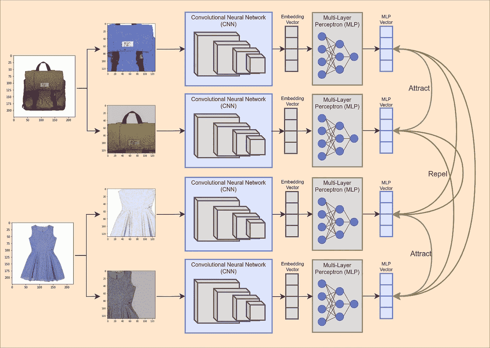

SimCLR 概念性解释。图片由作者使用来自 [Digikala 产品颜色分类数据集](https://www.kaggle.com/masouduut94/digikala-color-classification)的图片，拥有 GPL 2 许可证。受[谷歌人工智能博客](https://ai.googleblog.com/2020/04/advancing-self-supervised-and-semi.html)的启发

作者进行了几次实验，并确定随机裁剪和颜色失真是增强的最佳组合，如下所示。

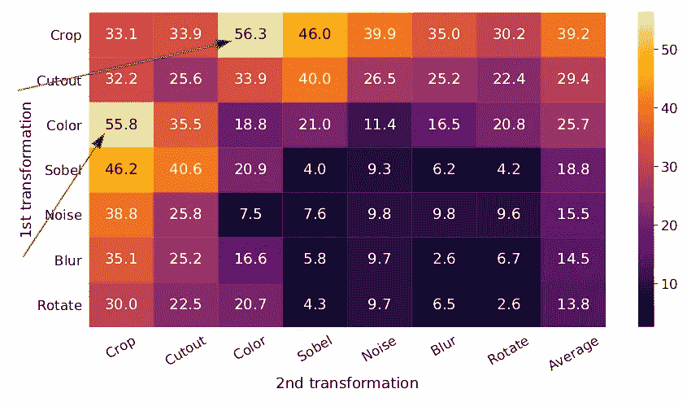

不同数据集扩充的下游模型精度。图片来源:[arxiv.org 的 SimCLR 论文](http://arxiv.org/abs/2002.05709)

像 towhee 一样，我们使用其他研究人员在 ImageNet 上预先训练的模型来直接提取 SimCLR 嵌入。然而，在撰写本文时，为了获得 SimCLR 预训练嵌入，我们需要使用 Pytorch [Lightning Bolts](https://github.com/PyTorchLightning/lightning-bolts) 库编写几行代码。我改编了官方闪电文件[中的以下内容。首先，在终端窗口中使用`pip`安装必要的库。](https://pytorch-lightning-bolts.readthedocs.io/en/latest/self_supervised_models.html)

作者代码

接下来，在 Jupyter 笔记本单元中，让我们导入必要的库，并根据您的计算机是否有 GPU 将设备设置为`cuda`或`cpu`。

作者代码

接下来，让我们加载预先在 ImageNet 上训练的 SimCLR 模型，并将其设置为 eval 模式，因为我们只想从模型中获得嵌入，而不想再训练它。

作者代码

以下两个步骤是 Pytorch 特有的；用于实现模型的基础库。我们首先创建一个数据集，它可以将我们的 dataframe 作为输入，从`img_path`列中读取图像，应用一些转换，最后创建我们可以输入到模型中的批量图像。

作者代码

最后，我们可以迭代 dataloader 中的批处理，为所有图像生成嵌入，并将它们作为一列存储回我们的 dataframe。

作者代码

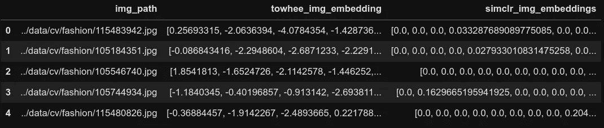

SimCLR 嵌入生成后数据帧的前 5 行。作者图片

现在有趣的部分来了！我们可以用相同的帮助函数测试 SimCLR 嵌入的质量。我们从数据框中查询随机图像并显示`k`最相似的图像。如下所示，SimCLR 嵌入也能准确地为我们运行的每个查询找到相似的图像！

作者代码

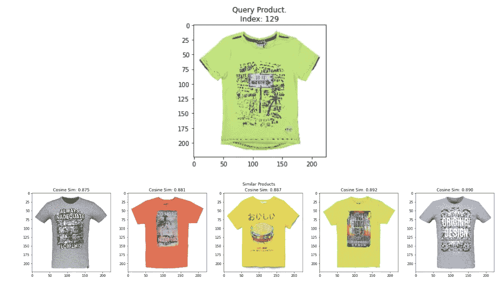

随机查询图像和来自 SimCLR 嵌入的前 5 个最相似的图像。作者使用具有 GPL 2 许可证的 [Digikala 产品颜色分类数据集](https://www.kaggle.com/masouduut94/digikala-color-classification)中的图像制作图片。

# 用度量学习目标预训练的图文多模态神经网络

最后，将图像和文本嵌入到统一嵌入空间的模型有了巨大的改进[ [Open AI 的回形针](https://arxiv.org/abs/2103.00020)， [Google 的 ALIGN Paper](http://arxiv.org/abs/2102.05918) ，[微软的 PixelBERT Paper](http://arxiv.org/abs/2004.00849) ]，这开启了图像到文本和文本到图像相似性搜索的几个优秀应用。这种范式中最流行的模型之一是 [CLIP(对比语言-图像预训练)](https://arxiv.org/abs/2103.00020)。

CLIP 是建立在度量学习框架上的神经网络。CLIP 使用图像作为锚点，相应的文本描述作为正面来构建图像-文本对，而不是在纯粹的图像锚点-正面对上进行训练。我们可以在多种应用中使用 CLIP，包括文本到图像、图像到文本、图像到图像和文本到文本的相似性搜索。

图像通过 ResNet 或 [ViT](http://arxiv.org/abs/2010.11929) 编码器生成图像嵌入。文本描述通过基于转换器的编码器来生成文本嵌入。CLIP 联合训练图像和文本编码器，以便在一批 *N 个*图像-文本对中，嵌入第*个*图像与嵌入第*个*个文本的点积最高，如下图所示。

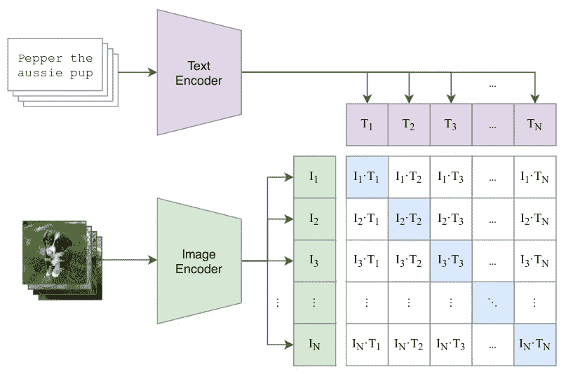

CLIP 的对比预训练。图片来源:[回形针](https://arxiv.org/abs/2103.00020)arxiv.org

训练完成后，我们可以找到与查询图像最相似的文本行，只需将两者转换为各自的嵌入，然后使用点积或余弦距离进行比较，如下图所示。相反，我们也可以用同样的方式搜索给定查询文本的最相似的图像。让我们看看如何在我们的示例问题上实现这一点。

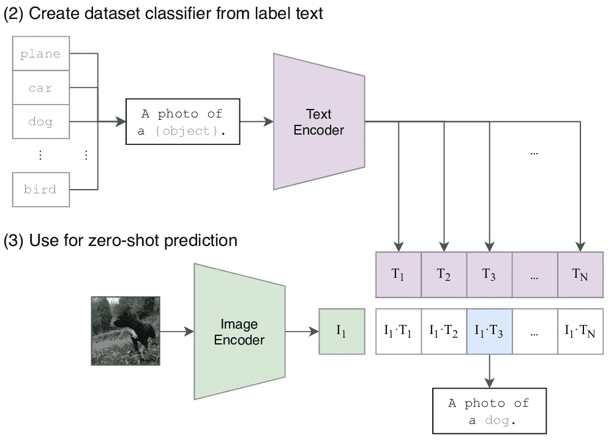

预测期间剪辑。图片来源:[回形针](https://arxiv.org/abs/2103.00020)arxiv.org

## 句子变形金刚

使用优秀的[句子-变形库](https://www.sbert.net/)，在我们的数据上生成剪辑嵌入非常简单。然而，由于操作系统对我们一次可以打开的文件数量的限制，当处理成千上万的图像时，我们需要编写几行样板代码。首先，在终端窗口中使用`pip`安装必要的库。

作者代码

接下来，在 Jupyter 笔记本单元格中，让我们导入库并实例化一个剪辑模型。

作者代码

接下来，我们需要迭代 10K 映像，以绕过操作系统对一次可以打开的文件数量的限制。我们在每次迭代中加载所有图像，并生成剪辑嵌入。

作者代码

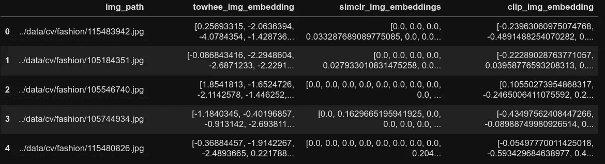

数据帧后剪辑图像嵌入生成的前 5 行。作者图片

现在我们有了所有图像的剪辑嵌入，我们可以使用相同的辅助函数来测试嵌入的质量。我们从数据帧中查询随机图像，并显示`k`个最相似的图像。如下所示，剪辑嵌入也非常准确，可以为我们运行的每个查询找到相似的图像！

作者代码

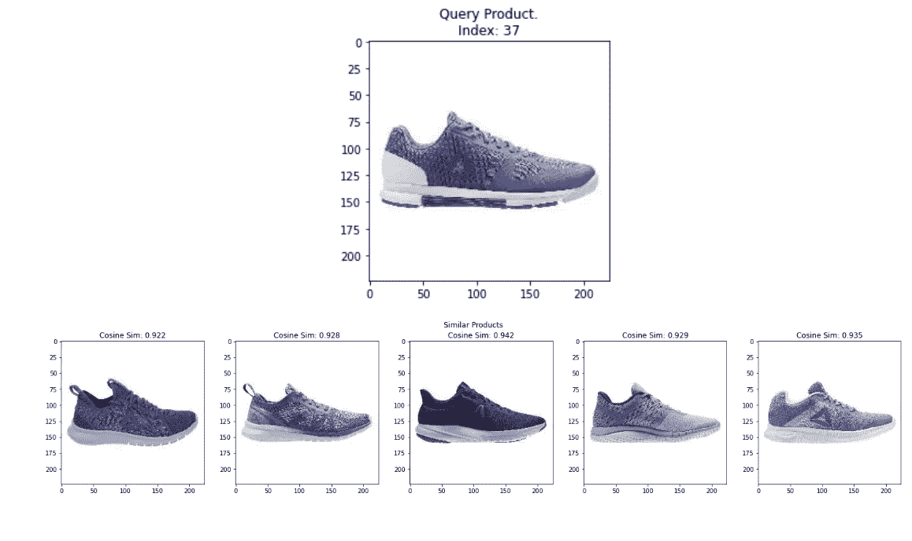

随机查询图像和来自剪辑图像嵌入的前 5 个最相似的图像。图片由作者使用具有 GPL 2 许可证的 [Digikala 产品颜色分类数据集](https://www.kaggle.com/masouduut94/digikala-color-classification)中的图片制作。

虽然我们不得不编写一些额外的代码来生成剪辑嵌入，但它提供的一个显著优势是文本到图像的搜索。换句话说，我们可以搜索匹配给定文本描述的所有图像。下面我们来看看这个。

由于我们已经将图像转换为剪辑嵌入，现在我们只需要将文本查询转换为剪辑嵌入。然后，我们可以通过使用文本嵌入和数据帧中所有图像嵌入之间的余弦相似性来搜索相似产品。我们将编写一个简单的助手函数来为我们完成所有这些工作，如下所示。最后，我们将绘制所有相似的`k`产品图片。

作者代码

现在，我们可以使用助手函数来测试示例文本查询。如下图所示，如果我们的测试查询是“一件女装的照片”，那么最相似的产品都是女装！即使每个产品的标题没有明确指定单词“连衣裙”，剪辑模型也能够仅从文本和图像嵌入中推断出这些图像与查询“一件女装的照片”最相关。继续用其他查询进行尝试吧！

作者代码

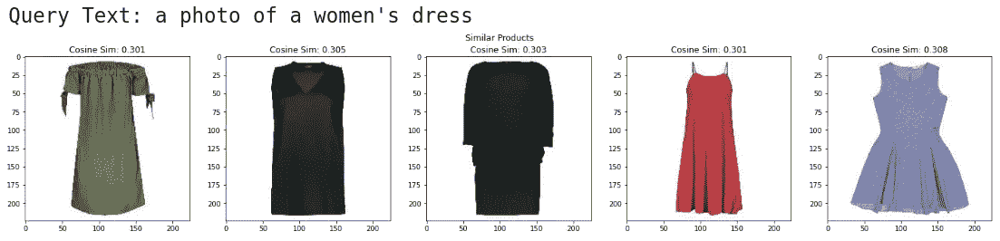

随机查询图像和来自剪辑文本嵌入的前 5 个最相似的图像。图片由作者使用具有 GPL 2 许可证的 [Digikala 产品颜色分类数据集](https://www.kaggle.com/masouduut94/digikala-color-classification)中的图片制作。

# 结论

深度学习研究和开源代码库的当前技术水平已经开辟了许多从图像和文本数据生成高质量嵌入的简单方法。这些现成的嵌入是为许多现实世界的问题构建原型的极好起点！下面的流程图可以帮助选择要使用的初始嵌入。然而，在将任何一个单一的查询部署到生产环境之前，要不断地评估嵌入模型在一些复杂的样本查询上的准确性！

谈到生产，我们在这里使用的数据集是一个只有 6K 图像的玩具数据集。在现实世界的应用程序中，例如电子商务商店，您需要在几分之一秒内嵌入、存储和执行最近邻搜索数亿张产品图像！这个问题的规模需要使用强大的矢量搜索数据库，如 [Milvus](https://milvus.io/) ！你可以在这里了解更多关于矢量数据库[的信息。](https://zilliz.com/learn/what-is-vector-database)

请访问 Zilliz 的[“学习”频道](https://zilliz.com/learn)以获得更多关于嵌入和向量相似性数据库的各种酷应用的灵感！

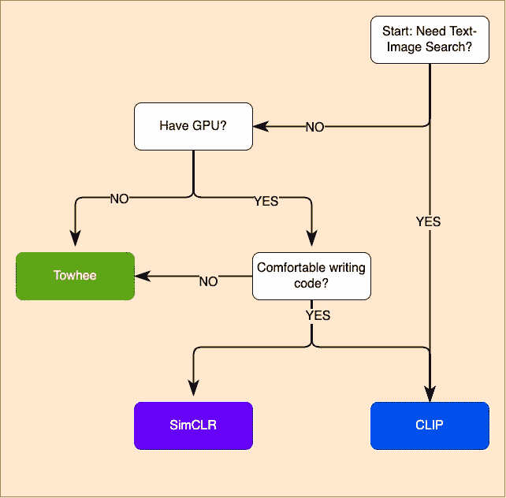

选择嵌入方法。作者图片

*原载于 2022 年 1 月 24 日 https://zilliz.com**[*。*](https://zilliz.com/learn/embedding-generation)*