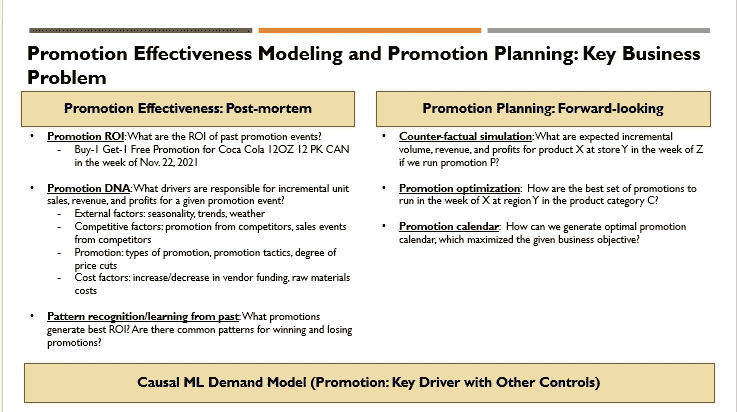
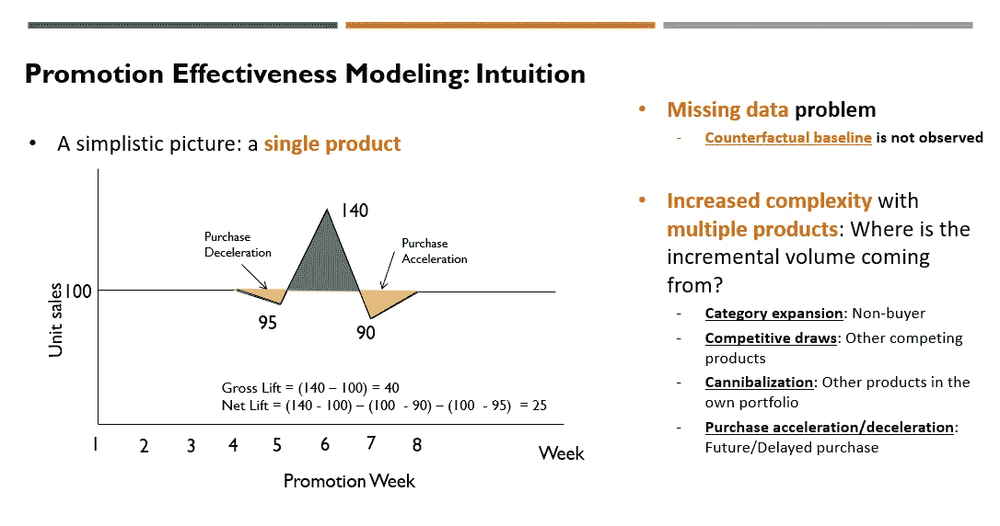
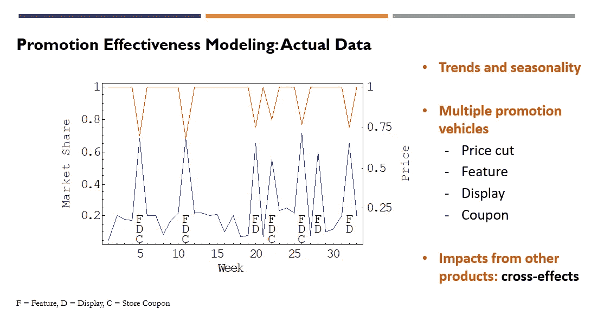

# 实用数据科学:推广有效性和推广计划—第一部分

> 原文：<https://towardsdatascience.com/practical-data-science-promotion-effectiveness-and-promotion-planning-part-1-52f6707a59b9>

## 6 步端到端流程，构建促销效果衡量和规划解决方案

> 业务问题|关键概念|我们为什么要关注？

[卢卡斯·布拉塞克在 Unsplash 上拍摄的照片](https://unsplash.com/photos/mcSDtbWXUZU)

对于机器学习应用来说，找到端到端整体视图的真实世界用例并不容易。许多学术项目提供机器学习算法和建模技术方面的大量培训。然而，预测建模之外的实际方面，如某个 ML 用例需要什么原始数据，创建建模数据集需要什么功能工程，以及开发预测建模后需要什么软件应用程序以确保使用和最终业务用户采用，往往是特定于用例的。因此，在典型的数据科学和机器学习课程中，它们没有被广泛教授。

在关于“实用数据科学”的一系列文章中，我将采用用例方法，并描述预测建模之外的端到端图景。为了实现切实的业务影响，了解业务问题(价值来源)、数据需求和潜在数据源、数据管道、功能工程、预测模型构建后的说明性分析、面向最终用户的软件解决方案的设计以及如何最好地传达结果非常重要。我将从“促销效果和促销计划”开始，作为第一个用例。

在本文中，我将讨论:

(1)业务问题:推广效果和推广策划

(2)关键概念和背景信息

(3)为什么要关心？

# 商业问题:促销效果和促销计划

促销被认为是市场营销中 4p(产品、定价、促销和布局)的关键支柱之一。零售商和制造商都对衡量促销活动的 ROI 和规划未来的促销活动非常感兴趣，以便最好地利用他们的促销资金。促销有效性和促销计划中的关键业务问题可以分为(1)事后分析(即回顾过去):衡量和了解过去促销对业务的影响，以及(2)前瞻性计划:促销哪种产品，何时促销，折扣多少，使用什么促销策略，以及在哪里促销。图 1 总结了这些问题。

图一。图片由[黄敏哈](http://medium.com/@minha.hwang)提供

(1) **推广效果**:回顾(事后分析)

**推广 ROI** :第一个关键的业务问题是关于以往推广活动的绩效衡量。促销需要投资(例如，价格折扣带来的收入损失、打印优惠券的成本和设置过道尽头的展示)。因此，商家自然会考虑他们能从促销中获得什么好处。有了促销，就可以有“增量”单位销售(在没有促销的情况下，超出预期单位销售水平的额外单位销售)。这在概念上听起来很简单，但“增量”单位销售并不能从数据中直接观察到。对于特定产品、商店和日期的促销活动，我们可以看到促销的实际单位销售额。然而，没有观察到相同产品/商店/日期的**反事实结果** — **基准单位销售**(即**无促销单位销售**)。这种缺失数据问题是对具有观察数据的因果推断问题的典型挑战。如果我们能以某种方式衡量“增量”单位销售额(我将在后面描述“如何”)，就可以计算过去特定促销活动的增量收入和利润。一旦我们有了“增量”单位销售额，计算“增量”收入或“增量”利润就相当简单了。通过比较增量利润(即回报)和所需的促销成本(即投资)，我们可以评估促销活动的投资回报率。

**促销 DNA** :一旦从过去的促销活动中测量增量单位销售和 ROI 成为可能，思考为什么某些促销活动做得很好以及为什么其他促销活动没有带来好的 ROI 是非常自然的。驱动因素分析(又称 DNA)将增量单位销售和利润分解为每个驱动因素的贡献，有助于回答为什么某些类型的促销活动比其他活动更有利可图的主要原因。关键驱动因素可以包括以下类型。

*   外部因素:季节性、节假日、趋势、天气、关键外部事件、商店位置、商店人口统计特征、商店周围的竞争强度
*   自己的促销:促销类型(例如，特色、展示、优惠券)、促销策略(例如，买一送一、简单价格折扣、必须买 2)、降价程度(例如，5%折扣、15%折扣)、产品组合中同时促销的其他产品
*   竞争对手因素:竞争对手的促销活动
*   成本因素:原材料成本、促销执行成本、供应商资金(针对零售商)

**模式识别**:在积累了增量单位销售、增量收入、增量利润和过去促销活动的投资回报率以及 2-3 年的潜在驱动因素数据后，也有可能确定成功和失败促销活动的共同模式。从这种分析中得出的见解对未来的促销计划是有用的。

(2) **推广策划**:前瞻性

**反事实模拟(即“假设”分析/情景分析)**:对过去促销活动的绩效评估是一个很好的起点。一旦组织接受了度量方法，并理解了度量的价值和洞察力，他们就想将底层的建模方法应用于未来的推广计划。与已知所有促销驱动因素的以往测量相比，规划增加了对关键驱动因素进行假设的额外复杂性(例如，我们应该对竞争对手的价格和促销进行假设)。将有多个“假设”场景需要测试，这就需要构建一个“促销模拟器”这可以是简单的交互式应用程序(使用 Shiny/R 或 Dash/Python 构建)或企业级软件，具体取决于所需的规模和复杂程度。促销模拟器为给定的促销方案产生预期的增量单位销售、收入、利润和 ROI。具有直观用户界面的促销模拟器也有助于通过模拟引擎将建模结果部署给不太懂技术的最终业务用户。

促销优化:更成熟的零售商和制造商希望超越基于促销模拟器的场景分析。在这种情况下，可以应用规定的数据科学技术(例如优化)来找出特定产品在给定时间、给定地点对整个产品组合的最佳促销。基于优化结果，可以推荐最佳的 N 个促销候选，用于促销计划者的最终审查。

**促销日历**:为了管理不同产品和促销活动随时间的相互依赖性，可以使用包含这些相互依赖性的更复杂的优化技术来支持多种产品随时间发展的促销日历。这也处理购买加速或库存堆积现象。

为了回答关于促销有效性和计划的关键业务问题，我们需要建立的主干是因果计量经济学或机器学习需求模型，该模型将促销活动特征映射到单位销售(即，量)，以及其他控制变量。我将在下一节描述因果机器学习需求模型背后的关键概念。

# 关键概念和背景信息

**(1)关键概念和直觉**:反事实基线的缺失数据问题

如果你试着衡量促销的投资回报率，你很快就会意识到，除非你进行精心设计的实地实验，否则这是不容易做到的。核心问题是我们没有关于反事实结果的数据(没有促销的基线单位销售)，尽管我们确实观察到了特定产品、商店和日期的实际单位销售和促销。因此，我们必须建立一个因果需求模型，将促销作为关键驱动因素之一。此需求模型可用于模拟反事实的基准单位销售，因为您可以关闭给定产品、商店和周的促销活动，并模拟基准单位销售。

图二。图片由[黄敏哈](http://medium.com/@minha.hwang)提供

为了使这个想法更具体，让我们考虑一个商店中单一产品的简单玩具例子。图 2 显示了该产品的单位销售额随时间的变化。通过观察时间序列图，您可以合理地猜测基线单位销售额大约为 100。通过第 6 周的促销活动，单位销售额增加到 140。因此，“增量”单位销售额在第 6 周(即促销周)可能是 140–100 = 40。这叫做总升力。然而，随着时间的推移，替代品和其他产品会带来更多的复杂性。消费者可能会在促销活动前后推迟购买或加快购买，如图 2 中第 5 周和第 7 周的下降所示。净升力(修正购买加速度或减速度后)可以更小:(140–100)—(100–90)-(100–95)= 25(而不是 40)。对于产品组合中的多种产品，您还需要进行调整，因为其他产品的单位销售可能会随着某个重点产品的促销而减少(即同类产品的相互竞争)。

根据量的来源，零售商和制造商对某个促销活动有不同的偏好。如果增量单位销售主要来自非买家(即品类扩张)，零售商和制造商都会很高兴。如果增量单位销售主要来自自己产品组合中的其他产品，制造商和零售商都会不高兴。如果大部分增量单位销售来自其他制造业竞争者(即竞争性吸引)，制造商会很高兴，但零售商可能不会高兴。复杂的因果需求模型也允许用户进行来源量分析。

图 3。图片由[黄敏哈](http://medium.com/@minha.hwang)提供

图 3 显示了酸奶在特定促销数据下的实际市场份额数据。红线显示一段时间内的价格，蓝线显示一段时间内该产品的市场份额。您可以清楚地看到功能、展示、降价和优惠券方面的促销活动(即销售激增)。销售也会减少，这可能是由其他产品的影响或购买加速或减速造成的。最后，可能存在趋势和季节性，如果我们绘制 2-3 年的数据，这更容易识别。

**(2)背景信息**:不同的推广类型

促销可以包括价格折扣和非价格活动。图 4 显示了超市等杂货零售商最典型的促销类型。价格折扣通常用销售标志来表示。它可以是对每个人都一样的销售价格(10%的折扣)，有购买要求的销售价格(买 10 个可以享受 10 美元的折扣)，有针对性的价格折扣(只为某些类型的消费者发放折扣券)。)至于非价格促销活动，可以设置过道末端展示，以吸引消费者的注意力。特写传单可以和报纸一起分发。为了鼓励试用新产品，可以提供免费样品。

图 4。图片由[黄敏哈](http://medium.com/@minha.hwang)提供

# 我们为什么要关心？

我们应该关注数据科学的促销效果和计划，主要有三个原因。

(1)对于消费品公司和零售商来说，贸易促进是一项**大开支项目**。全球的 CPG 公司将收入的 20%投资于促销活动(零售商也是一样)。)然而，59%的促销活动赔钱(美国为 72%)。同类最佳 CPG 促销的回报是最低效促销的 5 倍。

(2)数据和机器学习现在已经足够成熟，可以产生可扩展的影响。由于缺乏专家、定制模型和计算资源限制，这曾经是一个利基领域。随着计量经济学或因果机器学习模型的开源包(例如，用于线性混合效应建模的 PyStan 或 lme4，可解释的增强机器)与云计算基础设施一起，该方法现在更容易使用。事实上，大型数据科学咨询公司正在将此作为关键服务线，并制造 SaaS 产品。

(3)存在巨大影响的可能性。如果以前没有用数据测量价格弹性，价格弹性模型可以通过调整常规价格水平使收入或利润增加 1~2%。通过优化促销，促销效果测量和促销计划可以使收入或利润额外增加 1~2%。请注意，相同的基本因果需求建模既可以用于促销用例，也可以用于定价用例。

在接下来的文章中，我将描述(1)一个 6 步端到端的过程，以建立推广效果的衡量和规划解决方案，以及(2)如何建立一个数据基础的推广建模(原始数据的要求和如何准备建模数据集。)

参考:[分析如何推动消费品贸易促进的增长](https://www.dropbox.com/s/k4tokc99zhwewug/How-analytics-can-drive-growth-in-consumer-packaged-goods-trade-promotions.pdf?dl=0),《麦肯锡季刊》，2019 年 10 月(黄敏哈、瑞恩·墨菲和阿卜杜勒·瓦哈布·谢赫)