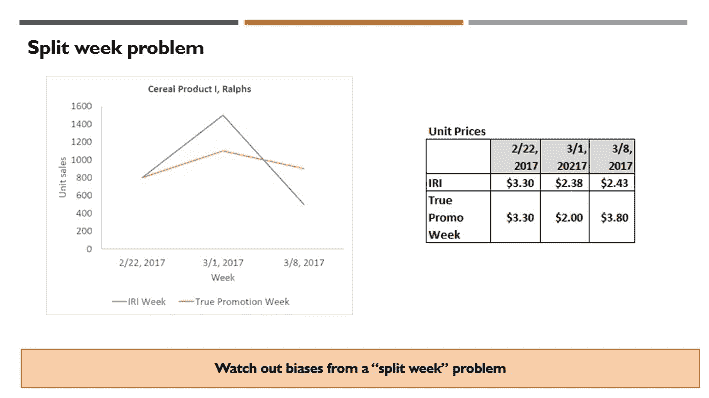
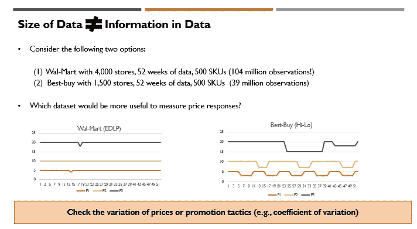

# 实用数据科学:推广有效性和推广计划——第三部分

> 原文：<https://towardsdatascience.com/practical-data-science-promotion-effectiveness-and-promotion-planning-part-3-7207deeacc49>

## 6 步流程|步骤 2-准备建模数据集(1/2)

Aexander Sinn 在 [Unsplash](https://unsplash.com/photos/KgLtFCgfC28) 上拍摄的照片

欢迎回到推广效果衡量和推广策划系列文章！在第 2 部分中，我讨论了整个流程的**步骤 1**:**(1)构建数据基础**。今天继续讨论下一步— **第二步:(2)准备建模数据集**。

如果您错过了前面的文章，下面显示了本系列第 1 部分和第 2 部分的链接。

[实用数据科学:推广有效性和推广计划—第 1 部分| Minha Hwang |迈向数据科学](/practical-data-science-promotion-effectiveness-and-promotion-planning-part-1-52f6707a59b9)

[实用数据科学:推广有效性和推广计划—第二部分| Minha Hwang | 2022 年 11 月|迈向数据科学](/practical-data-science-promotion-effectiveness-and-promotion-planning-part-2-f54e9454a151)

**第二步:准备建模数据集**

在中央数据存储库中收集的用于促销有效性建模的基础数据的粒度低于所需的建模数据集。因此，我们需要**在建模粒度的层次上正确地聚集数据**。这种设计:较低粒度的基础数据集和较高粒度的建模数据集，旨在确保在建模数据集准备阶段选择建模粒度和特征工程的灵活性。总有可能汇总数据，但一旦进行汇总，我们就无法分解数据。

除了**聚合**之外，我们还需要创建**新的数据列(即新特性)**，这些列**符合建模规范**。因此，从基础数据到建模数据集需要**聚合、**过滤和**特征工程**。该步骤包括(1) **数据质量检查**，例如异常值分析和汇总统计，以及视觉检查，(2) **(商店)聚类分析**(如果之前没有定义**促销区**或**定价区**)，(3) **数据过滤**和**聚合** , (4) **特征工程**创建派生列，以及(5) **建模后数据集检查**在详细描述这些之前，我总结了建模数据集的设计考虑事项

1.  **建模颗粒(适当的聚集)**

有 3 个主要维度定义了建模粒度的聚集级别。我在下面描述了推荐的选择。

**(1)时间—** 日对周:周数据是业内很常见的选择，但我会推荐**日数据**。每周数据会很好地工作，并有助于低销售速度产品的建模。然而，如果不小心的话，这可能会产生“聚合偏差”。这在多市场零售商或全国性制造商中更为常见。多市场零售商(如 Kroger)通常会随着并购而增长，而本地连锁横幅往往会坚持不同的促销日历。当某些本地市场链的促销日历周(例如，周三至周二)与公共数据库周(例如，周日至周六)不对齐时，使用每周 POS 数据会导致对促销 ROI 和价格弹性的有偏见的估计(通常被低估)。这在图 1 中通过将具有分裂周问题的典型 IRI 或 AC Nielsen 数据与真实数据(从另一个具有适当促销周定义的每日数据集聚集而成)进行比较来直观地展示。)

我们称这种数据聚集偏差问题为“分割周”问题，因为真实的促销周数据被人为地分割成两个数据库周。上面的图 1 显示了南加州 Ralphs 连锁店谷类产品类别的实际消毒数据。我们将 IRI 的单位销售和价格数据(即错位数据)与促销周一致的数据(代表来自 [Kroger: 84.51](https://www.8451.com/) 的正确汇总数据)进行比较:由于 Kroger 84.51 数据不可用于研究，我们在本例中使用家庭面板数据为两者创建了代理。然而，这是基于多个咨询项目的经验。)随着促销周数据与非促销周数据的混合，促销高峰量在 IRI 数据中被低估。相比之下，非促销销售(促销周之后的一周)在 IRI 数据中被夸大了。在 IRI 的数据中，净价在促销周被高估，在非促销周被低估。这些模式通常会导致促销投资回报率的低估和价格弹性的向下偏差。更有甚者，如图 1 所示，来自 IRI 或 AC Nielsen 数据的净价与存在“分割周”问题的账户中的实际常规价格或促销价格不太一致。

图 1:图片由[黄敏哈](http://medium.com/@minha.hwang)拍摄

此外，每日交易最近变得更加普遍，这导致了部分周促销。每日数据周将更能抵御每日交易的汇总偏差。如果您与零售商或制造商合作，他们只有一个促销周定义，没有每日交易，那么每周数据适合作为时间颗粒。

**(2)产品—** 品牌、UPC 与品牌包装:大多数关于促销建模的学术研究使用品牌作为分析的层次([UPC 扫描仪数据的商业使用:行业和学术视角](https://www.dropbox.com/search/personal?path=%2FLiterature+Review%2FPromotion&preview=id%3A0xzY4vlJbpAAAAAAAAAWrA&query=UPC&search_session_id=78914448469966213076904789298252&search_token=vPfk2UYDpwl%2B7mTz6ndaCgBhirexPjn80GAvfMR1IOo%3D)，营销科学，1999)。这部分是由于 2000 年初推广建模在营销科学中流行时计算能力有限。然而，您必须管理和衡量的真正产品是在 UPC 级别。因此， **UPC** 作为产品的颗粒是更自然的选择。此外，你可以发现价格弹性确实会因同一品牌内不同的包装尺寸(例如，2L 瓶与 12 盎司 12 包罐)和口味(例如，普通与低热量)而变化。对于某些产品类别，产品线定价是常见的，其中同一产品线内的所有 UPC 具有相同的常规价格和促销价格。只要价格和非价格营销支持是常见的，就可以将 UPC 聚合到更高的水平。例如，对于软饮料类别，当**包装尺寸**相同时，所有不同口味的 UPC(可口可乐健怡、可口可乐普通)的普通价格和促销价格保持相同。在这种情况下，品牌/包装尺寸合计可能是合适的。

**(3)位置—** 商店与区域:这里最简单的选择是使用“商店”作为一个词，因为一个商店应该有相同的促销活动。这也让您可以灵活地在商店层面定制促销或定价。另一方面，商店级别的产品单位销售非常嘈杂(尤其是每天或每周经常零销售的尾部 UPC)。因此，在大多数情况下，只要促销在地理单元内是同质的，就优选将商店级数据聚集到更高的地理单元。同样，如果你不小心用不同的促销时间表聚集商店，会导致聚集偏差，这将扭曲促销 ROI 测量和价格弹性估计([使用市场级数据来理解非线性模型中的促销效果，](https://www.dropbox.com/home/Literature%20Review/Aggregation%20Bias?preview=Using+Market+Level+Data+to+Understand+Promotion+Effects+in+a+Nonlinear+Model.pdf)市场研究杂志，1997)大多数多市场零售商为商店分配促销区(和价格区)。在相同的促销区域内，促销价格是相同的。同样，在同一价格区内，正常价格也是一样的。定价部门(负责常规价格)通常与促销部门(负责促销价格)分开，因此可以观察到定价区和促销区的差异。理想情况下，一个共同的区域，无论是正常价格/促销价格是首选，但你可以不时的差异。因此，您可以使用(1)促销区域作为建模粒度(如果定价/促销区域相同)，或者(2)定价/促销区域组合作为建模粒度(如果定价区域与促销区域不同)。)这将确保您可以避免“聚合”偏差，并使数据更加稳健，因为商店/产品级别的随机噪声将与更高级别的聚合相抵消。完成数据汇总后，比较汇总前后的总体汇总统计数据(例如，独特天数、独特产品数量、总收入、总单位销售额)非常重要，以确保没有重大数据丢失或 SQL 编码错误。它还有助于绘制时间序列，以确保数据中没有不规则的异常。在下一篇文章中，我将通过实际的 POS 数据和代码示例使这一点更加具体。

**2。数据过滤**

对于 POS 数据这样的业务数据集，出现**异常值**是很常见的。因此，需要执行异常值检测(基于具有预先指定阈值的典型异常检测算法)来滤除异常值，这些异常值很可能是基于不正确的数据条目。一些 UPC 是失败的产品，几乎没有真正的销售。这些 UPC 增加了噪音，实际上与业务无关。因此，通常应用单位销售阈值来过滤掉**销售水平**非常低的 UPC。上一季的某些 UPC 只能有 1 或 2 个库存，这实际上也是无关紧要的。您也可以通过检查单位销售的周数来过滤掉这些 UPC。在使用几个标准进行筛选后，您可以检查保持了多少%的收入或(等价的)单位销售额，以确保您没有过多地筛选数据。通常情况下，经过适当的数据过滤后，95% — 99%的收入将得以保持。在下一篇文章中，我将使用实际的 POS 数据和 Python 代码示例演示过滤。

**3。特征工程(衍生栏目)**

除了聚合和筛选之外，建模数据集生成的一个主要任务是创建派生的特征列，这些特征列被映射到因果需求模型规范。下面显示的是您需要为作为玩具示例的最简单模型创建的典型列。

(1) **主键** : UPC，日，促销区 ID

(2) **数量(以当量单位计)**:单位销售额 x 数量当量

(3) **自有价格**:焦点 UPC 的单价

(4) **促销战术**:初始分类变量(必买 2、买 1 送 1、%折扣、绝对美元折扣等。)这将是一个热编码，为每种促销策略类型创建单独的虚拟变量。

(5) **非价格促销**:特色指标(0/1)，展示级别(高/中/低)，优惠券指标(0/1)。二进制指示器是最简单的。如果需要更细致的测量，可以将封面从内页和封底分开。显示器上的情况(即连续变量)可以用来代替显示级别。众所周知，周日的头版特写更有效，尤其是大尺寸的产品广告。然而，这将花费更多。

(6) **竞品价格**:理想情况下，你要弄清楚哪些套的产品被认为是相似的，并把这些产品的价格，这些价格会随着 focal UPC 的变化而变化。然而，这是很困难的，除非你有其他数据集，提供产品相似性的信息。产品相似性数据可以来自零售商忠诚卡的产品转换数据、家庭面板数据集(例如 Nielsen Homescan)、亚马逊搜索数据或产品描述的文本挖掘。由于自身价格弹性(平均为-2.5)比交叉价格弹性(来自竞争产品价格变化的影响，0.1 ~ 0.3)大一个数量级，因此在初始促销建模过程中，只控制总价格指数中的竞争价格就可以了。在排除焦点产品之后，可以通过计算(同一子类别中产品的收入)/(同一子类别中产品的单位销售)来计算总竞争价格指数。使用恒定权重更健壮，但是如果您想保持简单，这种简单的加权也很好。对于大规模应用，如果对最终结果的影响很小而计算成本很大(即工程决策)，有时可以有意避免更严格的计算方式。)然而，这确实需要仔细的测试，以确保鲁棒性的潜在损失是小的和可管理的。

(7) **每周虚拟变量**:为了恰当地控制每周的季节性，我们还可以包含一次性编码的每周虚拟变量。在类别(或子类别级别)指定这一点可以平衡变量数量和建模灵活性

(8) **工作日指标**:如果你使用的是每日数据，那么包含工作日指标(如周一、周二和周日)是一个不错的主意，可以捕捉工作日不同的购物模式。

(9) **趋势变量**:有潜在趋势是相当常见的。你能做的最简单的事情是包括周数变量及其多项式(例如，周数，周数的平方。)也可以应用黄土过程或霍尔特-温特斯过程(即指数平滑)来分解价格控制后的季节性和趋势，作为预处理。

(10) **成本**:为了计算促销 ROI，产品的成本(即，零售商的批发价，或制造商的 COGS)和促销成本应包括在建模数据集中。

(11) **对数转换**:在实践中工作良好的最简单的工作马模型是混合效应对数-对数需求模型。该模型使用 log(等量单位销售量)作为因变量，log(单价)和价格变量。因此，您需要将对数转换应用于价格和单位销售变量。)

(12) **(可选)产品属性**:如果您可以访问产品属性数据(例如，IRI 的产品存根文件)，并清楚地知道什么是重要的产品属性，您也可以包括产品属性。这将允许您对新产品进行预测，只要新产品可以表示为现有产品属性的组合，这些新产品以前从未销售过。包括产品属性也会让你知道什么产品属性更受欢迎，什么不太受欢迎。

**4。要注意什么**

(1) **检查价格变化**:一个常见的错误是将数据记录的大小等同于数据集的丰富程度。对于价格和促销建模，更重要的是，对于大部分产品来说，随着时间的推移，你是否有良好的价格变化(在同一 UPC/商店内)。在图 2 的例子中，沃尔玛有一个更大的数据集，但是由于频繁的价格变化，Best-buy 数据集会更有用。您可以计算的一个有用的汇总统计数据是价格的变异系数(即相对标准偏差:平均值/标准偏差 X 100%)。在一个极端的例子中，在一元店的 15，000 种产品中，只有 300 种产品的价格有意义的变化，这对我的一个咨询项目中的价格建模有用。

图 2:图片由[黄敏哈](http://medium.com/@minha.hwang)拍摄

(2) **保证足够的历史**:季节性和趋势性很常见。要正确控制它们，你需要至少 2-3 年的数据。Covid 导致了结构性突变，这使得利用最近的数据来识别季节性变得更加困难。

(3) **聚集偏差**:在上面关于建模颗粒的讨论中，你可能已经注意到中心主题是避免“聚集”偏差。只要促销条件相同，就可以进行汇总。然而，如果你开始汇总不同促销条件下的数据，你就开始诱发偏差(通常是沿着低估价格弹性的方向)。)

(4) **仅横截面**:可以请求仅使用横截面数据(单个时间段的多个地理单元/产品)进行因果促销需求建模。这将非常困难，需要特殊的建模技术(如空间计量经济学)和强有力的假设。数据中最有用的(因果)价格变化来自产品/商店内部的时间变化。没有足够历史记录的多种价格变化，就不可能恰当地衡量促销投资回报率或价格弹性。

(5) **与建模选择的依赖**:模型规格说明和建模数据集创建之间有很强的依赖性。因此，明确您将尝试什么样的模型规范，并对要创建的潜在特性列更加包容，这一点非常重要。如果没有适当的规划，您可能不得不返回到建模数据集的创建并重新进行这项工作。如果您必须进行数据融合，并将数据集与不同级别的数据(例如，来自积分卡数据+商店级 POS 数据的产品相似性)相结合，这可能会更加困难。)

在下一篇文章中，我将通过利用公共 POS 数据( [Dominick 的数据集](https://www.chicagobooth.edu/research/kilts/datasets/dominicks)，芝加哥大学市场营销中心的 Kilts)和 SQL / Python 代码样本，使这些想法更加具体。

**注**

在 1999 年左右，推广建模被认为是学术界中一个基本解决的问题。除了将因果需求建模方法从对数-对数模型改为总体离散选择模型之外，关于促销的学术研究最近不太活跃。相比之下，美国各大咨询公司在 2014 年左右才开始大规模采用推广 ROI 测量和推广建模作为解决方案。这些模型以前已经实施过，但是范围有限:只有少数零售商或制造商(例如 CVS、Proctor & Gamble。)随着计算能力的提高和更多的数据教育(滞后 10-20 年),这是从学术界到行业采用新方法的一种非常常见的模式。)现实情况是，如果你试图大规模实现推广建模，它远不是一个已解决的问题。因果 ML 需求建模与促销优化之间的联系在学术界和实践中都没有得到广泛研究。

**参考**

1.  8451:克罗格提供的第一方零售数据平台。包括商店级 POS 数据集和来自优惠卡的汇总汇总，[https://www.8451.com/](https://www.8451.com/)
2.  Randolph E. Bucklin 和 Sunil Gupta，[UPC 扫描仪数据的商业使用:行业和学术观点](https://www.dropbox.com/search/personal?path=%2FLiterature+Review%2FPromotion&preview=id%3A0xzY4vlJbpAAAAAAAAAWrA&query=UPC&search_session_id=78914448469966213076904789298252&search_token=vPfk2UYDpwl%2B7mTz6ndaCgBhirexPjn80GAvfMR1IOo%3D)，营销科学，1999 年
3.  Markus Christen，Sachin Gupta，John C. Porter，Richard Staelin 和 Dick R. Wittink，[使用市场水平数据理解非线性模型中的促销效果，](https://www.dropbox.com/home/Literature%20Review/Aggregation%20Bias?preview=Using+Market+Level+Data+to+Understand+Promotion+Effects+in+a+Nonlinear+Model.pdf)市场研究杂志，1997 年
4.  [多明尼克的数据集](https://www.chicagobooth.edu/research/kilts/datasets/dominicks)，苏格兰裙营销中心，芝加哥大学