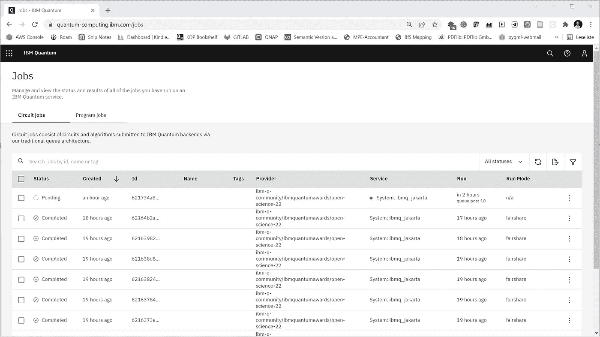

# 真实量子计算机上的实用误差抑制

> 原文：<https://towardsdatascience.com/practical-error-mitigation-on-a-real-quantum-computer-41a99dddf740>

## 使用 Clifford 数据回归方法

量子机器学习要不要入门？看看 [**动手量子机器学习用 Python**](https://www.pyqml.com/page?ref=medium_realmitiq&dest=/) **。**

量子计算机天生不可靠。它们容易出错，从而破坏任何有意义的计算。由于我们目前的设备太小，无法纠正错误，我们今天能做的最好的事情就是减少它们的影响。


作者图片

不出所料，量子误差缓解的研究是一个重要的关注点。一个最近的和有希望的误差减轻方法是 Clifford 数据回归(CDR)。P. Czarnik 等人在《Clifford 量子电路数据的误差缓解》中提出了这一点，Quantum 5，592 (2021) 。在这种方法中，我们创建了一个机器学习模型，通过使用来自经典模拟的量子电路的数据，我们可以使用该模型来预测和减轻噪声。

在之前的[帖子](https://pyqml.medium.com/mitigating-quantum-errors-using-clifford-data-regression-98ab663bf4c6)中，我们已经看过了(CDR)。此外，我们使用开源库 Mitiq 在另一篇文章的[中的一个示例量子电路上应用了这种方法。为此，我们在量子模拟器中加入了噪声。然而，噪音是相当普遍的，所以很难对这种方法的有效性得出任何结论。](/how-to-implement-quantum-error-mitigation-with-qiskit-and-mitiq-e2f6a933619c)

因此，在这篇文章中，我们修改了我们的代码，以使用一个真实的量子设备。

我们从连接到我们的 IBMQ 帐户开始。在下面的清单中，用实际的 API 令牌替换`TOKEN`。如果你还没有，这篇文章解释了如何开始使用 IBM Quantum 以及如何获得 API 令牌。

在真正的量子计算机上运行代码是一项耗时的工作。IBM 允许公众访问他们的设备，所以我们不是唯一运行我们代码的人。一旦你发送了一个电路，它在被执行之前会在队列中等待很长一段时间。

所以，让我们插入一个中间步骤，创建一个更真实的量子模拟。为此，我们不制作定制的噪声模型，而是从真实的量子器件中获取。

如果你关注我的每周帖子，你会知道我们正在努力参与 IBM 的[量子开放科学奖](https://research.ibm.com/blog/quantum-open-science-prize)。他们希望我们在他们的 7 量子位 Jakarta 设备上使用 Trotterization 模拟一个三粒子系统的海森堡模型哈密顿量。所以，我今天就用这个设备。如果您尚未注册参加此次挑战，您将无权使用此设备。在这种情况下，我建议也使用我们在[这篇文章](/how-to-run-code-on-a-real-quantum-computer-c1fc61ff5b4)中使用的 Quito 系统。

下面的清单显示了如何从现有硬件加载噪声模型。

首先，我们需要获得一个允许我们访问后端的提供者(您需要使用不同的参数值来连接到`ibmq_quito`)。

在这个中间步骤中，我们使用后端作为`NoiseModel.from_backend`的输入。结果是一个有效的 Qiskit 噪声模型，我们可以将其输入到量子模拟器中。

在我们的例子中，我们将噪声模型提供给从`mitiq`导入的`execute_with_shots_and_noise`函数。我们创建一个函数(`sim_jakarta`)，它采用一个量子电路并产生最终的期望值。我们使用与[上一篇](/how-to-implement-quantum-error-mitigation-with-qiskit-and-mitiq-e2f6a933619c)相同的可观察值。

我们可以直接用这个函数来获得我们的可观测值的期望值。请注意，结果值会受到噪声的影响。我们看到它与理想的测量值有很大的不同。

```
ideal_measurement =  1.0599428216452071
unmitigated_measurement =  0.8542528961820239
```

在上面的代码中，我们使用了前一篇文章中介绍的另外两个函数。为了完整起见，这些是创建量子电路的`get_circuit`和无噪声模拟器`sim`。

我们现在已经准备好使用模拟的雅加达后端运行完整的 CDR。与前一个应用程序的唯一区别是，我们使用`sim_jakarta`函数作为噪声执行器参数。

```
mitigated_measurement =  1.0895031224814202
```

将减少误差的结果与未减少误差的结果进行比较，误差减少了近 90%。这与我们在一般噪声模型中看到的改进相当。

```
Error (unmitigated): 0.2056899254631832
Error (mitigated with CDR): 0.029560300836213083
Relative error (unmitigated): 0.19405756731662027
Relative error (mitigated with CDR): 0.027888580622047698
Error reduction with CDR: 85.6%.
```

现在，让我们直接接触真正的量子设备。问题是如何将调用集成到真正的后端。将量子电路发送到真实设备相对容易。无论如何，让我们检查它是否工作。

我们创造了一个简单的量子电路，它由一个量子位和一个哈达玛门组成。使用模拟器的不同之处在于以下两个步骤。在将电路输入后端的`run`方法之前，我们需要传输和组装电路。一旦运行了这段代码，登录到 [IBM 量子控制台](https://quantum-computing.ibm.com/)是个好主意。

在那里，打开“作业”页面，查看您的所有作业及其状态。在我的情况下，我必须等待大约两个小时才能运行作业。



接下来，我们需要编写一个不是模拟器而是连接到真实量子设备的执行器。到目前为止，我们已经使用了从 Mitiq 的 Qiskit 接口导入的`execute_with_noise_and_shots`函数。让我们看看这个函数，看看它是如何运行电路的。您可以在[公共存储库](https://github.com/unitaryfund/mitiq/blob/master/mitiq/interface/mitiq_qiskit/qiskit_utils.py)中找到源代码。

在第 166 行，你可以看到它是如何运行量子电路的。

```
*# execution of the experiment*
job **=** qiskit.execute(
    circ,
    backend**=**qiskit.Aer.get_backend("aer_simulator"),
    backend_options**=**{"method": "density_matrix"},
    noise_model**=**noise_model,
    *# we want all gates to be actually applied,*
    *# so we skip any circuit optimization*
    basis_gates**=**basis_gates,
    optimization_level**=**0,
    shots**=**shots,
    seed_simulator**=**seed,
)
counts **=** job.result().get_counts()
```

他们使用 Qiskit 的 execute 函数并获得一个`job`对象。这与我们在真实设备上运行电路时得到的是同一个对象。见[我之前的帖子](/how-to-run-code-on-a-real-quantum-computer-c1fc61ff5b4)。

因此，让我们重新编写这个函数，不运行本地 Qiskit `execute`，而是在真实的量子设备后端传输、组装和运行电路。

我们删除了参数`noise`和`seed`，因为我们不再使用模拟。此外，我们用上面提到的过程替换了`qiskit.execute`调用。函数的其余部分保持不变。

此外，我们编写另一个函数`real_jakarta`,它采用量子电路并返回计算出的期望值。它的工作原理类似于以前使用的模拟器。因此，让我们用它来运行电路，并计算未优化的测量值。

```
real unmitigated_measurement =  0.17124424416552098
```

最后，我们可以使用真正的 Jakarta 后端运行 CDR。当您启动它时，请考虑 CDR 运行几个回路来训练模型。如果每次执行需要等待两个小时，那么计算所有电路将需要一整天。

因此，在所有这些等待时间之后，结果显示 CDR 减少了由噪声引起的几乎 90%的误差。这些结果与模拟结果相当。

今天，我们了解到修改 Mitiq 代码以与真正的 Jakarta 设备一起工作是非常简单的。

量子机器学习要不要入门？看看 [**动手量子机器学习用 Python**](https://www.pyqml.com/page?ref=medium_realmitiq&dest=/) **。**


在这里免费获得前三章。