# 使用 Azure 机器学习的实用联邦学习

> 原文：<https://towardsdatascience.com/practical-federated-learning-with-azure-machine-learning-8807f9bd1a7e>

## 不共享数据的协作机器学习

由[哈姆克·阿尔克马德](https://www.linkedin.com/in/harmke-alkemade/)和[安德里亚斯·科普](https://www.linkedin.com/in/andreas-kopp-1947183/)

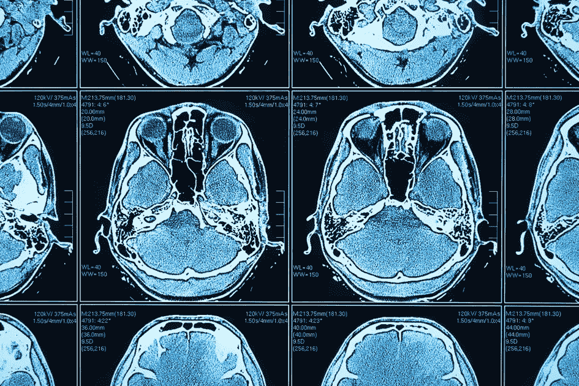

医学图像的联合学习(来源:Shutterstock)

2021 年 12 月，我们发布了几项资产，以支持使用 Azure 机器学习的[医学成像。巨大的兴趣和众多的询问让我们非常惊讶。它再次表明，人工智能应用在医疗实践中变得越来越重要。](/medical-imaging-with-azure-machine-learning-b5acfd772dd5)

通过联合学习，我们今天向我们的产品组合引入了一个令人兴奋的新成员，这对医疗保健行业内外保护数据和知识产权具有重大意义。

下图概述了我们的演示用例，包括我们最新添加的联合学习。

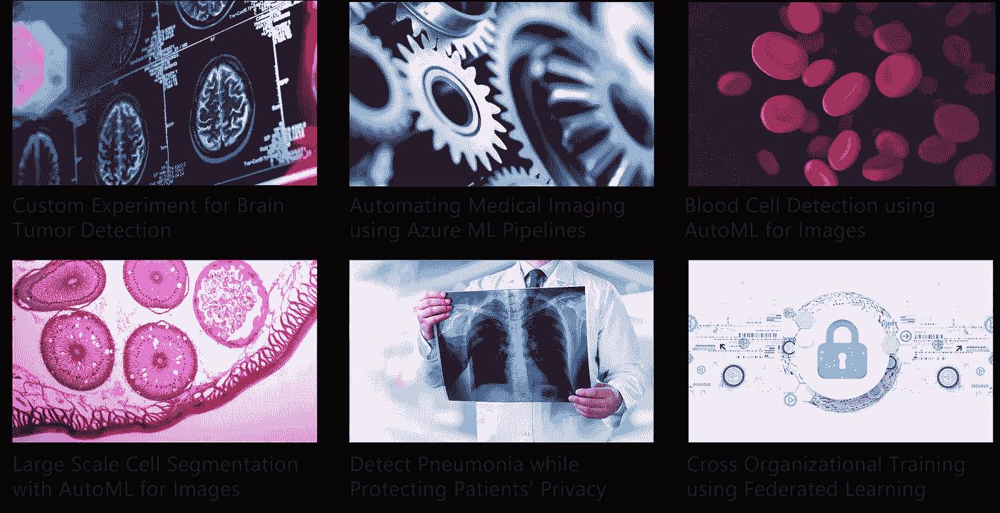

医学影像存储库用例

在演示场景中，您可以与美国、欧洲和亚洲的模拟参与医院一起构建一个全球联合学习场景，以开发一个用于在 X 射线图像中检测肺炎的通用 ML 模型。在本文中，我们描述了联邦学习的概念基础，并介绍了演示的关键要素。

查看[库](https://github.com/Azure/medical-imaging)以尝试这个用例或其他场景，并根据您自己的业务场景进行调整。

# 联邦学习概念

可推广的深度学习模型的关键成功因素是广泛和异构训练数据的可用性。可靠的癌症检测模型应该基于成千上万的医学图像来训练，这些医学图像显示健康组织和肿瘤的对比。这也应该代表患者的性别、年龄和其他人口统计学特征的真实世界范围。此外，不同成像技术所产生的视觉特征也应该表现出来。所需的各种代表性根本不是一个单一机构能够涵盖的。在罕见疾病的情况下尤其如此，在这种情况下，一个组织中只有几个数据点可用。

因此，许多不同的医院贡献他们自己的数据的合作 ML 开发是显而易见的。不幸的是，由于数据保护问题，这在实践中经常失败，因为在大多数国家，患者数据受到严格的数据保护法的管制(理由充分)。

联合学习通过允许多方协作训练机器学习模型而无需共享数据来解决这一问题，如下图所示:

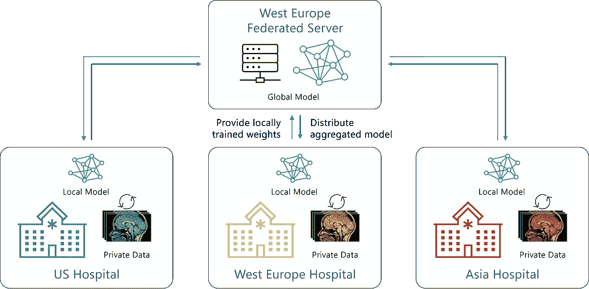

联邦学习概念

虽然对等拓扑在联合学习中是可能的，但大多数实现使用中央服务器来进行模型参数聚合和流程编排。

联合学习的关键特征是参与者的本地数据从不共享。每个客户定期收到全球模型的副本，并使用本地数据进行本地培训。唯一共享的信息是从训练中获得的“见解”，即模型参数更新。服务器的一个任务是将所有参与客户端的权重聚集到新的模型版本中。然后，更新后的模型被重新分发给客户端，以启动下一轮联合训练。重复这个过程，直到模型收敛。通过利用参与客户在生产阶段获得的新数据点，它还可用于持续培训。

下图说明了基于服务器的模型的一轮培训的工作流程:

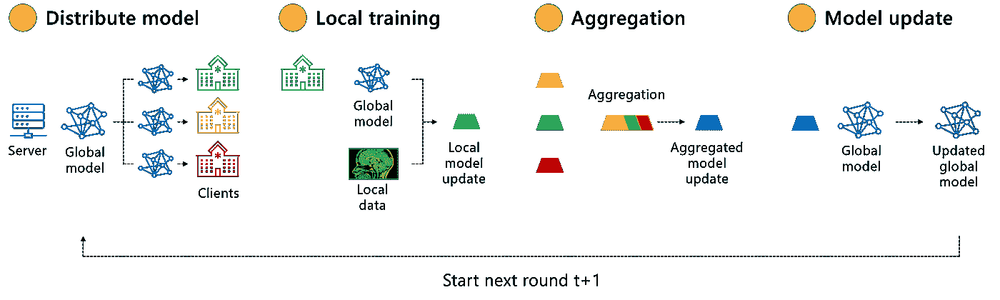

联合学习工作流

让我们沿着模型分布、局部训练、权重聚集和模型更新的步骤来看一些关键的考虑事项。

第一个联合学习应用程序是智能键盘场景，用于数百万部参与的智能手机(“跨设备”)完成句子。相比之下，组织之间的联合学习场景(“跨竖井”)具有不同的特征和要求。通常情况下，他们涉及到中等数量的参与者，如数十家医院。通常，存在与安全性、隐私和合规性相关的严格要求。联合学习为这样的组织用例提供了控制选项。其中之一是能够定义允许哪些客户端参与并接收全局模型的副本。

跨竖井方法的一大优势是参与者拥有 IT 基础设施，可以利用强大的 GPU 资源来支持医学成像或其他深度学习用例中常见的大型模型。我们的演示展示了按需使用 Azure CPU 或 GPU 计算资源进行联邦学习。

关于数据注释标准的明确协议是多方培训设置的关键要求，特别是对于像图像分割这样的高级任务。标签实践或质量的系统性偏差可能会对最终模型产生负面影响。此外，在联邦学习概念中，没有关于数据或注释的集中质量保证，因为数据是不共享的。

随着联合学习在企业场景中获得更多的牵引力，权重聚合方法变得更加复杂，以满足企业需求。一种直观的聚合方法称为联邦聚合:每个参数都根据本地数据点的数量进行加权。例如，如果医院 A 的更新基于 100 幅图像，而医院 B 基于 200 幅图像进行训练，那么医院 B 的贡献将是医院 A 的两倍。存在联合聚合的几种变体，以在偏离分布的情况下改善收敛，或者改善隐私和安全性。一个重要的扩展是安全聚合，它保护通信免受中间人攻击，并防止服务器以明文形式访问来自各个客户端的更新。它基于一种加密协议，该协议确保一个客户端的贡献看起来像随机噪声，除非与其他客户端的贡献合并在一起。

对于端到端的隐私保护解决方案，我们还需要考虑由此产生的模型。今天的大型深度学习模型倾向于记忆单个数据点。例如，研究人员已经表明，从经过训练的人脸检测分类模型中重建人脸的可识别图像是可能的。这种**模型反演攻击**的风险并没有随着联合学习而降低，因为它保护了输入数据**，但没有保护结果模型**。因此，联合学习通常与差分隐私相结合，通过在训练过程中添加定义量的统计噪声来保护结果模型。这大大降低了重建单个数据点或链接攻击的风险。如果你想了解这个概念的更多信息，请查看我们知识库的[差分隐私演示](https://github.com/Azure/medical-imaging/blob/main/notebooks/5-diff-privacy-pneumonia-detection.ipynb)。

# 演示架构

医学影像存储库中的演示包括一个联合学习场景，其中多家医院使用自己的私有数据集训练一个中央模型。该方法使用中央服务器进行聚合，这意味着服务器向不同的医院发出指令，并在本地训练运行结束后收集模型权重。在中央服务器上汇总后，更新的模型被发送到医院，作为下一轮的起点。

在架构方面，完整的设置是使用 Azure 组件实现的。医院由部署在不同地区的机器学习工作区来代表，以创建一个全球设置。联邦服务器是使用 Azure 数据科学虚拟机实现的。对于配置和编排，使用 NVIDIA Flare 包。

该模型在公共 Kaggle 数据集上进行训练，该数据集包含有肺炎和无肺炎患者的 x 射线图像。使用该数据集，二进制分类模型被训练以将 x 射线图像分类为“肺炎”或“正常”类别。

# 付诸行动

如果您喜欢自己重新创建演示设置，请查看我们的[分步指南](https://github.com/Azure/medical-imaging/tree/main/federated-learning)。为了使解决方案易于部署，提供了一些 GitHub 动作工作流来准备运行实验的环境。

存储库中可用的工作流之一创建 Azure 资源，主要是一个具有特定配置的数据科学虚拟机和三个不同的 Azure 机器学习工作区。还为每个工作区创建了一个计算实例。计算实例将运行由 NVIDIA Flare 生成的客户端包。客户端包用于启动与服务器和管理客户端的通信，这些客户端将在 Data Science 虚拟机上运行。

还提供了从 Kaggle 下载肺炎数据集并对其进行重新采样的工作流。重采样后，数据被分成三个不同的部分，为不同的客户端创建私有数据集。准备阶段的最后一步是使用 Azure ML CLI 将私有数据集作为数据资产上传和注册到不同的工作区。使用这种方法，我们可以使用在不同客户端上运行的训练脚本中的训练数据。

在设置好基础设施之后，我们可以启动将要上传到客户端和服务器的包。为了生成它们，我们使用登录到虚拟机，例如通过本地终端建立 SSH 连接。然后，我们在虚拟机上克隆医学影像存储库。

存储库中的 federatedlearning-folder 包含一个名为 *project.yml* 的文件。该文件包含服务器、客户机的设置以及更多用于联邦设置的配置选项。更多详情，见[本页](https://nvflare.readthedocs.io/en/main/programming_guide/provisioning_system.html#project-yaml-file)。

可以使用以下命令运行 NVFlare 资源调配工具:

```
provision -p project.yml
```

这将为每个参与者生成一个启动工具包，默认情况下，在运行 provisioning 命令的工作区文件夹中项目名称的文件夹内，在前缀为“prod_”的目录中创建启动工具包。客户端包被复制到创建的不同机器学习工作空间。服务器和管理包都保留在联邦服务器上，但是被移动到虚拟机的主目录中。

# 进行实验

可以使用管理客户端控制实验。客户端和服务器包可以在同一个虚拟机上运行。要启动服务器和客户端之间的连接，首先在服务器虚拟机上运行 start 命令。我们通过导航到服务器启动工具包中的启动文件夹并运行 *bash start.sh* 来实现这一点。

当服务器启动时，客户机上的启动脚本可以运行。这应该会导致服务器和客户端之间的成功连接。在服务器的终端中，输出应该如下所示:

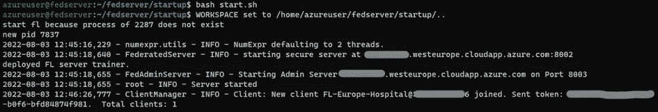

在为三个不同的客户机运行启动脚本之后，我们可以使用管理客户机验证连接是否成功。为此，我们打开另一个终端，并运行 admin 文件夹中的启动脚本。使用 admin@nvidia.com 的[用户名登录。](mailto:admin@nvidia.com)

通过键入“？”，列出了管理客户端的不同命令。其中一些与培训周期相关，如“部署应用程序”和“启动应用程序”。其他命令主要集中在解决方案的 IT 管理部分。

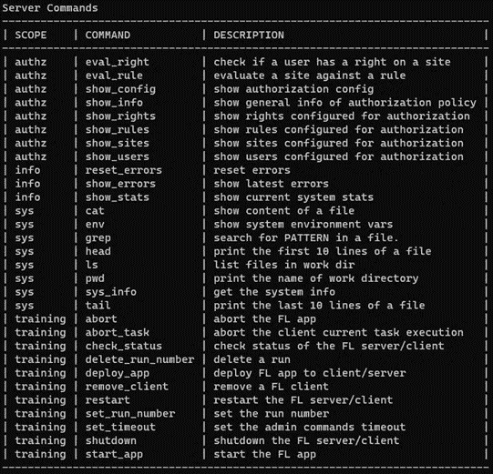

通过运行 check_status 命令，我们可以验证我们的三个客户机是否成功连接到联邦服务器。

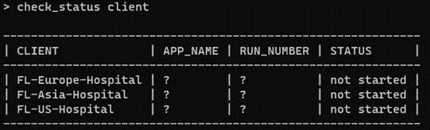

将客户端连接到服务器后，就可以开始实验了。

该存储库包含两个*应用*，我们在 NVFlare 中称之为它们，可用于运行实验。两者都使用相同的模型架构和训练逻辑。主要区别在于，一个应用程序训练一个联邦模型，而另一个训练一个中央模型。这允许我们进行实验，比较集中式运行和联合运行的性能。

为了准备我们的运行，我们需要为所有客户机设置运行号，然后运行 check_client 命令来验证:

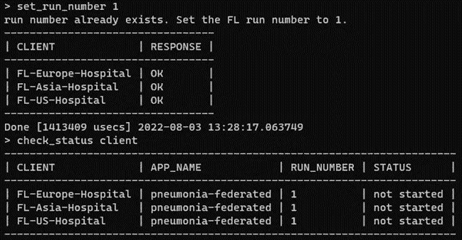

我们需要运行的下一个命令是*upload _ app pneumonia-federated*。这将把我们的应用程序上传到联邦服务器的 transfer 文件夹，准备好复制到不同的客户端。

为了将应用程序部署到不同的客户端，我们使用命令*deploy _ app pneumonia-federated all*。这将把培训说明复制到不同的客户端和服务器。如果成功，客户端将向服务器返回 OK 状态。

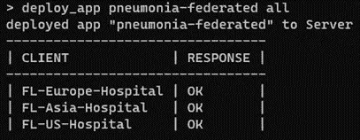

我们需要的最后一个命令是 start_app all。这启动了针对不同客户的培训运行:

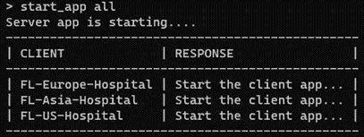

可以使用运行服务器启动脚本的终端，或者使用不同客户端的终端来跟踪训练运行的进度。

一个明显的问题是联合培训与传统(集中)培训相比如何。为了回答这个问题，可以在联合实验之后进行集中培训。在这个实验中，将在完整的肺炎数据集上训练相同的算法，但这次我们只使用一个客户端。用于准备数据的 GitHub Actions 工作流包含将完整数据集注册到亚洲工作空间的步骤。因此，我们在这一步中使用该客户端。

通过在管理终端中运行以下命令，可以启动集中式实验:

```
set_run_number 2
upload_app pneumonia-central
deploy_app pneumonia-central client FL-Asia-Hospital
start_app server
start_app client FL-Asia-Hospital
```

# 查看结果

在客户端，在训练运行期间创建事件，并将其流式传输到服务器。这些指标可以在服务器上名为“run_ <run number="">”的文件夹中找到。在我们 repo 中存在的应用程序中，跟踪指标的方式是，可以使用 TensorBoard 来使用它们。Tensorboard 为机器学习实验提供交互式可视化功能。</run>

要在联合服务器上运行 TensorBoard，请运行以下命令:

```
tensorboard --logdir=fedserver --bind_all
```

-bind_all 参数使应用程序可以从外部访问，如果您想从本地机器访问仪表板而不利用远程桌面选项，这是必需的。从网络角度来看，我们还需要打开 TensorBoard 正在使用的端口(默认为 6006)。

下面是我们 TensorBoard 的截图。在左侧幻灯片中，我们可以选择过滤我们想要可视化的不同运行。这对于比较不同参数运行之间的性能非常有用。可视化的值是训练损失和验证准确性。训练损失将指示不同客户的模型能够在本地数据集上概括的有多好。验证准确性显示了局部模型在全局验证数据集上的性能。

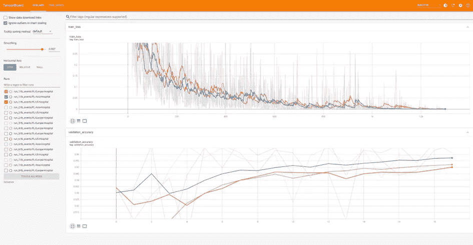

张量板中的联邦学习曲线

基于这两个实验设置，我们可以比较集中运行和联合运行的结果。从一些实验中可以看出，集中运行可以获得稍高的精度。在某些情况下，使用这两种设置可以获得相同的性能，尽管联合训练运行收敛需要更长的时间。

下图显示了集中式运行和联合运行之间的比较，从中我们可以看到集中式运行带来了更高的准确性。应该使用其他参数(例如，学习率、时期数)进行进一步的实验，以得出最终结论，这些结论也不应该在不同的用例中推广。

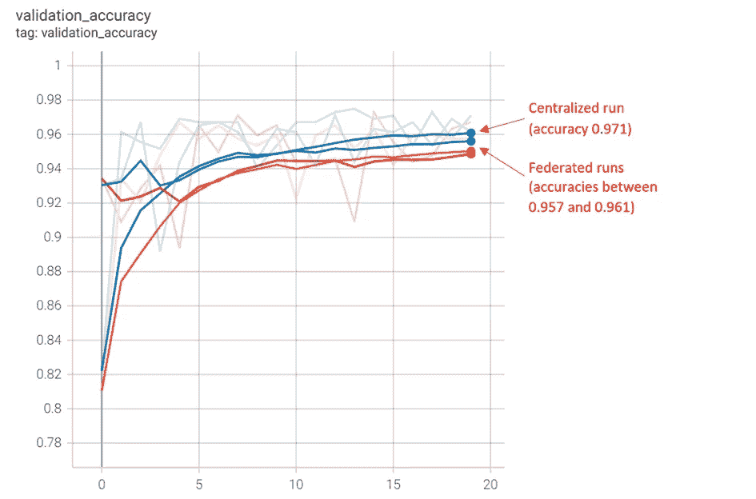

集中培训和联合培训的融合

# 结论

在训练数据不能共享的情况下，联合学习对于 ML 解决方案的共同开发是一个令人信服的概念。一个明显的应用领域是隐私保护的 ML 培训。其他例子如用于药物发现的 [MELLODY 项目](https://www.melloddy.eu/)展示了一些应用，在这些应用中，相互竞争的公司开发了一个联合模型，而不必担心他们的知识产权受到损害。

随着这一概念的成熟，包括对安全和健壮的联合聚合的支持，它在具有特定需求的企业和公共部门组织中变得更加普遍。

Azure ML 和 NVIDIA NVFlare 的结合甚至可以快速实现全球联合学习部署，并在合规性、数据保护、可管理性和可追溯性方面提供显著优势。

端到端隐私保护解决方案需要将联邦学习与差分隐私等技术相结合。

*除非另有说明，所有图片均由作者所有*。

[1]肺炎数据集:Paul Mooney。2018.胸部 x 光图像(肺炎)。执照: [CC BY 4.0](https://creativecommons.org/licenses/by/4.0/) 。来源:[胸部 x 光图像(肺炎)| Kaggle](https://www.kaggle.com/datasets/paultimothymooney/chest-xray-pneumonia)