# 用于多类图像分类的 TensorFlow 迁移学习实用指南

> 原文：<https://towardsdatascience.com/practical-guide-to-transfer-learning-in-tensorflow-for-multiclass-image-classification-d35fab7b28c0>

## 在图像分类中实现迁移学习的详细讲解的分步教程


[Jason Yuen](https://unsplash.com/@fanfandyuen?utm_source=unsplash&utm_medium=referral&utm_content=creditCopyText) 在 [Unsplash](https://unsplash.com/photos/0AzXWTUMS-w?utm_source=unsplash&utm_medium=referral&utm_content=creditCopyText) 上的照片

通常我们无法获得大量的标记数据或计算能力来从头构建图像分类深度学习模型。

幸运的是，迁移学习使我们能够为我们的特定分类任务开发鲁棒的图像分类器，即使我们的资源有限。

在这个简单易懂的演练中，我们将了解如何利用预先训练的模型作为 TensorFlow 中迁移学习的一部分来有效和高效地对图像进行分类。

## 目录

> ***(1)****[*迁移学习的动机和好处*](#8e30) (可选)***(2)****[*关于数据集*](#c9fa)***(3)***[*步骤*](#941f)**

**本文附带的 GitHub repo 可以在[这里](https://github.com/kennethleungty/TensorFlow-Transfer-Learning-Image-Classification)找到。**

# **(1)迁移学习的动机和好处**

> **可选阅读**

**迁移学习是一种强大的方法，它使用预先训练的模型作为创建新模型的起点，而不是从头开始构建新模型。**

**这些预先训练好的模型由学术或大型技术研究人员建立，他们开发新的深度学习模型架构，并在强大计算能力的帮助下在大型数据集上训练它们。**

**几个重要的好处推动了迁移学习的流行:**

*   ****节省大量时间和资源**因为从零开始训练深度学习模型是耗时和资源密集型的**
*   ****更好的性能**因为预训练模型在对大型数据集进行大量训练后已经了解了重要的特征**
*   ****需要更少的标记数据**，因为我们可以利用预训练模型所拥有的“知识”的坚实基础**
*   ****减少过度拟合**，因为从头构建的模型可能对较小训练数据集的特定特征过于敏感**

****

**照片由[蒂姆·莫斯霍尔德](https://unsplash.com/@timmossholder?utm_source=unsplash&utm_medium=referral&utm_content=creditCopyText)在 [Unsplash](https://unsplash.com/photos/WE_Kv_ZB1l0?utm_source=unsplash&utm_medium=referral&utm_content=creditCopyText) 上拍摄**

# **(2)关于数据集**

**我们将使用[牛津-IIIT pet 数据集](https://www.robots.ox.ac.uk/~vgg/data/pets/)来完成这个图像分类任务。这是一个 37 类 pet 图像数据集，每类约 200 张图像。**

**该数据集非常适合本教程，因为:**

*   **它相对较小(总共约 800Mb)**
*   **在[知识共享署名-类似共享许可](https://creativecommons.org/licenses/by-sa/4.0/)下，它可用于商业和研究目的**
*   **大量的类是测试多类图像分类的迁移学习的一个很好的方法**
*   **它是`tensorflow_datasets` ( `[tfds](https://www.tensorflow.org/datasets/api_docs/python/tfds)`)中许多现成可用的数据集之一(我们将在本教程中直接加载)**

**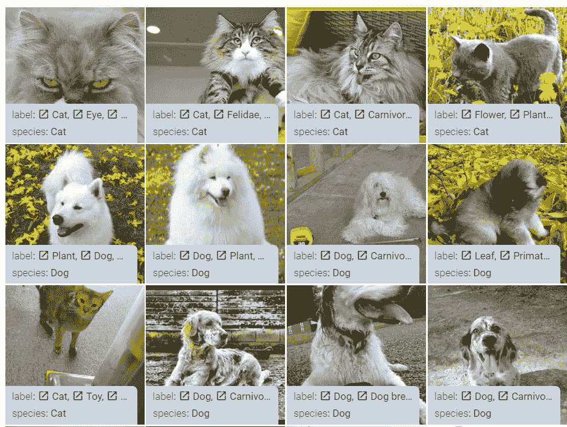**

**牛津-IIIT pet 数据集样本|作者图片**

**以下注释可用于每个图像:**

*   **物种(猫或狗)和品种名称**
*   **动物头部周围的紧密包围盒**
*   **像素级前景-背景分割**

**本教程将重点关注**品种名称**作为我们要预测的标签。**

***如果我们希望获得 TensorFlow 之外的数据，我们可以执行以下任一操作:***

*   **[T21【BitTorrent】与学术洪流 ](https://academictorrents.com/details/b18bbd9ba03d50b0f7f479acc9f4228a408cecc1)**
*   ***直接下载* [*数据集【images.tar.gz】*](https://thor.robots.ox.ac.uk/~vgg/data/pets/images.tar.gz)*[*【annotations.tar.gz】*](https://thor.robots.ox.ac.uk/~vgg/data/pets/annotations.tar.gz)***

# ***(3)逐步指导***

> ****查看* [*已完成的笔记本*](https://github.com/kennethleungty/TensorFlow-Transfer-Learning-Image-Classification/blob/main/notebooks/TensorFlow%20Tutorial%20-%20Image%20Classification%20on%20Oxford-IIIT%20Pets%20Dataset.ipynb) *以跟随本演练。****

# ***步骤 1 —初始设置***

***在本教程中，我们将使用 [Google Colab](https://colab.research.google.com/) ,因为它允许我们免费访问 GPU，并且默认环境具有必要的 Python 依赖性。***

***虽然大量的计算能力是不必要的，但在 GPU 上运行迁移学习仍然至关重要，因为我们正在处理深度学习模型。***

> ******重要*** *:记得从顶部菜单栏将* ***硬件加速器*** *切换到****GPU****:运行时>改变运行时类型。****

***在发布[新的 Colab 笔记本](https://colab.research.google.com/notebooks/empty.ipynb)时，我们导入以下包:***

```
***import numpy as np
import pandas as pd
import matplotlib.pyplot as plt

import tensorflow as tf
import tensorflow_datasets as tfds
from tensorflow import keras
from tensorflow.keras import layers
from keras import callbacks***
```

# ***步骤 2-通过训练-验证-测试分割加载数据***

***如前所述，我们将使用 TensorFlow 数据集组件`tfds`来加载图像和相应的元数据。***

```
***(train_raw, val_raw, test_raw), ds_info = tfds.load(
                                          name='oxford_iiit_pet',
                                          split=['train[:90%]', 
                                                'train[90%:]', 
                                                'test'], 
                                          shuffle_files=True,
                                          as_supervised=True,
                                          with_info=True
                                          )***
```

***`tfds.load`函数自动从数据源下载数据，并将其作为一个`tf.data.Dataset`对象返回。***

*   ***`name`:tensor flow 数据集集合中的数据集名称。在这种情况下，它被命名为`oxford_iiit_pet`。***
*   ***`split`:指定数据分割的参数。由于原始数据中只有两个分裂(训练和测试)，我们将划分 10%的训练集来创建一个新的验证集***
*   ***`shuffle_files`:如果设置为真，输入数据的顺序会被打乱(以促进更好的模型泛化)***
*   ***`as_supervised`:如果设置为 True，返回的`tf.data.Dataset`对象将有一个元组结构*(图片，标签)*，其中标签指的是图片中的宠物品种。***
*   ***`with_info`:如果设置为 True，元数据将作为`DatasetInfo`对象与图像数据集对象一起返回***

***由于我们设置了`with_info=True`，我们将获得两个输出对象:***

1.  ***基于三个拆分的一组三个数据集对象(`train_raw`、`val_raw`和`test_raw`)***
2.  ***包含数据集元数据的`DatasetInfo`对象(`ds_info`***

> ***如果我们有想要加载到`tfds`的自定义数据集(例如 CSV 文件)，我们可以在这里和这里[参考文档](https://www.tensorflow.org/datasets/add_dataset)[。](https://www.tensorflow.org/api_docs/python/tf/data/experimental/make_csv_dataset)***

# ***步骤 3-浏览数据***

***有多种方法可以更好地理解数据集。***

## ***㈠元数据***

***如果可以的话，我们可以通过在一个单元格中运行它来仔细查看存储在`ds_info`中的元数据。***

***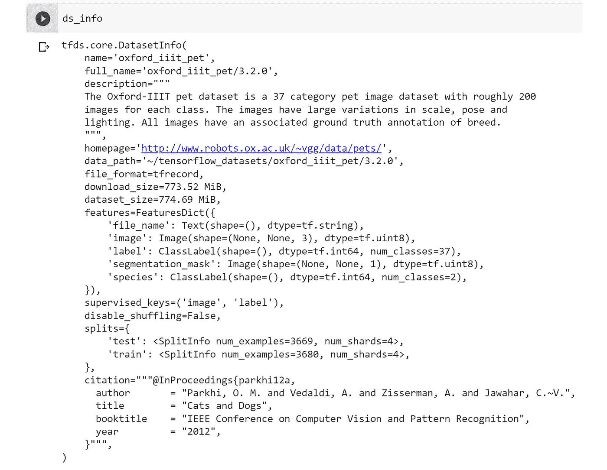***

***牛津-IIIT Pet 数据集的数据集信息(也称为元数据)|作者图片***

***从输出中，我们可以发现诸如图像特征的类型、类的数量和分割的大小等信息。***

***要直接获得类的数量和分割大小，我们可以运行以下代码:***

```
***# Get number of classes
num_classes = ds_info.features['label'].num_classes
print('Number of classes:', num_classes)

# Get split sizes (aka cardinality)
num_train_examples = tf.data.experimental.cardinality(train_raw).numpy()
num_val_examples = tf.data.experimental.cardinality(val_raw).numpy()
num_test_examples = tf.data.experimental.cardinality(test_raw).numpy()

print('Number of training samples:', num_train_examples)
print('Number of validation samples:', num_val_examples)
print('Number of test samples:', num_test_examples)***
```

## ***㈡获得价值计数***

***理解数据的一个快速方法是检查图像标签的分布。我们可以通过自定义的值计数函数来实现:***

```
***def get_value_counts(ds):
  label_list = []
  for images, labels in ds: 
    label_list.append(labels.numpy()) # Convert tensor to numpy array
  label_counts = pd.Series(label_list).value_counts(sort=True)

  print(label_counts)***
```

***如果我们在训练集上运行它，我们可以看到图像相对均匀地分布在每个类中。***

***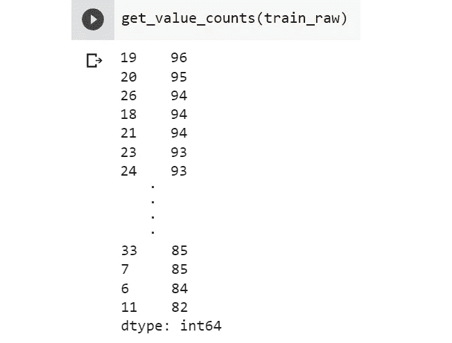***

***训练集中标签的值计数|按作者排序的图像***

## ***(三)图像示例***

***鉴于我们正在处理图像，直接将它们可视化总是一个好主意。***

***我们可以使用下面的自定义函数显示一个随机图像及其相应的标签，包括将标签从整数形式转换为实际的品种名称。***

```
***# Obtain name for label integer
get_label_name = ds_info.features['label'].int2str

def view_single_image(ds):
  image, label = next(iter(ds)) # Get next image (random)
  print('Image shape: ', image.shape) # Get shape of image
  plt.imshow(image)
  _ = plt.title(get_label_name(label))***
```

***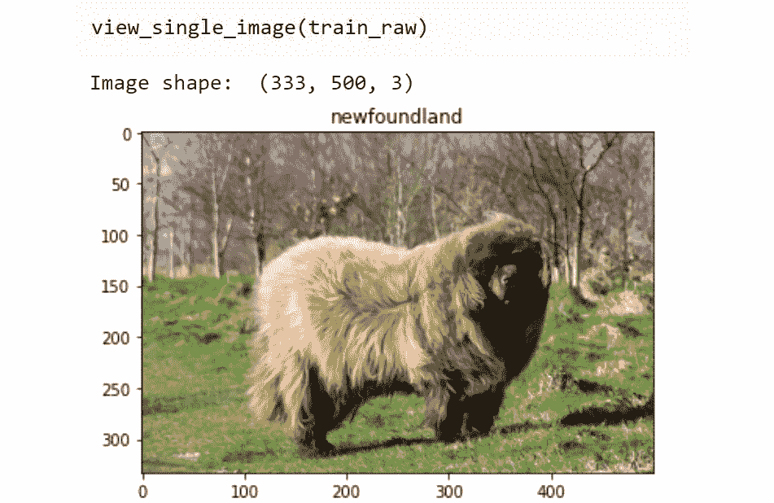***

***来自数据集的单个随机图像|作者提供的图像***

***内置的`show_examples`方法也允许我们可视化图像的随机子集。***

***对于这个特定的数据集，我们需要指定`image_key='image'`来检索实际的图像，因为存在多个图像特征。***

```
***tfds.show_examples(train_raw, ds_info, image_key='image')***
```

***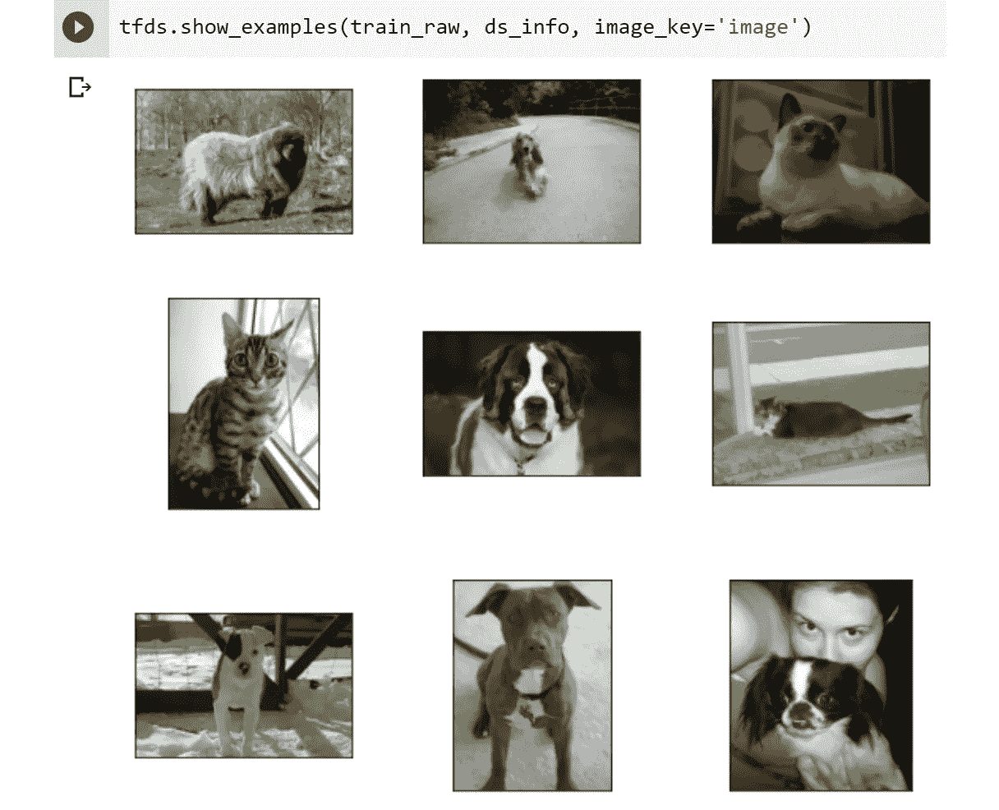***

***来自 tdfs.show_examples|作者图片的随机子集***

# ***步骤 4 —准备数据***

***下一步至关重要，因为它涉及在迁移学习发生之前将图像预处理成适当的格式。***

## ***(一)图像尺寸调整***

***深度学习模型期望输入图像具有相同的形状，以实现一致性、兼容性和训练效率。***

***鉴于我们的原始图像有不同的大小，我们需要调整它们的大小，以具有相同的长度和宽度。***

```
***IMG_SIZE = 224

train_ds = train_raw.map(lambda x, y: (tf.image.resize(x, (IMG_SIZE, IMG_SIZE)), y))
val_ds = val_raw.map(lambda x, y: (tf.image.resize(x, (IMG_SIZE, IMG_SIZE)), y))
test_ds = test_raw.map(lambda x, y: (tf.image.resize(x, (IMG_SIZE, IMG_SIZE)), y))***
```

***选择 224x224 的调整后分辨率是因为我们稍后将使用的预训练模型期望输入图像是这种特定的形状。***

## ***(二)标签的一次性编码***

***我们的数据集有 37 个用于多类图像分类的类。因此，我们对标签进行一次热编码，以获得每个类的长度为 37 的输出张量。***

***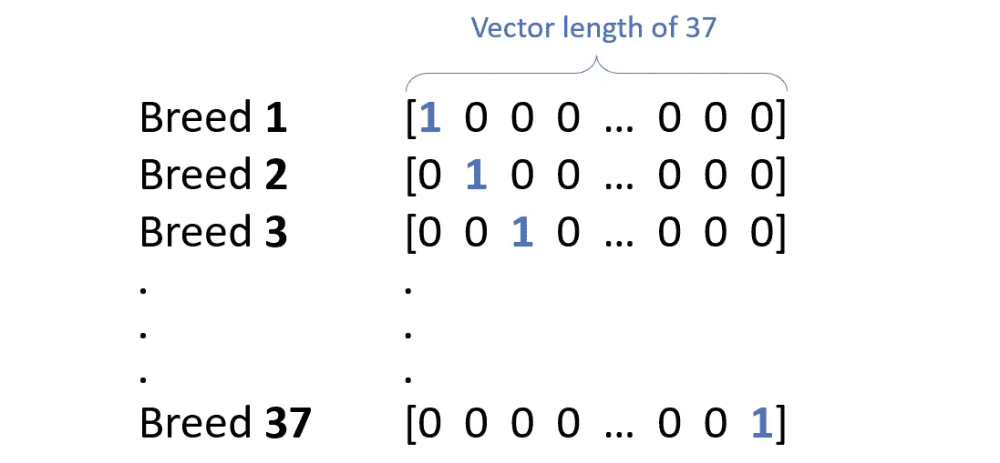***

***基于类别数量的一键编码输出张量图解|作者图片***

```
***def one_hot_encode(image, label):
    label = tf.one_hot(label, num_classes)
    return image, label

train_ds = train_ds.map(one_hot_encode)
val_ds = val_ds.map(one_hot_encode)
test_ds = test_ds.map(one_hot_encode)***
```

***这一步很重要，因为我们将使用分类准确性来衡量模型性能，计算预测与这些实际的**一次性标签**匹配的频率。***

## ***㈢图像增强***

***虽然迁移学习减少了所需的数据量，但良好的性能仍然需要足够高质量、数量和种类的数据集。***

***图像增强是一种通过生成原始图像的修改副本来人为增加训练集大小的技术。***

***为了执行增强，我们使用 Keras 预处理层 API。我们想要应用的每种图像增强都被定义为 Keras 序列类中的一个**层**。***

***为简单起见，我们将仅对图像进行随机水平翻转，但请注意，大范围的增强[是可用的。](https://keras.io/api/layers/preprocessing_layers/image_augmentation/)***

```
***data_augmentation = keras.Sequential(
                [layers.RandomFlip('horizontal'), 
                #  layers.RandomRotation(factor=(-0.025, 0.025)),
                #  layers.RandomTranslation(height_factor=0.1, width_factor=0.1),
                #  layers.RandomContrast(factor=0.1),
                ])***
```

***我们可以用下面的代码来查看增强的效果:***

```
***for image, label in train_ds.take(1): # Iterate and get set of image and label from train_ds generator
    plt.figure(figsize=(10, 10))
    for i in range(4):  # Display augmented images in 2x2 grid
        ax = plt.subplot(2, 2, i+1)
        aug_img = data_augmentation(tf.expand_dims(image, axis=0))
        plt.imshow(aug_img[0].numpy().astype('uint8')) # Retrieve raw pixel value
        plt.title(get_label_name(int(label[0]))) # Get corresponding label
        plt.axis('off')***
```

***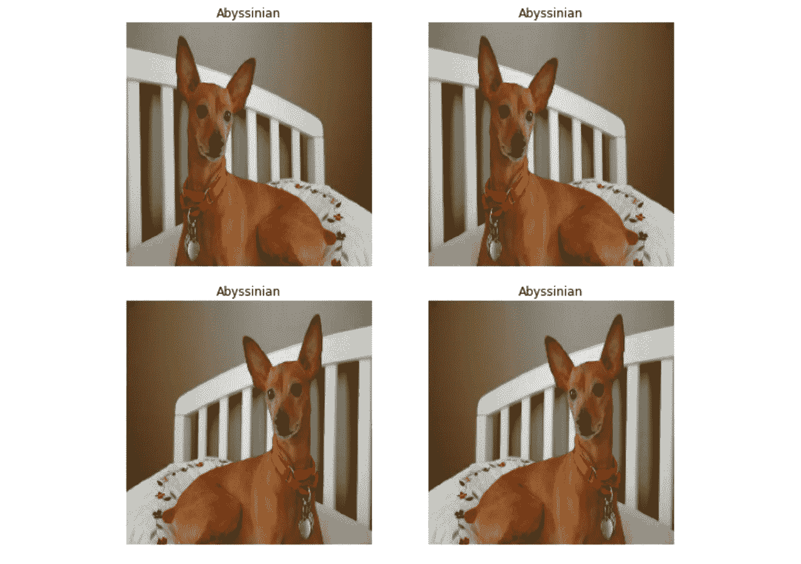***

***说明水平翻转增强的影响|作者图片***

***</top-python-libraries-for-image-augmentation-in-computer-vision-2566bed0533e> *** 

## ***(四)批处理和预取***

***下一步是设置批处理和预取，这是优化模型训练效率的技术。***

*   *****批处理**将训练数据的子集分组为小批，以便训练可以并行化(利用 GPU 硬件加速)，同时保持准确的梯度估计。***
*   *****预取**将模型计算与输入数据的获取重叠，允许在检索下一批图像时继续训练。***

***虽然批量大小是一个可以调整的超参数，但我们可以先将其设置为标准默认值 **32** 。***

```
***BATCH_SIZE = 32

train_ds = train_ds.batch(batch_size=BATCH_SIZE, 
                          drop_remainder=True).prefetch(tf.data.AUTOTUNE)

val_ds = val_ds.batch(batch_size=BATCH_SIZE, 
                      drop_remainder=True).prefetch(tf.data.AUTOTUNE)

test_ds = test_ds.batch(batch_size=BATCH_SIZE, 
                        drop_remainder=True).prefetch(tf.data.AUTOTUNE)***
```

***我们来看看上面批处理/预取代码的参数:***

*   ***`drop_remainder=True`表示最后一批小于 32 的图像(由于分割不均)被丢弃。当模型依赖于具有相同外部尺寸的批次时，这很有用***
*   ***`prefetch()`方法中的`tf.data.AUTOTUNE`意味着`[tf.data](https://www.tensorflow.org/api_docs/python/tf/data)`运行时将动态调整每个训练步骤要预取的元素数量***

# ***步骤 5 —建立模型***

***迁移学习背后的核心概念是利用预先训练的模型作为构建定制图像分类器的基础。***

***Keras 中提供了许多预训练的深度学习模型(以及预训练的权重)，完整的列表可以在这里找到。***

***对于本教程，我们将使用 [**ResNet50V2**](https://keras.io/api/applications/resnet/#resnet50v2-function) 模型，因为它提供了模型大小、准确性、信誉和推理速度的完美平衡。***

******

***ResNet50 模型架构图|根据[维基共享许可](https://commons.wikimedia.org/wiki/File:ResNet50.png)使用的图像***

## ***(一)设置基础模型***

***我们首先使用`keras.applications.ResNet50V2`从 Keras 应用程序加载 ResNet50V2 模型。***

***请注意，ResNet50V2 预训练模型是在 [ImageNet](https://www.image-net.org/) 数据集上训练的，这是一个包含数百万张图像和数千个类的大规模图像数据集。***

```
***base_model = keras.applications.ResNet50V2(
                        include_top=False, # Exclude ImageNet classifier at the top
                        weights='imagenet',
                        input_shape=(IMG_SIZE, IMG_SIZE, 3)
                        )***
```

***以下是对所用参数的解释:***

*   ***`include_top`:如果设置为 False，我们排除 ImageNet 分类器作为顶层。这很重要，因为我们想引入自己的顶层来分类宠物品种，而不是最初的 ImageNet 类***
*   ***`weights`:通过将其设置为`'imagenet'`，我们将使用在 ImageNet 上训练的预训练重量。这正是我们想要的，因为我们正在执行图像分类，从 ImageNet 学到的功能是相关的***
*   ***`input_shape`:我们设置输入形状元组来匹配 ResNet 架构需要的，即`(224, 224, 3)`(其中`3`的最后一个元素代表颜色通道的数量)***

## ***(ii)冻结基础模型的预训练权重***

***一旦我们加载了预训练的模型，我们想要**固定** ( **又名冻结** ) 层和权重，因为我们不想丢失已经学习的有价值的信息。***

```
***# Freeze base_model
base_model.trainable = False***
```

***通过将`trainable`属性设置为`False`，可训练的重量变为不可训练，并且在训练过程中不会更新。一般来说，各层的所有重量都被认为是可训练的。***

***事实上，**唯一具有不可训练权重**的内置层是`[BatchNormalization](https://www.tensorflow.org/api_docs/python/tf/keras/layers/BatchNormalization)`，因为它使用不可训练权重来跟踪训练期间输入的均值和方差。***

## ***㈢实例化和修改输入***

***在此步骤中，我们对输入(即图像)进行预处理，以符合预训练的 ResNet50v2 架构的预期。***

***我们首先使用`keras.Input`实例化一个 Keras 张量来表示输入图像的“对象结构”。***

```
***# Setup inputs based on input image shape
inputs = keras.Input(shape=(IMG_SIZE, IMG_SIZE, 3))***
```

***接下来，我们应用前面设置的数据扩充步骤，并将输出存储在一个表示新输入转换的新变量`x`中。***

```
***x = data_augmentation(inputs)***
```

***此外，Keras 中的每个预训练模型都需要特定类型的输入预处理，这是在早期数据准备之上的。***

***我们通过在将输入传递给模型之前对输入运行`[resnet_v2.preprocess_input](https://www.tensorflow.org/api_docs/python/tf/keras/applications/resnet_v2/preprocess_input)`来做到这一点。***

```
***# Apply specific pre-processing function for ResNet v2
x = keras.applications.resnet_v2.preprocess_input(x)***
```

***特别是对于 ResNet50 V2，预处理步骤将输入像素从范围[0，255]缩放到范围**[-1，1]**，以便输入与 ResNet 架构兼容。***

## ***(iv)处理批量标准化层***

***`BatchNormalization`层稍微有点棘手，因为它有不可训练的权重来跟踪输入的均值和方差。***

***因为我们稍后将解冻整个模型(在**步骤 8 —微调模型**中)，我们需要包含额外的代码来保持`BatchNormalization`层处于推理模式(即保持不可训练)。***

```
***# Keep base model batch normalization layers in inference mode (instead of training mode)
x = base_model(x, training=False)***
```

***注意，这一步是针对`BatchNormalization`层的，是在之前完成的基础模型冻结(`base_model.trainable=False`)之上。***

***如果这一步被省略，微调步骤将是一个烂摊子，因为不可训练的重量将被删除和撤消。***

## ***㈤重建顶层***

***现在我们已经整理了预训练模型的早期层，我们可以添加新的可训练层，以便我们的模型可以有效地学习分类我们想要的标签，即宠物品种。***

```
***# Rebuild top layers
x = layers.GlobalAveragePooling2D()(x) # Average pooling operation
x = layers.BatchNormalization()(x) # Introduce batch norm
x = layers.Dropout(0.2)(x)  # Regularize with dropout

# Flattening to final layer - Dense classifier with 37 units (multi-class classification)
outputs = layers.Dense(num_classes, activation='softmax')(x)***
```

***新图层包括以下内容:***

*   ***[全球平均池](https://www.tensorflow.org/api_docs/python/tf/keras/layers/GlobalAveragePooling2D)***
*   ***[批量归一化](https://www.tensorflow.org/api_docs/python/tf/keras/layers/BatchNormalization)***
*   ***[辍学](https://www.tensorflow.org/api_docs/python/tf/keras/layers/Dropout)(概率为 20%)***
*   ***最终输出[密集层](https://www.tensorflow.org/api_docs/python/tf/keras/layers/Dense)激活 softmax，输出维数为 37(反映 37 类宠物品种)***

## ***(vi)创建新的 Keras 模型对象***

***我们用前面定义的更新的输入和输出实例化一个新的 Keras 模型。***

```
***# Instantiate final Keras model with updated inputs and outputs
model = keras.Model(inputs, outputs)***
```

***我们可以使用`model.summary()`查看我们更新后的模型的结构:***

***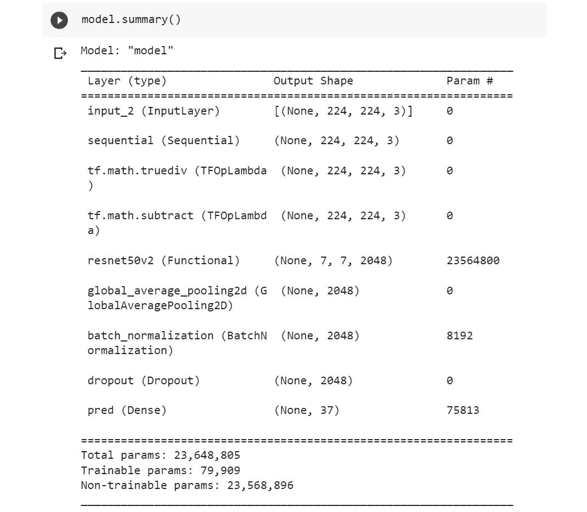***

***模型摘要|作者图片***

## ***㈦编制模型***

***最后，我们通过编译模型进行最后的润色，这涉及到配置评估指标和随机梯度下降优化器等设置。***

```
***model.compile(optimizer=keras.optimizers.Adam(),
              loss=keras.losses.CategoricalCrossentropy(),
              metrics=[keras.metrics.CategoricalAccuracy()]
              )***
```

***因为我们正在处理多类分类，所以使用[分类交叉熵](https://www.tensorflow.org/api_docs/python/tf/keras/losses/CategoricalCrossentropy)作为损失度量，使用[分类准确度](https://www.tensorflow.org/api_docs/python/tf/keras/metrics/CategoricalAccuracy)作为性能度量是有意义的。***

***我们还包括一个[提前停止回调](https://www.tensorflow.org/api_docs/python/tf/keras/callbacks/EarlyStopping)以避免在训练期间过度适应。***

```
***earlystopping = callbacks.EarlyStopping(monitor='val_loss', 
                                        mode='min', 
                                        patience=5, 
                                        restore_best_weights=True)***
```

# ***步骤 6-运行模型培训***

***随着我们模型的更新和编译，我们准备在 pet 图像数据集上训练它。***

***我们以 25 的历元计数开始，尽管当检测到过度拟合的迹象时，早期停止回调将有助于停止训练。***

***我们运行`model.fit()`来启动训练，并将训练输出存储在一个名为`history`的变量中。***

```
***EPOCHS = 25

history = model.fit(train_ds, 
                    epochs=EPOCHS, 
                    validation_data=val_ds, 
                    verbose=1,
                    callbacks =[earlystopping])***
```

***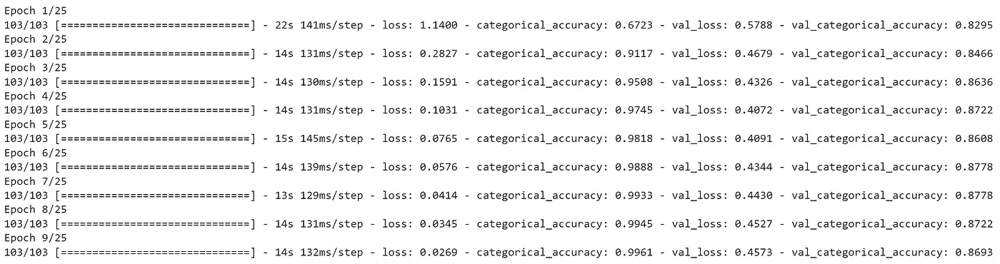***

***历元训练输出|作者图片***

# ***步骤 7 —评估模型***

***一旦培训完成，是时候了解我们的模型进展如何了。***

## ***㈠绘图训练和验证集***

***我们可以在增加的时期内，在训练集和验证集上绘制分类准确度。***

```
***def plot_hist(hist):
    plt.plot(hist.history['categorical_accuracy'])
    plt.plot(hist.history['val_categorical_accuracy'])
    plt.title('Categorical accuracy')
    plt.ylabel('accuracy')
    plt.xlabel('epoch')
    plt.legend(['train', 'validation'], loc='upper left')
    plt.show()

plot_hist(history)***
```

***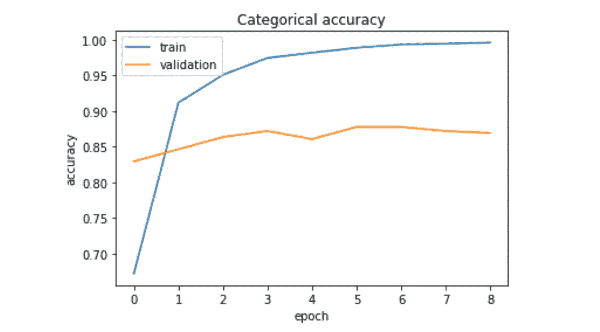***

***各时期的训练和验证准确度分数|按作者分类的图像***

***我们从图中看到，只需要几个时期就可以过拟合训练数据集，并且在五个时期后验证精度没有提高。***

## ***(ii)对测试数据集进行预测和评估***

***为了评估测试集上的模型预测，我们使用`model.evaluate()`。***

```
***result = model.evaluate(test_ds)
dict(zip(model.metrics_names, result))***
```

***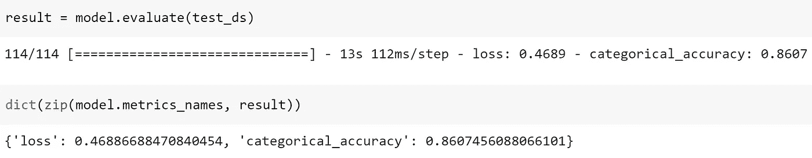***

***来自模型|作者图片的评估结果***

***结果表明，分类准确率达到了惊人的数值 **86.1%** 。***

***在此基础上，我们通过从 ResNet50 V2 预训练模型建立用于图像分类的深度学习模型，完成了迁移学习。***

# ***步骤 8 —微调模型(可选)***

***作为可选步骤，我们可以通过解冻和重新训练模型中的所有权重来进一步优化模型。***

***这个过程被称为**微调**，我们解冻所有或部分早期预训练层，并重新训练新数据的权重。***

***虽然这种技术可以提高性能，但它有可能很快过度拟合。***

***微调的一个关键部分是使用**非常低的学习率**(例如 0.00001)来重新训练模型。***

***基本原理是这些预先训练的层已经学习了用于图像分类的有价值的特征。因此，低学习率确保模型仅进行细微的参数调整，而没有显著的中断。***

***在我们的例子中，我们通过将`trainable`属性设置为`True`来解冻整个模型的顶部 15 层，排除了我们需要保持冻结的`BatchNormalization`层。***

```
***for layer in model.layers[-15:]:
    if not isinstance(layer, layers.BatchNormalization):
        layer.trainable = True***
```

***在这些变化之后，我们需要重新编译模型，在这里我们将学习率从默认的 0.001 大幅降低到 **0.00001** 。***

```
***model.compile(optimizer=keras.optimizers.Adam(learning_rate=1e-5), # Set a very low learning rate
              loss=keras.losses.CategoricalCrossentropy(),
              metrics=[keras.metrics.CategoricalAccuracy()]
              )***
```

***我们重新训练模型，并在最后的步骤中检索评估指标。考虑到过度拟合的风险，我们在更少的时期内运行训练。***

```
***EPOCHS = 5

history_2 = model.fit(train_ds, 
                      epochs=EPOCHS, 
                      validation_data=val_ds, 
                      verbose=1,
                      callbacks =[earlystopping])

result_2 = model.evaluate(test_ds)

dict(zip(model.metrics_names, result_2))***
```

***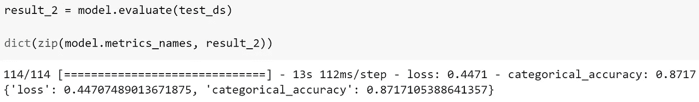***

***微调模型的评估结果|作者提供的图片***

***上面的评估输出表明，微调方法有助于将分类准确率从**的 86.1%提高到**的 87.2%。***

***最后，为了检索测试集上的实际预测，我们可以使用`model.predict()`函数:***

```
***preds = model.predict(test_ds)***
```

# ***(4)包装***

***本演练涵盖了开始学习用于图像分类的迁移学习的实际步骤。***

***迁移学习，加上微调，是一种有效的技术，使我们能够在有限的时间和资源下建立鲁棒的图像分类器。***

***鉴于迁移学习的实用性，它成为行业中解决业务问题的一种普遍技术也就不足为奇了。***

***完整笔记本的链接可以在 [**这里**](https://github.com/kennethleungty/TensorFlow-Transfer-Learning-Image-Classification/blob/main/notebooks/TensorFlow%20Tutorial%20-%20Image%20Classification%20on%20Oxford-IIIT%20Pets%20Dataset.ipynb) 找到。***

# ***在你走之前***

***欢迎您**加入我的数据科学学习之旅！**点击此[媒体](https://kennethleungty.medium.com/)页面，查看我的 [GitHub](https://github.com/kennethleungty) ，了解更多令人兴奋的实用数据科学内容。同时，享受在 TensorFlow 中实现图像分类迁移学习的乐趣！***

***</pytorch-ignite-classifying-tiny-imagenet-with-efficientnet-e5b1768e5e8f>  </micro-macro-weighted-averages-of-f1-score-clearly-explained-b603420b292f>  </how-to-easily-draw-neural-network-architecture-diagrams-a6b6138ed875> ***