# 加速材料科学研究的实用机器学习技术

> 原文：<https://towardsdatascience.com/practical-machine-learning-techniques-to-accelerate-materials-science-research-9dc9f62f33e8>

## 使用回归技术、特征选择和选择标准预测超导体的临界温度


美国公共电力协会在 [Unsplash](https://unsplash.com?utm_source=medium&utm_medium=referral) 上拍摄的照片

根据 [EIA](https://www.eia.gov/tools/faqs/faq.php?id=105&t=3) 的估计，由于输电线路的电阻损耗，美国能源网损失了大约 5%的电力。如果我们能找到一种方法来消除这一切呢？事实证明，有一种非常酷的材料叫做超导体——可以零电阻导电的材料。如果没有电阻，传输线就没有电阻损耗。我承认，对于超导现象究竟是如何发生的，我不是专家。我所知道的是，只有当给定的材料变得非常冷时，这种情况才会发生——我们说的是开尔文的个位数。在室温下，这些材料就像你的典型导体一样，只有在低于这个“临界温度”后，它们才会表现出这种超导特性。近年来，已经取得了进展，并且发现了在更合理的条件下工作的新材料。然而，“高温”超导体通常被认为是临界温度高于 77K 或液氮温度的材料。有了整个周期表，我们有没有办法使用机器学习技术来加速新材料的发现？虽然我们距离发现在传输线条件下工作的材料可能还有很长的路要走(更不用说为如此长的传输线找到一种经济有效的材料)，但有一些有趣的 ML 技术可以应用于所有类型的材料科学研究。

在我讲得太远之前，你可以很容易地跟随我的代码，贴在我的 [Github repo](https://github.com/nrlewis929/superconductor_feature_selection) 上。那里展示了更多的情节和代码；本文中我只展示亮点。公众可以从 UCI 机器学习知识库[1]获得这些数据。我将在[超导数据集](https://www.kaggle.com/datasets/munumbutt/superconductor-dataset)上解决一个多元回归问题(可在 CC0:公共领域许可下获得)。Kam Hamidieh[2]发表的文章中有一些关于数据集的精彩工作，值得一读，因为它比我在这里或随附的笔记本中所做的更深入地了解了超导和所用的特性。好了，一切都结束了，让我们开始吧！

# 特征探索

我们从 81 个特征开始，我们想要预测材料的临界温度。此外，我们有化学公式，并能够使用一个名为`chemparse`的便捷包提取每个元素的计数。如果你想看一下单个的分布图，那就打开笔记本吧…有这么多的特性，有相当多的信息需要解开。另一件我们可以开始了解不同参数如何相互作用的事情是查看相关性和一些聚类。这些步骤对于很好地理解我们正在处理的数据尤其重要，尤其是在不熟悉的主题中。

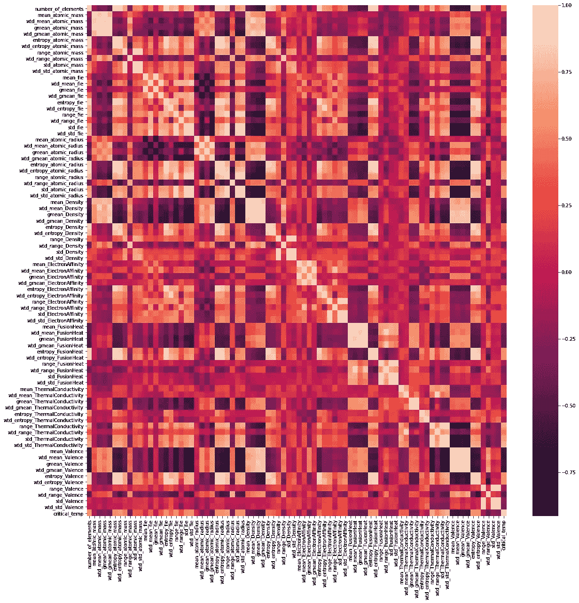

超导体数据集中特征之间的相关性。作者的情节

从该图中，我们可以看到高度相关和高度不相关的特征(值 1 表示精确相关，-1 表示完全反向相关，0 表示不相关)。也许减少我们拥有的功能数量的第一个方法是删除高度相关的功能…但是我们现在会保留所有的功能，看看我们会得到什么样的初步结果。

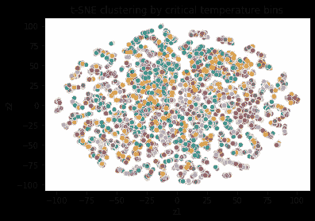

要素的 t-SNE 聚类，用颜色表示临界温度范围。由作者策划。

这里显示的聚类是一种可视化高维数据的有用方法…81 个特征当然是高维的！不幸的是，至少在最初的检查中，星团和临界温度范围之间没有明确的关联。

# 模型准备

我们总是可以添加更多从原始特征中提取的特征(例如，通过平方或对数缩放特征，或者寻找特征之间的比率)。然而，在提取原子计数之后，我们已经有 150 多个特征来训练模型。然而，我们还想做最后一个转变。我们希望预测对数转换值，而不是将目标设定为临界温度。虽然在大多数情况下这并不是绝对必要的，但对于我们的临界温度目标值来说，这是有意义的，因为我们无法在物理上低于 0 K。对数标度确保预测值将始终为正值。让我们快速地看一下我们的目标分布是如何随着这个日志转换而变化的:

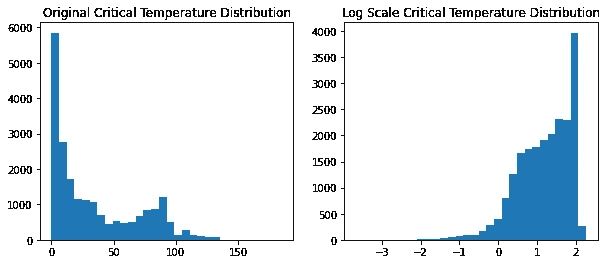

初始临界温度和对数标度临界温度的分布。由作者策划。

有了所有这些预备工作，我们接下来可以快速地通过模型准备的典型阶段，例如定义我们的特性和目标，执行训练/测试分割，以及缩放。

```
*# Define target and potential features*
target **=** 'critical_temp'
features **=** list(df**.**columns)
features**.**remove(target)
features**.**remove('material')

*# Input and output values*
X **=** df[features]
y **=** np**.**log10(df[target]) *# log scale forces values to always be positive and non-zero*

*# Train/test split*
X_train_unscaled, X_test_unscaled, y_train, y_test **=** train_test_split(X, y, test_size**=**0.2, shuffle**=True**)

*# Scale*
s **=** MinMaxScaler()
s**.**fit(X_train_unscaled)
X_train **=** s**.**transform(X_train_unscaled)
X_test **=** s**.**transform(X_test_unscaled)
```

# 回归模型

我们将查看线性回归模型的 3 种不同变化，然后比较梯度推进模型的性能。从一个简单的回归模型开始，我们启动、训练和预测，然后存储我们的预测供以后比较，并绘制结果。

```
*# Initiate and fit linear regression model*
lr **=** LinearRegression()
lr**.**fit(X_train, y_train)

*# Predict on test data*
y_pred **=** lr**.**predict(X_test)
```

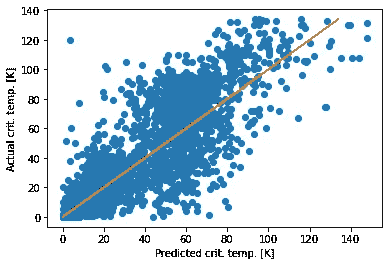

线性回归结果。由作者策划。

正如我们所看到的，预测值和真实值之间肯定存在一般的相关性，但是 R 值相当差。我们可以尝试一个套索或脊模型，以帮助任何可能发生的过度拟合，并获得一些关于一些特征重要性的见解。我们将展示岭回归的代码，并查看套索回归的笔记本。

```
*# Range of alphas (regularization strength)*
alphas **=** np**.**logspace(**-**4,3,20)
*# dataframe to store coefficients*
ridge_coefs **=** pd**.**DataFrame(index**=**alphas,columns**=**features)
*# list to store mse*
ridge_mse **=** []

**for** alpha **in** tqdm(alphas):
    *# Initiate and fit model with given alpha*
    ridge **=** Ridge(alpha**=**alpha)
    ridge**.**fit(X_train, y_train)

    *# Save coefficients*
    ridge_coefs**.**loc[alpha] **=** ridge**.**coef_

    *# Predict on test data*
    y_pred **=** ridge**.**predict(X_test)
```

通过回归，我们希望稳定地增加正则项。随着正则项的增加，每个输入特征的权重向 0 递减。这个概念主要用于防止过度拟合，但是，只要我们对输入数据进行了缩放，我们也能够根据权重的绝对值来查看相对特征重要性。我在 Jupyter 笔记本中有一个很好的交互式绘图，您可以将鼠标悬停在线上来查看显示的功能。下面，我们可以看到基于正则化强度的性能，以及实际性能。

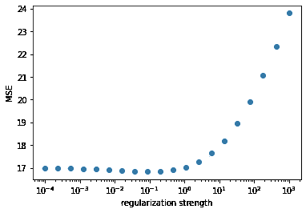

基于岭回归正则化强度的预测精度:请注意，最佳性能约为 0.1。由作者策划。


最优岭正则化的线性回归结果。由作者策划。

不幸的是，结果看起来并没有好到哪里去，我们也没有看到比简单的线性回归更好的结果。然而，在我们继续之前，一定要在笔记本上用套索回归检查一下重量是如何变化的——你会看到一些有趣的趋势！(思考问题:当你使用 150 多种功能时，最重要的功能是什么？如果你只有 5 个特征，最重要的是什么？)

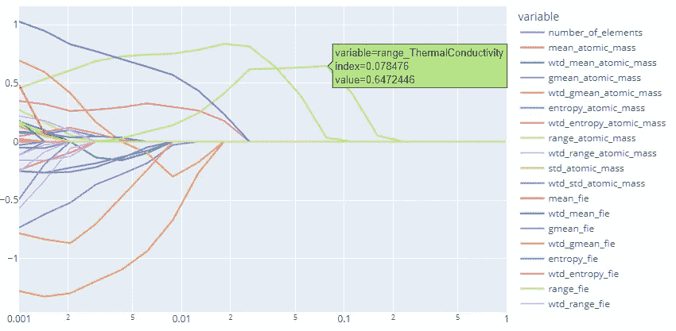

Lasso 回归基于正则化强度的要素权重交互式绘图的屏幕截图。请注意基于正则化强度改变权重的有趣行为。由作者策划。

虽然我们通过查看特征权重获得了一些关于特征重要性的有趣见解，但是让我们转向一个更复杂的模型:梯度增强(我们特别喜欢 XGBoost)。我特别喜欢这个模型，不仅因为它在应用程序中的出色性能，而且它也是在我的母校华盛顿大学提出和开发的(见出版物[此处](https://www.kdd.org/kdd2016/papers/files/rfp0697-chenAemb.pdf))。

```
*# Initialize and fit model*
xgb **=** XGBRegressor()
xgb**.**fit(X_train, y_train)

*# Make and store predictions*
y_pred **=** xgb**.**predict(X_test)
predictions['xgb_raw'] **=** 10******y_pred
```

以下是 XGBoost 模型的结果:

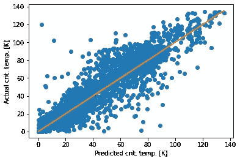

XGBoost 模型结果。由作者策划。

总有改进的空间，但鉴于这是一个开箱即用的模型，它看起来更有前途。我们将继续下去，并对其进行迭代。

# 特征选择

基于各种正则化强度的权重，Lasso 和 Ridge 模型给出了要素重要性的良好初步指示。然而，这些模型仍然表现不佳。XGBRegressor 远远优于任何其他回归算法。有许多选项可以用来查看特征的重要性，但我们将使用的是递归特征消除(RFE)。这将针对所有输入要素训练指定的模型(在本例中为 XGBRegressor ),并显示结果预测性能，然后迭代移除最不重要的要素，并针对要素子集重新训练模型。理想情况下，我们会做交叉验证 RFE，但这种方法已经在计算上很昂贵，所以现在我们将只使用常规 RFE。

```
# Define step size and search space
step = 5
max_features = X_train.shape[1]
min_features = 5
search_space = range(min_features,max_features,step)
# List to store MSE
rmse = []

for n_features in tqdm(search_space):
    # RFE to select n_features
    selector = RFE(estimator = XGBRegressor(), 
                   n_features_to_select = n_features,
                   step = step)
    selector.fit(X_train, y_train)
    # Predict on feature subset and store prediction
    y_pred = selector.predict(X_test) rmse.append(mean_squared_error(10**y_pred,10**y_test,
                                   squared=False))
```

如果我们想获得更详细的信息，我们可以改变步骤，这样在每次迭代中只有一个特征被删除，如果我们做交叉验证，我们可以获得统计数据…但是每一个都增加了计算时间。就我们的目的而言，看到一般趋势就足够了:

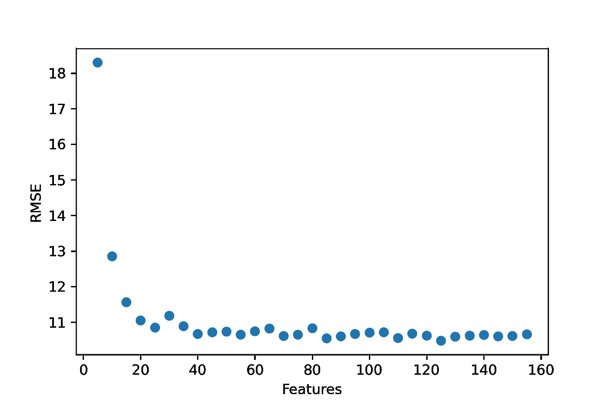

基于要素数量的预测 RMSE，由递归要素消除确定。作者的情节

正如我们所看到的，在大约 20 个功能之后，我们在性能上没有得到太大的改善。我们可以很容易地看到特性排名并打印出来(查看完整打印输出的代码)。你注意到了哪些有趣的观察结果？

```
# Display the rankings
rankings = selector.ranking_
for rank in range(1,max(rankings)):
    print(rank)
    features_index = [i for i, x in enumerate(rankings) if x == rank]
    features_list = [features[i] for i in features_index]
    print(features_list)>>> 1
['gmean_Density', 'wtd_gmean_ElectronAffinity', 'wtd_gmean_ThermalConductivity', 'range_ThermalConductivity', 'wtd_range_ThermalConductivity', 'wtd_mean_Valence', 'wtd_gmean_Valence', 'entropy_Valence', 'wtd_std_Valence', 'Ba', 'Cu', 'Ca', 'Ti', 'Fe', 'Zn', 'Pr', 'Nb', 'Ce', 'Mg', 'Pd']
2
['mean_Density', 'Gd', 'Ni']
3
['range_ElectronAffinity', 'Bi', 'Sn', 'Si', 'Tc']
...
...
...
27
['mean_atomic_mass', 'std_Valence', 'Er', 'H', 'Tb']
28
['number_of_elements', 'Ag', 'I', 'B', 'Be']
```

# 超参数优化

使用我们的 20 个最重要特征的子集，我们现在可以执行最佳模型的超参数优化。回想一下，我们在最初的结果中使用了开箱即用的模型。顺便提一下，我们可能会将特征选择与超参数优化结合在一起，事实上，这对于最终模型来说是可取的，但这在计算上要昂贵得多。

我们将使用`hyperopt`包对搜索空间进行贝叶斯优化。我之前写过一篇关于它的文章，你可以在这里找到[，所以我就不赘述了。下面是一些重要的代码片段，用来定义我们的超参数搜索空间，建立我们的模型，并运行测试:](/advanced-options-with-hyperopt-for-tuning-hyperparameters-in-neural-networks-d108cf7655d9)

```
# Define search space for the hyperparameters of interest
space = {'eta' : hp.uniform('eta',0.01,0.3),
         'gamma' : scope.int(hp.quniform('gamma',0,100,1)),
         'max_depth' : scope.int(hp.quniform('max_depth',2,15,1)),
         'subsample' : hp.uniform('subsample',0.5,1.0),
         'lambda' : hp.loguniform('lambda', -3, 3),
         'colsample_bytree' : hp.uniform('colsample_bytree',0.5,1.0)
        }def xgboost(params):
    # Initialize model with hyperparameters
    xgb = XGBRegressor(eta = params['eta'],
                       gamma = params['gamma'],
                       max_depth = params['max_depth'],
                       subsample = params['subsample'],
                       reg_lambda = params['lambda'],
                       colsample_bytree = params['colsample_bytree']
                      )

    # Split into validation set
    X_train_hyper, X_val, y_train_hyper, y_val = train_test_split(
                 X_train_sub, y_train, test_size=0.2, shuffle=True)

    # Fit
    xgb.fit(X_train_hyper, y_train_hyper)

    # Predict on validation set
    y_pred = xgb.predict(X_val)

    # calculate validation loss
    validation_loss = mean_squared_error(10**y_pred, 10**y_val, 
                                         squared=False)

    return {'loss': validation_loss, 'status': STATUS_OK, 
            'model': xgb, 'params': params}
##################################################################### Initiate trials and start hyperparameter search space for 250   
        iterations
trials = Trials()
best = fmin(xgboost, space, algo=tpe.suggest, max_evals=250, trials=trials)# Find the best model and set of hyperparameters
best_model = trials.results[np.argmin([r['loss'] for r in trials.results])]['model']
best_params = trials.results[np.argmin([r['loss'] for r in trials.results])]['params']
```

真正有趣的是，我们可以根据给定的超参数绘制结果。在某些情况下，我们可以清楚地看到性能和所选超参数值之间的相关性(例如，低伽马和较高 eta 是理想的)。有关这些超参数的深入描述，请参见[该来源](https://www.kaggle.com/code/prashant111/a-guide-on-xgboost-hyperparameters-tuning/notebook)。

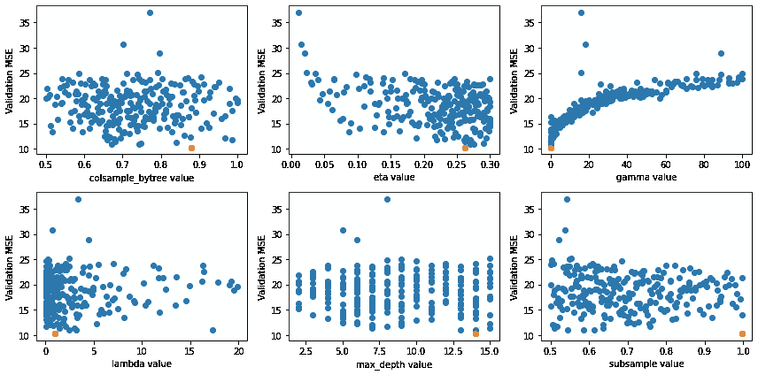

基于超参数值的预测临界温度的 MSE 值。橙色值是最佳值。由作者策划。

在这一点上，我们已经尝试了 6 种不同类型的模型:线性回归，以及 Ridge 和 Lasso 变体，以及使用所有 150 多个特征的现成 XGBoost，使用 20 个特征的最优子集的现成 XGBoost，以及使用 20 个特征的最优子集和超参数优化的 XGBoost 模型(值得一提的是，该图还包括具有最差超参数配置的 XGBoost 模型，这样您就可以看到

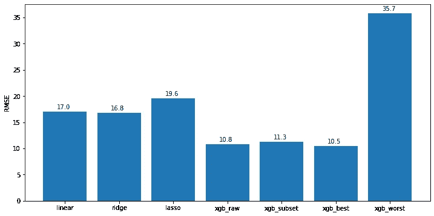

RMSE 对各类模特的表演训练有素。作者的情节

# 识别高性能材料

此时，我们有了一个模型，可以用来预测临界温度。重要的是，我们从 150 多种可能性中确定了 20 种最重要的特征，因此当我们获得新材料时，我们不需要在对其性能有一个好主意之前进行无休止的测量。仅此一项就能节省大量的时间和金钱。但是我们是否也可以利用我们的知识来开发我们可能想要尝试的新材料呢？有无穷无尽的新材料可以探索，但大多数都无助于我们朝着更高临界温度超导体的目标努力。

我正在构建的场景是，我们有大约 200 种潜在的材料，我们希望快速找到具有高临界温度的材料，高于某个阈值(假设我们只对临界温度> 100K 的材料感兴趣)。我们可以随机开始尝试材料，或者创建某种选择函数来寻找最有可能实现高性能的样本。

我开始研究一些聚类算法，但没有一个算法能有效地实现我的目标。所以我想出了一个“伪 k 均值”选择标准。k-means 是一种聚类算法，它基于相似样本的特征和相似性度量来查找相似样本。不幸的是，大多数 k-means 实现使用欧几里德距离，这遭受了维数灾难。即使我们将输入特征从 158 个减少到 20 个，它仍然是相当高维的。虽然余弦相似性在高维度上也有问题(特别是对于稀疏数据)，但它往往更好。因此，该方法是根据与其他已知高性能材料的余弦相似性来选择性能最高的材料。根据本文中[的工作流程，我们接着对样本进行评估，如果符合标准，我们就完成了；否则，我们将样本添加到数据集并重新训练模型。然后，我们可以评估找到具有所需临界温度的样品需要多长时间。](https://arxiv.org/pdf/1704.07423.pdf)

我承认，这里的方法需要做很多工作。我最想尝试一下，也许在某个时候我可以改进它。现在我们有了一个选择函数，所以是时候看看它与随机抽样相比表现如何了。我们在不同的子集上尝试这个场景 50 次，这样我们就有了统计数据。理想情况下，我们希望我们的选择标准能够帮助我们在更少的尝试中找到高性能的材料。

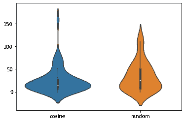

使用余弦相似性搜索标准和随机搜索，在找到临界温度高于给定阈值(100 K)的材料之前尝试的样本数量。由作者策划。

我们确实看到余弦相似性度量有助于我们更快地找到高性能样本，因为较低的值具有较高的峰值。然而，显然还有改进的余地。也许如果我们把门槛设得高一些，我们会看到更大的进步。这是一个非常新的想法，我正在探索，但是，我真的很有兴趣听听你是否见过或做过这些方面的事情，以及它是如何为你工作的！

# 结论

这里面有很多东西，我希望它能给你在你自己的项目或工作中一些想法。虽然机器学习经常被用作进行预测的“黑盒”解决方案，但我们可以利用这些原则和技术在研究实验室或材料科学发展中做出明智的决策。这有几个方面，包括特征选择和重要性排序以消除不必要的测量，以及聚类策略以帮助确定潜在的高性能候选。这些方法可以帮助我们节省时间和金钱，因为我们继续探索我们周围的广阔世界的持续可能性。感谢你阅读这篇文章——我很想听听你对这个话题的想法和主意！请随时在 [LinkedIn](https://www.linkedin.com/in/nicholas-lewis-0366146b/) 上联系我。

## 参考

[1]Dua d .和 Graff c .(2019 年)。UCI 机器学习知识库[http://archive . ics . UCI . edu/ml]。加州欧文:加州大学信息与计算机科学学院。

[2] Hamidieh，Kam，预测超导体临界温度的数据驱动统计模型，计算材料科学，第 154 卷，2018 年 11 月，第 346–354 页