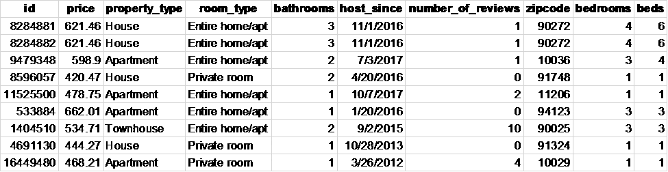
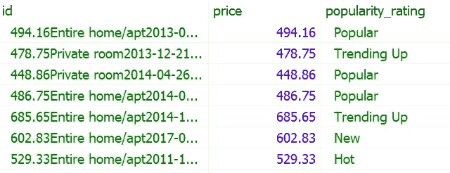

# 用实用程序破解 SQL 面试问题

> 原文：<https://towardsdatascience.com/practical-sql-questions-for-data-science-interview-3b5c9d726baa>

## 逐步解决 SQL 面试问题


Andrea Davis 在 [Unsplash](https://unsplash.com?utm_source=medium&utm_medium=referral) 上拍摄的照片

在本文中，我们将回顾 Airbnb 数据科学访谈中的一个 SQL 问题。我希望本文中解释的过程能够帮助您更有效地编写 SQL 查询。

SQL 问题:

```
**Host Popularity Rental Prices**You’re given a table of rental property searches by users. The table consists of search results and outputs host information for searchers. Find the minimum, average, maximum rental prices for each host’s popularity rating. The host’s popularity rating is defined as below: 
0 reviews: New 
1 to 5 reviews: Rising 
6 to 15 reviews: Trending Up 
16 to 40 reviews: Popular 
more than 40 reviews: HotSource: [stratascratch.com](https://platform.stratascratch.com/coding/9632-host-popularity-rental-prices?code_type=1)
```

表格:airbnb _ 主机 _ 搜索



作者图片

**第一步**:在我们开始编写查询之前，我们需要检查原始数据并提出问题，以便更好地理解相关信息。这不是大学考试，我们可以向面试官或数据制作者提出任何合理的问题和假设。比如，

*   数据集是否包含重复的属性？我们如何唯一地识别一个属性？我们可以使用字段“ID”来唯一地标识一个属性吗？在本练习中，ID 表示搜索 ID，它与属性 ID 无关，因此，在本练习中我们可以忽略该字段。是的，数据集中有重复的属性，因为用户可能会从不同的搜索中查看相同的属性，并且所有搜索输出(包括重复的)都将记录在原始数据中。我们需要向面试官提出重复的问题，因为包括重复会产生一个扭曲的结果。所以我们需要想办法自己去鉴定一个房产(下一步会多讲)。
*   这个问题似乎表明，主持人的受欢迎程度是根据评论的数量来定义的。原始数据是否包括给定物业的历史和最近评论数？如果是这样，我们需要澄清如何确定最近的审查数量。例如，“搜索日期”是否可用？但是对于这个练习，数据集只包含一个属性最近的评论数量，因此，我们不需要担心找到最近的评论数量。

**步骤 2** :并非原始数据中的所有字段都会被使用。我们需要确定**相关变量**和任何**额外的**变量，我们需要自己创建这些变量来解决问题。在这个练习中，我们需要以下变量。

*   属性 ID:我们需要找到唯一标识属性的方法。一种连接几个特征变量的常见方法，如价格、房间类型、host_since、邮政编码和评论数量。通过组合不同的字段，我们应该能够唯一地标识一个属性。
*   主持人的受欢迎程度评级:根据评论的数量，酒店评级分为“新”、“上升”、“上升趋势”、“受欢迎”和“热门”。
*   价格:这个变量在原始数据中很容易得到。基于原始价格信息，我们可以计算给定流行度评级类别的最小值、平均值和最大值。

第三步:我们需要准备数据，为分析做好准备。在这一步中，我们将专注于保存和构建我们在第 2 步中确定的变量。

我们可以使用`CONCAT(price, room_type, host_since, zipcode, number_of_reviews)`来创建属性 ID。

主持人的受欢迎程度评级需要做一些工作，因为它将根据评论的数量被分配不同的值(即，“新”、“上升”、“趋势上升”、“受欢迎”和“热门”)。`CAEE-WHEN-END`函数是处理多个条件语句的完美函数。

原始数据中存在重复数据，我们需要通过删除重复观测值来准备数据，否则，在计算平均值、最小值和最大值时，我们会得到不准确的结果。增加`DISTINCT`可以解决这个问题。

我们可以运行下面的查询来准备数据。

```
SELECT **DISTINCT** CONCAT(price, room_type, host_since, zipcode, number_of_reviews) AS **id**, **price**,CASEWHEN number_of_reviews = 0 THEN 'New'WHEN number_of_reviews >=1  AND number_of_reviews <=5  THEN 'Rising'WHEN number_of_reviews >=6  AND number_of_reviews <=15 THEN 'Trending Up'WHEN number_of_reviews >=16 AND number_of_reviews <=40 THEN 'Popular'WHEN number_of_reviews >40 THEN 'Hot'END AS **popularity_rating**FROM airbnb_host_searches
```

我们期望得到的初步数据集类似于下表。我们有一个物业 ID，它代表一个独特的物业及其租赁价格和受欢迎程度。



作者图片

**第四步**:找到编写查询的最有效方法。子查询和公用表表达式(CTE)都是处理复杂 SQL 查询的有用工具。我发现 CTE 比子查询更有效，更有优势。

根据设计，CTE 是可重复使用的。不必在需要使用子查询的每个地方都声明相同的子查询，可以使用 CTE 定义一次临时表，然后在需要时引用它。

CTE 比子查询更具可读性。因为 CTE 可以重用，所以使用 CTE 比使用子查询可以编写更少的代码。此外，人们倾向于按照顺序而不是嵌套的方式更容易地遵循逻辑和思想。编写查询时，使用 CTE 可以更容易地将复杂的查询分解成较小的部分。

对于本练习，我们可以使用`WITH`语句准备步骤 3 中的数据，并将其存储在一个名为 cte 的临时表中。然后，我们将使用 SQL 聚合函数、`MIN()`、`AVG()`、`MAX()`来计算带有`GROUP BY`的每个人气评级类别的最低、平均和最高租赁价格。

最终的解决方案如下所示:

```
WITH cte AS(SELECT DISTINCT CONCAT(price, room_type, host_since, zipcode, number_of_reviews) AS id, price,CASEWHEN number_of_reviews = 0 THEN 'New'WHEN number_of_reviews >=1  AND number_of_reviews <=5  THEN 'Rising'WHEN number_of_reviews >=6  AND number_of_reviews <=15 THEN 'Trending Up'WHEN number_of_reviews >=16 AND number_of_reviews <=40 THEN 'Popular'WHEN number_of_reviews >40 THEN 'Hot'END AS popularity_ratingFROM airbnb_host_searches)SELECT popularity_rating,MIN(price) price_min,AVG(price) price_avg,MAX(price) price_maxFROM cteGROUP BY popularity_rating
```

该查询将产生答案:


作者图片

解决 SQL 问题类似于侦探工作。你被测试把分散的拼图拼在一起，还需要逻辑合理地解释步骤。这里的关键是让面试官或你的同事参与到这个过程中来，这样他们就能理解你的观点和你做出的任何假设。

如果你想探索更多的 **SQL 面试问题**，请查看我的文章:

*   [**综合 SQL 小抄**](https://medium.com/geekculture/comprehensive-sql-cheat-sheet-f821c5abf85a)
*   [**破解 SQL 面试问题的有用程序**](/practical-sql-questions-for-data-science-interview-3b5c9d726baa)
*   [**破解 SQL 面试问题:子查询 vs CTE**](/sql-for-data-analysis-subquery-vs-cte-699ef629d9eb)
*   [**破解 SQL 面试问题:Join vs Case-When 语句**](/crack-sql-interview-question-join-vs-case-when-statement-116d40a361f0)
*   [**破解 SQL 面试题:带分区的窗口函数——By**](/crack-sql-interview-question-window-functions-with-partition-by-599d792c07c3)
*   [**破解 SQL 面试问题:Date_Part 函数**](/crack-sql-interview-question-date-part-function-aff0b15478d9)
*   [**破解 SQL 面试题:ROW_NUMBER、RANK 和 DENSE_RANK**](https://medium.com/geekculture/crack-sql-interview-questions-row-number-rank-and-dense-rank-ef439749f3ff)
*   [**破解 SQL 面试问题:UNNEST，STRING_TO_ARRAY**](https://python.plainenglish.io/crack-sql-interview-question-unnest-string-to-array-1b75578cbe75)
*   [**破解 SQL 面试问题:GENERATE_SERIES，STRING_AGG，SPLIT_PART**](https://medium.com/geekculture/crack-sql-interview-question-generate-series-string-agg-split-part-fbc0e5e42d7d)
*   [**破解 SQL 面试问题:自连接和非等同连接**](https://medium.com/geekculture/crack-sql-interview-question-self-join-and-non-equi-join-1cb2a181104a)
*   [**破解 SQL 面试问题:任意运算符**](https://medium.com/geekculture/crack-sql-interview-question-any-operator-d39e07e0e224)
*   [**破解 SQL 面试问题:子查询**](https://medium.com/geekculture/crack-sql-interview-question-subquery-d9db4763eef4)

# 感谢您的阅读！！！

如果你喜欢这篇文章，并且想**请我喝杯咖啡，**请[点击这里](https://ko-fi.com/aaronzhu)。

您可以注册一个 [**会员**](https://aaron-zhu.medium.com/membership) 来解锁我的文章的全部访问权限，并且可以无限制地访问介质上的所有内容。如果你想在我发表新文章时收到电子邮件通知，请订阅。