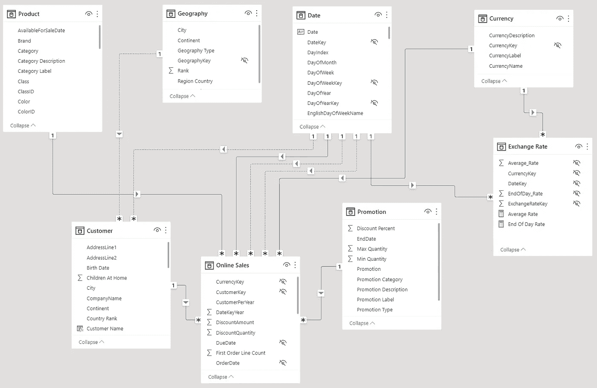

# Power BI 的预计算聚合—为什么要避免它们

> 原文：<https://towardsdatascience.com/pre-calculated-aggregations-for-power-bi-why-should-you-avoid-them-371abdec5bb4>

## 我的一个客户总是希望在他的 Excel 文件中预先计算聚合，然后在 Power BI 中使用。以下是我们应该避免这样做的原因。


由[万花筒](https://unsplash.com/@kaleidico?utm_source=medium&utm_medium=referral)在 [Unsplash](https://unsplash.com?utm_source=medium&utm_medium=referral) 上拍摄的照片

# 介绍

不久前，我开始为一个新客户工作。

我的任务之一是向他们咨询如何使用 Power BI 和解决挑战。

他们大部分时间从应用程序或其他数据库导出 Excel 和 CSV 数据。我的客户决定获取聚合数据，以避免大型数据集并简化他的 DAX 计算。

事实证明，这个决定并不那么好。

# 什么是预聚合

我的客户开始从他的源系统提取数据到 Excel 文件中。

接下来，他开始使用 Excel 宏将数据预聚合为 YTD 和 YE 值。或者，他从一开始就以汇总的方式导出数据。

之后，他将汇总的数据导入 Power BI，并开始设计报告。

但是，我不得不说，他的大多数数据都是快照数据，他只需选择一个快照就可以看到所需的结果。

另一种预汇总数据的方法是消除数据中的细节。

例如，查看 Contoso 数据集的以下数据模型:



图 Contoso 数据集的互联网销售部分(图片由作者提供)

现在，假设我对每个客户的销售细节不感兴趣，而只对每个地理区域感兴趣。

我可以从客户表中删除客户属性，只保留地理信息，如国家、地区、城市、邮政编码等。

通过删除客户属性，我可以将在线销售表中的数据聚合到邮政编码级别，并减少数据量。

结果，我丢失了所有客户的详细信息。

# 预聚集的缺点

在大多数情况下，我的客户的方法满足了他的要求。

但是，一旦他想做一些时间智能或其他复杂的计算，他就必须在 Excel 文件中添加越来越多的复杂性来满足需求。

当您预汇总数据时，您必须考虑所有需要的维度。维度越多，可以聚合的数据就越少。

此外，当您必须添加一个维度或增加粒度(添加更多细节)时，您必须重新开始并重新计算所有的聚合。

# 预聚合的优势

预聚合数据的主要好处是减少数据量。我在上面的例子中通过消除客户的详细属性展示了这种效果。

但这仅在原始数据包含数千万或数亿行时才有意义。

预聚合几千行数据是没有意义的，因为 power BI 认为即使是几十万行也是小数据。

我会考虑 Power BI 中的聚合表特性，而不是手动预聚合我的数据。

在我看来，手动预聚合数据并没有真正的好处。

# DAX 指标的复杂性

我的客户抱怨在处理原始数据而不是预汇总数据时测量的复杂性。

然后，发生了一件事。

我们开始处理一个新的报告，它有许多表格，但是仍然有少量的数据(几千行)。

他开始在 Excel 中创建预先聚合和预先计算的表格，以保持 DAX 指标的简单性。

他创建了具有月度年末(YE)和年初至今(YTD)值的列，并要求我开发需求所要求的所有 DAX 度量。

因此，我不能用一个简单的 SUM()函数来创建度量。我必须开发股票度量来获得数据的最近一年或年初至今的值。

您可以阅读以下文章，了解使用股票(半累加性)度量时会发生什么:

[](/refinement-of-semi-additive-measures-in-dax-4e148fa83f56) [## DAX 中半可加测度的精化

### 在之前的故事中，我解释了一些关于半加性测度的细节。这里有更多关于这个话题的提示

towardsdatascience.com](/refinement-of-semi-additive-measures-in-dax-4e148fa83f56) 

现在，查看以下度量，从预聚合数据中获取最新的 YTD 行:

```
Value =
 VAR LastDateOfData = LASTNONBLANK (SUM(YTD_ValueColumn)
 ,’SourceTable’[DateColumn])RETURN
 CALCULATE (SUM(YTD_ValueColumn)
 ,LastDateOfData
 )
```

然后，看看这个衡量标准，如果我有访问原始数据的权限，我会使用它:

```
Value = TOTALYTD(SUM(ValueColumn)
 ,’Date’[Date])
```

如您所见，从原始数据计算 YTD 比从数据中检索最后一个预聚合值要容易得多。

我说服了我的客户不要预先汇总数据，用这个论点来处理原始数据。

# 日期的问题

使用预聚合数据时还有另一个问题。

在我的例子中，我的客户通过按天消除粒度来计算聚合。

他总是将数据汇总到月或年级别。

平心而论，他的一些数据是预测数据，不是日常才有的。

我们必须使用时间智能和与时间相关的报告，并且我们必须确保所有行都指向每月相同的日期。例如，我们将所有数据设置为每月的第一天。

幸运的是，当您转换一个月以来的列时，Power BI 会自动完成这项工作。

例如:

数据看起来是这样的:2022–04

当您将这样的列转换为日期数据类型时，结果是:2022–04–01

听起来很容易。

但是，当我的客户准备一些数据指向这个月的最后一天时，事情变得复杂了。

我不得不返回到 Power Query，将这些列上的日期更改为所有表的同一天。

同样，当我们使用原始数据时，这种复杂性是不必要的。

# 结论

如果您很难将原始数据存储在 Power BI 或其他具有内存数据存储的报告工具中，那么预聚合数据可能是一个好主意。

在这种情况下，预聚合数据可能是提高报表性能或能够将数据存储在数据模型中的有效方法。

在任何情况下，我都强烈建议考虑日期因素，将数据保存在一天的级别上，或者在每个月的同一天汇总所有数据。

这种方法将允许您编写更简单的时间智能度量。

如果你对数据量没有问题，我建议避免预先汇总你的数据。

在处理原始数据时，您将获得更直接、更简单的测量方法。


埃利斯·陈嘉炜在 [Unsplash](https://unsplash.com?utm_source=medium&utm_medium=referral) 上拍摄的照片

# 参考

我使用 Contoso 样本数据集，就像我以前的文章一样。你可以从微软[这里](https://www.microsoft.com/en-us/download/details.aspx?id=18279)免费下载 ContosoRetailDW 数据集。

Contoso 数据可以在 MIT 许可下自由使用，如这里的[所述](https://github.com/microsoft/Power-BI-Embedded-Contoso-Sales-Demo)。

[](https://medium.com/@salvatorecagliari/membership) [## 通过我的推荐链接加入 Medium-Salvatore Cagliari

### 作为一个媒体会员，你的会员费的一部分会给你阅读的作家，你可以完全接触到每一个故事…

medium.com](https://medium.com/@salvatorecagliari/membership)