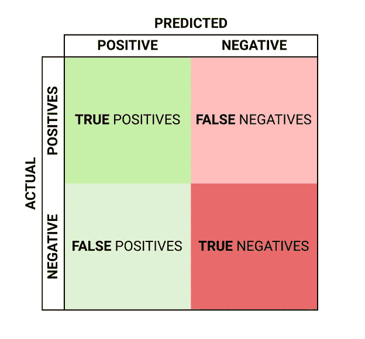
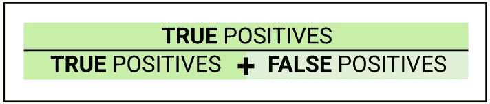
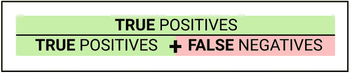
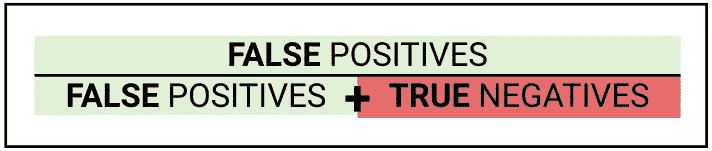
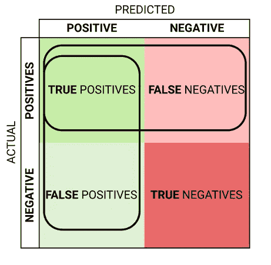
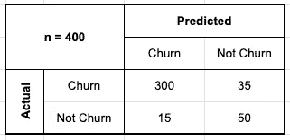
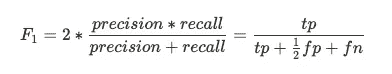

# 如何学习精确和回忆的定义(永久)

> 原文：<https://towardsdatascience.com/precision-and-recall-88a3776c8007>

## 为什么我总是记不住这些的意思？！

奥利弗·布赫曼在 [Unsplash](https://unsplash.com?utm_source=medium&utm_medium=referral) 上拍摄的照片

# 介绍

也许你是数据科学的新手，或者像我一样，你已经有了一些数据科学的经验和 T2 糟糕的记忆。想象一下…你正在训练模型，运行实验，并准备进行部署。你身边有一个产品团队，他们开发了一个新的应用程序功能，你希望他们将新的分类模型集成到下一个版本中。你已经分享了你的一些指标。然后灾难来袭；*有人问你什么是精度和召回……*

总有一些术语和概念我根本记不住。 **精度**和**召回**就是很好的例子。这篇文章主要是让我最终学会这些定义，但希望你能从我糟糕的记忆力中受益！

本文涵盖了学习和交流这些概念的不同方法。为了从这篇文章中获得最大的收获，您应该有一些对简单分类模型进行训练和评分的经验。

# 目录

*   [从混淆矩阵](#b768)开始
    - [提醒计算](#de17)
*   [作为一个句子](#ca07)
*   [打个比方](#908b)
*   [把它放在上下文中](#0b14)
*   [再来几个视觉效果](#72e6)
*   [结论](#9080)

# 从混淆矩阵开始

不管你最终用什么方法来解释或记忆**精度**和**回忆**，一个必不可少的起点是**混淆矩阵。**

标准混淆矩阵。作者图片

## 计算的提示

我们现在可以写出与上述矩阵有关的计算结果。

**精度**

**精度**的计算方法是将真阳性除以任何被预测为阳性的值。

**召回**

**召回**(或真阳性率)是通过将真阳性除以任何本应被预测为阳性的值来计算的。

**假阳性率**

为了完整起见，我们还来看看假阳性率的计算。

通过圈出相关字段，我们可以直观地将它们与混淆矩阵联系起来。

我们现在已经定义了**精度**和**召回**，并将它们关联回混淆矩阵。在这一点上，我已经解释了这些指标，并开始用一些可视化的方法来记忆它们。现在让我们明确地看一下这些术语，如果你不是视觉学习者，这可能会有帮助。

# 作为一个句子

Deepai.org 的[有很好的定义，我已经改编并引用在下面。](https://deepai.org/machine-learning-glossary-and-terms/precision-and-recall)

我们也可以把这些问题框起来，我发现这是记忆这些问题的一种特别有用的方式。

## 精确

> 模型检索的**个实例中与**相关的**实例的数量。**

**有多少检索到的项目是相关的？**

## 回忆

> 在全部**相关**实例**中，模型**正确识别为相关**的实例数量。**

**检索到多少个相关项目？**

# 类比

当向非技术用户解释概念时，类比总是一种有用的方法。对一些人来说，这也是记忆一些东西的好方法。Reddit 用户 u/question_23 在[这篇文章](https://www.reddit.com/r/datascience/comments/qdai89/i_just_explained_recallprecision_to_a_nonds_and/)中以一种非常好的方式使用了一个关于精确度和召回率的常见类比，我将它转述如下:

> 像用网捕鱼一样解释。你用一张大网，在一个湖里捕 100 条鱼中的 80 条。这是 80%的召回率。但是你也能在你的网中得到 80 块石头。这意味着 50%的精度，一半的网络内容是垃圾。
> 
> 你可以用一个小一点的网，瞄准湖中有很多鱼但没有石头的地方，但是你可能为了得到 0 块石头只能得到 20 条鱼。也就是 20%的召回率和 100%的准确率。

# 将它放入上下文中

充分理解一个主题有助于记忆，让我们来看看一些与精确度和回忆有关的常见情况。

## 计算

假设您正试图**预测客户流失**，使用分类模型和一些数据。您已经训练了模型，并根据测试数据集进行了一些预测。这些是结果:

客户流失模型的结果。图片作者。

**精度** = 300/(300+15) = 95.2%

**回忆** = 300/(300+35) = 89.6%

## 百分百是什么样子的？

从上面继续，这两个指标的 100%会是什么样子？

**100%精度:**无假阳性，每一个阳性预测都是正确的。

**100%召回:**没有假阴性，每一个阴性预测都是正确的。

## 与其他通用指标的关系

**F1 得分**

F1 分数只是精确度和回忆的调和平均值。我们也可以从真正的正面和负面来考虑这个问题。

F1 得分公式。图片作者。

**ROC AUC**

ROC(接收器操作特性)曲线是可视化分类模型性能的一种很好的方式，曲线下面积(AUC)是一种非常常用的度量，用于比较不同的机器学习模型。

为了绘制 ROC 曲线，我们绘制了不同分类概率阈值的真阳性率对假阳性率(例如，> 50% = *真*对> 90%= *真*)。

记住，真正的阳性率和回忆是一样的。

**何时使用这些指标？**

neptune.ai 的这篇博客文章对何时使用这些不同的指标进行了很好的讨论。

[https://neptune.ai/blog/f1-score-accuracy-roc-auc-pr-auc](https://neptune.ai/blog/f1-score-accuracy-roc-auc-pr-auc)

# 再来几张图片

我还在网上搜索了一些其他的好方法来形象化这些概念。希望这些真的能说明问题。

维基百科使用圆形、方形和颜色进行了很好的可视化(注意本文中特异性和精确性的区别):

 [## 敏感性和特异性—维基百科

### 敏感性和特异性从数学上描述了一项检测的准确性，该检测报告了一种抗原的存在或不存在

en.wikipedia.org](https://en.wikipedia.org/wiki/Sensitivity_and_specificity) 

这篇中型文章也有一些非常好的文氏图:

 [## 解释精确度和召回率

### 在进入 NLP 的最初几天和几周，我很难理解精确、回忆和…

medium.com](https://medium.com/@klintcho/explaining-precision-and-recall-c770eb9c69e9) 

这也是一个很好的例子和解释

 [## 信息检索中的精确度和召回率

### 最近和一个同事聊天。他在必应搜索工作。他提到了精确和回忆。这提醒了我…

jamesmccaffrey.wordpress.com](https://jamesmccaffrey.wordpress.com/2016/10/24/precision-and-recall-in-information-retrieval/) 

# 结论

这篇文章的目的是让我最终记住精确和回忆，老实说，我认为这很有帮助。看看这些定义、问题和观想，看看是什么帮助你在大脑中巩固这些知识。

有没有什么机器学习概念是你永远记不住，但应该记住的？请在评论中告诉我！

## 了解更多信息

 [## 清理逻辑回归

### 非数学家指南

towardsdatascience.com](/simple-logistic-regression-a9735ed23abd)  [## 面向非技术受众的随机森林

### 今天最广泛使用的算法之一实际上很难解释…

towardsdatascience.com](/random-forest-29cf337c68d4)