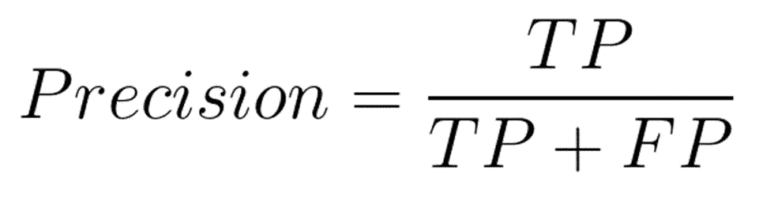
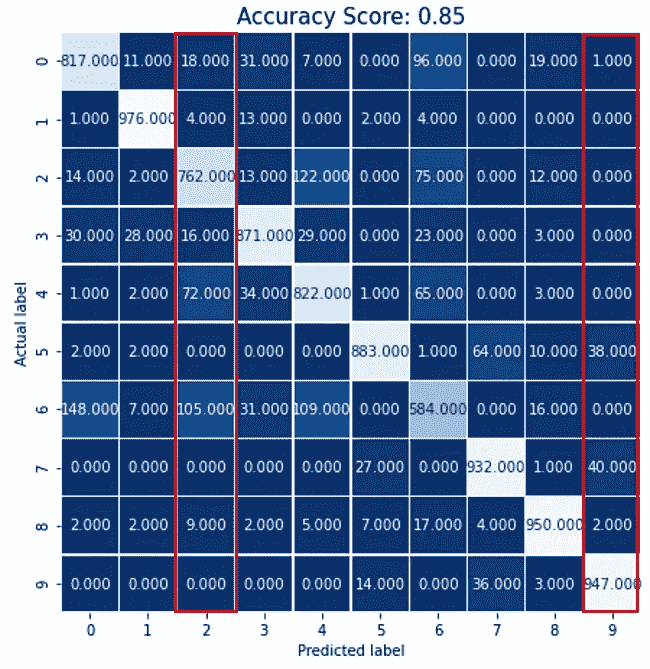
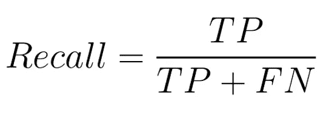
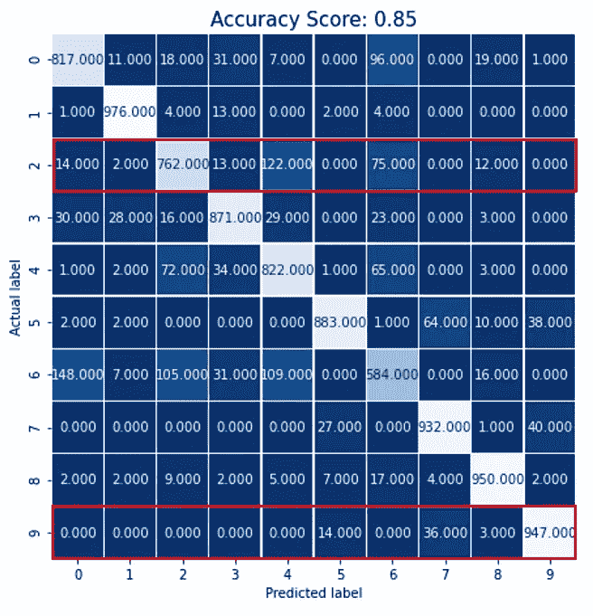
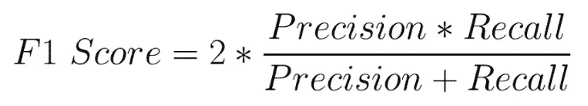
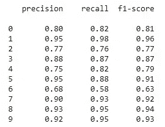
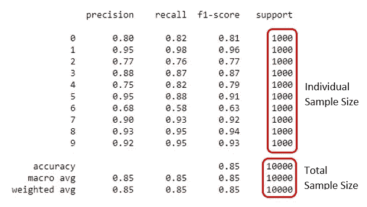

# 深入了解多类分类的精确度、召回率和 F1 值

> 原文：<https://towardsdatascience.com/precision-recall-and-f1-score-of-multiclass-classification-learn-in-depth-6c194b217629>


维克多·瓦西塞克在 [Unsplash](https://unsplash.com?utm_source=medium&utm_medium=referral) 上的照片

## 从混淆矩阵手动计算和 sklearn 库的语法

精确度、召回率和 f1 值是评估分类算法时非常常用的指标。现在使用库或包来计算它们是非常容易的。但是我相信理解幕后发生的事情对于真正理解输出也是很重要的。

如果这些概念对您来说是全新的，我建议您先阅读这篇文章，其中详细解释了精确度、召回率和 f1 分数的概念。

[](/a-complete-understanding-of-precision-recall-and-f-score-concepts-23dc44defef6) [## 完全理解精确度、召回率和 F 分数的概念

### 机器学习中如何处理倾斜数据集

towardsdatascience.com](/a-complete-understanding-of-precision-recall-and-f-score-concepts-23dc44defef6) 

本文将关注多类分类模型的精确度、召回率和 f1 值。

## 精确

作为复习，精度是真阳性的数量除以总阳性预测的数量。换句话说，precision 找出了实际上有多少预测值是正数。

下面是精度的公式:



作者图片

这里，

TP =真阳性

FP =假阳性

我们将看到如何从一个多分类模型的混淆矩阵中计算精度。考虑这个混淆矩阵:



作者图片

如你所见，这个混淆矩阵是一个 10 x 10 的矩阵。因为这个模型有 10 个类。当我们处理二进制分类时，混淆矩阵是 2 x 2，因为二进制分类有 2 个类。

我将这个混淆矩阵表示为热图，以便更好地了解实际标签在 x 轴上的位置以及预测标签在 y 轴上的位置。该模型有 10 个类，用数字 0 到 9 表示。

> **这里的真阳性和假阳性是什么？**

我们将通过几个例子来理解它。让我们以标签 9 为例进行演示。标签 9 的真正阳性应该是实际上是 9 并且预测也是 9 的样本。在上面的热图中，947(看右下角的单元格)是真正的正数，因为它们被预测为 9，而实际标签也是 9。

我们来看看什么是误报。看，当我们处理 9 号标签时，只有 9 号标签是阳性的，其他标签都是阴性的。在预测标签为 9 的列中，仅对于 947 个数据，实际标签也是 9。该列中的其余数据(用红色标记)被模型错误地预测为 9。他们的实际标签不是 9。所以标签 9 的误报是(1+38+40+2)。

标签 9 的精度为:

947/ (947 + 1 + 38 + 40 + 2) = 0.92

标签 9 的精度是 0.92，非常高。因为差不多接近 1 了。

> 如果模型是完美的，就不应该有任何假阳性。如果误报为 0，精度将为 TP/TP，即 1。

我们将再举一个例子。让我们也计算一下标签 2 的精度。

首先，从热图中找到实际标签和预测标签都为 2 交叉单元格。看第二栏。是 762(浅色的细胞)。其余细胞为假阳性。当我们考虑标签 2 时，只有标签 2 是正的，所有其他标签都是负的。因此，在第 2 列中，标签 2 的所有其他值实际上都是负值，但是我们的模型错误地将它们预测为标签 2。

标签 2 的精度:762/(762+18+4+16+72+105+9)= 0.77

同样，您可以计算每个标签的精度。

## 回忆

召回是真阳性除以真阳性和假阴性。换句话说，回忆衡量的是模型预测积极事物的能力。

公式如下:



作者图片

我们将再次计算标签 9 和标签 2 的召回。所以，真正的积极因素是一样的。但这次我们需要找出假阴性。我建议试着先想想什么可能是假阴性，然后看看这里的解释。

这又是热图:



作者图片

看这里，红色的矩形有不同的方向。我们来看看为什么。

> 什么是假阴性？

假阴性是实际上是阳性但被预测为阴性的样本。让我们考虑标签 9。提醒一下，当我们处理标签 9 时，标签 9 是唯一的阳性，其余的标签都是阴性。看第九排。所有的样本实际上都是阳性的。但是有 947 个样本被预测为阳性。但是 14 + 36 + 3 个样本被预测为阴性。这些是标签 9 的假阴性。

标签 9 的召回:947 / (947 + 14 + 36 + 3) = 0.947

同样，标签 2 的召回是:

762 / (762 + 14 + 2 + 13 + 122 + 75 + 12) = 0.762

您可以使用同样的方法计算每个标签的召回率。

## F1 分数

F1 分数是精确度和召回率的调和平均值。只是提醒一下，这不是算术平均值。如果 precision 为 0，recall 为 1，f1 分数将为 0，而不是 0.5。公式如下:



作者图片

让我们使用标签 9 和标签 2 的精度和召回，并使用此公式找出 f1 分数。

标签 9 的 F1 分数:2 * 0.92 * 0.947/(0.92+0.947)= 0.933

标签 2 的 F1 分数:2 * 0.77 * 0.762/(0.77+0.762)= 0.766

我相信你现在已经知道如何计算多类分类问题中每个标签的精度、召回率和 f1 值。

但是我们仍然需要一个模型的单精度、召回率和 f1 值。**我们如何得到它？**

## 宏观平均和加权平均精度、召回率和 F1 分数

有两种不同的方法可以获得模型的单一精度、召回率和 f1 值。

**先说精度。**我们需要所有标签的精度来找出模型的单精度。但是我们在这里只展示了标签 9 和 2 的精度。请随意使用我们在此演示的相同方法计算所有标签的精度。

在下表中，我列出了所有标签的精确度、召回率和 f1 值。



作者图片

**宏平均精度**是所有标签精度的简单算术平均值。因此，该模型的宏观平均精度为:

精度=(0.80+0.95+0.77+0.88+0.75+0.95+0.68+0.90+0.93+0.92)/10 = 0.853

> 请随意以同样的方式计算该模型的宏观平均召回率和宏观平均 f1 分数。

加权平均精度还考虑了每个标签的样本数。

该数据集中每个标签的样本数如下:

0 — — 760

1 — — 900

2 — — 535

3 — — 843

4 — — 801

5 — — 779

6 — — 640

7 — — 791

8 — — 921

9 — — 576

该模型的加权平均精度是样本数乘以单个标签的精度，再除以样本总数。

样本总数将是所有单个样本的总和:

760 + 900 + 535 + 848 + 801 + 779 + 640 + 791 + 921 + 576 = 7546

为了计算加权平均精度，我们将每个标签的精度乘以它们的样本大小，然后除以我们刚刚找到的样本总数。

(760*0.80 + 900*0.95 +535*0.77 + 843*0.88 + 801*0.75 + 779*0.95 + 640*0.68 + 791*0.90 + 921*0.93 + 576*0.92) / 7546 = 0.86

如你所见，算术平均值和加权平均值略有不同。**如果单个标签的样本量相同，算术平均值将与加权平均值完全相同。**

## Sklearn 函数

好消息是，你不需要用这种方式计算精确度、召回率和 f1 分数。Scikit-learn library 有一个函数**‘classification _ report’**，它分别为您提供每个标签的精确度、召回率和 f1 分数，以及模型的精确度分数、单个宏平均值和加权平均值精确度、召回率和 f1 分数。下面是语法:

```
from sklearn import metrics
print(metrics.classification_report(y_test, y_pred))
```

这里，y_test 是测试数据的原始标签，y_pred 是使用模型预测的标签。

该函数还为您提供了一个名为“support”的列，它是每个标签的单个样本大小。对应于精确度、宏平均值和加权平均值的支持值是数据集的总样本大小。



作者图片

> 上图可以看到支持值都是 1000。这意味着所有标签的样本量是 1000。

我上面说过，如果每个标签的样本量相同，那么宏观平均和加权平均也就相同。你可以看到，在这张图中，宏观平均和加权平均都是一样的。

您将在此链接中找到分类项目的完整代码以及我是如何获得上表的:

[](https://github.com/rashida048/Few-Machine-Learning-projects/blob/master/image_classification_problems.ipynb) [## 少数机器学习项目/image _ class ification _ problems . ipynb at master…

### 这些项目使用 pandas，matplotlib，numpy，scipy 和 scikitlearn …

github.com](https://github.com/rashida048/Few-Machine-Learning-projects/blob/master/image_classification_problems.ipynb) 

## 结论

本文解释了如何从给定的混淆矩阵手动计算多类分类的单个标签的精度、召回率和 f1 值，以及多类分类模型的单精度、召回率和 f1 值。我们还讨论了如何使用 scikit-learn 库中的一行代码非常容易地获得它们。希望对你有帮助。

下面的视频解释了同样的概念:

欢迎在推特上关注我，喜欢我的 T2 脸书页面。

## 更多阅读

[](https://pub.towardsai.net/complete-detailed-tutorial-on-linear-regression-in-python-for-beginners-f9fa3f65faca) [## 针对初学者的 Python 线性回归完整详细教程

### 线性回归 Scikit-Learn 中的基本、简单和多元线性回归实现

pub.towardsai.net](https://pub.towardsai.net/complete-detailed-tutorial-on-linear-regression-in-python-for-beginners-f9fa3f65faca) [](/simple-explanation-on-how-decision-tree-algorithm-makes-decisions-34f56be344e9) [## 浅谈决策树算法如何决策

### 决策树算法背后的直觉

towardsdatascience.com](/simple-explanation-on-how-decision-tree-algorithm-makes-decisions-34f56be344e9) [](https://pub.towardsai.net/data-analysis-91a38207c92b) [## 数据分析

### Python 中数据科学家/分析师日常工作中的常见数据清理任务

pub.towardsai.net](https://pub.towardsai.net/data-analysis-91a38207c92b) [](/a-complete-guide-for-detecting-and-dealing-with-outliers-bad26b1e92b6) [## 检测和处理异常值的完整指南

### 6 种检测异常值的方法和 4 种处理异常值的方法

towardsdatascience.com](/a-complete-guide-for-detecting-and-dealing-with-outliers-bad26b1e92b6) [](/6-tips-for-dealing-with-null-values-e16d1d1a1b33) [## 处理空值的 6 个技巧

### 包括迭代方法、平均值和中值填充以及分组依据、平均值和中值填充

towardsdatascience.com](/6-tips-for-dealing-with-null-values-e16d1d1a1b33)