# 预测你的模型的性能(不需要等待控制组)

> 原文：<https://towardsdatascience.com/predict-your-models-performance-without-waiting-for-the-control-group-3f5c9363a7da>

## NannyML 的一种新算法允许在基础事实可用之前估计 ML 模型的性能。这是它的工作原理。

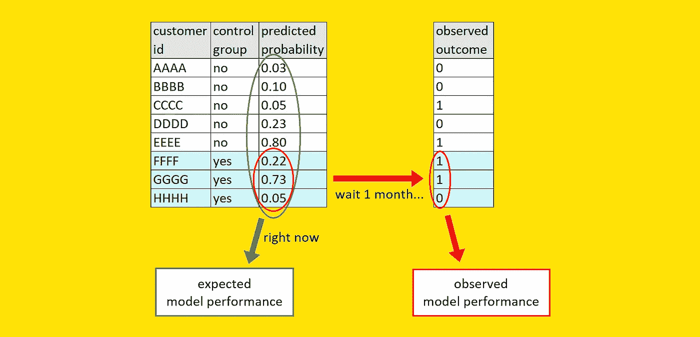

[图片由作者提供]

现在，你的预测模型已经建立并开始运行了。您已经开发、测试并最终部署了它。在向利益相关者展示时，您提到该模型在回溯测试数据上实现了 75%的精确度和 25%的召回率。他们会问:“**但是在目前活跃的客户中表现如何呢？**”。重点是:

> **没人对你的模型在旧数据上的表现感兴趣。唯一重要的是该模型将如何处理新数据**。

但是，为了知道这一点，你必须等待观察目标变量，这可能需要很长时间。我们可以称之为“**延迟表现的诅咒**”:你需要现在就做出决定，但是你只能在未来获得完整的信息。

我以为这个问题无解，直到最近看了 NannyML (一个专注于部署后数据科学的开源库)的[这篇文章。他们提出了一种叫做“**基于信心的性能评估**”(CBPE)的算法。该方法允许**通过使用预测概率作为唯一的输入(即，当基础事实不可用时)**可靠地估计模型的性能。](https://docs.nannyml.com/latest/deep_dive/performance_estimation.html)

因为我认为他们的想法非常聪明，所以在这篇文章中，我将描述他们的算法是如何工作的。

# 预测性能的需要

假设你的公司要求你预测下个月内每个客户的流失概率。因此，你开发了一个机器学习管道，在对保留数据进行验证后，你就可以部署它了。

管道的输出是这样一个表:

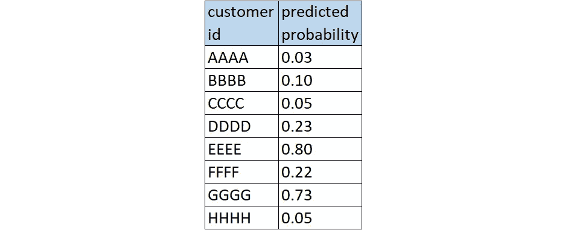

ML 管道的输出。[图片由作者提供]

通常，您会将一小组(随机选择的)客户分开。我们的想法是让这个群体保持完整，这样一个月后你就会知道如果你对你的客户群什么都不做会发生什么。如同在临床试验中一样，这个组被称为“**对照组**”。

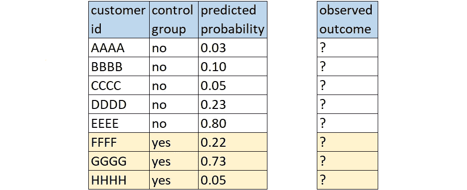

随机选择一个对照组。[图片由作者提供]

一个月后，你终于知道对照组的哪些客户翻炒了。因此，您可以计算控制组中模型的任何性能指标:ROC 曲线下面积、平均精度、F1 分数等等。

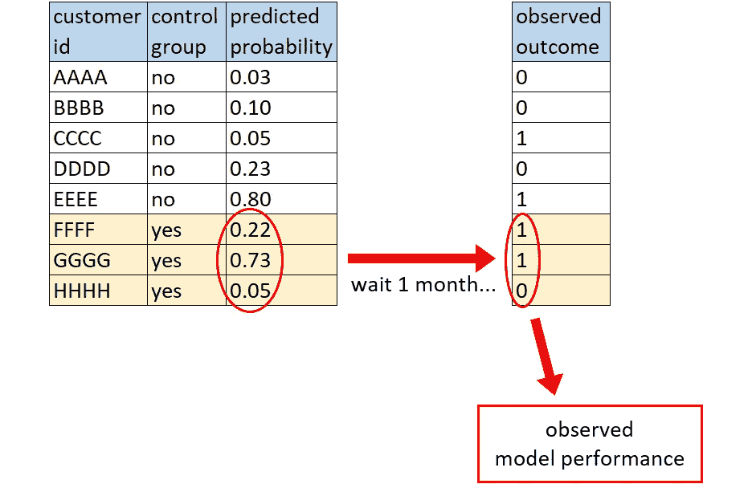

延迟(观察到的)模型性能。[图片由作者提供]

为此，你必须等待一个月。

相反，NannyML 提出的算法允许你**立即获得模型性能的可靠估计，而不必等待控制组**。此外，这些预期指标是基于整个客户群(而不仅仅是控制组)计算的。

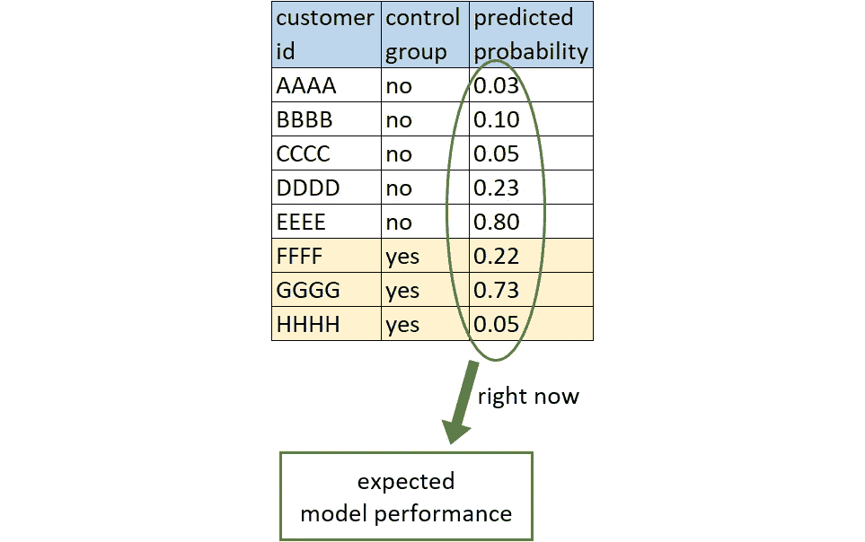

NannyML 的算法允许在服务时获得预期的模型性能。[图片由作者提供]

有很多好处:

*   立即做出更好的决策，允许进行**假设分析**(例如:如果我将概率阈值设置为 50%，预期的精确度/召回率是多少？如果我把门槛设成 80%呢？).
*   对你的模型有一个**早期危险信号**，这样你就可以在为时已晚之前修复它。例如，如果你的信用评分模型正在系统地失败，你甚至不需要等一年(并损失数百万)才意识到这一点。
*   对你的模型在当前数据上的表现有一个现实的结果，因为**有时等待控制组是不可行的**，例如在长期预测中(例如房屋抵押贷款违约)或当获得标签很昂贵时。

当然，一种方法并不排斥另一种:你可以估算出预期的模型性能，然后等待一个月，观察实际性能，最后进行比较。

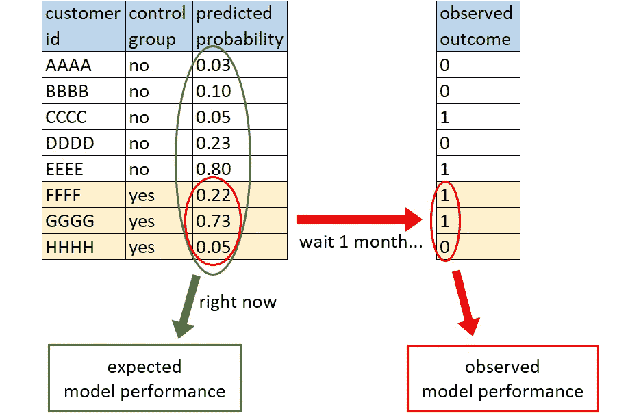

预期模型性能与观察到的模型性能。[图片由作者提供]

现在我们知道了为什么这是有用的，让我们试着理解算法背后的魔力。

# 警告，小心处理！

为了使算法产生可靠的结果，必须满足两个先决条件:

*   **模型产生的概率必须正确校准。**
*   **不能有概念漂移**(但是，数据漂移不是问题)。

概率校准是一个直观的概念:如果你有一群预测概率为 20%的人，那么其中大约 20%实际上应该是正面的。这里就不赘述了，但是有校准你模型的技巧“*事后”*。如果想了解更多，可以看我的文章[《Python 的 predict_proba 其实并不预测概率》](/pythons-predict-proba-doesn-t-actually-predict-probabilities-and-how-to-fix-it-f582c21d63fc)。

关于概念漂移，它是指你的特征和目标变量之间的关系随着时间的推移而变化。这是机器学习中可能发生的最可怕的事情之一。如果发生这种情况，你当然不能指望可靠地预测你的模型的性能。

说到这里，我们继续有趣的部分。

# 从概率到混淆矩阵

为了确定想法，让我们以 5 个人为例，他们有不同的预测概率:10%、25%、40%、70%和 85%。

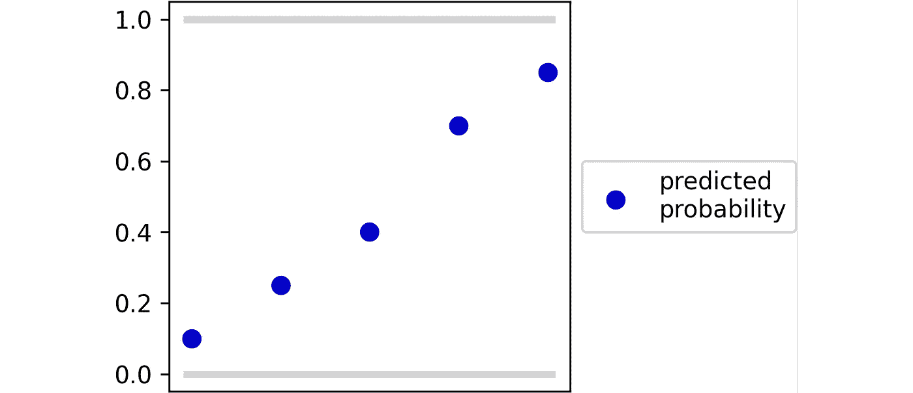

5 个人的预测概率。[图片由作者提供]

但是，通常情况下，概率并不像现在这样被使用。事实上，最终，我们感兴趣的是找出哪些人会是积极的，哪些人会是消极的。要做到这一点，我们需要设置一个阈值:高于该阈值的观察结果将被归类为积极的，低于该阈值的将被归类为消极的。

例如，如果我们将阈值设置为 50%，前 3 个人将被分类为阴性(标签 0)，而后 2 个人将被分类为阳性(标签 1)。

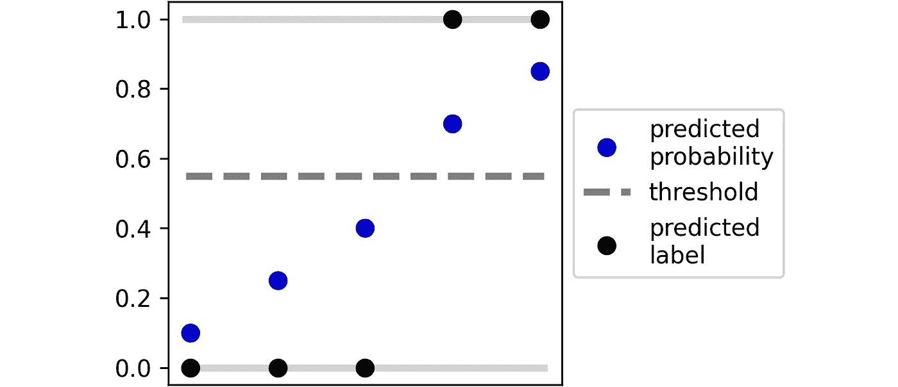

从预测概率到预测标签，基于阈值。[图片由作者提供]

现在让我们考虑最后一个人，他的预测概率是 85%。由于该点高于阈值，该个体被分类为阳性。然而，由于我们的概率是经过校准的，我们可以合理地预期:

*   85%的情况下，这个人实际上会变成阳性(**“真阳性”**)；
*   15%的情况下，这个人会变成阴性(**【假阳性】**)。

现在让我们看看第一个个体。其预测概率为 10%，因此被归类为负面。根据同样的推理:

*   90%的时候，这个人实际上会变成阴性(**“真阴性”**)；
*   10%的情况下，这个人会变成阳性(**“假阴性”**)。

很容易从几何上形象化所有观测值的这些量:

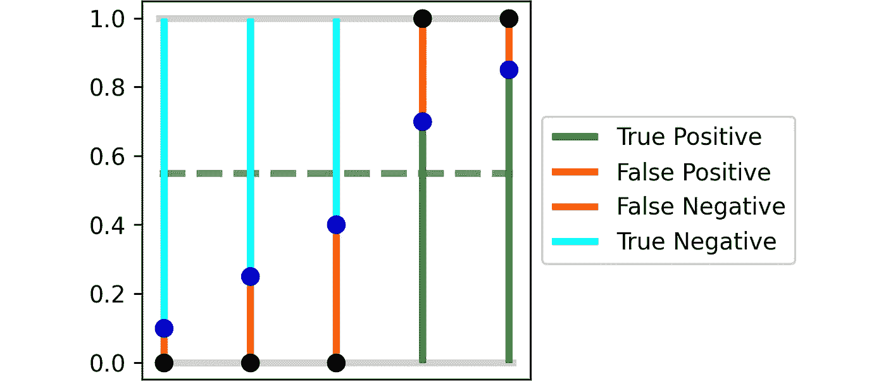

基于预测概率和阈值来估计混淆矩阵。[图片由作者提供]

每个彩色部分代表个体成为真/假阳性或真/假阴性的**概率。**

因此，**如果我们对每种颜色的所有片段的长度求和，我们就分别获得了真阳性、假阳性、假阴性和真阴性的预期数量**。

同样，从图中可以清楚地看到`TP + FP + FN + TN = n`，其中`n`是个体的数量。注意，这个性质是“常规”混淆矩阵所共有的。

唯一的区别是，在我们的例子中，TP、FP、FN 和 TN 的值不是整数值。这是有意义的，因为它们是期望值。事实上，在这个例子中，我们得到的是:

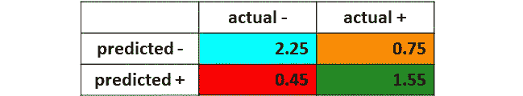

预期混淆矩阵。[图片由作者提供]

注意，为了获得这个预期混淆矩阵，我们只需要知道(校准的)预测概率和阈值。到目前为止，我们看到的所有 Python 代码的对应代码是:

```
pred = proba >= thres

tp = np.sum((pred == 1) * proba)
fp = np.sum((pred == 1) * (1 - proba))
fn = np.sum((pred == 0) * proba)
tn = np.sum((pred == 0) * (1 - proba))
```

既然我们知道了预期混淆矩阵，我们就可以计算许多性能指标，比如精确度、召回率、F1 分数、平均精确度、ROC 曲线下的面积等等。

# 得到预期的 ROC 曲线

例如，让我们关注 ROC 曲线下的区域。ROC 曲线的两个成分是真阳性率和假阳性率。从图形上看，TPR 和 FPR 是:

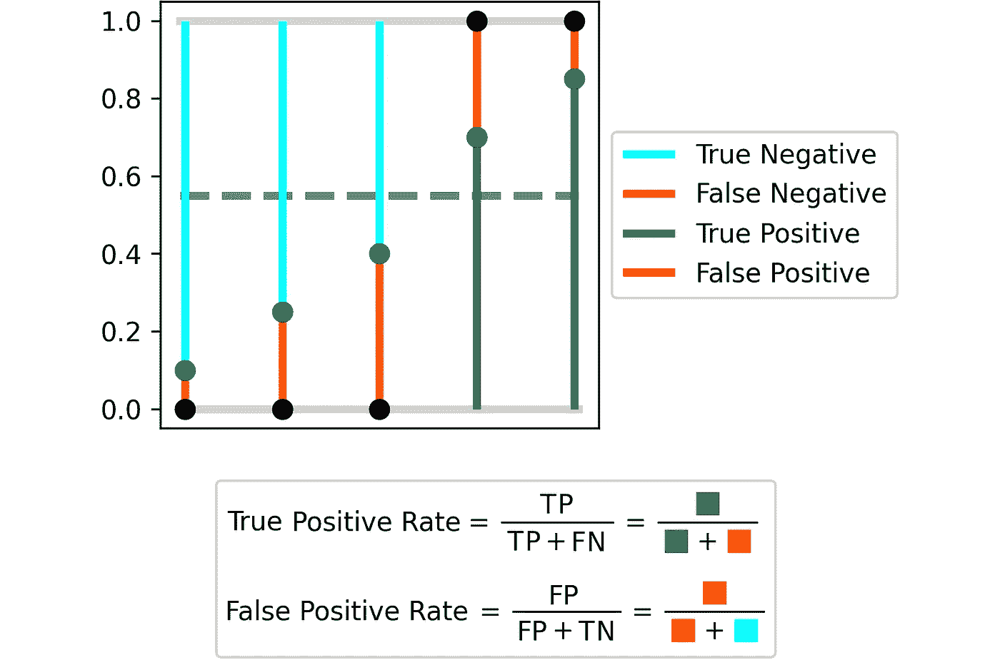

真阳性率和假阳性率的图形解释。[图片由作者提供]

然而，阈值的选择是任意的。因此，为了获得模型性能的全局概念，ROC 曲线被定义为所有可能阈值的所有 TPR/FPR 的集合。在这种情况下，有 5 个不同的值，有 6 个可能的阈值。

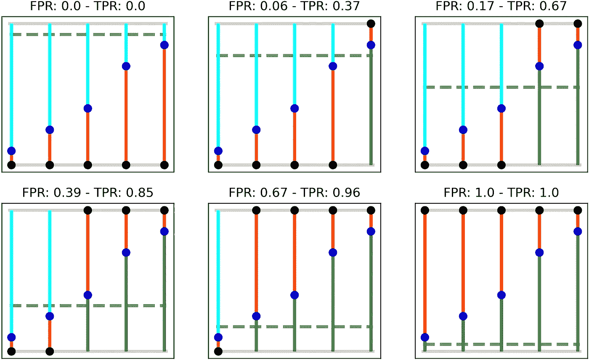

不同阈值的假阳性率和真阳性率。[图片由作者提供]

因此，在这一点上，我们有 6 对假阳性/真阳性率:每个阈值一对。然后通过绘制所有对来获得 ROC 曲线，假阳性率在 *x 轴*上，真阳性率在 *y 轴*上。

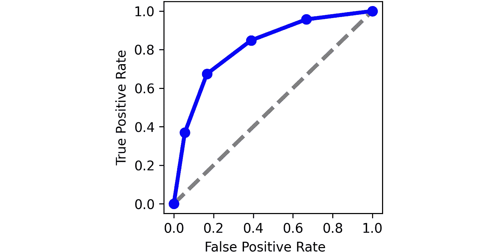

从 6 对 FPR/TPR 获得的 ROC 曲线。[图片由作者提供]

现在，`roc_auc_score`就是这条曲线下的面积，这很容易计算:Scikit-learn 还提供了一个函数，可以直接计算任何曲线下的面积。在我们的例子中， *x-* 坐标由假阳性率给出， *y-* 坐标由真阳性率给出，因此:

```
from sklearn.metrics import aucfpr = [0.0, 0.06, 0.17, 0.39, 0.67, 1.0]
tpr = [0.0, 0.37, 0.67, 0.85, 0.96, 1.0]roc_auc = auc(x=fpr, y=tpr)
```

结果是 0.81。这意味着我们可以对该数据集上模型的 ROC 下面积做的最佳估计是 81%。

就是这样。我们只是根据预测的概率计算了 ROC 曲线下的预期面积，而不知道事实真相！

# 总结

在本文中，我们已经看到了**当基础事实不可用**时，如何可靠地预测机器学习模型的预期性能(例如 ROC 下的面积)。

这种算法被称为“**基于信心的性能评估**”(CBPE)，由 NannyML (一个专注于部署后数据科学的开源库)在本文[中首次提出。他们刚刚开始开源，你可以在他们的 Github 页面上看看他们的代码和文档:](https://docs.nannyml.com/latest/deep_dive/performance_estimation.html)[https://github.com/NannyML/nannyml](https://github.com/NannyML/nannyml)。


*感谢您的阅读！我希望你喜欢这篇文章。如果你愿意，* [*在 Linkedin 上加我*](https://www.linkedin.com/in/samuelemazzanti/) *！*