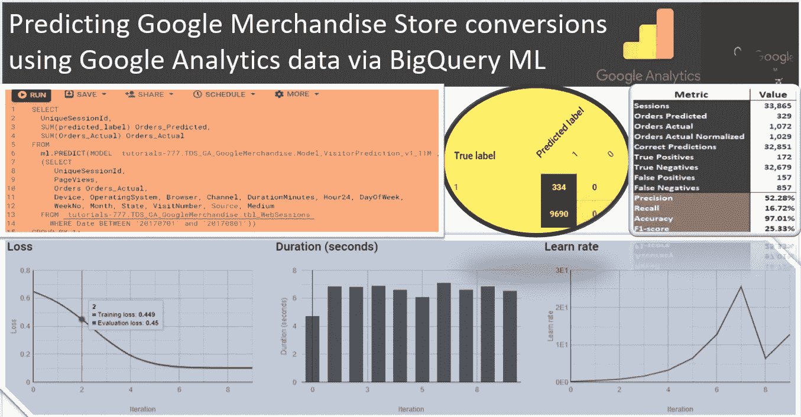
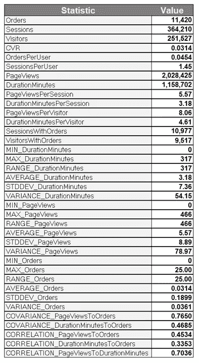
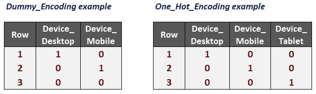
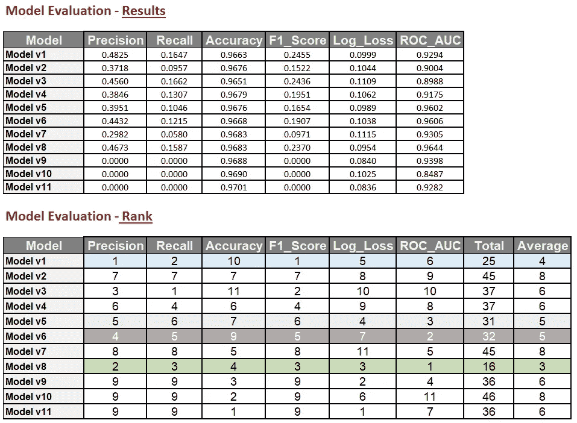
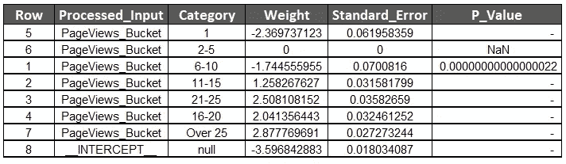
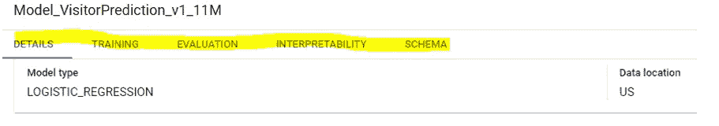
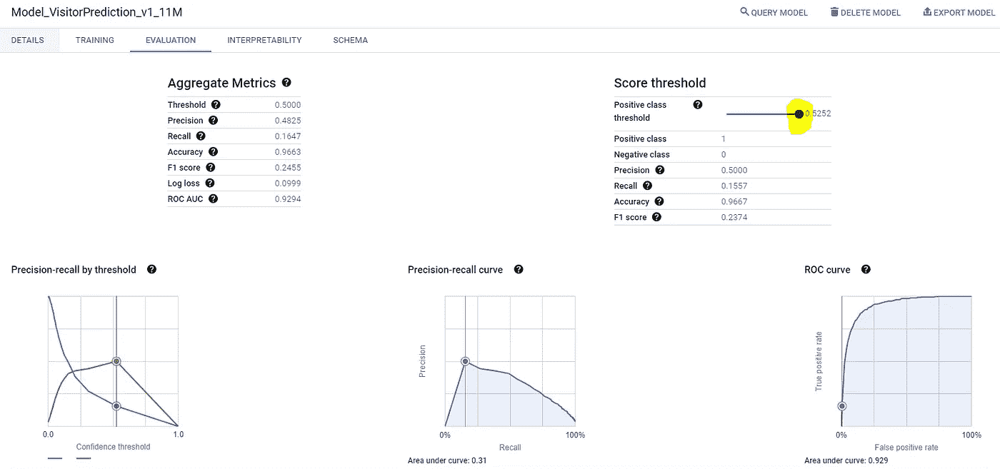
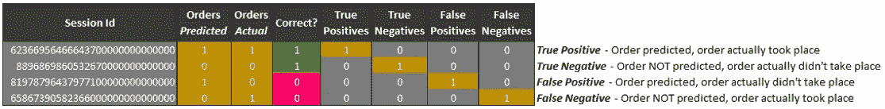
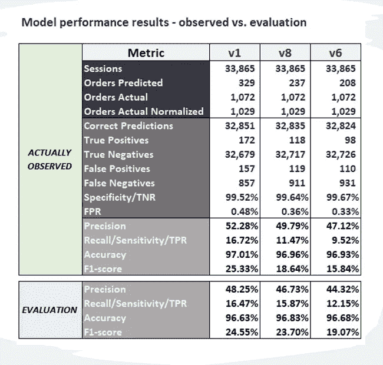
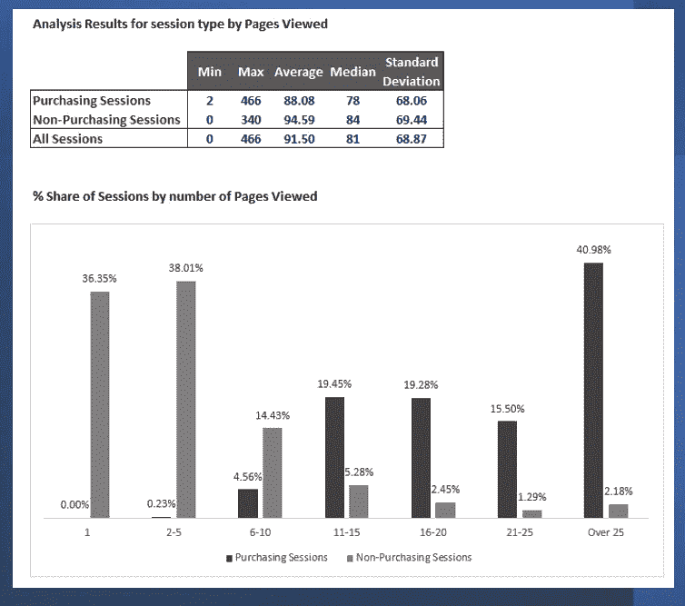

# 在 BigQuery 中从 Google 商品商店的 Google 分析数据集预测转换事件

> 原文：<https://towardsdatascience.com/predicting-conversion-events-from-google-analytics-dataset-for-google-merchandise-store-in-bigquery-1673f7b074fc>

## 步骤 2—大查询 ML 逻辑回归

通过 BigQuery ML 使用 GA 数据预测 Google 商品商店转化率。图片作者。

在我们的[上一篇](https://bit.ly/3F3g1hI)文章中，我们介绍了使用谷歌商品商店的谷歌分析数据集在 BigQuery 和 DataStudio 中进行探索性数据分析的基础知识。作为该流程的一部分，我们考察了各种维度——营销渠道、州、操作系统、浏览器、设备类型、星期几、小时、月份等等。正在考虑的指标包括页面浏览量、访问量、订单、销售额、现场时间。此外，我们采取了一些数据清理步骤来删除错误标记为美国的地区，通过选择感兴趣的维度和指标来执行基本的数据准备，并计算其他指标，如转换率、跳出率、每位访问者的销售额、每次访问的销售额、平均订单价值，并根据上述参与度和维度进一步总结我们的数据。我们现在已经准备好开始预测我们的哪些 web 会话将会看到访问者更有可能进行购买。幸运的是， [BigQuery ML](https://bit.ly/3Evbzbd) 提供了一个自动化的机器学习解决方案，使用逻辑回归实现了这样的预测。

**工作中的 BigQuery ML 示例**

**步骤 1 —数据分析**

除了比我们已经完成的更彻底的 EDA 之外，我们可以使用下面的查询对数据集运行一些基本的描述性统计数据:

***描述性统计***

在这里，我们试图通过显示感兴趣的指标来总结我们的数据——订单数[11，420]、会话数[364，210]、访客数[251，257]、页面浏览量[> 200 万]、网站停留时间[2.2 年！]我们还可以计算衍生指标，如转换率[3.14%]、每个用户的会话数[1.45]、每个访问者的页面浏览量[8.06]、每个访问者在网站上的平均时间[4.61 分钟。]下一步是计算参与度和转化率指标的最小/最大/范围/平均/标准偏差和方差的值。现场时间标准差【7.36 分钟】两个以上(！)倍于平均会话持续时间[3.18 分钟。]同样，页面浏览量[8.89]的标准差是 1.6(！)比 5.57 的平均页面浏览量高一倍，表明这些指标的实际值分布得相当广泛，而不是集中在平均值周围。注意，除了*范围*(它只是最小值和最大值之间的差)，所有其他计算都内置在 BigQuery 的 SQL 风格中。除此之外，我们还能够估计 BigQuery 中的一些[统计聚合函数](https://cloud.google.com/bigquery/docs/reference/standard-sql/statistical_aggregate_functions):

*方差*。

*相关性* —皮尔森相关系数——似乎网站时间与订单的相关性较弱[0.34]，而页面浏览量的相关性则更为适中，为 0.45。请记住，我们首先需要指定我们的因变量[订单]。]

协方差[Pop] —显示两个随机变量的*联合*可变性。如果该值大于 0，则一个变量的较大值对应于另一个变量的较大值。在我们的例子中，页面浏览量对订单的协方差[0.76]比网站时间 0.47 大得多:

**描述性统计汇总表。图片作者。**

这里有两个要点:参与度指标似乎确实与订单有相关性和协方差关系；其中这些关系在页面视图中比在网站上的时间更明显。我们现在准备开始构建模型以进行进一步评估。

**步骤 2——模型创建**

*“厨房水槽”型号。*

BigQuery ML 的神奇之处在于，我们能够用几行简单的 SQL 语句运行相当强大的算法，如下所示:

让我们解开这段代码。我们从创建(或者替换已经存在的模型)开始，然后通过 BigQuery ML 指定一些可用的选项:对于 model_type 参数，我们选择*逻辑回归*作为参数，告诉 BigQuery 我们想要运行哪种类型的模型。我们为我们的编码方法选择了*哑元编码*，它使用了 **N-1 个**哑元变量 vs **N 个**哑元变量，这些哑元变量在 *One_Hot_Encoding* 方法下会被使用。举例来说，对于*设备*类型的桌面、移动和平板电脑，假设平板电脑是网站访问者最不喜欢的设备，我们的功能栏如下所示。请注意，当桌面和移动设备都设置为 false 时，意味着平板设备:

**类别编码的类型。图片作者。**

下一步是启用 CALCULATE_P_VALUES 选项，我们将在稍后使用 ML_ADVANCED_WEIGHTS 命令时感谢它。我们要激活的最后一个选项是 ENABLE_GLOBAL_EXPLAIN，如果我们想在以后汇总评估数据的解释，这个选项会很有用。

然后，BigQuery ML 语法要求指定 Google 称之为“标签”的内容，这个概念您可能已经看到过，也被称为独立/预测/结果/响应变量。我们的目标是预测订单放置转换事件；换句话说，我们正在寻找已下单的会话，而不管是否有人下了 1 个或 25 个(数据发布)订单。因此，我们将使用 **Orders≥ 1** 条件来定义下订单的 TRUE/1 事件，如果没有下订单，则为 False/0。

我将把这个模型— **v1** 称为“厨房水槽”类型的模型，因为我们将在我们的算法中使用一个全面的、尽管数量有些过多的不同维度和度量:*设备、操作系统、浏览器、频道、持续时间分钟、小时 24、星期几、星期几、月份、状态、访问量、页面浏览量、来源、*和*媒介。*在我们之前的帖子中，我们再次证明了这些维度和指标在 EDA 阶段确实显示了值得注意的结果。

我们建模过程的最后一步是我试图保持事情的真实性，而不是仅仅根据历史数据假设性地评估我们的结果，选择使用一部分数据作为我们的*训练*数据集，剩余部分作为*测试*数据。为了帮助我们预测的准确性，我们希望向模型提供尽可能多的数据，因此让我们使用前 11 个月的数据来训练我们的模型。然后，让我们使用过去 32 天的 GA 数据(对我们的目的来说足够有代表性)来确认该模型是有效的(预测有序和无序事件)还是无效的(不运行有意义的预测)。)

BigQuery ML 的另一个好处是，我们可以有效地大规模迭代，并运行各种版本的模型来确定“获胜”的模型。此外，现实世界中经常出现一些警告，使得继续使用性能最佳的模型变得不切实际，因此可能需要不同的备用选项。毕竟，我们真的要通过一个广泛的清单来运行我们的访问者，以确定更高的交易可能性，或者有一个足够好的最佳点，让我们接近最佳结果，而不会使我们的任务过于复杂。我建议多运行 10 个模型:

**v2**T6 用于频道，时长分钟，小时 24，星期几，访问量，浏览量

**v3** *用于*频道、时长分钟、星期几、访问量、浏览量

**v4**

**v5**

**V6**T22 时长分钟，浏览量

**V7**T26 时长分钟

**V8**T30 浏览量

**v9**T34 持续时间 _Bucket，浏览量 _Bucket

**v10**为持续时间 _ 铲斗

**v11**T42 浏览量 _ 斗

**第三步——评估我们的模型**

就我个人而言，我支持 v6 版本，因为根据我阅读的一些研究、我们 EDA 实践的结果以及个人轶事信念，我相信参与度指标让我们更接近可靠的预测，而不会因为考虑其他指标或维度而使我们的生活变得过于困难。好消息是，我们不必仅仅依靠我的直觉，因为 BigQuery 包括 **ML。评估**命令就是这样做的— *评估*我们模型的性能。

在继续下一步之前，让我们确保理解我们将在后面提到的重要术语:

*真阳性*—模型正确预测条件成立时的结果。对我们来说，这描述了一个订单被预测和订单实际发生的情况。

*真阴性*—模型正确预测条件不成立的结果。在我们的例子中，这指的是一个订单没有被预测的情况，一个订单实际上没有发生。

*假阳性*又名。*类型 1 错误】*——显示事件存在的(不正确)测试结果，而这种情况并不存在。在这里，我们会看到一个预测的秩序，但秩序实际上并没有发生。

*假阴性*又名。*类型 2 错误*或*遗漏错误】* —错误指示条件不成立的测试结果。对我们来说，这意味着秩序不是预测出来的，而是实际发生的。

在 BigQuery ML 的快速帮助下，我们可以检索以下内容:

*精度* —预测阳性与实际阳性的比例 **=真阳性/(真阳性+假阳性)**。让我们将这种测量放在上下文中:虽然在识别真阳性与所有阳性的比率方面肯定有用，但如果我们有过多的假阴性，这种度量本身并不能提供足够的分析，因此可能会影响对我们能够分类的一些事件的准确识别，但会错过我们未能识别的大部分事件。

*回忆* —预测阳性的实际阳性比例 **=真阳性/(真阳性+假阴性)**。这项措施解决了我们对*精确度的担忧，*却忽略了误报，这可能会影响我们的整体*精确度*。请注意，该指标也被称为*敏感度*或 *TPR* (真实阳性率。)

*准确度* —给定正确标签的预测分数 **=(真阳性+真阴性)/(假阳性+假阴性)。**当然，这是迄今为止我们在这一点上考虑的最有希望的指标，但是，我们需要注意我们的真实和虚假事件的不均衡分布，这可能是典型的电子商务网站的情况——我们的 web 会话中只有一小部分(准确地说是 Google 商品商店的 3%)有订单事件，留给我们的是非事件的巨大份额[每次网站访问的 100 次中有 97 次。]因此，具有 o 订单的会话*的准确性与没有*订单的会话*的准确性明显不同，但这一重要的细微差别在汇总期间丢失了[97%的非事件准确性将使 3%的“多事”会话的准确性相形见绌。]*

*F1 得分* —精度和召回率的调和平均值**= 2 *精度*召回率/(精度+召回率)**这是一个数学“胶水”，帮助我们看精度和召回率的综合效果。

*对数损失*—0(完美)到 1 之间的模型性能的度量。对数损失越大，预测概率与实际标签的偏差就越大。

*ROC AUC* —受试者操作特征曲线下面积。 *ROC 曲线* —受试者工作特征(ROC)曲线显示了真阳性率和假阳性率之间的权衡。较低的阈值导致较高的真阳性率(和较高的假阳性率)，而较高的阈值导致较低的真阳性率(和较低的假阳性率)

…下面是一次对所有 11 个模型运行评估的 SQL 代码，没有树受损/ *字节用于运行它:*

***评估车型***

除了简单地查看结果，我还会推荐*按顺序排列*。这应该有助于我们更容易地识别最佳性能模型。请注意，与所有其他指标不同，Log_Loss 应该按照*升序*排序，因为最低值代表最佳结果。排名的其他计算包括计算*总*【排名】分数——较低的结果表示表现更好的模型；和*平均*排名。

*看下面的结果，很不幸，我们不得不忽略模型 v9、v10 和 v11 的 Precision、Recall 和 F1_Score 结果，因为这些模型只包含分类值，并且无法计算非标准化截距的回归统计。*

毫不奇怪，我们的“厨房水槽”模型/v1 表现相当好，尽管它没有占据模型 v8 的第一名，模型 V8 只关注*浏览量*。[虽然 v1 在精确度、召回率和 F1_Score 方面击败了 v8，但它在精确度、对数损失和 ROC_AUC 方面有所欠缺。有趣的是，我最喜欢的 v6 模式[页面浏览量和网站停留时间]有点落后，排在第四位，与 v8 模式相比表现不佳，略落后于 V5[页面浏览量、网站停留时间和访问次数。]

当然，考虑到上述因素，我们可以根据指标的作用选择不同的权重——例如，在我们的用例中，精度可能没有召回重要。但是这是一个单独讨论的主题，集中在我们以后可能承担的特征工程任务上。

**模型评估结果。图片作者。**

之前已经设置了阶段并在创建模型阶段选中了适当的框，我们准备使用高级权重计算来检索大量有趣的摘要。为了更全面地了解功能，让我们使用一个具有分类维度的模型，例如模型 **v11** 中的 *PageViews_Bucket* :

**毫升。advanced _ WEIGHTS**检索与 **ML 相同的字段。重量**还有一些:

*Processed_Input —* 模型特征输入的名称。 *(* 如果特性为非数字，那么将有多个具有相同字符串的行，每个特性类别一行。)

*类别* —输入列为非数字时的类别名称(对于数字列为空。)

*权重* —每个特征的[权重](https://developers.google.com/machine-learning/glossary/#weight)/系数。训练线性模型的目标是确定每个特征的理想权重。如果权重为 0，则它对应的特征对模型没有贡献。对于数字列，weight 包含一个值，并且 *category_weights* 列为空。

*标准误差*—重量的标准误差(抽样分布的标准偏差。)

p 值——针对零假设的测试，表明观察到的结果并非偶然，事实上具有统计学意义(p 值≤0.05)

对于模型 **v11** ，我们显示“退回”的会话(浏览量= 1)具有负权重，或者显示这样的会话不太可能产生订单事件。同时，浏览超过 25 页的会话、21-25 页和 16-20 页的会话更有可能与转换相关联:

**高级权重检索。图片作者。**

在为我们的 BigQuery 模型设置选项时做好充分准备的另一个好处是我们能够运行 **GLOBAL_EXPLAIN** 命令，该命令使用 Google 专有的*explable AI*生成结果。使用 **v5** 型号示例:

*特征*简单地列出我们特征的名称，而*属性*显示相应特征对模型整体的重要性。对于模型 **v5** 我们可以清楚地证明，在考虑的三个特性中，*页面浏览量*的权重最大，它对模型的重要性是*在站点上的时间*和 46.3(！)次比*更重要的访问编号*:

**为考虑的特征建模权重。图片作者。**

BigQuery ML 还支持基于 GUI 的模型性能可视化摘要。我们可以探索培训、评估和可解释性选项卡，如下所示:

用于模型评估/可解释性的 GUI 界面。图片作者。

***训练*** 选项卡显示损失、每次迭代持续时间和学习率的图形表示。*可解释性*有效地让我们无需运行一行代码就能运行 GLOBAL_EXPLAIN:

**模型性能 GUI 下的培训和可解释性标签。图片作者。**

***聚合指标*保持不变，显示我们模型的所有评估指标，无需运行任何 SQL。**

*Precision-recall by threshold*—显示您的模型在整个置信度阈值范围内的最高得分标签上的表现。较高的置信度阈值会产生较少的假阳性，从而提高精确度。较低的置信度阈值会产生较少的假阴性，从而提高召回率。

*精确-召回曲线*——显示了在不同置信阈值下精确和召回之间的权衡。较低的阈值导致较高的召回率但通常较低的精确度，而较高的阈值导致较低的召回率但通常较高的精确度。

*ROC 曲线* —受试者工作特征(ROC)曲线显示了真阳性率和假阳性率之间的权衡。较低的阈值导致较高的真阳性率(和较高的假阳性率)，而较高的阈值导致较低的真阳性率(和较低的假阳性率)

**模型评估 GUI(已扩展。)图片由作者提供。**

**第 4 步——运行我们的预测**

因为我们没有那么幸运地将数据分成训练集和测试集；我们可以比较*订单* *预测*与实际*订单*的结果。为此，我们需要调用 **ML。预测**命令并传递所有必需的参数以满足我们模型的参数。[如果模型 v6 是使用 *Duration_Minutes* 和 *PageViews* 指标构建的，那么我们必须确保我们的预测调用包含这两个指标。]此外，期望的粒度级别使用会话级汇总，因此我们的代码模拟了这一需求。

提醒一下，我们所有的 11 个模型都是使用从 2016 年 8 月 1 日*开始到 2017 年 6 月 30 日*结束这段时间的数据构建的。因此，我们的模型还没有遇到包含 2017 年 7 月 1 日*到 2017 年 8 月 1 日*的*测试*，我们将使用它来运行我们的算法。除了执行我们的预测，我们还可以使用源表中的剩余数据将预测结果与实际事件状态进行比较。在下面的代码中，我试图清楚地描述我们的*预测器*标签与通过 SELECT 语句检索的实际订单之间的区别。让我们使用创建的三个模型来预测我们的订单:v1(“厨房水槽”)、v8(使用评估测量和我们的总结的组合排名最佳)和 v6(我最喜欢的，它仅稍微落后于 v5，并且需要少一个指标。):**

**在分析我们的计算结果之前，让我们回忆一下定义，并尝试清楚地说明包含真阳性、真阴性、假阳性和假阴性的记录。我们将使用模型 **v1:** 的第一个查询结果**

****

****TP、TN、FP、FN 图解。图片作者。****

****步骤 5—分析结果****

**我们知道有些会话似乎有多个订单，而且我们之前的目标是预测有订单的会话，而不是订单总数，因此我们将订单事件标准化为 1，029，而不是总数 1，072。使用本文前面列出的精确度/召回率/准确度/F1 分数的公式，我们现在可以并排计算我们的模型的真实性能结果:**

****

****模型结果——观察与评估。图片作者。****

**准确性在这里是一个相当重要的衡量标准，尽管注意它在所有三个被分析的模型中几乎是一样的。尽管有之前的模型评估和我们的分析，但在现实条件下，模型 *v1* 确实比 *v8* 表现得更好。与准确性同样重要的是，有序会话和非有序会话的分布不成比例，这不是我们需要关注的唯一因素。总体而言， *v1* 在所有感兴趣的指标中明显胜出。尽管模型*估计*显示其在*精确度*【96.63%对 96.83%】方面比 *v8* 稍差，但使用我们的测试数据，我们能够获得 97.01%对 96.96%的结果。**

***精度*不太一致，但在所考虑的车型中仍具有可比性。鉴于相同的数据集模型 *v1* 检索到 172 个真阳性(准确的订单预测)，而模型 *v6* 检索到 98 个真阳性，即使当精度结果分别从 52.28%交换到 47.12%时，模型 *v1* 仍然是实际的赢家。即使 *Precision* 对模型 *v6、*有一个完美的分数，我们将检索到 208 个真阳性，这仅比模型 *v6* 的 172 个真阳性高一点，精度为 52%……显然，总阳性预测的数量也很重要，模型 *v6* 根本没有检测到足够多的阳性病例。我甚至认为，假设我们有模型的*召回*测量，我们可能想要完全跳过*精度*以避免在我们的分析中引入噪声。**

***召回*显示车型 *v1* 的价值为 16.72%，这比我们预测的赢家——V8 车型的 11.47%的性能高出很多。当然，不到 17%的订单事件发生的会话被我们的算法正确识别，这听起来不像是值得大书特书的事情，但是考虑到随机预测订单事件的概率为 3%，我们的预测是 5.5(！)比靠运气有效几倍。即使有了模型 v3，我们的机会也增加了三倍。**

***F1_Score* 显示了 *Precision* 和 *Recall* 度量的代数组合行为，验证了我们到目前为止所见证的最佳性能模型的相同等级。**

**我们可以使用公式计算的其他指标是*特异性/TNR* 和 *FPR* :**

***特异性*，又称 *TNR* (真阴性率)计算为**真阴性/(真阴性+假阳性)。)**这两种模型都将我们预测无序事件的几率提高了 3%【1.03%对随机选择——在模型 *v6* 下，99.67%对 97%的几率。]请注意，在此参数下，型号 *v6* 的性能优于 *v8* 和 *v1* 。这可能是因为它低于订单事件的数量。**

***FPR* ，或假阳性率通过以下公式计算:**假阳性/(假阳性+真阴性)**或 **1 — *特异性*** 。**

**鉴于*页面浏览量*的重要性，我们可以运行额外的分析来显示购买与非购买会话的页面浏览量的差异，以及这些会话之间描述性统计的差异。请注意，虽然十分之四的购买会议的访问者浏览了超过 25 页的页面，但只有五十分之一的非购买会议看到了这种参与度:**

****

****购买与非购买会话的浏览量。图片作者。****

***请随意分享您对所讨论的分析和建模的想法。您希望我们考虑哪些其他因素？什么样的特征工程步骤可以提高我们的性能？***