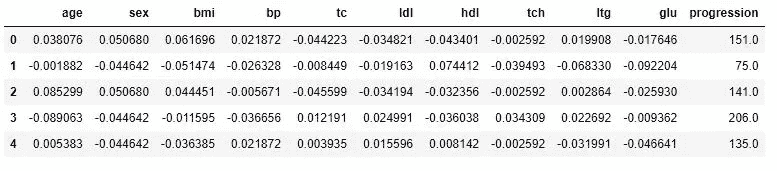
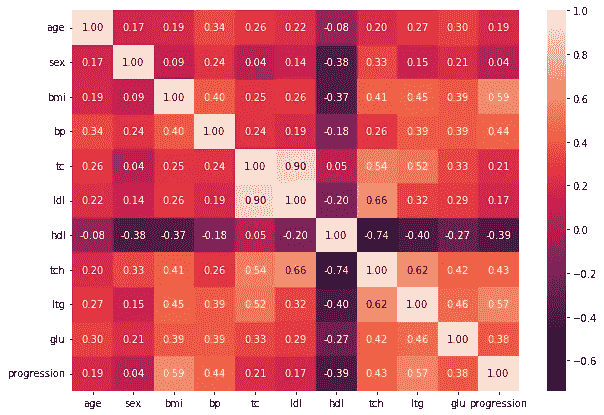
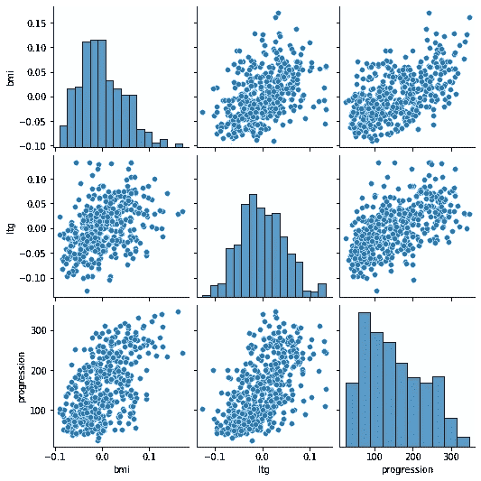
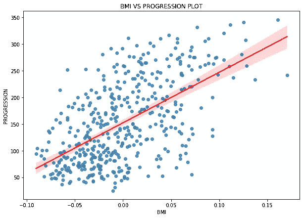
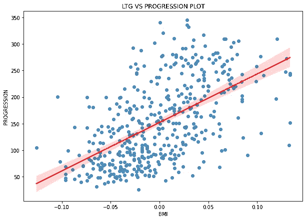
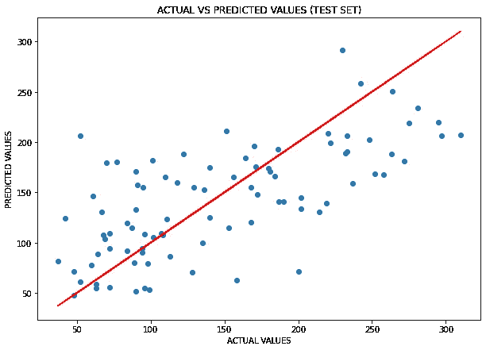
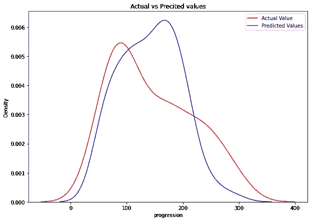

# 用机器学习预测糖尿病——第一部分

> 原文：<https://towardsdatascience.com/predicting-diabetes-with-machine-learning-part-i-f151cb764aee>

## 预测糖尿病的不同 ML 模型综述


[Towfiqu barbhuiya](https://unsplash.com/es/@towfiqu999999?utm_source=unsplash&utm_medium=referral&utm_content=creditCopyText) 在 [Unsplash](https://unsplash.com/s/photos/diabetes?utm_source=unsplash&utm_medium=referral&utm_content=creditCopyText) 上的照片

本文是我将使用不同的机器学习模型分析 scikit-learn 提供的“糖尿病数据集”的两篇系列文章中的第一篇。这些文章的目的是让读者了解在做 DS 项目时如何分析数据。此外，我想给出当我们获得一些数字结果时，我们应该期望的‘数字意义’;事实上，当我们计算一些指标来评估我们的模型时，我们如何知道我们获得的数字有多好来评估一个模型？

此外，在第二篇文章写完后，我会提供到我的 GITHUB 库的链接和完整的代码。

在分析数据之前，重要的是要理解我们要做什么，给机器学习做什么一个“实际意义”。这个数据集是一个数据集合，其中我们可以看到一些与人相关的指标(年龄、性别、身体质量指数等)..)已经被赋予了对应于糖尿病的某一发展的值。找到一个预测糖尿病进展的好的 ML 模型可能是有用的，例如，在未来开发一个应用程序，我们在其中提供输入(年龄、性别、身体质量指数等)，由于开发的 ML 模型，应用程序会告诉你糖尿病的进展。这可能对人们有所帮助，因为我们可以在进行临床试验之前预测糖尿病的某种进展。

# 1.探索性数据分析

让我们导入所有必要的库，并做一些 EDA 来理解数据:

```
import pandas as pd
import numpy as np#plotting
import seaborn as sns
import matplotlib.pyplot as plt#sklearn
from sklearn.datasets import load_diabetes #importing data
from sklearn.linear_model import LinearRegression
from sklearn.preprocessing import MinMaxScaler
from sklearn.model_selection import train_test_split
from sklearn import linear_model
from sklearn import metrics
from sklearn.model_selection import cross_val_score
from sklearn.model_selection import KFold
from sklearn.linear_model import Lasso
from sklearn.model_selection import GridSearchCV
from sklearn.model_selection import RepeatedKFold
from sklearn.model_selection import RandomizedSearchCV
from sklearn.preprocessing import PolynomialFeatures#scipy
from scipy.stats import loguniform
```

从 scikit-learn 导入数据:

```
#importing dataset
diab = load_diabetes()#defininf feature and label
X = diab['data']
y = diab['target']#printing shapes
print(X.shape, y.shape)------------------------>>> (442, 10) (442,)
```

所以，X 有 442 行 10 列；y 有 442 行(和 1 列)。现在，我想从 X 和 y 创建一个数据框:

```
#creating dataframe from X
df = pd.DataFrame(X, columns=["age","sex","bmi","bp", "tc", "ldl", "hdl","tch", "ltg", "glu"])#adding 'progression' from y
df['progression'] = diab['target']#showing head
df.head()
```



糖尿病数据框。图片作者。

现在，我们检查空值:

```
#showing dataframe info
df.isnull().sum()------------------>>>age            0
sex            0
bmi            0
bp             0
tc             0
ldl            0
hdl            0
tch            0
ltg            0
glu            0
progression    0
dtype: int64
```

没有 Nans，可以用`df.describe()`看到一些统计数据。从该函数中，我们可以看到，除了“progression”之外，所有列都具有相同的标准偏差:这意味着它们都具有相同的均值偏差(这也应该是已知的，因为在 scikit-learn 中提供的文档中；比如试试`print(diab[‘DESCR'])`看描述)。此外，除了几个例外，我们看到所有列的所有值(平均值、最小值、最大值和百分位数)都具有相同的数量级(不包括“级数”)。

因此，现在我们可以继续绘制相关矩阵，以查看数据中的最终相关性:

```
#figure size
plt.figure(figsize=(10, 7))#correlation matrix
dataplot = sns.heatmap(df.corr(), annot=True, fmt='.2f')
```



相关矩阵。图片作者。

糖尿病的进展和各种特征之间似乎没有很大的相关性。与“ltg”或“拉莫三嗪”中度相关，相关系数为 0.57，与身体质量指数或“体重指数”中度相关，相关系数为 0.59。

所以我想看看是否有可能在身体质量指数和 ltg 与疾病进展之间找到某种联系:

```
#figure size
plt.figure(figsize=(10, 7))#plotting graphs
sns.pairplot(df[['bmi', 'ltg', 'progression']])
```



“bmi”、“ltg”和“进展”之间的关系。图片作者。

在上面的图表中，我们可以看到 ltg 和级数以及身体质量指数和级数之间的关系。有数据增厚，但也能给出关系类型是线性的想法。让我们试试线性回归图:

```
#figure size
plt.figure(figsize=(10, 7))#regression between bmi and progression
sns.regplot(data=df, x='bmi', y='progression',line_kws={"color": "red"})#labeling
plt.title('BMI VS PROGRESSION PLOT')
plt.xlabel('BMI')
plt.ylabel('PROGRESSION')
```



MBI 与级数的关系。图片作者。

用类似的代码:



LTG 与级数的关系。图片作者。

在这两种情况下，线周围的数据的离散度有点太大，但另一方面，已经可以看出相关性是适度的。

在上面看到的分析之后，我继续选择学习模型，将所有值列视为特征(X ),将最后一列视为标签(y ),其指示疾病的进展(progression)。这是一个回归问题，因为 y 中的值是连续的。

让我们试着应用线性回归模型，从简单开始，看看我们会得到什么。

# 2.简单线性回归模型

首先，我们必须注意，无论是谁发布了数据集，这些特性都已经被缩放了(参见 scikit-learn 上的数据文档)，因此没有必要这样做。

现在，让我们定义特征和标注，并拟合线性回归模型:

```
#defining features
X = df.iloc[:,:-1]#defining label
y = df['progression']#splitting
X_train, X_test, y_train, y_test = train_test_split(X, y, test_size=0.2,random_state=42)#fitting the model
reg = LinearRegression().fit(X_train, y_train)#predictions
y_test_pred = reg.predict(X_test)
y_train_pred = reg.predict(X_train)
```

然后，让我们打印一些指标:

```
#intercept
print(f'the intercept is:{reg.intercept_: .2f}')#slope
print(f'the slope is:{reg.coef_}')#R^2
print(f'Coeff. of determination on train set:{reg.score(X_train, y_train): .2f}') #train set
print(f'Coeff. of determination on test set:{reg.score(X_test, y_test): .2f}') #test set------------------->>>the intercept is: 151.35the slope is:[  37.90031426 -241.96624835  542.42575342  347.70830529 -931.46126093
  518.04405547  163.40353476  275.31003837  736.18909839   48.67112488]Coeff. of determination on train set: 0.53
Coeff. of determination on test set: 0.45
```

r，或者说决定系数，告诉我们数据的可变性和模型的正确性之间的联系；R 越接近 1 越好，因为这意味着模型是准确的。获得的结果不令人满意，R 接近 0.5，即使测试和训练组之间的值相似是好的。**这是在告诉我们，这种类型的模型不适合这种类型的问题**。无论如何，我想调查几个指标:

```
#model metricsprint(f'The mean absolute error is:{metrics.mean_absolute_error(y_test, y_test_pred): .2f}')print(f'The root mean squared error is:{np.sqrt(metrics.mean_squared_error(y_test, y_test_pred)): .2f}')---------------------->>>The mean absolute error is: 42.79
The root mean squared error is: 53.85
```

**这些都是高值** (MAE 应该“尽可能接近”0)，这继续让我对这个模型的使用感到气馁…但是我想做几个可视化。

首先，我想做一个真实值相对于预测值的散点图:

```
#image dimensions
plt.figure(figsize=(10, 7))#scatterplot of y_test and y_test_pred
plt.scatter(y_test, y_test_pred)
plt.plot(y_test, y_test, color='r')#labeling
plt.title('ACTUAL VS PREDICTED VALUES (TEST SET)')
plt.xlabel('ACTUAL VALUES')
plt.ylabel('PREDICTED VALUES')#showig plot
plt.show()
```



线性回归模型:实际值与预测值。图片作者。

从上图中可以看出，斑点没有明显的线状分布趋势，这证实了线性回归不是一个好的模型。

无论如何，我还希望看到核密度估计的图表，这有助于我们直观地看到随机变量的概率密度，介于真实值和线性模型预测的值之间:

```
#image dimensions
plt.figure(figsize=(10, 7))#Kernel Density Estimation plot
ax = sns.kdeplot(y_test, color="r", label="Actual Value") #actual values
sns.kdeplot(y_test_pred, color="b", label="Predicted Values", ax=ax) #predicted values#showing title
plt.title('Actual vs Precited values')
#showing legend
plt.legend()
#showing plot
plt.show()
```



线性回归模型的 KDE。图片作者。

从图中可以看出，预测值的概率密度与真实值的概率密度并不十分接近。

所以，最后，我们必须换一种不同的模式。

在这些文章的下一个系列中，我们将会看到其他的 ML 模型，并且我们将会像我们在这里所做的那样，基于一个完整的分析，为这个 ML 问题选择最好的一个。你在这里找到第二部分。

*需要 Python 和数据科学方面的内容来开始或促进你的职业生涯吗？下面是我的一些文章，可以帮到你:*

**蟒蛇:**

*   [Python 中的循环和语句:深入理解(附示例)](/loops-and-statements-in-python-a-deep-understanding-with-examples-2099fc6e37d7?source=your_stories_page-------------------------------------)
*   [Python 循环:如何在 Python 中迭代的完整指南](/python-loops-a-complete-guide-on-how-to-iterate-in-python-b29e0d12211d)
*   [学习 5 个 Python 库，开始你的数据科学生涯](/5-python-libraries-to-learn-to-start-your-data-science-career-2cd24a223431)
*   [数据科学如何学习 Python](/how-to-study-python-for-data-science-888a1ad649ae)

**数据科学:**

*   [即使全职工作(或学习)也要如何学习数据科学](/how-to-study-data-science-even-if-you-work-or-study-full-time-b52ace31edac)
*   [如何处理数据科学中的缺失值](/how-to-deal-with-missing-values-in-data-science-9e5a56fbe928)
*   [如何在数据科学项目中进行特征选择](/how-to-perform-feature-selection-in-a-data-science-project-591ba96f86eb)
*   [如何检测数据科学项目中的异常值](/how-to-detect-outliers-in-a-data-science-project-17f39653fb17?source=your_stories_page-------------------------------------)
*   [执行图形残差分析的两种方法](/two-methods-for-performing-graphical-residuals-analysis-6899fd4c78e5)
*   条形图和柱状图有什么区别？
*   [相关和回归的区别](/the-difference-between-correlation-and-regression-134a5b367f7c?source=your_stories_page-------------------------------------)
*   [了解 l1 和 l2 正规化](/understanding-l1-and-l2-regularization-93918a5ac8d0?source=your_stories_page-------------------------------------)
*   [逻辑回归:让我们搞清楚吧！](https://medium.com/mlearning-ai/logistic-regression-lets-clear-it-up-8bf20e9b328a?source=your_stories_page-------------------------------------)
*   [什么是训练有素的模特？](/what-is-a-trained-model-5c872cfa8448?source=your_stories_page-------------------------------------)
*   [如何利用学习曲线轻松验证您的 ML 模型](https://medium.com/mlearning-ai/how-to-easily-validate-your-ml-models-with-learning-curves-21cc01636083)

考虑成为会员:你可以免费支持我和其他像我一样的作家。点击 [***这里的***](https://federicotrotta.medium.com/membership)**成为会员。**