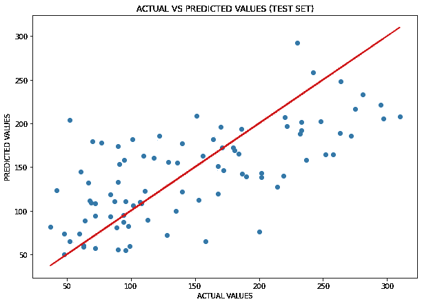
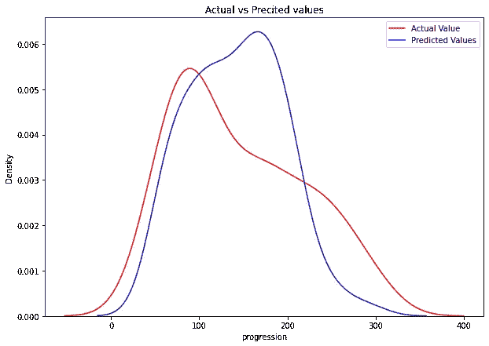
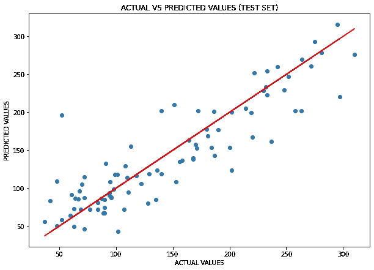
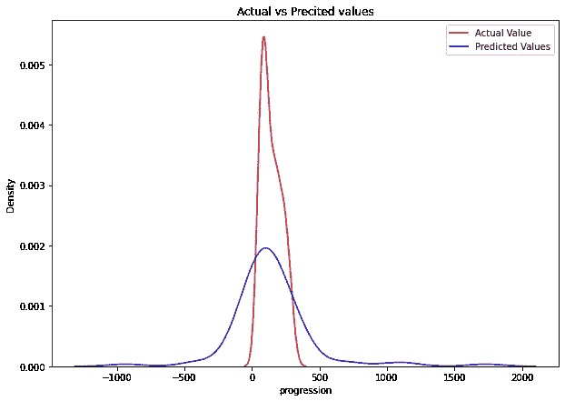

# 用机器学习预测糖尿病——第二部分

> 原文：<https://towardsdatascience.com/predicting-diabetes-with-machine-learning-part-ii-a6f703e8cf04>

## 预测糖尿病的不同 ML 模型概述的最终部分


迈肯齐·约翰逊在 [Unsplash](https://unsplash.com/s/photos/diabetes?utm_source=unsplash&utm_medium=referral&utm_content=creditCopyText) 上拍摄的照片

这是不同机器学习模型概述的第二部分，我使用 scikit-learn 库提供的著名的“糖尿病数据集”来比较它们在预测糖尿病方面的差异。

你可以在这里找到第一部《T4》。因为我已经通过不同的 ML 模型来比较它们，所以你先读第一部分是有准备的。此外，在第一部分，你会发现完整的探索性数据分析。

此外，在本文的最后，您会发现我的 GitHub 存储库，我在那里存储了该分析的完整代码。

我们在第一部分的结论中说，简单的线性回归模型对于这个 ML 问题不是一个好的模型；让我们看看如果我们尝试正则化模型会发生什么

[EDIT 04/06/2022]我要感谢 Francis Van Schie 与我联系，表明我在拟合多项式方法时犯了一个错误。现在错误已经被修正了。

# 1.线性正则化回归模型:Lasso 模型

我想尝试线性回归的正则化模型，我选择 Lasso 回归，因为当变量之间存在高度相关性时会使用 Ridge，但相关矩阵表明情况并非如此。

```
#defining the lasso model
model = Lasso()#define model evaluation method
cv = RepeatedKFold(n_splits=10, n_repeats=3, random_state=1)# efine grid
grid = dict()
grid['alpha'] = np.arange(0, 1, 0.01)#define search
search = GridSearchCV(model, grid, scoring='neg_mean_absolute_error', cv=cv, n_jobs=-1)#performing the search on the train dataset
results = search.fit(X_train, y_train)#printing
print(f'MAE:{results.best_score_: .2f}')
print(f'Best Alpha:{results.best_params_}')------------------------>>>MAE:-44.86
Best Alpha:{'alpha': 0.01}
```

最好的 alpha 值是 0.01，它给了我一个相当高的平均绝对误差(MAE 为负的事实并不重要:sklearn 因为其优化原因而使其为负；在任何情况下，要成为一个好值，它应该“更接近”于 0)。还需要补充的是，alpha = 0.01 是一个“非常小”的值；alpha = 0 是正态(非正则化)回归的情况，除了高 MAE，告诉我这个模型对于解决这种类型的 ML 问题不是太好。

除了数字的符号之外，MAE 实际上与简单回归方法相同。在上面的例子中，网格是均匀的；现在，我想尝试使用“loguniform”方法来扩展它:

```
# define model
model = Lasso()# define evaluation
cv = RepeatedKFold(n_splits=10, n_repeats=3, random_state=1)# define search space
space = dict()
space['alpha'] = loguniform(1e-5, 100)
space['fit_intercept'] = [True, False]
space['normalize'] = [True, False]#define search
search = RandomizedSearchCV(model, space, n_iter=500, scoring='neg_mean_absolute_error', n_jobs=-1, cv=cv, random_state=1)# execute search
result = search.fit(X, y)#printing
print(f'MAE:{results.best_score_: .2f}')
print(f'Best Alpha:{results.best_params_}')----------------------->>>MAE:-44.86
Best Alpha:{'alpha': 0.01}
```

我发现与之前相同的最佳 alpha 值，因此我将使用 alpha = 0.01 进行拟合，以评估 Lasso 类型的正则化回归模型的性能。我预计性能会很差，因为 MAE 实际上与简单线性回归模型中看到的值相同，但是让我们来看看:

```
#lasso with best alpha
model_best = Lasso(alpha=0.01).fit(X_train, y_train)#predictions
y_test_pred = model_best.predict(X_test)
y_train_pred = model_best.predict(X_train)#R^2
print(f'Coeff. of determination on train set:{model_best.score(X_train, y_train): .2f}') #train set
print(f'Coeff. of determination on test set:{model_best.score(X_test, y_test): .2f}') #test set--------------------------->>>Coeff. of determination on train set: 0.53
Coeff. of determination on test set: 0.46
```

这些值与用简单线性回归模型获得的值太相似了；这告诉我们，即使是正则化的方法也不是一个好方法。这是意料之中的，因为最好的 alpha 是 0.01，我们必须记住 alpha=0 是简单的线性回归情况。

无论如何，让我们来看几个形象化的例子:

```
#figure size
plt.figure(figsize=(10, 7))#scatterplot of y_test and y_test_pred
plt.scatter(y_test, y_test_pred)
plt.plot(y_test, y_test, color='r')#labeling
plt.title('ACTUAL VS PREDICTED VALUES (TEST SET)')
plt.xlabel('ACTUAL VALUES')
plt.ylabel('PREDICTED VALUES')#showig plot
plt.show()
```



线性回归的实际值与预测值(通过 Lasso 模型)。图片作者。

从上图可以看出，光斑没有明显的分布在线周围的趋势。现在，让我们来看看 KDE:



实际值和预测值(通过 Lasso 模型)的 KDE。图片作者。

从图中可以看出，预测值的概率密度根本不接近真实值的概率密度。

最后，我对残差进行图形分析:

```
#figure size
plt.figure(figsize=(10, 7))#residual plot
sns.residplot(x=y_test, y=y_test_pred)#labeling
plt.title('REDISUALS VS PREDICTED VALUES')
plt.xlabel('PREDICTED VALUES (DIABETES PROGRESSION)')
plt.ylabel('REDISUALS')
```


残差与预测值(通过 Lasso 模型)。图片作者。

残差是随机分布的(上面的图中没有明确的模式)，这告诉我们选择的模型并不完全不好，但残差的高值(甚至超过 100)太多了，这意味着模型的误差很高。没有低估或高估价值的特别倾向；然而，有一点倾向于具有高误差，特别是在具有低疾病进展值的区域，而对于高进展值，误差稍微减小，除了一些异常值。

因此，该图也证实了这样一个事实，即线性回归模型(尽管是规则化的)对于这个 ML 问题不是一个好的模型，必须寻找另一个模型。因此，我们必须尝试不同的模型:让我们尝试多项式回归方法。

# 2.多项式回归方法

考虑到 MSE 和 RSME 的值以及所看到的图形，我尝试了增加多项式次数的方法；也就是我尝试多项式回归。

考虑到之前获得的结果，我将直接使用 3 次多项式，因为 2 次对我来说似乎有点短。然而，我不想通过插入一个太高的程度来夸大其词，因为这里是一个通过转换可用数据直接进行拟合，然后使用线性回归中已经看到的函数的问题；在实践中:如果我使用一个过高的多项式次数，我会冒在训练集上过度拟合的风险。

我创建了三次和分裂多项式函数:

```
#creating the 3rd degree polinomial
poly = PolynomialFeatures(degree=3, include_bias=False)#transforming the values in all X
poly_features = poly.fit_transform(X)#splitting
X_train3, X_test3, y_train3, y_test3 = train_test_split(poly_features,y, test_size=0.2,random_state=42)
```

创建多项式回归:

```
#creating the polynomial regression
poly_reg = LinearRegression()#fitting
poly_reg.fit(X_train3, y_train3)#predictions
y_test3_pred = poly_reg.predict(X_test3)
y_train3_pred = poly_reg.predict(X_train3)
```

打印指标:

```
#R^2#train set
print(f'Coeff. of determination on train set:{poly_reg.score(X_train3, y_train3): .2f}') #test set
print(f'Coeff. of determination on test set:{poly_reg.score(X_test3, y_test3): .2f}')--------------->>>Coeff. of determination on train set: 0.88
Coeff. of determination on test set: -17.42
```

该模型在训练集上的决定系数比线性回归模型好得多。但是，测试集上的决定系数在值上下降(相对于测试集上的决定系数)，这使我想到这里出现的一个明显的情况:过拟合(在测试集上)！让我们看看其他指标:

```
#model metricsprint(f'The mean absolute error is:{metrics.mean_absolute_error(y_test3, y_test3_pred): .2f}')
print(f'The root mean squared error is:{np.sqrt(metrics.mean_squared_error(y_test3, y_test3_pred)): .2f}')------------>>>The mean absolute error is: 169.65
The root mean squared error is: 312.43
```

MAE 和 MSE 比以前的线性模型计算出的要高得多！！我制作了一张实际值与预测值比较的散点图:



实际值与预测值(通过多项式模型)的对比。图片作者。

记住，我们已经用三次多项式函数变换了起始域，正如我们现在可以看到的，数据在一条线(变换域中的一条线)周围非常明显地变粗了，但是有很高的异常值，这使我认为这个模型并不像我认为的那样适合这个特定的 ML 问题。最后，我也想和 KDE 一起做一个视觉化的展示:



实际值与预测值(通过多项式模型)的 KDE 图。图片作者。

KDE 证实了多项式回归确实不是这里使用的好模型。此外，由于过度拟合，这是目前看到的最差的模型。

当我向一位资深数据科学家展示这项工作时，他告诉我:“很好；但是你知道一个 ML 模型，它‘转换’你的数据，在它们之间留下线性关系吗？”

我的回答是“是的！”模型是支持向量回归机。我试过 SVR，但是效果很差；既然您已经理解了这个方法，我就不在这里赘述了:如果您想看一看(和/或自己尝试一下)，您可以在我的 GitHub repo 中找到结果。

# 结论

在这一系列文章中，我们已经看到了不同的模型如何在给定的数据集上执行，以及我们可以从所使用的度量中得到什么；尝试不同的 ML 模型是我们必须做的，以找到一个可以给我们最好的预测；在这种情况下，我们发现线性回归模型在我们尝试的所有模型中是最好的，但确实不是绝对好；所以必须尝试其他模型来解决这个 ML 问题。

感谢阅读！

你可以在这里找到我的 GitHub repo 的完整代码。

*让我们连在一起！*

[***中型***](https://federicotrotta.medium.com/)

[***LINKEDIN***](https://www.linkedin.com/in/federico-trotta/)*(向我发送连接请求)*

*如果你愿意，你可以* [***订阅我的邮件列表***](https://federicotrotta.medium.com/subscribe)**这样你就可以一直保持更新了！**

*考虑成为会员:你可以免费支持我和其他像我一样的作家。点击 [***这里***](https://federicotrotta.medium.com/membership)**成为会员。***