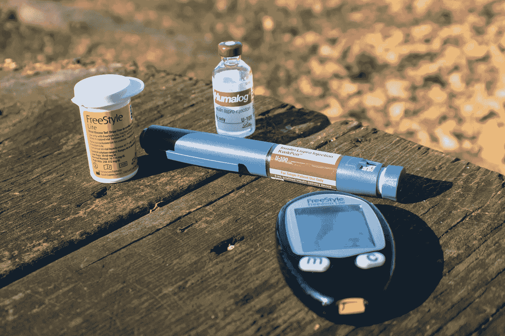
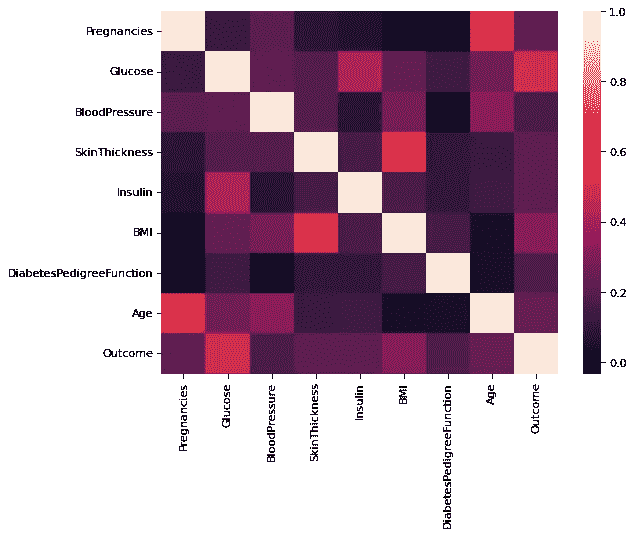
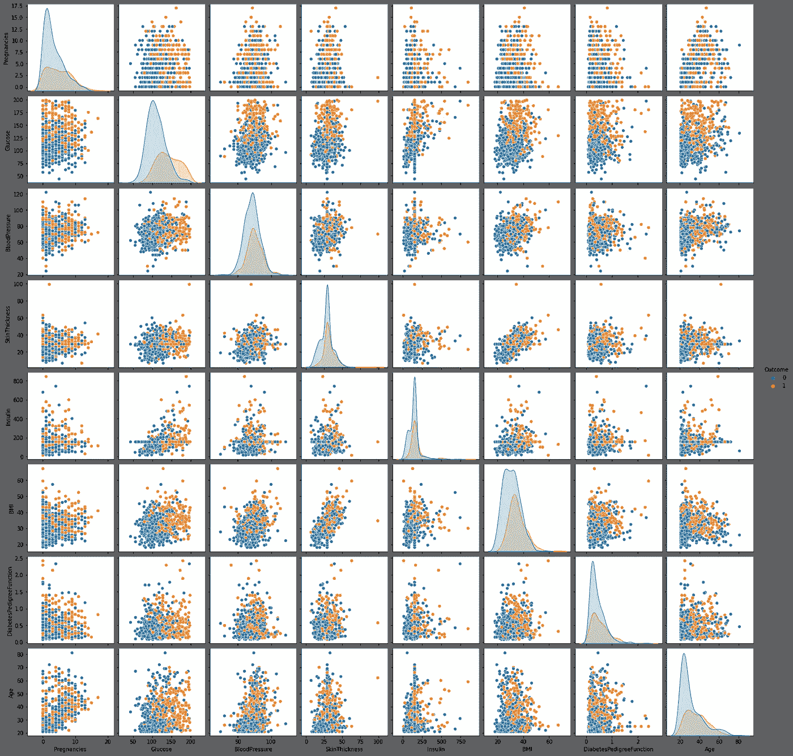
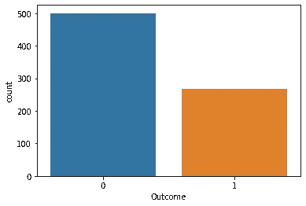
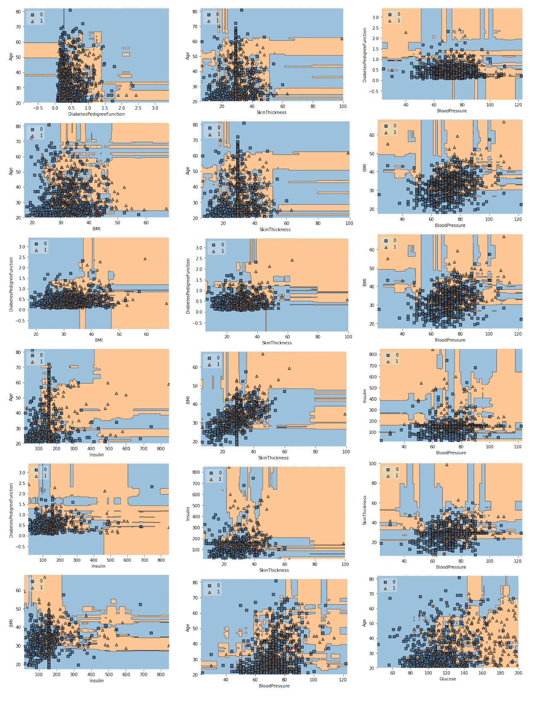
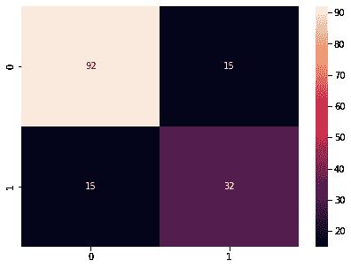
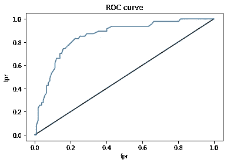
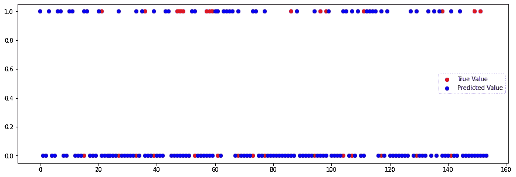

# 用随机森林分类器预测糖尿病

> 原文：<https://towardsdatascience.com/predicting-diabetes-with-random-forest-classifier-c62f2e319c6e>

## *建立机器学习模型，预测患者是否患有糖尿病。*

医疗诊断对于医疗专业人员来说是一个非常重要和关键的方面。特别是，糖尿病患者的分类非常复杂。糖尿病的早期识别对控制糖尿病非常重要。患者必须经过几次测试，之后专业人员很难在诊断过程中跟踪多个因素，这可能导致不准确的结果，使得检测非常具有挑战性。由于最先进的技术，尤其是机器学习算法，非常有利于在医疗保健行业快速准确地预测疾病。

***来自《走向数据科学》编辑的提示:*** *虽然我们允许独立作者根据我们的* [*规则和指导方针*](/questions-96667b06af5) *发表文章，但我们不认可每个作者的贡献。你不应该在没有寻求专业建议的情况下依赖一个作者的作品。详见我们的* [*读者术语*](/readers-terms-b5d780a700a4) *。*



照片由[大卫·莫鲁齐](https://unsplash.com/@dmoruzzi?utm_source=unsplash&utm_medium=referral&utm_content=creditCopyText)在 [Unsplash](https://unsplash.com/?utm_source=unsplash&utm_medium=referral&utm_content=creditCopyText) 上拍摄

# 概观

> 该数据集最初由“国家糖尿病、消化和肾脏疾病研究所”收集和传播，该数据集可在 Kaggle 以 [**皮马印第安人糖尿病数据库**](https://www.kaggle.com/uciml/pima-indians-diabetes-database) 的名称获得。主要目的是基于在数据库中收集的诊断测量来预测患者是否患有糖尿病。所有患者都属于皮马印第安遗产，并且是 21 岁以上的女性。

我们首先将 [Pandas](https://pandas.pydata.org/pandas-docs/stable/user_guide/10min.html) 和 [NumPy](https://numpy.org/doc/stable/user/absolute_beginners.html) 导入到我们的 python 环境中，并将 [**加载一个. csv 数据集**](https://pandas.pydata.org/docs/reference/api/pandas.read_csv.html) 到名为 **df** 的 pandas dataframe 中。为了查看数据集中的前五条记录，我们使用 pandas[**df . head()**](https://pandas.pydata.org/docs/reference/api/pandas.DataFrame.head.html)函数。我们还将使用 [seaborn](https://seaborn.pydata.org/) 和 [matplotlib](https://matplotlib.org/) 进行可视化。本文中的每一个例子都在 [Jupyter 笔记本](https://jupyter.org/)上得到验证。

该数据集包含 768 个可观测值，其中有八个特征变量和一个目标变量。在开始分析数据并得出任何结论之前，有必要了解任何数据集中是否存在缺失值。要做到这一点，最简单的方法是使用 [**df.info()**](https://pandas.pydata.org/docs/reference/api/pandas.DataFrame.info.html) 函数，该函数将为我们提供列名以及每列中非空值的数量。

根据输出，我们没有观察到任何空值。但是有五个特征如葡萄糖、血压、皮肤厚度、胰岛素和身体质量指数包含零值，这在医学史上是不可能的。我们将这些值视为缺失值。我们将把零值替换为 NaN，然后用它们的平均值估算它们。

# 数据可视化

每个列之间的关联使用热图可视化。从输出来看，颜色越浅表示相关性越强。我们注意到成对特征之间的相关性，比如年龄和怀孕，或者身体质量指数和皮肤厚度等。

> sns.heatmap(df.corr())



为了在数据集中绘制成对关系，我们使用 [sns.pairplot()](https://seaborn.pydata.org/generated/seaborn.pairplot.html) 函数，并根据目标变量类标记数据点..

> sns.pairplot(df，hue='Outcome ')



# 分类

我们需要将数据集分成特征和目标变量。按照流行的惯例，我们称带有特征变量的数据帧为 X，带有目标变量的数据帧为 y。

```
X=df.drop('Outcome',axis=1)
y=df['Outcome']
```

让我们将目标变量可视化，看看数据集中有多少人患有糖尿病，有多少人没有。



使用 sklearn 的 train_test_split，我们将特征(X)和目标(y)数据帧分成训练集(80%)和测试集(20%)。训练集用于建立分类模型，测试集用于评估模型的性能。

```
from sklearn.model_selection import train_test_split
X_train, X_test, y_train, y_test = train_test_split(X, y,test_size=0.2,random_state=0)
```

在实现分类算法之前，我们使用 sklearn 的 [**StandardScaler()**](https://scikit-learn.org/stable/modules/generated/sklearn.preprocessing.StandardScaler.html) 函数缩放我们数据集的特征变量。该函数通过移除平均值并缩放至单位方差来标准化特征。

```
from sklearn.preprocessing import StandardScaler
scaling_x=StandardScaler()
X_train=scaling_x.fit_transform(X_train)
X_test=scaling_x.transform(X_test)
```

# 培训和评估模型

我们将使用一个名为 [***随机森林分类器***](https://scikit-learn.org/stable/modules/generated/sklearn.ensemble.RandomForestClassifier.html) 的机器简单学习模型。我们使用训练数据集用标准参数训练模型。训练好的模型保存为“**RCF”**。我们使用测试数据集来评估我们的模型的性能。我们的模型有 80.5%的分类准确率。

```
**from** sklearn.ensemble **import** RandomForestClassifier
rfc **=** RandomForestClassifier()
rfc**.**fit(X_train, y_train)
rfc**.**predict(X_test)
rfc**.**score(X_test, y_test)
```

输出:

```
0.8051948051948052
```

**绘制决策边界**

决策边界图仅适用于两个要素。我们的数据有八个特征，但我们仍然可以通过选择使用哪些特征来绘制决策边界。我们为每两个可能的特征绘制决策边界，并观察模型对患者的分类效果。

```
**from** mlxtend.plotting **import** plot_decision_regions
**def** classify_with_rfc(X,Y):
    x **=** df[[X,Y]]**.**values
    y **=** df['Outcome']**.**astype(int)**.**values
    rfc **=** RandomForestClassifier()
    rfc**.**fit(x,y)
    *# Plotting decision region*
    plot_decision_regions(x, y, clf**=**rfc, legend**=**2)
    *# Adding axes annotations*
    plt**.**xlabel(X)
    plt**.**ylabel(Y)
    plt**.**show()

feat **=** ['Pregnancies', 'Glucose', 'BloodPressure', 'SkinThickness', 'Insulin','BMI', 'DiabetesPedigreeFunction', 'Age']
size **=** len(feat)
**for** i **in** range(0,size):
    **for** j **in** range(i**+**1,size):
        classify_with_rfc(feat[i],feat[j])
```

注意:`0 — Non Diabetic and 1 — Diabetic`



分布显示我们的模型对病人的分类非常好。为了详细评估我们的模型，我们看一下 [**混淆矩阵**](https://www.sciencedirect.com/topics/engineering/confusion-matrix) 。

```
**from** sklearn.metrics **import** confusion_matrix
mat **=** confusion_matrix(y_test, y_pred)
plt**.**figure(figsize**=**(7, 5))
sns**.**heatmap(mat, annot**=True**)
```



```
**from** sklearn.metrics **import** classification_report
target_names **=** ['Diabetes', 'Normal']
print(classification_report(y_test, y_pred, target_names**=**target_names))**Output**: precision    recall  f1-score   support

    Diabetes       0.86      0.86      0.86       107
      Normal       0.68      0.68      0.68        47

    accuracy                           0.81       154
   macro avg       0.77      0.77      0.77       154
weighted avg       0.81      0.81      0.81       154
```

**ROC 曲线**

```
**from** sklearn.metrics **import** roc_curve
y_pred_proba **=** rfc**.**predict_proba(X_test)[:,1]
fpr, tpr, thresholds **=** roc_curve(y_test, y_pred_probaplt**.**plot([0,1],[0,1],'k-')
plt**.**plot(fpr,tpr, label**=**'Knn')
plt**.**xlabel('fpr')
plt**.**ylabel('tpr')
plt**.**title('ROC curve')
plt**.**show()**Output**:
```



```
**from** sklearn.metrics **import** roc_auc_score
roc_auc_score(y_test,y_pred_proba)**Output:**
0.8535494134022669
```

对于我们的模型，受试者工作特征曲线( **ROC AUC** )得分下的面积为 85%。这意味着分类模型足够好来检测糖尿病患者。

**真实值与预测值:**



# 摘要

*   我们建立了一个基于机器学习的分类器，根据数据库中提供的信息预测患者是否患有糖尿病。
*   构建此预测器时，我们了解了常见的预处理步骤，如要素缩放和输入缺失值。关于在 python 中处理缺失值的更多详细解释，请参考我的文章[这里](https://medium.com/nerd-for-tech/dealing-with-missing-data-using-python-3fd785b77a05)。
*   我们实现了随机森林算法，使用准确度分数评估了性能，比较了训练和测试数据之间的性能。您还可以调整参数，并尝试提高准确性得分 AUC。
*   完整的 python 脚本可以在 [Github](https://github.com/lophy95/diabetics_prediction/blob/main/diabetics-prediction-rf.ipynb) 中找到。

这就把我们带到了本文的结尾。感谢您通读这篇文章。如果你有任何疑问，欢迎在评论区留言。