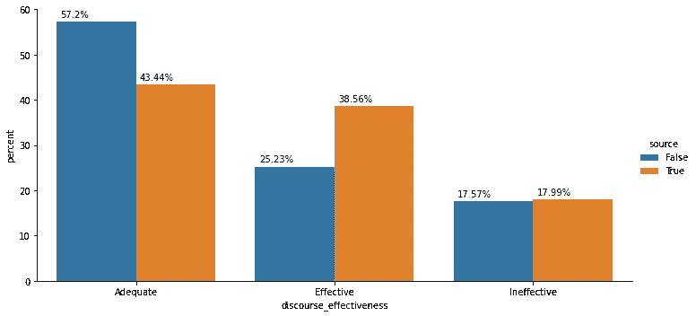
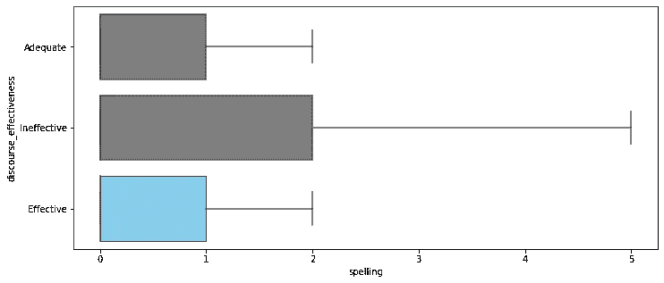
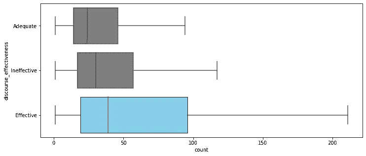
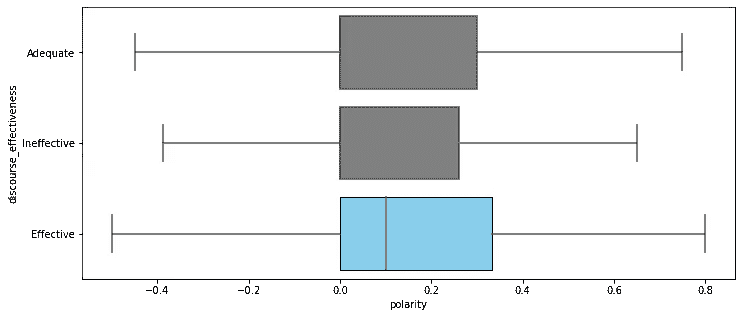
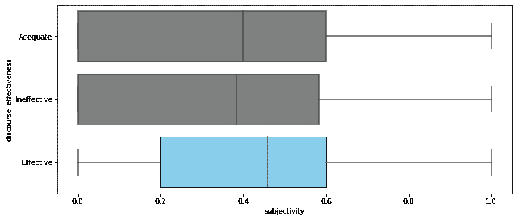
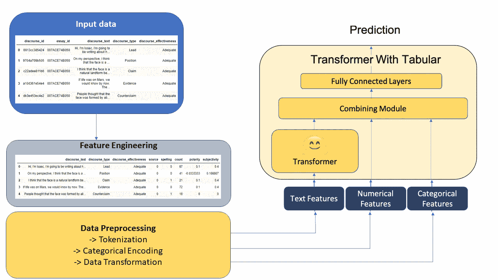
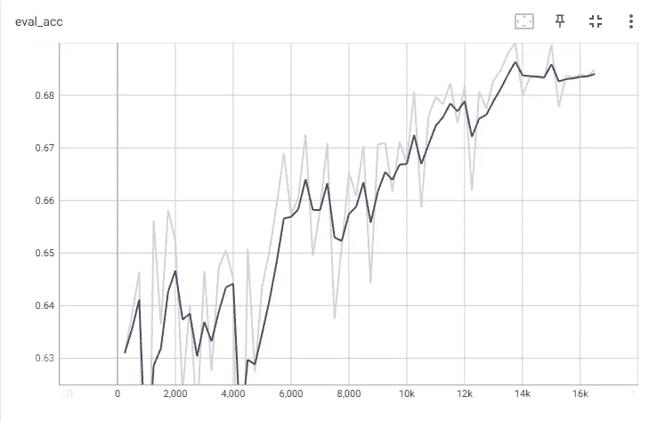
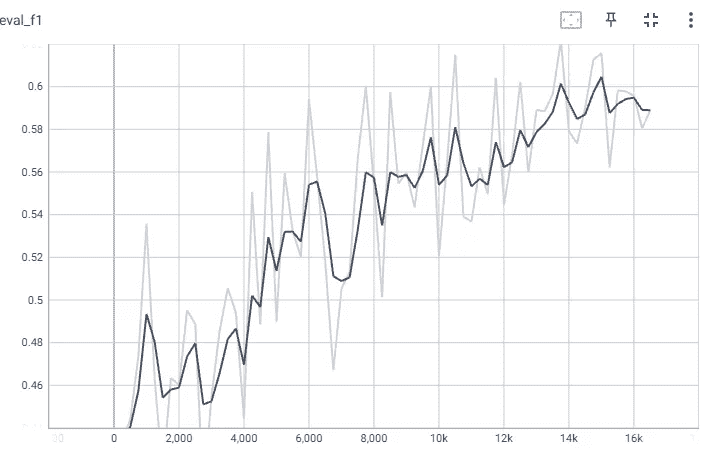
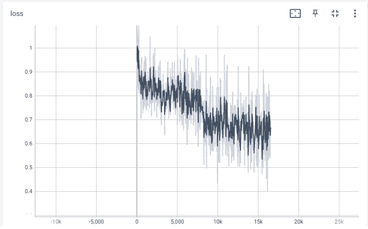
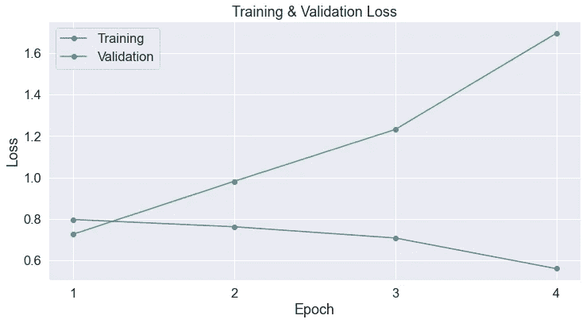

# 通过 MLP +伯特预测论文有效性

> 原文：<https://towardsdatascience.com/predicting-essay-effectiveness-through-mlp-bert-4e8e8d6562ad>

## ***利用 BERT 的分类和数值特征改进模型***

照片由[弗洛里安·克劳耶](https://unsplash.com/@florianklauer?utm_source=medium&utm_medium=referral)在 [Unsplash](https://unsplash.com?utm_source=medium&utm_medium=referral) 拍摄

有效写作一直是确保有效交流思想、批判性思维和说服力的关键。写作作为一种技能是在现代社会取得成功的必要条件。然而，尽管全球识字水平正在缓慢提高，但各国和社会人口群体之间的增长并不均衡。例如，多项研究表明，美国存在[教育不平等](https://en.wikipedia.org/wiki/Educational_inequality_in_the_United_States#:~:text=Disparities%20in%20academic%20access%20among,the%20student%20and%20their%20school.)的例子。这种现象最终可能导致基尼系数不断扩大的恶性循环。

解决这个问题的一个办法是让学生评估自己的写作效果。通过开发自动指导，学生可以评估他们自己的写作效果，这使他们能够用更少的专用资源更高效地学习。这个解决方案可以是一个网络应用程序的形式，学生上传他们的议论文，并给出一个输出来评估论文的有效性

这项比赛的目标是将学生写作中的议论文要素分为“有效”、“足够”或“无效”。

**数据集**

数据集由 Kaggle 通过佐治亚州立大学提供。本文中不会有数据分布。数据可以在[卡格尔](https://www.kaggle.com/competitions/feedback-prize-effectiveness/data)上找到。

**数据探索**

从表面上看，所提供的数据集只包含一列文本语料库。然而，我们可以通过上下文知识设计多个特征，这将使我们的模型表现得更好。

**引文**

每个大学生都知道引用对提高你的文章的有效性有多重要。因此，如果在文本正文中检测到任何“源”,我们创建一个标记真/假的特征。

很明显，有效的文章有“源”在场。

**拼写错误**

利用 python 库 [tqdm](https://pypi.org/project/tqdm/) 识别最常见的拼写错误。我没有把它做成一个二元特征(是/没有拼写错误)，而是把它做成一个带有拼写错误数量的数字特征。

虽然所有目标特征的中值分数大致相同，但显然无效文章的分布范围更广。

**字数**

与其他课程相比，有效的文章有相对较高的单词中位数

**极性和主观性**

极性和主观性很大程度上源自 python 包 [textblob](https://textblob.readthedocs.io/en/dev/) ，它提供了一个简单的 NLP API。文本语料库的极性被评分在-1 到 1 之间，其中-1 表示负面情绪，+1 表示正面情绪。

文本语料库的主观性评分在 0 到 1 之间，其中 0 代表客观性，1 代表主观性。基于数据集，与其他班级相比，有效论文通常倾向于具有稍高的中位数。

**数据建模**

用橙色突出显示的是通过[多模态工具包](https://github.com/georgian-io/Multimodal-Toolkit)处理的工具包。数据预处理代码片段可以在下面找到。我对分类特征使用了[一键编码](https://scikit-learn.org/stable/modules/generated/sklearn.preprocessing.OneHotEncoder.html)，对数字特征使用了 yeo-johnson 变换，因为数字特征中的一些数据可能非常小或者是负数。

默认变换是 [One Hot 编码](https://scikit-learn.org/stable/modules/generated/sklearn.preprocessing.OneHotEncoder.html)和 [yeo-johnson 变换](https://statisticaloddsandends.wordpress.com/2021/02/19/the-box-cox-and-yeo-johnson-transformations-for-continuous-variables/)

**定义指标**

因为这是一个多类、分类问题。使用准确度、F1 分数和训练损失来评估结果。结果在准确性方面实现了边际增加(0.63 到 0.68)，而在 F1 方面实现了更高的增益(0.46 到 0.59)。

损失函数表明存在收敛，但在 10k 步后达到稳态。

不同训练的评估损失。

**结论**

在第一轮比赛中，我采用了一个普通的 BERT 模型，并在语料库上对它进行了训练。然而，结果并不一致，结果很差。

香草伯特模型的第一次迭代

在第二次迭代中，我创建了额外的功能，为问题陈述提供了背景，很像教师在评估论文有效性时直观使用的评分标准或清单。这使得所有性能指标的模型性能都有了很大的提高。如果我们使用多类对数损失对其进行评估，结果将更容易解释，因为它输出了每类的概率。有关性能评估的更多信息，请参考我的 github [repo](https://github.com/kmt112/Predicting-Effective-Arguments_kaggle) ，我在那里上传了 EDA 和建模笔记本。

另一个可以实现的关键改进是将话语类型作为特征分析的一部分。如果不包含这个特性，它就类似于用反驳的方式来评估引导段落。

**消息来源**

[1]数据集:[https://www . ka ggle . com/competitions/feedback-prize-effectiveness](https://www.kaggle.com/competitions/feedback-prize-effectiveness)。

[2]造型:[https://github.com/georgian-io/Multimodal-Toolkit](https://github.com/georgian-io/Multimodal-Toolkit)