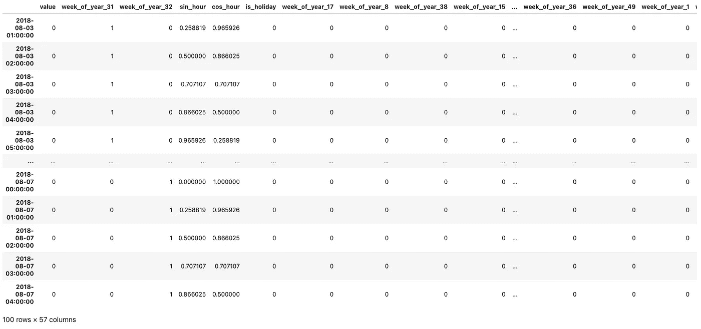
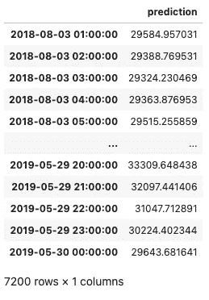
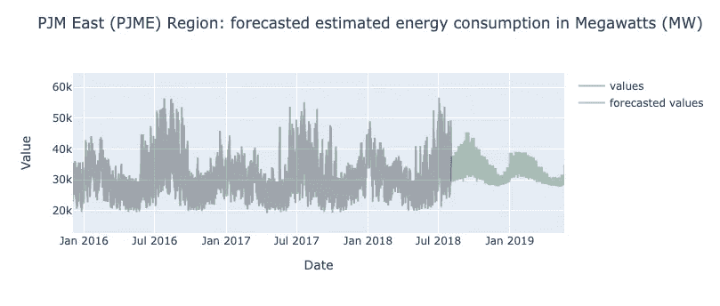
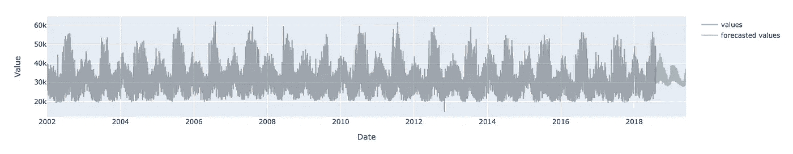
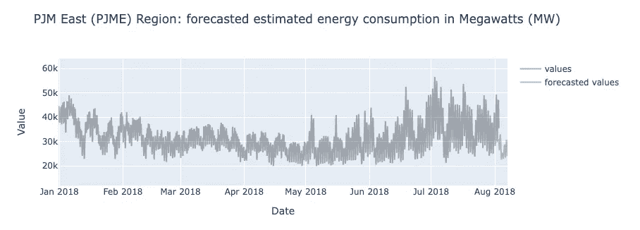
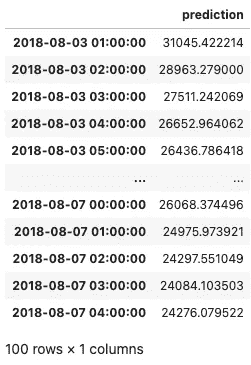

# 使用 PyTorch 预测 RNN、LSTM 和 GRU 的未来值

> 原文：<https://towardsdatascience.com/predicting-future-values-with-rnn-lstm-and-gru-using-pytorch-d9ef50991ec7>


恩库鲁列科·乔纳斯在 [Unsplash](https://unsplash.com?utm_source=medium&utm_medium=referral) 上的照片

# 使用 PyTorch 预测 RNN、LSTM 和 GRU 的未来值

## 将算法用于预测未来价值

在我之前的博文中，我帮助你开始使用 PyTorch 构建一些递归神经网络(RNN)，比如香草 RNN、LSTM 和 GRU。如果您还没有看过，我强烈建议您先看一下，因为我将基于我在那里提供的一些概念和代码进行构建。同样，在这篇文章中，我也将坚持使用相同的数据集， [PJM 的每小时能耗](https://www.kaggle.com/robikscube/hourly-energy-consumption)。上次我们停止了对测试集进行预测，并根据实际值评估模型性能。尽管有一个好的开始，我们还是错过了拼图的一部分。

如果我们被要求对没有实际值的时间步长进行预测，该怎么办？这通常是时间序列预测的情况；我们从历史时间序列数据开始，预测接下来会发生什么。这篇文章将向你展示如何使用我们之前创建的 RNN、LSTM 和 GRU 模型来预测未来的价值。所以，不像那一个，这将是一个相对较短的一个——我希望。

# 使用日期时间功能进行预测

为了生成对未来的预测，我向类*优化*添加了一个新函数，该函数与方法*评估*一样，采用*预测 _ 加载器*、*批量 _ 大小*和*n _ 特征*，并生成对未来的*n _ 步数*的预测。与*评估*不同，生成的预测不受数据帧中实际值的约束，而是受作为输入给出的步数的约束。当然，这只是一种方法，但是你也可以通过限制你的预测日期来尝试一下。

根据我们正在处理的数据集的频率，我们可以选择每小时、每天或每月进行预测。一种方法是将这些参数手动传递给我们的预测函数。嗯，我想这还不够有趣。我们还可以编写一个简单的函数来获取数据集的开始日期和时间频率。它只是获取最后一个 *DateTimeIndex* 值，并加上前一个索引之间的时间间隔。至于频率，类似地，我们将返回这两点之间的时间间隔。使用这两个值， *start_date* 和 *freq* ，我们可以生成跨越预测期的 *DateTimeIndex* 。

就像我们之前对历史数据进行预测一样，我们现在将使用*日期时间*要素、一键编码、循环要素和节假日来生成要素。



图片作者。

现在，是时候为预测值创建一个数据加载器实例了。你可能已经在想了，*“没有实际值，我们到底要怎么填写目标值(y)。”*我找到了一个快速解决问题的方法，只需将所有预测指数的*值*列设置为 0，并忽略后面阶段的指数。

如果您检查类*优化*中的函数，名为 *forecast_with_predictors，*您可能会注意到我忽略了 DataLoader 实例的目标值部分。而且，公平地说，我不确定这是否接近最佳实践，所以如果您能想到更优雅的方法来解决它，请随时联系我。

接下来，我们调用*优化*的*forecast _ with _ predictors*函数来生成预测。如您所料，该函数返回根据您在上一步中选择的变换缩放的值。

然后，我们需要将缩放后的预测值逆变换为原始目标值，就像我们之前使用 *inverse_transform* 所做的那样



图片作者。

我将使用 Plotly 包来绘制预测值，如下所示。正如你在下面看到的，这可能不是最好的预测。从这里开始，您可以通过许多方式来探索如何改善结果，无论是功能工程、超参数调整还是选择完全不同的模型。看你的了！



图片作者。



图片作者。

# 具有滞后特征的预测

用滞后观测值预测时间序列，或简称滚动时间序列，需要一种稍微不同的方法。与具有日期时间特征的时间序列不同，我们不能简单地填充未来的滞后时间观测值。相反，我们需要用每个新的预测更新下一步，并滚动时间窗口。所以，如果这部分看起来或多或少像是一个入门级的 CS 编程练习，相信你的直觉。

同样，我们将另一个方法 *forecast_with_lag* 添加到*优化*类中，以使用滚动逻辑生成预测。

*DataLoader* 类表示数据集上的 Python iterable。因此，下面一行通过迭代整个数据集来帮助获得一个*数据加载器*实例中的最后一个时间步长。

```
*_, (X, y) = test_loader_iter
```

下面一行将张量的第二维值移动一位，这样张量`[[[x1, x2, x3, ... , xn ]]]`就变成了`[[[xn, x1, x2, ... , x(n-1)]]]`。

```
X = torch.roll(X, shifts=1, dims=2)
```

下面的行从 3D 张量的最后一个维度中选择第一个元素，并将该项设置为存储在*NumPy*ndarray(*yhat*)，`[[xn+1]]`中的预测值。然后，新的输入张量变成`[[[x(n+1), x1, x2, ... , x(n-1)]]]`

```
X[..., -1, 0] = yhat.item(0)
```

就像我们之前做的那样，我们可以为带有滞后观测值的时间序列生成预测，并绘制预测的未来值。为了避免重复，我将只分享几个时代的训练后的一些样本结果。但是你可以看看我在这篇文章中分享的 Google Colab 笔记本是如何做到的。



图片作者。



图片作者。

根据模型预测的值进行多次单步预测可能会在短期内产生合理的结果。随着预测周期的增加，预测变得越来越不准确，因此也越来越不适合预测。

此外，为了进行多次单步预测并在每次预测后更新输入，我们必须一个接一个地遍历数据集，就像我们在测试集上遍历 for 循环一样。毫不奇怪，这使我们失去了矩阵运算和小批量训练为我们提供的所有计算优势。

总而言之，我非常怀疑基于滚动的预测方法是一个好的实践。此外， *LSTM* 和 *GRU* 可以很好地将过去的观测结果带到下一次观测，而不会遇到*递减/爆炸梯度*的问题。

# 最后的话

我没想到我会花这么长时间来跟进我的上一篇文章，但我很高兴我最终做到了。我希望这篇文章能帮助你更好地理解如何使用两种不同的方法来预测未来值。如果有任何你同意或不同意的地方，请不要犹豫评论或联系我。

最后，这里有一个[链接](https://colab.research.google.com/drive/1sOQjtErD70IeV2eJCBysQwi0DQKIzvU1?usp=sharing)到 Google Colab 笔记本，如果你想看完整的带有新预测方法的笔记本。在下一篇文章中，我计划回顾一些正则化技术及其在时间序列预测中的应用。但是我们会看到它如何发展。