# 用 PySpark 预测心脏病

> 原文：<https://towardsdatascience.com/predicting-heart-disease-with-pyspark-5a871286946e>

## PySpark 二进制分类教程


照片来自 [Unsplash](https://unsplash.com/) 上的 [Robina Weermeijer](https://unsplash.com/@averey)

# **简介**

本指南将从头到尾向您展示如何构建和运行 PySpark 二元分类模型。

这里使用的数据集是来自 [UCI 机器学习库](https://archive.ics.uci.edu/ml/datasets.php)的[心脏病](https://archive.ics.uci.edu/ml/datasets/heart+disease)数据集。阿尔，1988)。如果在出版物中使用，关于该数据集的唯一说明/许可信息是引用作者。这是一个二元分类数据集。我们今天将使用 PySpark 来构建各种分类模型。

我最近发布了这个指南，展示如何从本地计算机连接 Jupyter 笔记本会话到 Linux 托管的 Apache Spark 独立集群。

今天，我还将向您展示如何在您的本地 Mac 笔记本电脑上设置并连接到一个独立的集群，供那些无法访问虚拟机的人使用。当然，在 Mac 上启动本地 PySpark 会话可能更容易，而不需要设置集群。但是，如果您想将 Mac 用作主节点并添加工作节点，这将向您展示如何操作。

**设置独立集群**

1.  转到 Mac 终端窗口中的%SPARK_HOME%文件夹，并运行:

```
./sbin/start-master.sh
```

2.在另一个终端窗口中，转到%SPARK_HOME%文件夹并运行:

```
./sbin/start-worker.sh spark://ip:port
```

您可以使用相同的策略将网络上的任何工作节点添加到主节点。

注意:启动主节点后，如果在浏览器中转到 http://localhost:8080，就可以获得 spark://ip:port。

**设置 Jupyter 笔记本**

1.  在 Mac 上的另一个终端窗口中运行:

```
jupyter notebook 
```

这将在浏览器中打开一个 Jupyter 笔记本会话。

**将 Jupyter 笔记本连接到 Spark 集群。**

1.在 Jupyter 笔记本中打开一个新的 Python 3 内核并运行:

```
import pyspark
import findspark
from pyspark import SparkConf, SparkContext
from pyspark.sql import SQLContext
from pyspark.sql.types import *
from pyspark import SparkConf, SparkContextfindspark.init('/path_to_spark/spark-3.1.2-bin-hadoop3.2') 
#The key here is putting the path to the spark download on your Mac
VM.sc=pyspark.SparkContext(master='spark://ip:port',appName='Heart_Disease_Example')
#Use the same 'spark://ip:port' from connecting the worker(s) to the master node. 
spark = SQLContext(sc)
spark
```

现在我们连接到我们的火花簇。开始建模吧。

# 建模

**数据**

我们的数据集是来自 UCI 机器学习知识库的[心脏病](https://archive.ics.uci.edu/ml/datasets/heart+disease)数据集(Dubois 2008)。你可以在这里下载 csv 文件[。](https://github.com/chriskuchar/Heart_Data)

```
from pyspark.sql import functions as F
from pyspark.ml.feature import OneHotEncoder, StringIndexer, VectorAssembler
from pyspark.ml.feature import CountVectorizerfrom pyspark.ml.tuning import ParamGridBuilder
from pyspark.ml.evaluation import BinaryClassificationEvaluator
import numpy as np
from pyspark.ml.tuning import CrossValidator
import plotly.graph_objects as godf=spark.read.csv('heart.csv', inferSchema=True, header=True)
df.count()
len(df.columns)
```

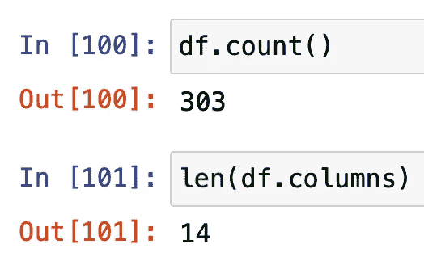

作者图片

我们的数据集有 303 行和 14 列。是的，这种规模的数据集不需要 Spark。这个小数据集只是为了便于运行示例模型。

```
df.dtypes
```

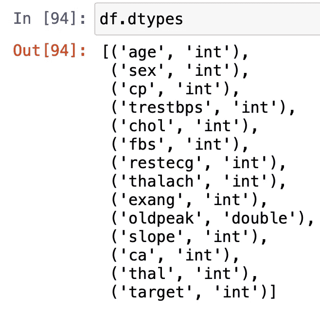

作者图片

我们的数据都是整数/双精度，所以我们不需要为任何分类变量编码。

**特征信息:**

**1。年龄:**以年为单位的人的年龄

**2。性别:**人的性别(1 =男性，0 =女性)

**3。cp:** 所经历的胸痛(0 =典型心绞痛，1=非典型心绞痛，2=非心绞痛性疼痛，3 =无症状)

**4。trestbps** :患者的静息血压(入院时为毫米汞柱)

**5。**胆固醇:人的胆固醇测量值，单位为毫克/分升

**6。fbs:** 此人的空腹血糖(> 120 mg/dl，1 =真；0 =假)。

**7。静息心电图:**静息心电图测量(0 =正常，1 = ST-T 波异常，2 =根据 Estes 标准显示可能或明确的左心室肥大)

**8。thalach:** 人达到的最大心率

**9。exang:** 运动诱发心绞痛(1 =是；0 =否)

10。oldpeak: 运动相对于休息诱发的 ST 段压低

11。斜率:运动 ST 段峰值的斜率(0 =上升，1 =平缓，2 =下降)

12。ca: 主要血管的数量(0-4)

13。地中海贫血:一种叫做地中海贫血的血液疾病(3 =正常；6 =修复缺陷；7 =可逆转的缺陷)

14。目标:心脏病(0 =否，1 =是)

**检查缺失值:**

```
from pyspark.sql.functions import col,sum
df.select(*(sum(col(c).isNull().cast("int")).alias(c) for c in df.columns)).show()
```

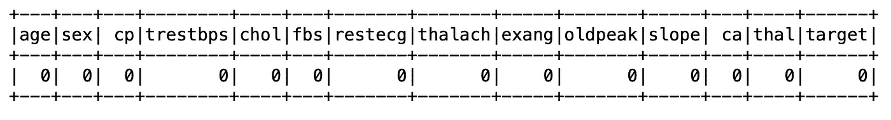

作者图片

太好了。没有缺失值，因此我们不需要执行任何插补方法。

**数据集概要**

```
df.describe().toPandas().transpose()
```

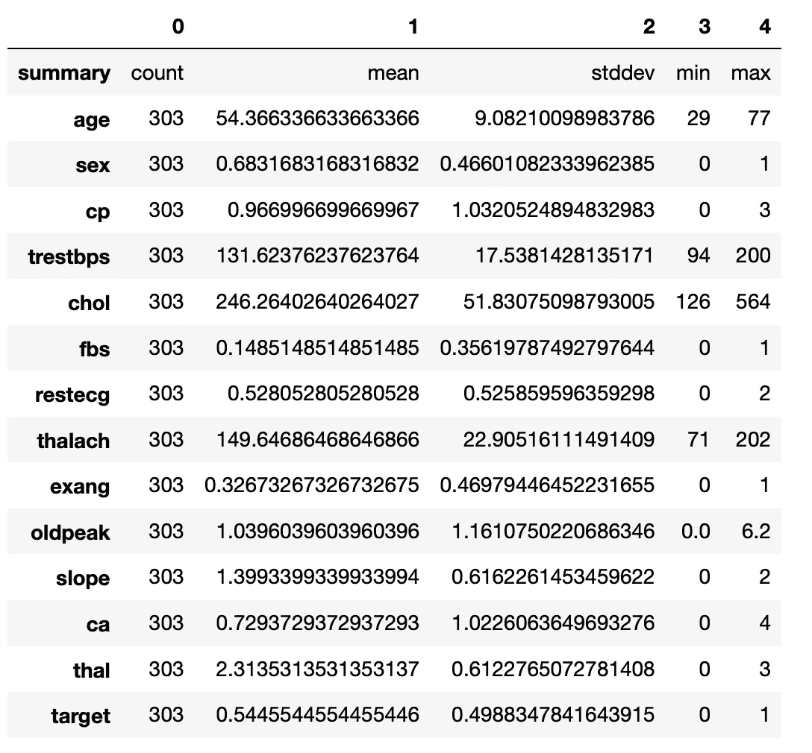

作者图片

**目标变量饼图:**

```
df2=df.toPandas()
df22=df2.groupby('target').count().reset_index()[['target','age']].rename(columns={'age':'counts'})
colors = ['gold', 'mediumturquoise', 'darkorange', 'lightgreen']fig = go.Figure(data=[go.Pie(labels=df22.target,
                             values=df22.counts)])
fig.update_traces(hoverinfo='label+percent', textinfo='value+percent', textfont_size=20, textfont_color='black',
                  marker=dict(colors=colors, line=dict(color='#000000', width=2)))
# fig.show()
fig.update_layout(title='Heart Disease vs. Absence of Heart Disease', title_x=0.5)
```

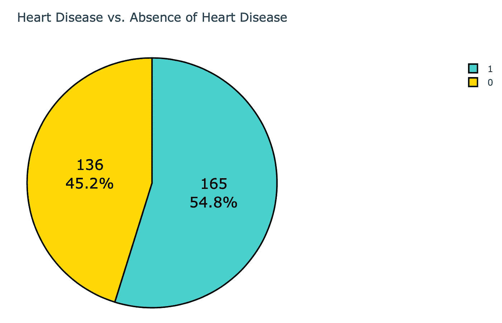

作者图片

**特征变量直方图:**

```
from plotly.subplots import make_subplotsfig = make_subplots(rows=4, cols=4, start_cell="top-left",
                   subplot_titles=df2.columns[:-1])fig.add_trace(go.Histogram(x=df2.age, name='age'),
              row=1, col=1)fig.add_trace(go.Histogram(x=df2.sex, name='sex'),
              row=1, col=2)fig.add_trace(go.Histogram(x=df2.cp, name='cp'),
              row=1, col=3)fig.add_trace(go.Histogram(x=df2.trestbps, name='trestbps'),
              row=1, col=4)fig.add_trace(go.Histogram(x=df2.chol, name='chol'),
              row=2, col=1)fig.add_trace(go.Histogram(x=df2.fbs, name='fbs'),
              row=2, col=2)fig.add_trace(go.Histogram(x=df2.restecg, name='restecg'),
              row=2, col=3)fig.add_trace(go.Histogram(x=df2.thalach, name='thalach'),
              row=2, col=4)fig.add_trace(go.Histogram(x=df2.exang, name='exang'),
              row=3, col=1)fig.add_trace(go.Histogram(x=df2.oldpeak, name='oldpeak'),
              row=3, col=2)fig.add_trace(go.Histogram(x=df2.slope, name='slope'),
              row=3, col=3)fig.add_trace(go.Histogram(x=df2.thalach, name='ca'),
              row=3, col=4)fig.add_trace(go.Histogram(x=df2.thal, name='thal'),
              row=4, col=1)fig.update_layout(title='Histograms of Variables', title_x=0.5)
```

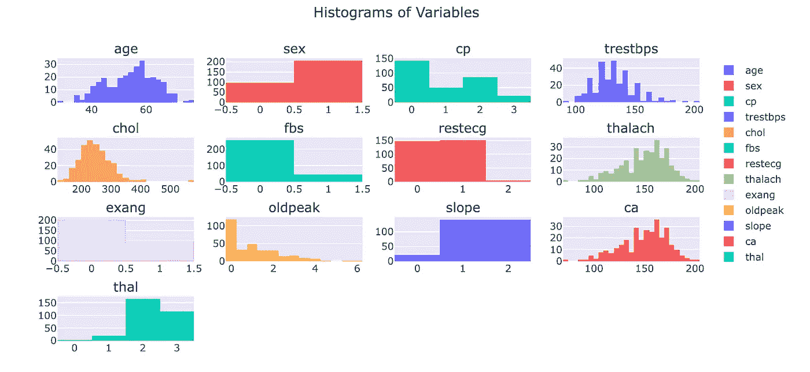

作者图片

Oldpeak 明显右倾。为了解决这个问题，我可以做一个 log(x+1)转换。由于我更倾向于使用基于树的模型来解决这个问题，所以我不太关心将数据转换成正态分布。这是因为它不是一个假设，例如，随机森林或梯度推进。但是对于像逻辑回归这样的东西，让数据正态分布是一个假设。不管怎样，让我们继续改造它吧。

```
df3=df.withColumn('oldpeaklog', F.log(df['oldpeak']+1))
df33=df3.toPandas()fig = make_subplots(rows=1, cols=2, start_cell="top-left",
                   subplot_titles=['oldpeak','oldpeaklog'])fig.add_trace(go.Histogram(x=df33.oldpeak, name='oldpeak'),
              row=1, col=1)fig.add_trace(go.Histogram(x=df33.oldpeaklog, name='oldpeaklog'),
              row=1, col=2)fig.update_layout(title='Transforming oldpeak', title_x=0.5
```

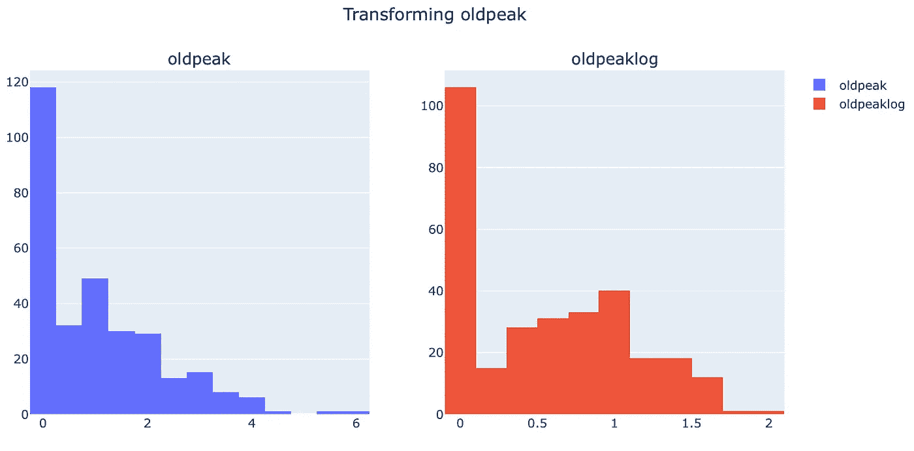

作者图片

经过转换后，它看起来更正态分布。

**关联矩阵热图:**

```
corr = df33.corr()
fig = go.Figure(data=go.Heatmap(z=corr.values,
 x=corr.index.values,
 y=corr.columns.values,
 text=np.round(corr.values,2),
 texttemplate=”%{text}”))fig.update_layout(title=dict(text=’Correlation Matrix Heatmap’,font=dict(size=20), x=0.5))
```

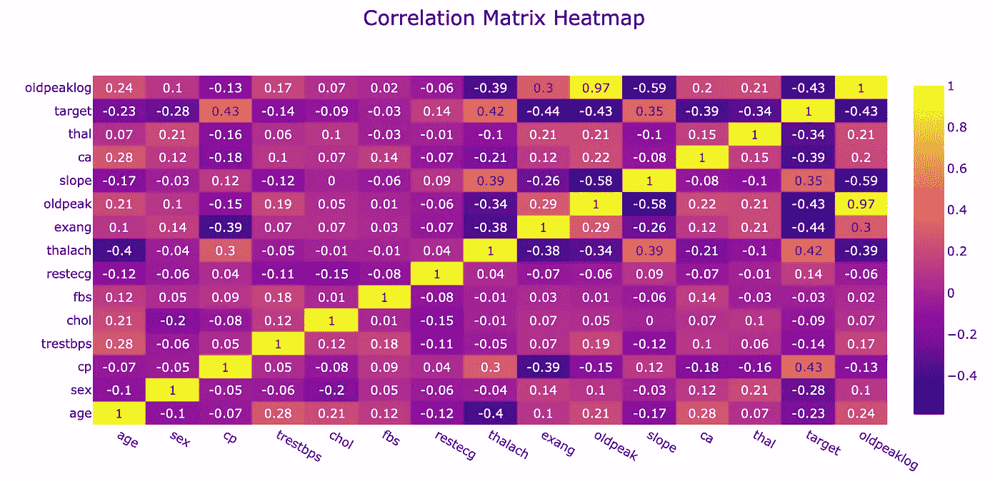

作者图片

斜率和 oldpeaklog 之间的最高相关性为-.59，或者斜率和 oldpeak 之间的最高相关性为-.58。其他都低于 0.5 或高于 0.5，即更接近于 0。因此，我决定保留模型中的所有变量。

**初始化阶段**

```
#Initialize stages
stages = []#Target column
label_stringIdx = StringIndexer(inputCol = 'target', outputCol = 'label')
stages += [label_stringIdx]#Numeric Columns
numericCols = ['age',
 'sex',
 'cp',
 'trestbps',
 'chol',
 'fbs',
 'restecg',
 'thalach',
 'exang',
 'slope',
 'ca',
 'thal',
 'oldpeaklog'] #Create a vector assembler
assemblerInputs = numericCols 
assembler = VectorAssembler(inputCols=assemblerInputs, outputCol="features").setHandleInvalid('keep')
stages += [assembler]
```

**架设管道**

```
from pyspark.ml import Pipeline
pipeline = Pipeline(stages = stages)
pipelineModel = pipeline.fit(df3)
df3 = pipelineModel.transform(df3)
selectedCols = ['label', 'features'] + 
['age',
 'sex',
 'cp',
 'trestbps',
 'chol',
 'fbs',
 'restecg',
 'thalach',
 'exang',
 'slope',
 'ca',
 'thal',
 'oldpeaklog','target']df3 = df3.select(selectedCols)
df3.printSchema()
```

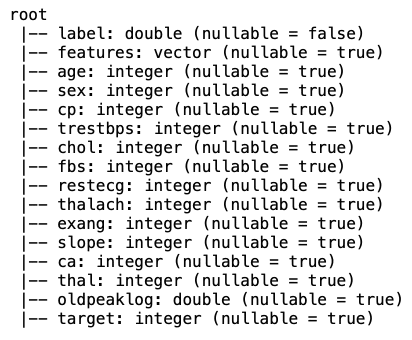

作者图片

**分为训练和测试**

```
train, test = df3.randomSplit([0.7, 0.3], seed = 2018)
train.groupby('target').count().show()
test.groupby('target').count().show()
```

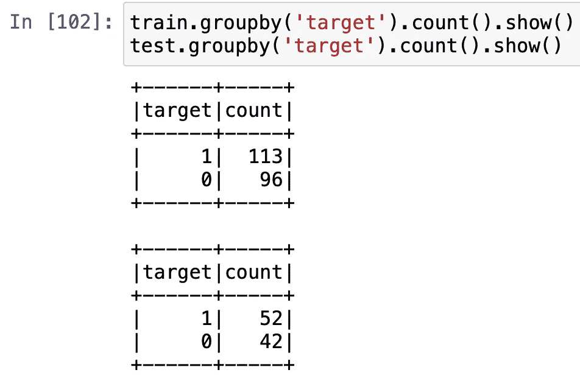

作者图片

对于培训和测试来说，这些课程看起来相对平衡。所以，我们不需要做任何的阶级平衡。让我们做一些模型。

# **型号**

## **随机森林**

```
from pyspark.ml.classification import RandomForestClassifierrf = RandomForestClassifier(featuresCol = 'features', labelCol = 'label', seed=101)
rfModel = rf.fit(train)
predictions_rf=rfModel.transform(test)
```

**模型的整体精度**

```
from pyspark.ml.evaluation import MulticlassClassificationEvaluatorevaluator_rf = MulticlassClassificationEvaluator(predictionCol=”prediction”)
evaluator_rf.evaluate(predictions_rf)
```

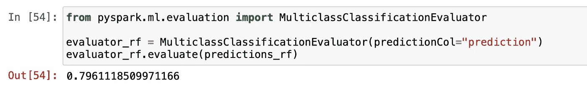

作者图片

**混淆矩阵**

```
predictions_rf.crosstab('label','prediction').show()
```

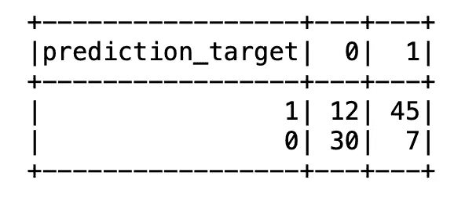

作者图片

**ROC &精度召回曲线**

```
from handyspark import *# Creates instance of extended version of BinaryClassificationMetrics
# using a DataFrame and its probability and label columns, as the output
# from the classifier
bcm = BinaryClassificationMetrics(predictions_rf, scoreCol='probability', labelCol='label')# Get metrics from evaluator
print("Area under ROC Curve: {:.4f}".format(bcm.areaUnderROC))
print("Area under PR Curve: {:.4f}".format(bcm.areaUnderPR))# Plot both ROC and PR curves
fig, axs = plt.subplots(1, 2, figsize=(12, 4))
bcm.plot_roc_curve(ax=axs[0])
bcm.plot_pr_curve(ax=axs[1])
```


作者图片

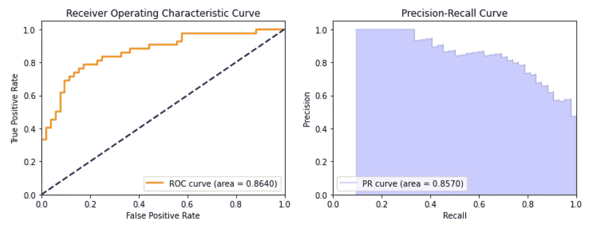

作者图片

**测试各种阈值**

这是一个基于任何输入的阈值得到混淆矩阵的函数。

```
split1_udf = F.udf(lambda value: value[0].item(), FloatType())
split2_udf = F.udf(lambda value: value[1].item(), FloatType())def test_threshold(model, prob):
    output2 = model.select('rawPrediction','target','probability',split1_udf('probability').alias('class_0'), split2_udf('probability').alias('class_1'))
    from pyspark.sql.functions import col, when
    output2=output2.withColumn('prediction', when(col('class_0')> prob, 1).otherwise(0))
    output2.crosstab('prediction','target').show()
```

使用这个定制的 test_threshold 函数，您可以查看混淆矩阵，这取决于您是否想要更高的精度或更高的召回率等。

```
test_threshold(predictions_rf,.6)
```

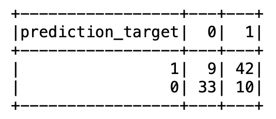

作者图片

```
test_threshold(predictions_rf,.7)
```

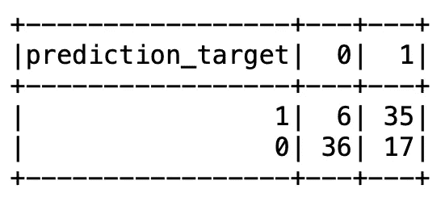

作者图片

**特征重要性**

```
feat_imps=rfModel.featureImportances
x_values = list(range(len(feat_imps)))
plt.bar(x_values, feat_imps, orientation = 'vertical')
plt.xticks(x_values, ['age','sex','cp','trestbps','chol','fbs','restecg','thalach','exang','slope','ca','thal','oldpeaklog'], rotation=40)
plt.ylabel('Importance')
plt.xlabel('Feature')
plt.title('Feature Importances')
```

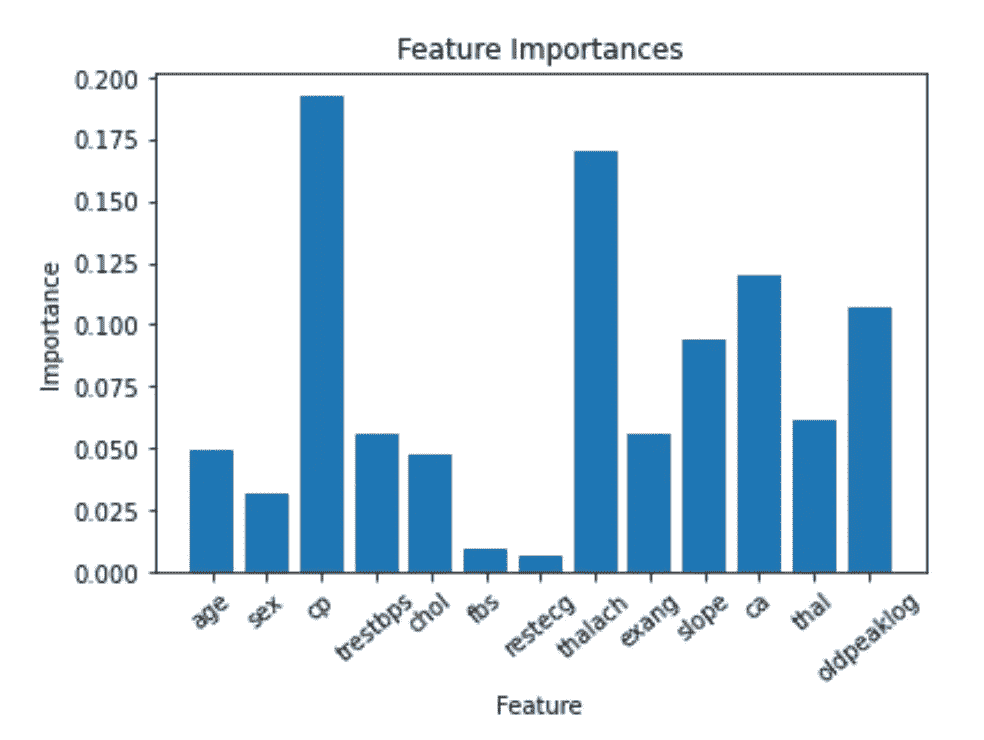

作者图片

使用这个，我们可以看到对预测最重要的变量依次是 cp、thalach、ca 和 oldpeaklog。

**调谐超参数**

```
paramGrid_rf = ParamGridBuilder() \
    .addGrid(rf.numTrees, [int(x) for x in np.arange(200,221,10)]) \
    .addGrid(rf.maxDepth, [int(x) for x in np.arange(10,11,10)]) \
    .addGrid(rf.featureSubsetStrategy, [x for x in ["sqrt", "log2", "onethird"]]) \
    .addGrid(rf.impurity, [x for x in ['gini','entropy']]) \
    .addGrid(rf.maxBins, [int(x) for x in np.arange(22, 42, 10)]) \
    .build()
evaluator = BinaryClassificationEvaluator()rf_crossval = CrossValidator(estimator=rf,
                          estimatorParamMaps=paramGrid_rf,
                          evaluator=evaluator,
                          numFolds=3)
rf_cvModel = rf_crossval.fit(train)
predictions_rf_cv = rf_cvModel.transform(test)
```

**最佳 CV 模型的总体精度**

```
evaluator_rf_cv = MulticlassClassificationEvaluator(predictionCol="prediction")
evaluator_rf_cv.evaluate(predictions_rf_cv)
```

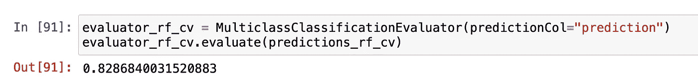

作者图片

变好了！准确率从 79.6%提高到 82.8%。现在，什么特征是最重要的，最佳模型使用了什么超参数？

**最佳模型的特征重要性**

```
import matplotlib.pyplot as plt
feat_imps=rf_cvModel.bestModel.featureImportances
x_values = list(range(len(feat_imps)))
plt.bar(x_values, feat_imps, orientation = 'vertical')
plt.xticks(x_values, ['age','sex','cp','trestbps','chol','fbs','restecg','thalach','exang','slope','ca','thal','oldpeaklog'], rotation=40)
plt.ylabel('Importance')
plt.xlabel('Feature')
plt.title('Feature Importances')
```

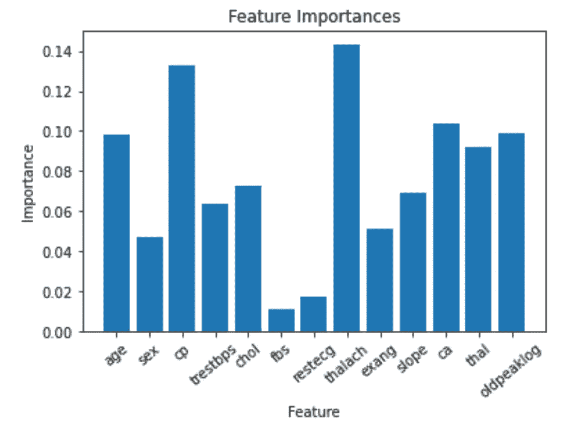

作者图片

**获取最佳随机森林 CV 模型的超参数值**

```
print('Num Trees: ' + str(rf_cvModel.bestModel.getNumTrees))
print('Max Depth: ' + str(rf_cvModel.bestModel.getMaxDepth()))
print('Feature Subset Strategy: ' + str(rf_cvModel.bestModel.getFeatureSubsetStrategy()))
print('Impurity: ' + str(rf_cvModel.bestModel.getImpurity()))
print('Max Bins: ' + str(rf_cvModel.bestModel.getMaxBins()))
```

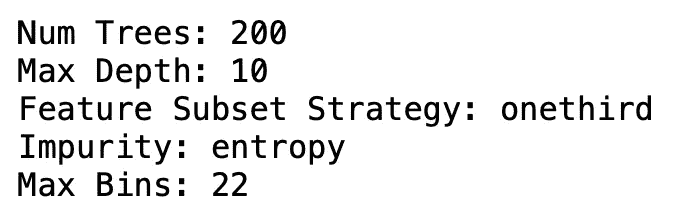

作者图片

## **逻辑回归**

```
from pyspark.ml.classification import LogisticRegressionlr = LogisticRegression(maxIter=20, regParam=0.3, elasticNetParam=0,featuresCol = 'features', labelCol = 'label')
lrModel = lr.fit(train)
predictions_lr = lrModel.transform(test)
```

**模型的整体精度**

```
evaluator_lr = MulticlassClassificationEvaluator(predictionCol="prediction")
evaluator_lr.evaluate(predictions_lr)
```

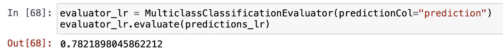

作者图片

**打印逻辑回归的系数和截距**

```
# Print the coefficients and intercept for logistic regression
print("Coefficients: " + str(lrModel.coefficients))
print("Intercept: " + str(lrModel.intercept))
```

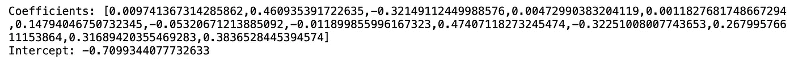

作者图片

**混淆矩阵**

```
predictions_lr.crosstab('label','prediction').show()
```

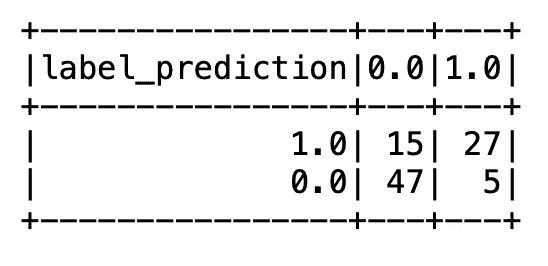

作者图片

**ROC & PR 曲线**

```
# Creates instance of extended version of BinaryClassificationMetrics
# using a DataFrame and its probability and label columns, as the output
# from the classifier
bcm = BinaryClassificationMetrics(predictions_lr, scoreCol='probability', labelCol='label')# Get metrics from evaluator
print("Area under ROC Curve: {:.4f}".format(bcm.areaUnderROC))
print("Area under PR Curve: {:.4f}".format(bcm.areaUnderPR))# Plot both ROC and PR curves
fig, axs = plt.subplots(1, 2, figsize=(12, 4))
bcm.plot_roc_curve(ax=axs[0])
bcm.plot_pr_curve(ax=axs[1])
```

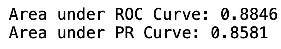

作者图片

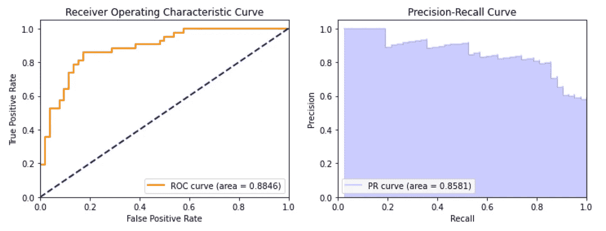

作者图片

**调整超参数**

```
paramGrid_lr = ParamGridBuilder() \
    .addGrid(lr.maxIter, [int(x) for x in np.arange(10,30,10)]) \
    .addGrid(lr.regParam, [int(x) for x in np.arange(.1,.5,.1)]) \
    .addGrid(lr.elasticNetParam, [int(x) for x in np.arange(0,.2,.1)]) \
    .build()
evaluator = BinaryClassificationEvaluator()
lr_crossval = CrossValidator(estimator=lr,
                          estimatorParamMaps=paramGrid_lr,
                          evaluator=evaluator,
                          numFolds=3)
lr_cvModel = lr_crossval.fit(train)
predictions_lr_cv = lr_cvModel.transform(test)
```

**最佳 CV 模型的总体精度**

```
evaluator_lr_cv = MulticlassClassificationEvaluator(predictionCol="prediction")
evaluator_lr_cv.evaluate(predictions_lr_cv)
```

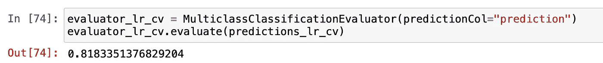

作者图片

看起来精度变好了！从 78.2%上升到 81.8%。

## **逻辑回归 V.2**

我在上面的逻辑回归文档中找不到关于如何获得系数和 P 值的任何地方。因此，我在 pyspark.ml.regression 包中找到了这个独立的逻辑回归模型。我这样做是因为在我看来，没有 p 值的系数是没有用的。

```
from pyspark.ml.regression import GeneralizedLinearRegression
glr = GeneralizedLinearRegression(family="binomial", link="logit", maxIter=10, 
regParam=0.0)
model = glr.fit(train)
summary = model.summary
print('Variables:' + str(train.columns[2:-1]))
print("Coefficient Standard Errors: " + str(summary.coefficientStandardErrors))
print("T Values: " + str(summary.tValues))
print("P Values: " + str(summary.pValues))
```

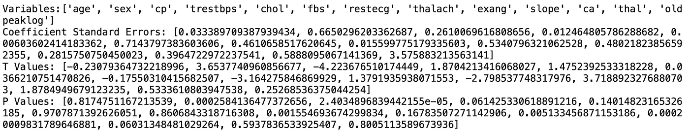

作者图片

使用这些[源文档](https://spark.apache.org/docs/2.2.0/api/python/pyspark.ml.html#pyspark.ml.regression.GeneralizedLinearRegression)你可以获得超参数名称，并重复上述步骤进行网格搜索和准确性。对于这个例子，我不会重复这些步骤，我会留给你。

**朴素贝叶斯**

```
from pyspark.ml.classification import NaiveBayes
nb = NaiveBayes(featuresCol = 'features', labelCol = 'label')
nb_model = nb.fit(train)
predictions_nb=nb_model.transform(test)
```

**模型的整体精度**

```
evaluator_nb = MulticlassClassificationEvaluator(predictionCol="prediction")
evaluator_nb.evaluate(predictions_nb)
```

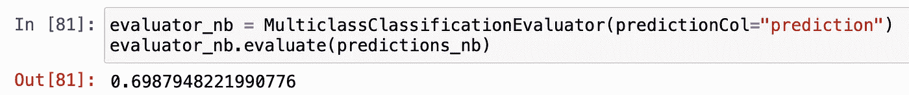

作者图片

**混淆矩阵**

```
predictions_nb.crosstab('label','prediction').show()
```

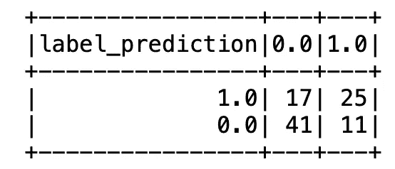

作者图片

**ROC 和 PR 曲线**

```
from handyspark import *
from matplotlib import pyplot as plt
%matplotlib inline
# Creates instance of extended version of BinaryClassificationMetrics
# using a DataFrame and its probability and label columns, as the output
# from the classifier
bcm = BinaryClassificationMetrics(predictions_nb, scoreCol='probability', labelCol='label')# Get metrics from evaluator
print("Area under ROC Curve: {:.4f}".format(bcm.areaUnderROC))
print("Area under PR Curve: {:.4f}".format(bcm.areaUnderPR))# Plot both ROC and PR curves
fig, axs = plt.subplots(1, 2, figsize=(12, 4))
bcm.plot_roc_curve(ax=axs[0])
bcm.plot_pr_curve(ax=axs[1])
```


作者图片

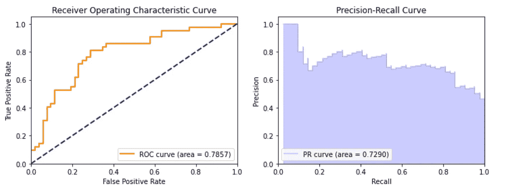

作者图片

**调谐超参数**

```
paramGrid_nb = ParamGridBuilder() \
    .addGrid(nb.smoothing, [int(x) for x in np.arange(1,10,1)]) \
    .build()
evaluator = BinaryClassificationEvaluator()
nb_crossval = CrossValidator(estimator=nb,
                          estimatorParamMaps=paramGrid_nb,
                          evaluator=evaluator,
                          numFolds=3)
nb_cvModel = nb_crossval.fit(train)
predictions_nb_cv = nb_cvModel.transform(test)
```

**评估最佳简历模型**

```
evaluator_nb_cv = MulticlassClassificationEvaluator(predictionCol="prediction")
evaluator_nb_cv.evaluate(predictions_nb_cv)
```

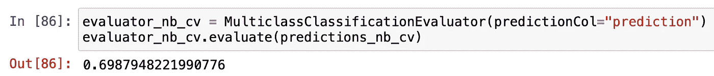

作者图片

## **结论**

看起来随机森林在这里表现最好，网格搜索后的准确率为 82.8%。逻辑回归以 81.8%排在第二位，朴素贝叶斯以 69.8%排在最后。

让我们解释一下随机森林最重要的变量，因为它有最好的预测精度。查看 **cp、thalach 和 ca** :

**cp:** 所经历的胸痛(值 1:典型心绞痛，值 2:非典型心绞痛，值 3:非心绞痛性疼痛，值 4:无症状)

```
df3.groupby('target','cp').count().show()
```

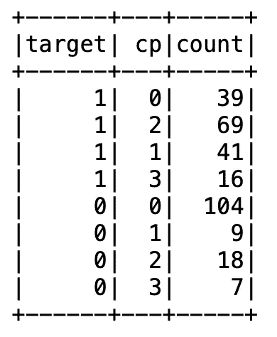

作者图片

Random Forests 表示，大多数被归类为患有心脏病的人患有 CP = 1/非典型心绞痛和 CP = 2/非心绞痛，而大多数未被归类为患有心脏病的人患有 CP = 0/典型心绞痛。

**thalach:** 该人达到的最大心率

```
df34=df33.loc[df33['target']==0,'thalach']
df35=df33.loc[df33['target']==1,'thalach']fig = go.Figure()
fig.add_trace(go.Histogram(x=df34, name='target:0'))
fig.add_trace(go.Histogram(x=df35,name='target:1'))# Overlay both histograms
fig.update_layout(barmode='overlay')
# Reduce opacity to see both histograms
fig.update_traces(opacity=.9)
fig.update_xaxes(title='Thalach Level')
fig.update_yaxes(dtick=5, range=[0,30], title='Count')
fig.update_layout(title='Comparing Thalach Levels', title_x=0.5)
```

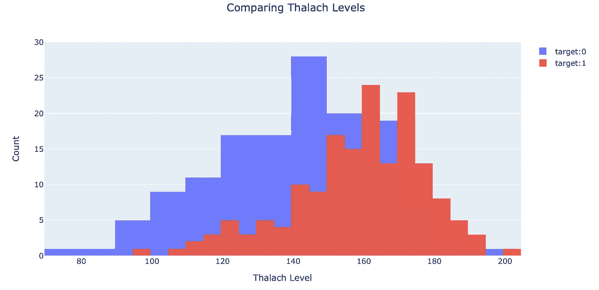

作者图片

根据该图，较高的 Thalach 或最大心率水平对于患有心脏病的分类是重要的，而较低的水平被分类为没有心脏病。

**ca:** 主要血管的数量(0-4)

```
df3.groupby('target','ca').count().show()
```

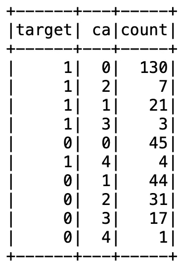

作者图片

Random Forests 表示，大多数被归类为患有心脏病的人有 0 条主要血管，而大多数被归类为没有心脏病的人有更多的主要血管，即> 0 条。

这些变量的分布似乎有直观的意义。另外，我们能够从我们的模型中推断出这一点！

我希望这个 PySpark 模型的例子对您的工作有所帮助。谢谢你的阅读。请随意留下任何评论。

**参考文献:**

克里斯托弗·迪布瓦和史密斯(2008 年)。UCI 网络数据仓库[http://Network Data . ics . UCI . edu]。加州欧文:加州大学信息与计算机科学学院。

雅诺西，安朵斯，斯坦布伦，威廉，普菲斯特勒，马蒂亚斯，德特拉诺，罗伯特和医学博士，医学博士..(1988).心脏病。UCI 机器学习知识库。