# 从抄本预测医学专业:使用 ULMFiT 的完整演练

> 原文：<https://towardsdatascience.com/predicting-medical-specialities-from-transcripts-a-complete-walkthrough-using-ulmfit-b8a075777723>

## 我解释了在这个 [NLP 任务](https://www.kaggle.com/danielcwq/predict-medical-specialty-fastai)中，我如何一步一步地利用 ULMFiT 方法从患者的转录本中预测医学专业


图片来自[通讯社，来自 Unsplash](https://unsplash.com/photos/d9ILr-dbEdg)

# 介绍

医学上通过自我诊断错误预测自己疾病的问题是非常现实的。[在《每日电讯报》的一篇报道中，近四分之一的人进行自我诊断，而不是去看医生。误诊的人中，将近一半的人把自己的病误诊了。虽然这个问题可能有多种根本原因，但这可能源于普遍不愿意也没有能力寻求专业帮助。](https://www.telegraph.co.uk/news/health/news/11760658/One-in-four-self-diagnose-on-the-internet-instead-of-visiting-the-doctor.html)

例如，11%的受访者无法及时找到约会。这意味着在医疗的*筛查*阶段损失了关键时间，并且没有实现**早期诊断，而早期诊断本可以导致疾病更早得到治疗。**

有了关注哪个*医学专业*领域的知识，患者可以通过咨询专科医生更快地获得有针对性的帮助。为了减少等待时间并预测医疗专业的重点领域，我们可以利用自然语言处理(NLP)来解决这一任务。

给定任何医疗记录或患者状况，该软件**将预测患者应在**寻求帮助的医疗专业。理想情况下，给定一个足够全面的转录本(和数据集)，人们将能够准确预测他患的是哪种疾病。

在这种情况下，我们需要一个**文本分类**模型来对文本抄本对应的医学专业进行分类。

在本文中，我将介绍几个主要部分:

1.  [**理工大栈**](#ac6e)
2.  [**通用语言模型微调介绍(ULMFiT)**](#3a11)
3.  [**创建语言模型**](#a06c) **+** [**语言模型中有什么？**](#37bd)
4.  [**对 ULMFiT 方法的更深入的解释**](#83a8)
5.  [**实施 ULMFiT 方法进入给定任务(预测医疗专科)**](#488f)
6.  [**学习点+夜莺 OS +未来计划**](#fb09)

# **技术堆栈**

进入技术栈:自然语言处理(NLP)和递归神经网络(RNNs)。自然语言处理是**自我监督学习**的子集。正如在 [fast.ai](http://fast.ai/) 中定义的，自我监督学习使用已经*预嵌入自变量*中的标签来训练模型，而不需要外部标签。例如，这将是训练一个模型来预测文本中的下一个单词。这似乎是一项非常艰巨的任务。尽管如此，OpenAI 的研究人员最近[完全发布了 GPT-3，](https://venturebeat.com/2021/11/18/openai-makes-gpt-3-generally-available-through-its-api/)，这是一种语言模型，可以以惊人的准确性预测文本中的下一个单词，供开发人员和企业使用。

为什么我们要使用这种技术来帮助一个*分类*任务，而这个任务只需要基于因变量的预测？如果我们从逻辑上考虑，我们不需要一个可以预测接下来几个单词的语言模型，我们只需要一个文本分类器模型。你可以在这里找到这个任务的代码(带部分注释)[。](https://colab.research.google.com/drive/1cw96VkF6lSnxRapRY8VhiIyovRDtA3oG?authuser=3#scrollTo=Si_jm9CKZIjk)

# ULMFiT 简介:大幅提高精确度

通过使用杰瑞米·霍华德和塞巴斯蒂安·鲁德提出的[乌尔姆菲特方法](https://arxiv.org/pdf/1801.06146.pdf)，这是一种归纳迁移学习的形式。它“在六个文本分类任务上明显优于最先进的[截至 2018 年]，在大多数数据集上减少了 18-24%的错误。”(霍华德和鲁德，2018)。**基本上，根据经验，这种方法可以显著提高精确度。**

在深入研究语言模型一般如何工作的更多技术细节之前，我将给出 ULMFiT 如何工作的高层次概述。ULMFiT 架构基本上遵循这样的逻辑:[ **步骤 1** ]采用预训练的*语言模型*(例如，WikiText 103，其可以基于提示输入生成文本)，[ **步骤 2** ]在将该预训练的语言模型保存为编码器之前，微调该预训练的语言模型，以及[ **步骤 3** ]利用该编码的学习器来训练文本分类器学习器。我们将分析在这 3 个步骤中使用的实践，以更大程度地提高准确性。

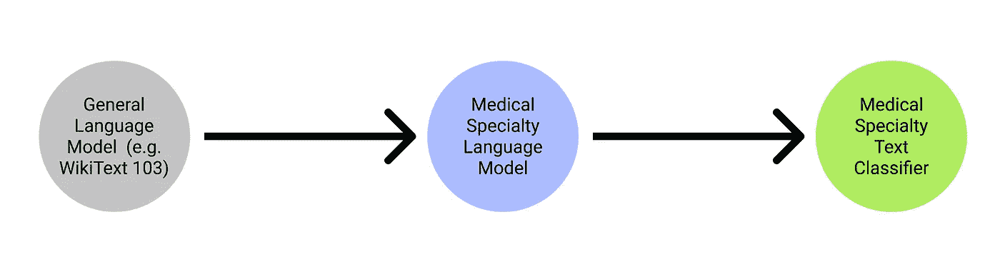

预测医学专业的 ULMFiT 管道。图片作者。

# 创建语言模型(步骤 2)

我们首先使用 kaggle API 导入数据:

并相应地解压缩 csv 文件(在本例中为单个 csv 文件):

作为预处理步骤，我们删除了几行不相关的信息，这些信息没有合法的医学专业知识附在患者的成绩单上:

## 语言模型中包含什么？

创建语言模型需要几个关键步骤。

1.  **标记化**:将文本转换成单词列表
2.  **数字化**:列出所有出现的独特单词(一个*词汇列表*列表)，并通过在词汇列表中查找索引将每个单词转换成数字
3.  将数字标记加载到语言模型数据加载器中

最终目标是让我们的*语言模型*预测一个句子中的*下一个单词，(即给出提示“我的名字是”，模型应该能够输出一个名字。).*

**理解标记化:**标记基本上是由标记化过程创建的列表的元素。它可以是一个单词、单词的一部分或单个字符。我们想利用*单词标记化*来完成这个任务，它为每个单词创建*标记*。这将导致一些非常有趣的输出，如下所示:

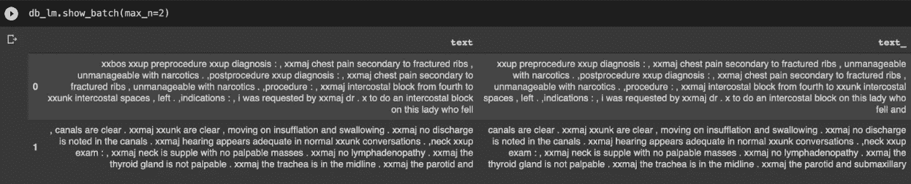

图片作者。

不是显示文本，而是产生“xxbox”和“xxmaj”这样的“单词”。这是怎么回事？

原来，那些前面带有字符“xx”的特殊“单词”被称为*特殊记号*(由 fastai 创建)，其中表示某种重要意义的部分单词(句号、大写字母、感叹号等)。)可能很难被计算机解释。例如，“xxmaj”意味着下一个单词以大写字母开头，因为我们已经将整个文本文件中的所有字母都转换成了小写字母。

**理解数值化:**我们基本上需要把我们看到的这个记号数组变成一个张量，它给每个唯一的记号分配一个索引。例如，标记“xxmaj”是一个索引，标记“chest”是另一个索引。由于我们的模型只能接收这样一个整数张量，所以我们必须这样做。

## **那么我们如何着手做这件事呢？**

事实证明，fastai 有一个有用的捷径来绕过这种繁琐的预处理。在创建 DataLoaders 对象之前，我们可以使用 TextBlock 传递到 DataBlock，如下所示:

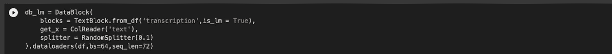

图片作者。

接下来，我们可以创建一个*语言 _ 模型 _ 学习器*，利用 AWD_LSTM 架构，并创建一个 vocab 列表，我们可以在稍后创建实际的*文本 _ 分类器 _ 学习器*时使用。这种语言模型学习者将利用递归神经网络(RNN)进行训练，要进行超级深入的讨论，你可以查看 FastAI 对 RNNs 和 LSTMs 的深入解释[这里](https://github.com/fastai/fastbook/blob/master/12_nlp_dive.ipynb)。

然后，我们训练这个 *language_model_learner* ，在将其保存为编码器之前，通过尝试*预测*下一个单词来提高准确性，这意味着该模型不包括特定于任务的最终层。在这种情况下，这意味着语言模型的最终输出层(其*基于提示预测并创建*单词)**被省略**，**允许我们对我们的任务**的最后一层进行微调，该层将情感分析和提示分类输出到适当的医学专业领域。

这是有意义的，因为我们不希望我们的文本分类器是预测单词的*，我们希望它是基于医疗记录分类医学专业。*

我们开始训练语言模型，如下所示:

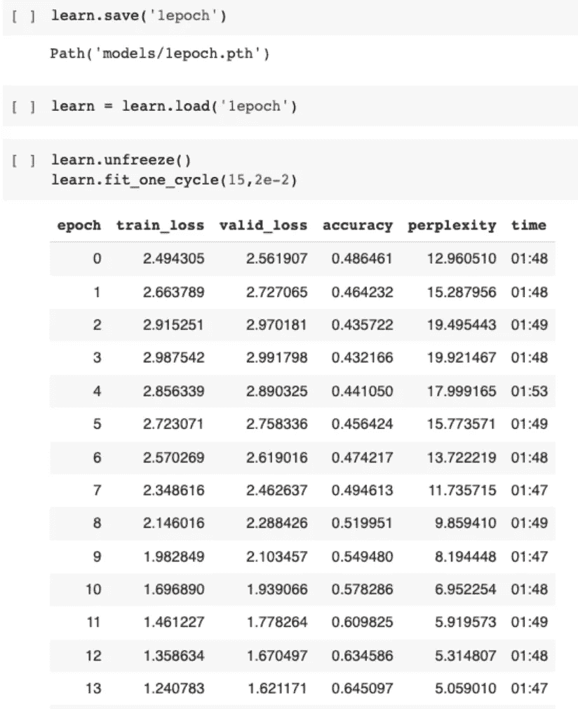

图片作者。

我们实现了大约 65%的准确率，这意味着基于提示，我们的模型将能够基于这个数据集在 65%的时间内正确准确地预测下一个单词是什么。这似乎令人印象深刻，所以让我们开始实际的工作。

在我们继续讨论创建文本分类器学习器所使用的技术之前，这里有一个关于 ULMFiT 技术的更深入的解释。

# ULMFiT 的全面概述

在 Jeremy 和 Sebastian 的突破性论文中，有三个补充练习与 ULMFiT 结合使用:

1.  区别微调[用于步骤 2/3]
2.  倾斜三角形学习率[目前未在本项目中使用]
3.  逐步解冻[在步骤 3 中使用]

通过结合这些实践，他们能够提高训练的预测准确性。让我们一条一条地分解这些术语。在本文的后面部分，我将包含我自己的代码来演示如何在这个特殊的医疗转录任务中实现这些实践。

**区别性微调:**区别性微调基本上意味着以不同的速率训练模型的不同层，以说明所捕获的不同类型的信息，而不是以相同的学习速率训练整个模型。为此，[Howard 和 Rudder]根据经验发现，首先选择如下学习速率是有效的:

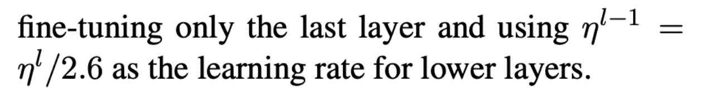

图片作者。

其中:

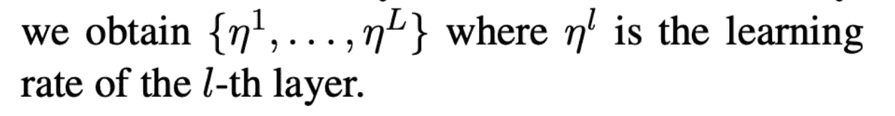

图片作者。

**斜三角学习率:**定义为“先线性增加学习率，再根据一个【数学函数】线性衰减”的方法。这最终会产生一个学习率查找器，如下所示:

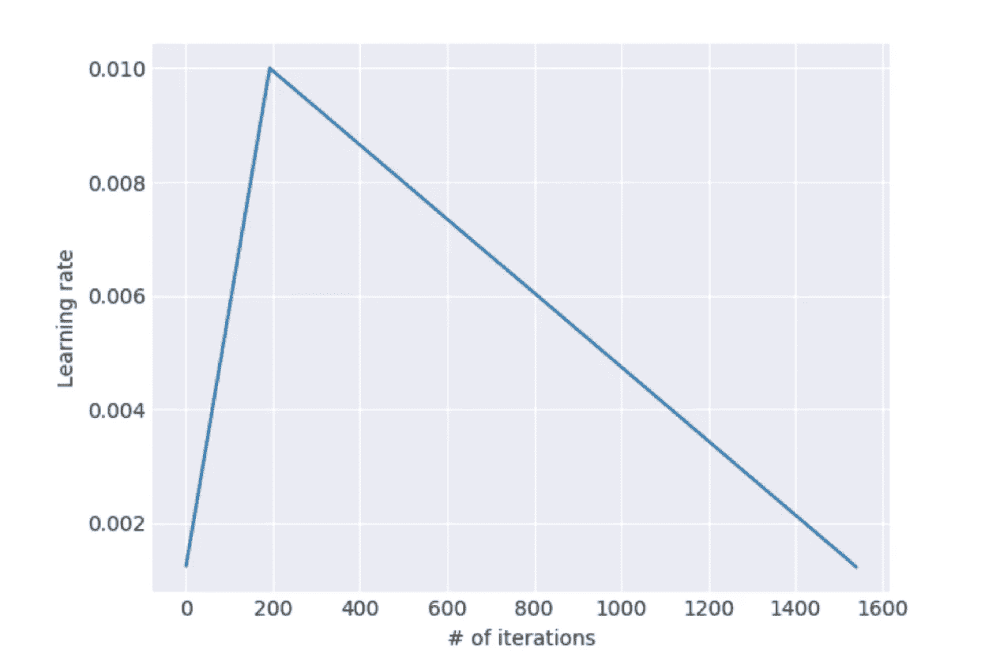

图片作者。

**逐步解冻:**要理解解冻，首先要理解基本*冻结*的概念。冻结基本上防止训练有素的权重被*而不是*改变某些层的权重所修改。在这种情况下，**逐步解冻**意味着“首先解冻最后一层，并微调所有解冻的层(即微调最后一层)一个时期，然后解冻下一层，并重复该过程，直到最后一次迭代收敛。”

通过利用这三种技术的组合，经验上发现极大地增加了语言模型的准确性。对于有区别的微调和逐步解冻，杰里米提供了为什么使用这两种实践的高层次直觉。由于被训练来预测的语言模型的早期层很可能包含以与情感分析/分类相同的方式使用的权重(例如语法规则，强调哪个动词/名词)，所以这些早期层应该以较低的学习速率进行微调，以防止准确性的急剧下降。

# 我们如何着手使用这些技术对文本进行分类？

我们必须保存我们作为编码器训练的语言模型，这意味着除了最后一层之外，所有层都被保存:

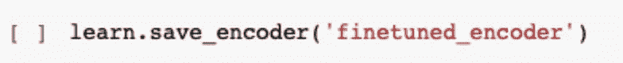

图片作者。

我们首先创建一个文本数据块，然后将它从数据集传递到 dataloader，这与我们前面看到的略有不同。这与我们之前创建的数据加载器的不同之处在于，我们现在使用经典的 get_x 和 get_y 函数让模型进行分类。此外，我们还将已知令牌(或 vocabs)的列表输入到数据加载器中。

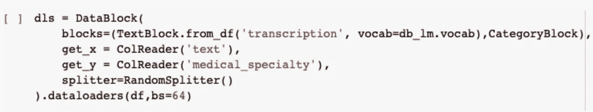

图片作者。

然后，我们创建我们的学习者，它利用 AWD LSTM 框架，如前所示。我们现在为一个时期训练这个模型，为我们的分类器建立 56%的基线准确度。

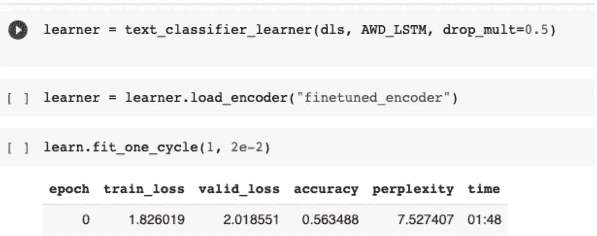

图片作者。

有趣的部分来了。

以前我在训练模型的时候，没有使用*逐步解冻*和*区别微调*的技术。接下来发生的是准确性不断下降，尽管我用恒定的学习速率训练了多次。这是我以前从未遇到过的事情，我认为这是我通过尝试 ULMFiT 技术来解决这个问题的好时机。令人惊讶的是，它起作用了，经过几次训练后，准确率开始提高。

在下面显示的代码中:

```
learn.freeze_to(-2)
```

我们现在做的基本是冻结除了最后 2 个参数组以外的所有图层，基本是*逐步解冻*的做法。

这种情况下什么是*判别微调*？答案就在下一行代码中。

```
learn.fit_one_cycle(1, slice(1e-2/(2.6**4),1e-2))
```

这一行代码基本上采用(1e-2 除以 2.6⁴)的开始学习速率，并具有 1e-2 的结束学习速率，运行 1 个时期。

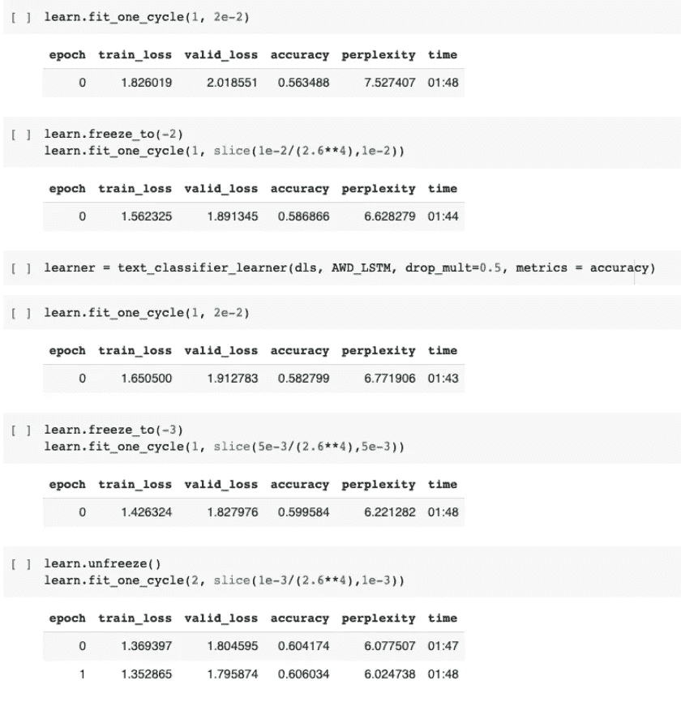

按作者分类的图片——我们最终实现了大约 61%的文本分类器模型准确率！

然后，我们运行这两行相同的代码，同时慢慢解冻后面的层，并改变学习率，从而使我们最初训练的一个时期的分类器模型提高了大约 5%。

我们可以通过调用 learner.predict(" ")来查看我们的模型的输出，然后将相关的患者成绩单输入其中。

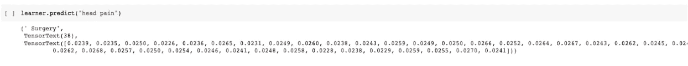

图片作者。

## **一些学习要点:**

对医疗保健和人工智能之间的交叉充满热情是需要长时间培养的。就我个人而言，这种兴趣的增长是因为我可以接触到好的数据集，无论是在 Kaggle 上还是在互联网上。

然而，这些数据集有巨大的局限性——模型的准确性和数据的偏差最终可能会使 ML 系统的准确性略好于在现实世界中抛硬币。实际上，我相信对于一个崭露头角的 ML 学生来说，开发自己的项目，在没有模型固有的局限性的情况下对世界产生巨大的影响，这将是一个挑战。随着健康数据被少数公司垄断，以及患者对隐私问题的担忧，寻找数据集来训练 SOTA 模型以惠及更广泛的社会变得越来越困难。

**进入南丁格尔开放科学**

幸运的是，我们有像[南丁格尔开放科学](https://www.nightingalescience.org/)这样的组织，他们寻求提供计算医学的途径。对我来说，最突出的是进入这样一个平台的安全和道德保证——在这个平台上，只允许对数据集进行非商业使用，以便从处理这些数据集中产生的知识可以惠及每个人。

**前进**

我将在未来探索人工智能和医疗保健之间的更多交集。我接下来几个月的一个里程碑是探索 Nightingale 提供的数据集，并继续写我的收获。我想做的一件事是探索米哈埃拉·范德沙尔的一些论文，尤其是她的一些*大创意*。

附注:通过 FastAI 使用 ULMFiT 技术让我在这场 [Kaggle 比赛](https://www.kaggle.com/c/jigsaw-toxic-severity-rating)中获得一枚铜牌——这是我成为 Kaggle 专家的一大步！

# 如果这篇文章的任何部分引起了你的共鸣/启发，请随时联系我[这里](https://danielching.netlify.app/)！！