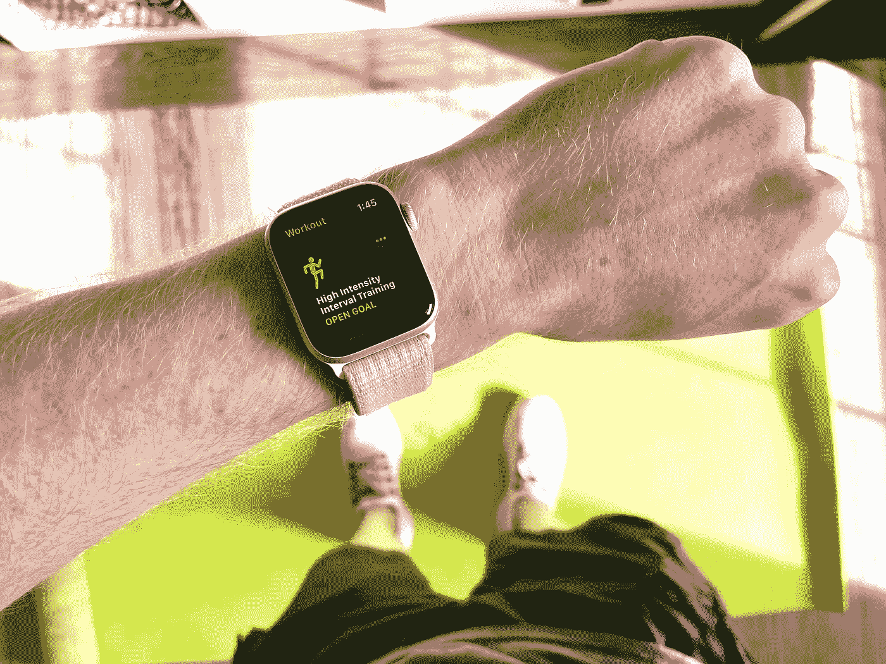
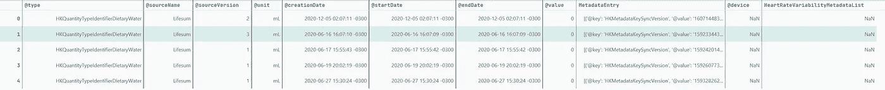
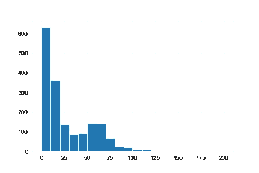
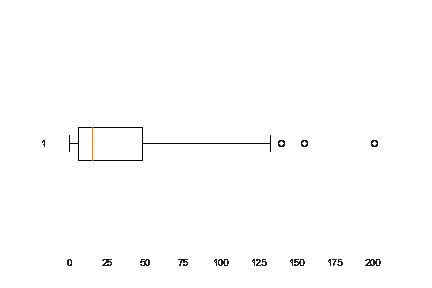
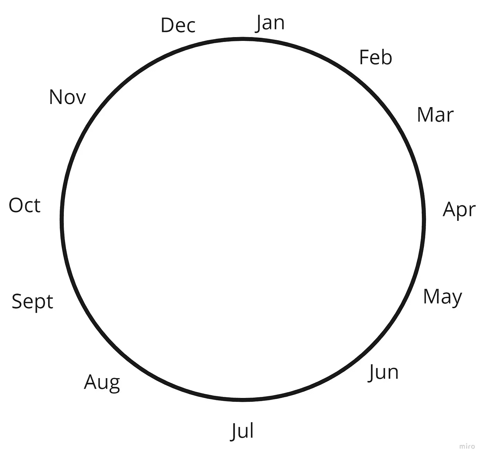
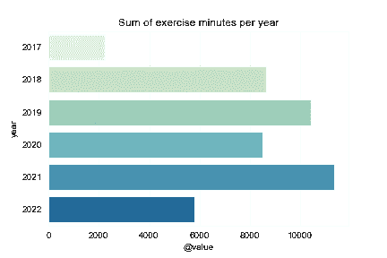
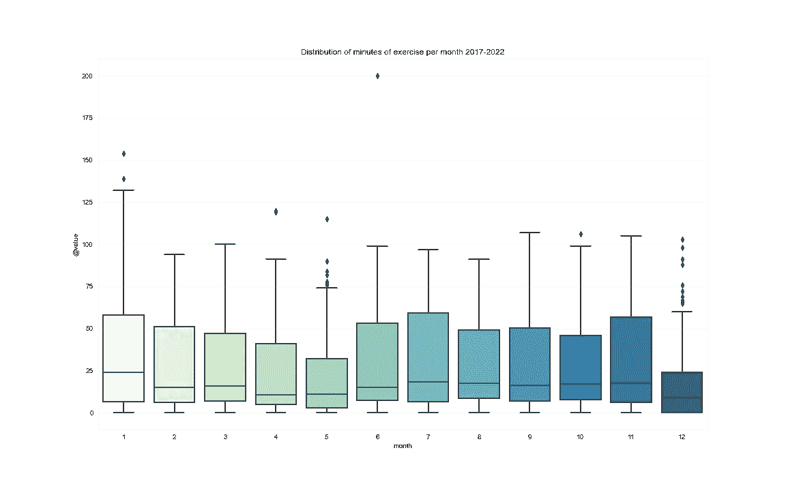
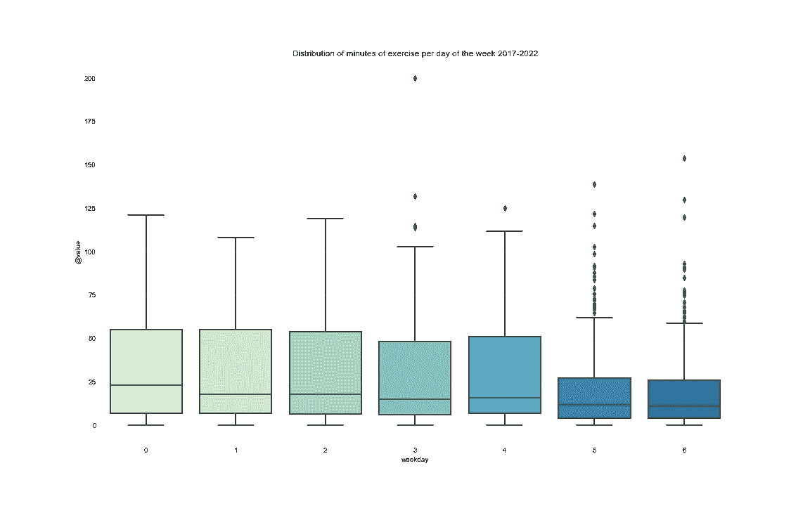
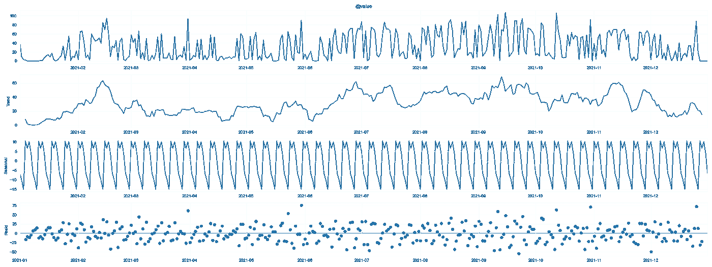

# 用机器学习预测我的下一次锻炼|第 1 部分:数据

> 原文：<https://towardsdatascience.com/predicting-my-next-workout-with-machine-learning-part-1-2fdb07f9ded2>

## 从数据收集到模型部署，端到端的 phyton 项目查看来自 Apple Watch 的锻炼数据

照片由[布洛克斯弗莱彻](https://unsplash.com/@blocksfletcher?utm_source=unsplash&utm_medium=referral&utm_content=creditCopyText)在 [Unsplash](https://unsplash.com/s/photos/apple-watch-exercise?utm_source=unsplash&utm_medium=referral&utm_content=creditCopyText)

在这一系列帖子中，我将经历一个端到端机器学习项目的所有步骤。从数据提取和准备，到使用 API 部署模型，最后到创建一个前端来实际解决帮助决策的问题。每一个的主题是:

1.  项目设置、数据处理和数据探索
2.  模型实验
3.  模型部署
4.  数据应用程序创建

让我们从第一部分开始:

# 项目设置、数据探索和数据处理

任何项目的第一个也是最关键的部分是明确定义你要解决什么问题。如果你对它没有一个清晰的定义，你可能应该回去头脑风暴一下为什么你会有这个想法，如果这真的不仅仅是你的问题。在产品领域有很多方法，我不会在本文中介绍来帮助这一步。现在，我们将只专注于定义当前的问题。

## 问题是

我希望，就像大多数人一样，我很难保持每天锻炼的充分动力。一个有时对我有帮助的工具是有一个智能手表来跟踪我的进度，并帮助查看朋友的锻炼和比赛等功能。然而，这些还不够，我的动力仍然起伏不定。这就是为什么我作为一名数据科学家，想要研究我过去的锻炼，以找出过去激励我的主要变量是什么，并预测我未来达到锻炼目标的概率。

用一句话来定义它:

> 我的问题是长期保持锻炼的动力

现在我们已经定义了我们想要解决的问题，我们可以开始设置我们的项目和我们的解决方案。

## 项目设置

在常规的数据科学项目中，我们必须遵循几个初始步骤。

1.  Git 储存库设置
2.  基础设施供应
3.  环境设置

在任何软件项目中，能够创建项目和代码的版本是非常重要的。因此，我们的第一步将是创建一个 GitHub 库，以便存储和创建您的代码版本。GitHub 的另一个有趣的特性是共享和贡献他人代码的能力。

我不会一步一步地讲述如何创建存储库；只需输入“如何创建 Github 库”就可以了。对于这个项目，我使用的是[这个库](https://github.com/gabrielcassimiro17/apple-health-project)。

第二部分是在云上提供基础设施，以开发并随后部署您的解决方案。目前，我不需要云基础设施，因为我的笔记本电脑可以很好地容纳数据量来进行初步分析。当我们开始创建实验和调整我们的超级参数时，我将向您展示如何在谷歌云平台上完成这些工作，特别是使用 Vertex AI。

最后一部分是创建一个虚拟的开发环境。我喜欢用 pyenv 做这项工作。要安装 pyenv [看这里](https://github.com/pyenv/pyenv#installation)。最后，有很多操作系统可以使用，但我个人更喜欢使用基于 Unix 的，如 MacOS，或者如果你有 Windows，你可以为 Linux 安装一个 [windows 子系统](https://docs.microsoft.com/en-us/windows/wsl/install)。环境的另一部分是通过 requirements.txt 文件跟踪您的库。项目的 [GitHub 库中有一个例子。](https://github.com/gabrielcassimiro17/apple-health-project)

## 数据

现在，为了获得我们需要的数据，我们必须从 iPhone 上的健康应用程序中导出数据。这真的很容易做到，所以只需[看看这里](https://support.apple.com/guide/iphone/share-your-health-data-iph5ede58c3d/ios#:~:text=data%20between%20apps.-,Tap%20your%20profile%20picture%20or%20initials%20at%20the%20top%20right,method%20for%20sharing%20your%20data.)如何做到这一点。

现在我们可以(终于)开始编码了。

导出文件是一个 zip 文件，其中包含一个文件夹，里面有路线、心电图和一个包含所有健康数据的 XML。下面的代码将解压文件夹，解析 XML 并保存为 CSV 格式。

这是我们数据处理管道的第一部分。如果我们希望共享这一功能或者只是添加新的数据，那么拥有一个结构化的代码来处理数据是必不可少的。请注意，代码是作为一个函数来构造的。这将给我们的管道带来灵活性和模块化。

现在我们有了下面的数据帧**准备建模**。

作者图片

哈哈，开个玩笑。

在现实生活中，数据几乎永远不会像 Kaggle 数据集那样随时可用。在这种情况下，我们遇到了数据格式的问题，元数据条目存储在列表中，日期必须被转换，这只是我们必须首先处理的一些事情。

做了什么:

1.  仅过滤锻炼时间数据
2.  将日期转换为日期时间格式
3.  将值转换为浮点型
4.  创建不带时间的日期列，只带天数
5.  将每天锻炼分钟数分组

现在我们有了每天锻炼时间的时间序列。我选择了锻炼时间而不是消耗的卡路里，因为这衡量的是我锻炼的天数而不是消耗的卡路里。这就是我们所说的项目的一个前提。跟踪这些前提并将其与问题陈述一起记录下来是非常重要的。

好的，我们现在取得了一些进展。所以现在我们可以开始创建模型了，对吗？

在那之前我们还有几件事要做。首先，我们需要检查数据的质量，然后我们将创建一些要素，并在建模之前做一些探索性的绘图以产生一些见解。

## 数据质量检查

当我们谈论数据质量时，我们应该深入到数据是如何收集的，并考虑在这个过程中可能发生的一些问题。由于这些数据是在我的 Apple Watch 上收集的，我们首先应该探索的是，在我不戴手表的日子里会发生什么？

这可以归结为我们在数据中必须检查的两件事:

1.  缺失数据
2.  极端值

就 NAs 而言，没有丢失数据。然而，有 167 次观察以 0 作为锻炼分钟数，这似乎是他们记录没有手表的日子的方式。我们可以在这张直方图中清楚地看到:

作者图片

搜索异常值，我们可以看到有几个异常值，但我们会保留它们，因为它们与现实相符，而不是异常值。

作者图片

我们还可以做很多其他检查来验证数据质量，但是对于这个例子，我们不会深入讨论，因为这个数据源是标准化的，非常可靠。

我们从数据中收集了一些重要信息:

1.  有 1.737 个观测值(天)；
2.  167 个观测值以 0 为当天的运动分钟；
3.  日期从 2017 年 9 月 25 日到 2022 年 6 月 27 日；
4.  在此范围内没有遗漏的日期。

## 特征工程

现在我们可以玩些有趣的东西了。特征工程步骤是我们创建对模型有用的特征的假设。这是一个迭代过程，所以我们将在这里创建一些，稍后验证它们，并添加或删除功能。

我的一些猜测来自经典的时间序列特征。它们是:

1.  日期属性(日、工作日、月、年、季)
2.  滞后特征(最近一段时间消耗了多少卡路里)
3.  滚动窗口特征(移动平均值、标准偏差、最大值、最小值)

在下一部分，我们将添加一些其他数据，如睡眠质量。

代码如下:

另一个重要的转换是创建月份特性的循环编码。这是对具有周期的时间特征进行编码的一个很好的技巧。这是通过获取每个月的正弦和余弦来实现的，最后，我们会得到这样的结果:

作者图片

我们可以看到 12 月和 1 月彼此更接近，而不是相距更远的 1 和 12。

## 探索性分析

现在我们将进行一些简单但有力的分析。这一步可以并且经常应该在特征工程之前执行，但是在这种情况下，我需要一些特征用于绘图。

> 记住:这是一个反复的过程

在一个长期的项目中，在得到最终的解决方案之前，你会经历很多次这样的循环。

我们已经在上一步中查看了数据的分布，因此现在我们可以看到锻炼时间是如何随着一些时间特征而变化的。

先说年份:

作者图片

我们可以看到，2020 年停止了我的趋势，主要是因为科维德疫情的锁定。

我们可以比较每个月的数据分布。

作者图片

在这里我们可以清楚地看到，十二月不是我最好的朋友。主要原因很容易识别:年终聚会、假期、圣诞节，我一般会去度假。

另一件值得注意的事情是我的锻炼在一周的不同日子里是如何变化的。在此分析中，我们认为周一为标签 0，周日为标签 6。

作者图片

锻炼时间的中位数与一周中的其他日子相差不远，然而，在周末进行大规模锻炼的情况更为罕见。

你可以用你的数据创造出无限的可视化效果。现在，我们将停止在那些上面。这里重要的是理解您的数据、分布以及它在不同聚合中的表现。

您还可以基于这些分析创建**决策**。这里的一个例子是看周末数据趋势更低。一个可能的决定是制定一条规则，规定我只有在周末锻炼时才能喝酒。

建模前我们要做的最后一件事是分解我们的时间序列。哦，我忘了说了，我们这里有一个时间序列。定义如下:

> 时间序列是在一定时间间隔内，以相等(规则/均匀间隔)的时间间隔进行的一系列重复观测

我们可以分解一个时间序列来理解两件非常有用的事情:

1.  趋势
2.  季节性

一个时间序列由这两者的结合和一些残差组成。有几种方法来分解它，这里我们将使用加法。时间序列是一个庞大的主题，所以如果你想深入了解[，请点击这里](https://www.machinelearningplus.com/time-series/time-series-analysis-python/)。

作者图片

这是大量的信息，让我们深入研究一下。

第一个情节是原始时间序列。第二个是趋势成分，第三个是季节性，最后一个是残差。

我们从她那里得到的重要信息是:

1.  我们可以确定一个与周相关的季节性，但在月与月之间没有太大关系；
2.  残差似乎是均匀分布的。

这对我们有两点帮助。在特征工程步骤中，我们创建特征来捕捉正确的季节性，如果我们想要应用经典的时间序列模型，我们必须在参数中插入季节性。

暂时就这样了。

## 关键要点

这部分的主要要点是:

1.  **定义问题**；
2.  设置您的环境，不要忘记记录您的软件包版本；
3.  记录你的项目**前提**；
4.  将您的数据处理组织成**函数**，这些函数可以在以后与新数据一起重用；
5.  了解并清理您的数据；
6.  如果可能的话，创建一些已经可以生成决策的描述性分析。

## 在下一部分:

1.  我们将使用 MLFlow 建立一个实验框架来记录和比较我们的模型
2.  我们将创建多个模型并对它们进行比较
3.  我们将选择一个模型并优化其超参数

感谢阅读！

如果你喜欢这篇文章，你可以看看我做的其他一些项目[这里](https://gabrielcassimiro17.medium.com/)。

此外，考虑订阅，以获得本系列的所有部分，当他们出来。