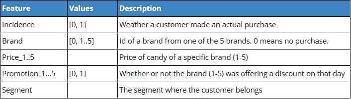
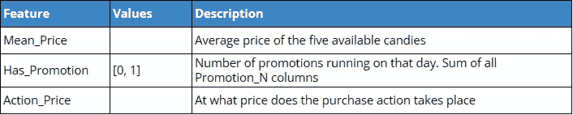

# 用 Python 预测需求的价格弹性(实现 STP 框架——第 4/5 部分)

> 原文：<https://towardsdatascience.com/predicting-price-elasticity-of-demand-with-python-implementing-stp-framework-part-4-646b025b8b34>

## 实施逻辑回归预测需求价格弹性

Artem Beliaikin 在 [Unsplash](https://unsplash.com?utm_source=medium&utm_medium=referral) 上拍摄的照片

在本系列中，我们将学习 STP 框架(细分、定位和营销)，这是最流行的营销方法之一。在前三篇文章中，我们已经学会了使用细分来了解我们的客户，并根据他们的人口统计学、心理学和行为特征将我们的客户群分为四个部分。这涵盖了 STP 框架的第一步。

我们的四个客户群是:

1.  标准
2.  以职业为中心
3.  机会更少
4.  富裕的

在目标确定阶段，我们根据整体吸引力、战略方向、市场专业知识、未来潜力等为我们的客户群定义战略。由于这更多地属于营销部门的公司战略，我们将在这个博客系列中跳过这一步，转到第三步，定位。

和往常一样，[笔记本](https://deepnote.com/workspace/asish-biswas-a599-b6cca607-3c12-4ae6-b54d-32861e7e9438/project/Analytic-School-8e6c85bd-e8c9-4387-ba40-0b94fb791066/%2Fnotebooks%2FPositioning.ipynb)和[数据集](https://deepnote.com/workspace/asish-biswas-a599-b6cca607-3c12-4ae6-b54d-32861e7e9438/project/Analytic-School-8e6c85bd-e8c9-4387-ba40-0b94fb791066/%2Fdata%2Fpurchase_data.csv)在 [Deepnote 工作区](https://deepnote.com/workspace/asish-biswas-a599-b6cca607-3c12-4ae6-b54d-32861e7e9438/project/Analytic-School-8e6c85bd-e8c9-4387-ba40-0b94fb791066/%2Fnotebooks%2FPositioning.ipynb)中可用。

## 配置

定位是营销战略的重要组成部分，尤其是当公司在竞争激烈的市场中运作时。我们需要了解消费者如何看待产品，以及它与其他竞争产品有何不同。定价和折扣在影响客户购买决策方面起着至关重要的作用。

在本帖中，我们将运用逻辑回归来理解产品价格如何影响购买决策，以及我们是否有价格弹性。

但在此之前，让我们先了解一下数据集。我们将使用为此实验准备的新数据集，它利用了我们在上一部分中执行的分段步骤。

## 数据探索

我们将使用一个数据集来表示零售店的客户购买活动。该数据集与我们已经熟悉的客户详细信息数据集相链接，我们已经在本系列的前三部分中使用过该数据集([第 1 部分](/customer-segmentation-with-python-implementing-stp-framework-part-1-5c2d93066f82)、[第 2 部分](/customer-segmentation-with-python-implementing-stp-framework-part-2-689b81a7e86d)和[第 3 部分](/customer-segmentation-with-python-implementing-stp-framework-part-3-e81a79181d07))。该数据集中的每条记录都代表一个客户的购买历史。

以下是每个属性的详细描述:

属性描述(图片由作者提供)

其他计算属性:

附加计算属性(图片由作者提供)

平均价格将是我们寻找价格弹性实验的主要特征。 *Has_Promotion* 和 *Action_Price* 是可能帮助我们改进模型的次要功能。我们走着瞧。

让我们从每个细分市场的独立客户数量开始我们的数据探索。我们看到，最大的细分市场是“机会较少”的细分市场(38%)，其他细分市场的权重几乎相同(约 20%)。这是我们正在处理的一个平衡的数据集。

就实际购买记录的数量而言，每个细分市场看起来相当均衡(发生率= 1)。

现在，当我们看每个细分市场的平均价格时，它们看起来非常相似。都在 2.0 左右的水平。但是，当我们缩小关注范围并查看实际购买价格时，我们可以看到*“富裕”*细分市场的平均价格点更高(2.2)，而*“事业型”*客户的平均价格点更高(2.65)。

这些信息与我们在本博客系列的细分部分获得的知识一致。现在让我们继续机器学习部分，我们试图理解价格弹性的范围。

## 逻辑回归模型

逻辑回归是一种分类算法。它估计事件发生的概率，如贷款违约预测。由于结果是概率，它可以是 0 或 1，对于二元分类，小于 0.5 的概率将预测 0，而大于 0 的概率将预测 1。

在我们的例子中，我们实际上不会使用二元分类模型(无论客户是否购买)。相反，我们将估计需求的价格弹性，并预测在不损害市场的情况下我们可以提高多少价格？

[了解有关逻辑回归的更多信息。](https://www.ibm.com/topics/logistic-regression)

从模型系数来看，很明显，平均价格和购买事件之间存在反比关系。如果均价降低，购买概率会增加。

现在让我们建立在这个前提上。
我们看到糖果的价格(在所有品牌中)从 1.1 到 2.8 不等。所以，保留一些缓冲，让我们取价格范围从 0.5 到 3.5，每次增加 0.01，并检查购买事件的概率如何变化。

## 结论

正如所料，我们观察到，随着平均价格的增加，购买的机会减少。

我们将在下一篇文章中继续我们的价格弹性预测实验，并了解在不破坏需求的情况下我们可以将价格提高多少。

*感谢阅读！如果你喜欢这篇文章一定要给* ***鼓掌(最多 50！)*** *让我们* ***连接上****[***LinkedIn***](https://www.linkedin.com/in/asish-biswas/)*和* ***在 Medium 上关注我*** *保持更新我的新文章**

**通过此* [*推荐链接*](https://analyticsoul.medium.com/membership) *加入 Medium，免费支持我。**

* [## 通过我的推荐链接加入媒体

### 阅读阿西什·比斯瓦斯(以及媒体上成千上万的其他作家)的每一个故事。您的会员费直接支持…

analyticsoul.medium.com](https://analyticsoul.medium.com/membership)*