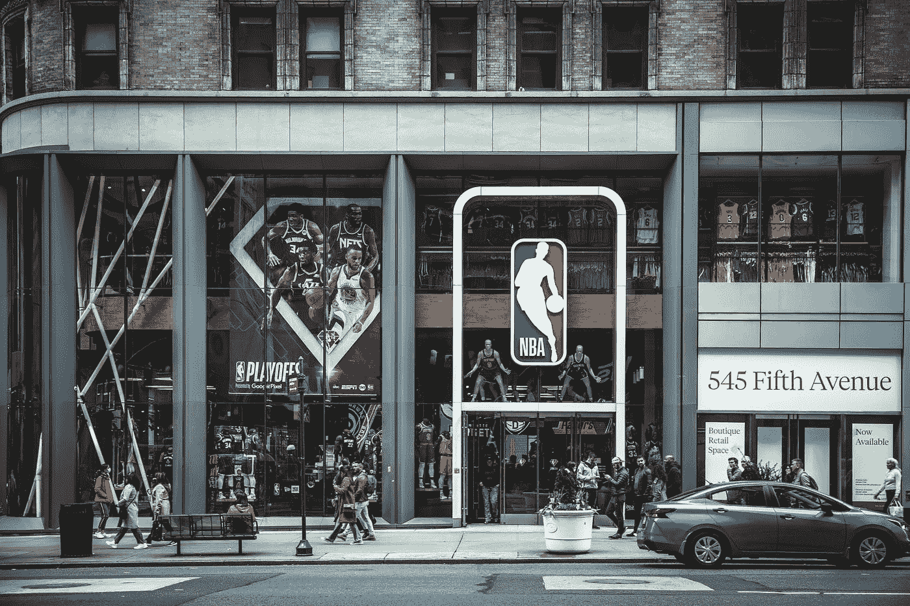
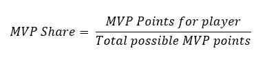
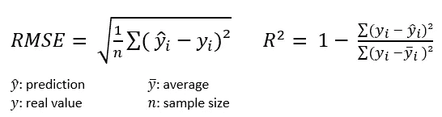
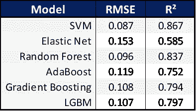
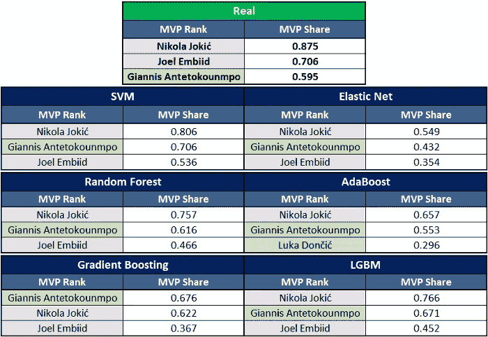
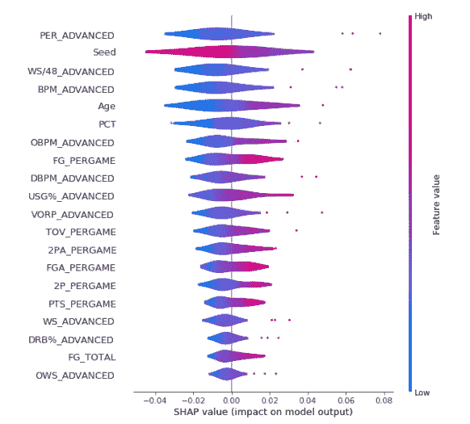
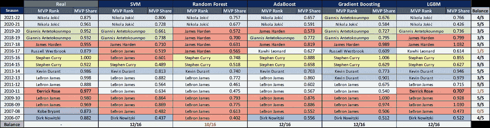
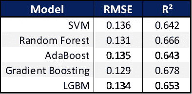
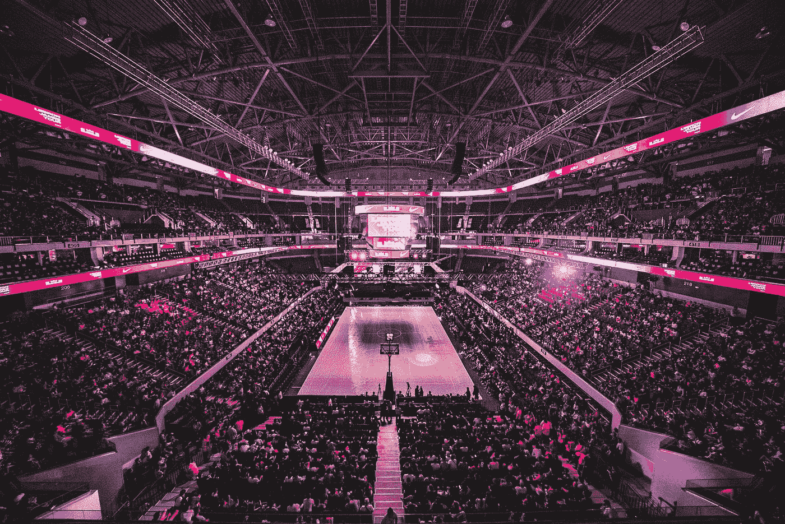

# 用机器学习预测 NBA MVP

> 原文：<https://towardsdatascience.com/predicting-the-nba-mvp-with-machine-learning-c3e5b755f42e>

## 建立一个机器学习模型来预测 NBA MVP 并分析最具影响力的变量。

(照片由[黛安·皮凯蒂诺](https://unsplash.com/@diane_soko?utm_source=medium&utm_medium=referral)在 [Unsplash](https://unsplash.com?utm_source=medium&utm_medium=referral) 上拍摄)

每个赛季，总会有一场关于 NBA 最有价值球员**的大讨论，这是一个篮球运动员可以获得的最大个人奖项。对于一个不熟悉这项运动的人来说，很难解释这个奖项的标准。**

已经让一些人感到困惑的是，MVP 不是对最佳球员的奖励，而是对常规赛最有价值的球员的奖励。那么，问题来了:**变得更有价值意味着什么？**

意思是对其团队有最大正面影响的球员。这意味着团队的表现也是影响个人奖项的一个变量，因为它必须有良好的记录来证实这种影响。为此，球队必须有一个好的支持名单来帮助 MVP，因为他不能靠自己赢得每一场比赛。然而，名单不可能那么好，因为在这种情况下，他们不需要 MVP 来获得好的种子。

你已经可以注意到这个奖项是多么令人困惑和主观。

考虑到这一点，我决定应用机器学习技术来观察 MVP 选择逻辑中的模式，验证**在这个选择中最重要的统计数据**，以及是否有可能**创建一个模型，在 2022-23 常规赛结束时，可以在官方结果公布之前预测 MVP**。

所有用到的代码和数据都可以在 [**GitHub**](https://github.com/GabrielPastorello/NBA-Modelo-MVP) 上找到。

*这段文字是用葡萄牙语写的原文的翻译，可用* [***此处***](https://medium.com/latinxinai/prevendo-o-mvp-da-nba-com-machine-learning-6a55d9596821) *。*

## 理解问题

在此之前，了解奖项的投票系统是如何工作的，以尽可能最好的方式处理数据是很重要的。

我们想要问题的答案:**谁会成为 NBA 的 MVP？**

所以，有人可能会认为这是一个**分类**的问题，选项是 **MVP** 或者**非 MVP** 。然而，这种方法会遇到几个问题，因为非 MVP 球员的数量比 MVP 球员多得多，使得模型的训练和评估很困难。

因此，我们应该将此视为一个**回归**问题。但是用什么变量作为目标呢？让我们了解投票是如何决定的。

目前，MVP 奖项的投票由不隶属于球队或球员的媒体成员进行，每个人选择一个第一名(10 分)，第二名(7 分)，第三名(5 分)，第四名(3 分)和第五名(1 分)。

得分最高的球员被选为最有价值球员。然而，这不是我们将在回归中使用的总点数，因为选民的数量在不同的年份可能会有所不同，这可能会改变总点数。为了消除这个问题，我们将尝试预测的变量是 **MVP 份额**。

MVP 份额无非是球员获得的分数除以该年可能获得的最大总分数，数值从 0 到 1。

MVP 份额公式(图片由作者提供)

因此，**MVP 份额最高的球员将被模型**定义为 MVP。

## 数据

使用的单项统计数据是:

*   **平均每场**统计
*   ****总计**统计**
*   ****高级**统计**

**还使用了:**

*   ****落点**(种子)**团队胜率****
*   **MVP 投票结果( **MVP 份额**)**

**总的来说，这项研究对每个玩家有 71 个变量。**

**上一个问题的答案"**更有价值是什么意思？“T29”还有另一种程度的可变性:它趋向于随着时间**而变化。使用非常老的赛季的数据最终会导致最近几个赛季的预测结果更差，因为关于 MVP 的想法和讨论不再完全相同。**

**因为目标是预测 2022-23 赛季的 MVP，所以从 2006-07 赛季开始(直到 2021-22)的数据将用于这项研究，总共 16 个赛季。**

**上面引用的数据是针对赛季所有进场至少 1 分钟的球员收集的，取自 [**篮球参考**](https://www.basketball-reference.com/) 。**

## **数据处理**

**即使考虑到回归问题，MVP 份额非零的球员数量仍然很少，通常每个赛季在大约 450 名球员中有 10 到 14 名。这表征了一个*不平衡的*数据集。**

**因此，为了实现模型的良好性能，我们需要做出一些考虑。一种可能是只选择那些在众所周知的 [**MVP 竞赛**](https://www.nba.com/news/category/kia-race-to-the-mvp-ladder) 中的球员，这是一个非官方的 10 名球员排名，在赛季中更新。或者，只有那些非零 MVP 的份额(仅用于训练，因为在真实情况下我们不会有这些信息)。**

**然而，这将在某种程度上促进模型的部分工作，已经选择了最好的球员和最有可能赢得奖金。由于这项研究的想法是，该模型可以预测所有可能的球员的 MVP，而无需任何外部帮助，这不是我们将要做的。**

**那么，你如何缩小玩家的数量，对他们进行筛选，以确保没有可能获奖的人被删除？在这个阶段，我们看到了拥有*领域知识*以最佳方式指导项目的重要性。**

**想象一下:一个场均只有 10 分的球员是不会赢得 MVP 的，对吗？以便玩家可以毫无问题地从基座上移除。**

****

**过去 16 个赛季的 MVP 统计(图片由作者提供)**

**或者，一个 82 场比赛只打了 30 场的球员，或者没有进季后赛，等等。因此，我们可以为被考虑的玩家建立一些最低标准。**

**考虑到这一点，我对历史上 MVP 的**最低平均分和统计数据进行了调查**以建立这些最低标准( [**统计使用**](https://www.statmuse.com/nba) 使这个过程变得容易得多):**

*   **卡尔·马龙是 98-99 赛季的 MVP，打了 49 场比赛**
*   **韦斯·昂赛尔德是 68-69 赛季的 MVP，PPG 13.8 分，FGA 10.9 分，T21 19 分**
*   **史蒂夫·纳什是 04-05 赛季的 MVP，3.3 个篮板球**
*   **摩西·马龙在 82-83 赛季以 1.3 秒的优势获得 MVP**
*   **鲍勃·库西以 37.8%的命中率成为 56-57 赛季的 MVP**
*   **扬尼斯·阿德托昆博在 19-20 赛季以 30.4 分钟的成绩获得 MVP**
*   **卡里姆·阿布杜尔·贾巴尔是 1976 年唯一没有进入季后赛的 MVP**
*   **戴夫·考恩斯是 72-73 赛季的 MVP，根据 **18.1** 的获得**
*   ****从来没有一个 MVP 在赛季中途被交易，他赢得了这个奖项****

****以这些数值为基数，我们可以过滤掉绝大多数球员，每个赛季只留下 **20 到 30**。这是在几乎普遍的前提下实现的，没有放弃公正性。****

****这些过滤器将使评估模型在训练和测试中的性能变得更加容易。****

****现在，数据库准备好了，我们可以开始创建模型了。****

## ****建模****

****最初，使用了几种回归模型:****

*   ******支持向量机(SVM)******
*   ******弹力网******
*   ******随机森林******
*   ******AdaBoost******
*   ******梯度增强******
*   ******光梯度推进机(LGBM)******

****使用均方根误差( **RMSE** )和决定系数( **R** )来评估它们中每一个的性能。****

********

****RMSE 公式(左)和 R 公式(右)(图片由作者提供)****

******RMSE** 计算实际值和预测值之间的均方根误差。它被广泛使用，因为它是一个惩罚大误差的度量(平方时)，但它与感兴趣的变量在同一单位(求根时)。即其值越低越好。****

****然而，与变量使用相同的单位会使定义什么是*好的*或*可接受的* RMSE 值变得困难。因此，我们也将使用 R 作为替代指标。****

******R** 代表模型解释的方差比例，范围从 0 到 1。也就是说，越接近 1，模型可以解释的数据的可变性越大。****

## ******结果******

****起初，为了更好地评估每个型号的能力，2021-22 赛季被留出用于**测试**，而剩余的 15 个赛季被用作**训练**。****

****这样，除了为研究的其余部分定义优化参数之外，还获得了每个模型的 RMSE 和 R 值。****

****在该过程结束时，获得了以下结果:****

********

****2021-22 赛季不同车型的 RMSE 和 R 值(图片由作者提供)****

******SVM** 、**随机森林**和 **LGBM** 分别获得了最低的 RMSE 值和最高的 R 值 **AdaBoost** 和**梯度增强**也有足够的结果，其中**弹性网**在使用的模型中具有最差的度量。****

****现在来看最后的排名，非常积极的一点:**6 款中有 5 款拿到了 Nikola Joki 作为 MVP** :****

********

****2021-22 赛季不同车型 MVP 之争前三名(图片由作者提供)****

******梯度推进**是唯一一个把**扬尼斯·阿德托昆博**列为 MVP 的。 **AdaBoost** 排在第三位**Luka don CII**(他排在第五位)。****

****除此之外，所有其他的**都答对了前 3 名**。然而，模型将吉安尼斯列为争议中的第二名，将乔尔·恩比德列为第三名，而实际排名恰恰相反。****

****这可以用一个事实来解释，尽管詹尼斯有一个出色的赛季，他的团队也有良好的表现(雄鹿队与 76 人队有着相同的竞选活动，按照决胜局标准排在前面)，但他患有所谓的 ***选民疲劳*** 。****

****詹尼斯最近两次获得 MVP，公众和选民都倾向于，甚至是无意识地，更喜欢一个有争议的**新兴**球员(比如恩比德)而不是一个已经获得该奖项的人(尤其是如果不止一次)。****

******勒布朗**已经遭受了这一点，并且已经预料到下赛季会发生什么，仅仅是过去两年的获奖者**乔基奇**连续第三次赢得 MVP 的一次历史性表演。****

## ****变量分析****

****可视化模型预测中最重要的变量的一种方法是使用 [**SHAP 值**](https://shap.readthedocs.io/en/latest/index.html)(***SH****apley****A****additive ex****P****注释*)。SHAP 是一种基于博弈论的技术，它允许你合理地解释每个变量对模型预测的影响程度。****

****让我们以 SVM 模型为例，它获得了最佳指标:****

********

****与 SVM 模型相关的 SHAP 图表(图片由作者提供)****

****这个图表有很多信息，我们来理解一下:****

****在 **Y 轴**上，我们有对 SVM 模型影响最大的 20 个变量。每个点代表一个玩家，对于这些变量中的每一个，都有一个从红色到蓝色的颜色渐变，其中**蓝色**表示有问题的变量的**低值**和**红色**高值**。******

****在 X 轴**上的**是获得的 SHAP 值。**越靠右**，**越大，该变量对兴趣变量(MVP 份额)的正面影响**。**越靠左**，**对 MVP 份额变量的负面影响**越大。****

****例如，对于**种子**变量:种子的高值(糟糕的排名)对 MVP 份额产生负面影响，而低值(良好的排名)对其产生正面影响，这是有意义的。****

****通过这张图表，我们可以得出一些重要的结论:****

*   ****最有影响力的三个**个人**变量是:**每** ( *玩家效率等级*)、 **WS/48** ( *每 48 分钟赢股*)和 **BPM** ( *框加减*)****
*   ****两个**集体**变量、**种子**和**百分比**(胜率)是 6 个最有影响力的变量(分别为第二和第六)****
*   ****11 个最重要的变量中有 7 个是**高级统计******
*   ****在三个最受欢迎的统计数据(场均得分、篮板和助攻)中，**只有场均得分出现在榜单**上，排在第 16 位。****

****有趣的是观察到高级属性在普通属性上的优势，因为它们更好地区分了玩家的良好表现，而不管他们打什么位置。****

****例如，一个中锋往往比一个控球后卫有更高的篮板平均数，而控球后卫又往往有更高的助攻平均数。因此，模型不能单独用这些变量来区分 MVP 球员。****

******赢得份额**例如，这是一种统计数据，旨在衡量团队胜利中每个球员的信用，在这种意义上证明更有效(该统计数据的计算方法可以在 [**这里找到**](https://www.basketball-reference.com/about/ws.html) )。****

******根据**，*玩家效率等级*，是模型中最有影响力的变量。这是一个试图显示球员每分钟生产率的数字，也是当今最好的统计数据之一。我们可以看到，在右边的红点中，该模型非常重视高 PER 玩家。更详细的计算程序可以在 [**这里找到**](https://www.basketball-reference.com/about/per.html) 。****

****另一个有趣的点是模型在**对** ( *失误*)中发现的关系。直觉上，我们认为一个场均失误率高的球员成为 MVP 的几率会更低，对吗？****

****然而，由于 MVP 通常手里有很多球*，他每场比赛的失误次数往往远大于零，这一行为被模型捕捉到了，这与常识相反。*****

## *****附加结果*****

*****通过最近一个赛季的参数优化和对最重要的统计数据的分析，这项研究的目的已经部分完成，现在只等待 2022-23 NBA 常规赛结束(4 月/23 日)，以便模型可以预测 MVP。*****

*****但是为什么不多探索一下他们，看看他们在老赛季的表现如何？*****

**********

*****从 2006 年到 2007 年所有季节获得的结果(图片由作者提供)*****

*****在 MVP 的确定方面，你可以看到模型表现良好，在过去的 16 个 MVP 中，所有模型都答对了 12 个，只有**随机森林**例外，他在 16 个 MVP 中只答对了 10 个。*****

*****RMSE 和 R 指标的下降也很显著，这是奖项标准随着时间推移而自然变化的原因之一，如前所述。*****

**********

*****在过去 16 个赛季的不同模型中获得的 RMSE 和 R 值的平均值(图片由作者提供)*****

*****只有 3 个赛季大部分车型(少于 3 个)无缘 MVP:**2016–17**、**2010–11**和**2007–08**。*****

*****也许最令人惊讶的是 2016-17 赛季，拉塞尔·维斯特布鲁克是自奥斯卡·罗伯特森 1961-62 赛季以来第一个场均三双的球员，在凯文·杜兰特离开后，他带领 OKC 进入了季后赛。毫无疑问，这个奖项应该颁给他，但模特们选择了勒布朗·詹姆斯、科怀·伦纳德和詹姆斯·哈登，只有一个人选择了威斯布鲁克作为 MVP。其中一个因素可能是球队的低种子(联盟第 10)，正如我们所见，这是对结果影响最大的变量之一。*****

*****同样的事情也发生在**2010-11**的**德里克·罗斯**身上，但这一次四个弄错的模特汇聚在**勒布朗·詹姆斯**身上赢得了这个奖项。*****

*****2007-08 赛季，科比是唯一一个没有入选 MVP 的赛季:他们又选了勒布朗。*****

*****在我看来，这比其他球员更能说明勒布朗。这表明，根据最有价值球员的标准，他总是在竞争中，可能应该赢得更多的奖项。*****

**********

*****(照片由 [Howard Bouchevereau](https://unsplash.com/@howardbouchevereau?utm_source=medium&utm_medium=referral) 在 [Unsplash](https://unsplash.com?utm_source=medium&utm_medium=referral) 上拍摄)*****

## *****结论*****

*****本该只是一个预测下一届 MVP 的模型创造，却变成了一个关于这个奖项的定义和历史的非常有趣的研究。我希望这是有用的，并有助于提高对该奖项和所使用的机器学习工具的理解。*****

*****预测体育运动总是一件困难的事情。然而结果非常令人满意，模型被证明是预测 MVP 的有效方法，重点是最近一个赛季表现更好的 **SVM** ，以及在旧赛季表现更好的**梯度推进**。*****

*****值得注意的是，总有改进的余地。例如，可以添加更多的变量，如 NBA 经历的赛季、选秀次数和身体信息(身高、体重、翼展)。例如，用已经赢得的最有价值球员的数量来标记，可以帮助观察到的*选民疲劳*问题。*****

*****同样，使用的所有代码和基础都可以在 [**GitHub**](https://github.com/GabrielPastorello/NBA-Modelo-MVP) 上获得。*****

> ********2023 年 4 月，我们将用全新的数据更新模型。********
> 
> ********会做对吗？我们拭目以待……********

**********

*****(照片由 [JC Gellidon](https://unsplash.com/es/@jcgellidon?utm_source=medium&utm_medium=referral) 在 [Unsplash](https://unsplash.com?utm_source=medium&utm_medium=referral) 上拍摄)*****

*****我在我的频道上总是有空的([**LinkedIn**](https://www.linkedin.com/in/gabriel-speranza-pastorello/)**和 [**GitHub**](https://github.com/GabrielPastorello) )。*******

*****感谢您的关注！👏*****

*****加布里埃尔·斯佩兰萨·帕斯托雷罗*****