# 利用机器学习预测下一届 NBA MVP

> 原文：<https://towardsdatascience.com/predicting-the-next-nba-mvp-using-machine-learning-62615bfcff75>

# 利用机器学习预测下一届 NBA MVP

## 在 NBA 历史 MVP 候选人的数据上训练和验证机器学习模型，以预测 2021-2022 赛季 MVP

图片来自 Unsplash

最有价值球员奖是 NBA 球员职业生涯中所能获得的最有声望的荣誉之一。在每个常规赛结束时(通常在四月/五月)，MVP 奖会颁发给一个被认为配得上这个称号的球员。

然而，通过所有的媒体，仍然有许多关于最有价值球员定义的问题和争论。*是一个取得杰出个人统计成功的球员吗？是常规赛最伟大球队的最佳球员吗？还是说这一切都是数字无法定义的叙事/故事线？*

虽然这个讨论可能没有明确的答案，但可以利用诸如**机器学习模型**以及**相关统计数据**等工具来找到一些模式，并洞察 NBA MVP 评选的逻辑。

在这个项目中，以往赛季的 MVP 候选人的历史数据将在这种背景下进行研究。正如许多常见的数据科学实验一样，在选择最可行的模型之前，将训练和评估各种机器学习模型。然后，选择的模型将被用来预测本赛季(2021-2022)最有价值的球员。

*所有相关的代码和数据都存储在这个* [*Github 库*](https://github.com/DavidYoo912/nba_mvp_project) *中，实验的快捷方式就在这个* [*Jupyter 笔记本文件*](https://github.com/DavidYoo912/nba_mvp_project/blob/main/notebooks/nba_mvp_prediction.ipynb) *中。*

## 目录

*   [方法](#38f1):说明对该问题采取的方法
*   [数据](#a409):数据来源和数据处理方法
*   [实验](#275e):实验和假设的描述
*   [结果](#76fe):实验的最终结果
*   [预测 2022 年 MVP](#383c) :利用最佳模型预测本季 MVP

# 方法

在开始实验之前，必须了解 NBA 是如何决定最有价值球员的，以及如何利用统计数据。

联盟历史上的一个共同主题是，投票系统是由“主题专家”进行的，他们会投票选出他们认为最有价值球员奖应该奖励的人。然而，随着时间的推移，那些决策者应该是谁已经发生了一些变化(可以在[此链接](https://clutchpoints.com/how-voting-is-done-for-the-nba-mvp-and-its-evolution/)中了解这些变化)。

目前，投票者是 100 名独立媒体成员，他们既不属于任何球队，也不属于任何球员。每个成员在**加权投票系统**中选择玩家:第一名投票(10 分)，第二名投票(7 分)，第三名投票(5 分)，第四名投票(3 分)，第五名投票(1 分)。获得最多“分数”的球员被选为该赛季最有价值球员。

这就引出了这个实验的方法。各种统计数据将被用作模型使用 MVP 投票点预测 MVP 的“特征”。

为了在评估这些数据时保持一致，每个特定球员的 MVP 投票点数可以除以该赛季的 MVP 总投票点数。这个指标通常被称为 **MVP 份额**。

> MVP 份额=(特定球员的 MVP 分数)/(总 MVP 分数)

*拥有最高 MVP 份额的球员赢得常规赛 MVP 奖项*

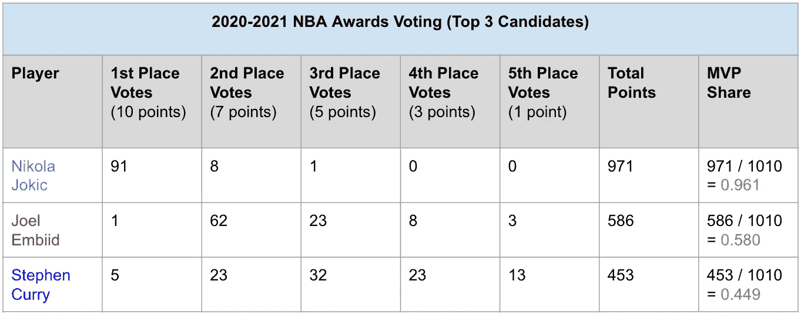

2021 赛季 MVP 投票前 3 名候选人；请注意，最大可能点数是 1010(图片由作者提供)

首先，这个练习可以被视为一个**回归问题**(预测数值变量作为目标)，在这种情况下，机器学习模型试图预测的目标变量是 MVP 份额指标。这将在每一个常规赛中分别进行，利用该赛季的 MVP 候选人名单。

然后，具有最高预测 MVP 份额指标的**球员被模型**标记为预测 MVP。*将该赛季实际 MVP 的名称与预测 MVP 进行比较，以验证模型是否正确*。

(图片来自[Unsplash](https://unsplash.com/)JC gelli don

为了评估所有季节的模型(如果有可用的相关数据)，可以使用受“洗牌”启发的方法。例如，对于每个完成的季节(从 1980 年到 2021 年)，模型将针对一个特定季节的数据进行测试，并根据未选择的其他季节的数据进行训练。这将重复进行，直到所有单个季节的数据都经过测试和预测，以计算整体准确性。

下面是一个迭代的例子，其中 ***训练数据*** *被设置为 1980–1981 和 1983–2021*的 MVP 候选人； ***测试数据*** *被设置为 1982 赛季的 MVP 候选人*其中模型试图预测 MVP 份额

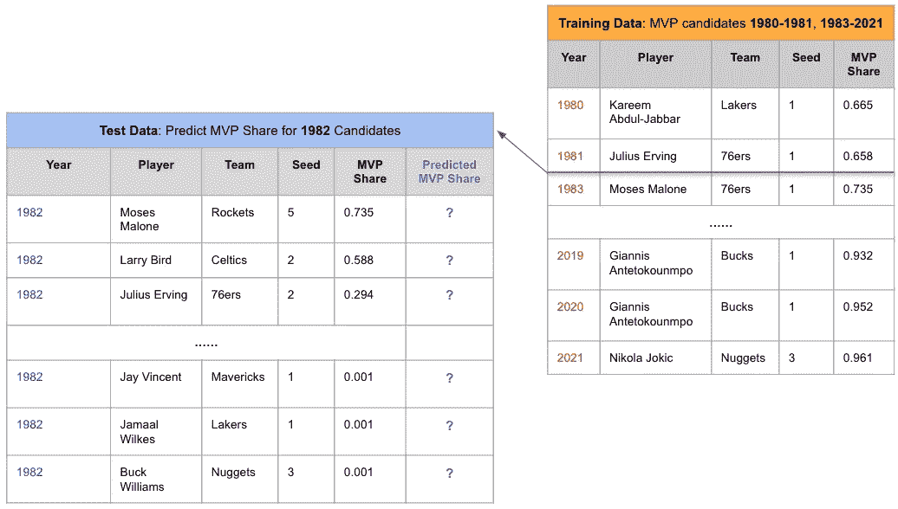

1 次迭代的例子:**训练**1980–1981&1983–2021 MVP 候选人，**测试**1982 MVP 候选人(图片来自作者)

***注*** *:以上可视化只是一个* ***的例子，一次迭代*** *，在实验过程中，每年轮流作为测试数据进行评估，其余年份作为训练*

由于 1982 年的实际 MVP 份额是已知的，它可以用来与预测的 MVP 份额进行比较。通常，MAE(平均绝对误差)和 R(决定系数)是评估回归模型的一些流行的度量。 ***MAE*** *是成对观测值之间误差的度量*。 ***R*** *是数据与模型*拟合程度的统计度量，或者模型能够解释多少方差/不确定性。这两个指标的公式如下所示:

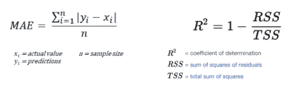

**左** : MAE(平均绝对误差)公式；**右侧** : R(决定系数)公式

对于性能良好的模型，期望 MAE 的值**较低(范围从 0 到**∞**), R 的值****较高(范围从 0 到 1)。**

虽然在这种情况下，这两个指标并不是唯一需要考虑的重要因素。例如，当在 MVP 竞争非常接近前两名候选人的赛季进行测试时，预测的 MVP 份额可能非常接近这两名候选人的实际 MVP 份额。然而，获得模型最高预测 MVP 份额的候选人可能在实际比赛中没有获得最高 MVP 份额。

(来自 [Unsplash](https://unsplash.com/) 的 [Markus Spiske](https://unsplash.com/@markusspiske) 摄影)

如何确定最佳模式？重申“洗牌”启发的方法，每次迭代将把一年作为**测试数据**，其他年份不被选为**训练数据**。然后将每年获得最高预测 MVP 份额的候选人与实际 MVP(获得最高实际 MVP 份额的候选人)进行比较。将为每年创建一个**标签**(正确/不正确)，如下所示

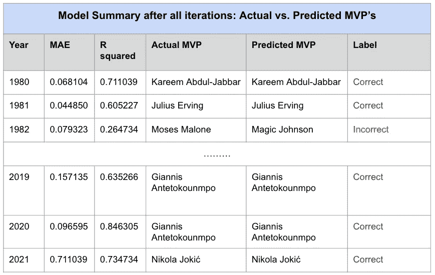

训练/测试后所有迭代的模型总结；**所选年份的测试**，**未选年份的训练**(图片由作者提供)

使用这些标签，可以创建准确性度量。

> 准确度=(正确的标签)/(正确的标签+不正确的标签)

从 1980 年到 2021 年总共有 42 个季节。例如，如果模型预测所有赛季球员的 MVP 份额，并且 MVP 中的 39 个被正确地识别为在他们各自的年份中具有最高预测份额，则模型的准确性将是(39 / 42) = 92.8%。

这个项目的目标已经确定。*主要目标是构建产生最高精度***【最正确的标签】*和*的模型，次要目标是验证这些模型具有最小化的平均 MAE* *(所有年份的平均 MAE)和最大化的 R* *(所有年份的平均 R)。**

# *数据*

*需要两个主要的数据实体；(1)*MVP 候选人历史统计*包括所有被考虑的赢家和输家以及(2) *当前 2021-2022 赛季 MVP 候选人统计*。*

*(1)*MVP 候选人的历史统计*来自[Basketball-Reference.com。](http://basketball-reference.com)每个赛季的 MVP 赛都有一个网页(即 [2021 MVP 赛](https://www.nba.com/news/kia-mvp-ladder-jan-7-2022-edition))。虽然 NBA 可以追溯到 1949-1950 赛季，但历史数据是为现代地区收集的(1979-1980 至 2020-2021 赛季)*

*(2)统计当前 2021–2022 赛季 MVP 候选人，候选人姓名摘自 [NBA.com 的 MVP 竞赛](https://www.nba.com/news/kia-mvp-ladder-dec-31-2021-edition)。赛季期间，NBA 每周都会发布一篇关于该奖项前 10 名候选人的新文章。对于这些候选人，这些球员的统计数据是从 Basketball-Reference 中提取的。*

*个人基本和高级统计以及团队统计被映射到适当的球员和赛季年。利用熊猫 HTML 表格抓取功能、美汤和这个[篮球参考抓取工具](https://github.com/jaebradley/basketball_reference_web_scraper)的组合来抓取原始数据。*

## ***探索性数据分析***

*检查数据时，必须观察与响应变量(MVP 份额)的关系。*

*一些一般特征(x 轴)相对于 MVP 份额(y 轴)绘制。**团队获胜的数量**和**团队种子**通常是决定 MVP 讨论的一些关键因素。此外，还绘制了一个名为 **VORP** (替代球员价值:用于衡量球员对球队的整体贡献)的高级统计数据。*

*散点代表从 1980 年到 2021 年的每个候选人，实际的 MVP 获得者用蓝色突出显示*

*Wins 与 MVP 份额(图片由作者提供)*

*种子与 MVP 份额(图片由作者提供)*

*替代球员的价值与 MVP 份额(图片由作者提供)*

*另一个有趣(但可能很明显)的特性是使用率。使用率是对一名球员参与的团队比赛百分比的估计。*

*使用百分比与 MVP 份额(图片由作者提供)*

*在这一点上，这些变量似乎与 MVP 份额指标有某种线性关系。在进行实验时，将它们视为模型特征是有效的。*

**查看完整 EDA，查看* [*Jupyter 笔记本文件*](https://github.com/DavidYoo912/nba_mvp_project/blob/main/notebooks/nba_mvp_prediction.ipynb)*

# *实验*

*对于实验，有一个特征部分和建模的来回迭代。特征各种组合被选择并用作模型的输入。重复这个过程，直到建立了合理的模型。*

## ***功能选择***

*主表一度有多达 45 列(包括球员和球队名称等基本信息)，但只有几列用作功能。**仅利用相关特征将有助于降低噪声并提高机器学习模型的性能**。*

*识别这一点的一种方法是通过一种叫做**互信息**的方法。互信息是测量特征和目标之间关联的函数，它看起来类似于检测线性关系的相关性。然而，这种度量能够检测任何类型的关系(而不仅仅是线性的)。在[链接](https://www.kaggle.com/ryanholbrook/mutual-information)中有简单的解释，在[链接](http://www.scholarpedia.org/article/Mutual_information)中有更多的统计解释。*

*功能与 MVP 份额的互信息得分如下所示。*

*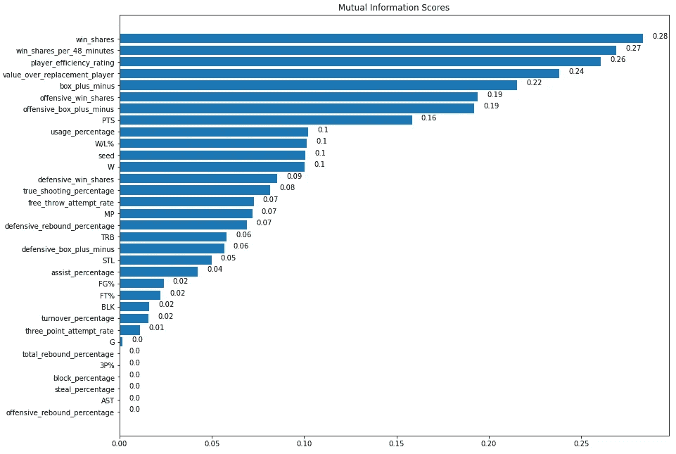*

*所有特征的互信息分数(图片由作者提供)*

*许多突出团队和个人玩家成功和/或效率的高级统计在这种相互信息分数可视化上排名很高。然而，有趣的是，几个主要的计数框得分统计(助攻，盖帽，抢断)在这个名单的底部。一种理论可能是，因为历史上 MVP 球员已经担任了各种位置的角色，并拥有不同的比赛风格，这些盒子得分统计数据的信息通常不会揭示 MVP 份额变量的许多不确定性。*

*互信息的免责声明是，得分高的特征并不总是影响模型性能。*互信息的有用性可能因模型类型而异*。*

*这个工具与人类直觉和领域知识一起被用来试验特性的组合。经过多次反复试验和错误，最终特性如下:*

*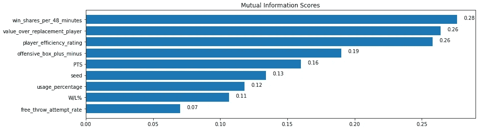*

*最终选定特征的互信息分数(图片由作者提供)*

*许多包含重复信息的功能被删除。例如，“赢球份额”只是“每 48 分钟赢球份额”的一个统计版本，这是一名球员对球队的进攻和防守贡献的比率。*选择速度指标而不是计数指标的一个原因是因为* ***模型将用于预测当前 2022 赛季*** 的 MVP。因为本赛季仍在进行中，今年的统计数据还不完整。对于基于速率的指标来说，这不是什么大问题。*

*一个例外是超过替换球员(VORP)指标的值。该特性在建模过程中被证明是一个强有力的指标。然而，因为这是一个计数统计，2022 赛季的 MVP 候选人不会有完整的值。为了这个项目，这可以调整为某种程度上的预测。这将在预测部分详细提及。*

## *建模*

*选择了几个回归模型:*

*   *[线性回归](https://scikit-learn.org/stable/modules/generated/sklearn.linear_model.LinearRegression.html)*
*   *[随机森林回归量](https://scikit-learn.org/stable/modules/generated/sklearn.ensemble.RandomForestRegressor.html)*
*   *[XGBoost 回归器](https://xgboost.readthedocs.io/en/stable/parameter.html)(极限梯度推进)*
*   *[LightGBM 回归器](https://lightgbm.readthedocs.io/en/latest/pythonapi/lightgbm.LGBMRegressor.html)(光梯度推进机)*

*选择线性回归是因为许多特征似乎与响应变量有线性关系。使用了三种基于树的模型(Random Forest、XGBoost、LightGBM)。随机森林是一种集成学习方法，通过构造大量决策树来操作。XGBoost 和 LightGBM 是树学习模型的几种更有效、更强大的变体。对于这些基于树的模型，进行了各种参数调整工作来寻找将输出最高性能的最佳参数。(*注:数据仅用于线性回归；树模型不需要缩放**

# *结果呢*

*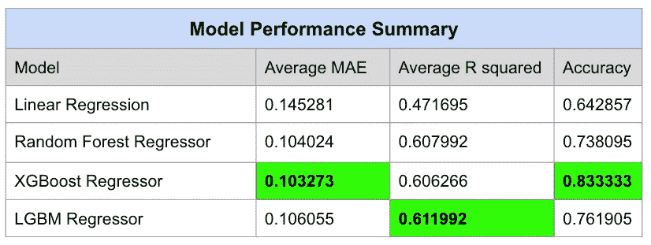*

*各种型号的型号性能总结(图片由作者提供)*

*在四个模型中， **XGBoost 模型的性能**最好，准确率**为 83.33%** (在总共 42 个季节中猜对了 35 个季节)，平均平均误差最低。LGBM 模型具有最高的平均 R，但错过了另外三个错误标记的季节(总共 42 个季节中的 32 个正确)。线性模型在所有三个类别中表现最差，将从分析中排除。*

*对于本分析的其余部分，XGBoost 模型的结果将比其他模型的结果更详细一些，从它的特性重要性开始。*

*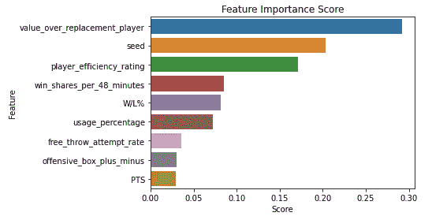*

*来自 XGBoost 模型的特征重要性分数(图片由作者提供)*

*正如 EDA 和功能选择部分所预期的，高级统计数据如 **VORP** 、**每 48 分钟赢得份额**、**玩家效率等级**以及团队统计数据如**种子**和**赢/输%** 在功能重要性上得分较高。唯一剩下的常规盒子得分统计是每场比赛的点数(PTS ),这仍然对算法有一点贡献。该模型严重依赖于个人效率统计数据以及团队绩效指标。虽然使用率并不能突出球员的效率，但它可以强调一个球队在整个赛季对球员的依赖。*

## *确认*

*为了验证模型，不同年份的 MVP 比赛将被检查模型什么时候表现好，什么时候表现不好。*

***好人***

**

*(照片由[艾迪·拉克曼](https://unsplash.com/@eddyray)从 [Unsplash](https://unsplash.com/) 拍摄)*

*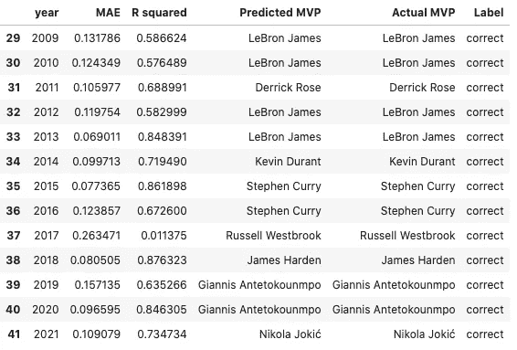*

*所有迭代后的 XGBoost 模型摘要:最近 13 年标记正确(图片由作者提供)*

*如前所述，根据 XGBoost 模型摘要，总共 42 个赛季的 MVP 中有 35 个被正确猜测，准确率为 83.33%。此外，最近 13 年的预测是正确的。(完整的 XGBoost 车型汇总表，请参见[此链接](https://github.com/DavidYoo912/nba_mvp_project/blob/main/notebooks/xgboost_summary.png))这包括几个有争议的年份，如 **2011** (德里克·罗斯)和 **2017** (威斯布鲁克)。*

**2011 年 MVP 赛**

*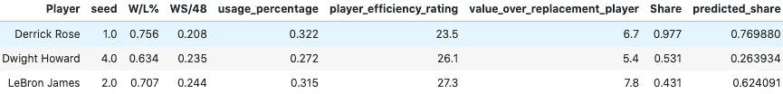*

*2011 年比赛的前三名候选人:模型特征，实际和预测的 MVP 份额(图片由作者提供)*

*2011 年，许多人认为勒布朗·詹姆斯甚至德怀特·霍华德比德里克·罗斯更应该获奖。事实上，勒布朗·詹姆斯在几乎所有的得分和高级统计数据上都超过了罗斯，这也支持了这个观点。然而，德里克·罗斯的使用率和团队记录略高，帮助他挤掉了勒布朗。*

*这也可以通过 **SHAP 值**的可视化来观察，这在理解一个复杂模型如何预测产量时很有用。 *SHAP 价值观* ***衡量决策过程中每个特征的影响*** 。(关于 SHAP 值的详细解释可以在[这里](/shap-explained-the-way-i-wish-someone-explained-it-to-me-ab81cc69ef30)找到)*

*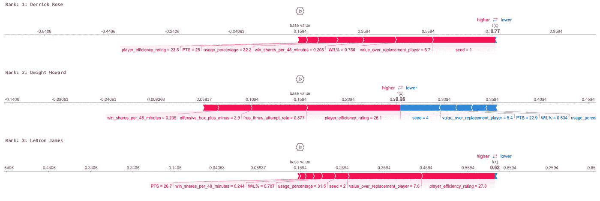*

*2011 年竞选的前三名候选人:SHAP 价值观可视化；注意，轴没有被一起缩放(作者图像)；点击放大图像*

*红色条表示有助于每个候选人预测高 MVP 份额的特征。相反，蓝色条表示正好相反的情况，或者损害其案例的特征。这对于 MVP 份额的影响程度可以通过每个特征的条形段的长度来观察。*

*对于德里克·罗斯和勒布朗詹姆斯来说，模型中没有任何特征会影响他们的机会。然而，似乎成为头号种子队对罗斯来说意义重大。对于现实生活中排名第二的德怀特·霍华德来说，排名更低(第四)和其他一些数据降低了他的价值。*

**2017 MVP 赛**

*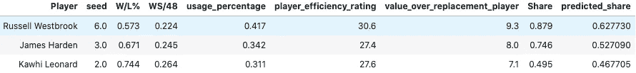*

*2017 年比赛的前 3 名候选人:模型特征，实际和预测的 MVP 份额(图片由作者提供)*

*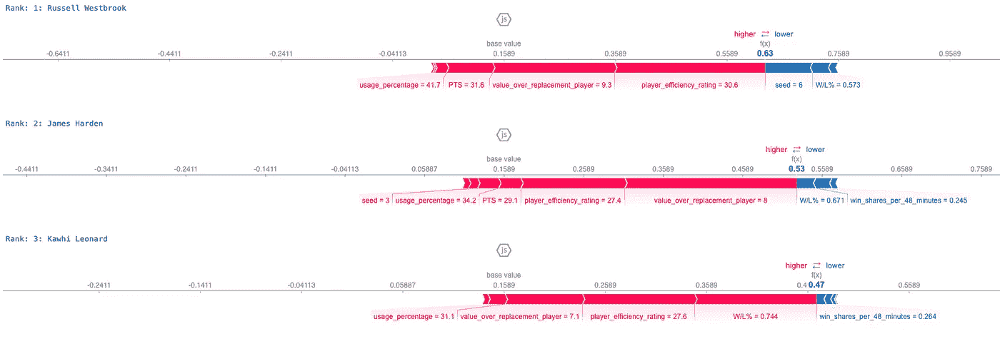*

*2017 年竞选的前 3 名候选人:可视化的 SHAP 价值观；注意，轴没有被一起缩放(作者图像)；点击放大图像*

*2017 年是一场混乱的比赛，R 指标非常低，为 0.01。自 2000 年以来，威斯布鲁克是第一个来自 6 号种子队的 MVP(从 SHAP 视觉化，这可以通过种子= 6 的最大蓝色条块观察到，降低了他的价值)。尽管如此，该模型利用球员效率评级、VORP 和威斯布鲁克占主导地位的使用率指标(41.65%的单赛季纪录)进行了正确预测。与此同时，该模型预测凯文·杜兰特和斯蒂芬·库里的高 MVP 份额(以上均未显示)，这损害了 MAE 和 R。*

***坏了***

**

*(图片来自 [Unsplash](https://unsplash.com/) 善良好奇*

*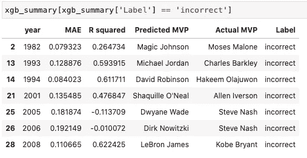*

*所有迭代后的 XGBoost 模型摘要:过滤到标签不正确的年份(图片由作者提供)*

**2005 年& 2006 年 MVP 赛**

*可以将摘要过滤到不正确的标签，以查看模型出错的七年。最大的不幸发生在 2005 年和 2006 年，史蒂夫·纳什连续两届获奖。模型不仅猜错了玩家，MAE 也很高，R 是负数。这两年的 MVP 比赛对模型来说是绝对的灾难，在其他年份的训练后预测。*

*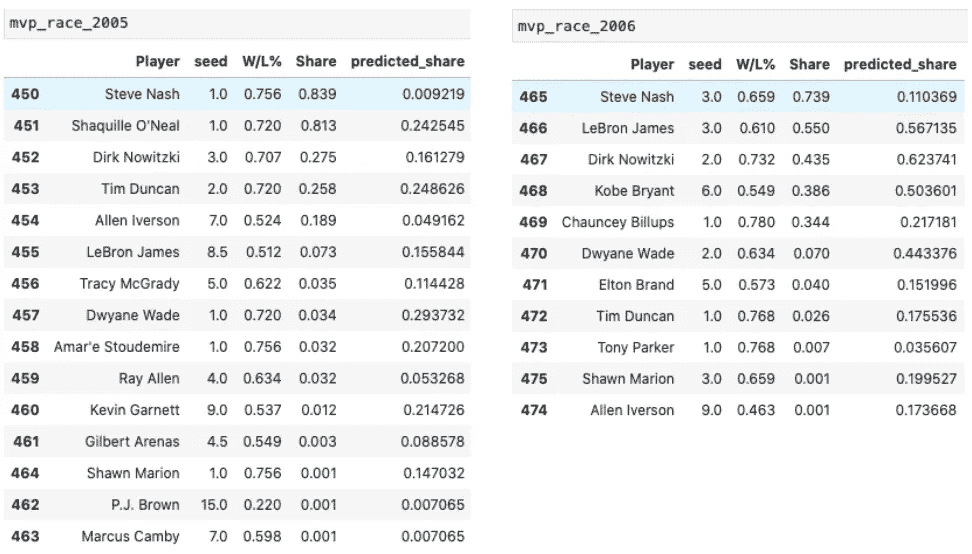*

*2005 年 MVP 候选人(左)和 2006 年 MVP 候选人(右):球员、种子、输赢百分比、实际份额、预测份额(图片由作者提供)*

*仔细观察这场比赛，模型预测史蒂夫纳什的 MVP 份额非常低。不仅如此，预测模型还支持其他候选人，如德维恩·韦德(2005)和德克·诺维茨基(2006)。通过媒体，有人说这两个奖项都是有争议的，人们认为沙奎尔·奥尼尔(2005)和科比(2006)比纳什更应该获奖。这可能是统计数据不能说明全部情况的几个案例之一，因为许多球迷都知道纳什对他的球队的进攻体系产生的无形影响。*

**2001 年 MVP 赛**

*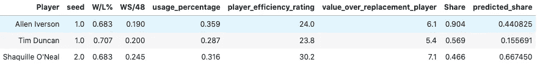*

*2001 年比赛的前三名候选人:模型特征，实际和预测的 MVP 份额(图片由作者提供)*

*该模型也很难预测 2001 年，支持沙奎尔·奥尼尔(预测的获胜者)超过艾弗森(实际的获胜者)和蒂姆·邓肯(实际的第二名)。沙克在那一年拥有最好的先进数据，在球队胜率和输球率上与艾弗森持平。艾弗森唯一勉强超过的功能是播种和使用率。根据当前选定的特征，很难准确预测这一特定年份。*

*可以观察到，尽管能够以 83.33%的准确率猜测每年的第一名，但该模型通常不能很好地按正确的顺序预测所有候选人的 MVP 份额。这可能是因为具有最高精度的模型不一定具有最低的 MAE 或最高的 R。*

## *预测 2022 年 MVP*

**

*(照片由来自 [Unsplash](https://unsplash.com/) 的[科利昂·布朗](https://unsplash.com/photos/vn3_gdMbg6s)拍摄)*

*这些模型现在可以用来预测 2022 年的 MVP 了。然而，还有一个指标需要预测(替补球员的价值)，因为这一统计数据对于 2022 年仍在进行赛季的候选人来说并不完整。*

*为了规划这个“调整后的 VORP”，将需要当前的 VORP 统计和比赛数量的信息。*

> *调整后的 VORP =((当前 VORP) /(已玩游戏数)*剩余游戏数)+(当前 VORP)*

*这种方法既不是传统的也不是理想的，但是它假设了一个球员在赛季末的 VORP(假设他在赛季剩余的比赛中有稳定的统计表现)。同样，这可能不会非常接近赛季结束时的实际 VORP，但每个 2022 年球员的 VORP 都会以相同的方式转变，以保持一致性。*

*最后，最好的 3 个模型(XGboost，LightGBM，Random Forest)根据历史数据(从 1980 年到 2021 年)进行训练，并用于预测 2021 年到 2022 年的 MVP 候选数据。结果如下:*

*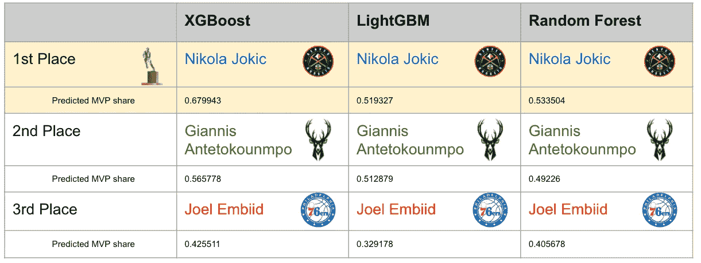*

*模型结果:2021–2022 赛季 MVP 比赛预测(图片由作者提供)*

*(*注意，这些是基于 nba.com 的 NBA MVP 阶梯候选人名单和 2021-2022 常规赛* 结束时 ***的球员/球队统计的最终结果)****

*有趣的是，所有三个模型都预测**尼古拉·约基奇**将成为 2022 年的 MVP。*

*对于 XGBoost 模型，前 3 名候选人的 SHAP 值如下:*

*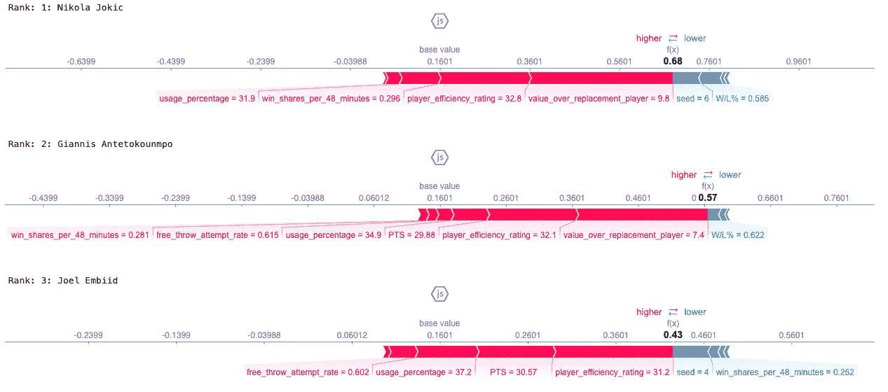*

*2022 年竞选前三名候选人预测:SHAP 价值观可视化；注意，轴没有被一起缩放(作者图像)；点击放大图像*

*预测的 MVP 份额对 Joki 来说很高(预测份额= 0.68)，因为他在高级统计方面表现出色，尽管他的球队是第六种子。*

***Giannis** (预测份额= 0.57)在比赛中非常接近，但与 Joki 相比，他的统计数据稍逊一筹。*

*在 2 月和 3 月期间领先的恩比德**(预测份额= 0.43)在排名中下跌，很可能是因为他的受伤导致他的球队跌至第四名。***

****更新 5/6/2022*** :在整个 2021-2022 常规赛中，这是一场相当激烈的比赛，主要是在上述 3 名球员之间。当这项研究最初于 2022 年 1 月发布时，詹尼斯最初主导了模型预测。然后在 2 月和 3 月，恩比德在所有车型中领先。然而，随着本赛季在 4 月份结束，约基奇以其出色的先进统计数据脱颖而出。*

*这表明，模型很难准确预测直播赛季的 MVP(球员和球队的统计数据并不是一成不变的)。然而，当常规赛数据最终确定时，这个模型似乎做得并不坏。*

# ***结论***

**

*(照片由[迪安·班尼特](https://unsplash.com/@deanbennett)从 [Unsplash](https://unsplash.com/) 拍摄)*

*预测体育运动是一项非常困难的任务，充满了不确定性。在这个实验中，预测 NBA 最有价值球员奖的预测模型被建立和分析。虽然数字肯定不能说明全部情况，但有一些有趣的度量和统计模式对模型有所贡献。最后，利用这些模型，对 2022 年 MVP 进行了预测。在未来，看看这些模型是否能够执行并调整预测，以接近媒体和主题专家的意见，这将是非常有趣的。*