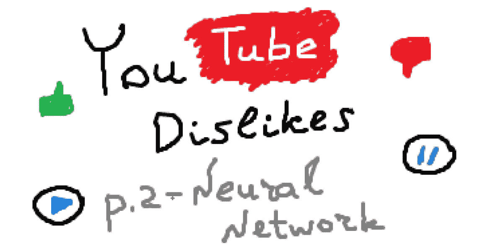
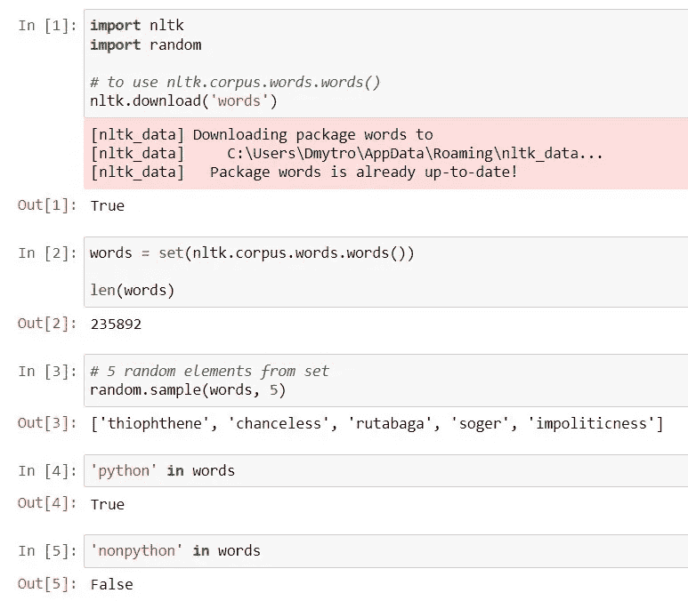
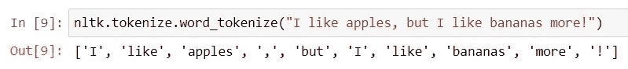
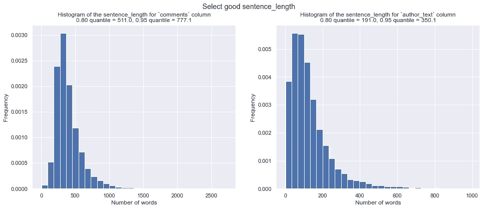
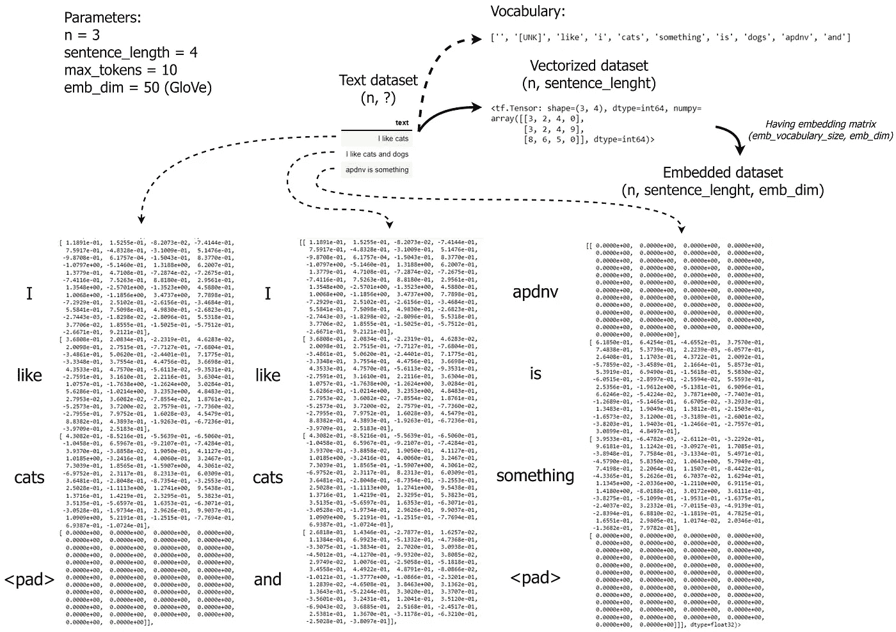
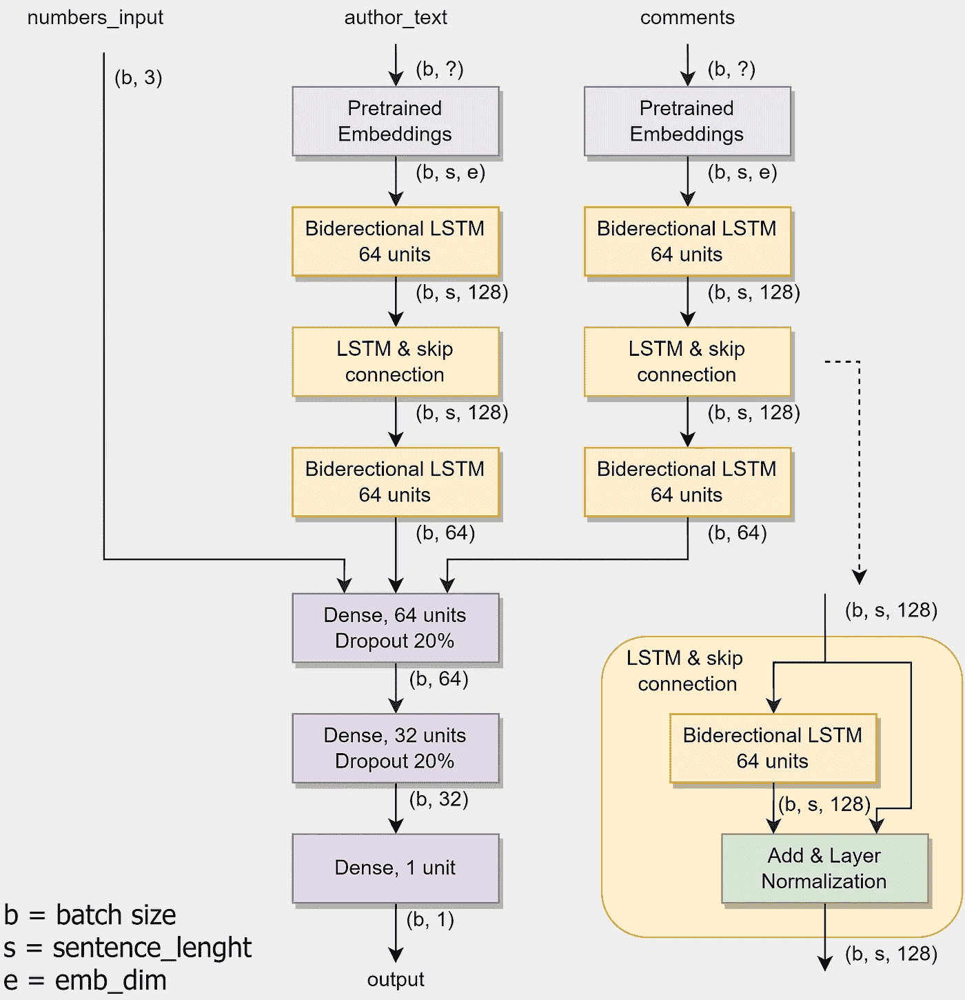
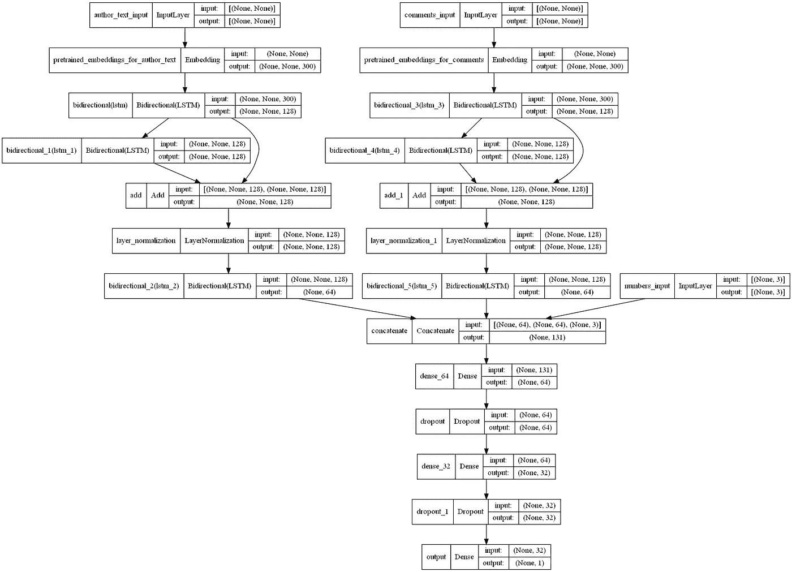
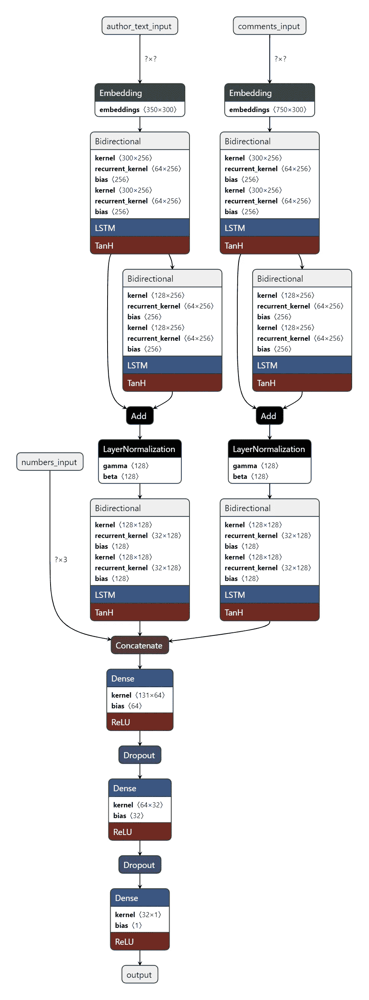

# 预测 YouTube 视频上不喜欢的数量。第 2 部分—模型

> 原文：<https://towardsdatascience.com/predicting-the-number-of-dislikes-on-youtube-videos-part-2-model-aa981a69a8b2>

## 如何(尝试)使用 Tensorflow/Keras 建立深度神经网络来预测不喜欢的数量

预览。作者图片

在本文中，您将学习如何:

*   使用 NLTK 预处理文本数据；
*   在 TensorFlow/Keras 嵌入层中使用预训练的单词嵌入；
*   使用 TensorFlow Functional API 构建非时序神经网络架构；
*   使用`tensorflow.keras.utils.plot_model()`和 [Netron](https://netron.app/) 可视化神经网络结构。

这是下一篇文章的逻辑延续— [预测 YouTube 视频上不喜欢的数量。第 1 部分—数据集](/predicting-the-number-of-dislikes-on-youtube-videos-part-1-dataset-9ec431585dc3)，我使用 YouTube 数据 API v3 收集数据集。

我在本文中使用的所有代码都可以在同一个 [GitLab 资源库](https://gitlab.com/Winston-90/youtube_dislikes)中获得；但是，请记住，本文和存储库中的代码可能略有不同，因为为了简化，这里我没有使用函数。

# **免责声明**

老实对你和我自己说，我必须说我没能成功地解决这个问题。但是我认为不好的经历也是一种经历，这就是为什么我要和你分享它。最后，我会告诉你为什么会这样。

# 资料组

我在这个项目的第一部分详细描述了收集数据集的过程。现在我想记下我将使用其中的哪些字段进行预测:

*   `video_id` -唯一视频 ID -不作为特征使用，因为它不包含信息
*   `title` -视频标题-用作特写
*   `channel_id` -频道 ID -不作为特征使用，因为它不包含信息
*   `channel_title` -频道标题-用作特写
*   `published_at` -视频发布日期-不作为特征使用，因为所有视频属于同一时间段(2021)
*   `view_count` -视图数量-用作特征
*   `likes` -点赞数-用作特征
*   `dislikes` -不喜欢的数量-用作目标标签
*   `comment_count` -评论数量-用作特性
*   `tags` -作为一个字符串的视频标签-用作特性
*   `description` -视频描述-用作功能
*   `comments` - 20 个视频评论作为一个字符串-用作特征

因此，我们面临一个回归任务，有 3 个数字输入特性(`view_count`、`likes`和`comment_count`)和 5 个文本输入特性(`title`、`channel_title`、`tags`、`description`和`comments`)。

# 数据准备

在来自数据集(37k)的所有视频中，我决定从那些在美国流行的视频开始——这大约是 16k 行。

因为不需要准备数字特性，所以我们需要做的就是分割所需的列，并将它们转换成 numpy 数组。代码非常简单:

## 清除文本数据

对于文本数据，一切都更复杂。首先，我创建了一个新的`author_text`特性，包含作者提供的所有文本信息。它由以下特征的串联组成:`title`、`channel_title`、`tags`和`description`。这样我们将把文本特征的数量从五个减少到两个，这将大大减少后面的模型参数的数量。

但在此之前，我们至少需要做一点数据清理。我决定去掉`title`、`channel_title`、`tags`的标点符号，去掉`description`、`comments`栏的无意义词。

我使用了 [NLTK 库](https://www.nltk.org/)来做这件事。为了第一次运行下面的代码，您必须下载一些 NLTK 数据——通过运行`ntlk.download('something')`命令记住这一点。

我们将使用 [pandas 应用函数](https://pandas.pydata.org/docs/reference/api/pandas.DataFrame.apply.html)来清理数据，这允许我们为数据集的每一行应用*一些函数。剩下的只是编写一个函数，它将返回一个干净的输入版本。*

为了避免废话，我们只保留那些包含在`nltk.corpus.words.words()`中的单词。这套包含 235，000 个英语单词——请随意复制和探索下面的代码。

执行上述代码的结果。作者图片

函数将这个集合中出现的所有单词连接起来。它接收一个输入句子(当前行的一个元素)并返回它的干净版本。它将应用于某一列的所有行。

注意，`nltk.tokenize.word_tokenize(sentence)`将一个`sentence`字符串转换成一个单词数组，其中每个元素都是一个单词或一个标点符号。

执行`nltk.tokenize.word_tokenize()`功能的结果。作者图片

当我们删除标点符号时，我们应该只保留那些只包含数字和字母的单词。这也将删除在单词中间包含特殊字符的单词(例如“c@t”)，但是这些单词将在嵌入阶段被忽略，所以这不是一个大问题。

# 使用预训练的单词嵌入将文本转换为矢量

现在我们需要将文本转换成计算机和我们的模型可以理解的数字。这里最重要的两个参数是:

*   `max_tokens`——词汇量的大小。`TextVectorization`层只会考虑`max_tokens`热门词汇；
*   `sentence_length` -一句话的最大字数。较长的句子将被截断，较短的句子将用特殊的`<pad>`符号填充。

如果`max_tokens`参数对性能影响不大，通常等于一个很大的数(10k，20k 等等)，`sentence_length`对它影响很大。稍后我们将看到，该值是矩阵的维度之一，如果它太大，矩阵将会很大，但很稀疏，如果它非常小，我们就有丢失大量信息的风险。

选择此参数的一个好方法是建立一个直方图，即句子中单词数量的直方图，并计算一些分位数。之后，您可以选择一个覆盖数据集 80%或 95%的值。

评论和作者 _ 文本的句子字数直方图。作者图片

您可以在下面看到创建这些直方图的代码(这是`data_transformations.ipynb`笔记本的一部分):

让句子成为文本数据集的一个单元。例如，您将通过执行`df['comments'][0]`命令获得一个句子。

最初，我们正在处理大小为`(n, ?)`(其中`n`是数据集的大小)的张量，因为所有的句子都有不同的长度。我们必须将这些句子转换成固定长度的单词数组。在标记化之后(我们在上面看到的`nltk.tokenize.word_tokenize(sentence)`)，短于`sentence_length`的数组用一个特殊的填充符号填充，长于`sentence_length`的数组被截断。现在我们正在处理一个大小为`(n, sentence_length)`的张量。

之后，我们需要给句子中的每个单词分配一个向量——这就是嵌入。如果不使用预训练的单词嵌入，这些向量将在学习过程中由网络学习，以及其他参数。但是获得代表词嵌入是一项相当困难的任务，需要大量的数据和计算能力。给每个单词分配一个长度为`emb_dim`(嵌入维数)的向量，我们将得到一个大小为`(n, sentence_length, emb_dim)`的张量。

我在这里描述的过程正式记录在`[pretrained_word_embeddings.ipynb](https://gitlab.com/Winston-90/youtube_dislikes/-/blob/main/pretrained_word_embeddings.ipynb)` [笔记本](https://gitlab.com/Winston-90/youtube_dislikes/-/blob/main/pretrained_word_embeddings.ipynb)中。基于这段代码，我创作了下面这张图片，与文本相比，它会更加清晰。

使用单词嵌入预处理文本。作者图片

这个玩具数据集包含 8 个独特的词:“我”，“喜欢”，“猫”，“和”，“狗”，“apdnv”，“是”，“什么”。所有这些词都存在于从 8+2 ≤ `max_tokens`(设置为 10)以来的数据集中学习到的词汇中。同时，词汇表的第一个元素(`’’`)是`<pad>`符号，第二个元素(`’[UNK]’` )—未知单词的特殊符号(在这种情况下，如果我们将`max_tokens` <设为 10，就会用到它)。这两个符号总是出现在词汇表中。

请注意，单词“I”、“like”和“cats”的单词嵌入与第一句和第二句相似，也与`embeddings\glove.6B\glove.6B.50d.txt`文件中的相应行匹配。此外，单词“apdnv”被嵌入到零向量中，因为嵌入字典不包含这个单词。

确保嵌入匹配。作者图片

您可以从下面的链接下载 40 多种语言的免费预训练单词嵌入。

  

# 建筑模型

最后，我们可以去网络。为什么是神经网络？

这项任务中的主要信息由文本特征携带——它们具有最强的预测能力。时间表明，经典的机器学习算法处理文本处理的能力比神经网络差得多。我们说的是 NLP — *自然语言处理*。这个领域包括各种各样的任务——从*命名实体识别*和*词性标注*到*文本摘要*和*机器翻译*。当前的任务最类似于*情感分析*——预测文本的“情绪”。

## 神经网络体系结构

让我们转到最有趣的部分——构建模型的架构。

让我描述一下我在构建模型架构时使用的主要启发方法:

1.  为了将文本转换成向量，我们将使用**预训练的单词嵌入**；
2.  由于任务不是严格顺序的，而且整个文本对模型是可见的，我建议用**双向 LSTM** 代替单向；
3.  为了从文本中提取更多的信息，我们将使用**多层 LSTM** 。同时我们会用**跳过连接**来简化学习过程；
4.  对于评论和作者的数据，我们将进行类似的分层，但权重不同，因为作者/观众的观点可能会有很大差异；
5.  模型的数值参数不会通过深层网络传递，不会使结构复杂化；
6.  在从文本中提取特征后，我们将组合所有可用的信息，并将其发送到一个小小的前馈神经网络的输入端。

下面可以看到网络结构和生成它的详细代码(是`model.ipynb`笔记本的一部分)。

神经网络架构。作者图片

## 可视化神经网络架构

下面你可以看到绘制网络结构的`tensorflow.keras.utils.plot_model()`函数的输出。

神经网络架构——`plot_model()`函数的输出。作者图片

要在项目中使用此功能，请执行以下操作:

1.  确保您使用 TensorFlow 版或更高版本(您可以通过打印`tf.__version__`来实现)，因为该功能仅在软件包的更高版本中可用。如果您使用的是 TensorFlow 的早期版本，请更新软件包(`pip install --upgrade tensorflow`)。
2.  你需要安装 pydot 和 Graphviz 来执行这个功能。对于 pydot 运行`pip install pydot`，对于 Graphviz 遵循[官方文档](https://graphviz.org/download/)。

也可以用 [Netron](https://netron.app/) 。这种方法在处理大型网络时效果较差，并且在处理网络架构时不太方便，因为您需要保存网络并使用应用程序打开它，但它可以创建非常漂亮的可视化效果，并允许您详细浏览网络，甚至下载特定图层的权重。一定要试试！

神经网络架构——由 [Netron](https://netron.app/) 进行可视化。作者图片

# **结论，以及可以做得更好的地方**

你已经看到了最上面的免责声明，你已经知道我失败了。好吧，虽然我希望并且努力到最后，但是是时候接受它了。我得到的最好的质量是关于一个 **6k 验证错误(MAE)** 。没有想象中的那么糟糕，但是一点也不好。

什么可以做得更好？是的，事实上，几乎一切都是因为任务仍然没有解决。但是让我分享一些关于如何提高模型质量的想法:

1.  使用更强大的单词嵌入——例如，用 BERT 代替 GloVe
2.  使用注意机制代替双向 LSTM；
3.  使用更强大的模型——更多的`LSTM_and_skip_connection`模块、类似变压器的架构等。

看起来有点奇怪，不是吗？在这里，我列出了可以解决问题的特定猜测，那么我为什么不这样做呢？为什么我没有尝试所有这些并告诉你结果呢？

实际上我试过了。最初，我使用 50-dim 手套嵌入，但也尝试了 fastText 和 ELMo。我尝试了更多的区块，更多的层次，更多的训练时期。我删除了功能(尝试了没有`author_text`或没有`comments`)，改变了数据预处理和准备，没有任何帮助。但同时，我确信架构和嵌入工作得很好(例如，它能够使用[这个情感分析数据集](https://www.kaggle.com/kritanjalijain/amazon-reviews)成功地解决分类问题)。

机器学习中有一个流行的原则(另一个变体**垃圾输入——垃圾输出**):

> 如果领域专家不能从数据中得出结论，机器学习模型很可能也不能做到这一点。

当然，我不是专家，但评论数据是如此嘈杂和不确定，以至于我无法近似预测不喜欢的数量，甚至无法说用户是否喜欢某个特定的视频！

数据不具有代表性——这是主要问题。这并不是因为我收集不正确，但这可能也是我的错。也许，使用一两条最受欢迎的评论是比 20 条更好的选择，这样可以提高质量。但无论如何，要训练一个好的网络，你需要花费大量的资源主要在数据收集上。而且很遗憾，我没有这样的资源。

负面体验也是一种体验。此外，这是一个比积极的经验更有用的经验。所以我才和你分享。这个项目教会了我很多。希望对你也有用，至少有一点。

# 参考

<https://keras.io/examples/nlp/pretrained_word_embeddings/>  

# 感谢您的阅读！

*   我希望这些材料对你有用。[在 Medium](https://medium.com/@andimid) 上关注我，获取更多类似的文章。
*   如果您有任何问题或意见，我将很高兴得到任何反馈。在评论中问我，或者通过 [LinkedIn](https://www.linkedin.com/in/andimid/) 或 [Twitter](https://twitter.com/dimid_ml) 联系我。
*   为了支持我作为一名作家，并获得数以千计的其他媒体文章，使用[我的推荐链接](https://medium.com/@andimid/membership)获得媒体会员资格(不收取额外费用)。