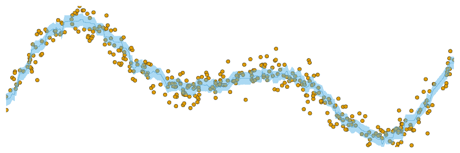
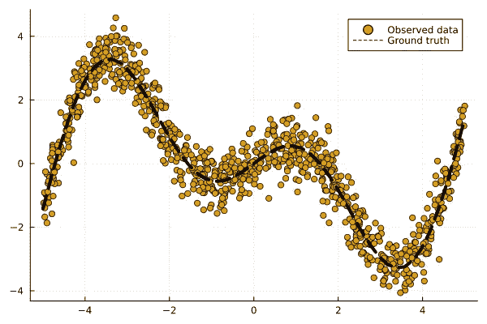
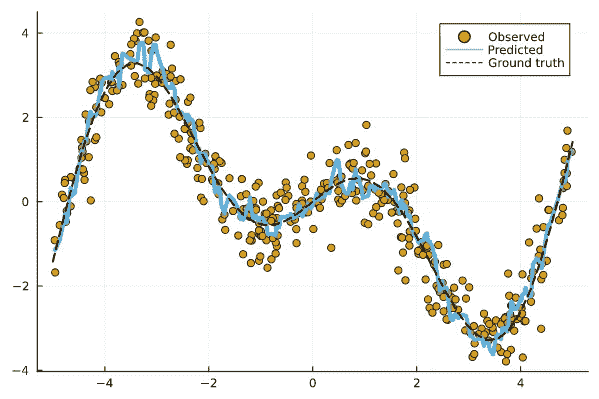
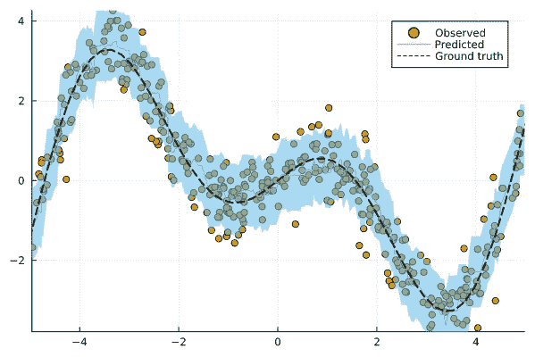
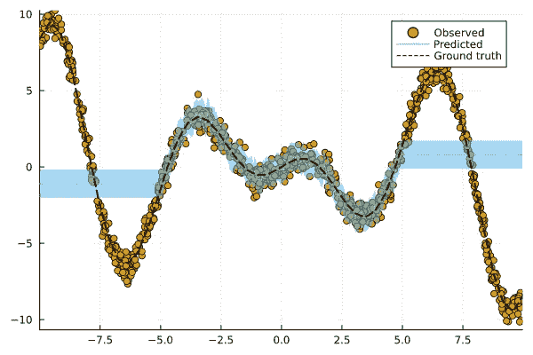

# 任何回归模型的保形预测区间

> 原文：<https://towardsdatascience.com/prediction-intervals-for-any-regression-model-306930d5ad9a>

## Julia 中的共形预测——第三部分



不同覆盖率的适形预测区间。随着覆盖范围的扩大，预测区间的宽度也在扩大。图片作者。

这是使用`[ConformalPrediction.jl](https://github.com/pat-alt/ConformalPrediction.jl)`在 Julia 中介绍共形预测的系列文章的第三部分(现在是最后一部分)。第一篇[帖子](/conformal-prediction-in-julia-351b81309e30)介绍了监督分类任务的保形预测:我们知道保形分类器产生集值预测，保证以一定的概率包含新样本的真实标签。在第二篇[帖子](https://medium.com/towards-data-science/how-to-conformalize-a-deep-image-classifier-14ead4e1a5a0)中，我们将这些想法应用于一个更具实践性的例子:我们看到了使用`[ConformalPrediction.jl](https://github.com/pat-alt/ConformalPrediction.jl)`来整合深度学习图像分类器是多么容易。

在这篇文章中，我们将着眼于回归问题，即涉及连续结果变量的监督学习任务。回归任务和分类任务一样无处不在。例如，我们可能对使用机器学习模型来预测房价或欧元的通货膨胀率或下一个大型语言模型的参数大小感兴趣。事实上，与分类相比，许多读者可能更熟悉回归模型，在这种情况下，您也可能更容易在此背景下理解保形预测(CP)。

# 📖背景

在我们开始之前，让我们简单回顾一下什么是 CP。别担心，我们不会深究方法论。但是先给你一个高层次的描述:

> 共形预测(又名共形推理)是一种用户友好的范式，用于为这种模型的预测创建统计上严格的不确定性集/区间。至关重要的是，这些集合在无分布的意义上是有效的:即使没有分布假设或模型假设，它们也拥有明确的非渐近保证。
> 
> 安热洛普洛斯和贝茨(2021 年)

直观地说，CP 的工作前提是通过重复采样或使用专用校准数据，将启发式的不确定性概念转化为严格的不确定性估计。

在接下来的内容中，我们将通过使用`[MLJ.jl](https://alan-turing-institute.github.io/MLJ.jl/dev/)`和`[ConformalPrediction.jl](https://github.com/pat-alt/ConformalPrediction.jl)`完成一个标准的机器学习工作流来探索 CP 能做什么。这里不太关注 CP 是如何工作的，但是参考资料会给你提供额外的资源。

> 💡💡💡 ***互动版***
> 
> 这个帖子也可以作为一个完全互动的`[Pluto.jl](https://github.com/fonsp/Pluto.jl)`🎈笔记本:点击[此处](https://binder.plutojl.org/v0.19.12/open?url=https%253A%252F%252Fraw.githubusercontent.com%252Fpat-alt%252FConformalPrediction.jl%252Fmain%252Fdocs%252Fpluto%252Fintro.jl)。根据我自己的经验，这可能需要一些时间来加载，当然足够长的时间让你自己喝一杯热饮料☕，并首先在这里阅读。但是我向你保证，等待是值得的！

# 📈数据

大多数机器学习工作流都是从数据开始的。为了便于说明，我们将使用合成数据。下面的帮助函数可以用来生成一些回归数据。

```
function get_data(;N=1000, xmax=3.0, noise=0.5, fun::Function=fun(X) = X * sin(X))
    # Inputs:
    d = Distributions.Uniform(-xmax, xmax)
    X = rand(d, N)
    X = MLJBase.table(reshape(X, :, 1))

    # Outputs:
    ε = randn(N) .* noise
    y = @.(fun(X.x1)) + ε
    y = vec(y)
    return X, y
end
```

图 1 展示了我们的观察(点)以及从输入到输出(线)的基本事实映射。我们将映射 f: 𝒳 ↦ 𝒴定义如下:

```
f(X) = X * cos(X)
```



图 1:一些合成回归数据。观察结果显示为点。从输入到输出的基本事实映射显示为虚线。图片作者。

# 🏋️模型训练使用`[MLJ](https://alan-turing-institute.github.io/MLJ.jl/dev/)`

`[ConformalPrediction.jl](https://www.paltmeyer.com/blog/posts/conformal-regression/(https://github.com/pat-alt/ConformalPrediction.jl))`与`[MLJ.jl](https://alan-turing-institute.github.io/MLJ.jl/dev/)` (Blaom et al. 2020)接口:一个为 Julia 设计的全面的机器学习框架。`MLJ.jl`提供了一个庞大且不断增长的流行机器学习模型套件，可用于监督和非监督任务。保形预测是一种模型不可知的不确定性量化方法，因此它可以应用于任何常见的监督机器学习模型。

因此，`MLJ.jl`的接口看起来很自然:任何(受监督的)`MLJ.jl`模型现在都可以使用`ConformalPrediction.jl`来整合。通过利用现有的`MLJ.jl`功能完成训练、预测和模型评估等常见任务，这个包是轻量级的，可扩展的。现在让我们看看所有这些是如何工作的...

首先，让我们将数据分成训练集和测试集:

```
train, test = partition(eachindex(y), 0.4, 0.4, shuffle= true)
```

现在让我们为我们的回归任务定义一个模型:

```
Model = @load KNNRegressor pkg = NearestNeighborModels
model = Model()
```

> 💡💡💡 ***随你便！***
> 
> 觉得这个数据集太简单？想知道为什么我不使用 XGBoost 来完成这个任务吗？在本帖的互动版本[中，你可以完全控制数据和模型。试试吧！](https://binder.plutojl.org/v0.19.12/open?url=https%253A%252F%252Fraw.githubusercontent.com%252Fpat-alt%252FConformalPrediction.jl%252Fmain%252Fdocs%252Fpluto%252Fintro.jl)

使用标准的`MLJ.jl`工作流程，现在让我们首先训练不整合模型。我们首先用数据包装我们的模型:

```
mach_raw = machine(model, X, y)
```

然后我们让机器适应训练数据:

```
MLJBase.fit!(mach_raw, rows=train, verbosity= 0)
```

下面的图 2 显示了测试数据集的结果点预测:



图 2:我们的机器学习模型的点预测。图片作者。

我们的模型做得怎么样？当然，它从来都不完全正确，因为预测是估计，因此是不确定的。让我们看看如何使用共形预测来表达不确定性。

# 🔥整合模型

我们可以用一行代码将我们的`model`变成一个一致化的模型:

```
conf_model = conformal_model(model)
```

默认情况下，当在`<:Deterministic`模型上调用时，`conformal_model`会创建一个归纳共形回归器(更多信息见下文)。这种行为可以通过使用可选的`method`键参数来改变。

为了训练我们的共形模型，我们可以再次依靠标准的`MLJ.jl`工作流程。我们首先用数据包装我们的模型:

```
mach = machine(conf_model, X, y)
```

然后我们让机器适应数据:

```
MLJBase.fit!(mach, rows=train, verbosity= 0)
```

现在让我们再次看看对我们的测试数据的预测。下图显示了我们的构象化模型的结果。来自保形回归的预测是范围值:对于每个新样本，模型返回一个区间(yₗ，yᵤ) ∈ 𝒴，该区间以用户指定的概率(1-α)覆盖测试样本，其中α是预期误差率。这就是所谓的**边际覆盖保证**，在假设训练和测试数据可交换的情况下，它被证明是成立的。



图 3:我们的共形机器学习模型的预测区间。图片作者。

直观上，较高的覆盖率导致较大的预测区间:由于较大的区间覆盖了较大的𝒴子空间，因此它更有可能覆盖真实值。

我不指望你相信我，边际覆盖性质真的成立。事实上，当我第一次知道这件事的时候，我自己都不敢相信。如果你喜欢数学证明，你可以在这个[教程](https://arxiv.org/pdf/2107.07511.pdf)里找到一个，比如。如果你喜欢通过经验观察来说服自己，请阅读下面的内容…

# 🧐评估

为了从经验上验证边际覆盖率属性，我们可以查看我们的保形预测器的经验覆盖率(详见[教程](https://arxiv.org/pdf/2107.07511.pdf)的第 3 节)。为此，我们的产品包提供了与`MLJ.jl`模型评估工作流程兼容的自定义性能指标`emp_coverage`。特别是，我们将使用`emp_coverage`作为我们的性能度量，在我们的共形模型上调用`evaluate!`。由此得出的经验覆盖率应该接近期望的覆盖率水平。

```
model_evaluation =
    evaluate!(mach, operation=MLJBase.predict, measure=emp_coverage, verbosity=0)
println("Empirical coverage: $(round(model_evaluation.measurement[1], digits=3))")
println("Coverage per fold: $(round.(model_evaluation.per_fold[1], digits=3))")
```

```
Empirical coverage: 0.902 
Coverage per fold: [0.94, 0.904, 0.874, 0.874, 0.898, 0.922]
```

> *✅ ✅ ✅* 伟大！我们得到的经验覆盖率略高于预期*😁* …但是为什么不完全一样呢？

在大多数情况下，它会略高于预期，因为(1-α)是一个较低的界限。但是注意，它也可以比期望的稍低。这是因为覆盖属性是“边际”的，即概率是数据中随机性的平均值。在大多数情况下，足够大的校准集大小(n>1000)足以减少随机性。根据您以上的选择，校准设置可能非常小(设置为 500)，这可能导致**覆盖松弛**(参见[教程](https://arxiv.org/pdf/2107.07511.pdf)的第 3 节)。

# 引擎盖下发生了什么？

概括地说，归纳共形预测(也称为分裂共形预测)的工作原理如下:

1.  将训练分成适当的训练集和单独的校准集
2.  在适当的训练集上训练机器学习模型。
3.  使用一些启发式的不确定性概念(例如，回归情况下的绝对误差)，使用校准数据和拟合模型计算不合格分数。
4.  对于给定的覆盖率，计算不符合项分数经验分布的相应分位数 *q* 。
5.  对于给定的分位数和测试样本 *X* ，形成相应的保形预测集如下:*C*(*X*)*=*{*y:*s(*X，y* ) *≤ q* }

# 🔃概述

这是一次超级快速的`[ConformalPrediction.jl](https://github.com/pat-alt/ConformalPrediction.jl)`之旅。我们已经看到该软件包如何与`[MLJ.jl](https://alan-turing-institute.github.io/MLJ.jl/dev/)`自然集成，允许用户为任何受监督的机器学习模型生成严格的预测不确定性估计。

# 我们结束了吗？

很酷，对吧？使用单个 API 调用，我们能够为各种不同的回归模型生成严格的预测区间。我们是否已经一劳永逸地解决了预测不确定性量化问题？我们还需要担心其他事情吗？保形预测是一个非常有用的工具，但像许多其他事情一样，它不是我们所有问题的最终答案。其实还是看看能不能把 CP 发挥到极致吧。

从上面生成数据的 helper 函数带有一个可选参数`xmax`。通过增加该值，我们有效地扩展了输入的范围。让我们这样做，看看我们的共形模型如何处理这种新的域外数据。



图 4:我们应用于域外数据的整合机器学习模型的预测区间。图片作者。

> 呜哇呜哇*🤕* …看起来我们有麻烦了:在图 4 中，预测区间没有很好地覆盖域外测试样本。这里发生了什么？

通过扩大输入的范围，我们违反了可交换性假设。当违反该假设时，边际覆盖属性不成立。但是不要绝望！有很多方法可以解决这个问题。

# 📚继续读

如果你想了解更多，请务必继续阅读[文档](https://www.paltmeyer.com/ConformalPrediction.jl/stable/)。也有许多有用的资源来学习更多关于保形预测的知识，我在下面列出了其中的一些:

*   由 Angelopoulos 和 Bates ( [2022](https://arxiv.org/pdf/2107.07511.pdf) )对保形预测和无分布不确定性量化的温和介绍。
*   由 Manokhin ( [2022](https://github.com/valeman/awesome-conformal-prediction) )完成的令人敬畏的保形预测知识库
*   **MAPIE** :用于保形预测的综合 Python [库](https://mapie.readthedocs.io/en/latest/index.html)。
*   我之前的两篇博文。

尽情享受吧！

# 参考

安吉洛普洛斯，阿纳斯塔西奥斯 n，斯蒂芬贝茨。2021."保形预测和无分布不确定性量化的简明介绍."【https://arxiv.org/abs/2107.07511】T4。

布劳姆、安东尼·d .、弗朗茨·基拉里、蒂博特·利纳特、亚尼斯·斯米兰利德斯、迭戈·阿里纳斯和塞巴斯蒂安·沃尔默。2020." MLJ:用于可组合机器学习的 Julia 包."*开源软件杂志* 5 (55): 2704。[https://doi.org/10.21105/joss.02704](https://doi.org/10.21105/joss.02704)。

*原载于 2022 年 12 月 12 日 https://www.paltmeyer.com*[](https://www.paltmeyer.com/blog/posts/conformal-regression/)**。**