# Python 中的预测区间

> 原文：<https://towardsdatascience.com/prediction-intervals-in-python-64b992317b1a>


图为[舒巴姆·达吉](https://unsplash.com/@theshubhamdhage?utm_source=medium&utm_medium=referral)在 [Unsplash](https://unsplash.com?utm_source=medium&utm_medium=referral)

## 数据科学基础

## 了解获得预测区间的三种方法

如果让你猜我过去一周看了多少部电影，你会觉得猜“2 到 6”还是“3”更有把握？我们可能会同意，猜测一个范围比猜测一个数字更有可能是正确的。同样，与单值预测相比，预测区间为我们提供了更可靠、更透明的估计。在本帖中，我们将学习在 Python 中获得预测区间的三种方法。


照片由[法库里安设计](https://unsplash.com/@fakurian?utm_source=medium&utm_medium=referral)在 [Unsplash](https://unsplash.com?utm_source=medium&utm_medium=referral) 上拍摄

# 📦 0.设置

我们将从加载必要的库和样本数据开始。我们将使用 Scikit-learn 关于[糖尿病](https://scikit-learn.org/stable/datasets/toy_dataset.html#diabetes-dataset)的内置数据集(*该数据在 BSD 许可下可用*)。如果您想了解更多关于数据集的信息，请使用`print(diabetes[‘DESCR’])`查看它的描述。

```
import numpy as np
np.set_printoptions(
    formatter={'float': lambda x: "{:.4f}".format(x)}
)
import pandas as pd
pd.options.display.float_format = "{:.4f}".format
from scipy.stats import t
import statsmodels.api as sm
from sklearn.datasets import load_diabetes
from sklearn.model_selection import train_test_split
from sklearn.linear_model import LinearRegression
from sklearn.ensemble import GradientBoostingRegressorimport matplotlib.pyplot as plt
import seaborn as sns
sns.set(style='darkgrid', context='talk')diabetes = load_diabetes(as_frame=True)
df = diabetes['data']
df['target'] = diabetes['target']
df.info()
```

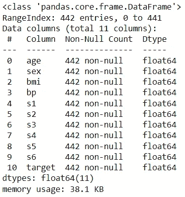

让我们将数据分成训练集和测试集:

```
train, test = train_test_split(df, test_size=0.1, random_state=42)
X_train, X_test, y_train, y_test = train_test_split(
    df.drop(columns='target'), df['target'], test_size=0.1, 
    random_state=42
)
x_train = X_train['bmi']
x_test = X_test['bmi']print(f"X_train shape: {X_train.shape}")
print(f"x_train shape: {x_train.shape}")
print(f"y_train shape: {y_train.shape}")
print("\n========== Training data ==========")
display(train[['target']].describe().T)print(f"X_test shape: {X_test.shape}")
print(f"x_test shape: {x_test.shape}")
print(f"y_test shape: {y_test.shape}")print("\n========== Test data ==========")
test[['target']].describe().T
```

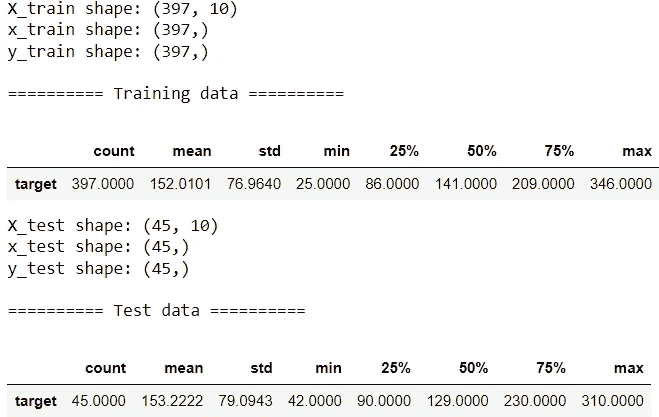

目标范围从 25 到 350，平均值约为 150，中位数约为 130-140。

# 📍 1.预测数的变化范围

我们现在来看看获得预测区间的三种方法。

## 💡 1.1.使用标准误差

让我们使用`bmi`建立一个简单的线性回归来预测`target`。

```
model = LinearRegression()
model.fit(x_train.values.reshape(-1, 1), y_train)
print(f"Intercept: {model.intercept_:.2f}")
print(f"Slope: {model.coef_[0]:.2f}")
print(model.predict(x_test.values.reshape(-1, 1))[:5])
```

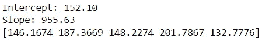

我们可以看到预测，我们最好的猜测。使用下面的公式，我们可以计算标准误差并获得预测区间:

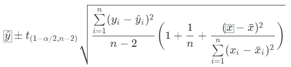

绿框中的变量是针对我们正在进行预测的特定观察的，而其余的是根据训练数据计算的。

该公式可以翻译成如下代码。我们使用自定义对象，因为它比函数更灵活:

```
class CustomLinearRegression:
    def __init__(self):
        pass

    def fit(self, x, y):
        # Calculate stats
        self.n = len(x)
        self.x_mean = np.mean(x)
        self.y_mean = np.mean(y)
        self.x_gap = x-self.x_mean
        self.y_gap = y-self.y_mean
        self.ss = np.square(self.x_gap).sum()

        # Find coefficients
        self.slope = np.dot(self.x_gap, self.y_gap)/self.ss
        self.intercept = self.y_mean-self.slope*self.x_mean

        # Find training error
        y_pred = self.intercept+self.slope*x
        self.se_regression = np.sqrt(
            np.square(y-y_pred).sum()/(self.n-2)
        )

    def predict(self, x):
        y_pred = self.intercept+self.slope*x
        return y_pred

    def predict_interval(self, x, alpha=0.1):
        t_stat = t.ppf(1-alpha/2, df=self.n-2)

        # Calculate interval upper and lower boundaries
        df = pd.DataFrame({'x': x})
        for i, value in df['x'].iteritems():
            se = self.se_regression * np.sqrt(
                1+1/self.n+np.square(value-self.x_mean)/self.ss
            )
            df.loc[i, 'y_pred'] = self.intercept+self.slope*value
            df.loc[i, 'lower'] = df.loc[i, 'y_pred']-t_stat*se
            df.loc[i, 'upper'] = df.loc[i, 'y_pred']+t_stat*se
        return df

custom_model = CustomLinearRegression()     
custom_model.fit(x_train, y_train)
print(f"Intercept: {custom_model.intercept:.2f}")
print(f"Slope: {custom_model.slope:.2f}")
custom_pred = custom_model.predict_interval(x_test)
custom_pred.head()
```

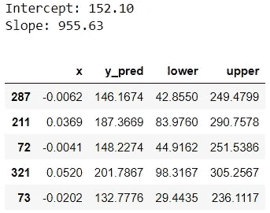

让我们来理解这个输出。在线性回归中，预测代表条件平均目标值。因此`y_pred`，我们的预测栏，告诉我们给定特征的估计平均目标。预测区间告诉我们*对于一个给定的记录*目标可以取值的范围。我们可以从`lower`和`upper`列中看到预测区间的上下边界。这是一个 90%的预测区间，因为我们选择了`alpha=0.1`。我们将在这篇文章的剩余部分使用相同的 alpha 值。

如果你很好奇，这里有一些解释预测区间的方法:

*   记录 287 的实际目标值有 90%的可能性在 42.8550 和 249.4799 之间。
*   根据记录 287 的`bmi`值，我们有 90%的把握认为其实际目标值将介于 42.8550 和 249.4799 之间。
*   大约 90%的预测区间将包含实际值。

让我们检查一下测试数据中的目标值在预测区间内的百分比:

```
custom_correct = np.mean(
    (custom_pred['lower']<y_test) & (y_test<custom_pred['upper'])
)
print(f"{custom_correct:.2%} of the prediction intervals contain true target.")
```


这大概是 90%。虽然手动计算有助于我们理解幕后发生的事情，但更实际的是，我们可以使用库并简化我们的工作。下面是我们如何使用`statsmodels`包来获得相同的预测间隔:

```
sm_model = sm.OLS(y_train, sm.add_constant(x_train)).fit()
print(f"Intercept: {sm_model.params[0]:.2f}")
print(f"Slope: {sm_model.params[1]:.2f}")sm_pred = sm_model.get_prediction(sm.add_constant(x_test))\
                  .summary_frame(alpha=0.1)
sm_pred.head()
```

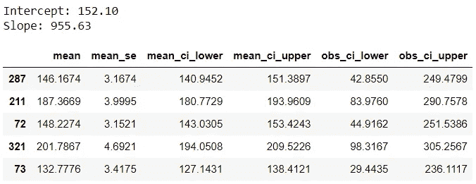

这个输出提供了一些额外的输出，让我们来理解其中的关键:
◼️ `mean`:预测，与前面的`y_pred`相同。
◼️ `mean_ci_lower` & `mean_ci_upper`:置信区间边界
◼️ `obs_ci_lower` & `obs_ci_upper`:预测区间边界，同前面的`lower`和`upper`。

我们可以检查预测和预测间隔是否与手动计算的相匹配:

```
np.mean(np.isclose(
    custom_pred.drop(columns='x').values, 
    sm_pred[['mean', 'obs_ci_lower', 'obs_ci_upper']]), 
        axis=0)
```

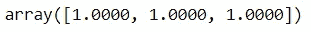

可爱，很配！

现在，你可能想知道置信区间和预测区间的区别。虽然这些术语相互关联，听起来有些相似，但它们指的是两个不同的区间，不应互换使用:
◼️置信区间用于均值预测。与预测区间不同，置信区间并没有告诉我们*一个观察可以采用的目标值的范围*。相反，它告诉我们目标平均值的范围。下面是一个解释示例:有 90%的可能性，特征值与记录 287 相同的记录的平均目标值将落在 140.9452 和 151.3897 之间。
◼️虽然两个区间都以预测为中心，但预测区间的标准误差大于置信区间的标准误差。因此，预测区间比置信区间宽。

我们通过简单的线性回归来了解这个概念，但是在实践中更常见的是有多个特征。是时候扩展我们的示例以使用全部功能了:

```
ols = sm.OLS(y_train, sm.add_constant(X_train)).fit()
test[['ols_lower', 'ols_upper']] = (ols
    .get_prediction(sm.add_constant(X_test))
    .summary_frame(alpha=0.1)[['obs_ci_lower', 'obs_ci_upper']])
columns = ['target', 'ols_lower', 'ols_upper']
test[columns].head()
```

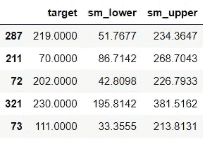

流程与使用单个特征完全相同。如果你很想知道在多重特征存在的情况下公式是如何变化的，请查看本指南。让我们评估一下我们的时间间隔:

```
ols_correct = np.mean(
    test['target'].between(test['ols_lower'], test['ols_upper'])
)
print(f"{ols_correct:.2%} of the prediction intervals contain true target.")
```

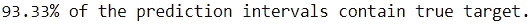

## 1.2.来自分位数回归

使用分位数回归，我们可以预测目标的*条件分位数，而不是条件均值目标。为了获得 90%的预测区间，我们将构建两个分位数回归，一个预测第 5 个百分位数，另一个预测第 95 个百分位数。*

```
alpha = 0.1
quant_lower = sm.QuantReg(
    y_train, sm.add_constant(X_train)
).fit(q=alpha/2)
test['quant_lower'] = quant_lower.predict(
    sm.add_constant(X_test)
)quant_upper = sm.QuantReg(
    y_train, sm.add_constant(X_train)
).fit(q=1-alpha/2)
test['quant_upper'] = quant_upper.predict(
    sm.add_constant(X_test)
)
columns.extend(['quant_lower', 'quant_upper'])
test[columns].head()
```

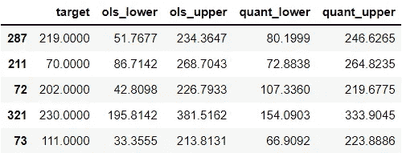

这里，`quant_lower`模型预测不足，而`quant_upper`模型预测过度。现在让我们检查在新间隔内的预测的百分比:

```
quant_correct = np.mean(
    test['target'].between(test['quant_lower'], test['quant_upper'])
)
print(f"{quant_correct:.2%} of the prediction intervals contain true target.")
```

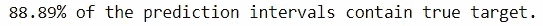

略低于 90%，覆盖率略低于以前。

## 1.3.从有分位数损失的 GBM

最后一种方法与前一种方法非常相似。我们将使用分位数损失的`GradientBoostingRegressor`,通过两个模型获得 90%的预测区间:

```
gbm_lower = GradientBoostingRegressor(
    loss="quantile", alpha=alpha/2, random_state=0
)
gbm_upper = GradientBoostingRegressor(
    loss="quantile", alpha=1-alpha/2, random_state=0
)gbm_lower.fit(X_train, y_train)
gbm_upper.fit(X_train, y_train)test['gbm_lower'] = gbm_lower.predict(X_test)
test['gbm_upper'] = gbm_upper.predict(X_test)
columns.extend(['gbm_lower', 'gbm_upper'])
test[columns].head()
```

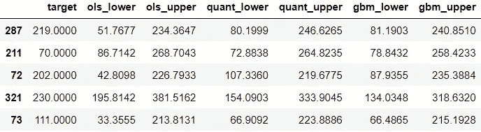

评估时间间隔覆盖范围的时间:

```
gbm_correct = np.mean(
    test['target'].between(test['gbm_lower'], test['gbm_upper'])
)
print(f"{gbm_correct:.2%} of the prediction intervals contain true target.")
```

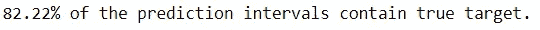

与以前的区间相比，这一数值较低。查看上面的示例记录，与前两种方法相比，间隔看起来稍微窄一些。对于我们在这篇文章中学到的任何方法，我们可以通过减少 alpha 来增加覆盖率。然而，这意味着间隔可能变得太宽，以至于它们可能不太能提供信息或对决策没有帮助。因此，在使用预测区间时，我们必须找到正确的平衡点。

现在让我们直观地比较所有三个区间:

```
test = test.sort_values('target').reset_index()plt.figure(figsize=(10,6))
sns.scatterplot(data=test, x=test.index, y='target',
                color='grey')
sns.lineplot(data=test, x=test.index, y='ols_lower', 
             color='hotpink')
sns.lineplot(data=test, x=test.index, y='ols_upper', 
             color='hotpink', label='Linear Regression')sns.lineplot(data=test, x=test.index, y='quant_lower', 
             color='blue')
sns.lineplot(data=test, x=test.index, y='quant_upper', 
             color='blue', label='Quantile Regression')sns.lineplot(data=test, x=test.index, y='gbm_lower', 
             color='green')
sns.lineplot(data=test, x=test.index, y='gbm_upper', 
             color='green', label='Gradient Boosting Machine')
plt.xticks([]);
```

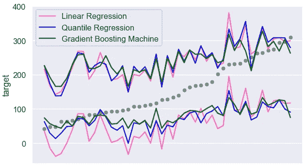

越接近最小值和最大值的值越有可能超出预测区间。让我们进一步研究这些错误。我们将查看具有最高目标的 5 项记录:

```
test[columns].nlargest(5, 'target')
```

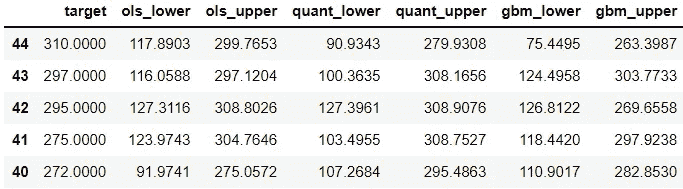

现在，让我们看看另一端:

```
test[columns].nsmallest(5, 'target')
```

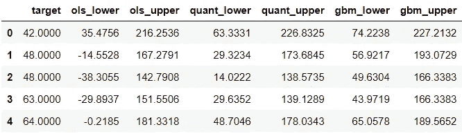

线性回归预测区间的下限有时是负值。这是需要注意的事情。如果我们知道目标总是正的，我们可以使用包装函数用最低可能的值覆盖这些负边界。

瞧，这就是计算预测区间的三种方法！希望您能在下一个回归用例中使用这些方法。


塞巴斯蒂安·斯文森在 [Unsplash](https://unsplash.com?utm_source=medium&utm_medium=referral) 上的照片

*您想访问更多这样的内容吗？媒体会员可以无限制地访问媒体上的任何文章。如果你使用* [*我的推荐链接*](https://zluvsand.medium.com/membership)*成为会员，你的一部分会费会直接去支持我。*

谢谢你看我的帖子。如果你感兴趣，这里有我的一些帖子的链接:

◼️️ [管道、ColumnTransformer 和 FeatureUnion 解释](/pipeline-columntransformer-and-featureunion-explained-f5491f815f?source=your_stories_page-------------------------------------)
◼️️ [FeatureUnion、ColumnTransformer &管道用于预处理文本数据](/featureunion-columntransformer-pipeline-for-preprocessing-text-data-9dcb233dbcb6)
◼️ [用这些提示丰富您的 Jupyter 笔记本](/enrich-your-jupyter-notebook-with-these-tips-55c8ead25255)
◼️ [用这些提示组织您的 Jupyter 笔记本](/organise-your-jupyter-notebook-with-these-tips-d164d5dcd51f)
◼️ [解释 Scikit-用 SHAP 学习模型](/explaining-scikit-learn-models-with-shap-61daff21b12a)
◼️️ [在 scikit 中选择特性](/feature-selection-in-scikit-learn-dc005dcf38b7)

再见🏃💨