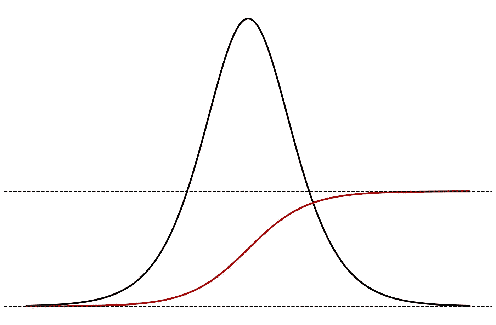
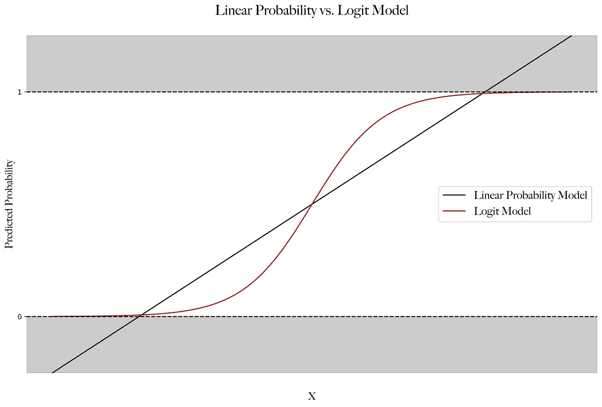
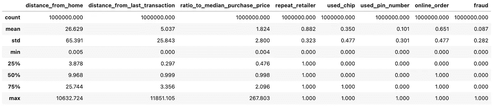
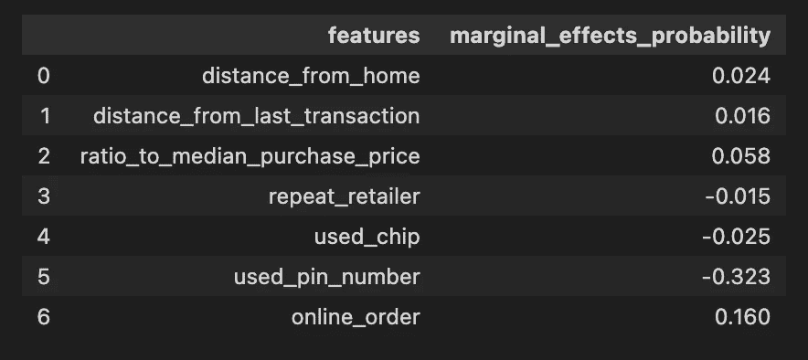
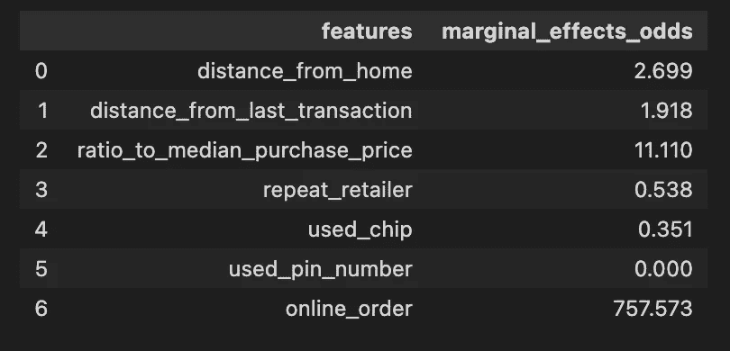

# 逻辑回归中的预测参数:理解一切

> 原文：<https://towardsdatascience.com/predictive-parameters-in-a-logistic-regression-making-sense-of-it-all-476bde9825f3>



所有图片由作者提供

## 获得对超出典型优势比解释的 logit 模型参数的深入理解

L 逻辑回归，也称为 logit 模型，是线性回归的强大替代品，它允许人们对二分、二进制结果(即 0 或 1)进行建模，并在给定观察值的情况下对所述结果发生的概率提供非常准确的预测。logit 模型中的参数估计可以提供关于不同解释变量或特征如何影响模型预测的见解。许多读者可能都熟悉用**优势比**来解释 logit 模型参数(如果不熟悉，不用担心，我会在下面简要介绍)。然而，根据**概率**对这些参数的解释并不简单，但是对如何解释这些参数的充分理解可以提供*巨大的*直觉来解释模型的潜在预测行为。

> 做出预测是非常强大的，但是直观地解释模型的预测组件可以将您的项目分析带到下一个级别。

在这篇文章的结尾，你会以一种新的视角来看待逻辑回归，并且理解如何用惊人的直觉来解释模型参数。本文假设对 logit 模型有一个简单的基础知识，从而以一种可理解的方式更专注于解释模型参数。然而，我们将首先简要讨论 logit 模型背后的理论。然后，我们将深入讨论如何将模型参数解释为边际效应。最后，我们将介绍一个利用以下 [Kaggle 数据集预测欺诈性信用卡交易的实例。](https://www.kaggle.com/datasets/dhanushnarayananr/credit-card-fraud?resource=download)

# 逻辑回归速成班

[Logit 模型](https://en.wikipedia.org/wiki/Logistic_regression)属于更广泛的[广义线性模型](https://en.wikipedia.org/wiki/Generalized_linear_model) (GLMs)家族，简而言之，当感兴趣的结果遵循不同于高斯的基本分布时，允许灵活拟合线性模型，并通过链接函数将线性模型与感兴趣的结果相关联。标准线性回归是一个特例，其中连接函数是单位函数。在二元结果的情况下，线性回归(称为线性概率模型)可以提供小于 0 或大于 1 的预测值(见图 1)。这显然提出了问题，因为概率自然地限制在 0 和 1 之间。然而，GLM 提供了一个方便的框架来解决这个问题！

logit 模型是一个特例，它允许对遵循[伯努利分布](https://en.wikipedia.org/wiki/Bernoulli_distribution)的二元结果进行建模。logit 模型特别有吸引力，因为使用的链接函数(logit 函数)在 0 和 1 之间。因此，如概率空间中所预期的，所有模型预测都被限制在 0 和 1 之间。下面的图 1 提供了一个两变量情况下线性概率模型和逻辑回归模型拟合之间的直观比较。



**图 1**

在数学上，logit 模型的特征是:


其中 ***X*** 表示模型中观察到的解释变量或特征的矩阵，而 *p(X)* 表示 *y* 取值为 1 的概率。给定具有 *y* 分布伯努利的模型设置，logit 模型估计的目标是最大化以下似然函数，这是我们的联合分布:


简而言之，我们的优化问题寻求选择将最大化(2)的(1)中的参数(即 ***β*** )。注意，当估计的概率对于具有 *y* = 1 的个体接近 1 并且对于具有 *y* = 0 的个体接近 0 时，将(2)最大化。为此，可以采用似然函数的对数来获得对数似然，并使用梯度下降或相关算法来解决这个问题。关于逻辑回归的 [wiki 页面](https://en.wikipedia.org/wiki/Logistic_regression)提供了对 logit 模型估计的深入探讨。

# 将 Logit 参数解释为边际效应

边际效应可以被认为是由感兴趣的解释变量(或特征)的变化对结果(或目标)变量产生的平均(或*边际*)效应。这可以类似地概念化如下:在平均(或 ***【边际】*** 观察/个体，改变一个解释变量对结果的**效果**是什么。在我们的二元变量的例子中，这类似于估计改变一个解释变量对观察结果的概率的平均影响。

> ***注意* :** 边际效应必须仅解释为*关联*和**而非**因果关系。因果关系需要额外的识别假设，我在最近的一篇文章中提到了这一点。

通过认识到边际效应仅仅是一个变化率，人们可以立即注意到这归结为对解释变量求导。为了简单起见，我们首先从简单的线性回归开始。假设我们有以下线性回归:


为了找到任何变量的边际效应，我们可以对(3)中感兴趣的 *x* 求导。对任何 *x** 的导数简单来说就是:


注意，在这种情况下，我们有一个恒定的边际效应，这是有意义的，因为线性回归是 y 到 x 的线性投影。

> ***释义:*** 平均起来，x* 增加一个单位就是 ***关联*** 与y 增加一个β*变化。

现在，细心的读者可能会注意到，这个导数对于 logit 模型来说并不是微不足道的(见下文对对数优势和优势比的讨论)。考虑等式 2 中描述的逻辑模型。(1).关于**任意 *x**** 的导数可以利用链和商法则求解。因此，我们可以发现 *x** 对 *y* 发生概率的边际效应如下:


这里我们可以看到边际效应现在是 *x 的*本身的值的函数。这也是有意义的，因为 logit 函数是非线性的(见图 1)。这给了我们评估任何*x*组合的边际效应的能力。然而，如果我们想总结总体边际效应，我们有两个选择:

1.  **计算*平均值*边际效应** —这需要对每个观察值使用(5)计算边际效应，然后计算平均值
2.  **计算平均边际效应****——这需要将所有解释变量的平均值代入(5)并计算边际效应**

**一个比另一个没有立竿见影的好处，两者在不同的背景下提供不同的解释。然而，平均边际效应提供了最清晰的解释，因此将是我们在这篇文章的剩余部分所要处理的。**

> **请注意，所有的计算都可以很容易地扩展到计算边际效应，不仅在解释变量的平均值，但在任何组合的价值。我将把这个留给感兴趣的读者，下一节中提供的代码可以很容易地扩充到这样做(即，将您感兴趣的每个变量的值插入到(5)中，以获得该观察的边际效应)。这可以提供**非常强大的**洞察力，了解预测参数边际效应如何因特定类型的个人/观察而变化！**

**然而，对 logit 模型中平均边际效应的解释如下:**

****平均边际效应:****

> *****释义:*** 平均而言，x*每增加一个单位, ***关联*** 与 y 发生概率的{计算值}个百分点变化。**

## **对数赔率、赔率和赔率比**

**在我们提供一个实际应用的数字示例之前，讨论 logit 模型、对数优势、优势和优势比之间的关系是很重要的。逻辑回归结果用概率来解释是很常见的，这是因为～经过一些代数～我们可以将(1)改写为:**

****

**左手边是对数优势。因此，逻辑回归在对数优势方面具有恒定的边际效应，其中:**

****

**然而，就对数优势而言，边际效应与任何直觉都相去甚远。因此，我们可以通过取(6)的指数来根据几率求解模型:**

****

**然后，通常逻辑回归参数通过计算优势比以优势来解释，其中，使用(8)，我们获得:**

****

**请注意，在二元变量的情况下， *x** 的分母值为 0，因此我们比较等于 1 和等于 0 的指标比率(即男性与女性的比率)。在二元或连续情况下，解释如下:**

> ****解释:**平均而言，x*每增加一个单位,**与将 y 发生的几率乘以{计算值}相关联**。**

**在我看来，对这些的解释并不总是像概率解释那样清晰，除非一个人经常接触和使用对数优势、优势和优势比。然而，(7-9)可以提供对 *x** 分别对对数优势、优势和优势比的边际效应的洞察。**

## **可选:非线性和相互作用**

**假设我们有以下两个信念: *x** 很可能与 *y* 有二次关系，我们相信效果会因*性别*而不同。我们可以扩充我们的 logit 模型，以包括两个额外的工程特性，如下所示:**

****

**其中，我们包含了 *x** 的平方项，并使用虚拟变量 *x** 对该个体是否为男性进行交互。因此，我们对边际效应的解释现在会稍微少一些细微差别。**

> **注意，无论何时我们包含一个交互项，我们都必须注意首先在模型中包含每个未交互的变量*和*(也就是说，也单独包含虚拟的*和*)。否则，相互作用项将吃掉性别对 y 的原始影响，而实际上相互作用项可能是多余的。**

**现在相对于 *x** 对(10)进行微分，我们得到:**

****

**我们现在可以看到，*，*由于非线性，边际效应将根据 *x** 的值以及该个体是男性还是女性而进一步变化。这可以让我们通过计算每个男性和女性的平均边际效应来计算男性和女性的平均边际效应。我们可以在根据概率求解(10)之后，类似地计算(9)中的概率比。这些例子将留给感兴趣的读者，我们到目前为止所涵盖的内容应该足以计算这些。**

# **预测信用卡欺诈的边际效应**

**为了演示我们上面讨论的具体示例，我们将利用以下关于信用卡交易的 [Kaggle 数据集](https://www.kaggle.com/datasets/dhanushnarayananr/credit-card-fraud?resource=download)，目的是建立一个模型来预测交易是否是欺诈性的。数据集在每个事务上都有以下变量:**

*   *****距离 _ 从 _ 家*** (连续)**
*   *****距离 _ 从 _ 最后 _ 事务*** (连续)**
*   *****比率 _ 对 _ 中值 _ 购买 _ 价格*** (连续)**
*   *****【重复 _ 零售商(1/0)*** (二进制)**
*   *****【已用 _ 芯片(1/0)】***(二进制)**
*   *****【used _ pin _ number】******(1/0)***(二进制)**
*   *****【在线 _ 订单】*** ***(1/0)*** (二进制)**
*   ****目标:** ***欺诈******(1/0)***(二进制)**

**首先，让我们导入数据并生成汇总统计数据:**

```
**import pandas as pd

# Import Data
fraud = pd.read_csv("card_transdata.csv")

# Summary Statistics
fraud.describe().round(3)**
```

**从中我们可以获得以下汇总统计数据:**

****

****图 2****

**我们现在将使用 scikit-learn 构建一个逻辑回归模型。假设我们已经完成了训练和验证模型的适当步骤，并且已经确定了适当的模型。我们的最终模型如下:**

```
**from sklearn.compose import ColumnTransformer 
from sklearn.pipeline import Pipeline
from sklearn.preprocessing import StandardScaler
from sklearn.linear_model import LogisticRegression

# Build Model Pipeline
features = list(fraud.iloc[:,0:7].columns)

cont_feat = features[:3] # Continuous Features
bin_feat = features[3:] # Binary Features

standardize = ColumnTransformer([
    ('cont', StandardScaler(), cont_feat), # Standardize continuous features
    ('binary','passthrough',bin_feat)
    ])

pipeline = Pipeline([
    ('standardize',standardize),
    ('logit',LogisticRegression())
    ])

# Fit Pipeline
model = pipeline.fit(fraud[features],fraud['fraud'])

# Pull Final Model
final_mod = model._final_estimator**
```

**我们建立了 logit 模型来预测信用卡交易是否是欺诈性的。现在，让我们转到解释模型参数，以了解模型的内部工作方式以及每个功能在推动预测方面的后续作用。我们将定义一个函数来计算逻辑回归在概率和赔率方面的边际效应:**

```
**import numpy as np
import pandas as pd

def logit_margeff(model, X, features, kind='probability'):

    coef = model.coef_
    intercept = model.intercept_

    if kind == 'probability':

        logodds = intercept+np.dot(X,coef.T)

        marg_effects=[]
        for i in range(coef.size):
            marg_eff = np.mean(coef[0,i]*np.exp(-logodds)/(1+np.exp(-logodds))**2).round(3)
            marg_effects.append(marg_eff)

    elif kind == "odds":

        marg_effects=[]
        for i in range(coef.size):
            marg_eff = (np.exp(coef[0,i])).round(3)
            marg_effects.append(marg_eff)

    marginal_effects = {}
    marginal_effects['features'] = features
    marginal_effects[f'marginal_effects_{kind}'] = marg_effects

    df = pd.DataFrame(marginal_effects)

    return df**
```

> **注意，第 14 行是使用(5)计算的平均边际效应，第 21 行是使用(9)计算的优势比。**

**在我们定义了这个函数之后，我们要做的就是输入我们建立的 logit 模型和特征矩阵。让我们首先用概率来解释输出:**

```
**logit_margeff(final_mod,fraud[features],features,kind='probability')**
```

**其中我们有每个特征的边际效应的相应输出:**

****

**回想一下，我们已经标准化了所有连续特征，因此一个单位的增加对应于一个标准差的增加。我们将解释一个连续特征、*离家距离、*和一个二元特征、*已用个人识别码的估计平均边际效应。***

> ****解释(distance_from_home):** 平均而言，交易发生地距离持卡人家庭住址的距离每增加一个标准差(65.391)，交易欺诈的概率就会增加 2.4 个百分点**。****
> 
> ******解释(used_pin_number):** 平均而言，包括使用 pin 码的信用卡交易与交易欺诈的概率降低 32.3 个百分点**。******

******现在，就几率而言:******

```
******logit_margeff(final_mod,fraud[features],features,kind='odds')******
```

******每个特征具有相应的边际效应输出:******

************

******以赔率表示的相同特征的解释如下:******

> ********解释(distance_from_home):** 平均而言，交易发生地与持卡人家庭地址之间的距离每增加一个标准差(65.391)，交易被欺诈的几率就会增加 2.7 倍。******
> 
> ********解释(used_pin_number):** 平均而言，包括使用 pin 号的信用卡交易与将交易欺诈的几率乘以 0 相关联。换句话说，平均来说，使用 pin 码几乎可以完美地预测交易可能是**而不是**欺诈。******

# ******讨论******

******我希望这篇文章有助于明确如何从 logit 模型参数中提取出 ***非常有意义的见解*** 。很明显，根据概率的边际效应解释提供了大量的直觉和在 logit 模型框架下预测机制的可解释性。一般来说，这些参数解释了模型如何进行预测，以及解释了目标和特征之间的关联。然而，在额外的识别假设下，我们可以做出更有力的声明，将模型参数解释为某些特征和目标之间的因果关系(我在之前的[帖子](https://medium.com/r?url=https%3A%2F%2Ftowardsdatascience.com%2Fcontrolling-for-x-9cb51652f7ad)中简要讨论了这一点)。我希望这篇文章增加了你对逻辑回归的了解和欣赏！******

## ******资料组******

******可在 Kaggle 上获得:[信用卡欺诈](https://www.kaggle.com/datasets/dhanushnarayananr/credit-card-fraud?resource=download) ( **许可证:** CC0:公共领域)******

## ******相关职位******

*   ******[控制“X”](https://medium.com/r?url=https%3A%2F%2Ftowardsdatascience.com%2Fcontrolling-for-x-9cb51652f7ad)******

******感谢你阅读我的帖子！我在 Medium 上的帖子试图利用 ***计量经济学*** *和* ***统计/机器学习*** *技术来探索现实世界和理论应用。此外，我试图通过理论和模拟提供某些方法论的理论基础。最重要的是，我写作是为了学习！我希望把复杂的话题变得更容易理解。如果你喜欢这个帖子，请考虑* [***跟我上媒***](https://medium.com/@jakepenzak) *！*******