# 提督+ AWS ECS Fargate + GitHub 动作让无服务器数据流变得像。巴拉圭

> 原文：<https://towardsdatascience.com/prefect-aws-ecs-fargate-github-actions-make-serverless-dataflows-as-easy-as-py-f6025335effc>

## 用 Python 和 Prefect 在 AWS 上编排无服务器


一只名叫马文的蓝鸭子将无服务器容器运送到云中——图片由作者提供

mazon 弹性集装箱服务(ECS)是一个管理任何规模的集装箱的平台。简单的任务定义 API 允许您单独启动容器化的工作负载，也可以作为连续运行的服务启动。您可以将您的容器部署到一个无服务器的 Fargate 数据平面、一个自我管理的 EC2 实例集群，甚至您的本地数据中心( *ECS Anywhere* )。

尽管这个容器编排平台有很多好处，但是围绕它构建一个可靠的工程流程(*包括自动化部署、版本控制、调度或重试*)可能会很有挑战性。类似地，CloudWatch 控制台也没有为可观察性提供很好的 UX。这就是 Prefect 和 GitHub 的作用所在。

这篇文章将深入使用 GitHub Actions 工作流部署一个完美的代理到 AWS ECS Fargate。它将演示如何将任何 Python 脚本转换成在 AWS 云中的无服务器容器上运行的工作流。

```
**Table of contents**· [What is Prefect?](#0119)· [Demo: Deploy a Prefect agent to AWS ECS](#db7b)
  ∘ [Create a new repository from the DataflowOps template](#3039)
  ∘ [Create an API Key in Prefect Cloud](#095b)
  ∘ [Install Prefect locally](#b510)
  ∘ [Authenticate your terminal with Prefect Cloud & run first flow](#f944)
  ∘ [Retrieve the PREFECT_API_URL and PREFECT_API_KEY](#754f)
  ∘ [Set the PREFECT_API_URL and PREFECT_API_KEY repository secrets](#50f6)
  ∘ [Start the GitHub Actions workflow to deploy your Prefect agent](#7dd2)
  ∘ [Inspect the output and download run artifacts](#0178)
  ∘ [Video walkthrough as a recap](#a257)· [Resources created with CloudFormation and GitHub Actions workflow](#8bdd)
  ∘ [Validate  deployments](#56b7)
  ∘ [Inspect and optionally modify Block values](#18b1) · [Deploy flows using ECSTask infrastructure blocks](#8d94)
· [Delete all resources](#6255)
· [Next steps](#f738)
```

# 什么是提督？

对于任何数据栈来说，Prefect 都是一个全局协调平面。它允许您设计、构建、调度和监控您的数据流，涵盖从可观察性到编排的[全部范围](https://www.prefect.io/guide/blog/the-dataflow-coordination-spectrum/)。下面是一个简单的提督流程示例:

使用一个[CLI 命令](https://medium.com/the-prefect-blog/declarative-dataflow-deployments-with-prefect-make-ci-cd-a-breeze-fe77bdbb58d4)，您可以构建一个可以在任何[基础设施](https://docs.prefect.io/concepts/infrastructure/)上运行的调度部署——本地流程、Docker 容器、Kubernetes 作业或 ECS Fargate 上的无服务器任务。在这篇文章中，我们将关注后者。但是在我们能够部署流之前，我们需要一个能够轮询预定运行的代理。我们将在接下来讨论这个问题。

# 演示:将一个提督代理部署到 AWS ECS Fargate

要在 AWS 上运行的无服务器容器中启动一个完全代理，您需要创建一个 ECS 任务定义。然后，您可以使用该任务定义来启动 ECS 服务，这将确保代理容器全天候可靠运行。

为了使本教程易于理解，我们将跳过为任务角色和执行角色配置 IAM 权限以及将依赖项打包到 Amazon ECR 映像的细节。所有这些信息都可以在 GitHub 资源库 [dataflow-ops](https://github.com/anna-geller/dataflow-ops) 的基础设施文件夹中找到。您可以使用现有的 Cloudformation 模板，也可以根据自己的需要进行调整。

## 从 DataflowOps 模板创建新的存储库

使用存储库模板 [dataflow-ops](https://github.com/anna-geller/dataflow-ops) 创建您自己的存储库:

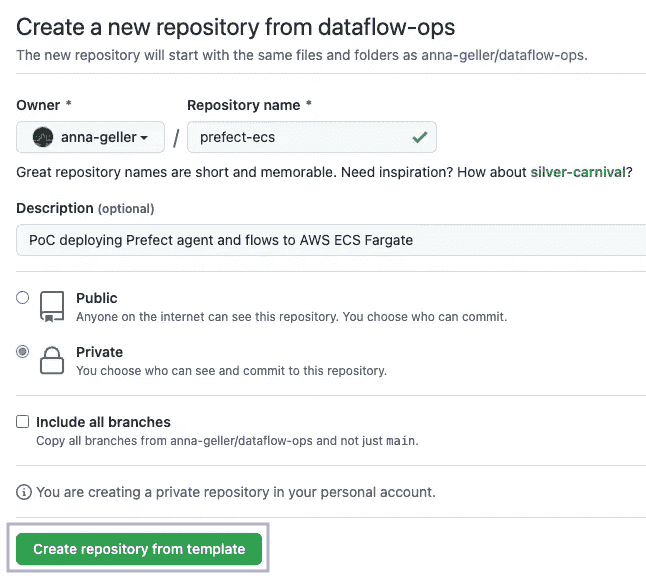

从模板创建新的存储库—按作者分类的图像

## 在完美云中创建 API 密钥

为了开始使用提督，[注册了](https://docs.prefect.io/ui/cloud/)[提督云](https://app.prefect.cloud/)的免费等级。一旦登录，[创建一个工作空间](https://app.prefect.cloud/workspaces/create)和一个 [API 键](https://app.prefect.cloud/my/api-keys)。

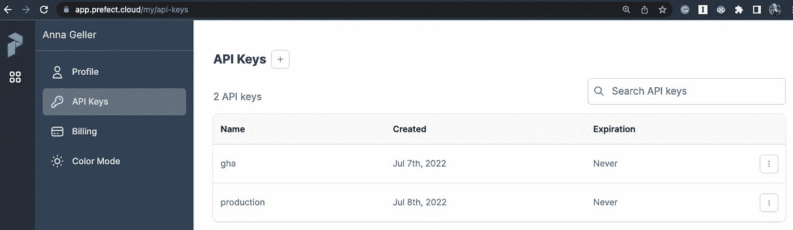

在 Prefect Cloud 中创建 API 密钥—图片由作者提供

创建工作空间和 API 键对于 AWS ECS Fargate 设置非常重要。

## 在本地安装提督

开始使用 Prefect 的最简单方法是在本地安装它:

```
pip install prefect
```

## 使用 Prefect Cloud 验证您的终端并运行您的第一个流程

运行下面的命令来验证与您的完美云工作区的本地终端会话:

```
prefect cloud login
```

系统会提示您输入之前创建的 API 密钥，并选择您的工作区。然后，您可以像运行任何其他 Python 脚本一样运行示例流:

```
python maintenance_flow.py
```

当您切换到您浏览器时，您现在应该看到流程在您的完美 UI 中运行:

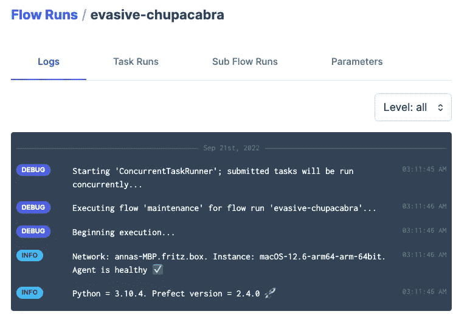

完美的云显示来自本地执行流程的日志——图片由作者提供

你可能会问自己，这怎么可能？提督怎么知道你从你的终端运行这个流？那就是提督 API 的*魔法*！您不必创建任何 Dag 或学习任何定制词汇来跟踪工作流执行。完美的流程就像涡轮增压的 Python 脚本。无论您是在本地运行它们，还是从 AWS 上的无服务器容器运行它们，Prefect 都会确保您的执行元数据保持可观察性。

## 检索提督 API URL 和提督 API KEY

现在您的终端已经过身份验证，运行:

```
prefect config view
```

您应该得到类似于以下内容的输出:

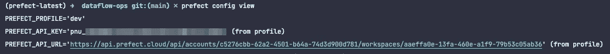

从终端输出中检索 API URL 和 API 键——按作者排序的图像

## 将提督 _API_URL 和提督 _API_KEY 设置为存储库机密

使用终端输出中显示的**提督 _API_URL** 和**提督 _API_KEY** 的值来配置存储库机密，如下图所示。

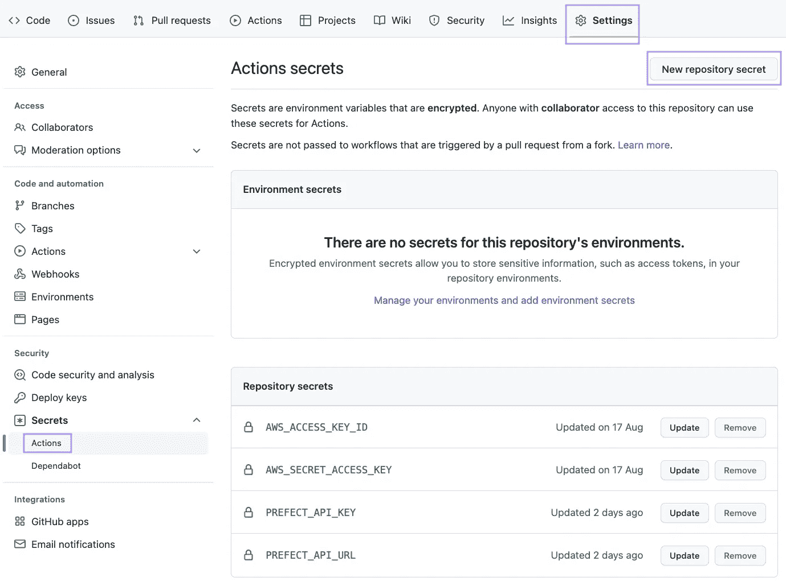

配置存储库机密-按作者排列的图像

添加您的 IAM 用户的 AWS 访问密钥作为存储库机密: [AWS_ACCESS_KEY](https://docs.aws.amazon.com/powershell/latest/userguide/pstools-appendix-sign-up.html) 和 [AWS_SECRET_ACCESS_KEY](https://docs.aws.amazon.com/powershell/latest/userguide/pstools-appendix-sign-up.html) 。

## 启动 GitHub 操作工作流来部署您的提督代理

现在，您的 GitHub 存储库秘密指向您的 AWS 和 Prefect Cloud 帐户，您已经准备好触发[GitHub 操作工作流](https://github.com/anna-geller/dataflow-ops/blob/main/.github/workflows/ecs_prefect_agent.yml):

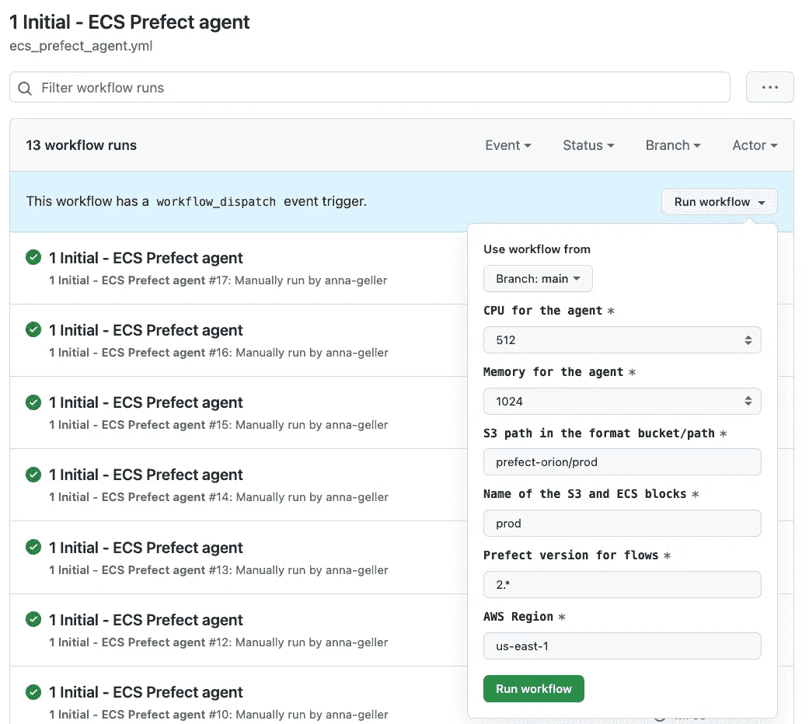

启动 GitHub 操作工作流部署提督代理并流向 AWS ECS 和 S3 —图片由作者提供

在运行此工作流之前，您可以配置提督版本、AWS 区域、CPU 和内存分配，以及您的[提督存储](https://docs.prefect.io/concepts/storage/)和[基础结构块](https://docs.prefect.io/concepts/infrastructure/)的名称。

## 检查输出并下载运行工件

一旦此工作流成功完成，您应该会看到类似的图表和输出:

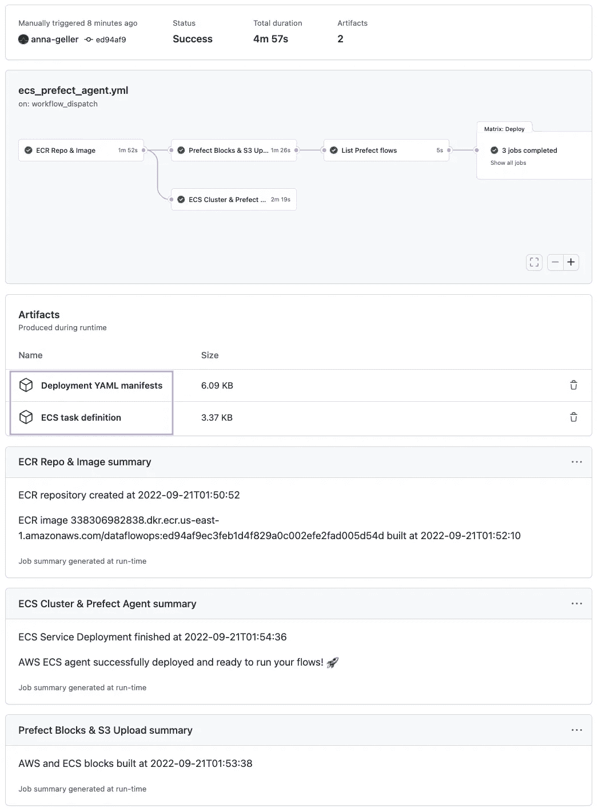

工作流摘要-作者提供的图片

您可以下载用于部署 ECS 代理的 ECS 任务定义以及流部署的 YAML 清单，如上图中突出显示的部分所示。这些工件有助于可审计性和故障排除。

## 视频演练作为回顾

以下链接以视频格式演示了相同的工作流程:

# 使用 CloudFormation 和 GitHub 操作工作流创建的资源

您可以检查代理的 CloudFormation 堆栈的输出，以验证创建了哪些资源。

类似地，如果您检查 Prefect Cloud UI，您会发现与我们之前提到的相同的维护流程。该流程计划每 10 秒运行一次，以演示使用 Prefect 的计划工作流的功能。如果您检查该流的任何运行日志，您将看到它运行在部署到 AWS EC2 的无服务器容器上:

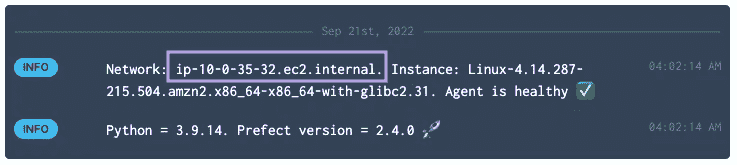

流量运行日志—作者提供的图片

## 验证部署

您可以从完美的 UI 中验证部署:

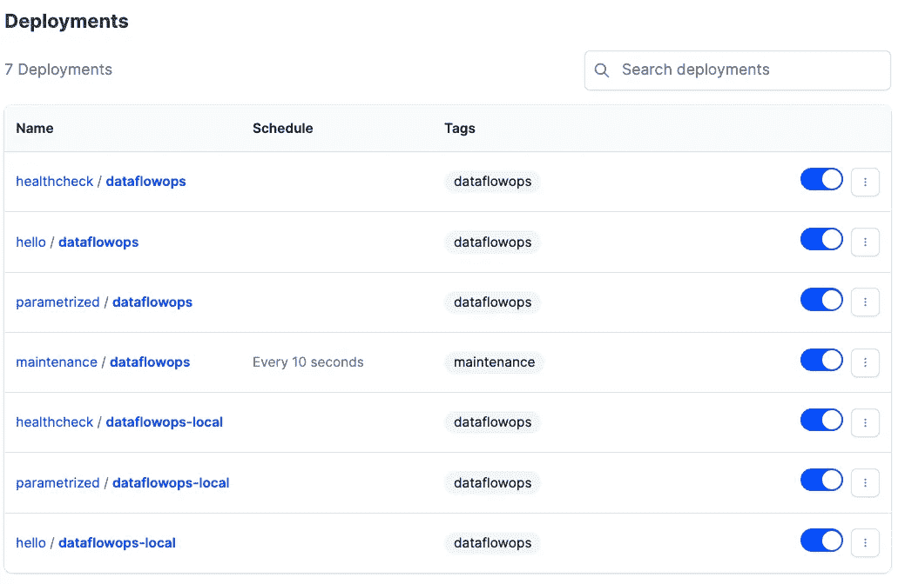

完美 UI 中的部署页面—作者提供的图片

上图显示了本演示中设置的两种部署:

1.  名为`dataflowops-local`的部署被配置为直接在代理的本地进程中运行，也就是说，在与您的完美代理相同的容器中运行。
2.  相比之下，名为`dataflowops`的部署被配置为作为独立的 ECS 任务运行。

第二个选项带来了更高的延迟(*必须首先提供无服务器容器*),但在大规模应用时可能会更好。当您达到一定数量的工作流时，您可能会遇到在同一个容器中运行所有内容的极限。`ECSTask`基础设施块允许您在自己的无服务器容器中运行每个流，而不占用代理进程的资源(*在自己的 ECS 任务*中运行)。

## 检查并可选地修改块值

访问“blocks”页面时，您可以查看作为本演示的一部分而创建的所有块。您应该会看到 S3、AWS 凭证和 ECS 任务块。您可以直接从 UI 更改值，如 CPU、内存或环境变量，而不必重新部署代码。

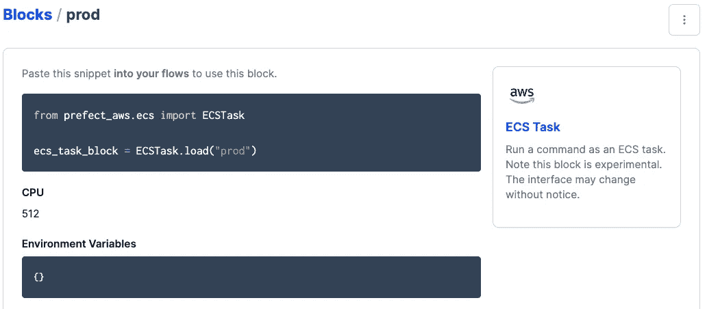

从完美用户界面修改 ECSTask 块值—按作者排序的图像

如果你想创建一个新的`ECSTask`块，你可以这样做:
a)从 UI，如上图所示，
b)从 Python 代码，如[这个代码片段](https://github.com/anna-geller/dataflow-ops/blob/main/blocks/ecs_task.py)所示。

# 使用 ECSTask 基础架构块部署流

要在您的部署中使用`ECSTask`块，您需要做的就是将`ecs-task/block_name`指定为您的基础设施块(`-ib`)。这里有一个例子:

```
prefect deployment build flows/healthcheck.py:healthcheck -n prod -q prod -a -sb s3/prod -ib ecs-task/prod
```

您不仅可以从 CI/CD 中这样做，甚至可以从您的本地终端中这样做。关于话语的[完美部署常见问题解答](https://discourse.prefect.io/t/prefect-deployments-faq/1467)提供了许多关于如何使用各种部署用例的有用资源。

# 删除所有资源

要删除作为本演示的一部分创建的所有 AWS 资源，请运行以下工作流。这将删除两个云形成堆栈。

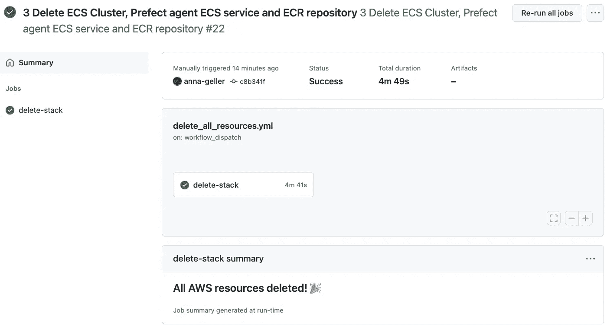

删除云信息资源，包括 ECR 存储库和 ECS 集群——作者图片

# 后续步骤

这篇文章介绍了如何开始使用 Prefect 和 ECS Fargate，以及如何将代理和流程部署为自动化的 GitHub Actions 工作流。如果你对这个设置有疑问，你可以直接在 [dataflowops repository](https://github.com/anna-geller/dataflow-ops/issues/new) 上提交一个 GitHub 问题，或者通过 [Prefect Discourse](https://discourse.prefect.io/) 或 [Slack](https://prefect.io/slack) 提问。

感谢阅读！