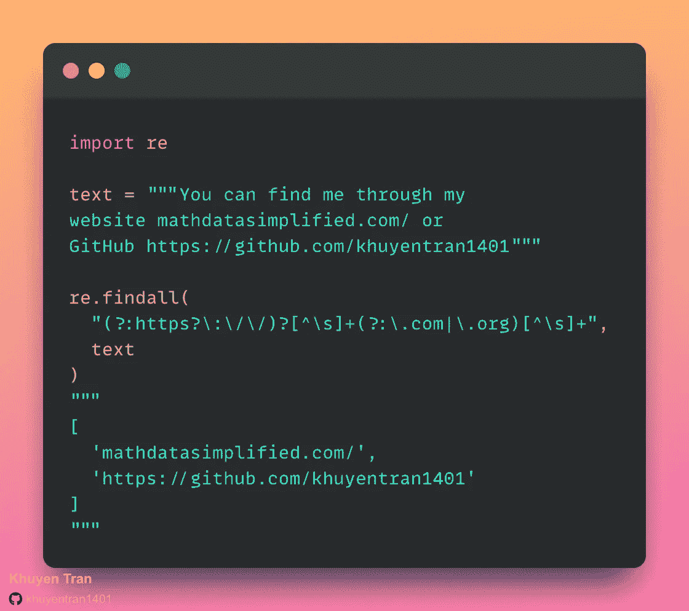
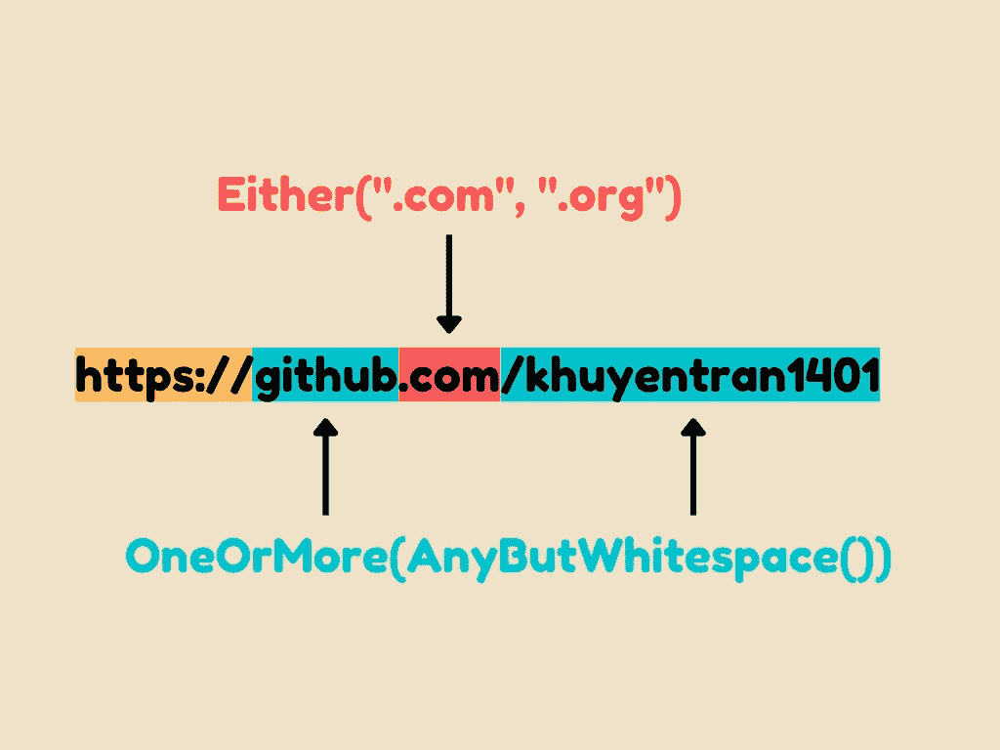
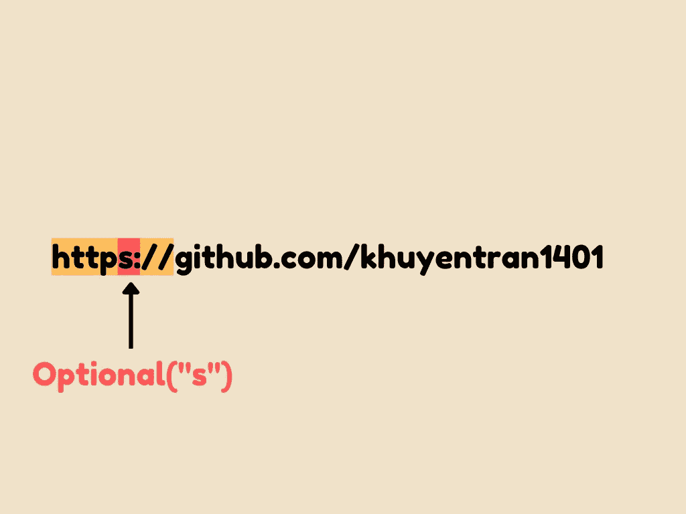
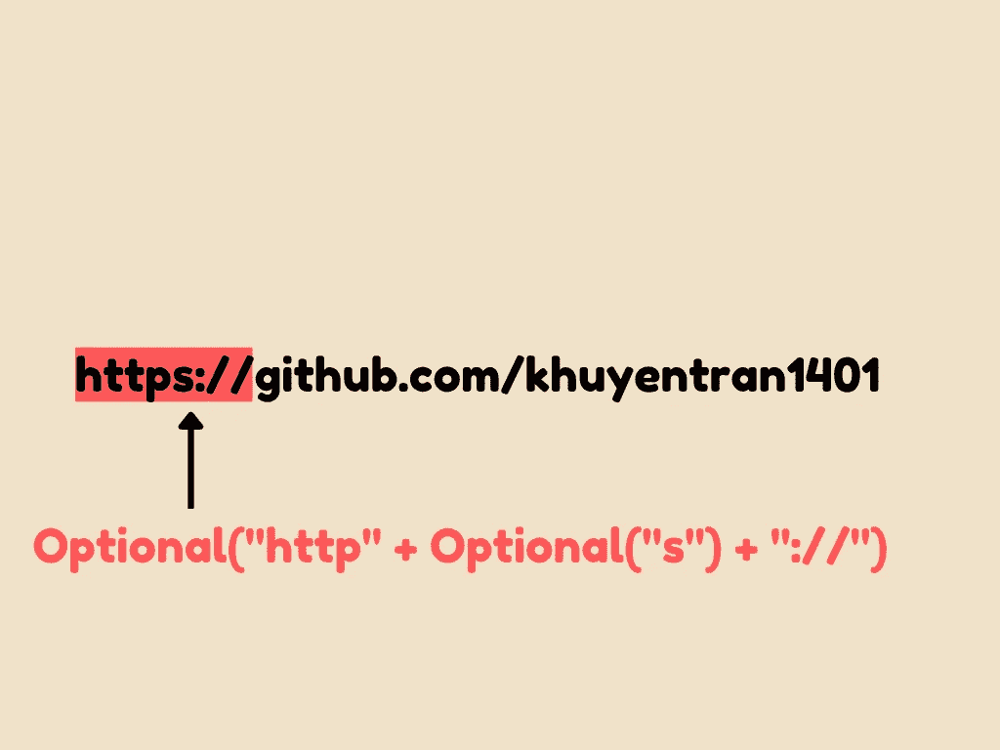
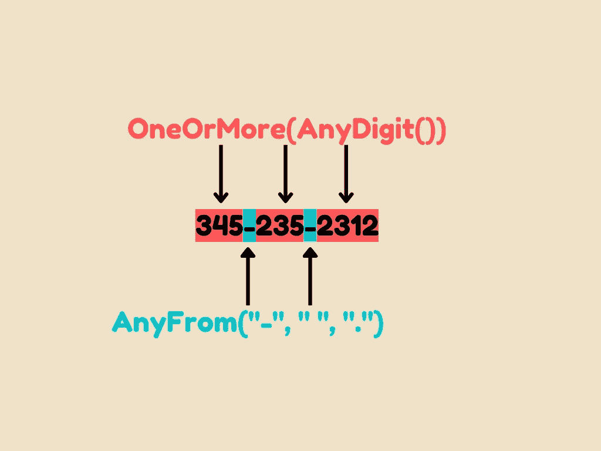
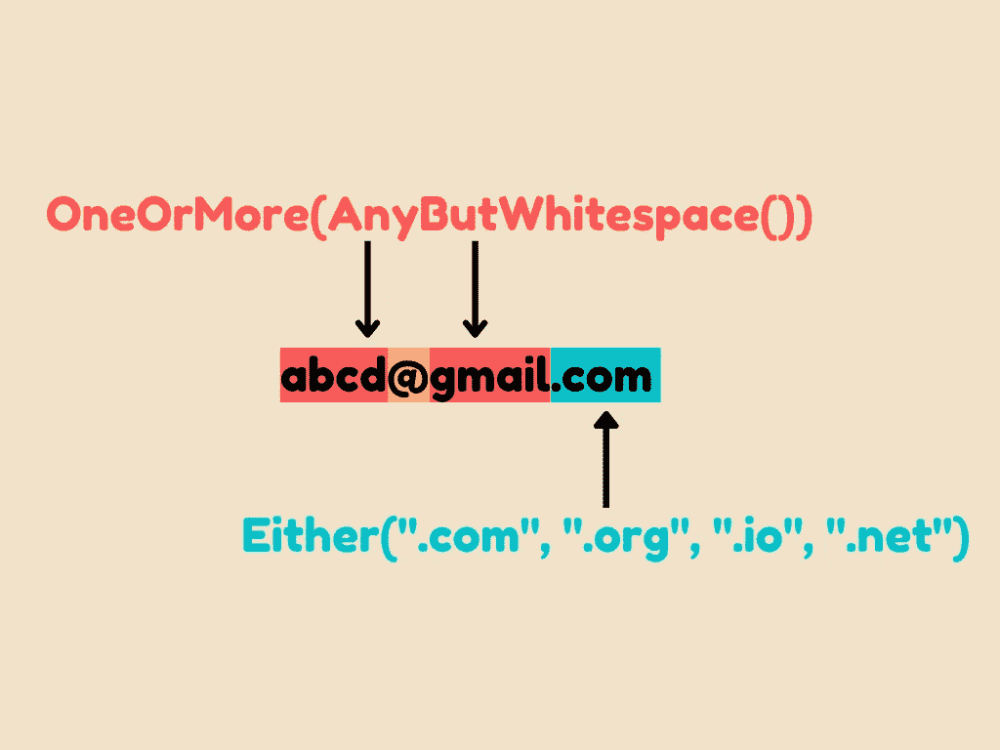

# PRegEx:用 Python 编写人类可读的正则表达式

> 原文：<https://towardsdatascience.com/pregex-write-human-readable-regular-expressions-in-python-9c87d1b1335>

## 用人类可读的语法创建复杂的正则表达式

# 动机

假设你试图找到一个文本中的所有网址。每个 URL 都必须:

*   以`http://`或`https://`或 URL 的域开始
*   以`.com`或`.org`结尾

您最终可能会编写一个复杂的正则表达式(RegEx)，如下所示:



作者图片

这个正则表达式很难阅读和创建。有没有一种方法可以让你更容易地编写一个人类可读的正则表达式？

这时 PRegEx 就派上用场了。

# 什么是 PRegEx？

PRegEx 是一个 Python 包，它允许你以一种更加人性化的方式构建正则表达式模式。

要安装 [PRegEx](https://github.com/manoss96/pregex) ，输入:

```
pip install pregex
```

本文中使用的 PRegEx 版本是 2.0.1:

```
pip install pregex==2.0.1
```

为了学习如何使用 PRegEx，让我们从一些例子开始。

# 捕获 URL

## 获取一个简单的 URL

首先，我们将尝试使用 PRegEx 获取文本中的 URL。

输出:

```
['[https://github.com/khuyentran1401'](https://github.com/khuyentran1401')]
```

在上面的代码中，我们使用:

*   `AnyButWhitespace()`匹配除空白字符以外的任何字符
*   `OneOrMore()`一次或多次匹配提供的模式。
*   `Either`匹配任何一个提供的模式。

具体来说，

*   `OneOrMore(AnyButWhitespace())`匹配一个或多个非空白字符。
*   `Either(".com", ".org)`匹配`.com`或`.org`。



## HTTP 或 HTTPS

有时候，一个 URL 可能使用方案`http`而不是`https`。让我们通过使用`Optional()`使字符`s`可选:



作者图片

输出:

```
['http://github.com/khuyentran1401']
```

## 不使用方案匹配 URL

文本中的一些 URL 可能不包含类似于`https`或`http`的方案。用`Optional`让方案可选。



作者图片

为了使我们的代码更具可读性，我们将把 PRegrex 的方法赋给一个变量。

输出:

```
['mathdatasimplified.com/', 'https://github.com/khuyentran1401']
```

让我们来看看基本的正则表达式模式:

```
(?:https?\:\/\/)?[^\s]+(?:\.com|\.org)[^\s]+
```

我们刚刚避免了用一些人类可读的代码行创建复杂的模式！

# 捕获时间

`AnyDigit()`匹配任何数字字符。让我们用它来匹配文本中的时间。

```
['6:0']
```

现在，我们只匹配`:`两边的一个数字。让我们把`AddLeastOnce()`放在`AnyDigit()`的周围，这样就更一般了:


```
['6:00']
```

# 获取电话号码

电话号码的常见格式有:

```
##########
###-###-####
### ### ####
###.###.####
```

这些格式的数字之间要么有标点符号，要么没有。我们可以使用`AnyFrom("-", " ", ".")`来匹配`-`、`.`或空格。



我们还使用`Optional()`使标点符号可选。

```
['3452352312', '345-235-2312', '345 235 2312', '345.235.2312']
```

# 捕获电子邮件地址

现在，让我们利用我们目前所学的知识，从文本中获取一个电子邮件地址。



输出:

```
['abcd@gmail.com']
```

# 下一步

本文概述了如何使用 PRegEx 来匹配复杂的模式，而无需花费大量时间。

我鼓励您查看 [PRegEx 的文档](https://pregex.readthedocs.io/en/latest/docstring/pregex.html#)以了解其他有用的方法。

随意发挥，并在这里叉这篇文章的源代码:

[](https://github.com/khuyentran1401/Data-science/blob/master/productive_tools/pregex.ipynb) [## 数据科学/pregex . ipynb at master khuyentran 1401/数据科学

### 收集有用的数据科学主题以及代码和文章-Data-science/pregex . ipynb at master…

github.com](https://github.com/khuyentran1401/Data-science/blob/master/productive_tools/pregex.ipynb) 

我喜欢写一些基本的数据科学概念，并尝试不同的数据科学工具。你可以在 LinkedIn 和 Twitter 上与我联系。

如果你想查看我写的所有文章的代码，请点击这里。在 Medium 上关注我，了解我的最新数据科学文章，例如:

[](/write-clean-python-code-using-pipes-1239a0f3abf5) [## 使用管道编写干净的 Python 代码

### 一种简洁明了的处理迭代的方法

towardsdatascience.com](/write-clean-python-code-using-pipes-1239a0f3abf5) [](https://medium.com/the-prefect-blog/sending-slack-notifications-in-python-with-prefect-840a895f81c) [## 使用提督在 Python 中发送松弛通知

### 通过松弛通知了解 Python 代码的进度

medium.com](https://medium.com/the-prefect-blog/sending-slack-notifications-in-python-with-prefect-840a895f81c) [](/3-tools-to-track-and-visualize-the-execution-of-your-python-code-666a153e435e) [## 3 个跟踪和可视化 Python 代码执行的工具

towardsdatascience.com](/3-tools-to-track-and-visualize-the-execution-of-your-python-code-666a153e435e) [](/validate-your-pandas-dataframe-with-pandera-2995910e564) [## 用 Pandera 验证你的熊猫数据框架

### 确保您的数据符合您的期望

towardsdatascience.com](/validate-your-pandas-dataframe-with-pandera-2995910e564)