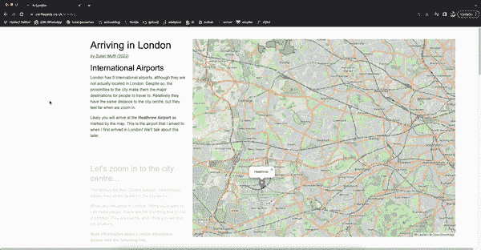
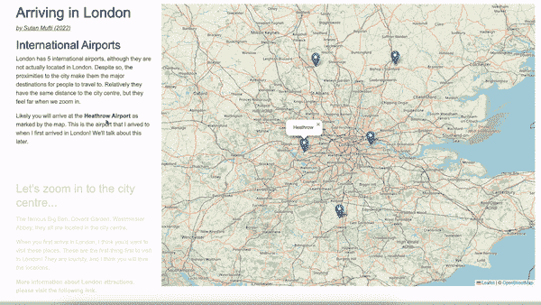
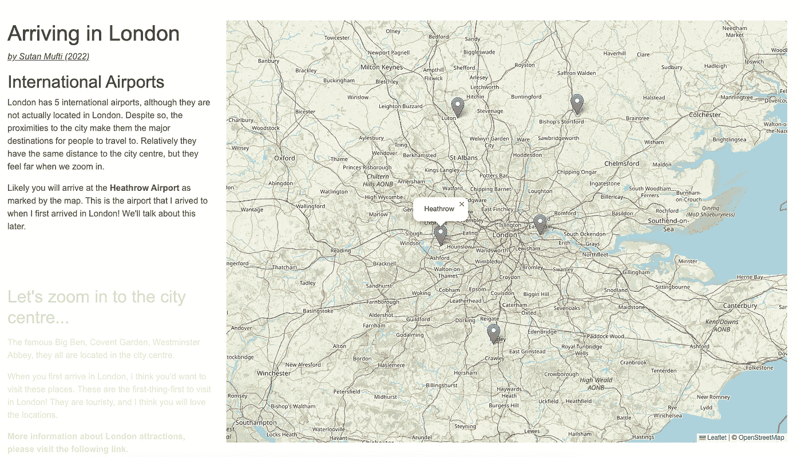
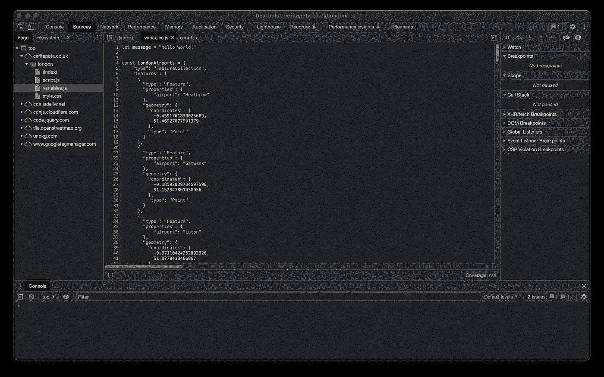

# 通过滚动交互式显示空间数据

> 原文：<https://towardsdatascience.com/presenting-spatial-data-interactively-by-scrolling-502df345dea6>



来源:作者，2022

## 通过交互式地图讲述故事和见解

# 关于这篇文章

这篇文章是关于我制作的一个故事地图:

*   [现场演示](https://ceritapeta.co.uk/london/)
*   [github 回购](https://github.com/sutanmufti/London-Arrival)

…这篇文章讲述了我是如何构建它的。



演示(来源:作者，2022)

# 介绍

制图员的产品是地图。我们使用 shapefiles(这是空间数据存储的遗产)、地理数据库、geojsons 和许多形式的空间数据，并使用 GIS 根据它们制作地图。然而，这些地图通常是 JPEGs、PNG 或 PDF 文档，不具有交互性。在大多数情况下，是的，这是可行的，但是我喜欢在不需要做太多工作的情况下讲述和被讲述故事。事半功倍，怎么才能被讲故事？

然后遇到了[库斯伯特·周](https://medium.com/u/bff07afa23c2?source=post_page-----502df345dea6--------------------------------)关于 D3.js 的文章，D3.js 是一个 javascript 库，用来操作 DOM(文档对象模型)中的元素和 svg。人们使用 D3.js 来呈现数据，其中 Chow 做了精彩的演示，扩展了 Jim Vallandingham 的文章。看他下面的文章。

[](/how-i-created-an-interactive-scrolling-visualisation-with-d3-js-and-how-you-can-too-e116372e2c73)  

然后我想到:我们也可以用地图来制作这个！使用 javascript 可以实现滚动和交互显示数据的想法。这篇文章讲述了我是如何做到的。

您可以在此处找到现场演示:

  

该项目(作者，2022)

## 大量

所有数据和地图资源都是开源的(openstreetmap)。以下是我用过的堆栈

*   jquery 和 d3.js:文档操作
*   fleet . js:交互式网络地图

# 一般想法

我写的是空间数据科学，在接下来的文章中我写了一篇关于表示空间数据的文章。本文就是论证。

[](/spatial-data-science-javascript-python-60464cbe908d)  

基本上它的工作原理是:

*   使用 Python 获取和分析空间数据。
*   用 HTML 来布局文档，用 CSS 来美化事物；呈现内容。
*   使用 Javacript 使事物互动。在这种情况下，当我们滚动时改变地图。

此外(不在本文/项目中)，我们可以做一些关于数据源的事情:

*   在 postgresql + postgis 数据库服务器中存储数据。
*   Apache Airflow 来编排/自动获取数据并填充数据库服务器。
*   使用 geoserver 作为后端地图服务器。

也许是为了将来的项目。

# 它是如何工作的

我就不赘述细节了，不然这篇文章会变得很长。我将解释的是开发人员…开发的高层次想法。

大部分代码来自 Jim 关于 javascript scroller 的文章。基于这段代码的演示是[这里有](http://vallandingham.me/scroll_demo/)。

[](https://vallandingham.me/scroller.html)  

但是在这篇文章中，我讨论的是我的演示。我将根据这些组件对其进行分解:

*   布局
*   节和滚动
*   数据存储

## 布局-修复地图

布局基于 [Bootstrap 5 css 模块](https://getbootstrap.com/docs/5.0/getting-started/introduction/)。这是一个很常见的快速美化 HTML 的模块。它提供了最基本的 UI 组件。

具体来说，我做了两列，如下图所示。灰色是主体的背景，蓝色是边距，白色/浅色是列的背景。


布局(来源:作者，2022)

```
<div class="container">
  <div class="row">
    <div class="col-4">
      the first column, text contents / stories
    </div>
    <div class="col-8">
      the second wider column where the map is going to live
    </div>
  </div>
</div>
```

我希望卷轴与故事/文本交互，而不是与地图交互。这意味着无论我们滚动多少，地图都需要固定。这就是 css 的用武之地。所有忽略滚动的东西都需要固定位置，所以我创建了`stay` css 类。

```
.stay {
    position: fixed;
    height: 100%;
    width: 100%
}
```

然后贴在地图会住的`div`里。

```
<div class="col-8">
      <!-- the second wider column where the map is going to live. -->
      <div class="stay" id="mapcontainer">
          <div id="map" ></div>
      </div>

</div>
```

这样，地图`div`就固定了。

## 地图和 Javascript

随着地图`div`的创建，我们现在可以导入`leaflet` javascript 库来制作我们的地图。`Leaflet`提供我需要的地图交互工具。这是一个绝妙的包装；如此简单却有效！

```
var map = L.map('map').setView([51.505, -0.09], 13);

L.tileLayer('https://tile.openstreetmap.org/{z}/{x}/{y}.png', {
    attribution: '&copy; <a href="https://www.openstreetmap.org/copyright">OpenStreetMap</a> contributors'
}).addTo(map);

L.marker([51.5, -0.09]).addTo(map)
    .bindPopup('A pretty CSS3 popup.<br> Easily customizable.')
    .openPopup();
```

# 节和滚动

就像 Chow 和 Jim 的结构一样，到达伦敦的页面也由 id 为`step`的部分组成。

```
<div class="col-4  full ">
  <section class="step ">
  my first section
  </section>
  <section class="step ">
  the second section 
  </section>
  <section class="step ">
  and so on
  </section>
  <section class="step ">
  ...
  </section>
</div> 
```

## 滚动互动

定义步骤后，文档需要跟踪用户的滚动活动。下面的代码在用户每次滚动时调用`trackPosition`函数。

```
d3.select(window)
    .on("scroll.scroller", trackPosition);
```

`trackPosition`如下:

```
 // sectionsArray are the div step (s) from the HTML that we previously defined
let activeSection;
let previousSection;
const trackPosition = ()=>{
    let pos = window.pageYOffset - 140;
    let sectionIndex = d3.bisect(sectionPositions, pos);
    sectionIndex = Math.min(sections.size() - 1, sectionIndex);
    activeIndex = sectionIndex

    if (sectionsArray[sectionIndex] !== activeSection){
        previousSection = activeSection
        activeSection = sectionsArray[sectionIndex] 

        d3.select(`#${activeSection}`)
            .transition()
            .style("opacity", "1");
        d3.select(`#${previousSection}`)
            .transition()
            .style('opacity', '0.2')
            ;

        positionMap(sectionIndex)
    } 
}
```

请注意`positionMap`功能！这个函数是地图改变的原因。

```
// positionMap: changes the map based on the active step

const positionMap = (sectionIndex) =>{
    if (sectionIndex === 0){
        map.flyTo([51.505404,-0.118658], 9,) // zoom in to coords
        airportLayer.addTo(map) // leaflet layer
        elizaebthLine_st.remove() // leaflet layer
        popupairport() // popup the map
        attractions.remove() // leaflet layer
    }
    if (sectionIndex === 1){

        map.flyTo([51.509687,-0.115464], 13,) // zoom in to coords

        attractions.addTo(map) // leaflet layer
        attractions.eachLayer((l)=>{l.openTooltip()}) // open the tooltips

    // add another if and manually code the interactivity. Read the leaflet documentation.

}
```

# 数据存储

在无模式数据结构中，基本上是一个包含 JSON 对象的数组，我们可以添加任意属性。我在数据结构文章中演示了这一点。

[](/spatial-data-science-data-structures-a00c484b8a00)  

我们可以这样定义一个最小的空间数据:

```
// minimum spatial data
const berlin = {
"city": "berlin", 
"country": "germany",
"location" : {
    "type" : "Point",
    "coordinates": [52.507650, 13.410298]
    }
}
```

但是我局限于 GeoJSON 空间数据规范，所以空间数据看起来像这样:

```
const attractions_geojson = {
    "type": "FeatureCollection",
    "features": [
      {
        // minimum spatial data but with geojson spec
        "type": "Feature",
        "properties": {
          "name": "big ben"
        },
        "geometry": {
          "coordinates": [
            -0.12466064329075266,
            51.50067738052945
          ],
          "type": "Point"
        }
      },
      {
        // minimum spatial data but with geojson spec
        "type": "Feature",
        "properties": {
          "name": "leicester square"
        },
        "geometry": {
          "coordinates": [
            -0.13047682089788282,
            51.51079955591317
          ],
          "type": "Point"
        }
      }
    ]
  }
```

在上面的代码中，包含我们的层的`attractions_geojson.features`由两层组成:大本钟和莱斯特广场。`geojson.features`是所有最小空间数据的列表。

当您在浏览器中加载[演示链接](https://ceritapeta.co.uk/london/)时，您可以在`variable.js`中查看空间数据。



# 结论

使用 Javascript 和 HTML，我们可以使我们的数据具有交互性。作为一名制图员，这意味着我可以使我的地图互动和响应！棘手的是将空间数据存储为 javascript 文件，而不是传统的 shapefile 和 geojson 对象。