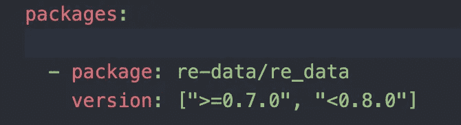
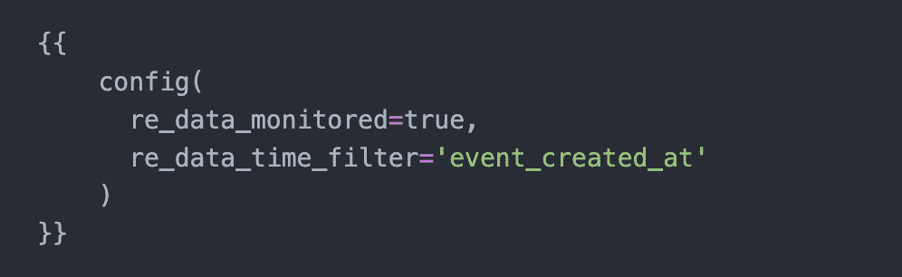
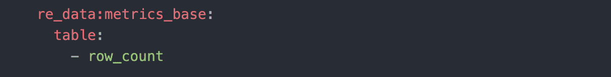
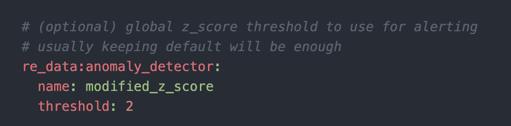
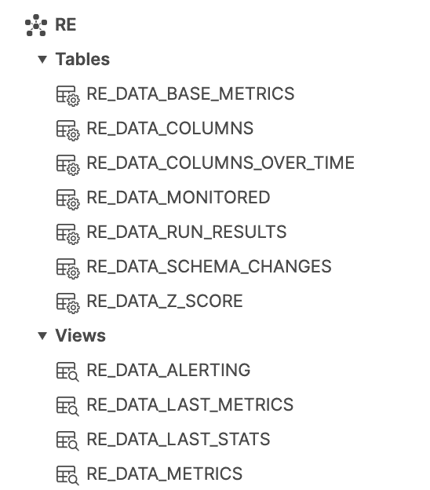
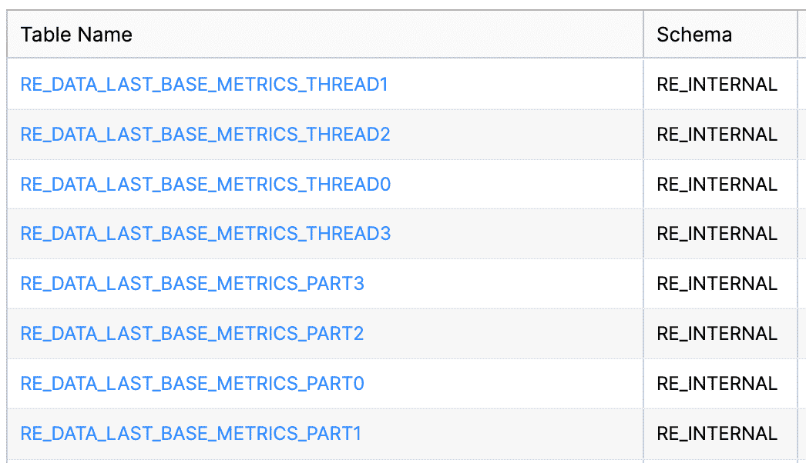
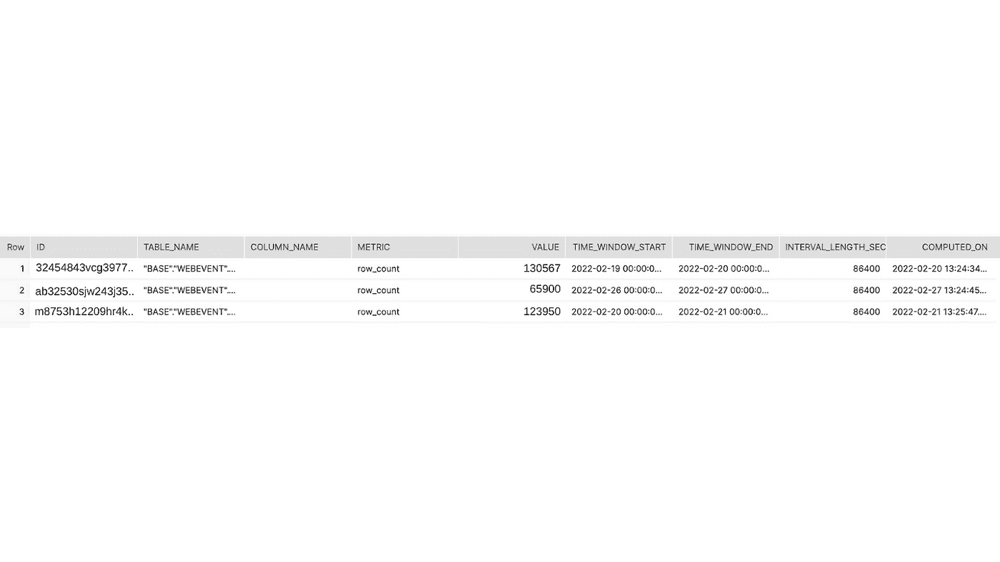
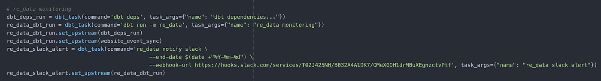

# 使用这个免费的 dbt 软件包防止数据丢失

> 原文：<https://towardsdatascience.com/prevent-data-loss-with-this-free-dbt-package-a676c2e59c97>

## 因为你的数据价值百万…


米克·豪普特在 [Unsplash](https://unsplash.com/s/photos/tree-trunk?utm_source=unsplash&utm_medium=referral&utm_content=creditCopyText) 上的照片

您是否曾经在编写数据模型或完成深入分析时发现您的数据有问题？这可能是作为数据专业人员最糟糕的发现之一。你花了这么多时间来确保你的数据是可靠的，进行了多重质量检查，结果却出了问题。

我去过那里。几周前，我验证了自己编写的数据模型，却发现我们最重要的表之一的数据量非常少。经过深入挖掘，我们发现这个问题已经持续了**整整 2 周**。

幸运的是，我们能够修复它，但是 2 周的数据丢失太多了。尤其是当您是一家希望利用您的数据实现重大增长的小型企业时。

因此，作为一名数据问题解决者，我开始寻找一种解决方案，当我们的日常数据量出现差异时，这种解决方案将有助于提醒我们。

令人惊讶的是，这是一个很难找到的东西。我们使用 Fivetran 将我们的数据接收到雪花数据仓库中，但这两者都没有针对数据量的警报。他们甚至没有让我编写自己的自动化脚本的选项！

# 什么是 re_data？

在经历了很多挫折之后，我偶然发现了 [re_data](https://www.getre.io/) ，“一个开源的& dbt 原生的，为现代数据栈构建的数据可靠性框架”。这个框架允许您创建警报、跟踪指标和存储 dbt 测试历史。

对于表，这些指标包括数据量和新鲜度。

对于列，这些度量包括聚合、空值、标准偏差、长度等等。

您可以跟踪许多指标来创建更可靠的数据生态系统。

re_data 的工作原理是检测数据中的趋势(并向您发出警报)以及发送清除、规范化和验证数据的宏。通过向您的 YAML 文件添加一些配置细节，您可以轻松地设置它来跟踪您的仓库中的数据。

在本文中，我将教您如何建立一个警报系统，当您的表的数据量远远超出正常水平时，该系统会向您发送一条 Slack 消息。

# 下载 re_data

无论您是否是 dbt 用户，re_data 都在他们的[文档](https://docs.getre.io/latest/docs/getting_started/installation/for_dbt_users)中包含了安装说明。幸运的是，这一步非常简单。如果您是 dbt 用户，只需将包名添加到 packages.yml 文件中，然后运行`dbt deps`。

您的文件应该如下所示。



作者图片

您还需要使用命令 pip install re-data 安装 Python 包，这样您就可以利用 Slack 通知特性和 re_data UI。

# 设置您的监控配置

re_data 文档概述了如何利用 dbt 原生配置来使用它们的框架。对于本教程，我只监视一个表中的`row_count`。我编写的代码将放在 dbt SQL 文件的开头，该文件对应于您希望监视的表。

为了设置这个，我设置`re_data_monitored`为真。然后，我选择了我想要使用的时间过滤器。确保时间过滤器是指定表中行创建时间的列。我的情况是`event_created_at`。

例如，如果你在监控网站的点击率，你的`time_filter`栏将会是你的网站发生点击的时间。



作者图片

现在，让我们导航到`dbt_project.yml`文件。我们不是在单个模型的配置中编写`re_data_metrics`块，而是将它添加到这里。这将使得`row_coun` t 为我们添加 re_data 配置的每个模型进行计算。如果您想要为多个模型计算它们，那么您还可以向这个 dbt 项目文件中添加其他指标。



作者图片

您还可以在 dbt_project.yml 文件中指定特定的 z 得分，您希望 re_data 使用该 z 得分来确定指标是否远离其基线。默认的 z 值为 3，但您可以根据表的性质随时更改该值。就我个人而言，我把我的改为 2，因为我宁愿在开始时被提醒太多，而不是不够。如果你发现它过于频繁地提醒你，你可以随时调整。



作者图片

现在，我们可以将相同的配置对象添加到任何模型的相应 SQL 文件的顶部，并将计算 row_count。对于所有这些模型，当 z 分数超过 2 时，将创建警报。

# 数据仓库配置

现在是运行框架的时候了！您可以使用以下命令运行它:

`dbt run — m re_data`

请注意，这个命令与您用来运行已经创建的任何其他 dbt 数据模型的命令相同。

运行该命令后，我希望您导航到您的数据仓库，并查看是否有任何更改。您会注意到 re_data 创建了两个模式， **RE** 和 **RE_INTERNAL** 。

请记住，这些模式将在 profiles.yml 文件中定义的数据库中创建。在我的概要文件中，我有两个目标——一个用于开发，一个用于生产，每个目标都有不同的已定义数据库。根据您的目标，这些模式将填充到数据库中。

例如，当我在本地开发 dbt 模型时，我的目标在我的`profiles.yml`中被设置为 dev。因此，在我的开发数据库中创建了两个 re_data 模式。然而，在生产中，我的目标设置为我的生产数据库。因此，当我在生产中运行相同的代码时，模式是在我的生产数据库中创建的。

你可以在 dbt 的[文档](https://docs.getdbt.com/dbt-cli/configure-your-profile)中了解更多关于设置个人资料的信息。

默认数据仓库中的 RE 模式包含从包中的宏创建的各种表。我们需要注意的是 **RE_DATA_BASE_METRICS** 和 **RE_DATA_Z_SCORE** 。



作者图片

您还可以看到它创建了 4 个不同的视图。我们将需要查看 **RE_DATA_ALERTING** 视图。这包含根据我们提供的 YAML 配置创建的任何警报。

至于 **RE_INTERNAL** 模式，您不会看到它。这是宏内部使用的，为您提供我们刚刚讨论过的漂亮的表和视图。



作者图片

# 已创建 re _ 数据表

## **re_data_base_metrics**

让我们看看“re_data_base_metrics”表。您可以看到，根据您运行模型的时间和我们在`dbt_profiles.yml`中定义的“metrics_base ”,有不同的行。因为我们只在那个文件中定义了`row_count`，所以我们只会在 metric 列中看到`row_count`。



作者图片

**re_data_z_score**

接下来，我们来看“re_data_z_score”表。当您尝试计算的指标至少有 2 行数据时，您将在该表中看到至少一行。如果只有一行，则无法计算 z 值。请记住，这也意味着您使用该工具的时间越长，它就越有效。如果你回想一下大数定律，随着样本量的增加，平均值越来越接近真实的总体平均值。


作者图片

如果您还记得，我们在 YAML 文件中将 z 值设置为 2。因为此表中的 z 值小于 2，所以不会触发任何警报。如果此 z 值大于 2，将触发警报，并在“re_data_alerting”表中创建一行。

# 在生产中运行 re_data

现在，你可能想知道，我如何在生产中运行它？你可能想让这个提醒自动工作，而不需要太多思考。您不希望每天都在本地运行这个命令。

就我个人而言，我使用[perfect](/tired-of-airflow-try-this-c51ec26cd29d)来部署我的 dbt 数据模型，所以我也选择使用它来部署 re_data。因为它是如何构建的，所以您会希望像运行 dbt 模型一样运行它。对你来说，这可能是与气流或 Dagster，但对我来说，这是与提督。

我在 Python 文件中使用 dbt_tasks 来运行我所有的 dbt 模型。我有一个装满这些任务的文件，然后将它复制到 Docker 容器中。对于 re_data，我简单地创建了一个新的 dbt_task 来运行模型。

`dbt_task(command=’dbt run -m re_data’, task_args={“name”: “re_data monitoring”})`

我还确保为 web events 表设置了上游依赖项，因为这是我使用 re_data 监视的表。如果您使用它来监视所有的表，请确保为所有的数据同步设置了一个依赖项。

# 设置松弛命令

re_data 刚刚发布了一项功能，允许您发送带有警告更新的 Slack 消息。这是自治数据环境的理想选择，在这种环境中，您只想关注出错的事情。

我尝试设置我的数据环境，这样我就不必每天监控它。当事情出错时，*那是我希望得到通知的*。re_data 就是这么做的。

运行该命令之前，请确保您拥有最新版本的包。这是一个相当新的版本，所以如果您没有使用最新的版本，该命令将会失败。

请务必在更改版本后运行`dbt deps`,否则该命令将再次失败。

re_data Slack 命令如下所示:

```
re_data notify slack \-- end-date $(date +”%Y-%m-%d”) \--webhook-url {webhook_url}
```

如果希望每天都生成时差通知，可以不指定开始日期。相反，只需以正确的格式将您的结束日期指定为当前日期。`$(date +”%Y-%m-%d”)`在运行 Bash 命令时就是这么做的。

然后，您需要包含一个 webhook-url，它可以在 [Slack](https://api.slack.com/messaging/webhooks) 上生成。这些 webhooks 是专门为您希望警报发送到的通道而创建的。

在我的完美环境中，我在 dbt shell 任务中包含了这个命令。它利用 dbt 凭证，所以您不希望只使用普通的 shell 任务。


作者图片

同样，如果您使用的是 Prefect，请确保设置了上游依赖项。对于 slack 命令，我设置了 re_data dbt 运行的依赖项。



作者图片

如果您在本地运行这个命令，而不是部署到生产环境，那么 re_data 有一个 UI 可以充分利用。您将运行一个类似于 Slack 命令的命令，但是这将生成 UI。

`re_data overview generate — end-date $(date +”%Y-%m-%d”) — interval days:1`

然后，只要您已经使用这个包生成了一些模型，您就可以“服务”UI 了。

`re_data overview serve`

这将在您的浏览器中打开，并允许您查看您的所有警报以及您的模型的沿袭。

# 结论

现在，我们有了一个配备有用警报系统的数据环境。我们不必生活在恐惧中，担心我们的数据在源头可能会出问题。这种数据量警报是确保一切按预期运行的好方法。

不要坐等数据管道出错。在遇到问题之前，现在*实施类似 dbt 包的检查和平衡。相信我，你不会想像我一样丢失两周的数据。数据实际上等于金钱和重要的见解！不惜一切代价保护它。*

re_data 最好的一点就是它是免费的！您不必在已经很贵的数据堆栈上支付额外的费用。您可以充分利用 dbt 的所有惊人特性。

欲了解更多关于工具和软件包的建议，以改善您的现代数据堆栈，[订阅](https://madisonmae.substack.com/)我的时事通讯。