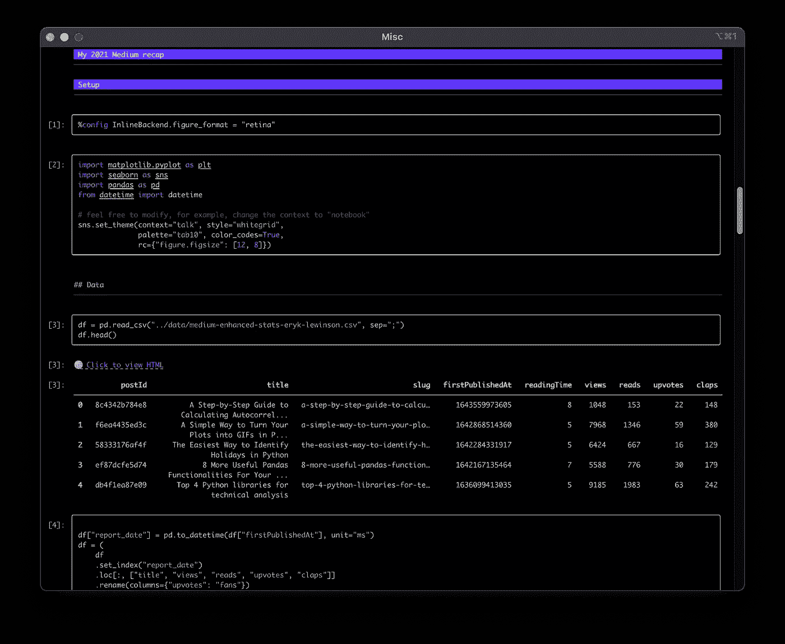
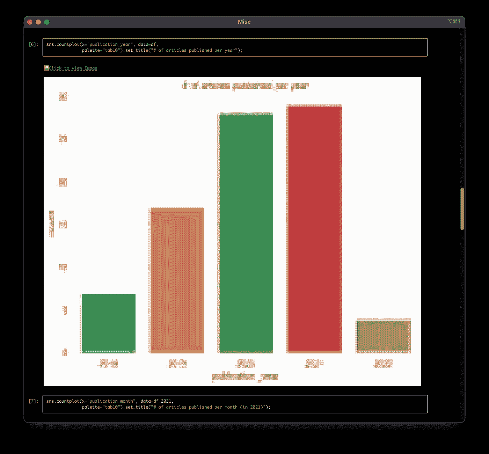
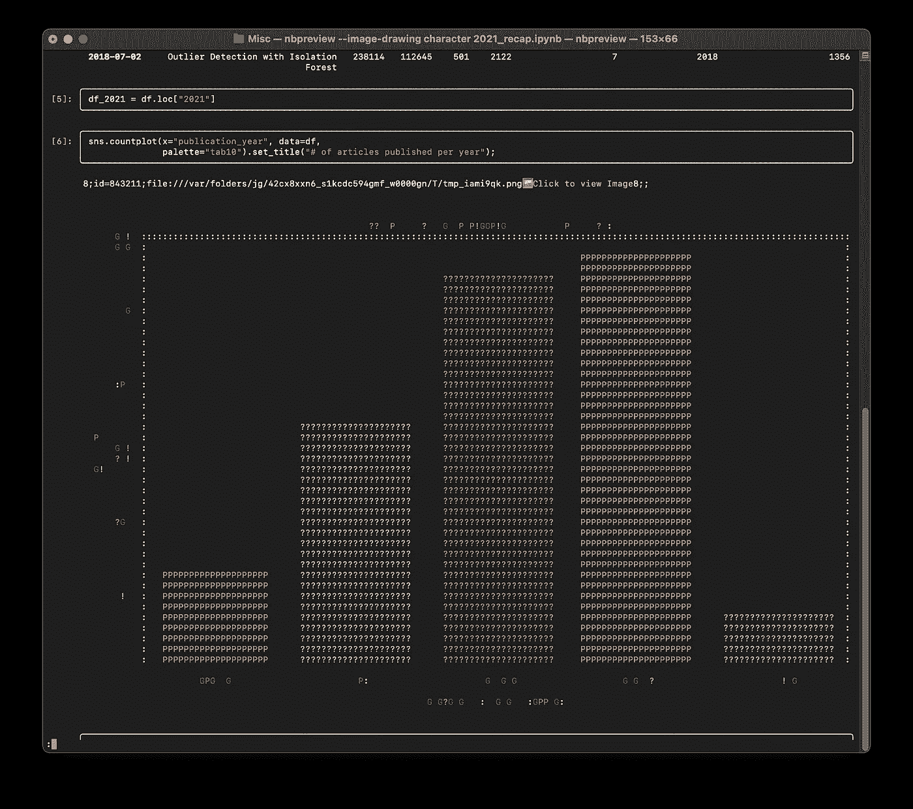
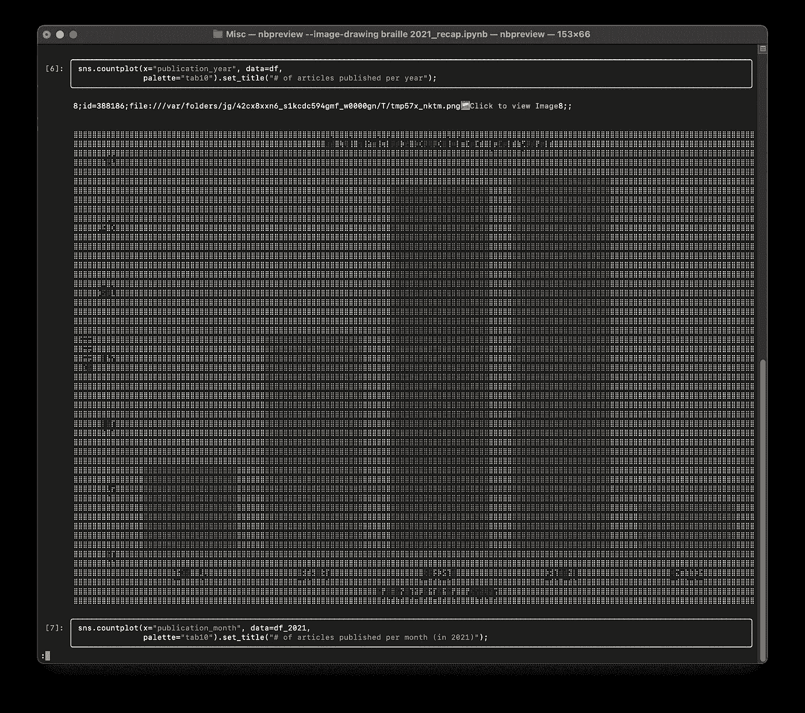
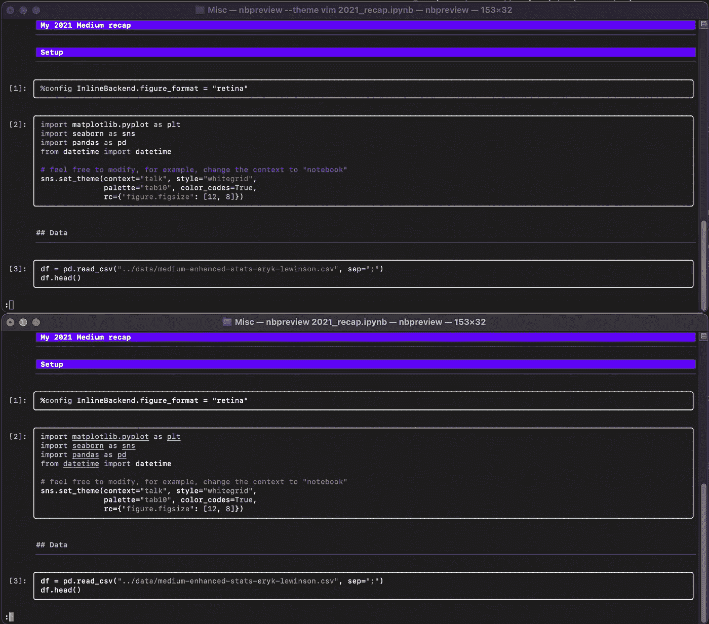
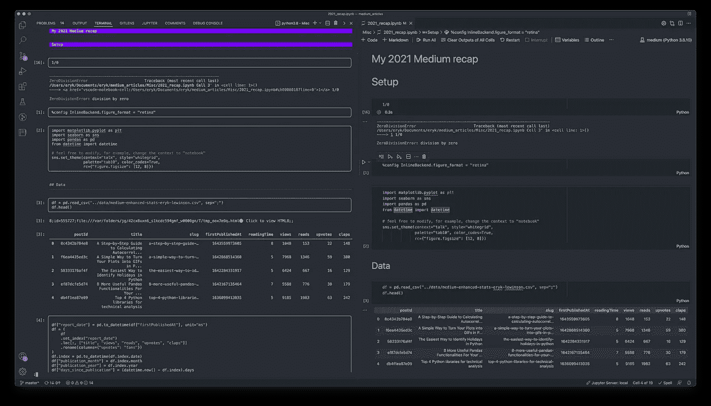

# 使用 nbpreview 在终端中预览您的 Jupyter 笔记本

> 原文：<https://towardsdatascience.com/preview-your-jupyter-notebooks-in-the-terminal-with-nbpreview-87601a92d0d1>


来源: [pixabay](https://pixabay.com/pl/vectors/grzmotn%c4%85%c4%87-terminal-linux-uniksa-161382/)

## 有了 nbpreview，你不用离开终端就可以阅读和检查笔记本！

有很多程序员爱从终端做尽可能多的事情。虽然我不一定是其中之一，但直接从命令行执行一些操作通常非常方便。说到终端——谁没有花大量的时间调整终端的外观(主题、字体等)。)…

今天，我偶然发现了一个 Python 库，它增加了一项我们现在可以从终端轻松完成的功能——预览 Jupyter 笔记本。这包括细胞的输出——包括数据帧和图表！

让我来告诉你如何用`nbpreview`来完成这一切。

# nbpreview

nbpreview 是一个 CLI 和库，允许我们在终端中渲染 Jupyter 笔记本。它的工作方式有点像。ipynb 文件。

该库提供以下功能:

*   代码单元格的语法突出显示
*   它不仅检测 Python，还检测像 Julia 这样的语言
*   渲染降价、数据帧、LaTeX
*   绘制图像
*   解析 HTML
*   呈现 stderr 输出和回溯

# 装置

我们可以通过运行以下命令来安装该库:

```
pip install nbpreview
```

# 动手示例

在这篇文章中，我们将预览一个来自[我的 2021 年回顾文章](https://eryk-lewinson.medium.com/my-2021-medium-recap-650326b2832a)的笔记本。我选择它是因为它包含一些我们想要预览的元素，例如，数据帧输出、绘图等。

使用`nbpreview`非常简单和直观。我们可以通过在终端中运行以下命令来预览笔记本:

```
nbpreview file_name.ipynb
```

的路径。ipynb 文件是`nbpreview`命令唯一需要的参数。自然地，有相当多的可选参数可供我们选择。但是首先，让我们看看默认输出是什么样的。

下面我们可以看到笔记本是如何在终端中渲染的。我们已经看到数据帧被很好地可视化了，就像在普通的 Jupyter 笔记本中一样。



作者图片

此外，像数据帧和图像这样的输出会得到一个可点击的链接，您可以通过该链接查看原始输出。

就我个人而言，我对这些图像非常好奇。下面，您可以看到条形图是如何在终端中呈现的。



作者图片

默认情况下，图像绘制为块。我们也可以使用另外两个设置之一:`character`或`braille`。

```
nbpreview --image-drawing character file_name.ipynb
```



作者图片

```
nbpreview --image-drawing braille file_name.ipynb
```



作者图片

对于代码突出显示，我们可以从几十个可用的主题中进行选择(包括一些流行的主题，如 emacs、vim、dracula)。我们可以通过使用`theme`参数来改变主题:

```
nbpreview --theme vim file_name.ipynb
```

在下图中，你可以看到相同的笔记本渲染了 vim 主题(上图)和默认的深色主题(下图)。



作者图片

最后，让我们一起来看看终端中由 VS 代码呈现的笔记本:



作者图片

虽然不仔细看可能不清楚，但我们故意抛出了一个错误(除以零)，以表明 stderr 也被`nbpreview`捕获。

要了解更多关于`nbpreview`提供的功能，我们可以通过运行以下命令阅读所有选项的文档:

```
nbpreview --help
```

或者在这里参考可用的[文档。](https://nbpreview.readthedocs.io/en/latest/usage.html)

# 外卖食品

*   `nbpreview`是一个 Python 库/CLI，允许在终端中预览 Jupyter 笔记本，
*   它处理渲染数据帧输出、图像、降价、LaTeX 等。

一如既往，我们欢迎任何建设性的反馈。你可以在推特上或者评论里联系我。

喜欢这篇文章吗？成为一个媒介成员，通过无限制的阅读继续学习。如果你使用[这个链接](https://eryk-lewinson.medium.com/membership)成为会员，你将支持我，不需要你额外付费。提前感谢，再见！

您可能还会对以下内容感兴趣:

[](/pur-the-easiest-way-to-keep-your-requirements-file-up-to-date-22d835279348)  [](/why-is-the-log-uniform-distribution-useful-for-hyperparameter-tuning-63c8d331698)  [](/a-simple-way-to-turn-your-plots-into-gifs-in-python-f6ea4435ed3c)  

# 参考

*   [https://nbpreview.readthedocs.io/en/latest/index.html](https://nbpreview.readthedocs.io/en/latest/index.html)