# 价格弹性:探索数据分析后在 Azure ML Designer 中建模

> 原文：<https://towardsdatascience.com/price-elasticity-modeling-in-azure-ml-designer-after-the-exploration-data-analysis-4f36961ce571>

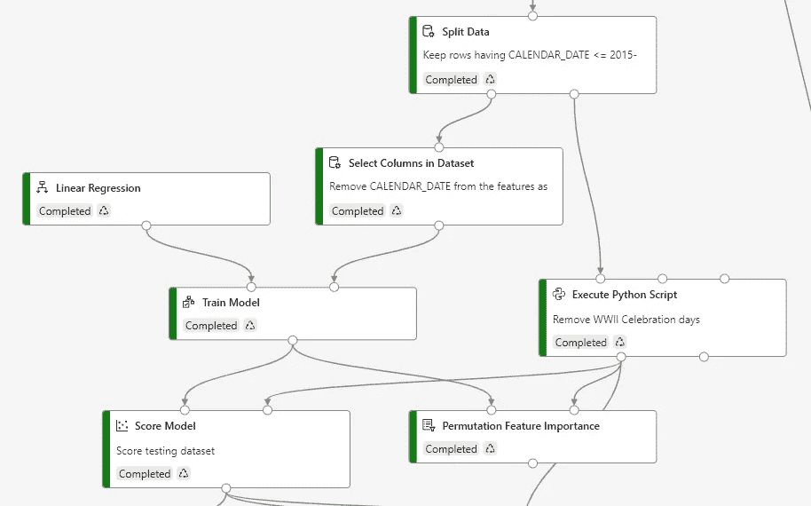

(作者)

# 价格弹性:探索数据分析后在 Azure ML Designer 中建模

## 找出 EDA 对机器学习模型性能的好处

在我之前关于价格弹性的帖子中，我展示了在创建机器学习模型之前使用 *Exploration Data Analysis* 分析数据集的重要性，以便更好地了解您的数据优势和劣势:

 [## 价格弹性:首先是数据理解和数据探索！

### 本文将展示 R 中用于更好的数据探索的工具。

towardsdatascience.com](/price-elasticity-data-understanding-and-data-exploration-first-of-all-ae4661da2ecb) 

当时我用 Azure Machine Learning Studio Classic 作为*无代码/低代码*平台，快速训练线性模型。现在，当你试图登录 Azure ML Studio Classic 时，会弹出一条消息，宣布它将于 2024 年 8 月 31 日退役:

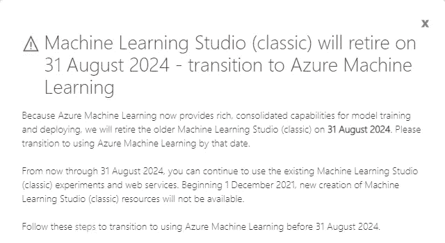

图 1 — Azure ML Studio 经典退休(作者)

这就是为什么在这篇文章中，我将使用全新的 **Azure 机器学习设计器**(可以认为是旧 Azure ML Studio Classic 的 2.0 版本)来应用上面博客文章中显示的所有清理和转换操作。

我还将向您展示在 Designer 中实现残差图(用于检查回归模型的健康状况)的方法。我在我的这篇博文中详细探讨了它们:

 [## 如何更好地评估回归的拟合优度

### 检查剩余健康状况的指标和图表

medium.com](https://medium.com/microsoftazure/how-to-better-evaluate-the-goodness-of-fit-of-regressions-990dbf1c0091) 

非常感谢我的同事 Greta Villa，他帮助我实现了这篇文章中的大部分 Python 代码。

让我们开始实施我们的价格弹性实验。

我想当然地认为读者了解 Azure ML Designer 的基础知识。粗略地说，那些熟悉旧的 Azure ML Studio 经典平台的人会发现自己非常容易使用该设计器。为了完整起见，[这是一个简单的教程](https://docs.microsoft.com/en-us/azure/machine-learning/tutorial-designer-automobile-price-train-score)，向初级读者介绍设计师。

价格弹性实验的源数据集取自微软关于 Azure ML Studio Classic 的教程，每个人都可以免费获得。它们与前一篇博文中分享的数据集相同。为了方便起见，[这是在执行完所有源数据集之间的连接操作后，到数据集的链接](https://1drv.ms/u/s!AtgrmeCPhKh7kP5EjOgd-EhXbdSlwA)。

## 在设计器中设置实验

请继续[在 Azure ML 中将源数据集](https://docs.microsoft.com/en-us/azure/machine-learning/how-to-connect-data-ui#create-datasets)注册为 *TabularDataset* 。将其作为源数据模块导入到设计器画布中。然后添加一个“执行 R 脚本”模块，以便应用 R 代码从数据集中删除重复的数据:

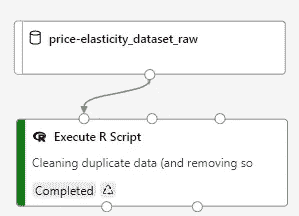

图 2 —添加源数据和执行 R 脚本模块(作者)

然后在上面提到的模块中输入下面的 R 脚本，您也可以在之前的博客文章的“异常值处理”一节中找到:

此时，我们可以尝试绘制每个产品组合的价格-数量散点图。如果你还记得以前的帖子，有 4 个产品组合由数字 ID (SELL_ID)标识:

*   单个汉堡(1070)
*   汉堡+可乐(2051)
*   汉堡+柠檬水(2052)
*   汉堡+可乐+咖啡(2053)

价格-数量点是通过取与数据集中每个价格相关的所有数量的平均值来计算的，不考虑所有其他变量。对于数量的每个平均值，也使用学生的 t 分布计算置信区间(详见参考文献)。因此，首先在您的实验中添加一个“执行 Python 脚本”:

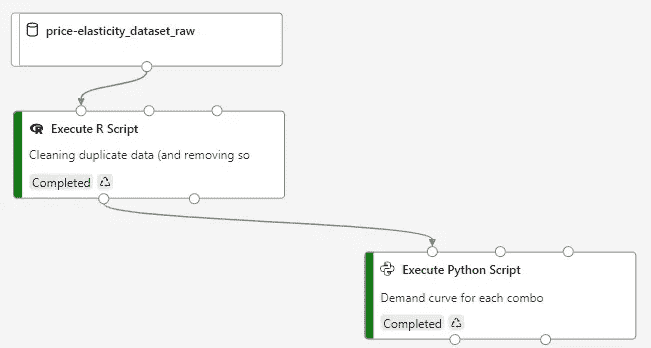

图 3-添加执行 Python 脚本以绘制需求曲线(作者)

然后将以下 Python 脚本添加到模块中:

正如您可能已经注意到的，在设计器中，不可能像 Azure ML Studio Classic 那样，直接从“执行 Python 脚本”或“执行 R 脚本”模块的输出引脚显示代码生成的图。

> 出于这个原因，为了查看生成的图像，您必须使用 Azure ML Python SDK 来引用与模块执行相关联的运行，然后使用一些特定于 SDK 的函数来记录图像。

这就是为什么我使用 Python 而不是 R 来生成图的原因。

运行实验后，您可以点击“执行 Python 脚本”模块，然后点击“图片”选项卡，以查看脚本创建的图片:

图 4 —所有产品组合的价格-数量散点图(作者)

从与每个产品组合相关的价格-数量散点图中，您可以看到这些点是根据线性函数排列的，并且存在一些异常值，特别是对于 2051 和 2052 组合。因此，在对最后一个模块的左输出引脚返回的数据集进行简单分析后，我们将使用另一个“执行 R 脚本”模块将它们从数据集中排除:

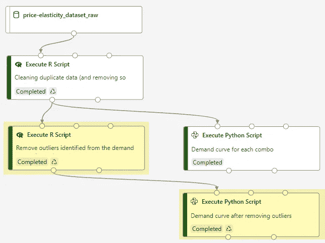

图 5——添加了一个“执行 R 脚本”模块来删除异常值，并添加了另一个 Python 模块来显示图表(作者提供)

这里的 R 脚本删除离群值:

在*图 5* 中，您还可以看到另一个“执行 Python 脚本”模块，该模块包含与前一个模块相同的脚本来生成散点图，这次使用清理后的数据集作为源。事实上，新的散点图不再显示异常值:

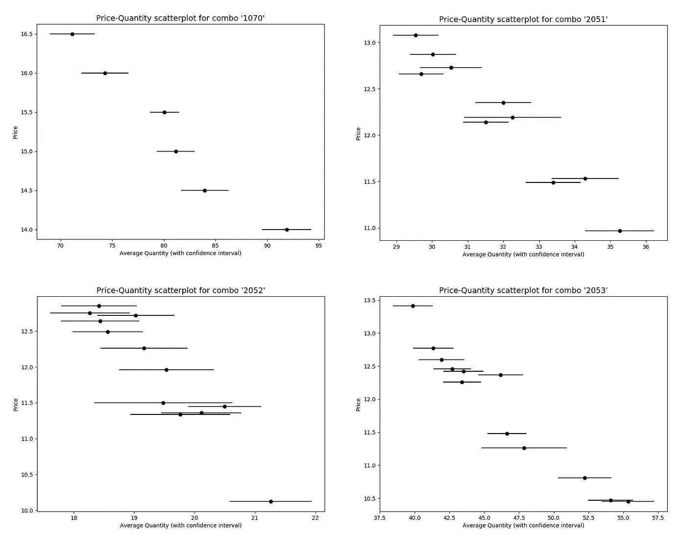

图 6 —所有产品组合的无异常值的价格-数量散点图(作者)

在这一点上，我应用了一系列的特性工程转换，正如我在以前的博客文章中所解释的那样，并且使用如下的一系列模块来修复列名:

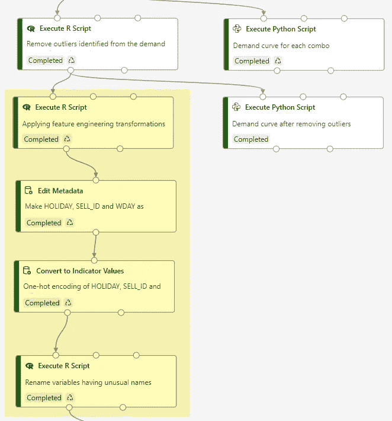

图 7 —应用特征工程转换(作者)

用于特征工程转换的 R 脚本是这样的:

此后，变量 HOLIDAY、SELL_ID 和 WDAY 通过[“编辑元数据”模块](https://docs.microsoft.com/en-us/azure/machine-learning/component-reference/edit-metadata)被转换成分类变量，以便通过[“转换成指标值”模块](https://docs.microsoft.com/en-us/azure/machine-learning/component-reference/convert-to-indicator-values)用一组一次性编码变量替换它们。然后，使用以下 R 脚本重命名一些因其不常见的名称而被重命名的功能:

接下来，尝试使用 Box-Cox 变换消除价格和数量变量的偏态，然后使用 z 得分归一化对所有数值变量进行归一化:

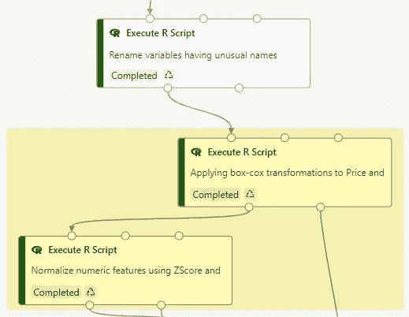

图 8 —归一化数字特征(作者)

Box-Cox 转换的 R 脚本将分别转换 T_PRICE 和 T_QUANTITY 中的变量 PRICE 和 QUANTITY。这里是脚本:

请注意，变换后的要素将被添加到第一个输入数据集中，并返回到模块的第一个输出引脚。同时，第二个输出引脚返回用于两个变换特征的λ值，以便稍后可以执行逆变换。

类似地，R 脚本用于规范化所有数字特征(T_PRICE、T_QUANTITY、YEAR、AVERAGE_TEMPERATURE、DAYS_FROM_BEGINNING):

你可能想知道为什么我没有使用设计者的本机[“规范化数据”模块](https://docs.microsoft.com/en-us/azure/machine-learning/component-reference/normalize-data)。原因总是在于我们需要进一步应用逆变换，因此我们需要在第二个输出引脚上返回第二个数据帧，其中包含已变换变量的平均值和标准偏差。

此时，我们可以将数据集分成一部分用于训练，另一部分用于测试。按照前一篇博文中的划分，我们必须首先通过“编辑元数据”模块转换设计者提供的 *DateTime* 中的 CALENDAR_DATE 特征数据类型，然后使用它将日期小于或等于 2015-06-30 的所有观测值分配给训练数据集:

图 9 —使用日历日期将数据集分为测试和训练(作者)

分割数据模块中使用的*关系表达式*如下:

> 【日历 _ 日期】<= 2015–06–30T00:00:00Z

That said, the training and testing workflows are the usual ones (*线性回归*、*训练*、*得分*、*评估模型*和*排列特征重要性*模块)，图 10 中红色突出显示的模块除外:

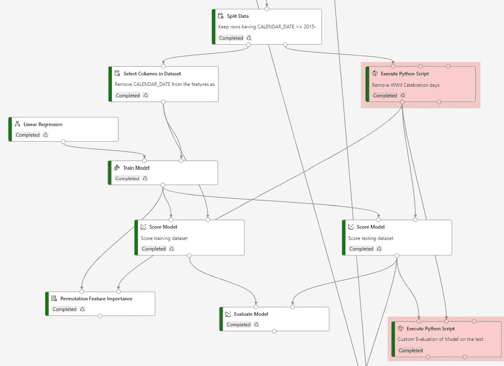

图 10-实验的训练和测试工作流程(作者)

测试工作流顶部突出显示的第一个 Python 脚本从测试数据集中删除了与二战庆祝日相关的观察结果(参见[之前的博客文章](/price-elasticity-data-understanding-and-data-exploration-first-of-all-ae4661da2ecb)),因为它们第一次被视为假日，并且模型无法从数据历史中了解该场合的价格和数量行为。这里是脚本:

另一个突出显示的 Python 模块包含 R 脚本的 Python 移植，您可以在[“如何更好地评估回归的拟合优度”博文](https://medium.com/microsoftazure/how-to-better-evaluate-the-goodness-of-fit-of-regressions-990dbf1c0091)的结尾找到，该博文用于为训练模型生成残差图。这里是脚本:

请记住，即使您不使用 Azure 机器学习，您也可以将之前的 Python 脚本用于您的自定义机器学习项目。只要记得注释掉 *run.log_residuals* 函数，用 *fig.show()* 替换 *run.log_image* 函数即可。

运行定制评估模块后，只需点击它，然后点击*指标*选项卡，即可查看在测试数据集上计算的指标:

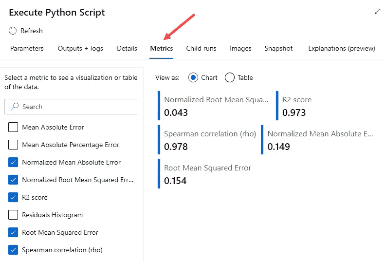

图 11——测试数据集上模型的定制度量(作者)

点击*图像*选项卡，您可以访问模块执行期间记录的所有剩余图:

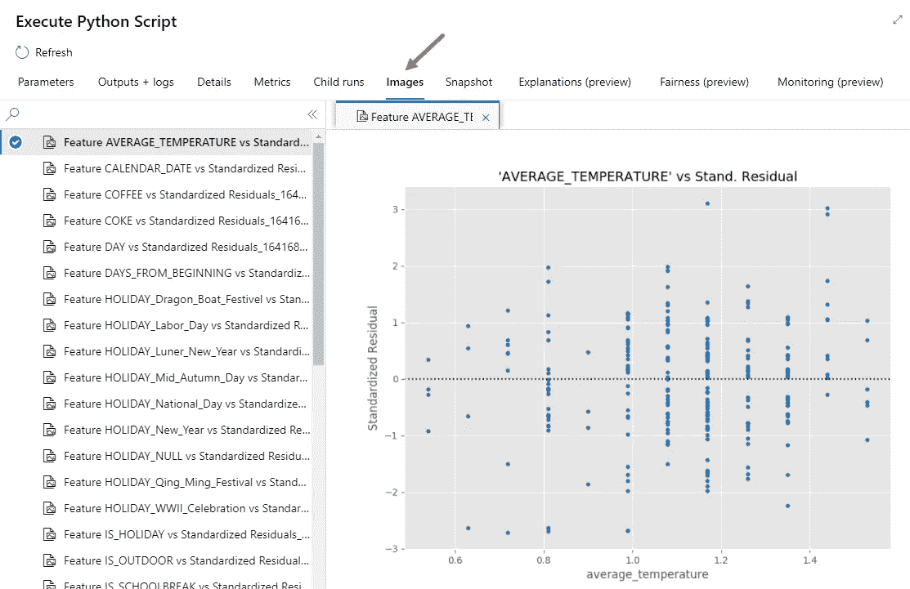

图 12 —根据测试数据集计算的模型残差图(作者)

也就是说，在管道的最后，记得对目标变量进行逆变换，这样输出的不再是应用了规范化的 Box-Cox 变换值，而是真实的量。为了进行逆变换，您需要 Box-Cox 变换所应用的 lambda 值以及用于 z 得分变换的平均值和标准偏差值，所有这些都应用于 QUANTITY 变量。为此，您必须将之前转换模块的第二个输出引脚链接到相应的*执行 R 脚本*模块，以进行逆转换:

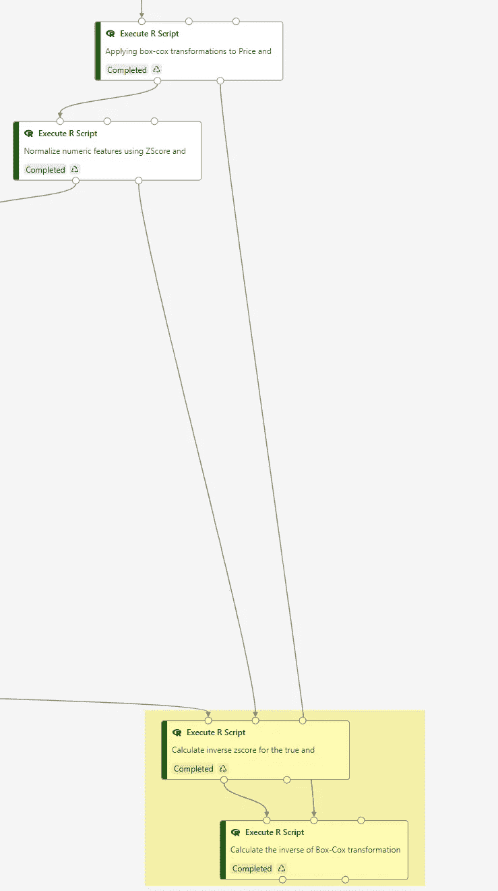

图 13 —使用先前输出作为第二输入的逆变换模块(作者)

请记住，如果您通过首先应用 Box-Cox 然后应用 z-score 来转换数量变量，则应以相反的顺序应用逆转换。

反向 z 得分变换的 R 脚本如下:

Box-Cox 逆变换的 R 脚本如下:

最后，点击*自动布局*重排闪电图标后，完整的流水线看起来如下:

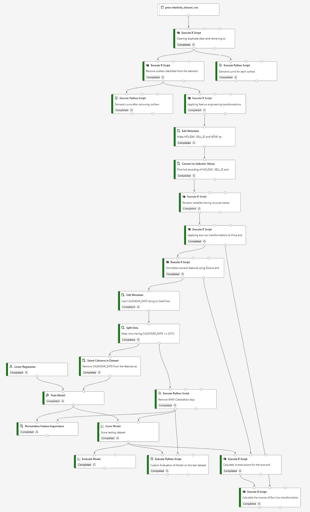

图 14 —新实验的完整流程(作者)

右键单击最后一个转换模块的左输出引脚，并单击*预览数据*，您可以看到转换数量和原始数量情况下的真实值和得分值:

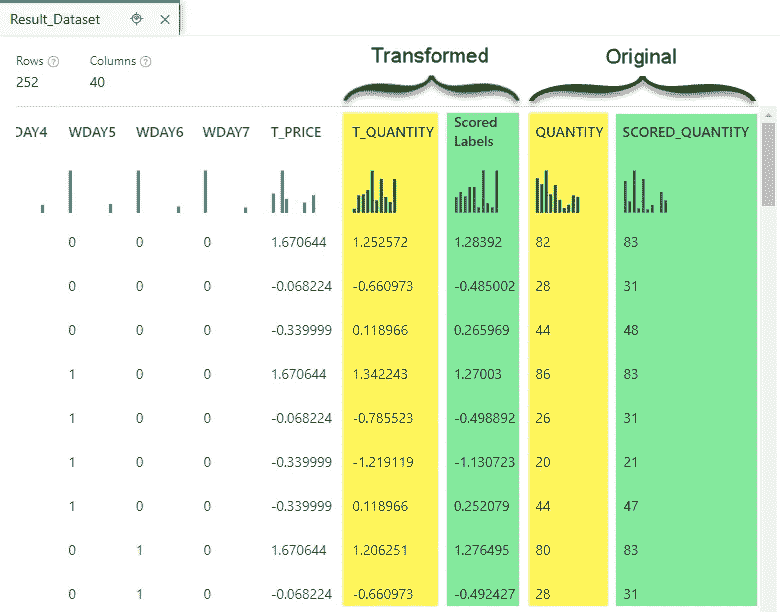

图 15 —逆变换后的得分值(作者)

一旦您运行了整个管道，我敢打赌您一定很想看看当前的模型是否比之前博客中的模型表现得更好。我们去看看。

## 比较模型性能

显然，为了决定两个模型( [original](https://medium.com/microsoftazure/how-to-better-evaluate-the-goodness-of-fit-of-regressions-990dbf1c0091) vs new)中的哪一个表现得更好，我们需要与用于目标变量的度量尺度无关的标准化度量或系数。例如，考虑目标真值和预测值之间的*归一化均方根误差*(NRMSE)*决定系数* (R)和现在引入的*斯皮尔曼相关系数*(ρ，rho)，这里比较:

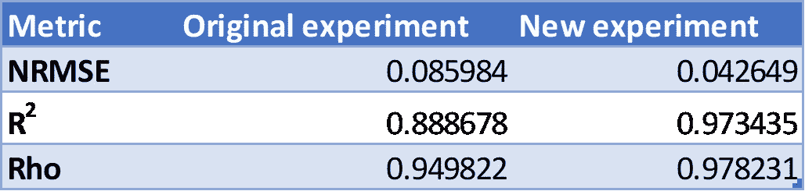

图 16——原始模型和新模型的性能测量(作者)

对于 NRMSE 来说，最小的度量就是最好的，而对于其他两个国家来说，最大的度量就是最好的。因此，新模型明显优于原始模型。通过分析*残差图*，这一论断也是显而易见的。

在下图中，我们比较了左边的原始模型和右边的新模型。例如，在图 17 的*中，新模型的残差分布呈现更对称的钟形，以零为中心:*

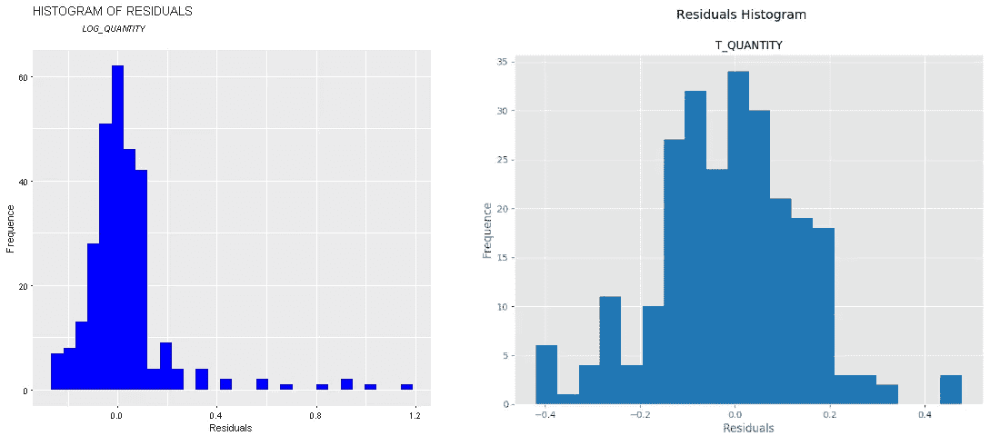

图 17 —两个模型的残差直方图之间的比较(作者)

新模型残差正态 Q-Q 图与*图 18* 中象限的主对角线明显更接近，这也支持了之前的断言:

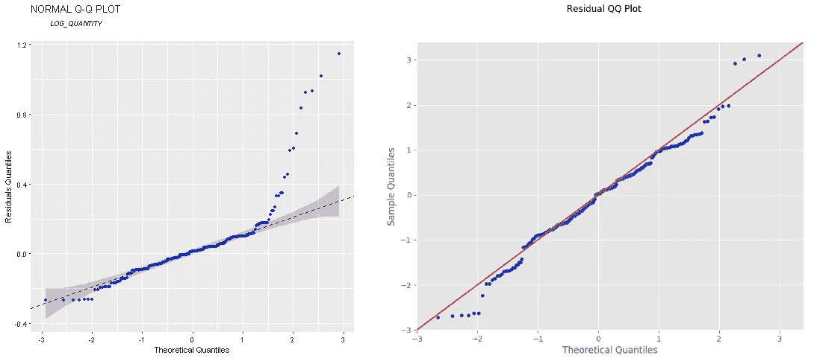

图 18 —两种模型的正常 Q-Q 图之间的比较(作者)

同样的事情也适用于预测与实际图，在新模型的情况下，点更靠近对角线:

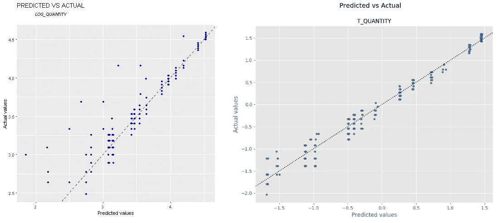

图 19——两种模型的预测图与实际图之间的比较(作者)

即使在*预测与残差*图的情况下，尽管即使对于新模型，异方差仍然很明显，但点更多地集中在 0:

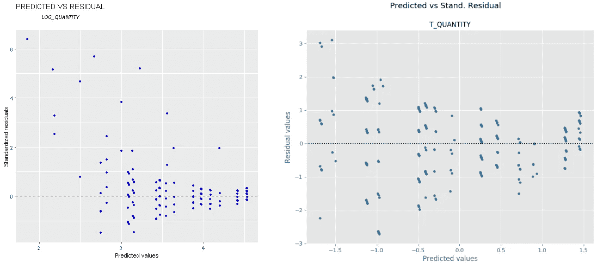

图 20——两种模型的预测图与残差图之间的比较(作者)

我们可以有把握地说，新型号比原来的性能更好。

此外，如果您查看*排列特征重要性*模块的结果，您可以看到，从训练数据集中移除具有负得分的高亮特征，您可能会有一个更好的模型，不容易过度拟合:

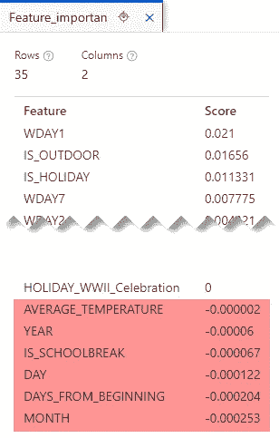

图 21-可能导致由置换特征重要性模块产生的过拟合的特征

让我们看看从这个实验中能得出什么结论。

# 结论

仔细的探索性数据分析(EDA)是获得性能更好的模型的正确方法。我们通过[将 EDA 应用于价格弹性数据集](/price-elasticity-data-understanding-and-data-exploration-first-of-all-ae4661da2ecb)并训练一个新模型来证明这一点，结果证明这个新模型比原来的模型更好。

在下一篇文章中，我们将尝试使用 Azure AutoML 从本文中看到的相同输入数据集和转换中训练一个额外的模型。

# 参考

*   置信区间:如何找到它:最简单的方法！—统计如何进行
*   [Azure Machine Learning SDK for Python—Azure Machine Learning Python |微软文档](https://docs.microsoft.com/en-us/python/api/overview/azure/ml/?view=azure-ml-py)
*   [日志&查看指标和日志文件— Azure 机器学习|微软文档](https://docs.microsoft.com/en-us/azure/machine-learning/how-to-log-view-metrics)