# 基于 PyCaret 和深度学习的价格推荐系统建模

> 原文：<https://towardsdatascience.com/price-recommendation-system-modeling-using-pycaret-and-deep-learning-fd05f9f80900>

## 实践教程

## 电子商务案例研究


马库斯·温克勒在 [Unsplash](https://unsplash.com?utm_source=medium&utm_medium=referral) 上的照片

```
**Table of Contents**· [The Business Problem](#9aa7)
· [Baseline Model](#8147)
· [Exploratory Data Analysis](#a593)
· [Preprocessing](#d1e3)
· [Machine Learning](#ffc1)
· [Deep Learning](#dbe3)
· [Inference](#d5c3)
· [Conclusion](#fd1b)
```

# 商业问题

假设你刚开始在一家真正看重用户和合作伙伴体验的电商公司实习。有一天你发现你公司的 app 里卖的两件类似的衣服价格相差几百块钱。它们有相同的颜色，相同的用途，只是在商标和描述等细节上有所不同。

有了这个观察，你的首要任务就是为卖家建立一个定价推荐系统，让他们知道自己的产品到底值多少钱，市场愿意出多少钱。这将缓解卖家和买家之间的交易，让卖家很容易适应成为利基参与者。

我不知道这种情况是否合理，但让我们假装并继续:)

您将获得可用的过去交易数据，如下所示。

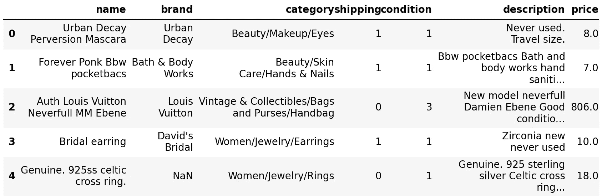

它由七个特征组成，包括产品的名称、品牌和类别，谁支付了运费(买方或卖方)，产品状况和描述，以及相应的美元价格。在建立模型时，前六个特征将是你的预测因素，价格将是你的目标。

您将逐步构建您的模型，从最简单的开始，一步步增加复杂性:

1.  基线模型:从人类会做什么来推荐价格
2.  机器学习:经典模型，由 PyCaret 简化
3.  深度学习:神经网络模型，利用张量流

# 基线模型

在实际应用中，选择模型时需要考虑许多因素。除了性能，我们还应该考虑模型对推理的响应速度、重新训练的时间、计算成本、内存大小、可解释性等。

在性能方面，我们要做的第一件事是构建一个简单的基线来比较模型。由于这是一个回归问题，我们将考虑简单的性能指标，如 MAE、RMSE 和 RMSLE。

首先，我们将 12/1/1 比例的数据分成训练、验证和测试三部分。我们暂时不会使用验证分割来学习超参数，因为我们没有这个基线模型的任何超参数。

```
Train shape: (1200000, 7)
Validation shape: (100000, 7)
Test shape: (100000, 7)
```

作为基线，我们应该考虑最简单但合理的模型。如果你的朋友问你，“这要多少钱？”，你可能会回答“什么是' *it* '？”。你的朋友问你一个更合适的问题是“一部电话多少钱？”，因此你回答“嗯，大约 800 美元”。

现在，这 800 美元从哪里来？一个合乎逻辑的答案将是从许多电话价格的中心的测量，也就是说，从他们的平均或中间值(当然，品牌应该被考虑)。因此，为了估算电话价格，我们将每部电话分组，取其价格的平均值或中值。从我们的数据来看，我们实际上有这种群体:按品牌和按类别分组。

```
name                0
brand          510245
category         4884
shipping            0
condition           0
description       657
price               0
dtype: int64
```

因为从上面来看，`brand`上有许多缺失值，我们将使用`category`来代替。由于一些特定的手机品牌比其他品牌贵得多，因此最好使用中位数聚合。

可能会有一些产品的`category`是在测试部分新推出的，而在列车测试部分没有出现过。在这种情况下，模型无法预测那些产品的价格。我们将通过简单地用所有价格的中位数来估算它们来处理这个问题。

这是基线模型的性能分数。


# 探索性数据分析

EDA 应该回答重要的问题，并使提取洞察力变得更容易。这里，我们特别感兴趣的是`price`。观察列车分裂中`price`的直方图，我们直接看到其分布遵循 [**幂定律**](https://en.wikipedia.org/wiki/Power_law) ，其中一个量的相对变化作为另一个量的幂而变化。

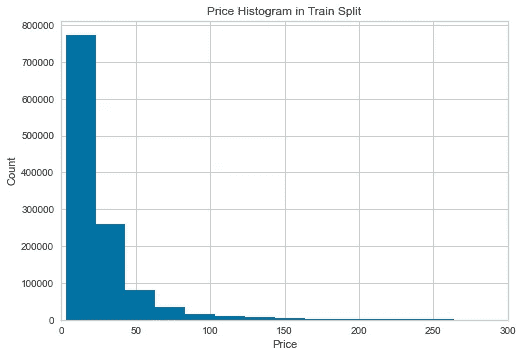

图片作者[作者](https://dwiuzila.medium.com/membership)

如果目标变量遵循正态分布，线性模型族或神经网络中的一些模型通常表现更好。因此，我们可能需要对`price`进行变换，其中一个叫做 [box-cox 变换](https://en.wikipedia.org/wiki/Power_transform#Box%E2%80%93Cox_transformation)。请注意，基于树的模型不受此影响。

请参见下面的转型实践。

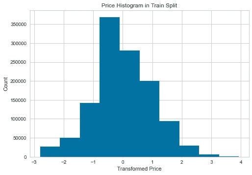

图片作者[作者](https://dwiuzila.medium.com/membership)

最终的分布不一定是正态的，但它肯定比转换前的分布更正态。

# 预处理

在进行任何建模之前，我们需要对数据进行预处理。对于预处理步骤，我们执行如下简单任务:

1.  用空字符串填充任何缺少的值，
2.  将间隔开的`name`和`brand`连接起来，替换`name`，
3.  通过连接由空间分隔的`description`、`name`和`category`来创建一个新特征`text`，
4.  删除除`name`、`text`、`shipping`、`condition`和`price`(针对目标)之外的所有功能。
5.  从`name`和`text`生成 TF-IDF 特征，以及
6.  用`text`和`shipping`组合 TF-IDF 的两个特性。

下面是代码，它保存在工作目录中的一个单独的`preprocess.py`文件中。这很重要，因为稍后我们会隐式使用`pickle`，它需要在另一个模块/文件中定义自定义类，然后导入。否则， [PicklingError 将被引发](https://stackoverflow.com/questions/45335524/custom-sklearn-pipeline-transformer-giving-pickle-picklingerror)。

如前所述，从`preprocess.py`导入必要的功能。注意，我们还将`gc`作为垃圾收集器导入，以便在对象不再使用时释放内存(因为我们的数据很大)。

现在，预处理数据。

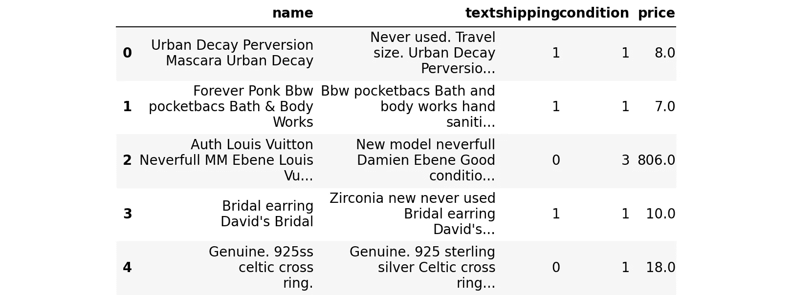

# 机器学习

作为一名实习生，假设你对机器学习算法的艺术和手艺了解不深。你需要一个低代码的机器学习库来帮助你完成大部分工作。

> 看哪， [**PyCaret**](https://pycaret.readthedocs.io/en/latest/) 。

我们在这一部分所做的事情受到了 PyCaret [教程](https://github.com/pycaret/pycaret/blob/master/tutorials/Regression%20Tutorial%20Level%20Intermediate%20-%20REG102.ipynb)的启发。对 Moez Ali 和团队，我们感激不尽👏。

创建一个 TF-IDF 矢量器。现在，我们将使用`max_features = 10000`，但以后会增加。我们用几个主题演讲建立了一个实验`setup`:

1.  使用的数据仅占第一次原型设计所有观察值的 0.1%，随机选择，
2.  对预测器不做进一步的预处理，
3.  根据 EDA 的建议，通过`box-cox`变换对`price`进行变换，并且
4.  训练策略是简单地通过将训练拆分成训练和验证拆分。

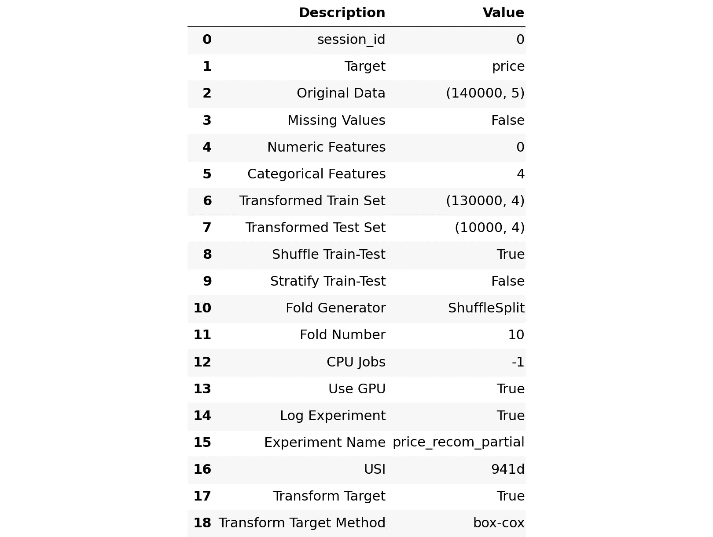

通过调用`models`函数，我们可以从 PyCaret 中看到可用的模型。

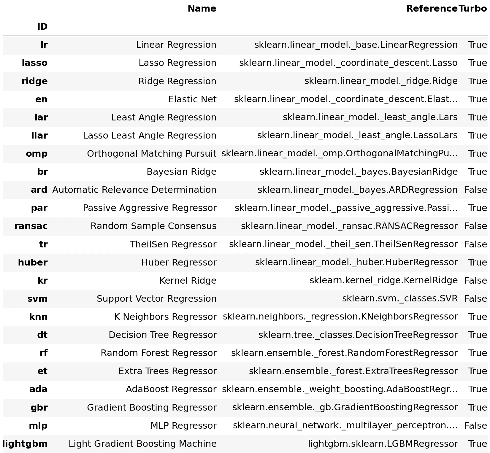

接下来挑几款，对比一下。这里我们选择其中的八个。你可能想试试其他的。

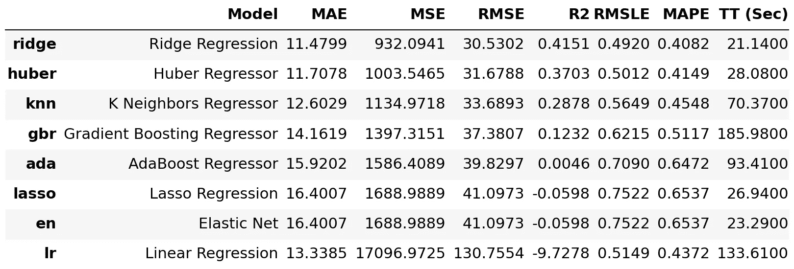

有些模型比基线模型表现得更好，有些则更差。我们可以很容易地看到`ridge`和`huber`模型通过他们的指标表现得非常好，并且他们的训练时间是最快的。

删除一些无用的变量，释放一些内存。

```
146
```

现在，用`max_features = 100000`创建另一个 TF-IDF 矢量器。新的实验`setup`和以前一样，除了现在我们使用新的矢量器和数据中的所有观察。

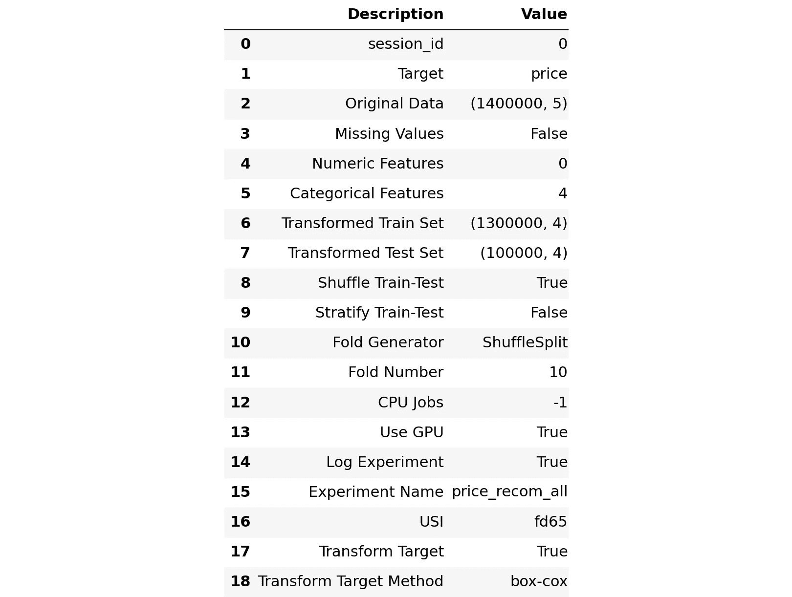

通过这个新的设置，我们训练了两个表现最好的模型，`ridge`和`huber`。我们可以看到性能有所提高。

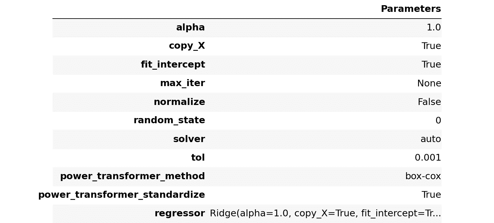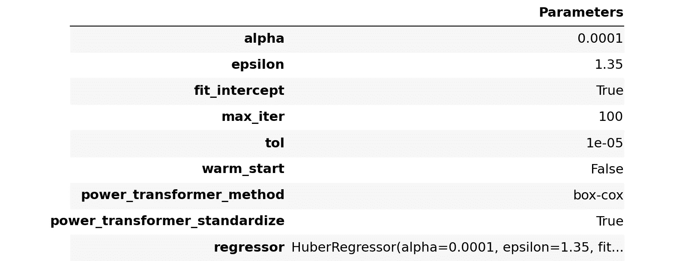

我们也可以将两种模式融合。


混动款肯定比`huber`好。此外，混合模型在所有指标上都比`ridge`略差，但 RMSE 除外，它在该指标上明显胜出。我们将选择混合模式作为我们的冠军(目前)。

PyCaret 与 MLflow 集成在一起。您可以启动 MLflow UI，通过在终端中运行下面的命令，在 [http://localhost:5000/](http://localhost:5000/) 上查看当前实验的元数据。

```
$ mlflow ui
```

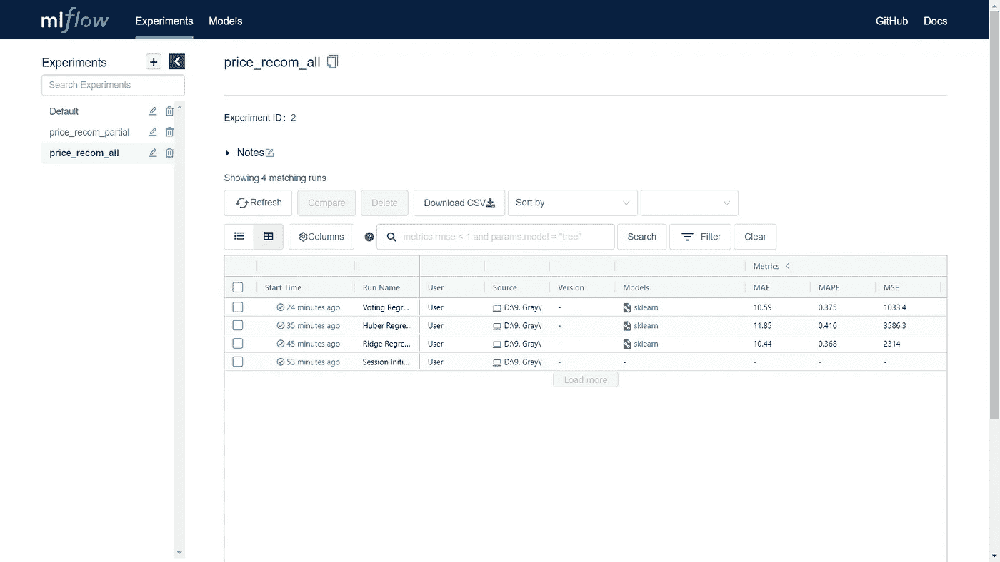

MLflow UI，图片作者[作者](https://dwiuzila.medium.com/membership)

让我们将结果和基线模型一起制成表格。


PyCaret 还有许多其他特性，比如模型调优和其他集成方法，我们在这里不做探讨。我们鼓励你自己去尝试。

# 深度学习

首先，让我们像以前一样矢量化训练和验证分割。

```
X_train: (1200000, 193754) of float32
X_valid: (100000, 193754) of float32
```

然后，使用之前拟合的 box-cox 变换对验证分割中的`price`进行变换。

如上所述，我们将使用 TensorFlow 来帮助我们。

在深度学习建模中，你可以做的最简单的事情就是建立几层密集的神经网络。这里，我们建立了一个具有三个隐藏层的网络，这三个隐藏层被训练了两个时期。

让我们从`X_train`和`X_valid`对中训练两个模型。

```
Model 1
586/586 [========] - 11s 19ms/step - loss: 0.3623 - val_loss: 0.3151
293/293 [=========] - 8s 28ms/step - loss: 0.2163 - val_loss: 0.3077

Model 2
586/586 [========] - 11s 19ms/step - loss: 0.3626 - val_loss: 0.3178
293/293 [=========] - 8s 28ms/step - loss: 0.2171 - val_loss: 0.3078
```

现在，通过将`X_train`和`X_valid`转换成布尔矩阵来尝试一些别的东西，也就是说，如果`X_train`或`X_valid`的元素不为零，那么它就变成 1，如果元素为零，它就保持为 0。用这些新矩阵训练两个模型。

```
Model 1
586/586 [========] - 11s 19ms/step - loss: 0.3682 - val_loss: 0.3247
293/293 [=========] - 8s 28ms/step - loss: 0.2103 - val_loss: 0.3151

Model 2
586/586 [========] - 12s 20ms/step - loss: 0.3680 - val_loss: 0.3250
293/293 [=========] - 8s 29ms/step - loss: 0.2101 - val_loss: 0.3162
```

将所有四个模型收集到一个 python 列表中，并对所有四个验证拆分进行预测。明确地说，这四种模式是:

1.  具有 TF-IDF 数据的两个模型
2.  具有布尔数据的两个模型

我们建立一个`score`函数来计算预测的质量。

对于一个模型，我们有以下分数。

```
{'MAE': 9.2815766537261,
 'RMSE': 26.11544796731921,
 'RMSLE': 0.4090026031074859} 
```

通过混合两个模型，我们得到以下分数。有明显的改善。

```
{'MAE': 9.052237654724122,
 'RMSE': 25.90078324778221,
 'RMSLE': 0.4006770676979191} 
```

最后，所有四个模型的混合给了我们最好的结果。

```
{'MAE': 8.918359263105392,
 'RMSE': 25.910815619338454,
 'RMSLE': 0.39423109095498304}
```

将结果与基线和机器学习结果一起附加。我们直接看到深度学习模型是赢家。而且训练时间也快，不到 80 秒。


当然，我们可以进一步调整该模型的超参数，甚至尝试其他神经网络架构。然而，这篇文章太长了，读不下去。但是我们鼓励你去尝试。

# 推理

现在，我们将对测试分割进行预测，以确认我们的深度学习模型的最终性能。和以前一样，测试分割需要在进入模型之前进行预处理。

正如所料，分数与验证分割的分数相似。

```
{'MAE': 8.916460799703598,
 'RMSE': 27.392445134423518,
 'RMSLE': 0.3933138510387536}
```

最后，我们保存模型以备将来使用。

```
INFO:tensorflow:Assets written to: model1\assets
INFO:tensorflow:Assets written to: model2\assets
INFO:tensorflow:Assets written to: model3\assets
INFO:tensorflow:Assets written to: model4\assets
```

# 结论

我们已经为一个电子商务应用程序的案例研究建立了一个价格推荐系统模型。从基线模型开始，通过最少的数据预处理，我们已经取得了相当好的结果，如下所示。


我们利用 PyCaret 和 TensorFlow 来构建模型。这些图书馆确实为我们做了艰苦的工作。

👏*谢谢！如果你喜欢这个故事，想支持我这个作家，可以考虑* [***成为会员***](https://dwiuzila.medium.com/membership) *。每月只需 5 美元，你就可以无限制地阅读媒体上的所有报道。如果你注册使用我的链接，我会赚一小笔佣金。*

📧*如果你是我推荐的 Medium 成员之一，请发送电子邮件至*[***geo lid . members[at]Gmail . com***](mailto:geoclid.members@gmail.com)*获取这个故事的完整 python 代码。*

[](https://dwiuzila.medium.com/membership)

更喜欢 R 中的数据科学动手教程？好奇机器学习是如何工作的？看看这个:


[艾伯斯·乌兹拉](https://dwiuzila.medium.com/?source=post_page-----fd05f9f80900--------------------------------)

## R 中的数据科学

[View list](https://dwiuzila.medium.com/list/data-science-in-r-0a8179814b50?source=post_page-----fd05f9f80900--------------------------------)7 stories

[艾伯斯·乌兹拉](https://dwiuzila.medium.com/?source=post_page-----fd05f9f80900--------------------------------)

## 从零开始的机器学习

[View list](https://dwiuzila.medium.com/list/machine-learning-from-scratch-b35db8650093?source=post_page-----fd05f9f80900--------------------------------)8 stories