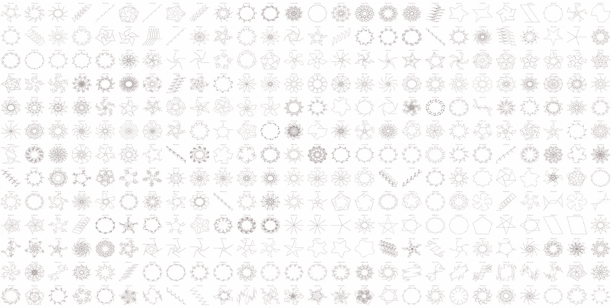
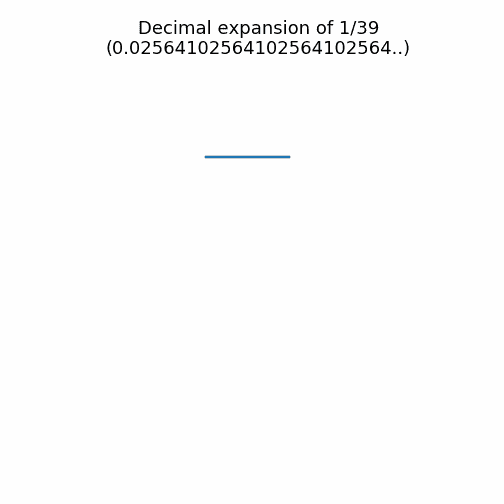
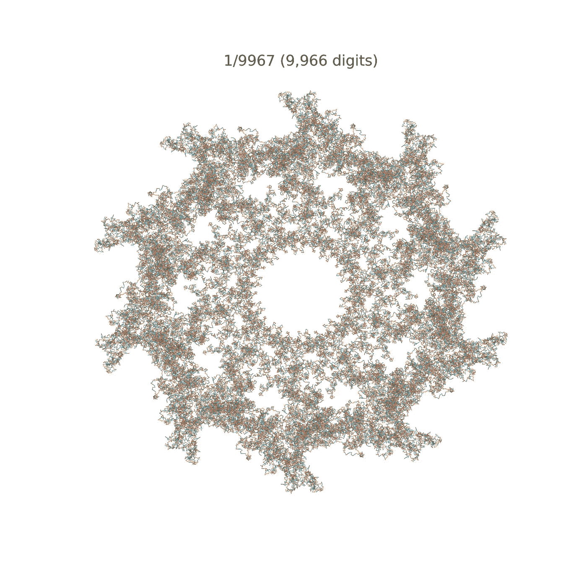
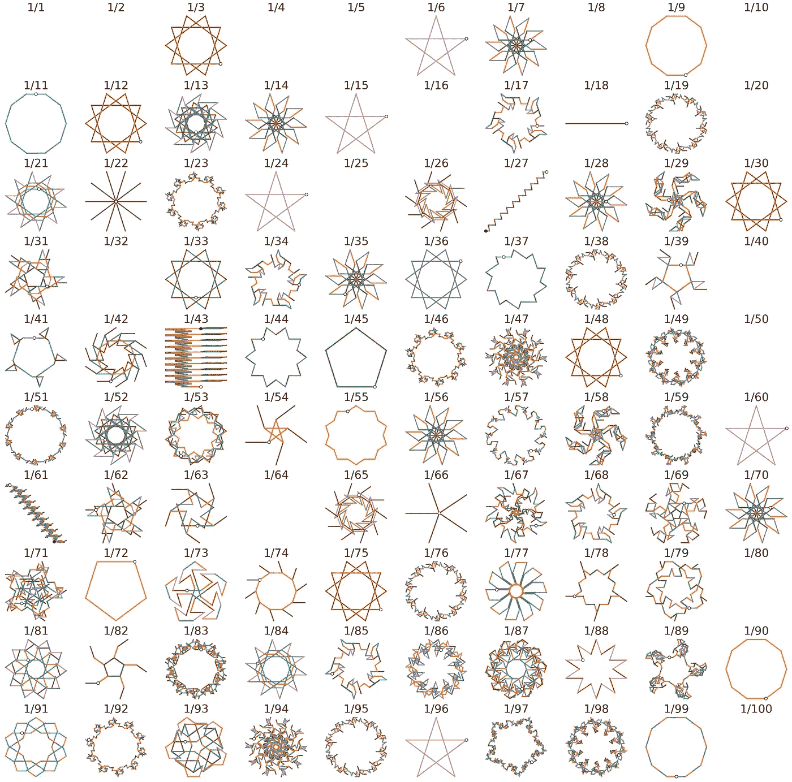
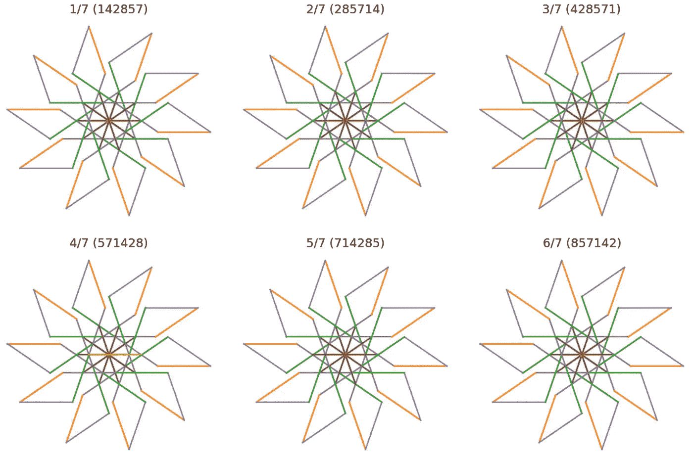
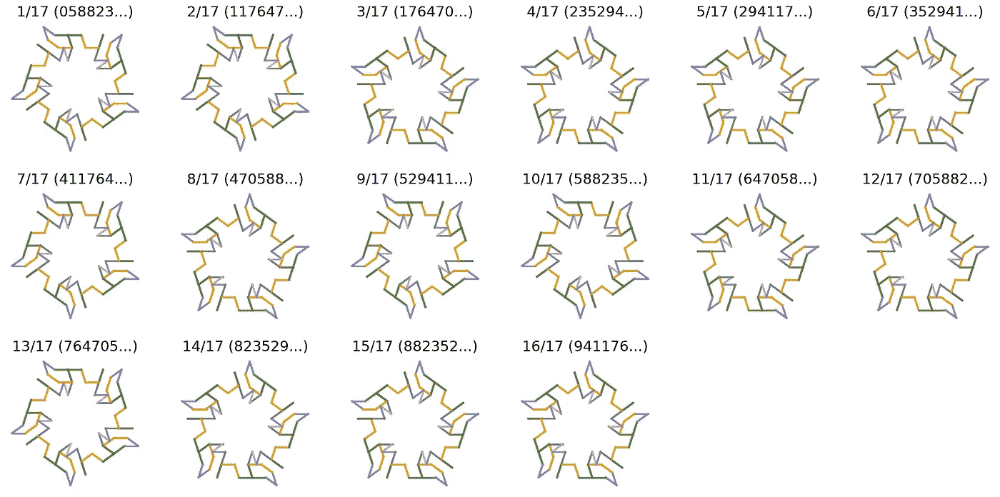
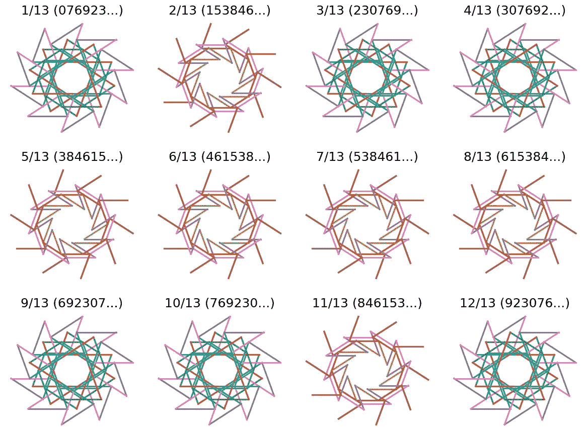
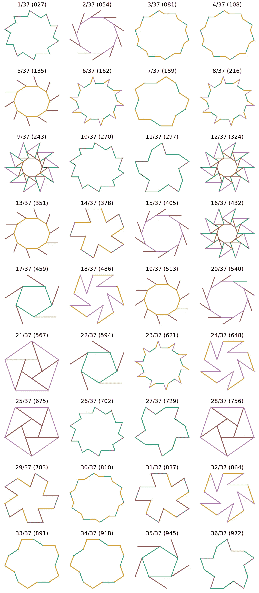

# 素数分数和循环倒数

> 原文：<https://towardsdatascience.com/prime-fractions-cyclic-reciprocals-b1074f6ebc3b>

## 倒数和质数领域的进一步视觉冒险

图片作者。

我目前的副业是关于使用数据可视化技术来创造分数的视觉表现*。*它的灵感来自于 [Matt Henderson](https://twitter.com/matthen2) 最近关于 [Numberphile](https://www.numberphile.com/) 的一些工作，以及我自己对数据分析和可视化的兴趣。基本思想是把分数作为一种新的数据来源。更准确地说，分数的十进制展开的数字是一个可以被操作、分析和可视化的数据源。在这篇文章中，我描述了我如何使用分数的十进制展开中包含的数据来创建相应的可视化表示，希望它们可以揭示一些有趣的模式，从而导致支撑数字和分数的一些重要属性。

简而言之，I ' *用它的十进制展开式的位数来控制一系列单位线段的角度，从而画出*一个分数。在某种程度上，每个分数的十进制展开充当一组简单类型的计算机程序的可视化指令，以创建分数的形状。

结果令人惊讶地优雅和引人注目，至少在我看来是这样——比如下面显示的 1/39 的令人愉快的模式——但它们也有助于揭示分数的一些有趣的性质，正如我将在本文中讨论的那样。

图片作者。

*顺便说一下，在我的研究中，我看到了 Jones & Pearce(数学杂志，2000 年)的一篇有趣的文章***，其中他们也描述了一种可视化循环小数的方法，但这种方法基于除法过程中获得的余数，而不是这里使用的商/循环数字。**

*许多简单的分数导致复杂而对称的形状，这是因为它们的十进制展开式中有(无限)重复的数字序列。例如，在 1/39 的十进制扩展中，数字 025641 会永远重复。因此，1/39 被称为*重复小数(*或*循环小数)。*它的重复位数(025641)称为一个 *reptend* 或*reptend，*reptend*reptend*的长度称为它的*周期。**

*这个项目开始时是平等的数据可视化/生成艺术，再加上探索数据丰富的数字世界的另一种方式，它诞生于对数学之美的更大欣赏的渴望。当我探索熟悉的分数产生的模式时，我开始意识到这种数据驱动的方法和视觉视角也可以揭示一些关于数字本质的更深刻的见解。*

**

*图片作者。*

*例如，在我之前的文章中，我不仅能够说明重复分数和一些引人注目的形状之间的关系，还能够说明所产生的形状的复杂性如何取决于分数的十进制展开中重复序列的长度。看看上面 1/9967 的细节吧——小于 10，000 的最大质数——它有 9，966 个重复的数字！也请注意它的周期(9966)是如何比最初的恶魔化者少一的？我稍后将回到这一点…*

*L 让我们看看前 100 个倒数——形式为 *1/n* 的分数——如下所示；实际上，我只包括了具有重复小数展开式的分数，我只画出了它们的表示。换句话说，下面我已经排除了重复数字后面的不重复数字，例如 *1/60* 中的*01*(= 0.01666……)，因为这有助于突出各种倒数之间存在的一些明显的相似之处。例如，注意 *1/3、1/12、1/30、1/48、*和 *1/75* 都具有相同的形状，还有 *1/7、1/14、1/35、1/56 和 1/70* 以及 *1/9 和 1/90* 。为什么？*

**

*图片作者。*

*首先，每个重复的倒数 *1/n* 与 *1/10n* 具有相同的观想。这很容易看出，因为如果 10 是分母的一个因子，那么它不会影响 reptend，除非延迟它在十进制展开中的出现。因此，1/3 = 0.333…，1/30 = 0.0333…，1/300 = 0.00333 …等等，都有相同的观想，因为它们都有相同的再现；虽然这是一个基数为 10 的现象，但它可以推广到任何基数 *b* 。*

*这也解释了为什么 1/14、1/28、1/35、1/56 看起来也像 1/7，而 1/21、1/42、1/77 却不像。前者可以重写为 1/70 的倍数(*1/14 = 5/70；1/35 = 2/70 等。)*但 *1/21、*1/42、 *1/77* 不能。*

*我说*部分地*解释了，因为还有别的事情在发生。例如，如下所示，其他 7 的倍数也会产生与 1/7 相同的形状，即使它们的分母中不包含因子 10，并且它们的表示不同。但是，请注意，下面的每个 reptend 都是 1/7 reptend (142857)的数字的*旋转*，这解释了产生的相似形状。*

**

*7 的倍数。图片作者。*

*例如，2/7 的 reptend 与 1/7 相同，只是向左移动了两个位置(142857 → 285714)。产生的视觉效果是相同的，因为当数字旋转时，数字的顺序保持不变，因此用于产生形状的角度顺序也保持不变；由此产生的观想在不同的点开始和结束，但是产生的整体形状是相同的。这适用于所有适当的倍数， *m/7，如下所示的 m < 7。**

*1/7 在这方面特别吗？还是这指向了一些更深层次的真相？经过一番研究，我意识到 1/7 有些特殊，因为它的 reptend (142857)是一个循环数。当一个 *n* 位的循环数乘以任意整数直到 *n-1* 时，我们得到其位数的旋转；顺便说一下，当它乘以 n 时，我们得到一串 9，但那是另一个故事了。这里是 142，857 的适当倍数，是上面 1/7 的适当倍数的表示。*

> *142857×1 = 142857
> 142857×2 = 285714
> 142857×3 = 428571
> 142857×4 = 571428
> 142857×5 = 714285
> 142857×6 = 857142*

*因此，1/7 的倍数之间惊人的视觉重合让我了解并更好地理解了一种叫做循环数的特殊数字。这并不是说视觉方法对于理解循环数或者它们与倒数的关系是必要的，但是它是有帮助的，也许它使循环数的概念更加容易理解和直观。*

*这里有一些其他的循环数，它们有相应的素倒数，在这些循环数中它们表现为 reptends？事实上，据推测存在无限数量的循环数，并且产生循环数的素数的分数似乎约为 3/8，但未被证明。*

*下一个例子是 1/17 的倒数。它有一个 16 位的 reptend (0588235294117647)，它的倍数如下:*

**

*17 的倍数。图片作者。*

*并不是每一个素数的倒数都是这样的，但是在我们仔细观察之前，让我们先注意一下这些*循环倒数*的另一个有趣的关系:它们的长度表示为 *p-1。*例如， *1/7* 的重复周期为 6(*7–1*)，而 *1/17* 的重复周期为 16(*17–1*)。事实上，*循环往复运动和*循环往复运动都是如此，但其他往复运动则不然。*

*C 举个例子，看看 1/13 的倍数。它是另一个质数倒数，但它有一个 6 位数(*6≠13-1*)reptend(*076923*)，而且它不是一个循环数。*

**

*13 的倍数。图片作者。*

*实际上， *1/13* 的倍数包括两种不同的可视化*形式，*因为有两种不同的重复旋转，一种用于 *076913* 的旋转，一种用于 *153846* 的旋转。无论我们检查哪个合适的(互质)倍数( *m/13* )，都不会产生其他的重复。*

*另一个例子是 *1/37。*它的固有倍数有 3 位数表示(*3≠37–1)*)，它有 12 种不同的表示形式*，首先出现在对应于 *m=1、2、3、5、6、7、9、11、14、17、18、*和 *21、*的倍数，如下图所示；换句话说，所有随后的真倍数都产生这些形式中的一种。**

****

**1/37 的倍数。图片作者。**

**因此，1/13 有 6 位数的重复，有 2 种观想形式，而 1/37 有 3 位数的重复，有 12 种形式。事实上，这指出了这些互易的一个重要规则:**

> **一般来说，素数 **p** 的适当倍数的倒数集合由 **n** 个子集组成，每个子集的重复长度为 **k** ，其中 NK = P1。([来源](https://en.wikipedia.org/wiki/Repeating_decimal))**

**换句话说，如果 *p* 是素数并且 *1/p* 的重复周期为 *k* ，那么 *1/p* 的适当倍数将有 *n* 个不同的可视化形式，其中 *n = (p-1)/n* 。再一次，对互易性的直观探索帮助我们确定了互易性的一个重要特征。**

**然而，这种关系不适用于*复合*的倒数——T2 1/n，其中 *n* 不是质数。例如， *1/22* (= *0.0454545* )与 5 种不同的视觉形式相关联(对于其 5 种不同的两位数表示的旋转， *45，09，36，18，27* )，因此*NK = 5 x2 = 10(<21)；一些初步的研究表明在这方面还有很多工作要做。***

**在这篇文章中，我进一步探索了简单分数的视觉表现，揭示了它们的十进制展开的一些有趣的性质。作为一名数据科学家，我采用的方法很大程度上是将数据分析和可视化思想应用于简单分数的产物。一个分数的十进制展开中包含的数字作为分析和可视化的数据来源，我非常好奇这种方法在未来会走向何方。**

**现在，我想澄清的是，我并不认为这种可视化的方法会带来任何改变游戏规则或关于分数或质数倒数的新见解，相反，它有助于揭示数字的许多有趣的已知属性，使它们更可见、更容易理解，特别是对那些不太精通数学的人来说。**

**至少，我相信这种方法有潜力帮助孩子们把数学视为一门比其他情况更直观、更有创造性的学科，补充似乎主导早期数学教育的表格和规则的学习..**