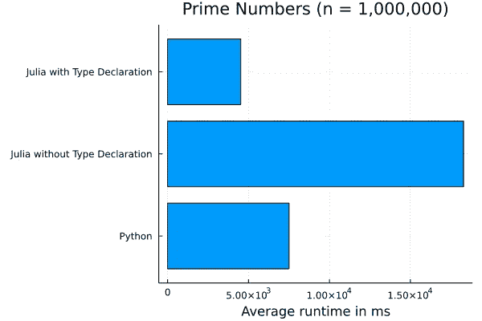
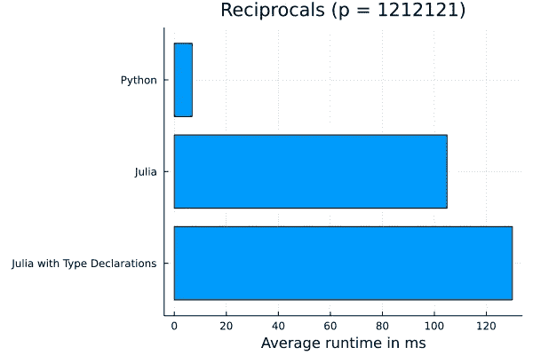
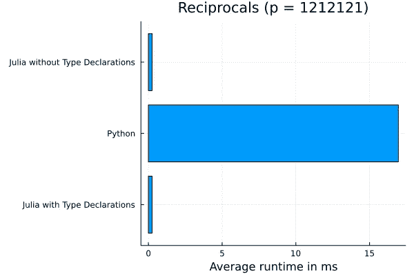

# 朱莉娅和 Python 的黄金时间

> 原文：<https://towardsdatascience.com/prime-time-for-julia-and-python-96da5963d995>

## 通过生成素数和计算素数的倒数来比较 Julia 和 Python 的性能


照片由[阿伦视觉](https://unsplash.com/@aronvisuals?utm_source=unsplash&utm_medium=referral&utm_content=creditCopyText)在 [Unsplash](https://unsplash.com/s/photos/prime-time?utm_source=unsplash&utm_medium=referral&utm_content=creditCopyText) 上拍摄

基于我在 Python 中遇到的一个非常聪明的素数生成器，我为 Python 和 Julia 设置了一些性能基准。不仅用于生成素数，还用于计算素数的[倒数。而且结果挺有意思的…](https://www.youtube.com/watch?v=DmfxIhmGPP4)

# 质数

这是我开始写的 Python 代码。

```
def python_primes(n):
    D = {}
    q = 2
    r = []
    counter = 0 while counter < n:
        if q not in D:
            r.append(q)
            D[q * q] = [q]
            counter += 1
        else:
            for p in D[q]:
                D.setdefault(p + q, []).append(p)
            del D[q]
        q += 1 return r
```

例如，运行`python_primes(10)`返回前 10 个素数的列表。

对于 Julia，我做了两个函数:一个没有类型声明，一个有类型声明。

这是带有类型声明的。

```
# Julia with Type Declarationfunction jlPrimesTypes(n::Int64)::Vector{Int64}
    D = Dict{Int64, Vector{Int64}}()
    P = Vector{Int64}()
    q = 2
    counter = 0 while counter < n
        if !(q in keys(D))
            D[q * q] = Int64[q] # Vector{Int64}([q])
            push!(P, q)
            counter += 1
        else
            for p in D[q]
                get!(D, p + q, Int64[]) # Vector{Int64}()
                push!(D[p + q], p)
            end
            delete!(D, q)
        end
        q += 1
    end

    return Pend
```

MacBook Air 2020 (M1 处理器，8Gb，256GB 固态硬盘)用于进行性能基准测试。所有代码都是使用 Visual Studio 代码在 Jupyter 笔记本上运行的。

Python 代码是使用 Julia 包`PyCall`调用的，基准测试使用了 Julia 包`BenchmarkTools`。在所有基准测试中，产生了 1，000，000 个素数。

[Julia](https://www.julialang.org/downloads/) 1.7.2 (MacOS ARM)和 Python 3 . 9 . 12([MiniConda](https://github.com/conda-forge/miniforge)ARM 64/Apple Silicon)用于运行基准测试。

完整的 [Jupyter 笔记本](https://nbviewer.org/github/Brinkhuis/PrimeTime/blob/main/primes.ipynb)可以在 [Github](https://github.com/Brinkhuis/PrimeTime) 上获得。



作者图片

我期望 Julia 比 Python 快得多，但是没有类型声明它会慢得多。有了类型声明，Julia 速度更快。然而，这种差异并不显著。

# 互易素数

当 1 除以一个质数时，会出现一个重复的数字模式。1/7 = 0.142857142857142857…重复的模式是 142857。这对于所有的质数都是成立的，除了拐角情况 2 和 5。

一个很好的性能测试是计算重复模式和该模式的长度。

```
def python_reciprocals(prime: int) -> dict: # corner cases
    if prime in [2, 5]:
        raise ValueError('Corner cases are not valid') # valid primes
    start = 10
    reciprocals = ''
    while True:
        reciprocals += str(start // prime)
        start = (start % prime) * 10
        if start == 10:
            break return {'length': len(reciprocals), 'reciprocals': reciprocals}
```

比如:`python_reciprocals(17)`返回字典`{'length': 16, 'reciprocals': '0588235294117647'`。

```
function jlReciprocalsTypes(prime::Int64)::NamedTuple
    # corner cases
    if prime in [2, 5]
        throw(DomainError(prime, "Corner cases are not valid"))
    end # valid primes
    start = 10
    group = ""
    while true
        group *= string(start ÷ prime)
        start = (start % prime) * 10
        if start == 10
            break
        end
    end
    return (lenght=length(group), group=group)
end
```

对于上面的 Julia 版本(带有类型声明)，我还测试了一个没有类型声明的版本。所有测试都使用质数 1212121。下图显示了结果。



作者图片

完整的 [Jupyter 笔记本](https://nbviewer.org/github/Brinkhuis/PrimeTime/blob/main/primes.ipynb)可以在 [Github](https://github.com/Brinkhuis/PrimeTime/blob/main/primes.ipynb) 上获得。

再次不完全是我所期待的。Python 胜过了 Julia，甚至在类型声明上也胜过了 Julia。

我怀疑 Python 处理字符串对象的速度更快。让我们再次做同样的测试，将重复的模式存储在一个列表(Python)或向量(Julia)中。



作者图片

这里的结果超出了我的预期。即使不使用类型声明，Julia 的表现也比 Python 出色得多。

# 最后的想法

我喜欢朱莉娅语言。然而，它并不是在所有情况下都像我想象的那样有性能。当处理数字数据和向量/数组时，Julia 速度很快！但是当处理字符串对象时，Python 似乎是更快的选择。

你对什么时候用 Julia，什么时候用 Python 有什么想法？有没有可以加快速度的代码优化？

</how-to-setup-project-environments-in-julia-ec8ae73afe9c>  </getting-started-with-data-analysis-in-julia-421ce0032916> 