# 主成分分析

> 原文：<https://towardsdatascience.com/principal-component-analysis-ac90b73f68f5>

# 主成分分析

机器学习(ML)建模包括在考虑的数据中寻找模式。在监督学习中，模型通过标记数据学习模式；也就是说，提供的数据有自变量和因变量。基于领域，独立变量可能有其他名称，如*解释变量、预测变量、回归变量、协变量、特征(在机器学习和模式识别中)、输入或控制*。另一方面，因变量也被称为*目标、标签、响应、预测、输出、回归、结果、解释或测量。*

通常，有几个特性，只有一个目标。根据数据的可用性和手头任务的性质，独立变量和数据点的数量因数据集而异。一个有很多自变量的数据集被称为**高维**。虽然数据可用性是一件好事，但高维数据会直接影响 ML 模型的性能，并带来数据存储需求的问题。

减少高维数据中的特征数量称为**降维**。降维的目的是:

*   移除数据集中的多重共线性。
*   减少数据所需的存储空间。
*   轻松可视化。
*   降低拟合和测试模型所需的计算能力，因为很少使用低维数据执行操作。
*   防止过度拟合。
*   避免维数灾难——与高维数据相关的一系列问题。

降维有两种方式:**特征消除或特征提取**。

**(一)。特征消除**包括识别不重要的独立变量并将其移除。比如两个高度相关的变量，去掉一个就行了。

**不足**:特征消除是指完全移除变量，使得被移除变量中的少量信息完全丢失。

**(b)。特征提取** —这项技术需要从原始特征中构建一个新变量。新功能旨在提供信息(最大限度地减少信息损失)和非冗余(没有不重要的变量)。**主成分分析**是最流行的特征提取方法。

为了理解 PCA，让我们看一些线性代数和统计概念，即，

*   方差和协方差
*   特征值和特征向量

# 方差和协方差

方差衡量给定变量中数据围绕其均值的分布。变量`X`的方差由下式给出

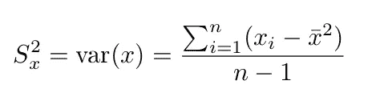

变量 x 的方差。

与测量一维分布的方差不同，协方差测量两个变量相对于彼此的平均值的偏差。换句话说，协方差衡量两个维度之间的关系。

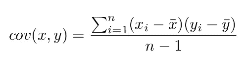

X 和 Y 的协方差

**注:**一个变量与其自身之间的协方差等于该变量的方差，即`cov(x, x)=var(x)`。

## 协方差值的解释

协方差值的符号是解释的组成部分。正值表示两个变量之间的直接关系；也就是说，这两个变量同时增加或减少。另一方面，负协方差值表示变量之间的负关系，即一个变量增加，另一个变量减少，反之亦然。协方差为零表示不存在任何关系；也就是说，这两个变量是独立的。

协方差值的大小(多大或多小)并不重要。它没有解释所考虑的两个变量之间关系的强度。这是因为量值受测量单位的影响。要衡量关系的强度，请使用相关系数。

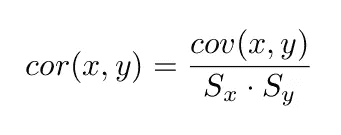

X 和 Y 的相关性

**注意:**相关性只是协方差的一种缩放形式。这意味着缩放数据的协方差等于原始数据的相关性。

对于低维数据(2 和 3 个特征)，可视化更容易，并且可以绘制数据(例如，在散点图上)，并解释关系。然而，在高维数据上，可视化变得复杂，这就是协方差计算变得重要的地方。

# 协方差矩阵

对于 m 维数据，协方差是针对变量和**协方差矩阵中呈现的值的 m×m 组合计算的。**
对于 m 维数据，可以对协方差矩阵中呈现的变量和值的 m×m 个组合计算协方差。例如，对于 X、Y 和 Z 变量的 m=3，协方差矩阵将表示如下。

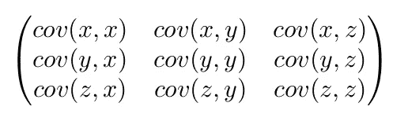

`3×3 covariance matrix for X, Y and Z variables.`

## 此矩阵的属性

*   协方差矩阵沿主对角线对称。这是 be-
    原因，对于任意两个变量`X`和`Y`、`cov(x, y) = cov(y, x)`。
*   变量的方差在主对角线上。记得
    我们说`cov(y, y) = var(y)`为变量`Y`。
*   对于`m`维数据，构建`m × m`协方差矩阵。

# 特征值和特征向量

设`A`是一个`m × m`矩阵，使得

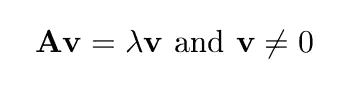

那么`λ`是`**A**`的特征值，`**v**`是与`λ`相关联的`**A**`的特征向量。`v`是非零向量。

**注 1** :矩阵`**A**`必须是正方形。
**注 2** :特征向量根据定义是非零的。

关系`**Av** = λ**v**`意味着`**Av**`和`λ**v**`与原点共线。那
就是，原点的一个非零向量`**v**`经过`**Av**`，如下图所示。

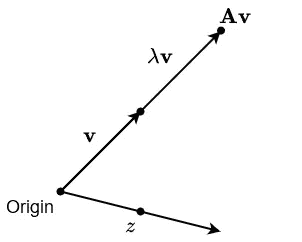

**v** 对于特征值λ是 **A** 的一个特征向量但是 **z** 不是因为
找不到对应的特征值。

给定一个`m × m`矩阵`**A**`，那么我们可以通过公式找到特征值`λ`和特征向量`v`

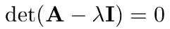

其中`**I**`是`m × m`单位矩阵，`det(**B**)`是矩阵`B`的行列式。

## ***举例(求一个*** `**2 × 2**` **矩阵的特征值和特征向量)**

在这个例子中，我们感兴趣的是寻找`2 × 2`矩阵`**A**`的特征值和特征向量。

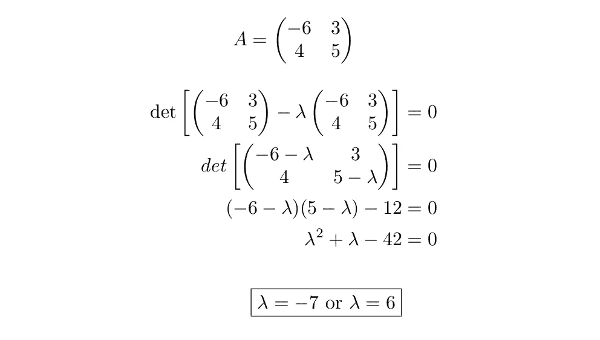

我们得到了两个特征值。接下来的事情就是找到这些特征值对应的特征向量
。我们将使用关系`**Av** = λ**v**`。

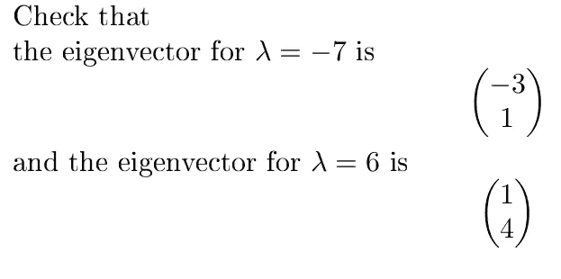

## 特征值和特征向量的性质

*   **只能对方阵**计算特征向量。我的意思是，我们在它的计算中使用行列式，行列式只能对方阵进行计算。
*   **不是所有的方阵都有特征向量。**
*   **关键性质:** **一个对称矩阵的所有特征向量都是正交的**，即垂直/独立。无论维数多少都会发生这种情况(惊讶？我也是)。这个性质是关键的，因为协方差矩阵是对称的，这意味着，通过这个性质，通过 PCA 产生的新变量将是独立的(这将很快清楚)。

现在我们可以继续讨论 PCA 了。


Stephen Dawson 在 [Unsplash](https://unsplash.com?utm_source=medium&utm_medium=referral) 上拍摄的照片

# 主成分分析

对于有`m`个独立变量的数据集，PCA 将在下面的
步骤中实现:

## 步骤 1:数据标准化

这包括将数据转换为所有独立
变量的统一尺度，以便在计算方差等统计数据时进行公平比较。让我解释一下。如果不进行标准化，范围大的变量将支配范围小的变量。例如，如果我们有两个
变量，一个范围为 200–1000，另一个范围为 0–10，
，那么前者将支配后者，导致有偏分析。
数学上，变量`X`中原始值`x`的标准分数
计算如下。


其中`x̄` (x_bar)是平均值，`S`是`X`的标准差。标准差就是前面解释的方差的平方根。标准
分数`z`正态分布，平均值为`0`，标准差为`1`。

## 步骤 2:为标准化数据构建协方差矩阵

如前所述，协方差矩阵将解释数据中任意两个要素之间的关系。此过程用于共线变量。正协方差值表示直接关系(两个变量都增加或减少)。负协方差意味着属性之间的反向关系(一个变量增加，而另一个变量减少，反之亦然)。

如前所述，协方差矩阵是对称的，意味着生成的特征向量是正交的，因此，最终导出的特征是独立的。

这一步相当于计算原始未标准化数据的相关矩阵。

## 步骤 3:计算协方差矩阵的特征值λ和特征向量。

`**λ** = [λ1 , λ2 , · · · , λm ]`是特征值列表，`**V**`是矩阵，第一列是对应于`λ1`的特征向量，第二列是对应于`λ2`的特征向量，依此类推。

## 步骤 4:决定要保留的特征数量。

在这一步中，您将决定我们需要保留的要素数量并生成新要素。可以通过以下方式决定要保留的功能:

*   *任意选择*。例如，如果您对
    可视化的易用性感兴趣，那么您可以使用 2 或 3 个特性来运行它。
*   *使用变化百分比解释*。

对于这些方法中的任何一种，首先按降序对`λ`中的特征值进行排序。
第一个`r`主成分解释的方差比例定义如下

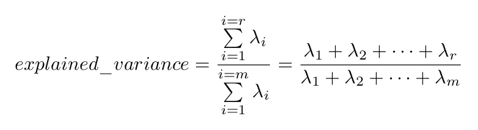

如果原始数据上的特征高度相关，我们需要很少的
主成分，即`r`比`m`小得多。另一方面，如果特征不相关，`r`接近`m`并且 PCA 在特征提取中失去其
重要性。

## 第五步:衍生新特征。

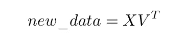

其中`X`是原始缩放特征数据，而`V^T`是基于在步骤`(iv)`中做出的选择的特征向量的
矩阵的转置。这一步是线性代数 中 ***变基的一个概念。如果你想更深入地了解为什么会这样，也许你可以查一下。***

# PCA 实施示例

考虑具有 3 个特征 `x1`、`x2`和`x3`以及 10 条记录的数据集。

**注:**在`[sklearn.decomposition.PCA](https://scikit-learn.org/stable/modules/generated/sklearn.decomposition.PCA.html)`中有一个函数可以用来以更直接的方式实现 PCA。我们将在本文后面使用它，但现在我们将使用其他 Python 包(如 numpy)一步一步地实现 PCA。

代码片段 1:这个代码片段为原始数据生成一个 pandas 数据帧。我们只是用熊猫来以表格的形式显示数据。我的意思是，我们更经常看到表格数据。

实现 PCA 的第一步是缩放数据。这是通过使用代码`snippet 2 below`和显示在`Figure 2 below`中的结果完成的

代码片段 2:使用前面讨论的公式和 zscore 缩放数据集。

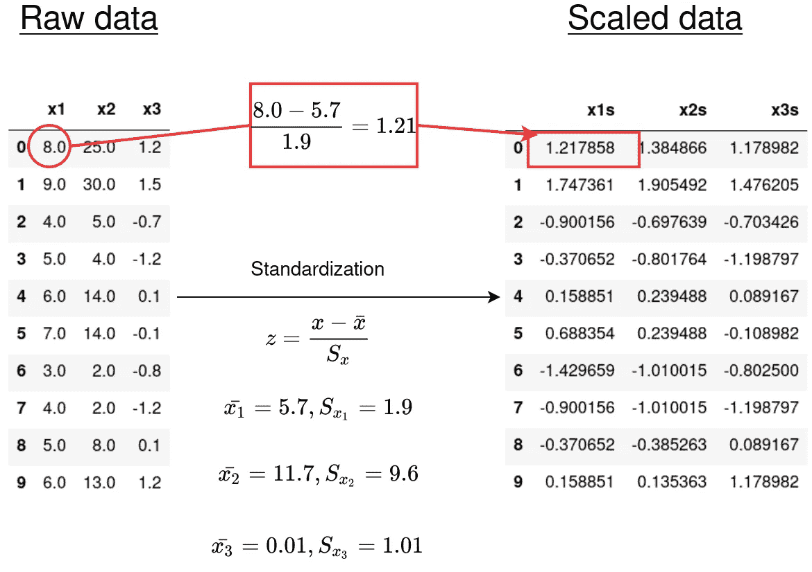

图 2:原始数据和缩放数据。

*第二步:计算协方差矩阵*

在这一步，我们计算协方差矩阵。这个矩阵用于建立变量之间的关系。

代码片段 3:协方差矩阵的计算

下面的输出显示`x1s`和`x2s`为强正相关`(0.96)`和`cov(x1s, x3s)=0.82`和`cov(x2s, x3s)=0.89` ( *不要被这里使用的相关性混淆。缩放数据上的协方差只是相关性*)。

```
array([[1\.        , 0.96240631, 0.82362337],
       [0.96240631, 1\.        , 0.89326123],
       [0.82362337, 0.89326123, 1\.        ]])
```

*步骤 3:协方差矩阵的特征值和特征向量*

在这一步中，我们要生成主成分(特征值)，并建立每个解释的变化比例。

代码片段 4:特征值和特征向量

输出(分类的特征值、分类的特征向量和分别由每个主成分解释的方差比例)

```
sorted_eigenvalues: 
[2.7873923775066234, 0.1864183595384753, 0.026189262954900528]sorted_eigenvectors:
[array([-0.57770188, -0.59193503, -0.56202621]),
 array([-0.57125709, -0.19861728,  0.79637712]),
 array([-0.58303163,  0.78113002, -0.22340551])]variance_explained:
[0.9291307925022081, 0.06213945317949179, 0.008729754318300179]
```

第一个主成分解释了原始数据变化的`92.9%`，第二个主成分解释了`6.2%`，第三个主成分解释了`0.9%`。在这一点上，你现在可以决定主成分的数量。如果你选择前两个，那么它们将解释总共`99.1%`个变量。以下两个图显示了由单个组件和累积解释的变化。

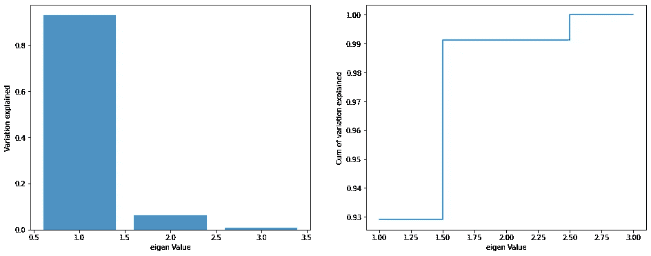

图 3:左—各主成分解释的方差比例，右—解释的累积比例。

*第四步:生成新数据*

最后一步是通过等式`new _ data = np.dot(X,V.T)`生成新数据，其中`X`是原始缩放数据，而`V.T`是根据特征值排序后的特征向量矩阵的转置。

代码片段 5:用一个特性生成新数据。当然，您可以选择生成 2 个甚至 3 个特征的新数据。

输出(z1)

```
[-2.1859,
 -2.967,
 1.3283,
 1.3625,
 -0.2836,
 -0.4782,
 1.8748,
 1.7916,
 0.3921,
 -0.8345]
```

## 使用`sklearn.decomposition`实现 PCA。主成分分析

使用`[sklearn.decomposition.PCA](https://scikit-learn.org/stable/modules/generated/sklearn.decomposition.PCA.html)`功能可将上述所有步骤浓缩如下。

代码片段 6:使用 sklearn 实现 PCA。

输出(2 列 PCA 生成数据的前 5 行):

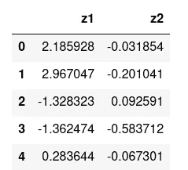

PCA 是一个很好的特征提取工具，但是也有一些缺点。以下是一些例子:

*   PCA 生成的特征可解释性较差。这些特征是原始特征的组合，因此我们无法清楚地解释原始特征如何影响因变量。
*   在降维过程中，PCA 会导致一定程度的数据丢失。然而，这种损失比使用特征消除方法要好。

这就是结尾，我希望这篇文章能让你明白这个概念。

感谢您的阅读:-)