# 主成分分析:你需要知道的一切

> 原文：<https://towardsdatascience.com/principal-component-analysis-everything-you-need-to-know-5f834c9eaa83>

## 👨‍🏫[数学](https://equipintelligence.medium.com/list/mathematics-demystified-7e4d1c18041f)

## 协方差，特征值，方差和一切

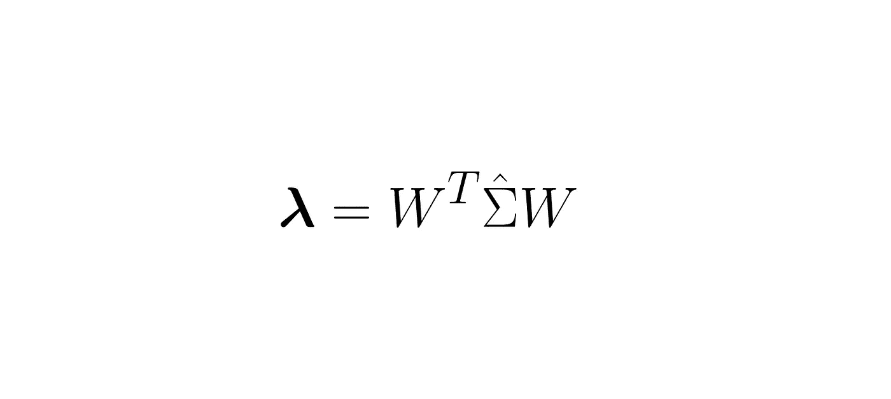

作者图片

主成分分析(PCA)是一种减少数据维度的流行技术，包含在大多数 ML/DS 课程的“无监督学习”部分。有很多博客和 YT 视频一起解释 PCA，那么为什么会有这个博客呢？

## 又一个关于 PCA 的博客？

作为一个更热爱数学的 ML 学习者，我发现 PCA 上的每个博客都不完整。总结我阅读的每一篇博客，我每次只能得出一个结论， *PCA 最大化投影数据点的方差*，我没有任何地方是错误的。但由于我发现到处都只有这种观点，我无法深入这个话题，以了解更多的数学知识以及特征值是如何突然出现的。

作者的故事

我决定认真对待这件事，我收集了书籍、论坛和其他博客来制作我写的这个博客。它包含了不那么简单的数学，但是我保证没有一个概念会让你挠头超过 10 分钟。这个故事是为那些，

*   *好奇想知道 PCA 背后的数学*
*   *了解线性代数概念，如基、矩阵的迹、特征值和特征分解*
*   *了解统计概念，如随机变量、随机向量、方差和协方差*

让我知道你过得怎么样！

## 小小免责声明

这里涉及的数学将使用线性代数和统计学中的大量术语。故事中引入的每一个新术语都将被标记上一个资源，可以参考该术语的更多知识。

# 问题是

PCA 的主要目的是将给定的观察变量(数据)解释成一组潜在变量，使得[潜在变量](https://en.wikipedia.org/wiki/Latent_variable)保留观察变量的大部分信息。

观察变量是那些真实值被测量的变量。考虑一个问题，其中我们被要求对特定股票的价格进行建模，观察变量可以是公司进行的投资、销售、回报和其他可以直接影响股票价格的变量。

“潜伏”这个词的意思是隐藏的或隐蔽的。在我们的例子中，变量不是直接观察到的，而是在观察到的变量上使用的模型的帮助下推断出来的。在相同的股票价格预测示例中，潜在变量可以是某人购买该股票的机会、该股票的未来价格等。

就认证后活动而言，目标是，

> 确定潜在变量，使其包含观察变量中包含的大部分信息。潜在变量的数量应该少于观察变量的数量。

## 为什么我们不能从数据集中去掉一些特征来降低维度呢？

在大多数真实世界的数据集中，要素或观测变量在某种程度上相互依赖。例如，在气象数据集中，降雨量可能取决于也可能不取决于特定地区的温度。如果我们直接删除温度变量，我们可能会丢失特征中包含的一些有用信息。因此，我们需要以这样一种方式转换观察到的变量，即我们可以很容易地从数据集中删除不太突出的特征，同时保留信息。

## 1.寻找数据点的替代表示

首先，我们考虑包含 ***N*** 个样本的数据集，其中每个样本具有 **D** 个特征。我们可以用矩阵 ***X*** 的形式表示我们的数据集，其中每行包含一个样本，每列对应一个特定特性的值。

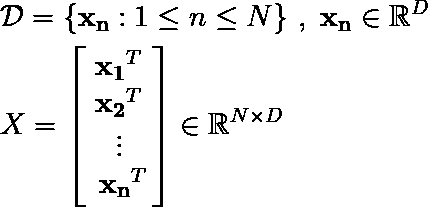

(1)定义我们的数据集和数据矩阵 **X**

在故事的后面部分，我们还会将 ***X*** 视为一个随机向量，

随机向量 X，它的每一次实现都可以被视为一个数据点。

我们认为每个特征都是随机变量。你不需要担心这个，当我们考虑把 ***X*** 作为随机向量时，我会清楚地提到。

> 另外，我们做的一个重要假设是数据点以平均值为中心。我们可以通过从每个样本中减去均值向量来做到这一点，这样得到的数据点就以均值为中心。

我们希望用新的基向量来表示这些数据点。一个[基](https://en.wikipedia.org/wiki/Basis_(linear_algebra))是一组跨越它们周围向量空间的独立向量。更简单地说，基(或基向量)中所有向量的线性组合产生了向量空间中存在的每个向量。新的基础将为特征提供另一种表示，通过这种表示，我们可以很容易地去掉不太重要的特征。通过选择新的基，我们还需要新的坐标来表示数据点。

这些基向量很特别，因为我们可以选择需要多少基向量，来得到想要的维数。但是，我们需要仔细选择这些基准，以便它们能使*几乎与*完全相同的数据点，而没有任何*相当大的损失*。为了建立这样一个基础，我们需要，

*   [标准正交基](https://en.wikipedia.org/wiki/Orthonormal_basis)以替代方式表示数据点(如上所述)。基向量的数量等于向量空间的维数，所以在我们的例子中，我们需要*个基向量。我们的新基将跨越我们的数据点所在的相同向量空间。所以，在新的基中，我们会有 **D** 向量。*
*   *[坐标](https://en.wikipedia.org/wiki/Coordinate_vector)用新的标准正交基唯一地表示每个数据点 ***x_i*** 。*

*我们可以在 D 维空间中定义新的标准正交基，*

*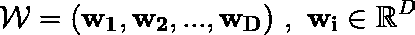*

*(2)定义一个新的标准正交基。标准正交基意味着基向量彼此正交，并且具有单位幅度。*

*将所有这些正交向量收集到一个矩阵中，其中每列包含一个向量，我们剩下一个[正交矩阵](https://en.wikipedia.org/wiki/Semi-orthogonal_matrix)(它有一些有用的属性，我们将在后面的部分中探讨)，*

*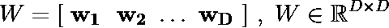*

*(3)将新的标准正交基装入矩阵 **W** 中。该矩阵将是正交矩阵，其性质将被进一步利用。*

*接下来，我们需要一些坐标或权重，它们可以乘以新的基来表示数据点。坐标和基向量的加权组合不会精确地表示数据点，但是我们希望得到良好的近似，*

*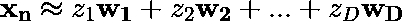*

*(4)将数据点表示为新基向量的加权组合。*

*对于所有的 ***N*** 数据点，坐标将是不同的，因此在矩阵向量符号中移位是有益的，*

*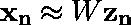**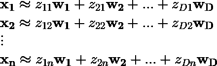*

*(5)对于矩阵向量符号中的所有数据点，写出表达式(4)*

## *2.寻找最佳参数*

*我们希望使用新的基和坐标来获得我们的数据点的近似。为了测量数据点 ***x*** 及其近似 ***Wz*** 的“*接近度*，我们计算所有 ***x-Wz、*** 的平方 [L2 范数(欧几里德范数)](https://mathworld.wolfram.com/L2-Norm.html)的平均值*

*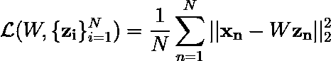*

*(6)定义一个目标函数，最小化它，我们使用 **z** 和 w 获得数据点 **x** 的“最佳”近似。*

*函数 ***L*** 的值越低(函数 ***L*** 的值是一个标量)，我们得到的近似值就越好。所以，现在我们的问题进入最优化理论，其中我们需要确定为***【L】***给出最低值的 ***W*** 和*的值。我们可以计算***L***w . r . t .***z _ n***的导数，并使其等于零。**

> **下一步，我们要计算目标函数 w.r.t .对向量的偏导数。如果你对矩阵演算不太熟悉，你可以参考这些[笔记](https://atmos.washington.edu/~dennis/MatrixCalculus.pdf)，其中包含一些有用的结果及其推导。**

**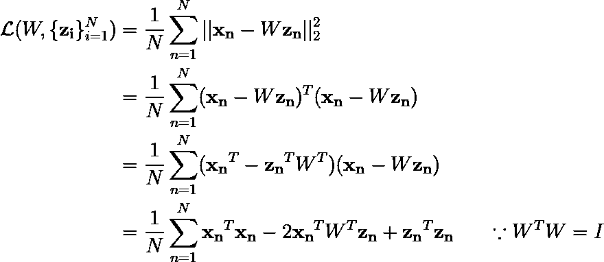**

**(7)根据矩阵/向量乘积重写 L2 范数。简单来说，考虑到欧几里得空间，向量的 L2 范数就是它的大小。**

**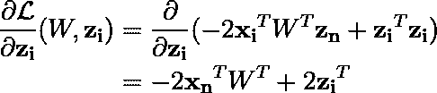**

**(8)计算函数 **L** w.r.t **z_i.** 的偏导数这里， **z_i** 保存数据集中某个数据点 **x_i** 的坐标。**

**正如所承诺的，在(7)的最后一步中，我们使用了正交矩阵的一个优良特性。接下来，我们将(8)中得到的偏导数等于零，从而根据 ***W*** 和 ***x*** 得到 ***z*** 的最优值。**

**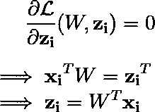**

**(9)使偏导数等于 0，从而得到在函数 **L** 的全局最小值处 **z_i** 的值。**

**正如你可能观察到的，当 ***z_i*** 等于数据点 ***x_i*** 乘以 ***W*** 矩阵的转置时，得到目标 ***L*** 的最小值。作为我们目标函数表达式中的第一项，σ***x_n^t x _ n，*** 是一个常数，我们可以把它去掉，继续展开项σ***z_n^t z _ n，*****

**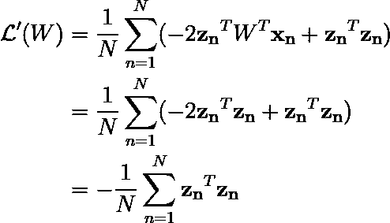**

**(10)去掉常数项，代入(9)的结果，这样我们得到一个仅用 **z** 表示的表达式。**

**z 和 W 之间的关系从(9)中是显而易见的，但是我们需要熟练地使用它来获得想要的结果，**

**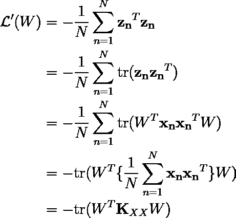**

**(11)使用跟踪算子的性质，我们能够根据数据点的协方差矩阵来减少我们的目标函数**

**在上面的评估中，我们有跟踪操作符的一些[属性，](https://en.wikipedia.org/wiki/Trace_(linear_algebra)#Basic_properties)**

**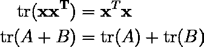**

**(12)我们在(11)中使用的跟踪算子的一些性质**

**这里有必要使用 trace 运算符，因为它将帮助我们得出一个重要的结果，通过这个结果可以计算出 ***W*** 的最佳值。此外，我们还利用了统计学的一个重要结果，**

**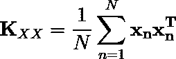**

**(13)表示为数据点的外积总和的经验协方差矩阵。**

**[经验协方差矩阵](https://www.cuemath.com/algebra/covariance-matrix/) ***K_XX*** 是保存随机向量中包含的不同随机变量对之间的协方差的矩阵。乍一看，该表达式可能看起来不可信，但您可以通过考虑将产生 2 * 2 协方差矩阵的 2D 数据点来验证它。**

**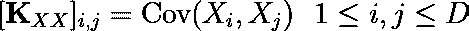**

**(14)随机向量 x 的协方差矩阵。在(13)中，我们用数据点数值计算它。**

**协方差矩阵也是对称的，我们可以很容易地从(14)中计算出来。[对称矩阵还拥有一些漂亮的特性](https://www.doc.ic.ac.uk/~ae/papers/lecture05.pdf)比如，**

*   **对称矩阵有实特征值，所以没有复杂的东西！**
*   **相应的特征向量彼此正交。它们可以作为向量空间的优秀基，称为特征基(希望你得到了提示！**

**为了确定 W 的最佳值，我们可以建立一个拉格朗日函数，**

**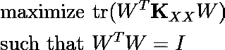****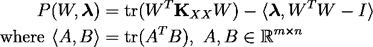**

**(15)定义拉格朗日目标，以最大化函数**L’**的值。**

**在(11)中，观察到最大化轨迹将导致最小化***L’***。在我们的优化问题中，我们对 ***W*** 只有一个约束，那就是它的正交性。为了在拉格朗日乘数的上下文中保持定义良好，我们在上面的表达式(14)中定义了矩阵内积，**

**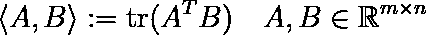**

**(16)矩阵内积( [Frobenius 内积](https://en.wikipedia.org/wiki/Frobenius_inner_product))**

**它被称为 [Frobenius 内积](http://Frobenius_inner_product)，它采用两个矩阵并返回一个标量(所有内积的典型属性)。矩阵λ将是包含乘数的方阵，**

**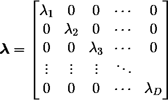**

**(17)矩阵 ***λ*** *包含* ***W*** *中每个向量的拉格朗日乘数。***

**继续，我们计算目标***P***W . r . t .***W***的偏导数，并使其等于零，以获得 ***λ*** 的值。**

**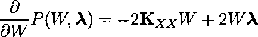****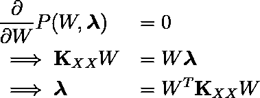**

**(18)使 P 的偏导数等于零。通过这样做，我们观察到 ***λ*** *是具有经验协方差矩阵*的特征值的对角矩阵**

**上面的表达式为我们提供了迄今为止最美丽的结果，我们将在这里等待欣赏它的美丽。**

**线性代数中的[谱定理](https://brilliant.org/wiki/spectral-theorem)说对称矩阵是可对角化的。它仅仅意味着一个对称矩阵可以通过使用一些其他的特殊矩阵转换成一个对角矩阵(其中元素只位于矩阵的主对角线上)。可对角化是一个很好的性质，因为它大大减少了各种其他有用的性质，如行列式，迹等的计算。一个对称矩阵 ***一个*** 是可对角化的，比如，**

**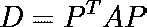**

**(19) [对称实矩阵 **A** 的对角化](https://en.wikipedia.org/wiki/Diagonalizable_matrix#Diagonalization)**

**其中 ***D*** 是从 ***A*** 导出的对角矩阵。 ***D*** 的元素是矩阵 ***A*** 的实特征值。矩阵 ***P*** 的列包含矩阵 ***A*** 的特征向量。由于矩阵 ***A*** 是对称的，其特征向量相互正交，因此矩阵 ***P*** 也是正交的。**

**回到表达式(18)，**

**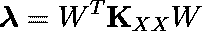**

**(20)因为我们的数据点的协方差矩阵也是实对称矩阵，所以它是可对角化的。这里的 ***λ*** *是一个对角矩阵。***

**协方差矩阵 ***K_XX*** 是对称的，所以对角矩阵 ***λ*** 包含协方差矩阵的特征值 ***W*** 包含归一化的特征向量。所以，最后我们得到了标准正交基 ***W*** 和坐标 ***z*** as，**

**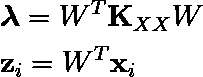**

**(21)我们得到的关于 **W** 和 **z** 的最终结果。**

**我们的目标是为数据点找到一种新的表示方法，以便可以轻松地删除这些特征。此外，我们还讨论了为什么这些特性不能轻易删除，因为它们是相互依赖的。我们在步骤(2)和(3)中所做的是，我们试图使这些特性相互独立，这样我们就可以轻松地选择它们，而不用担心它们之间的依赖性。这不仅仅是一个想法，而是我们用步骤(2)和(3)从数学上证明了它。**

**让我们回到过去，我们会意识到两个随机变量*之间的协方差大约*捕获了变量之间的相关性。如果两个变量是独立的，协方差为零。**

**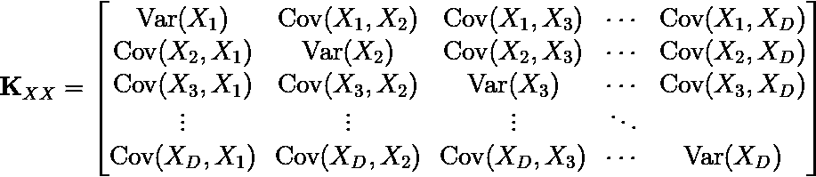**

**(22)协方差矩阵 **X** ，其中 **X** 为随机向量。 **X_1** 、 **X_2** 、…、 **X_D** 是表示为随机变量的特征。注意，在(18)中，该矩阵被转换成对角矩阵，从而将非对角元素设置为 0，即特征之间的协方差。**

**在表达式(21)中，我们已经将协方差矩阵 ***K_XX*** 表示为对角矩阵。在协方差矩阵中，所有非对角元素表示随机变量或特征对之间的协方差。通过将协方差矩阵转换为对角矩阵，我们已经破坏了特征/随机变量之间存在的所有协方差。我们已经尝试让每个特性独立，这样我们就可以使用合适的标准轻松地对它们进行排序，而不用太担心内部的依赖性。**

> **通过最小化函数 ***L*** ，我们已经认识到数据点 ***x_i*** 的最佳近似可以通过将数据点的基变换为新的基，即*特征基*来获得！**

## **3.缩小尺寸(去除特征)**

**到目前为止，我们已经找到了一个新的基础来表示数据点，这样我们就可以很容易地分离特征，而不用考虑一个特征对另一个特征的依赖性。但问题是，我们应该放弃哪些功能？我们需要一些标准来从数据集中保留最好的 ***K*** 特征。**

**对于 PCA，我们将选择具有较高方差的特征。简单的逻辑是，具有低方差的特征与常数一样好，并且对响应变量几乎没有影响。这里有一个[关于同一主题的交叉验证](https://stats.stackexchange.com/a/489031/323037)的好讨论。这也是为什么您可能会注意到`sklearn.feature_selection`模块中的`VarianceThreshold`选择特性的方差大于给定阈值的原因。正如我们前面讨论的，我们的数据的协方差矩阵 ***K_XX*** 在新基中看起来像一个对角矩阵，**

**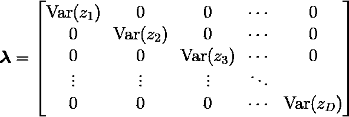**

**(23)变换后的数据点的协方差矩阵是一个对角矩阵，因为我们已经破坏了**

**对于上面的表达式，我们将 ***z*** (转换后的数据点)视为一个随机向量，**

**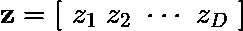**

**协方差矩阵的对角线包含特征的单个方差。因此，特征值对应于变换数据点的方差，我们希望选择顶部的 ***K*** 特征值。同样，从矩阵 ***W*** 中，我们将选择相应的 ***K*** 特征向量，并最终使用它们来变换数据集。**

**因此，我们将选择 ***K*** 特征向量，其中每个特征向量的维数为 ***D*** ，并将它们打包成矩阵 ***W_K，*** 转置它，并与每个数据点 ***x_i*** 相乘，以获得更低维的表示 ***z_i*** ，**

**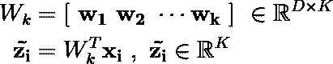**

**当我们选择 ***K < D*** (数据的实际维度)时，我们将得到数据点的近似值，而不是它在新基中的精确表示，这只是因为我们抛弃了来自 ***W*** 的基向量。这就是我们如何通过以一种聪明的方式剥离特征来减少数据的维度。**

**这都是关于主成分分析及其在降维中的作用。**

# **怒发冲冠！那是一大堆数学！**

**作者的其他故事**

**我希望这个故事提供了主成分分析的全貌，以及它与协方差、特征向量和维数约简的关系。在那之前，继续学习数学，祝你有美好的一天(如果你坚持到这里)！**