# 主成分分析

> 原文：<https://towardsdatascience.com/principal-component-analysis-fbce2a22c6e0>

## PCA 的概念性解释及其背后的数学原理的逐步演示。Python 和 R 中结果的可视化


丹尼尔·罗伯特在[的照片](https://pixabay.com/sv/photos/prisma-ljus-spektrum-optik-6174502/)

在本主成分分析指南中，我将给出 PCA 的概念性解释，并提供一步一步的演练，以找到用于计算主成分和主成分得分的特征向量。我还将展示我们如何使用 Python 和 R 中的 *sklearn* 在 iris 数据集上执行小 PCA 后找到并可视化结果。在 R 中使用 *factoextra* 和 *gglot2* 包可视化 PCA 结果非常容易。

1.  什么是主成分分析
2.  PCA 背后的数学:如何计算主成分
3.  解释 PCA 的结果
4.  Python 中的主成分分析
5.  使用 ggplot2 和 factoextra 可视化 R 中的 PCA 结果

该指南以笔记本的形式提供，其中包括更多 python 代码，用于本 [Github repo](https://github.com/TalkingDataScience/Principal_Component_Analysis) 中的所有计算和绘图。repo 还包含一个笔记本，其中包含 r 中的 PCA 和可视化。

# 1.什么是主成分分析

主成分分析可以作为一种降维技术，我们可以形成新的变量，这些变量是原始变量的线性组合。如果您正在进行回归建模，并且数据中存在多重共线性，这也是一种有用的技术。多重共线性可能导致参数的高标准误差，从而导致不可靠的估计值。主成分分析将形成不相关的新变量。

## 1.1 PCA 的几何表示

在进入主成分分析的数学之前，查看 PCA 的几何表示可能有助于获得概念上的解释。希望它能帮助我们将数学计算与主要成分的不同元素联系起来。考虑下面的图表，它显示了一些我们想要找出主要成分的数据。

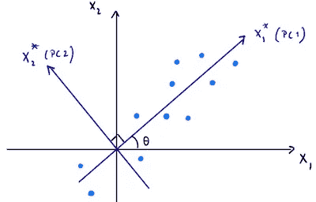

作者图片

如果我们观察数据点，很明显 X1 和 X2 都不是获取数据最大方差的轴。获得最大方差的轴是 X1*，这是我们在主成分分析中想要识别的备选轴。这个新的轴将成为我们的第一个主要组成部分。原始数据点在 X1*上的投影将是数据点相对于这个新 X1*的坐标。

在上面的图中，我们让 X1*是二维平面中的任意轴，与轴 X1 成θ度角。点相对于新轴的坐标是点相对于原始轴的坐标的线性组合:

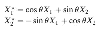

由新轴 X1*捕获的总方差的百分比将根据角度θ的度数而变化。这意味着有且只有一个备选轴会产生一个新变量，该变量保留数据中的最大方差。这个新轴不能解释数据的所有方差，所以我们需要确定第二个新轴，X2*。与 X1*正交的第二个轴将说明 X1*未捕捉到的最大方差。我们可以认为 PCA 是将轴旋转到一个位置，使新的轴能够捕获数据中的最大方差。

## 1.2 需要牢记的重要概念

从 PCA 的几何表示中，我们可以得出一些重要的观察结果:

*   当我们旋转轴时，二维空间中数据点的方向不会改变。这意味着观察值可以相对于原始轴或新轴来表示，而不会丢失任何信息。
*   新轴𝑋1*和𝑋2*是我们的**主成分**，新变量的值是我们的主成分**分数**，我们的转换数据。
*   新变量 X1*和𝑋2*是我们原始特征𝑋1 和𝑋2 的线性组合，它们保持均值校正(或标准化，取决于我们使用的数据中心化方法)。
*   新变量的总方差与原始变量相同。
*   新变量的相关性为零。换句话说，主成分之间不会有多重共线性。

上面的几何表示只有两个变量，因为很难说明更高的维度。然而，该方法可以很容易地扩展到任何数量的变量 *p* 。具有 *p* 个变量的数据集可以在 *p* 维空间中表示，具有 *p* 原始轴和 *p* 新轴，使得:

*   每个新变量都是原始变量的线性组合。
*   选择第一个新变量来获取数据集中的最大方差。
*   第二个将说明第一个没有捕捉到的最大方差。
*   第 p 个*新变量将解释 P1 个新变量未捕捉到的数据中的最大方差。*
*   新变量不相关。

在下一节中，我们将找到新的轴，并手动计算主成分。我们将从变量的协方差矩阵计算特征向量，这给出了用于形成上述方程的权重 w_𝑖𝑗(这是我们的主分量):

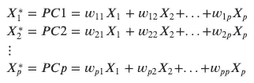

其中 X1，X2，…，Xp 是 p 个主成分，w_ *ij* 是第 *i* 个主成分的第 *j* 个变量的权重(特征向量)。

# 2.主成分分析的数学:如何计算主成分

在第一部分中，我们将研究 PCA 背后的数学，我们将创建一个小的虚拟数据集，小到足以用手轻松地进行计算。数据集将包含两个要素 X1 和 X2 以及七个观测值。

```
# Create a small datasetdata = pd.DataFrame({'X1':[110, 112, 112, 114, 116, 116, 118], 
                     'X2': [179, 180, 181, 182, 182, 184, 186]})
```

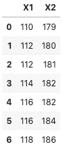

作者图片

## 2.1 将数据居中

在进行主成分分析之前，我们可以对数据进行均值校正或标准化，并且要记住，主成分分析的结果可能会受到我们使用的方法的影响。使用均值校正数据将允许单个变量的相对方差影响用于计算主成分的权重。方差相对于其他变量较高的变量将获得较高的权重，方差相对于其他变量较低的变量将获得较低的权重。如果我们把数据标准化，每个变量的方差都是一样的(均值 0，std/var 1)。

方法的选择可能取决于数据和分析的目的等因素。例如，如果我们要查看消费者价格指数的食品价格，不同食品项目的方差可能会有很大差异。在下面的主成分中，由于较高的方差，鳄梨比其他食物项目具有更高的影响。如果我们没有理由相信对于一个家庭来说，鳄梨比其他食物更重要，我们应该将数据标准化，以避免这种人为增加的鳄梨重量。

*PC1 = 0.13 *牛肉+0.85 *牛油果+0.04 *大米+0.36 *牛奶*

可能还有其他情况，我们有理由相信特征的方差确实表明了某些特征的重要性，在这些情况下，我们可以使用均值校正数据，并允许对某些因素产生更高的影响。

对于我们的计算，我们将使用平均校正数据。均值校正数据仅仅意味着我们从变量的每个观察值中减去变量的均值:

```
*# Center the data with mean-correction* data_centered = data.apply(lambda x: x-x.mean())
```

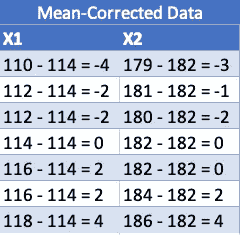

作者图片

我们可以绘制原始数据和居中数据的数据点，我们可以看到，将数据居中并不影响数据点的方向，只是轴的比例发生了变化。我们将数据集中在原点周围，这将有助于我们在旋转轴寻找主分量时的计算。

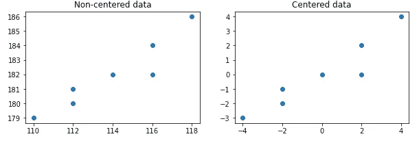

作者图片

## 2.2 计算协方差矩阵

我们将使用的方法是协方差矩阵的特征分解，因此我们首先需要计算的是协方差矩阵。协方差矩阵由每对变量的协方差组成，每个变量的方差在主对角线上。

数据居中不会影响要素的方差或协方差。非居中和居中数据的协方差矩阵是相同的。我们可以检查情况是否如此:

```
*# Print values of the non-centered data and its covariance matrix*
non_centered = np.stack((data['X1'], data['X2']), axis=0)
cov_mat = np.cov(non_centered)
print(non_centered)
print(cov_mat)*# Print values of the centered data and its covariance matrix*
centered = np.stack((data_centered['X1'], data_centered['X2']), axis=0)
cov_mat_centered = np.cov(centered)
print(centered)
print(cov_mat_centered)*Output:*[[110 112 112 114 116 116 118]
 [179 180 181 182 182 184 186]]
[[8\.         6.33333333]
 [6.33333333 5.66666667]][[-4\. -2\. -2\.  0\.  2\.  2\.  4.]
 [-3\. -2\. -1\.  0\.  0\.  2\.  4.]]
[[8\.         6.33333333]
 [6.33333333 5.66666667]]
```

## 2.2.1 每个特性的差异

矩阵的对角线包含每个特征 X1 和 X2 的方差。差异的计算公式如下:

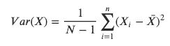

由于居中数据的平均值为 0，我们可以简单地将变量的平方值相加。

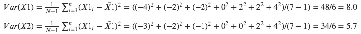

## 特征的协方差

两个变量 X1 和 X2 之间的协方差通过以下公式计算:

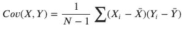

我们可以找到 X1 和 X2 的协方差。同样，由于居中数据的平均值为 0，我们可以将 X1 和 X2 中的值相乘并求和。

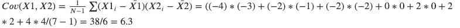

计算 X1 和 X2 的方差和协方差显示了 Python 中的`np.cov()`函数打印的相同结果。我们可以看到，X1 的方差大于 X2，协方差介于 X1 和 X2 的方差之间。

```
[[8\.         6.33333333]  
 [6.33333333 5.66666667]]
```

## 2.3 计算协方差矩阵的特征值

现在我们有了协方差矩阵，我们可以继续计算特征值。在下面的行列式公式中，我们将协方差矩阵表示为 *A* ，将单位矩阵表示为 *I* 。

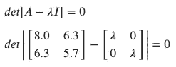

从协方差矩阵中减去λ÷I 矩阵得到以下矩阵

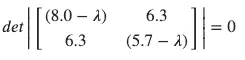

我们可以继续计算它的行列式

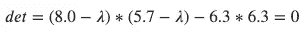

简化后，我们得到这个二次方程

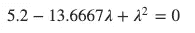

求解 0，我们得到𝜆1=0.39 和λ2=13.27，这些是我们协方差矩阵的**特征值**。

## 2.4 计算特征向量

一旦我们有了特征值，我们就可以计算这些特征值对应的特征向量。一个特征向量是一个非零向量，它满足方程𝐴𝑣=𝜆v.计算协方差矩阵的特征向量，我们使用这个方程，把协方差矩阵代入𝐴，把其中一个特征值代入λ，并把它们与列向量𝑣=(𝑥,𝑦).相乘我们从特征值λ=13.27 开始:

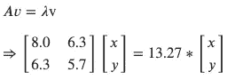

我们得到下面的方程组:

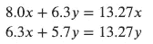

我们将第一个等式中的 8.0x 项和第二个等式中的 5.7y 项移到等式的右侧，求解 y，得到 y = 0.83x:

𝑦 = 0.83𝑥
0.83𝑥 = y

如果将 x 设为 1，y 将为 0.83，从而得到特征向量𝑣_2:

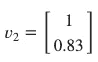

这是协方差矩阵的**特征向量**。我们使用以下公式将向量归一化为单位长度，这意味着它的长度为 1:

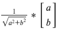

归一化后，特征向量 v_2 是这样的。

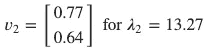

如果我们对另一个特征值𝜆1=0.39 做所有的计算，我们得到另一个特征向量 v1:

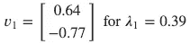

## 2.5 计算主成分和主成分得分

我们将最大特征值的特征向量先λ1>λ2 重新排序。

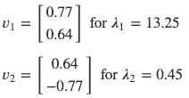

这些特征向量现在可以用来转换数据，计算主成分。特征向量包含表示形成主分量的等式中的权重 w_ *ij，*的值。


我们将这两个特征向量放在一个矩阵 E 中，这样我们可以使用矩阵乘法将所有主成分的特征向量与整个原始数据集相乘。第一列表示具有最高特征值的第一特征向量，第二列是具有第二高特征值的第二特征向量。


这个矩阵现在可以用来转换我们的中心数据，存储在矩阵 D，通过乘以它们。

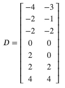

当我们将原始中心数据乘以特征向量时，我们得到新的矩阵 DE，它包含转换后的数据、我们的**主成分、**和我们的**主成分得分**。

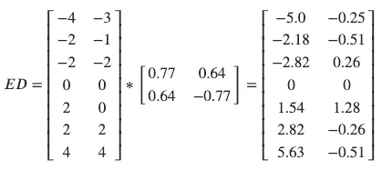

新矩阵 *DE* 包含我们的主成分，其中每一列都是一个主成分。左栏是我们的第一个主成分，PC1，捕捉数据中的最大方差，右栏是第二个主成分，PC2。

这些变换后的数据点的值就是主成分得分**。**这些分数表示主成分空间中的居中数据，因为它们已经被投影到旋转轴，从而最大化沿着第一主成分的轴的方差。从分值可以看出，PC1 的方差比 PC2 大得多。

这两个新变量是不相关的。

# 3 解释主成分分析的结果

## 3.1 视觉比较:绘制 PCA 前后的数据点

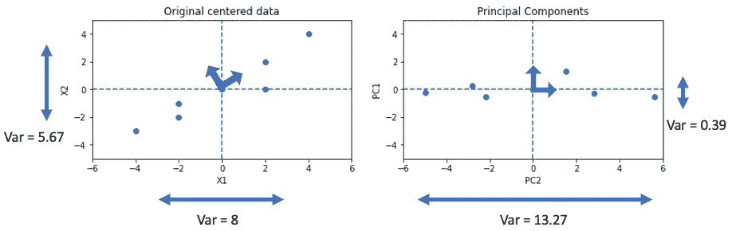

作者图片

如果我们通过观察数据点如何落在新旧轴上来比较原始数据和主成分的方差，我们可以看到第一主成分 PC1 包含比原始特征 X1 多得多的方差。

## 3.2 数值比较:PCA 前后的方差和协方差

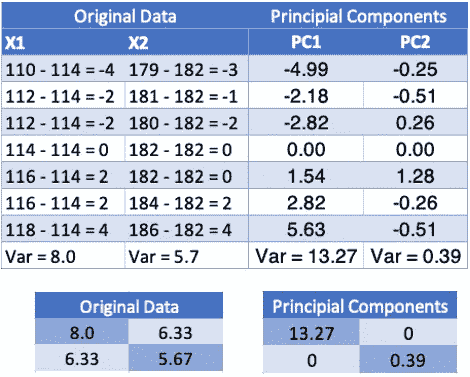

作者图片

如果我们观察我们的变换数据的协方差矩阵，我们可以看到主成分 1 和主成分 2 的方差分别是 13.27 和 0.39，并且它们之间没有相关性。

这里需要注意的是，主成分的*方差是我们之前根据原始数据的协方差矩阵计算的特征值*。完成主成分分析后，您将查看特征值，以帮助确定提取多少主成分用于数据的进一步分析/建模。特征值用于生成碎石图。

variance=𝜆1/(𝜆1+𝜆2)=13.27/(13.27+0.39)=0.97 的百分比

转换后，第一个主成分捕获了数据中所有方差的 97%。原始数据中的特征 X1 仅捕获了 58%的变化。

通过进行这种主成分变换，我们获得了两大好处。我们已经消除了两个要素之间的多重共线性问题，并且最大化了较少要素的方差，以便减少模型/分析中包含的要素数量。

## 3.3 加载和评分

负载是原始特征和新的主成分之间的相关性。载荷给出了原始变量对形成主分量有多大影响的指示。

如前所述，分数是原始数据乘以特征向量后得到的转换数据。可以绘制分数图，以便对结果进行进一步分析。它们可能给出具有相似性的数据点的集群的指示。更常见的是，它们将被用作进一步多变量分析和建模的输入数据，例如分类或回归。

# 4.Python 中虹膜数据集的主成分分析

在对数据执行 PCA 之后，您可以使用下面的代码访问结果。

**分数**
`pca.transform(data)`将数据转换成 PCA 分数

**载荷**
`pca.components_`将打印载荷。如果你希望每个主成分的载荷以列的方式显示，你可以请求转置`pca.components.T`

**各主成分的方差(特征值)**
`pca.explained_variance_`

**解释方差比例**
`pca.explained_variance_ratio_`

```
import pandas as pd
import numpy as np
import matplotlib.pyplot as plt
from sklearn.decomposition import PCAimport plotly.express as px
import plotly.io as pio
import plotly.graph_objects as go
```

## 4.1 导入和缩放数据

```
*# Import iris data set and drop Id column*
iris = pd.read_csv('Iris.csv')
iris = iris.drop('Id', axis=1)*# Store label in y*
y = iris.pop('Species')*# Store column names*
col_names = iris.columns*# Center data*
iris_centered = scale(iris)
```

## 4.2 执行 PCA 并将分数存储在数据帧中

```
*# Perform PCA on centered iris data*
pca = PCA()
pca.fit(iris_centered)
iris_scores = pca.transform(iris_centered) # pca.transform gives the scores*# Convert scores to a data frame*
iris_scores_df = pd.DataFrame(iris_scores)
iris_scores_df = iris_scores_df.set_axis(['PC1', 'PC2', 'PC3', 'PC4'], axis=1)*# Add labels to score data frame for plotting*
iris_scores_df = pd.concat([iris_scores_df, y], axis=1)
iris_scores_df.head()
```

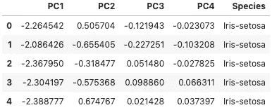

作者图片

## 4.3 每个主成分(特征值)的方差和累积方差

如前所述，我们首先要看的是每个主成分保留了多少数据方差，更有趣的是，总方差的比例。我们使用`pca.explained_variance_ratio.`访问方差的比例，我们可以将这些值与累积比例一起存储在数据框中，以便绘图。

```
*# Proportion of variance each principal component*
prop_variance = pca.explained_variance_ratio_
prop_variance_df = pd.DataFrame(prop_variance, columns=['Proportion of Explained Variance'])*# Add cumulative proportion of variance*
cumulative_prop = np.cumsum(np.round(prop_variance, decimals=4))
cumulative_prop_df = pd.DataFrame(cumulative_prop, columns=['Cumulative Proportion of Variance'])*# Combine into one dataframe*
pc_df = pd.DataFrame(['PC1', 'PC2', 'PC3', 'PC4'], columns=['Principal Component'])
variance_df = pd.concat([pc_df, prop_variance_df, cumulative_prop_df], axis=1)
variance_df
```

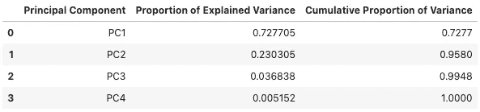

作者图片

## 4.4 碎石图

选择主成分数量的一个常用方法是绘制方差百分比，并寻找一个拐点。这个图被称为碎石图。

```
*# Plot proportion of explained variance*
fig = px.line(variance_df, x = 'Principal Component', y='Proportion of Explained Variance',
              text='Proportion of Explained Variance', width=600)fig.update_traces(texttemplate='%{text:.3f}')
fig.update_layout(title_text='Proportion of Explained Variance')
fig.show()
```

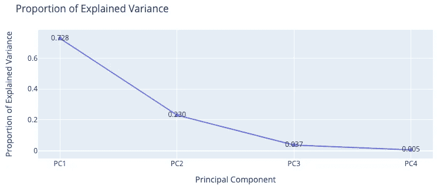

作者图片

我们也可以用柱状图表示方差的比例，并将累积方差加在一条线上。

```
*# Plot proportion of variance in bars and cumulative proportion in line*fig = go.Figure()*# Plot explained variance*
fig.add_trace(
    go.Bar(
        x=variance_df['Principal Component'],
        y=variance_df['Proportion of Explained Variance'],
        marker=dict(color='Blue')
    )
    )*# Plot cumulative variance*
fig.add_trace(
    go.Scatter(
        x=variance_df['Principal Component'],
        y=variance_df['Cumulative Proportion of Variance']
    )
    )fig.show()
```

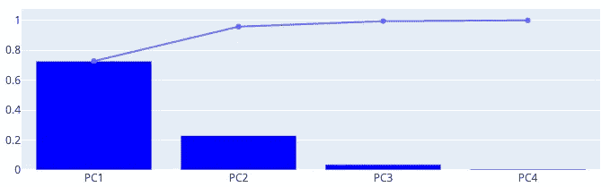

## 4.5 分数图

我们还可以绘制分数图来进一步解释结果。iris 数据集是一个很好的例子，因为它显示了不同物种的不同聚类。

```
# 3d scatter plot with scores of the first 3 principal components
fig = px.scatter_3d(iris_scores_df, x='PC1', y='PC2', z='PC3', color='Species', symbol='Species', opacity=0.6)fig.update_layout(template='seaborn')fig.show()
```

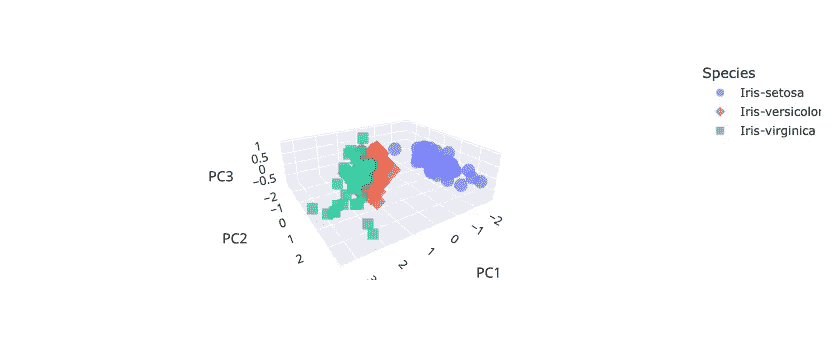

# 5.在 R 中可视化 PCA 结果

r 有一个名为 *factoextra* 的有用软件包，可以帮助提取和可视化多变量分析的结果，包括主成分分析。我将包括几个图表，以简洁的方式显示分数和加载。r 允许以一种非常简单紧凑的方式运行 PCA 并提取结果。让我们在绘图之前快速地看看结果是如何被访问的。

```
*# Perform PCA and store PCA object in iris_pca*
iris_pca <- prcomp(iris, scale=TRUE)
```

执行 PCA 后，您可以使用`str(PCA_object)`来查看 PCA 对象包含的内容。简单地打印对象将显示主成分的标准偏差和特征向量。

```
*# Printing the pca object which will show the eigenvectors*
iris_pca*Output:*Standard deviations (1, .., p=4):
[1] 1.7061120 0.9598025 0.3838662 0.1435538

Rotation (n x k) = (4 x 4):
                     PC1         PC2        PC3        PC4
SepalLengthCm  0.5223716 -0.37231836  0.7210168  0.2619956
SepalWidthCm  -0.2633549 -0.92555649 -0.2420329 -0.1241348
PetalLengthCm  0.5812540 -0.02109478 -0.1408923 -0.8011543
PetalWidthCm   0.5656110 -0.06541577 -0.6338014  0.5235463
```

打印摘要将显示每个主成分的标准差、方差比例和累积方差比例。

```
*# Print summary to show st.dev, proportion of variance and the cumulative proportion of variance of each principal component*
summary(iris_pca)*Output:*Importance of components:
                          PC1    PC2     PC3     PC4
Standard deviation     1.7061 0.9598 0.38387 0.14355
Proportion of Variance 0.7277 0.2303 0.03684 0.00515
Cumulative Proportion  0.7277 0.9580 0.99485 1.00000
```

分数作为 x 变量存储在对象中。

```
*# Get the scores using dollar sign (X_pca$x) and store scores in a dataframe for plotting in ggplot2*
scores_df <- as.data.frame(iris_pca$x)*# Add column with species to the scores_df*
scores_label <- cbind(scores_df, data$Species)
```

## 5.1 碎石图

factoextra 包允许我们通过简单地将 PCA 对象传递给`fviz_eig()`来绘制 scree 图。

```
*# Scree plot showing the proportion of variance of the principal components*
fviz_eig(iris_pca)
```

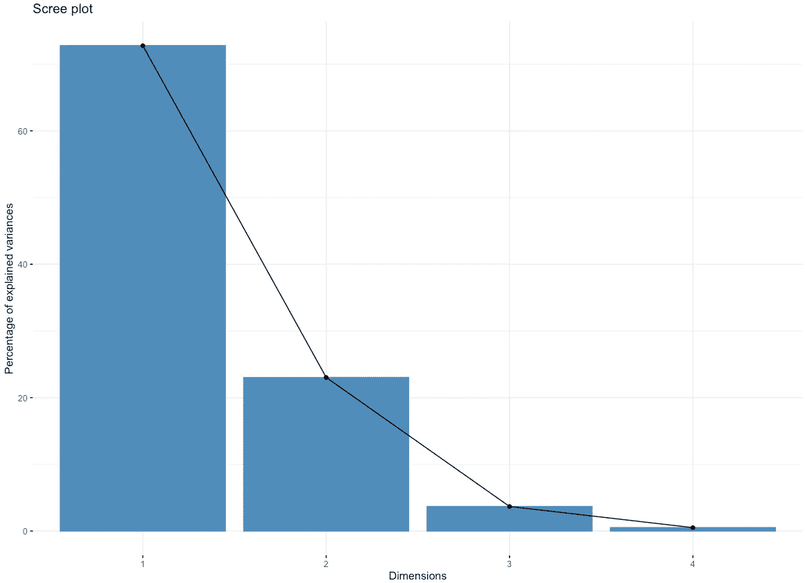

作者图片

## 5.2 情节得分

在 python 图中，我们看到了分数的 3D 图。在这里，我们将看看 2D 的几个地块。

```
*# Graph of individuals, similar observations are grouped closer together.*
fviz_pca_ind(iris_pca,
            col.ind = 'cos2',
            repel = FALSE)
```

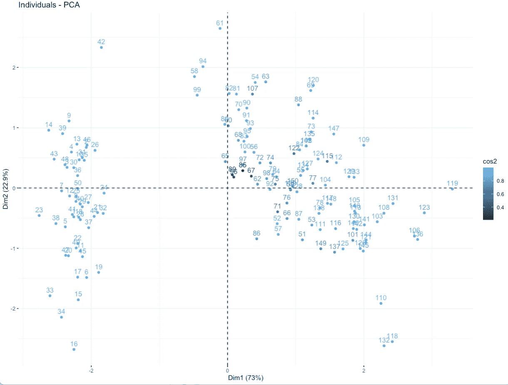

作者图片

我们还可以包括用 ggplot2 绘制的分数图，因为这允许通过颜色和围绕聚类的多元 t-分布的 95%置信区间来绘制结果。

```
*# Plot scores with colored labels and confidence interval*
ggplot(scores_label, aes(x = PC1, y = PC2, col = data$Species)) +
            geom_point() +
            stat_ellipse() *# add a confidence interval*
```

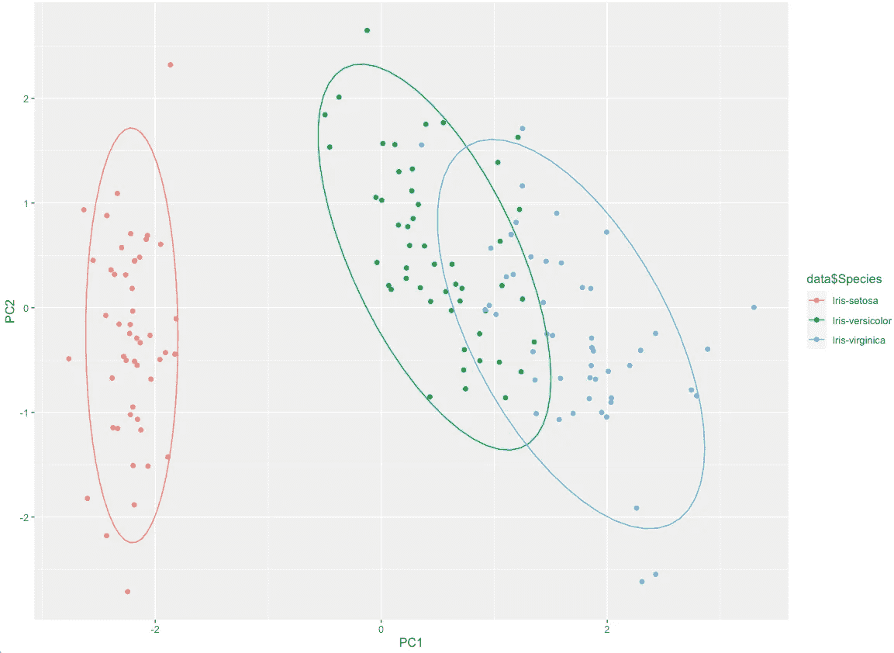

作者图片

## 5.3 地块荷载

如果我们想知道每个变量对前两个主成分的形成有多大影响，我们可以画出载荷。

```
*# Graph of loadings*
fviz_pca_var(iris_pca, 
            col.var = 'contrib',
            repel = TRUE # Do not overlap text
            )
```


作者图片

该图显示，对于第一主成分，花瓣具有正相关性。长度，花瓣。宽度和萼片。第二个主成分对所有的特征都有负的系数，尽管对花瓣的相关性。长度和花瓣。宽度非常小。

## 5.4 显示分数和负荷的双标图

我们也可以使用双标图在同一个图中显示得分和负载。

```
*# Biplot of individuals and variables*
fviz_pca_biplot(iris_pca, 
                col.var = 'blue', # color of variables
                col.ind = 'darkgray', # color of individuals 
                )
```

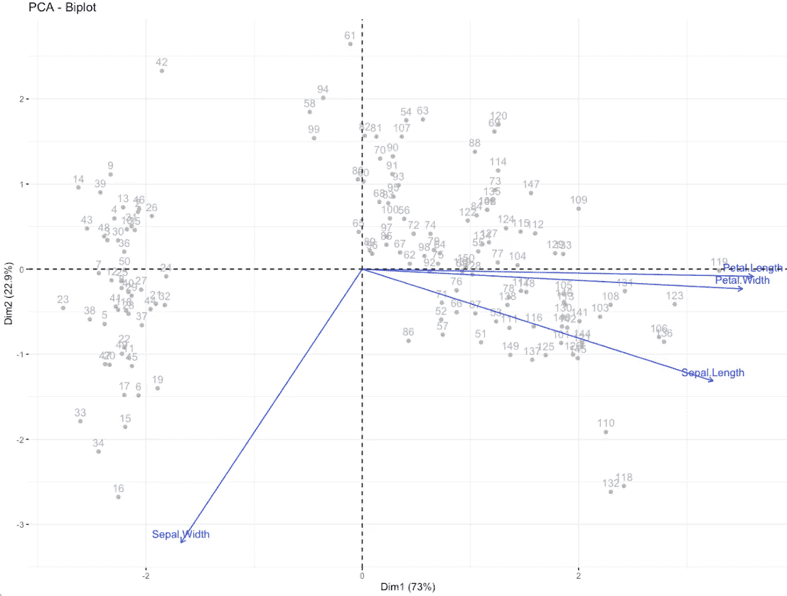

作者图片

我希望这篇指南能帮助你更好地理解主成分分析及其工作原理。Python 和 R 中的示例旨在让您了解可以使用什么类型的图来解释 PCA 的结果。在 PCA 的实际应用中，您可能会发现自己处理的数据要大得多，可能不如 iris 数据集直观。毕竟，PCA 是一种常用的降维技术。但是具有小的、良好的数据的例子是理解方法元素的好方法。我希望这篇文章能帮助您理解如何使用协方差矩阵、特征值和特征向量来寻找我们的主成分和主成分得分，以及它们如何表示原始数据。